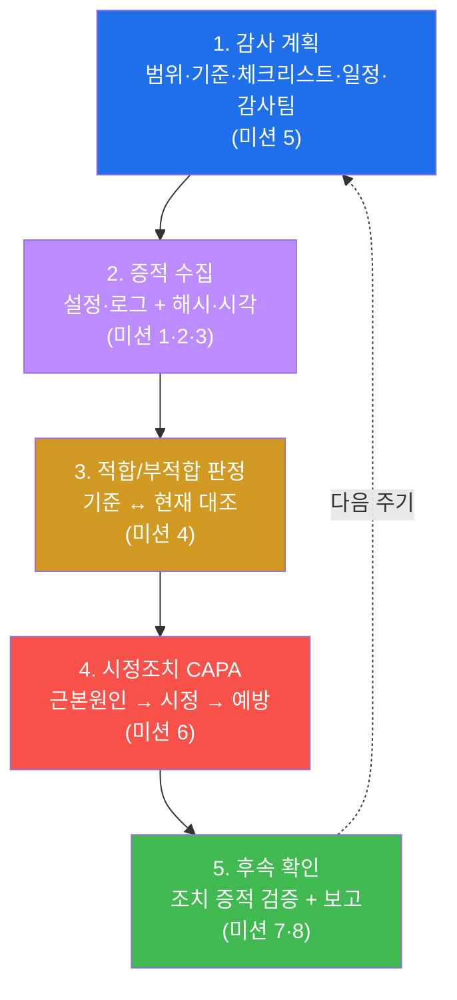
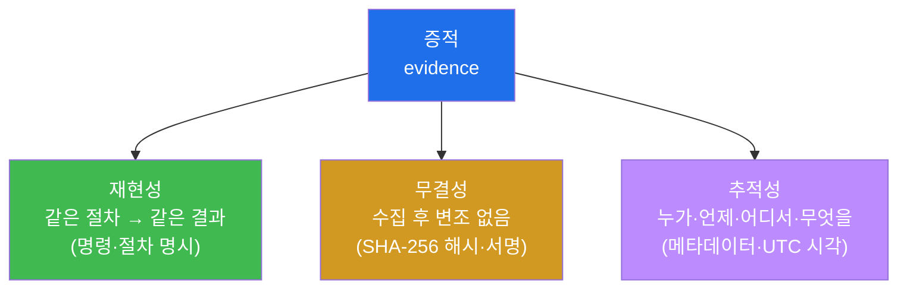
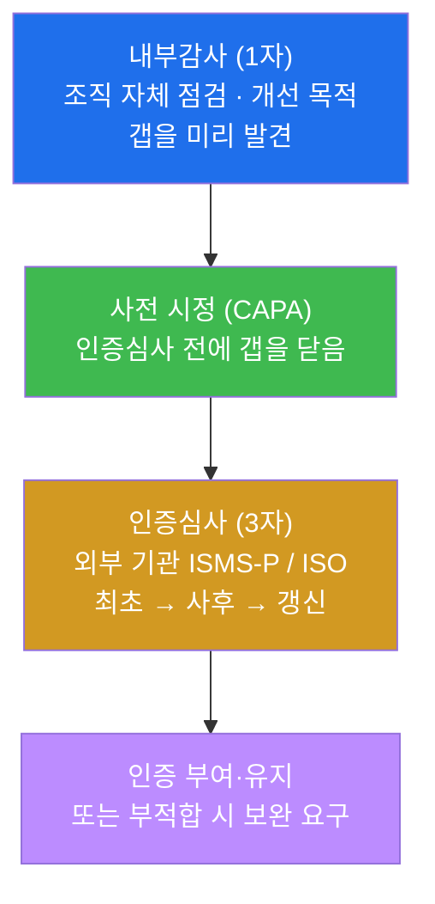
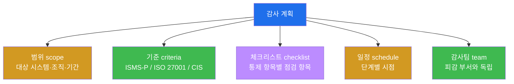
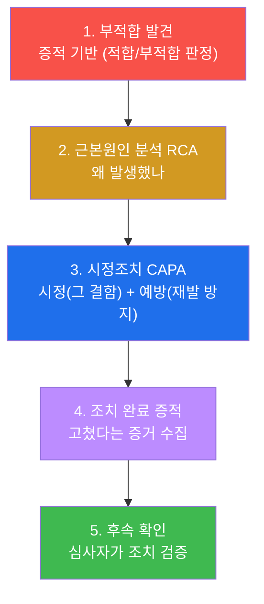
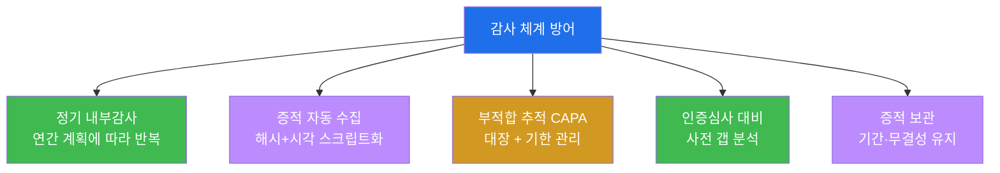
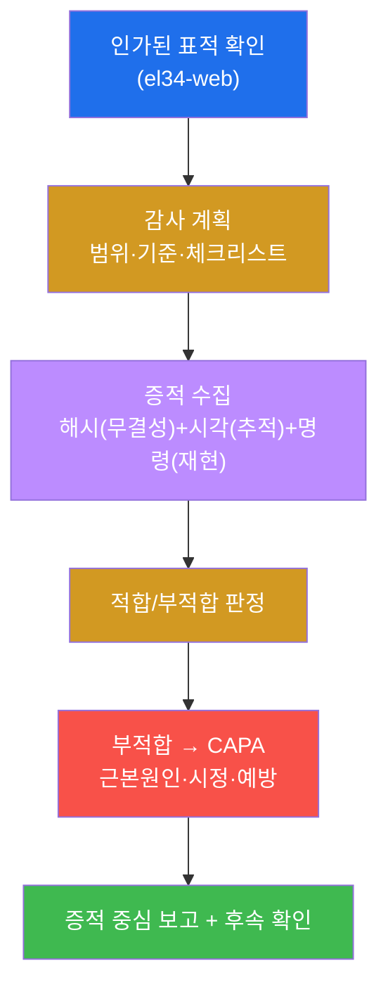
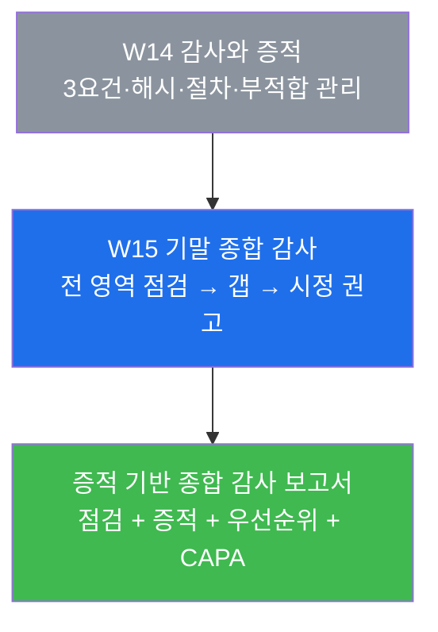

# 컴플라이언스 W14 — 감사와 증적 수집: 재현성·무결성·추적성으로 "증명하는" 감사 (ISO 19011)

> **본 주차의 한 줄 요약**
>
> 지난 13주 동안 학생은 컴플라이언스의 통제 영역을 하나씩 점검하는 법을 익혔다. 본 주차는 그 점검을
> 누가 보더라도 **믿을 수 있는 형태**로 만드는 마지막 기술 — **감사(audit)와 증적(evidence) 수집** — 을
> 다룬다. 감사자는 "우리는 통제하고 있다"는 **말**이 아니라, **재현 가능하고 무결성이 보장되며 추적
> 가능한 증거**를 요구한다. 학생은 감사의 국제 표준인 **ISO 19011**의 절차(계획 → 증적 수집 → 적합/부적합
> 판정 → 시정조치 → 후속 확인)를 따라, `el34-web` 의 실제 설정 파일에 **SHA-256 해시 + 수집 시각**을 함께
> 남겨 **증거능력 있는 증적**을 직접 만들어 본다.
>
> **감사자 한 줄 결론**: 감사에서 가장 중요한 격언은 **"증명할 수 없으면 하지 않은 것이다(If it isn't
> documented, it didn't happen)"** 이다. 통제가 아무리 잘 갖춰져 있어도, 그것을 **재현·무결성·추적**의
> 세 요건을 갖춘 증적으로 입증하지 못하면 감사에서는 **부적합(NC)** 판정을 받는다. 본 주차는 점검 결과를
> 증거로 전환하는 기술을 손에 익히는 주다.

---

## 학습 목표

본 주차 종료 시 학생은 다음 6가지를 **본인 손으로** 할 수 있어야 한다.

1. **감사(audit)의 국제 표준 ISO 19011**이 정의하는 감사의 5단계(계획 → 증적 수집 → 적합/부적합 판정 →
   시정조치(CAPA) → 후속 확인)를 비유 없이 1분 안에 설명하고, 각 단계에서 무엇이 산출되는지 말한다.
2. **증적(evidence)의 3요건 — 재현성·무결성·추적성** 을 정의하고, 어느 하나라도 빠지면 그 증거가 왜
   감사에서 효력을 잃는지 구체적 예로 설명한다.
3. el34 호스트(`ssh ccc@192.168.0.151`)에서 `docker exec el34-web` 로 설정 파일에 **`sha256sum`(무결성)
   + `date -u`(추적) + 명령 자체(재현)** 를 함께 남겨, 감사에서 인정되는 증적을 직접 수집한다.
4. **내부감사(internal audit)와 인증심사(certification audit, ISMS-P/ISO)** 의 목적·수행 주체·독립성
   요건의 차이를 구분하고, 왜 둘 다 필요한지(내부감사로 갭을 미리 닫아야 인증심사를 통과한다)를 논증한다.
5. **부적합(NC, Non-Conformity)** 을 중부적합(Major)/경부적합(Minor)으로 구분하고, 발견 → 근본원인
   분석 → **시정조치(CAPA)** → 조치 증적 → 후속 확인으로 이어지는 부적합 관리 흐름을 설명한다.
6. 증적 수집·3요건·감사 유형·감사 계획·부적합 관리를 묶어, **감사 제출용 보고서**(증적 + 계획/유형 +
   부적합 CAPA)를 작성한다.

> **감사자의 시선** — 본 주차는 새로운 통제를 배우는 주가 아니라, 지금까지 배운 점검을 **증거로
> 전환하는 방법론**을 배우는 주다. 채점은 "통제가 있다"는 선언이 아니라, **재현·무결성·추적의 3요건을
> 갖춘 증적을 실제로 만들었는가**, 그리고 그것을 감사 절차(계획·판정·부적합 관리) 안에 자리매김했는가를
> 본다.

---

## 강의 시간 배분 (총 3시간 40분)

| 시간        | 내용                                                                          | 유형      |
|-------------|-------------------------------------------------------------------------------|-----------|
| 0:00–0:20   | 이론 — 왜 "말"이 아니라 "증적"인가: ISO 19011 과 감사 5단계                    | 강의      |
| 0:20–0:55   | 이론 — 증적의 3요건(재현성·무결성·추적성) + 해시(SHA-256)로 무결성 입증        | 강의      |
| 0:55–1:05   | 휴식                                                                           | —         |
| 1:05–1:35   | 이론 — 내부감사 vs 인증심사 + 부적합(NC)/CAPA 관리                            | 강의/토론 |
| 1:35–2:00   | 실습 — 점검(대상 도달) + 증적 수집(해시+시각) (lab 1–2)                       | 실습      |
| 2:00–2:30   | 실습 — 증적 3요건 + 내부감사 vs 인증심사 (lab 3–4)                            | 실습      |
| 2:30–2:40   | 휴식                                                                           | —         |
| 2:40–3:10   | 실습 — 감사 계획 + 부적합(NC) 관리 CAPA (lab 5–6)                             | 실습      |
| 3:10–3:30   | 실습 — 방어(감사 체계) + 감사 보고서 (lab 7–8)                                | 실습      |
| 3:30–3:40   | 정리 + 다음 주차(W15 — 기말 종합 감사) 예고                                   | 정리      |

---

## 0. 용어 해설 (감사와 증적 입문)

본 주차에서 처음 등장하거나 특히 중요한 용어를 먼저 정리한다. 한 줄 정의로 부족한 핵심어는 §0.5 에서
일상 비유로 다시 푼다.

| 용어 | 영문 | 뜻 | 비유 |
|------|------|----|------|
| **감사** | Audit | 기준 충족 여부를 **증거 기반으로** 점검·판정·보고하는 체계적·독립적 과정 | 건물 안전을 의뢰받아 절차대로 검사하는 일 |
| **ISO 19011** | ISO 19011 | 경영시스템 **감사 수행 지침**을 정한 국제 표준(감사 원칙·계획·수행·역량) | 감사자가 따라야 할 표준 검사 매뉴얼 |
| **증적** | Evidence | 판정을 뒷받침하는, 검증 가능한 기록(설정 출력·로그·해시) | 검사 결과를 입증하는 사진·기록지 |
| **재현성** | Reproducibility | 같은 점검을 반복하면 같은 결과가 나오도록 명령·절차를 명시한 성질 | 같은 검사법으로 다시 재면 같은 값 |
| **무결성** | Integrity | 수집 후 증적이 **변조되지 않았음**을 입증할 수 있는 성질 | 봉인된 증거 봉투 — 뜯기면 표시가 남음 |
| **추적성** | Traceability | 누가·언제·어디서·무엇을 수집했는지 따라갈 수 있는 성질 | 증거에 붙은 채취자·일시·장소 라벨 |
| **해시** | Hash | 데이터를 고정 길이 지문으로 바꾸는 일방향 함수(1 비트만 바뀌어도 값이 완전히 달라짐) | 문서의 고유 지문 |
| **SHA-256** | Secure Hash Algorithm 256-bit | 256비트(64자리 16진수) 해시를 만드는 표준 해시 알고리즘 | 256비트 길이의 표준 지문 |
| **내부감사** | Internal Audit | 조직이 **스스로** 수행하는 점검(개선 목적, 1자 감사) | 출시 전 자체 안전 점검 |
| **인증심사** | Certification Audit | **외부 인증기관**이 인증 부여·유지를 위해 수행하는 심사(3자 감사) | 국가 공인기관의 안전 인증 |
| **ISMS-P** | 정보보호 및 개인정보보호 관리체계 | 한국의 정보보호·개인정보 관리체계 **인증** 제도 | 국가 공인 안전 관리체계 인증 |
| **부적합** | NC, Non-Conformity | 점검 항목이 기준(요구사항)에 **미달**한 상태(고쳐야 할 결함) | 안전 기준 미달로 적발된 결함 |
| **중부적합** | Major NC | 통제가 부재하거나 체계가 무너진 **심각한** 부적합 | 비상구가 아예 없는 수준의 중대 결함 |
| **경부적합** | Minor NC | 통제는 있으나 **일부 미흡**한 부적합 | 비상구는 있으나 표지판이 일부 빠짐 |
| **시정조치** | CAPA, Corrective and Preventive Action | 부적합의 **원인을 제거**(시정)하고 **재발을 막는**(예방) 조치 | 고장 부위를 고치고, 같은 고장이 안 나게 점검을 추가 |
| **근본원인 분석** | RCA, Root Cause Analysis | "왜 발생했나"를 끝까지 파고들어 진짜 원인을 찾는 기법 | 증상이 아니라 병의 원인을 찾기 |

---

## 0.5 신입생 친화 핵심 용어 개념 설명

위 표는 한 줄 정의라 처음 보는 학생에게는 부족하다. 본 절에서는 감사와 증적을 처음 만나는 학생이 가장
헷갈리는 핵심 4 용어를 일상 비유와 함께 풀어 설명한다.

### 0.5.1 증적 — 법정의 "증거 봉투" 비유

학생이 형사 드라마를 떠올려보자. 사건 현장에서 수사관이 칼 한 자루를 발견했다고 하자. 그 칼이 법정에서
**증거로 인정**되려면 단순히 "현장에 있었다"는 말로는 부족하다. 세 가지가 함께 따라붙어야 한다.

- 칼을 **봉인된 증거 봉투**에 넣어 누구도 몰래 바꿔치기하지 못하게 한다. 봉투가 뜯기면 표시가 남는다.
- 봉투에 **언제·어디서·누가** 수집했는지 라벨을 붙인다.
- 같은 절차로 다시 채취해도 같은 결론에 이를 수 있도록 **수집 방법**을 기록한다.

이 세 장치가 갖춰지지 않은 증거는 법정에서 "이 칼이 정말 현장의 그 칼인지, 도중에 바뀌지 않았는지 알 수
없다"는 이유로 **증거능력을 잃는다**. 컴플라이언스 감사도 똑같다. 감사자가 수집한 설정 파일·로그가
증적으로 인정받으려면 — **무결성**(봉인), **추적성**(라벨), **재현성**(수집 방법) 의 세 요건을 갖춰야
한다. 이것이 §3 에서 다룰 **증적의 3요건**이다.

| 법정의 증거 | 컴플라이언스 증적 |
|--------------|-------------------|
| 봉인된 증거 봉투 | 해시(SHA-256)로 변조 없음 증명 = **무결성** |
| 채취자·일시·장소 라벨 | 수집 시각(UTC)·대상·수집자 메타데이터 = **추적성** |
| 표준 채취 절차 | 같은 명령으로 재현 = **재현성** |
| "현장에 있었다"는 말뿐 | 증거능력 없음 → 감사에서 **부적합(NC)** |

### 0.5.2 해시(SHA-256) — 문서의 "지문" 비유

학생이 손가락 지문을 떠올려보자. 사람마다 지문이 다르고, 같은 사람은 언제 찍어도 같은 지문이 나온다.
그리고 지문만 보고 원래 손가락을 복원할 수는 없다.

**해시(hash)** 는 데이터의 지문이다. 어떤 파일이든 입력하면 **고정 길이의 짧은 값**(지문)이 나온다.

- **같은 파일은 언제 계산해도 같은 해시**가 나온다. → 그래서 "이 파일이 그때 그 파일과 같은가?"를 해시
  비교 한 번으로 확인할 수 있다.
- **파일이 1 비트라도 바뀌면 해시가 완전히 달라진다.** → 그래서 누군가 로그 한 글자를 몰래 고치면 즉시
  들통난다. 이것이 **무결성** 입증의 원리다.
- **해시로부터 원래 파일을 되돌릴 수 없다(일방향).** → 해시 자체를 공개해도 원본이 새지 않는다.

el34 실습에서 쓰는 **`sha256sum`** 은 **SHA-256** 알고리즘으로 이 지문을 만드는 표준 명령이다. SHA-256
은 256비트, 즉 **64자리 16진수** 지문을 만든다. 감사자가 설정 파일을 수집할 때 그 파일의 SHA-256 해시를
함께 기록해 두면, 나중에 "이 증적이 수집 당시와 똑같은가"를 해시를 다시 계산해 대조함으로써 증명할 수
있다.

> **참고 — 왜 MD5/SHA-1 이 아니라 SHA-256 인가.** 과거에 쓰던 MD5·SHA-1 은 서로 다른 두 입력이 같은
> 해시를 갖도록 만드는 **충돌(collision)** 공격이 현실화되어, 증적의 무결성 입증에는 더 이상 쓰지
> 않는다. 현재 표준은 SHA-256(SHA-2 계열) 이상이다. 학습 환경의 `sha256sum` 이 바로 이 표준을 쓴다.

### 0.5.3 내부감사 vs 인증심사 — "출시 전 자체 점검" vs "국가 공인 인증" 비유

학생이 자동차 공장을 떠올려보자. 새 차를 출시하기 전, 공장은 두 종류의 검사를 거친다.

- **공장 자체 품질팀의 점검** — 생산 라인의 직원이 아니라 **독립된 품질팀**이 출시 전에 차를 뜯어보고
  결함을 찾는다. 목적은 **개선** 이다. 결함이 나오면 출시 전에 고친다. 이것이 **내부감사(internal
  audit)** 다. 조직이 **스스로** 하는 점검이라 "1자(first-party) 감사" 라고도 한다.
- **국가 공인기관의 인증 검사** — 공장 바깥의 **외부 인증기관**이 와서 "이 차는 안전 기준을 충족한다"는
  **공식 인증서**를 발급한다. 목적은 **인증(부여·유지)** 이다. 이것이 **인증심사(certification
  audit)** 다. 한국 정보보호 분야에서는 **ISMS-P**(정보보호 및 개인정보보호 관리체계 인증)가 대표적이며,
  국제적으로는 ISO/IEC 27001 인증이 이에 해당한다. 외부 기관이 하므로 "3자(third-party) 감사" 라고 한다.

핵심은 **둘 다 필요하다**는 것이다. 내부감사로 결함(갭)을 **미리** 찾아 고쳐 두지 않으면, 비싼 외부
인증심사에서 부적합이 무더기로 나와 인증을 못 받는다. 그래서 잘 운영되는 조직은 인증심사 **전에** 내부
감사로 한 바퀴 돌려 갭을 닫아 둔다.

| 구분 | 내부감사 | 인증심사 |
|------|----------|----------|
| 수행 주체 | 조직 내부의 독립 부서(1자) | 외부 인증기관(3자) |
| 목적 | 개선(갭을 미리 발견·시정) | 인증 부여·유지 |
| 주기 | 자율(연 1회 이상 권고) | 최초 → 사후(매년) → 갱신(보통 3년) |
| 결과 | 내부 개선 과제 | 인증서 발급/유지/취소 |
| 공통점 | **둘 다 독립성 + 증적 기반 판정** | (좌동) |

> **헷갈리기 쉬운 점 — "독립성"은 둘의 공통 조건이다.** 내부감사라도 **자기가 운영하는 시스템을 자기가
> 감사하면** 객관성이 무너진다. 그래서 내부감사도 피감 부서와 **독립된** 인력이 수행한다. 인증심사는
> 아예 조직 외부 기관이 하므로 독립성이 구조적으로 보장된다. 감사가 신뢰받는 첫 번째 조건이 바로 이
> **독립성**이다.

### 0.5.4 부적합(NC)과 CAPA — "병의 증상이 아니라 원인을 고친다" 비유

학생이 천장에서 물이 새는 집을 떠올려보자. 바닥에 양동이를 받쳐 두는 것은 **증상**만 막는 임시 조치다.
며칠 뒤 또 샌다. 제대로 고치려면 **왜 새는지**(지붕 방수층 균열)를 찾아 그 원인을 막아야 하고, 나아가
**다른 곳도 같은 이유로 새지 않는지** 점검해 재발을 막아야 한다.

감사에서 발견된 결함을 **부적합(NC, Non-Conformity)** 이라고 한다. 부적합을 처리하는 표준 방법이
**CAPA(Corrective and Preventive Action, 시정 및 예방 조치)** 다.

- **시정(Corrective)** — 발견된 그 결함 자체를 고친다(=물 새는 그 지점 보수). 그 전에 반드시 **근본원인
  분석(RCA)** 으로 "왜 발생했나"를 찾는다. 증상만 덮으면 재발하기 때문이다.
- **예방(Preventive)** — 같은 원인으로 다른 곳에서 재발하지 않도록 **체계**를 보강한다(=전체 방수
  재점검, 점검 주기 신설).

부적합은 심각도에 따라 둘로 나뉜다. **중부적합(Major)** 은 통제가 아예 없거나 체계가 무너진 심각한
경우(예: 로그 수집 자체가 없음)로, 인증을 막을 수 있는 결함이다. **경부적합(Minor)** 은 통제는 있으나
일부가 미흡한 경우(예: 로그는 모으나 보존 기간이 짧음)다. 어느 쪽이든 **기한 내 조치 의무**가 있으며,
조치 후에는 **조치가 실제로 됐다는 증적**과 함께 **후속 확인**을 받는다.

> **핵심 — 부적합은 처벌이 아니라 개선 기회다.** 감사의 목적은 결함을 찾아 벌하는 것이 아니라, 근본원인을
> 제거해 조직을 더 안전하게 만드는 것이다. 그래서 좋은 CAPA 는 "고쳤다"로 끝나지 않고 "같은 원인이 다시는
> 부적합을 만들지 않도록 체계를 바꿨다"까지 간다.

---

## 1. 왜 "말"이 아니라 "증적"인가 — ISO 19011 과 감사의 본질

### 1.1 한 줄 답: 감사는 주장이 아니라 증거로 판정한다

W01–W13 에서 학생은 통제를 영역별로 점검했다. 그런데 점검 결과를 **누가 보더라도 믿을 수 있게** 만들지
못하면, 그 점검은 감사에서 효력이 없다. 감사의 가장 유명한 격언이 이것을 압축한다 — **"증명할 수 없으면
하지 않은 것이다."** 조직이 "우리는 모든 접근을 통제하고 로그를 남깁니다"라고 **말**해도, 감사자는 그
말을 믿지 않는다. 감사자가 믿는 것은 오직 **증거**다 — 실제 설정 출력, 실제 로그, 변조되지 않았음을
보증하는 해시.

이것이 가혹해 보일 수 있지만 이유가 분명하다. 감사는 **객관적·반복 가능한 과정**이어야 하기 때문이다.
감사자 A 와 감사자 B 가 같은 시스템을 봤을 때 같은 결론에 도달하지 않는다면, 그것은 감사가 아니라 개인의
인상(印象)일 뿐이다. 증거에 기반해야 누가 보든 같은 판정에 이르고, 작년 감사와 올해 감사를 비교해 "갭이
줄었는가"를 추적할 수 있다.

### 1.2 ISO 19011 — 감사를 수행하는 국제 표준

감사를 **어떻게 수행하는가**를 정한 국제 표준이 **ISO 19011** 이다.

> **용어 — ISO 19011.** ISO(국제표준화기구)가 펴낸 **"경영시스템 감사 지침(Guidelines for auditing
> management systems)"** 표준이다. 무엇을 점검할지(통제 항목)는 ISMS-P·ISO 27001·PCI-DSS 같은 **기준
> 표준**이 정하고, 그 점검을 **어떤 절차·원칙·역량으로 수행할지**는 ISO 19011 이 정한다. 즉 ISO 19011 은
> "감사하는 방법"의 표준이다.

ISO 19011 이 강조하는 **감사의 원칙** 중 본 주차에 직접 닿는 것은 다음 셋이다.

- **무결성·공정성(integrity, fair presentation)** — 감사자는 발견한 사실을 있는 그대로, 증거에 근거해
  보고한다. 좋게 포장하거나 숨기지 않는다.
- **증거 기반 접근(evidence-based approach)** — 모든 결론은 **검증 가능한 증거**에서 나와야 한다. 이것이
  본 주차의 핵심이며, §3 의 증적 3요건으로 구체화된다.
- **독립성(independence)** — 감사자는 피감 대상으로부터 독립적이어야 객관성이 보장된다(§4 의 내부감사
  /인증심사 모두의 전제).

### 1.3 감사의 5단계 — 계획에서 후속 확인까지

ISO 19011 의 감사 과정은 다음 5단계로 한 바퀴를 돈다. 이 흐름이 본 주차 lab 8 미션의 골격이다.



각 단계는 산출물이 분명하다. **계획**은 무엇을·어느 기준으로 점검할지 정한 체크리스트를 낳고, **증적
수집**은 재현·무결성·추적을 갖춘 증거를 낳으며, **판정**은 적합/부적합을, **시정조치(CAPA)** 는 부적합의
근본원인을 제거한 조치와 그 증적을, **후속 확인**은 조치가 실제로 완료됐다는 검증과 최종 보고서를 낳는다.
그리고 이 한 바퀴가 끝나면 다음 주기의 계획으로 다시 이어진다 — 감사는 1회성이 아니라 순환이다.

### 1.4 한계 — 증적이 통제 자체를 대신하지는 않는다

증적을 잘 모으는 것이 본 주차의 목표지만, 증적은 어디까지나 **통제가 작동했음을 입증하는 수단**이지
통제 그 자체가 아니다. 완벽하게 수집된 로그가 있어도, 그 로그가 가리키는 통제가 부실하면 결과는 부적합
이다. 또한 증적은 **수집 시점의 사실**만 증명한다 — 어제 무결했다고 오늘도 무결한 것은 아니므로, 감사는
**정기적**으로 반복해야 한다. 본 주차는 "증거를 어떻게 만드는가"에 집중하고, 그 증거가 가리키는 통제의
충분성은 W01–W13 에서 영역별로 다룬 내용이다.

---

## 2. 증적 수집 — 재현·무결성·추적을 한 번에 남기는 법

### 2.1 한 줄 정의: 점검 결과에 "해시 + 시각 + 명령"을 함께 남기는 것

증적 수집(evidence collection)은 단순히 설정 파일을 복사해 두는 것이 아니다. 그 설정이 **수집 당시와
변하지 않았음**(무결성), **언제·무엇을** 수집했는지(추적성), **어떻게 다시 확인할 수 있는지**(재현성)를
함께 남기는 것이다. 셋이 한 묶음이어야 증거능력이 생긴다.

### 2.2 왜 중요한가 — 셋 중 하나만 빠져도 무너진다

설정 파일만 덜렁 캡처해 두면 어떤 일이 벌어지는가. 6개월 뒤 인증심사에서 심사원이 "이 캡처가 정말 그때
시스템 상태입니까? 중간에 누가 고치지 않았습니까?"라고 물으면 답할 수 없다. **무결성**이 없기 때문이다.
"언제 수집했습니까?"에도 답할 수 없으면 **추적성**이 없는 것이고, "제가 직접 다시 확인해도 됩니까?"에
방법을 못 대면 **재현성**이 없는 것이다. 세 질문 중 하나라도 막히면 그 증적은 신뢰를 잃는다.

### 2.3 el34 에서 어떻게 — `sha256sum` + `date -u`

el34 실습에서는 `el34-web` 의 보안 설정 파일에 대해 **해시와 수집 시각을 한 명령으로** 남긴다.

```bash
docker exec el34-web sh -c "sha256sum /etc/apache2/conf-available/security.conf; date -u +%Y-%m-%dT%H:%M:%SZ"
```

이 한 줄이 증적 3요건을 동시에 충족하는 방식을 뜯어보자.

- **`sha256sum /etc/apache2/conf-available/security.conf`** — 이 설정 파일의 SHA-256 지문(64자리
  16진수)을 출력한다. 나중에 같은 명령을 다시 돌려 지문이 같으면 "그 사이 파일이 바뀌지 않았다"가
  증명된다. → **무결성**.
- **`date -u +%Y-%m-%dT%H:%M:%SZ`** — 수집 시각을 **UTC(협정 세계시)** 로, 표준 형식(ISO 8601)으로
  남긴다. "언제 수집했나"의 기록이다. → **추적성**.
- **명령 자체** — 누구든 이 명령을 그대로 다시 실행하면 같은 절차로 같은 결과를 얻는다. → **재현성**.

> **용어 — `date -u` 와 UTC.** `-u` 는 시각을 **UTC**(시차 없는 세계 표준시)로 출력하라는 옵션이다.
> 감사 증적의 시각은 반드시 표준 시간대로 남긴다. 수집자마다 로컬 시간(한국 KST, 미국 PST 등)으로
> 적으면, 여러 시스템의 로그를 모아 사건 순서를 맞출 때 혼선이 생기기 때문이다. `%Y-%m-%dT%H:%M:%SZ` 는
> `2026-06-14T07:30:00Z` 같은 **ISO 8601** 표준 형식으로, 끝의 `Z`(Zulu)가 UTC 임을 뜻한다.

출력 예시(값은 매번 다르다):

```
3a7bd3e2360a3d... (64자)  /etc/apache2/conf-available/security.conf
2026-06-14T07:30:00Z
```

이 출력이 곧 증적이다 — 파일의 지문(무결성) + 수집 시각(추적) 이 한 화면에 있고, 명령을 알므로 재현된다.

### 2.4 한계 — 시점 증적이지 상시 무결성 보장은 아니다

이 방식은 **수집 시점**의 무결성·추적을 보장한다. 그러나 수집 이후 파일이 다시 바뀌는 것까지 막지는
못한다(그것은 **FIM**, 파일 무결성 모니터링의 영역으로 W06 에서 다뤘다). 또한 해시를 기록한 **증적
대장 자체**가 변조되면 의미가 없으므로, 실무에서는 증적 대장을 별도의 안전한 저장소(쓰기 후 읽기 전용,
중앙 SIEM 등)에 보관한다. 본 주차는 "한 건의 증적을 3요건에 맞게 만드는" 기본기에 집중한다.

---

## 3. 증적의 3요건 — 재현성·무결성·추적성

### 3.1 세 요건의 정의

§0.5.1 의 법정 증거 봉투 비유를 표준 용어로 정리하면 다음과 같다. 이 셋은 증적이 갖춰야 할 **최소
조건**이며, 하나라도 빠지면 증거능력이 약해진다.



- **재현성(Reproducibility)** — 같은 점검을 반복하면 같은 결과가 나오도록 **명령과 절차**를 명시한다.
  "그냥 봤더니 그랬다"가 아니라 "이 명령으로 확인했다"여야 다른 사람이 검증할 수 있다.
- **무결성(Integrity)** — 수집한 증적이 그 뒤로 **변조되지 않았음**을 입증할 수 있어야 한다. SHA-256
  해시나 디지털 서명이 이 역할을 한다(§0.5.2).
- **추적성(Traceability)** — **누가·언제·어디서·무엇을** 수집했는지 메타데이터로 남겨, 증적의 출처를
  끝까지 따라갈 수 있어야 한다. 수집 시각(UTC)·대상 파일·수집자가 여기에 해당한다.

### 3.2 왜 중요한가 — 세 요건이 막는 세 가지 의심

세 요건은 각각 감사에서 나올 수 있는 **세 가지 의심**을 정면으로 막는다.

| 감사자/심사원의 의심 | 막아 주는 요건 | el34 에서의 장치 |
|----------------------|----------------|------------------|
| "제가 직접 다시 확인해도 됩니까?" | 재현성 | 동일한 `docker exec ... sha256sum` 명령 |
| "중간에 누가 바꾸지 않았습니까?" | 무결성 | SHA-256 해시 대조 |
| "언제·어디서 수집한 겁니까?" | 추적성 | `date -u`(UTC) + 대상 파일 경로 |

### 3.3 한계 — 3요건은 "증거능력"이지 "충분성"이 아니다

3요건을 모두 갖춘 증적이라도, 그것이 **충분한** 증거인지는 별개다. 예컨대 설정 파일 하나만 완벽한
3요건으로 수집했어도, 그 통제 영역을 입증하기에 그 파일 하나로는 부족할 수 있다(여러 증적을 교차로
모아야 하는 경우). 3요건은 **각 증적의 신뢰성**을 보장하는 조건이고, 어떤·얼마나 많은 증적을 모을지는
감사 계획(§5)에서 정한다.

---

## 4. 내부감사 vs 인증심사 — 두 감사의 역할 분담

### 4.1 한 줄 정의

§0.5.3 에서 비유로 본 두 감사를 표준 관점에서 다시 정리한다. **내부감사**는 조직이 **스스로** 개선을
위해 하는 1자 감사이고, **인증심사**는 **외부 인증기관**이 인증을 부여·유지하기 위해 하는 3자 감사다.

### 4.2 왜 둘 다 필요한가 — 내부감사가 인증심사의 안전망



내부감사로 갭을 미리 닫지 않으면, 외부 인증심사에서 부적합이 무더기로 나와 인증을 못 받거나 보완에 큰
비용이 든다. 그래서 내부감사는 **인증심사의 안전망**이다. 잘 운영되는 조직은 인증심사 일정 전에 반드시
내부감사를 한 바퀴 돌려 갭을 정리한다.

### 4.3 인증심사의 주기 — 최초·사후·갱신

> **용어 — 최초/사후/갱신 심사.** 인증은 한 번 받고 끝이 아니다. **최초 심사**로 인증을 처음 받고,
> 인증 유지를 위해 매년 **사후 심사**(사후관리)를 받으며, 인증 유효기간(보통 3년)이 끝나면 **갱신
> 심사**로 다시 받는다. ISMS-P 도 이 구조를 따른다. 즉 인증은 **유지·갱신되는 상태**이지 일회성
> 자격증이 아니다.

### 4.4 한계 — 어느 쪽도 "한 번"으로 끝나지 않는다

내부감사든 인증심사든 **반복**이 본질이다. 내부감사를 한 번 하고 "이제 됐다"고 멈추면 그 사이 생긴 새
갭을 놓치고, 인증도 사후·갱신 심사를 통과하지 못하면 취소된다. 또한 내부감사가 형식적으로(피감 부서가
자기 일을 자기가 점검) 운영되면 독립성이 무너져 인증심사에서 신뢰받지 못한다 — 내부감사의 독립성 확보가
실무의 핵심 과제다.

---

## 5. 감사 계획 — 빠짐없는 감사를 위한 설계

### 5.1 한 줄 정의

감사 계획(audit plan)은 감사를 시작하기 전에 **무엇을·어느 기준으로·언제·누가** 점검할지 미리 설계하는
단계다. 계획 없는 감사는 누락과 중복을 낳는다.

### 5.2 무엇을 담나 — 다섯 요소



- **범위(scope)** — 어느 시스템·조직·기간을 감사할지 경계를 정한다. 범위가 흐리면 "점검 안 한 영역"이
  생긴다.
- **기준(criteria)** — 무엇에 비추어 적합/부적합을 판정할지 정한다. ISMS-P·ISO 27001·CIS 같은 표준이
  기준이 된다. 판정에는 **항상 근거 기준**이 붙어야 한다.
- **체크리스트(checklist)** — 기준의 각 통제 항목을 점검 가능한 질문 목록으로 풀어 둔다. 빠짐없이 훑게
  하는 장치다.
- **일정(schedule)** — 단계별 시점과 피감 부서와의 협의 시간을 정한다.
- **감사팀(team)** — 피감 부서와 **독립된** 인력으로 구성한다(§1.2 독립성 원칙).

### 5.3 왜 중요한가, 그리고 한계

계획 없이 즉흥적으로 감사하면 한 영역은 과하게 보고 다른 영역은 통째로 빠뜨리기 쉽다. 기준 기반
체크리스트는 이 누락을 막는 핵심 장치다. 다만 계획은 어디까지나 **출발점**이다 — 감사 도중 예상치 못한
부적합이 드러나면 범위를 넓히기도 하고(현장 판단), 계획대로만 보다가 명백한 위험을 놓쳐서도 안 된다.
좋은 감사자는 계획을 따르되 현장에서 유연하게 조정한다.

---

## 6. 부적합(NC) 관리 — 발견에서 후속 확인까지 (CAPA)

### 6.1 한 줄 정의

부적합 관리는 감사에서 발견된 결함(NC)을 **근본원인까지 파고들어 시정·예방(CAPA)** 하고, 조치가 실제로
완료됐음을 증적과 함께 **후속 확인**하는 과정이다.

### 6.2 부적합 관리의 흐름



부적합을 발견하면 곧장 고치는 것이 아니라, 먼저 **근본원인(RCA)** 을 찾는다. 증상만 덮으면 재발하기
때문이다. 그다음 **시정(그 결함을 고침)** 과 **예방(같은 원인의 재발을 막는 체계 보강)** 을 함께
수행한다 — 이 둘을 묶은 것이 **CAPA** 다. 조치 후에는 **고쳤다는 증적**(§2 의 3요건을 갖춘)을 남기고,
마지막으로 심사자가 그 조치가 실제로 됐는지 **후속 확인**한다.

### 6.3 중부적합 vs 경부적합

부적합은 심각도로 나뉜다. **중부적합(Major)** 은 통제가 부재하거나 체계가 무너진 심각한 결함으로,
인증을 막을 수 있고 **즉시·기한 내 조치**가 의무다. **경부적합(Minor)** 은 통제는 있으나 일부가 미흡한
경우다. 둘 다 방치는 허용되지 않으며, 정해진 기한 안에 CAPA 를 완료해야 한다.

| 구분 | 정의 | 예 | 영향 |
|------|------|----|------|
| **중부적합 Major** | 통제 부재 / 체계 붕괴 | 감사 로그를 아예 수집하지 않음 | 인증 거부 가능, 기한 내 시정 의무 |
| **경부적합 Minor** | 통제는 있으나 일부 미흡 | 로그는 모으나 보존 기간 미달 | 인증 가능하나 기한 내 시정 필요 |

### 6.4 왜 중요한가, 그리고 한계

부적합 관리가 없으면 감사는 "결함 목록"을 만들고 끝나며, 같은 결함이 매년 반복된다. CAPA 의 핵심 가치는
**근본원인 제거로 재발을 끊는** 데 있다 — 그래서 부적합은 처벌이 아니라 개선 기회다(§0.5.4). 다만 CAPA
도 형식적으로 운영되면(원인 분석 없이 "고쳤음"만 기록) 재발을 막지 못한다. 진짜 CAPA 는 RCA 에 충분한
공을 들이고, 조치의 효과를 후속 확인으로 검증하는 데까지 간다.

---

## 7. 감사 체계의 방어 관점 — 상시 증적과 부적합 추적

본 트랙의 다른 주차처럼, 감사도 일회성이 아니라 **체계(제도)** 로 돌려야 한다. 감사 체계를 방어 관점에서
정리하면 다음 다섯 축이다.



- **정기 내부감사** — 연간 감사 계획에 따라 반복 수행해 갭을 상시 발견한다.
- **증적 자동 수집** — `sha256sum` + `date -u` 같은 수집을 **스크립트화**해 사람이 빠뜨리지 않게 한다.
- **부적합 추적(CAPA 대장)** — 발견된 NC 를 대장에 등록하고 기한·담당·상태를 관리해 끝까지 폐쇄(close)
  한다.
- **인증심사 대비** — 인증심사 전 사전 갭 분석으로 부적합을 미리 닫는다.
- **증적 보관** — 수집한 증적을 정해진 기간 동안 **무결성을 유지**하며 보관한다(변조 방지 저장소).

핵심은 **증적의 상시 확보 + 부적합의 추적·폐쇄** 두 가지다. 증적이 없으면 감사가 불가능하고, 부적합을
추적해 닫지 않으면 같은 결함이 매년 되풀이된다.

---

## 8. 실습 안내 — lab 8 미션 (4 축 설명)

본 주차 실습은 8 미션으로 구성된다. 각 미션을 **4 축**으로 설명한다 — 왜 하는가 / 무엇을 알 수 있는가 /
결과 해석(정상 vs 비정상) / 실전 활용. 미션은 감사 5단계를 따라 점검(도달성) → 증적 수집 → 증적 3요건 →
감사 유형 → 감사 계획 → 부적합 관리 → 방어 → 보고 순서로 흐르며, lab 의 `order` 와 1:1 로 대응한다.

> **실습 진행 원칙.** 모든 명령은 el34 호스트(`ssh ccc@192.168.0.151`, 비밀번호 1)에서 `docker exec
> el34-web` 으로 실행한다. 신규 도구 설치는 없으며, 기존 OS 명령(`sha256sum`/`date`/`hostname`/`echo`)
> 만 쓴다. 각 미션은 독립적이며, 합격 임계값은 0.7 이다. 점검은 **인가된 표적(el34)** 에만 한다.

### 미션 1 — 점검: 표적 `el34-web` 에 도달하나 (10점)

> **왜 하는가?** 감사의 전제는 표적에 접근이 된다는 것이다. 감사자는 본격 증적 수집 전 항상 대상의
> 도달성부터 확인한다 — 접근이 안 되면 모든 음성 결과가 무의미하기 때문이다.
>
> **무엇을 알 수 있는가?** `docker exec el34-web` 으로 hostname 이 응답하는지 — 증적 수집 대상이 실제
> 가동·점검 가능한 상태인지.
>
> **결과 해석.** 정상: 출력에 `target_ok` 가 나옴(대상 접근 성공). 비정상: 응답이 없으면 호스트 SSH·
> 컨테이너 상태(`docker ps`)부터 점검한다.
>
> **실전 활용.** 감사 착수 시 첫 확인. 감사 범위(scope)의 시스템이 실제로 살아 있고 점검 가능한지를
> 검증하는 단계다.

### 미션 2 — 증적 수집: 해시 + 시각 (16점)

> **왜 하는가?** 본 주차의 핵심 기술이다. 설정 파일을 그냥 캡처하는 것과, **해시(무결성) + 수집
> 시각(추적) + 명령(재현)** 을 함께 남기는 것의 차이가 곧 "증거능력 있는 증적"과 "그냥 메모"의 차이다.
>
> **무엇을 알 수 있는가?** `sha256sum` 으로 설정 파일(`/etc/apache2/conf-available/security.conf`)의
> SHA-256 지문을 남기고, `date -u` 로 UTC 수집 시각을 함께 남겨 3요건을 한 번에 충족하는 법.
>
> **결과 해석.** 정상(수집 성공): 출력에 `evidence_collected` 가 나오고, 그 앞에 파일 해시와 UTC
> 시각이 함께 보인다. 비정상: 파일을 못 읽으면 경로(`/etc/apache2/conf-available/`)·권한을 점검한다.
>
> **실전 활용.** 모든 컴플라이언스 증적 수집의 기본형. 실무에서는 이 한 줄을 스크립트로 묶어 수십~수백
> 개 설정·로그에 일괄 적용하고, 출력을 증적 대장에 적재한다.

### 미션 3 — 증적의 3요건 (12점)

> **왜 하는가?** 증적이 왜 증거가 되는지의 원리다. 재현성·무결성·추적성 중 하나라도 빠지면 그 증적은
> 감사에서 신뢰를 잃는다 — 미션 2 의 수집이 왜 그렇게 구성됐는지를 이 3요건으로 설명할 수 있어야 한다.
>
> **무엇을 알 수 있는가?** 재현성(같은 절차→같은 결과)·무결성(해시/서명)·추적성(누가·언제·무엇)의
> 정의와, 각 요건이 막아 주는 의심(§3.2)을 정리하는 법.
>
> **결과 해석.** 정상: 출력에 세 요건이 모두 정리되고 특히 `무결성` 이 포함됨. 비정상: 한 요건이라도
> 빠지면 그 증적이 어떤 의심에 무너지는지를 다시 따져 본다.
>
> **실전 활용.** 감사 보고서에서 "이 증적이 왜 신뢰할 수 있는가"를 한 문단으로 설명할 때 그대로 쓰는
> 틀. 심사원의 증거능력 질문에 답하는 표준 논리다.

### 미션 4 — 내부감사 vs 인증심사 (12점)

> **왜 하는가?** 감사에는 두 종류가 있고 역할이 다르다. 둘을 혼동하면 "내부감사만 하면 인증도 되는 줄"
> 아는 오해에 빠진다. 두 감사의 목적·주체·주기 차이를 구분해야 감사 체계를 올바로 설계한다.
>
> **무엇을 알 수 있는가?** 내부감사(자체·개선 목적·1자)와 인증심사(외부기관 ISMS-P/ISO·최초/사후/갱신·
> 3자)의 차이, 그리고 둘의 공통 전제(독립성 + 증적 기반)를 구분하는 법.
>
> **결과 해석.** 정상: 출력에 두 유형이 구분되고 특히 `인증심사` 가 포함됨. 비정상: 둘의 차이가 흐리면
> §4 의 비교 표(주체·목적·주기)로 돌아가 다시 정리한다.
>
> **실전 활용.** 감사 체계를 세울 때 "우리는 무엇을(내부) 정기로 하고, 외부 인증(인증심사)은 언제
> 받는가"를 정하는 근거. 내부감사로 갭을 미리 닫아 인증심사 통과율을 높이는 전략의 출발점이다.

### 미션 5 — 감사 계획 (12점)

> **왜 하는가?** 계획 없는 감사는 누락과 중복을 낳는다. 무엇을·어느 기준으로 점검할지 미리 설계해야
> 빠짐없는 감사가 된다.
>
> **무엇을 알 수 있는가?** 감사 계획의 다섯 요소 — 범위·기준·체크리스트·일정·독립 감사팀 — 를 정리하는
> 법. 특히 판정에는 항상 **기준**이 붙는다는 원칙.
>
> **결과 해석.** 정상: 출력에 계획 요소가 정리되고 특히 `체크리스트` 가 포함됨. 비정상: 기준이 빠지면
> "무엇에 비추어 적합/부적합을 판정할지"가 사라지므로 §5 로 돌아가 기준을 명시한다.
>
> **실전 활용.** 실제 감사 착수 문서(audit plan)의 표준 골격. 기준 기반 체크리스트가 감사 누락을 막는
> 핵심 장치다.

### 미션 6 — 부적합(NC) 관리: CAPA (12점)

> **왜 하는가?** 감사는 결함을 찾는 데서 끝나지 않는다. 발견된 부적합을 근본원인까지 파고들어 시정·예방
> (CAPA)하고 후속 확인해야 같은 결함의 반복을 끊는다.
>
> **무엇을 알 수 있는가?** 부적합 관리 흐름(발견 → 근본원인 분석 → CAPA → 조치 증적 → 후속 확인)과
> 중부적합(Major)/경부적합(Minor)의 구분.
>
> **결과 해석.** 정상: 출력에 부적합 관리 흐름이 정리되고 특히 `CAPA` 가 포함됨. 비정상: 근본원인 분석
> 단계가 빠지면 증상만 덮는 조치가 되므로 §6.2 의 흐름을 다시 따른다.
>
> **실전 활용.** 부적합 발견 후 표준 처리 절차. CAPA 대장(발견·원인·조치·기한·상태)으로 관리하며, 좋은
> CAPA 는 "고쳤다"를 넘어 "재발 방지 체계를 바꿨다"까지 간다.

### 미션 7 — 방어: 감사 체계 (12점)

> **왜 하는가?** 감사는 일회성이 아니라 제도로 돌려야 한다. 정기 내부감사·증적 자동 수집·부적합 추적·
> 인증심사 대비·증적 보관을 묶어 상시 작동하는 감사 체계를 만든다.
>
> **무엇을 알 수 있는가?** 감사 체계의 다섯 축(§7)을 정리하는 법. 핵심은 **증적의 상시 확보 + 부적합의
> 추적·폐쇄**.
>
> **결과 해석.** 정상: 출력에 감사 체계가 정리되고 특히 `내부감사` 가 포함됨. 비정상: 증적 보관이나
> 부적합 추적이 빠지면 체계가 한 번 돌고 끊기므로 다섯 축을 다시 채운다.
>
> **실전 활용.** 조직의 감사 거버넌스를 설계할 때의 청사진. 증적을 스크립트로 자동 수집하고 CAPA
> 대장으로 부적합을 끝까지 폐쇄하는 운영 체계로 이어진다.

### 미션 8 — 감사 보고서 (12점)

> **왜 하는가?** 감사의 최종 산출물은 보고서다. 미션 1–7 의 결과(증적·계획·유형·부적합)를 한 문서로
> 종합해야 감사가 완성된다.
>
> **무엇을 알 수 있는가?** 감사 보고서의 표준 구조 — 증적(해시+시각)/3요건 → 감사 계획/유형 →
> 부적합(CAPA) → 결론 — 으로 정리하는 법.
>
> **결과 해석.** 정상: 보고서에 증적·계획·부적합이 포함되고 특히 `CAPA` 가 들어감. 비정상: 증적이
> 빠지면 "근거 없는 주장"이 되므로 모든 판정에 증적(해시·로그)을 붙인다.
>
> **실전 활용.** 경영진·인증심사에 제출하는 최종 산출물. "증명할 수 없으면 하지 않은 것" — 모든
> 판정의 근거가 3요건을 갖춘 증적임을 보이는 것이 보고서의 신뢰를 결정한다.

---

## 9. 감사 수칙 — 인가된 점검과 증적 중심

감사는 **허가받은 표적에 대해서만**, **읽어서 판정**하는 활동이다. 다음 수칙을 반드시 지킨다.

- **인가된 표적만 점검한다.** el34 의 정해진 시스템(`el34-web`)에 대해서만 증적을 수집하며, 같은 명령을
  그 밖의 어떤 시스템에도 시도하지 않는다.
- **점검만, 변경은 하지 않는다.** 감사자는 설정을 **읽어** 해시·시각과 함께 증적으로 남길 뿐, 점검 중
  시스템을 바꾸지 않는다. 시정(CAPA)은 감사 후 운영팀의 변경관리 절차로 한다.
- **증적 우선.** "통제가 있다"가 아니라 **재현·무결성·추적의 3요건을 갖춘 증거**를 제시해야 한다. 근거
  없는 인상(印象)은 감사가 아니다.
- **재현 가능하게 기록한다.** 모든 증적은 같은 명령으로 다른 감사자가 재현할 수 있어야 한다(§3 재현성).



---

## 10. 다음 주차 (W15) 예고 — 기말: 종합 컴플라이언스 감사

본 주차에서 학생은 점검 결과를 **증거로 전환하는 기술**(증적 3요건·해시·감사 절차·부적합 관리)을 익혔다.
W15 기말은 이 증적 기술을, 지금까지 배운 전 영역의 점검 역량과 합쳐 **하나의 종합 컴플라이언스 감사**로
수행한다 — 전 영역을 기준선으로 점검하고(W08 의 기준선 감사 방법론), 각 판정을 3요건을 갖춘 증적으로
입증하며(W14), 발견한 갭을 우선순위와 시정 권고(CAPA)로 종합한다. 즉 W15 는 "감사자가 한 시스템을
처음부터 끝까지, 증거와 함께, 권고까지" 마무리하는 기말 종합이다.


