# 컴플라이언스 W15 — 기말(수료): 한 시스템을 전 영역 종합 감사해 준수율·갭·시정 로드맵으로 끝내기

> **본 주차의 한 줄 요약**
>
> 지난 14주 동안 학생은 컴플라이언스의 통제를 **영역별로 하나씩** 익혔다 — 프레임워크/갭(W01) ·
> 정책/거버넌스(W02) · 자산(W03) · 접근통제(W04) · 암호화(W05) · 로깅(W06) · 취약점 관리(W07) ·
> 그리고 W08 중간고사로 그 일곱을 한 표적에 **기준선 감사 한 바퀴**로 통합했다. 이후 W09(SCA 자동
> 구성평가) · W10(변경관리·FIM) · W12(데이터 보호·개인정보) 등으로 통제를 더 넓혔다. 기말은 이
> **전 영역 14주의 역량**을 **단 하나의 표적(el34)** 위에 올려, 정보노출 → 접근통제 → 암호화 → 로깅
> → 구성평가(SCA) → 무결성(FIM) → 취약점 → 개인정보의 **여덟 영역을 한 바퀴** 점검하고, 그 결과를
> **준수율(compliance score) 산정 → 갭 도출 → 위험 기반 시정 로드맵**까지 갖춘 **종합 컴플라이언스
> 감사 보고서** 한 편으로 종합한다.
>
> **감사자 한 줄 결론**: 컴플라이언스 감사의 본질은 "뚫리는가"가 아니라 **"합의된 기준을 지키는가,
> 그 증거는 무엇이며, 못 지킨 것(갭)은 무엇부터 고쳐야 하는가"를 문서로 입증**하는 일이다. 중간고사가
> "한 표적을 기준선으로 한 바퀴 도는 법"을 보였다면, 기말은 그 점검을 **전 영역으로 확장**하고, 결과를
> **하나의 숫자(준수율)와 한 장의 계획(시정 로드맵)** 으로 경영진에게 전달하는 능력을 본다. 이걸 한
> 시나리오에서 끝까지 해내면 컴플라이언스 감사 과정을 **수료**할 자격이 있다.

---

## 학습 목표

본 주차(기말 평가) 종료 시 학생은 다음 6가지를 **본인 손으로** 할 수 있어야 한다.

1. 전 영역 종합 감사의 한 바퀴(정보노출 → 접근통제 → 암호화 → 로깅 → 구성평가(SCA) → 무결성(FIM) →
   취약점 → 개인정보 → 준수율 → 갭 → 시정 로드맵)를 **단 하나의 표적(el34)** 에 처음부터 끝까지
   적용한다.
2. 14주 동안 영역별로 배운 점검 역량(정보노출 W01 · 접근통제 W04 · 암호화 W05 · 로깅 W06 · 구성평가
   W09 · 무결성 W10 · 취약점 W07 · 개인정보 W12)이 각각 **어느 프레임워크 조항**(CIS / PCI-DSS /
   ISMS-P / 개인정보보호법)에 대응하는지 설명한다.
3. 각 점검 항목에서 **기준(요구치) ↔ 현재 상태**를 대조해 **준수(compliant) / 갭(gap)** 을 증적과
   함께 판정하고, 그 판정을 뒷받침하는 **증적(설정 출력·로그·API 응답)** 을 확보한다.
4. 여덟 영역의 준수/갭 판정을 모아 **준수율(compliance score)을 산정**하고, 갭을 **위험 기반
   우선순위**로 정렬해 **시정 로드맵(remediation roadmap, 무엇부터·어떤 순서로 고칠지)** 을 작성한다.
5. 컴플라이언스 감사(점검·판정)와 보안 운영(탐지·대응)이 **같은 사건의 양면**임을 인지하고, 한 번의
   점검이 감사자에게는 "갭 판정", 운영자에게는 "탐지 로그"가 됨을 설명한다.
6. 위 모든 점검·판정·준수율·갭·시정 로드맵을 **항목 → 기준 → 현재 → 판정 → 증적 → 권고** 구조의
   **종합 컴플라이언스 감사 보고서** 한 편으로 종합한다.

> **기말의 시선** — 본 주차는 새 통제를 배우는 주가 아니라, 지금까지 배운 점검 기법을 **한 표적 위에서
> 전 영역 종합 감사라는 방법론으로 통합**하는 주다. 채점은 "갭을 찾았다"는 결과 선언이 아니라, **각
> 영역을 순서대로 점검하고 그 증적을 제시했는가**, 그리고 **준수율·갭·시정 로드맵으로 종합 보고했는가**
> 를 본다. "막았다/찾았다"가 아니라 **기준 + 현재 + 증적**의 삼박자가 점수다.

---

## 0. 용어 해설 (기말에서 다시 쓰는 핵심어)

본 주차는 W01–W14 의 용어를 한 종합 감사 위에서 통합한다. 처음 나오거나 기말에서 특히 중요한 용어를
다시 정리한다. 이미 앞 주차에서 정의한 용어라도, 기말에서 **이 의미로 쓴다**는 것을 분명히 하기 위해
다시 적는다. 표 다음의 §0.1–§0.3 에서 기말에 처음 등장하는 세 핵심어(준수율 · 시정 로드맵 · 위험 기반
우선순위)를 일상 비유로 풀어 설명한다.

| 용어 | 영문 | 뜻 | 비유 |
|------|------|----|------|
| **감사자** | auditor / assessor | 기준에 맞는지 점검하고 준수/갭을 증적과 함께 판정·보고하는 사람 | 건물 종합 안전 진단을 의뢰받은 검사관 |
| **종합 감사** | comprehensive audit | 한 시스템의 **전 영역**을 한 바퀴 점검해 전체 보안 수준을 평가하는 것 | 한 건물의 전기·소방·구조·위생을 한 번에 진단 |
| **기준선** | baseline | 합의된 보안 설정의 최소 기준(이 선 아래로는 안 됨) | 건물이 통과해야 할 최소 안전 기준 |
| **준수** | compliant | 점검 항목이 기준(요구치)을 충족한 상태 | 안전 기준을 통과한 항목 |
| **갭** | gap / non-compliant | 점검 항목이 기준에 **미달**한 상태(고쳐야 할 거리) | 기준 미달로 시정이 필요한 결함 |
| **준수율** | compliance score | 전체 점검 항목 중 **준수한 항목의 비율(%)** — 감사 결과를 한 숫자로 요약 | 안전 진단 종합 점수(100점 만점 중 몇 점) |
| **증적** | evidence | 판정을 뒷받침하는 재현·추적 가능한 증거(설정 출력·로그·응답) | 검사 결과를 입증하는 사진·기록 |
| **시정** | remediation | 발견된 갭을 실제로 고쳐 기준에 맞추는 조치 | 결함 부위를 보수하는 작업 |
| **시정 로드맵** | remediation roadmap | 갭들을 **무엇부터·어떤 순서·기한으로 고칠지** 정리한 계획표 | 결함 보수의 우선순위·일정 공정표 |
| **위험 기반 우선순위** | risk-based priority | 갭을 위험도(영향×가능성) 순으로 정렬해 무엇부터 고칠지 정함 | 가장 위험한 결함부터 먼저 보수 |
| **ServerTokens** | — | Apache 가 응답 헤더에 제품·OS 정보를 얼마나 노출할지 결정하는 설정 | 건물 외벽에 붙은 설비 사양 안내판 |
| **PASS_MAX_DAYS** | — | 암호를 며칠 후 강제 만료(변경)시킬지 정하는 설정 | 출입증의 유효기간 |
| **TLS** | Transport Layer Security | 전송 구간 암호화 표준(HTTPS 의 보안 계층) | 봉인된 보안 우편 봉투 |
| **SCA** | Security Configuration Assessment | CIS 등 보안 설정을 에이전트가 자동·정기 점검(W09) | 자동 순찰하는 안전 점검 로봇 |
| **FIM** | File Integrity Monitoring | 중요 파일의 변경을 실시간 감시(Wazuh syscheck, W10) | 금고에 달린 24시간 CCTV |
| **PII** | Personally Identifiable Information | 개인을 식별할 수 있는 정보(이메일·식별자 등, W12) | 신원을 특정하는 신상 기록 |
| **CIS Benchmark** | Center for Internet Security Benchmark | OS/앱별 합의된 보안 설정 점검 기준서 | 시설 종류별 표준 안전 체크리스트 |
| **PCI-DSS** | Payment Card Industry Data Security Standard | 카드 결제 데이터 보호 12개 요구사항 표준 | 카드사가 요구하는 금고 규격서 |
| **ISMS-P** | 정보보호 및 개인정보보호 관리체계 | 한국의 정보보호·개인정보 관리체계 인증 기준 | 국가 공인 안전 관리체계 인증 |

> **헷갈리기 쉬운 한 쌍 — 준수(compliant) vs 갭(gap).** 기말에서 학생이 내리는 모든 판정은 이 둘 중
> 하나다. **준수**는 점검한 설정이 기준을 **충족**한 상태(예: TLSv1.3 → PCI-DSS 4 충족)이고, **갭**은
> **미달**한 상태(예: ServerTokens OS → CIS Prod 미달)다. 핵심은 **판정에는 반드시 두 가지가 붙는다**는
> 것 — (1) "기준이 무엇인가"(예: CIS Prod, PCI ≤90일)와 (2) "현재가 무엇인가"(증적). 기준 없이 "안 좋아
> 보인다"는 감사가 아니다.

### 0.1 준수율(compliance score) — 종합 점수 비유

학생이 건물 안전 진단을 의뢰했다고 하자. 검사관은 전기·소방·구조·위생 등 수십 개 항목을 점검한 뒤,
"이 건물은 종합 안전 점수 80점입니다"라고 한 숫자로 알려준다. 의뢰인(건물주)은 항목 하나하나를 다
읽지 않아도 그 한 숫자로 전체 상태를 직관적으로 파악한다.

이 종합 점수가 컴플라이언스에서는 **준수율(compliance score)** 이다.

**준수율** 은 전체 점검 항목 중 **준수한 항목의 비율**이다. 가장 단순한 형태는 다음과 같다.

> 준수율 = (준수 항목 수 ÷ 전체 점검 항목 수) × 100 (%)

예를 들어 8개 영역을 점검해 그중 4개가 준수, 4개가 갭이면 준수율은 50% 다. 준수율이 필요한 이유는
세 가지다.

- **경영진 소통.** 경영진은 "ServerTokens 가 OS 입니다" 같은 기술 항목을 일일이 이해할 시간이 없다.
  "현재 준수율 50%, 작년 대비 +10%p" 같은 한 숫자가 의사결정을 가능하게 한다.
- **추세 관리.** 같은 기준으로 매년 준수율을 재면, "갭이 줄고 있는가"를 시계열로 추적할 수 있다. 감사는
  1 회성 인상(印象)이 아니라 **반복 가능한 측정**이어야 한다.
- **목표 설정.** "올해 말까지 준수율 90% 달성" 같은 정량 목표를 세우고 시정 로드맵을 그 목표에 맞춰
  설계할 수 있다.

> **주의 — 준수율의 한계.** 준수율은 **항목 수를 동등하게** 세는 단순 지표라, 위험도가 천차만별인 갭을
> 같은 1건으로 취급한다. 그래서 준수율 한 숫자만으로는 부족하고, **반드시 갭의 위험 기반 우선순위(§0.3)
> 와 함께** 봐야 한다. "준수율 80% 이지만 남은 20% 에 치명적 PII 노출이 있다"면 80% 라는 숫자보다 그
> 한 건이 더 급하다.

### 0.2 시정 로드맵(remediation roadmap) — 보수 공정표 비유

안전 진단에서 결함이 여러 개 나왔다고 하자. 검사관이 "여기저기 다 고치세요"라고만 하면 건물주는
무엇부터 손대야 할지 모른다. 좋은 검사관은 **공정표**를 함께 준다 — "①번 가스 누출은 오늘 당장,
②번 비상구 표시는 이번 주, ③번 외벽 도장은 분기 내" 식으로 **순서·일정**이 있는 계획이다.

이 보수 공정표가 컴플라이언스에서는 **시정 로드맵(remediation roadmap)** 이다.

**시정(remediation)** 은 발견된 갭을 실제로 고쳐 기준에 맞추는 조치이고, **시정 로드맵** 은 그 갭들을
**무엇부터·어떤 순서·언제까지** 고칠지 정리한 계획표다. 감사 보고서가 "갭이 5건 있습니다"로 끝나면
의뢰인은 막막하다. 시정 로드맵은 그 5건을 **즉시 / 단기 / 중기**로 나누고, 각 갭에 시정 방법(예:
"ServerTokens 를 Prod 로 변경")을 붙여 **실행 가능한 다음 행동**으로 바꾼다. 컴플라이언스 감사가 단순
점검과 다른 점이 바로 이것 — 감사는 발견에서 끝나지 않고 **시정으로 가는 길**까지 제시한다.

### 0.3 위험 기반 우선순위(risk-based priority) — 가장 위험한 결함부터

갭이 5건일 때 무엇부터 고칠지는 **위험도** 로 정한다. 가스 누출(폭발 위험)과 외벽 도장 벗겨짐(미관
문제)을 같은 순위로 둘 수는 없다. **위험 기반 우선순위(risk-based priority)** 는 각 갭을 **영향(터지면
얼마나 큰가) × 가능성(얼마나 쉽게 악용되나)** 으로 따져 위험도 순으로 정렬하는 것이다.

컴플라이언스에서 위험도를 가늠하는 기준은 대략 이렇다.

- **데이터 직접 노출 갭** 이 가장 위험하다 — 예: 무인증 PII 노출은 지금 당장 개인정보가 새고 있는
  상태이고 법적 제재(과징금)로 직결된다.
- **계정·자격 보호 갭** 이 그다음이다 — 예: 암호 만료가 없으면 유출된 자격이 무기한 악용된다.
- **신뢰·전송 갭** 은 중간이다 — 예: 자체서명 인증서는 신뢰 체인이 없지만 전송 자체는 암호화돼 있다.
- **정보 노출·방어 약화 갭** 은 상대적으로 낮다 — 예: ServerTokens 노출이나 보안 헤더 누락은 그 자체로
  시스템을 무너뜨리진 않고, 후속 공격의 단서를 줄 뿐이다.

이 순서가 곧 시정 로드맵의 ①②③④ 가 된다. **위험 기반 우선순위 없이 갭을 나열만 하면** "무엇부터"를
알 수 없어 시정이 표류한다 — 위험순 정렬이 로드맵을 실행 가능하게 만드는 핵심이다.

> **헷갈리기 쉬운 또 한 쌍 — 감사자 관점 vs 보안 운영 관점.** 기말에서 학생은 두 모자를 번갈아 쓴다.
> **감사자(컴플라이언스)** 관점에서는 설정·응답을 점검해 기준 대비 준수/갭을 **판정**한다(예: PII 노출
> 갭). 같은 점검을 **보안 운영(방어 측)** 관점에서 보면, 감사 중 던진 스캔·요청이 WAF(ModSecurity)·
> SIEM(Wazuh)에 **흔적으로 남는다**. 같은 한 번의 점검이 감사자에게는 "갭 판정"이고 운영자에게는 "탐지
> 로그"다(§4) — 이 양면을 모두 말할 수 있어야 종합 감사를 체득한 것이다.

---

## 1. 왜 영역별 점검이 아니라 "전 영역 종합 감사"로 끝내는가

### 1.1 한 줄 답: 보안 수준은 한 영역이 아니라 전체 그림으로 평가해야 한다

W01–W14 에서 학생은 통제를 **영역별로** 배웠다 — 정보노출, 접근통제, 암호화, 로깅, 구성평가, 무결성,
취약점, 개인정보. W08 중간고사로 그중 W01–W07 을 한 표적에 기준선 감사로 통합하는 법도 익혔다. 하지만
실무에서 한 시스템의 보안 수준을 **경영진에게 보고하라**는 의뢰를 받으면, 한 영역만 깊이 파는 것이
아니라 **전 영역을 한 바퀴 돌아 전체 그림**을 그려야 한다. 그 이유는 세 가지다.

- **전체 그림이 의사결정의 근거다.** 암호화만 완벽해도 개인정보가 무인증으로 새고 있으면 그 시스템은
  안전하지 않다. 보안 수준은 **가장 약한 고리**가 결정하므로, 한 영역이 아니라 전 영역을 함께 봐야
  진짜 위험이 보인다. 종합 감사는 여덟 영역을 한 바퀴 돌아 "어디가 강하고 어디가 약한가"의 전체
  지형을 드러낸다.
- **준수율로 요약하고 추세를 관리한다.** 영역별 점검 결과가 흩어져 있으면 "그래서 우리 보안이 몇
  점인가"에 답할 수 없다. 종합 감사는 전 영역의 판정을 **준수율(§0.1)** 한 숫자로 모아, 경영진 보고와
  연도별 추세 관리를 가능하게 한다.
- **시정 로드맵으로 다음 행동을 준다.** 갭을 전 영역에서 모아 위험순으로 정렬하면, 한정된 예산·인력을
  **가장 위험한 갭부터** 투입하는 시정 로드맵(§0.2)을 짤 수 있다. 영역별 점검은 각자 "이 영역에 갭이
  있다"로 끝나기 쉽지만, 종합 감사는 전 영역의 갭을 **한 우선순위 표**로 통합한다.

### 1.2 14주를 한 표적으로 — 여덟 영역 종합 감사의 지도

기말은 W01–W14 의 점검을 **여덟 영역의 순서**로 재배치해 el34 한 시스템에 적용한다. 다음이 시험
전체의 지도이며, lab 10 미션의 골격이다.

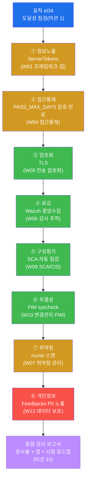

이 지도가 기말 lab 10 미션과 1:1 로 대응한다. **정보노출**로 표면을 훑고(W01), **접근통제**(암호
만료)를 점검하고(W04), **암호화·로깅**의 기본 통제를 확인한 뒤(W05·W06), **구성평가(SCA)·무결성
(FIM)** 의 자동·지속 통제가 가동 중인지 보고(W09·W10), **취약점**을 스캔하고(W07), 마지막 영역으로
**개인정보** 노출을 점검한다(W12). 그 모든 판정을 **준수율 + 갭 + 시정 로드맵**으로 종합하는 것이
마지막 미션이다. 색은 판정의 성격을 미리 보여준다 — 초록은 준수가 기대되는 영역(암호화·로깅·SCA·FIM),
주황은 갭이 기대되는 영역(정보노출·취약점), 빨강은 가장 위험한 갭(개인정보 노출)이다.

### 1.3 "왜 중요한가" — 영역별 점검이 놓치는 것

실제 침해의 상당수는 **하나의 치명적 결함**이 아니라 **여러 사소한 갭의 연쇄**에서 비롯된다. el34 로
예를 들면, 정보노출 갭(`ServerTokens OS`) 하나만으로는 큰일이 안 나지만, 거기에 **암호 만료 없음**
(`PASS_MAX_DAYS 99999`)과 **무인증 PII 노출**(`/api/Feedbacks`)이 더해지면, 공격자는 표적의
소프트웨어 버전을 알아내고(정보노출) → 무인증으로 개인정보를 수집하고(개인정보) → 한 번 얻은 자격을
무기한 악용한다(접근통제). 영역별 점검은 이 중 하나만 보고 끝나기 쉽지만, 전 영역 종합 감사는 **여덟
영역을 한 바퀴 돌며 갭의 조합과 그 누적 위험**을 드러낸다 — 이것이 기말이 "하나의 시스템을 전 영역으로
끝까지" 감사하게 하는 이유다.

또한 종합 감사는 **준수도 함께 본다**. el34 는 TLSv1.3(전송 암호화), Wazuh 중앙 수집(로깅), SCA 자동
점검(구성평가), FIM 실시간 감시(무결성), 그리고 원격 root 로그인 차단(`PermitRootLogin no`)처럼 **이미
기준을 충족한 통제**도 갖고 있다. 감사 보고서는 갭만 나열하는 것이 아니라 "무엇이 잘 되어 있고(준수),
무엇이 부족한가(갭)"를 함께 제시해야 의뢰인이 현재 보안 수준의 **전체 그림(준수율)** 을 본다.

### 1.4 한계 — 이 시험이 다루는 범위

본 기말은 W01–W14 의 범위 안에서 한 시스템의 종합 감사를 평가한다. 따라서 이 시험은 **수동 종합 감사**
이며, 각 영역마다 통제의 존재·갭 여부를 **핵심 한 항목씩** 점검한다. 실제 감사는 한 영역에 수십~수백
항목이 있고(예: CIS Apache 한 벤치마크만 수백 줄), 인터뷰·문서 검토·정책 대조까지 포함하지만(W01 의
3축 방법론), 본 시험은 **각 영역의 대표 통제 하나로 그 영역의 상태를 가늠**한다. 또한 본 시험은
**인가된 표적**(el34 의 정해진 시스템)만을 대상으로 하며, 그 밖의 어떤 시스템에도 같은 점검을 시도해서는
안 된다(§8 감사 수칙). 마지막으로, 종합 감사 보고서도 "준수율 + 갭 + 시정 로드맵"의 골격까지이며,
실무 보고서는 각 갭에 담당자·기한·예산·재검증 일정을 더한다.

---

## 2. 여덟 영역 한 바퀴 — 종합 감사 단계별 상세

이번 시험의 시나리오는 한 감사자가 el34 를 여덟 영역 순서로 한 바퀴 점검하는 것이다. 설정·로그
점검은 el34 호스트(`ssh ccc@192.168.0.80`, 비밀번호 1)에 접속한 뒤 `ssh ccc@10.20.32.80`(설정·SCA·FIM
점검)·`ssh ccc@10.20.32.100`(로깅·FIM 적재)로, 전송 암호화·취약점 스캔·PII 점검은 외부 공격자 위치
(`ssh att@192.168.0.202`)에서 실행한다. 각 단계마다 **한 줄 정의 → 무엇을 점검하나 → el34 에서 어떻게
보이나(준수/갭) → 한계**의 4축으로 설명한다.

> **왜 두 위치인가.** 설정 파일·로그는 el34 **안에서** 봐야 정확하므로 감사자는 호스트 SSH 로 들어가
> 점검 대상(`ssh ccc@10.20.32.80`·`ssh ccc@10.20.32.100`)에 접속해 설정·로그를 직접 읽는다. 반면 전송
> 암호화(TLS)·취약점 스캔·무인증 API 응답은 실제 이용자·공격자가 보는 **밖에서** 봐야 의미가 있으므로
> 외부 공격자 VM(`att@192.168.0.202`)에서 공인 진입점으로 요청한다. 신규 도구 설치는 없으며, 기존 OS
> 명령(`grep`/`openssl`/`nc`)과 이미 깔린 도구(`nuclei`)만 쓴다.

### 2.1 ① 정보노출 — ServerTokens (W01: 프레임워크·갭 분석)

**한 줄 정의.** 정보노출 점검은 시스템이 외부에 **불필요한 내부 정보**(제품명·버전·OS)를 흘리고 있는지
보는 단계다.

**무엇을 점검하나.** Apache 의 `ServerTokens` 설정값을 읽어, 응답 헤더에 어디까지 노출되는지 확인한다.
`ServerTokens` 는 노출 정도에 따라 `Full`(가장 많이) → `OS`(제품+OS) → `Minor` → `Minimal` →
`Prod`(제품명만, 가장 적게)로 설정할 수 있다. CIS Apache 2.4 Benchmark 는 **`Prod`** 를 요구한다.

> **용어 — ServerTokens.** Apache 가 HTTP 응답의 `Server:` 헤더와 에러 페이지에 자신의 정보를 얼마나
> 보여줄지 정하는 설정이다. `OS` 면 `Apache/2.4.52 (Ubuntu)` 처럼 **제품 버전과 OS** 가 그대로 드러난다.
> 공격자는 이 버전으로 표적에 맞는 알려진 취약점(CVE)을 고른다. 그래서 정보 최소화 원칙(공격자에게 단서를
> 주지 않는다)에 따라 CIS 는 제품명만 노출하는 `Prod` 를 권고한다.

**el34 에서 어떻게 보이나 — 갭.** el34-web 의 `ServerTokens` 는 **`OS`** 로 설정되어 있다. CIS 가
요구하는 `Prod` 에 미달하므로 **갭(`gap=ServerTokens`)** 으로 판정한다. 흥미롭게도 이 갭은 W01 에서
처음 만났고, W09 에서 SCA 정책(CIS Apache 8.1)에 그대로 정의된 그 항목이며, 기말에서 종합 감사의 첫
영역으로 다시 점검한다 — 한 갭이 수동(W01) → 자동(W09) → 종합(W15)으로 어떻게 추적되는지 보여준다.

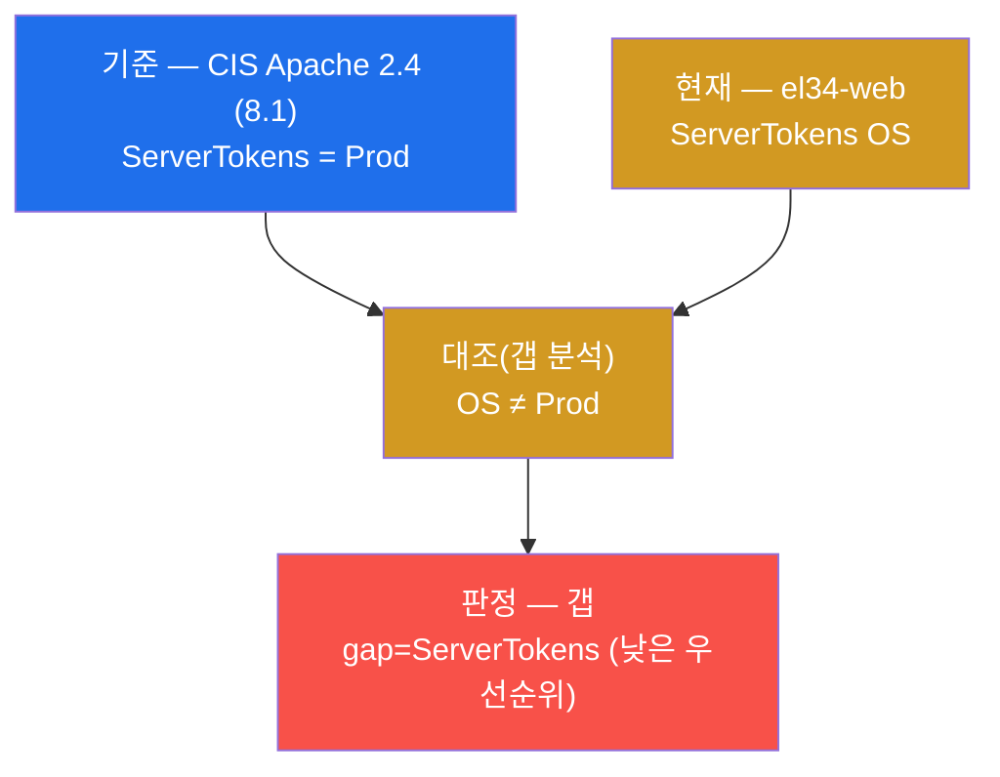

**한계.** ServerTokens 정보노출은 그 자체로 시스템을 직접 무너뜨리지 않는 **낮은 위험**의 갭이다. 하지만
공격자에게 표적의 버전을 알려줘 **다음 공격의 정찰을 쉽게** 만드는 단서이므로, 우선순위는 낮더라도 시정
대상으로 보고한다(로드맵 후순위).

### 2.2 ② 접근통제 — PASS_MAX_DAYS 암호 만료 (W04: 접근통제)

**한 줄 정의.** 접근통제 점검은 "누가 어떻게 시스템에 접근하고, 그 자격이 안전하게 관리되는가"를 보는
단계로, 기말에서는 **암호 만료 주기**를 대표 항목으로 점검한다.

**무엇을 점검하나.** `/etc/login.defs` 의 `PASS_MAX_DAYS` 를 읽어 암호 강제 만료 주기를 본다. PCI-DSS
8.3.9 / CIS 는 **≤90일**을 권고한다. 값이 `99999` 면 사실상 **무기한(만료 없음)** 이다.

> **용어 — PASS_MAX_DAYS.** 암호 유효기간(일)을 정하는 설정이다. 만료가 없으면(=99999) 한 번 유출된
> 암호가 무기한 악용된다. 만료 주기를 두면, 유출되더라도 다음 만료 시점에 자격이 무효화되어 악용 창이
> 닫힌다. 그래서 PCI-DSS 8.3.9 는 ≤90일을 요구한다.

**el34 에서 어떻게 보이나 — 갭(준수 1건 보강).** el34-web 의 `PASS_MAX_DAYS` 는 **`99999`** 라 사실상
무기한이다. PCI-DSS 8.3.9(≤90일)에 미달하므로 **갭(`gap=no_expiry`)** 으로 판정한다. 계정 보호에
직결되어 **우선순위가 높은** 갭이다. 한편 같은 접근통제 영역에서 `PermitRootLogin no`(원격 root 직접
로그인 차단)는 **준수**다 — 종합 감사 보고서에는 이 준수도 함께 적어 "접근통제는 root 차단은 되어
있으나 암호 만료가 갭"이라는 영역 내 혼합 상태를 보인다.

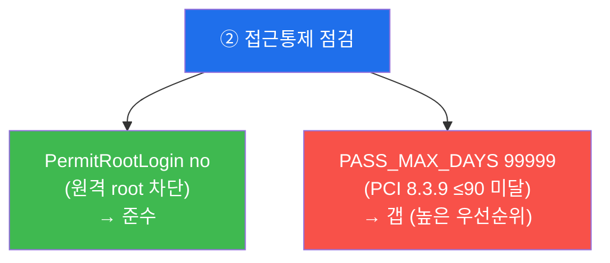

**한계.** 설정값 점검은 "정책이 설정으로 강제됐는가"까지를 보장한다. 실제 운영에서 만료된 계정이 제때
정리되는지, 공유 계정이 없는지 같은 **운영 실태**는 로그·인터뷰(W01 의 3축 방법론)로 보완해야 완전한
접근통제 감사가 된다.

### 2.3 ③ 암호화 — TLS (W05: 전송 암호화, PCI-DSS 4)

**한 줄 정의.** 암호화 점검은 데이터가 네트워크를 지날 때 **도청·변조로부터 보호**되는지를 확인하는
단계다.

**무엇을 점검하나.** `openssl s_client` 로 HTTPS(443) 핸드셰이크를 맺어 협상된 프로토콜 버전을 본다.
PCI-DSS 요구사항 4 는 전송 구간 암호화를 의무화하며, 기준은 **TLS1.2 이상**(TLS1.0/1.1 은 폐기 대상).
이 점검은 표적의 외부 진입점인 fw 게이트웨이(`10.20.30.1:443`)에 `Host` 헤더(servername)를 지정해
점검자 컨테이너(`el34-attacker`)에서 수행한다 — 전송 암호화는 표적을 **밖에서** 보는 점검이기 때문이다.

> **용어 — TLS / openssl s_client.** **TLS(Transport Layer Security)** 는 HTTPS 의 암호화 계층으로,
> 도청·변조로부터 전송 데이터를 보호한다. **`openssl s_client -connect <ip:443> -servername <vhost>`**
> 는 명령줄에서 TLS 핸드셰이크를 직접 맺어 협상된 프로토콜(`Protocol:`)·암호군(`Cipher:`)을 보여주는
> 점검 도구다.

**el34 에서 어떻게 보이나 — 준수(주의 1건).** el34 는 **TLSv1.3** 으로 협상되어 PCI-DSS 4(강한 전송
암호화)를 충족한다 — **준수**다. 다만 인증서가 **자체서명(self-signed)** 이라 신뢰 체인이 없다. 학습
환경이라 전송 암호화 자체는 준수로 보지만, 실제 운영이라면 신뢰된 CA 인증서로 교체해야 할 **주의(갭)
사항**이다(시정 로드맵 중간 순위, W05/W10 연계).

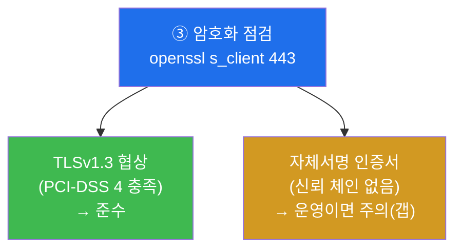

**한계.** 프로토콜 버전이 TLS1.2+ 라는 것이 곧 "전송 암호화 완벽"은 아니다 — 인증서 신뢰성·약한 cipher
차단·HSTS 같은 항목을 함께 봐야 한다(W05). 본 시험은 프로토콜 버전으로 통제의 존재를 확인하고, 인증서
신뢰성은 보고서의 주의 사항으로 짚는다.

### 2.4 ④ 로깅 — Wazuh 중앙수집 (W06: 감사 추적, PCI-DSS 10)

**한 줄 정의.** 로깅 점검은 시스템에 일어난 일을 **사후에 추적·증명**할 수 있도록 로그가 한 곳에 모이고
있는지 확인하는 단계다.

**무엇을 점검하나.** el34 의 SIEM 인 Wazuh(`el34-siem`)의 알림 적재 파일(`/var/ossec/logs/alerts/
alerts.json`)에 이벤트가 쌓이는지 확인한다. PCI-DSS 요구사항 10 은 모든 접근에 **감사 추적(audit
trail)** 을, 그리고 그 로그의 **중앙 수집**을 요구한다. 중앙 수집은 로그 변조·삭제 방지와 통합
모니터링의 전제다(W06).

> **용어 — Wazuh / 중앙 수집.** **Wazuh** 는 el34 의 SIEM(로그 중앙 수집·상관·알림 플랫폼)으로,
> ips·web 의 로그를 한 곳(`alerts.json`)에 모은다. **중앙 수집** 은 분산된 각 시스템의 로그를 한
> 관리지점으로 보내는 것으로, 공격자가 침입한 호스트의 로컬 로그를 지워도 중앙에는 사본이 남게 해 변조·
> 삭제를 방어한다.

**el34 에서 어떻게 보이나 — 준수.** `alerts.json` 에 이벤트가 적재되어 PCI-DSS 10(감사 추적·중앙
수집)을 충족한다 — **준수**다. 출력 끝의 `siem_ok` 가 적재 동작의 증적이다.

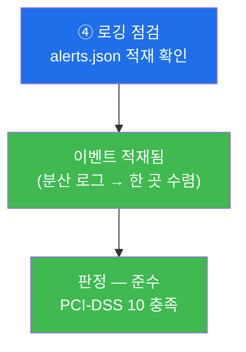

**한계.** "적재된다"가 로깅 통제의 끝이 아니다 — **무결성(변조 방지)·보존 기간(PCI 최소 1년)·시간
동기화(NTP)** 까지 보장되어야 완전하다(W06). 본 시험은 중앙 수집의 동작을 확인하고, 나머지는 보고서에서
짚는다.

### 2.5 ⑤ 구성평가 — SCA 자동 점검 (W09: SCA/CIS)

**한 줄 정의.** 구성평가 점검은 시스템의 보안 설정을 **자동·정기로 점검하는 체계(SCA)** 가 가동되고
있는지 확인하는 단계다.

**무엇을 점검하나.** Wazuh 에이전트 설정 파일(`/var/ossec/etc/ossec.conf`)의 `<sca>` 블록을 읽어,
SCA(Security Configuration Assessment) 모듈이 활성·정기 실행되는지 확인한다.

> **용어 — SCA(Security Configuration Assessment).** CIS 같은 보안 설정 기준을 에이전트가 **항목별로
> 자동 점검**해 pass/fail 점수와 알림을 내는 모듈이다(W09). 사람이 손으로 수백 항목을 점검하면 느리고
> 누락되지만, SCA 는 이를 정기적으로(el34 는 12시간 주기) 자동 수행한다. 즉 W08 의 수동 기준선 감사를
> 자동·지속 체계로 확장한 것이다.

**el34 에서 어떻게 보이나 — 가동(준수).** el34-web 의 `ossec.conf` 에 `<sca>` 블록이 `enabled yes`
+ `interval 12h` 로 설정되어 있어, **CIS 기준 자동 구성평가가 12시간 주기로 가동** 중이다 — **준수**다
(출력에 `sca` 가 보임). W09 에서 본 그 SCA 정책에는 §2.1 의 ServerTokens 갭(CIS 8.1)이 그대로 정의돼
있어, 수동 점검(미션 2)과 자동 점검(이 미션)이 같은 갭을 가리킨다.

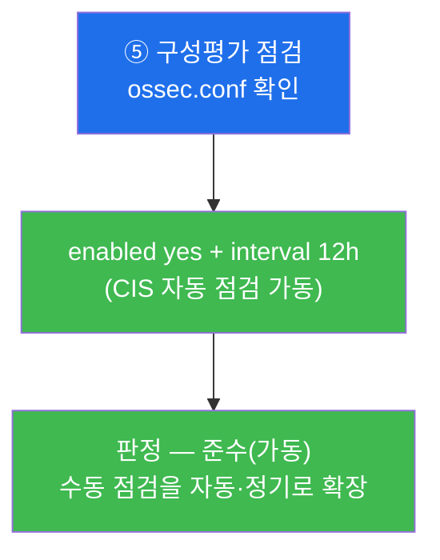

**한계.** SCA 가 "가동 중"이라는 것이 곧 "모든 항목이 준수"라는 뜻은 아니다 — SCA 는 pass 와 함께 fail
항목(예: ServerTokens)도 낸다. 또 SCA 결과는 **수동 검증으로 오탐을 제거**해 증적을 확정해야 한다(W09).
본 시험은 SCA 체계의 가동을 확인하고, 자동↔수동 일치는 W09 에서 깊이 다룬다.

### 2.6 ⑥ 무결성 — FIM syscheck (W10: 변경관리·FIM)

**한 줄 정의.** 무결성 점검은 중요 파일이 **허가 없이 변경되지 않는지 실시간 감시(FIM)** 가 동작하고
있는지 확인하는 단계다.

**무엇을 점검하나.** Wazuh 의 syscheck(FIM) 알림이 SIEM(`el34-siem`)의 `alerts.json` 에 쌓이는지
확인한다. FIM 알림이 다수 적재된다는 것은 무결성 모니터링이 실제로 변경을 탐지·기록하고 있다는 증적이다.

> **용어 — FIM(File Integrity Monitoring) / syscheck.** **FIM** 은 중요 파일의 모든 변경(추가·수정·
> 삭제)을 감지해 알림을 내는 통제다(W10). Wazuh 에서는 **syscheck** 모듈이 이를 담당하며, el34-web 은
> `/etc`, `/usr/bin`, `/etc/apache2` 등 핵심 디렉토리를 실시간(realtime+whodata)으로 감시한다. 무단
> 변경(예: 웹셸 업로드, 설정 조작)이 일어나면 즉시 알림이 뜨므로, 변경관리와 결합해 "기록 없는 변경 =
> 조사 대상"을 가려낸다.

**el34 에서 어떻게 보이나 — 가동(준수).** el34-siem 의 `alerts.json` 에 **syscheck 알림이 다수** 쌓여
있어, FIM 무결성 모니터링이 가동 중임을 확인한다 — **준수**다(출력에 `fim_alerts=<수>`가 보임).

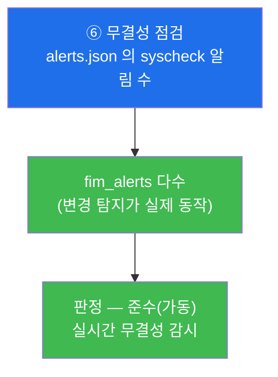

**한계.** FIM 알림이 "있다"가 무결성 통제의 끝이 아니다 — 알림을 **변경관리 기록과 대조**해 승인된
변경(정상)과 무단 변경(조사 대상)을 구분해야 의미가 있다(W10). 본 시험은 FIM 의 가동을 확인하고,
변경관리 연계는 W10 에서 깊이 다룬다.

### 2.7 ⑦ 취약점 — nuclei 스캔 (W07: 취약점 관리, PCI-DSS 11.3)

**한 줄 정의.** 취약점 점검은 표적에 **알려진 취약점·구성 오류를 정기 스캔으로 식별**하는 단계다.

**무엇을 하나.** `nuclei` 로 표적에 알려진 취약점·구성 오류(예: 보안 헤더 누락)를 자동 스캔한다.
PCI-DSS 11.3 은 **정기(분기별)·변경 후** 스캔을 의무화한다. 한 번 점검으로 끝나지 않고 "식별 →
평가(CVSS) → 조치(패치) → 재검증"의 순환을 도는 것이 취약점 관리다(W07).

> **용어 — nuclei / 보안 헤더.** **nuclei** 는 템플릿(`.yaml`) 기반 취약점 스캐너로, 미리 정의된 점검
> 템플릿을 표적에 던져 알려진 취약점·구성 오류를 빠르게 찾는다. 본 시험에서는 보안 헤더 누락 템플릿을
> 쓴다. **보안 헤더(security headers)** 는 `X-Frame-Options`·`Content-Security-Policy` 등 브라우저에
> 보안 동작을 지시하는 응답 헤더로, 누락 시 클릭재킹·XSS 등의 방어가 약해진다.

**el34 에서 어떻게 보이나 — 갭.** nuclei 스캔으로 보안 헤더 누락 등의 발견이 나온다(`findings=<수>`).
보안 헤더 누락은 **갭**이며, 한 회차 스캔 결과가 정기 취약점 관리의 한 입력이 된다.

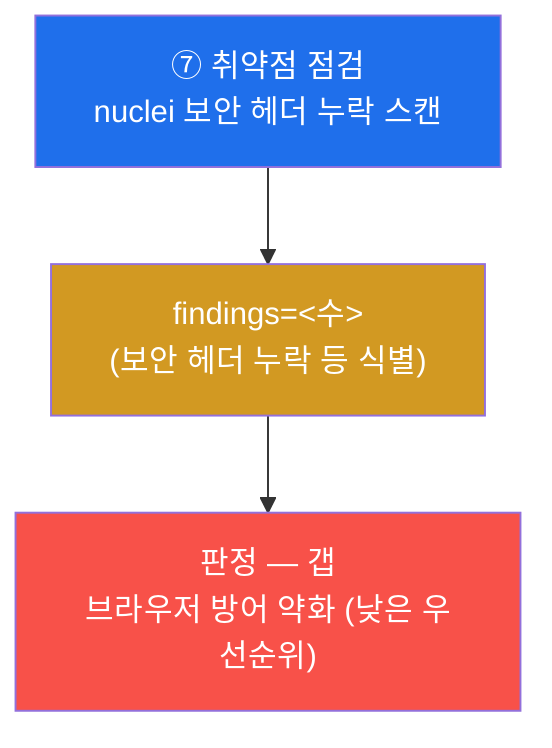

**한계.** 본 시험의 취약점 스캔은 "정기 스캔으로 식별까지"다. 그 결과를 CVSS 로 정밀 평가하고 패치
SLA(Critical 즉시 ~ Low 계획적)로 관리하는 전체 순환은 W07 의 주제다. 본 시험은 식별 단계를 확인하고,
나머지는 보고서에서 짚는다.

### 2.8 ⑧ 개인정보 — Feedbacks PII 노출 (W12: 데이터 보호)

**한 줄 정의.** 개인정보 점검은 시스템이 **개인을 식별할 수 있는 정보(PII)를 무인증·과도하게 노출**하고
있는지 확인하는, 종합 감사의 마지막이자 가장 무거운 단계다.

**무엇을 점검하나.** juiceshop 의 `/api/Feedbacks` API 를 무인증으로 호출해, 응답에 이메일 조각
(`@도메인`)·UserId 같은 PII 가 노출되는지 점검한다(`el34-attacker` 에서 fw 게이트웨이를 향해).

> **용어 — PII / 개인정보 보호.** **PII(Personally Identifiable Information)** 는 이메일·식별자·연락처
> 처럼 개인을 식별할 수 있는 정보다. 개인정보보호법·GDPR 은 PII 를 **최소 수집·목적 제한·안전성 확보**
> 하도록 의무화하며, 무인증 노출은 명백한 위반이다(W12). 부분 마스킹(`***in@도메인`)이 있어도 UserId +
> 도메인을 결합하면 **재식별**될 수 있어, 부분 마스킹만으로는 불충분하다.

**el34 에서 어떻게 보이나 — 갭(가장 위험).** `/api/Feedbacks` 가 **무인증 200** 으로 이메일 조각·UserId
를 노출한다 — 개인정보 보호의 **갭**이다(출력 끝의 `pii_check` 가 점검 수행 증적). 이 갭은 지금 당장
개인정보가 새고 있는 상태이고 법적 제재(과징금)로 직결되므로, **시정 로드맵의 최우선(①)** 이다.

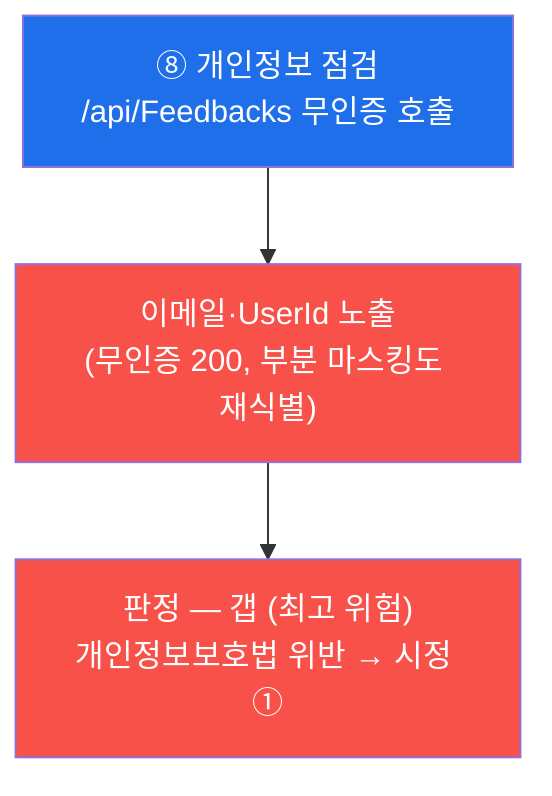

**한계.** 본 시험은 무인증 노출의 **존재**를 확인한다. 완전한 개인정보 감사는 처리 흐름(수집·이용·보유·
파기) 전 단계의 적법성, 정보주체 권리 보장, 안전성 확보 조치(가명·암호화·접근로깅)까지 본다(W12). 본
시험은 가장 명백한 노출 갭으로 그 영역의 위험을 가늠하고, 나머지는 보고서에서 짚는다.

---

## 3. 종합 감사 보고서 — 준수율 + 갭 + 시정 로드맵 (수료의 마무리)

기말의 마무리는 **종합 컴플라이언스 감사 보고서** 다. 미션 2–9 의 여덟 영역 판정을 한 문서로 종합해야
감사가 완성된다. 개별 점검을 넘어, 전 영역을 **준수율로 요약하고 갭을 위험순 시정 로드맵으로 묶는** 것이
컴플라이언스 감사자의 최종 산출물이다.

### 3.1 보고서가 채워야 할 종합 표

| 영역 | 점검 항목 | 기준(프레임워크) | el34 현재 | 판정 |
|------|-----------|-----------------|----------|------|
| ① 정보노출 | ServerTokens | CIS Apache 2.4 = Prod | `OS` | **갭** |
| ② 접근통제 | PASS_MAX_DAYS / PermitRootLogin | PCI 8.3.9 ≤90 / CIS SSH no | `99999` / `no` | **갭** + 준수 |
| ③ 암호화 | TLS | PCI-DSS 4 = TLS1.2+ | TLSv1.3 (자체서명) | 준수(주의) |
| ④ 로깅 | Wazuh 중앙수집 | PCI-DSS 10 = 중앙 수집 | 적재됨 | 준수 |
| ⑤ 구성평가 | SCA 자동 점검 | CIS 자동·정기 평가 | enabled 12h | 준수 |
| ⑥ 무결성 | FIM syscheck | 무단 변경 실시간 감시 | 알림 다수 | 준수 |
| ⑦ 취약점 | nuclei 스캔 | PCI-DSS 11.3 정기 스캔 | 헤더 누락 등 | **갭** |
| ⑧ 개인정보 | Feedbacks PII | 개인정보보호법 = 무인증 노출 금지 | 무인증 노출 | **갭** |

이 표를 **증적과 함께** 채울 수 있으면 컴플라이언스 감사 과정을 수료할 자격이 있다. 핵심은 마지막 열 —
"점검했다"가 아니라 **기준 + 현재 + 증적(설정값·로그·API 응답)** 의 삼박자가 점수다.

### 3.2 준수율 산정과 시정 로드맵

종합 표가 채워지면 두 산출물을 만든다 — **준수율** 한 숫자와 **시정 로드맵** 한 장.

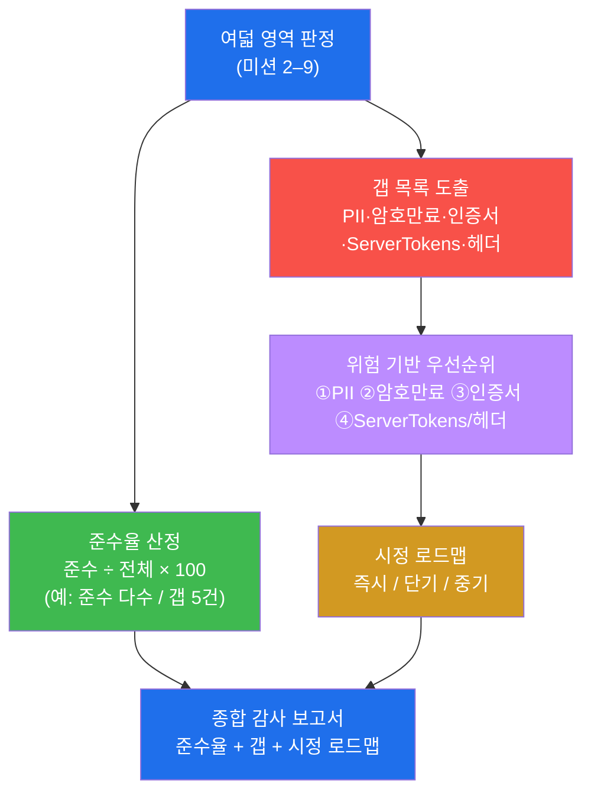

**준수율(§0.1)** 은 여덟 영역(일부는 영역 내 혼합) 중 준수 비율을 한 숫자로 요약한다 — 암호화·로깅·
구성평가(SCA)·무결성(FIM)과 root 로그인 차단 등은 준수, 정보노출·암호 만료·자체서명 인증서·보안 헤더·
PII 노출은 갭이다. **시정 로드맵(§0.2)** 은 그 갭을 **위험 기반 우선순위(§0.3)** 로 정렬한다 — ① **PII
무인증 노출**(개인정보 즉시 유출·과징금 직결) → ② **암호 만료 정책**(만료 없는 자격은 유출 시 무기한
악용) → ③ **자체서명 인증서 교체**(전송 신뢰) → ④ **ServerTokens Prod + 보안 헤더 추가**(정보 노출
축소·브라우저 방어). 이 순서가 곧 "무엇부터 고치나"의 답이다.

### 3.3 종합 감사 보고서의 표준 구조

좋은 종합 감사 보고서는 다음 흐름을 따른다(lab 미션 10 양식).

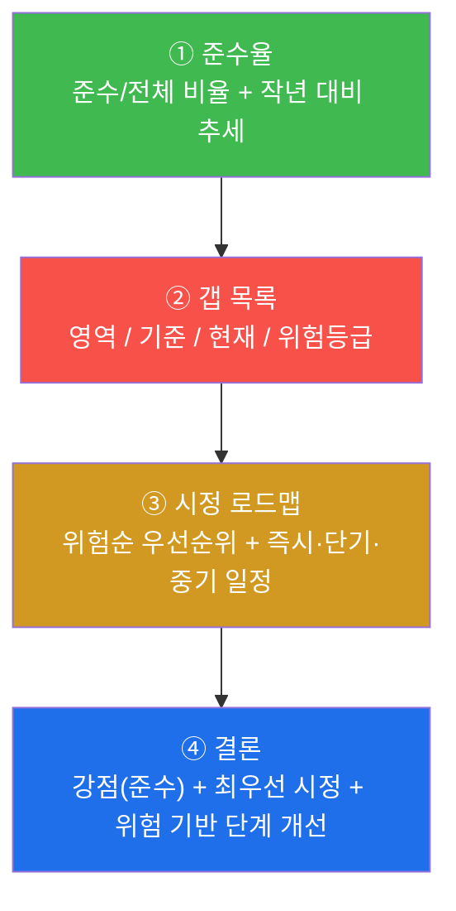

이 구조는 실제 종합 감사 후 경영진·인증 심사에 제출하는 보고서의 표준이다 — 준수율(요약) → 갭 목록
(상세) → 시정 로드맵(계획) → 결론(강점 + 최우선 시정). 특히 결론은 갭만 강조하지 않고 **"탐지·암호화·
로깅·구성평가·무결성 기반은 견고하다(준수)"는 강점**과 **"개인정보 노출·암호 만료가 최우선 시정"이라는
방향**을 함께 제시해, 의뢰인이 현재 수준과 다음 행동을 한눈에 보게 한다.

---

## 4. 감사자 관점과 운영자 관점 — 한 점검의 두 얼굴

종합 감사의 정점 중 하나는 **같은 한 번의 점검이 감사자에게는 '갭 판정'이고 운영자(방어 측)에게는 '탐지
로그'** 임을 이해하는 것이다. 예를 들어 미션 7 에서 attacker 가 web 에 보낸 nuclei 스캔, 미션 9 에서
보낸 Feedbacks 요청 하나는 두 관점에서 다음과 같이 보인다.

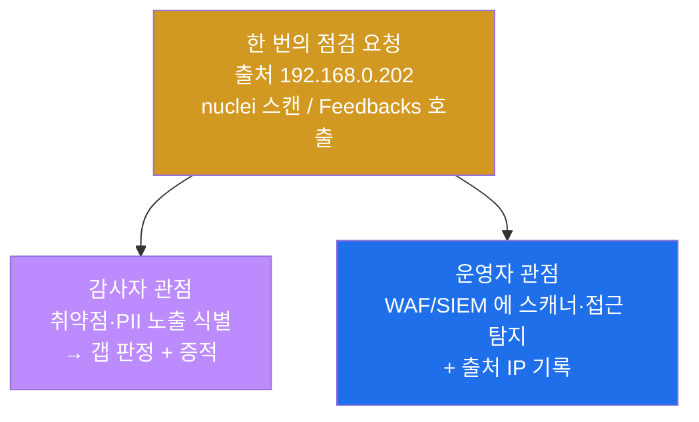

| 관점 | 무엇을 보나 | 핵심 단서 |
|------|-------------|----------|
| 감사자(컴플라이언스) | 점검 결과로 기준 대비 준수/갭 판정 | 설정값·응답·스캔 발견 → 준수/갭 + 증적 |
| 운영자(보안 운영) | 점검 요청이 방어 측에 남긴 흔적 | WAF CRS 룰 번호(913 scanner 등) + 출처 IP |

el34 의 fw 는 SNAT 를 하지 않으므로, attacker(`192.168.0.202`)에서 보낸 점검 요청의 **출처 IP 가 web 의
로그·WAF audit 에 그대로 보존**된다. 그래서 감사 보고서에 "이 갭은 이렇게 점검해 판정했고, 그 점검
자체는 방어 측(WAF·SIEM)에 이렇게 탐지되더라"까지 적을 수 있다 — 이것이 단순 체크리스트 점검을 넘어
**보안 운영과 연결되는 감사자**의 시야다. el34 의 4-tier 세그먼트는 `ext 10.20.30` / `pipe 10.20.31` /
`dmz 10.20.32` / `int 10.20.40` 이며, 점검자(ext .202) → fw(ext .1) → web(dmz .80) 경로로 흐른다.

---

## 5. 판단 프레임워크 — "이 영역은 어느 기준·무엇·준수/갭·우선순위"

기말의 가장 중요한 능력은 점검 영역을 만났을 때 **그것이 14주의 어느 주차이고, 어느 프레임워크 조항이며,
준수인가 갭인가, 시정 우선순위는 얼마인가**를 즉시 자리매김하는 것이다. 다음 표가 그 판단의 정답지이며,
lab 10 미션의 순서와 1:1 로 대응한다.

| 미션 | 점검 영역 | 대응 W주차 | 기준(프레임워크 조항) | el34 현재 | 판정 | 시정 우선순위 |
|------|-----------|-----------|----------------------|----------|------|--------------|
| 1 | 대상 도달 | — | (점검 전제) | el34 접근 | (전제) | — |
| 2 | ① 정보노출 ServerTokens | W01 | CIS Apache 2.4 = Prod | `OS` | **갭** | ④ |
| 3 | ② 접근통제 PASS_MAX_DAYS | W04 | PCI-DSS 8.3.9 ≤90 | `99999` | **갭** | **②** |
| 4 | ③ 암호화 TLS | W05 | PCI-DSS 4 = TLS1.2+ | TLSv1.3 | 준수(자체서명 주의) | ③ |
| 5 | ④ 로깅 Wazuh | W06 | PCI-DSS 10 = 중앙 수집 | 적재됨 | 준수 | — |
| 6 | ⑤ 구성평가 SCA | W09 | CIS 자동·정기 평가 | enabled 12h | 준수(가동) | — |
| 7 | ⑥ 무결성 FIM | W10 | 무단 변경 실시간 감시 | 알림 다수 | 준수(가동) | — |
| 8 | ⑦ 취약점 nuclei | W07 | PCI-DSS 11.3 정기 스캔 | 헤더 누락 등 | **갭** | ④ |
| 9 | ⑧ 개인정보 Feedbacks | W12 | 개인정보보호법 무인증 노출 금지 | 무인증 노출 | **갭** | **①** |
| 10 | 종합 감사 보고 | (종합) | 준수율 + 갭 + 시정 로드맵 | 종합 | 산출물 | — |

이 표를 읽는 법은 네 방향이다. **"어디서 배웠나"**(W주차) — 시험은 14주를 한 표적에 모은다. **"어느
기준인가"**(프레임워크 조항) — 판정에는 항상 근거 기준이 붙는다. **"준수인가 갭인가"**(판정) — 기준 대비
현재 상태의 대조 결과다. **"무엇부터 고치나"**(시정 우선순위) — 갭을 위험순으로 정렬한다(①PII →②암호
만료 →③인증서 →④ServerTokens/헤더). 네 방향을 모두 말할 수 있으면 종합 컴플라이언스 감사의 판단력을
갖춘 것이다.

> **시험의 채점 포인트.** 각 영역을 순서대로 점검하고, 그 **증적**(설정값·로그·스캔 발견·API 응답)을
> 제시하며, **준수/갭을 기준과 함께 판정**하고, 마지막에 **준수율·갭·시정 로드맵으로 종합 보고**하는 것.
> "갭이 있다"는 선언이 아니라 **기준 + 현재 + 증적**의 삼박자가 점수다.

---

## 6. 점검 명령 빠른 복습 — "무엇을 어디서 보나"

시험에서 각 영역을 점검하는 핵심 명령을 한 번에 정리한다. 모든 명령은 el34 호스트(`ssh
ccc@192.168.0.80`, 비밀번호 1)에서 `docker exec` 로 실행하며, 신규 도구 설치는 없다.

> **용어 — grep / 판정 관용구.** 본 시험의 설정 점검은 대부분 "설정을 `grep` 으로 읽고 → 기준값과
> 비교해 `compliant` 또는 `gap=...` 을 출력"하는 형태다. lab 의 명령은 이 판정을 셸 한 줄로 자동화해
> 두었다. 학생은 출력에 `compliant` 가 나오는지 `gap=` 이 나오는지로 판정 결과를 읽고, SCA/FIM 처럼
> "가동 여부"를 보는 항목은 `sca`/`fim_alerts=` 같은 토큰의 등장으로 가동을 확인한다.

### 6.1 ① 정보노출 (ServerTokens — W01)

```bash
ssh ccc@10.20.32.80 'V=$(grep -rhiE "^[[:space:]]*ServerTokens" /etc/apache2/ | head -1); echo "current:$V"; echo "$V" | grep -qi Prod && echo compliant || echo "gap=ServerTokens"'
```

무엇을 보나 — `current:` 뒤의 실제 설정값과 판정. el34-web 은 `OS` 라 `gap=ServerTokens`(CIS Prod 미달).

### 6.2 ② 접근통제 (PASS_MAX_DAYS — W04)

```bash
ssh ccc@10.20.32.80 'V=$(grep "^PASS_MAX_DAYS" /etc/login.defs | tr -dc "0-9"); echo "max_days=$V"; [ "$V" -gt 90 ] >/dev/null 2>&1 && echo "gap=no_expiry" || echo compliant'
```

무엇을 보나 — `max_days=99999`(사실상 무기한) → PCI 8.3.9(≤90) 미달 → `gap=no_expiry`. (참고: root 로그인은
`PermitRootLogin no` 로 차단되어 준수.)

### 6.3 ③ 암호화 (TLS — W05)

```bash
ssh att@192.168.0.202 "echo | openssl s_client -connect neobank.el34.lab:443 -servername neobank.el34.lab | grep -i Protocol | head -1"
```

무엇을 보나 — `Protocol: TLSv1.3`(PCI 4 준수). 자체서명 인증서는 운영 환경이면 별도 주의 사항.

### 6.4 ④ 로깅 (Wazuh — W06)

```bash
ssh ccc@10.20.32.100 'tail -1 /var/ossec/logs/alerts/alerts.json | head -c 40; echo; echo siem_ok'
```

무엇을 보나 — `alerts.json` 적재 + `siem_ok`(PCI 10 중앙 수집 준수).

### 6.5 ⑤ 구성평가 (SCA — W09)

```bash
ssh ccc@10.20.32.80 "grep -A1 '<sca>' /var/ossec/etc/ossec.conf | head -2"
```

무엇을 보나 — `<sca>` `enabled yes`(+ interval 12h) = CIS 자동 구성평가 가동(준수).

### 6.6 ⑥ 무결성 (FIM — W10)

```bash
ssh ccc@10.20.32.100 'N=$(tail -8000 /var/ossec/logs/alerts/alerts.json | grep -c syscheck); echo "fim_alerts=$N"'
```

무엇을 보나 — `fim_alerts=<수>` 다수 = FIM(syscheck) 무결성 모니터링 가동(준수).

### 6.7 ⑦ 취약점 (nuclei — W07)

```bash
ssh att@192.168.0.202 "nuclei -u http://juice.el34.lab -t /root/nuclei-templates/http/misconfiguration/http-missing-security-headers.yaml -silent -nc | head -3"
```

무엇을 보나 — 보안 헤더 누락 등 발견(`findings=<수>`). PCI-DSS 11.3(정기 스캔)의 한 회차(갭).

### 6.8 ⑧ 개인정보 (Feedbacks PII — W12)

```bash
ssh att@192.168.0.202 "echo -en "GET /api/Feedbacks HTTP/1.0\r\nHost: juice.el34.lab\r\nConnection: close\r\n\r\n" | nc -w3 192.168.0.161 80 >/dev/null | grep -oE '@[a-zA-Z0-9.-]+' | head -1; echo pii_check"
```

무엇을 보나 — 무인증 응답의 이메일 조각(`@도메인`) 노출 + `pii_check`. 개인정보 보호 갭(최우선 시정).

---

## 7. 실습 안내 — 기말 lab 10 미션 (4 축 설명)

기말 실습은 10 미션으로 구성된다. 각 미션을 **4 축** 으로 설명한다 — 왜 하는가 / 무엇을 알 수 있는가 /
결과 해석(준수 vs 갭) / 실전 활용. 미션은 여덟 영역 한 바퀴를 따라 점검(도달성) → ① 정보노출 → ②
접근통제 → ③ 암호화 → ④ 로깅 → ⑤ 구성평가 → ⑥ 무결성 → ⑦ 취약점 → ⑧ 개인정보 → 종합 보고 순서로
흐르며, lab 의 `order` 와 1:1 로 대응한다.

> **시험 진행 원칙.** 모든 명령은 el34 호스트(`ssh ccc@192.168.0.80`)에서 `docker exec
> el34-web`(설정·SCA·FIM) / `el34-siem`(로깅·FIM 적재) / `el34-attacker`(전송·스캔·PII)로. 각 미션은
> **독립적**이며, **인가된 표적(el34)** 만 감사한다(점검만, 변경 금지). 합격 임계값은 0.7 이다.

### 미션 1 — 점검: 표적 el34 에 도달하나 (8점)

> **왜 하는가?** 감사의 전제는 표적에 접근이 된다는 것이다. 감사자는 본격 점검 전 항상 대상의 도달성부터
> 확인한다(접근이 안 되면 모든 음성 결과가 무의미하다).
>
> **무엇을 알 수 있는가?** `ssh ccc@10.20.32.80` 으로 hostname 이 응답하는지 — 종합 감사 대상(el34
> 전반: web/siem/attacker)이 실제 살아있고 점검 가능한 상태인지.
>
> **결과 해석.** 정상: 출력에 `target_ok` 가 나옴(대상 접근 성공). 비정상: 응답이 없으면 호스트 SSH·
> 컨테이너 상태(`docker ps`)부터 점검해야 한다.
>
> **실전 활용.** 감사 착수 시 첫 확인. 감사 범위(scope)의 시스템이 실제 가동·접근 가능한지 검증하는
> 단계.

### 미션 2 — ① 정보노출: ServerTokens (10점)

> **왜 하는가?** 종합 감사의 첫 영역은 정보 최소화다. 시스템이 제품·OS 버전을 흘리면 공격자의 정찰을
> 도와준다(W01 에서 처음 만난 갭).
>
> **무엇을 알 수 있는가?** Apache `ServerTokens` 의 실제 값과, CIS Apache 2.4 기준(`Prod`) 대비 준수/갭.
> el34-web 은 `OS` 라 기준 미달이다. (이 갭은 W09 SCA 정책 CIS 8.1 에도 정의돼 있다.)
>
> **결과 해석.** 정상(갭 판정 성공): 출력에 `gap=` 이 나옴 — 현재 `OS` 가 CIS `Prod` 에 미달한 갭이다.
> 비정상: 설정을 못 읽으면 경로(`/etc/apache2/`)·권한을 점검.
>
> **실전 활용.** 모든 웹 시스템 종합 감사의 단골 항목. 낮은 우선순위지만 정보노출은 후속 공격의 단서이므로
> 시정 로드맵 후순위로 보고한다.

### 미션 3 — ② 접근통제: PASS_MAX_DAYS 암호 만료 (10점)

> **왜 하는가?** 만료 없는 암호는 한 번 유출되면 무기한 악용된다. 암호 만료 주기는 계정 보호의 핵심
> 통제다(W04).
>
> **무엇을 알 수 있는가?** `/etc/login.defs` 의 `PASS_MAX_DAYS` 값과, PCI-DSS 8.3.9(≤90일) 대비 준수/갭.
> el34-web 은 `99999`(사실상 무기한)라 **갭**이다. (같은 영역의 `PermitRootLogin no` 는 준수.)
>
> **결과 해석.** 정상(갭 판정 성공): 출력에 `gap=` 이 나옴 — 만료가 없어 기준 미달이다. 비정상: 값이 90
> 이하로 나오면 표적·설정을 재확인.
>
> **실전 활용.** 접근통제 감사의 단골 갭. 계정 보호에 직결되어 **시정 우선순위가 높은** 항목이다(로드맵
> ②).

### 미션 4 — ③ 암호화: TLS (10점)

> **왜 하는가?** 전송 구간 암호화는 도청·변조 방어의 기본이다. PCI-DSS 4 는 TLS1.2+ 를 의무화한다(W05).
>
> **무엇을 알 수 있는가?** HTTPS(443) 핸드셰이크에서 협상된 프로토콜 버전과 준수/갭. el34 는 TLSv1.3 라
> **준수**(단 자체서명 인증서는 신뢰 체인 주의).
>
> **결과 해석.** 정상(준수 확인): 출력에 `TLSv1` 이 나옴(PCI 4 충족). 비정상: 협상이 안 되면 표적
> 게이트웨이(`10.20.30.1:443`)·servername(Host)을 점검.
>
> **실전 활용.** 암호화 컴플라이언스의 첫 점검. 프로토콜 버전 외에 인증서 신뢰성·cipher 강도도 함께 봐야
> 완전하다(W05). 자체서명 인증서는 시정 로드맵 ③.

### 미션 5 — ④ 로깅: Wazuh 중앙수집 (10점)

> **왜 하는가?** 로그 없는 보안은 사후 추적이 불가능하다. PCI-DSS 10 은 감사 추적과 그 중앙 수집을
> 요구한다(W06).
>
> **무엇을 알 수 있는가?** `el34-siem`(Wazuh)의 `alerts.json` 에 이벤트가 적재되는지 — 분산 로그가 한
> 곳에 모여 통합 감사·변조 방지의 전제가 되는지. el34 는 적재되어 **준수**다.
>
> **결과 해석.** 정상(준수 확인): 출력에 `siem_ok` 가 나옴(중앙 수집 동작). 비정상: 적재가 비면 SIEM
> 상태·에이전트 연결을 점검.
>
> **실전 활용.** 로깅 컴플라이언스의 핵심 점검. 중앙 수집 외에 무결성·보존(1년+)·NTP 동기화까지 보장돼야
> 완전하다(W06).

### 미션 6 — ⑤ 구성평가: SCA 자동 점검 (10점)

> **왜 하는가?** 수백 항목을 손으로 점검하면 느리고 누락된다. SCA 는 CIS 기준을 자동·정기로 점검하는
> 체계다(W09). 그 체계가 가동 중인지 확인한다.
>
> **무엇을 알 수 있는가?** `ossec.conf` 의 `<sca>` 블록(`enabled yes` + `interval 12h`)으로 SCA 자동
> 구성평가가 가동되는지. el34-web 은 가동 중이라 **준수**다. (W08 의 수동 기준선 감사를 자동·지속으로
> 확장한 것.)
>
> **결과 해석.** 정상(가동 확인): 출력에 `sca` 가 보임 — SCA 모듈이 활성·정기 실행 중이다. 비정상: 못
> 읽으면 경로(`/var/ossec/etc/ossec.conf`)를 재확인.
>
> **실전 활용.** 기준선을 1 회성이 아니라 **지속적으로** 관리하는 핵심 통제. 자동 결과를 수동 검증으로
> 확정하는 순환(W09)의 출발점.

### 미션 7 — ⑥ 무결성: FIM syscheck (10점)

> **왜 하는가?** 중요 파일이 허가 없이 바뀌면 침해의 신호다. FIM 은 그 변경을 실시간 감시한다(W10). FIM
> 이 실제로 동작하는지 확인한다.
>
> **무엇을 알 수 있는가?** `el34-siem` 의 `alerts.json` 에 syscheck(FIM) 알림이 쌓이는지 — 무결성
> 모니터링이 실제 변경을 탐지·기록 중인지. el34 는 알림 다수라 **준수(가동)** 다.
>
> **결과 해석.** 정상(가동 확인): 출력에 `fim_alerts=<수>` 가 나옴(FIM 동작). 비정상: 0 이거나 못 읽으면
> SIEM 상태·syscheck 설정을 점검.
>
> **실전 활용.** 변경관리와 결합해 "기록 없는 변경 = 조사 대상"을 가려내는 무결성 통제의 핵심(W10).

### 미션 8 — ⑦ 취약점: nuclei 스캔 (10점)

> **왜 하는가?** 취약점은 매일 새로 생긴다. 한 번이 아니라 **정기 스캔**으로 식별·재검증하는 순환이
> 컴플라이언스의 요구다(W07, PCI-DSS 11.3).
>
> **무엇을 알 수 있는가?** nuclei 스캔으로 표적의 알려진 취약점·구성 오류(보안 헤더 누락 등)를 자동으로
> 식별하는 법. 발견 수(`findings=`)가 정기 스캔의 한 회차 결과다(갭).
>
> **결과 해석.** 정상(스캔 수행 성공): 출력에 `findings=<수>` 가 나옴 — 보안 헤더 누락 등이 식별된 갭.
> 비정상: 발견이 비거나 오류면 템플릿 경로·표적 도달성을 점검.
>
> **실전 활용.** 취약점 관리 순환(식별→평가→조치→재검증)의 "식별" 단계. 정기 스캔으로 추세를 관리하고
> 패치 우선순위의 근거로 쓴다. 보안 헤더 누락은 시정 로드맵 ④.

### 미션 9 — ⑧ 개인정보: Feedbacks PII 노출 (10점)

> **왜 하는가?** 종합 감사의 마지막이자 가장 무거운 영역이다. 개인정보가 무인증으로 새면 지금 당장
> 유출이고 법적 제재로 직결된다(W12).
>
> **무엇을 알 수 있는가?** juiceshop 의 `/api/Feedbacks` 가 무인증으로 이메일 조각·UserId(PII)를 노출하는
> 지. 부분 마스킹이 있어도 UserId+도메인 결합으로 재식별될 수 있다는 것.
>
> **결과 해석.** 정상(갭 판정 성공): 출력에 `pii_check`(와 `@도메인` 조각)가 나옴 — 무인증 PII 노출 갭.
> 비정상: 응답이 비면 표적 도달성(`Host` 헤더·게이트웨이)을 점검.
>
> **실전 활용.** 개인정보 감사의 가장 명백한 위반. 즉시 유출·과징금 직결이라 **시정 로드맵의 최우선(①)**
> 이며, 시정은 API 인증 + 응답 최소화 + 비식별이다(W12).

### 미션 10 — 종합 감사 보고서: 준수율 + 갭 + 시정 로드맵 (12점)

> **왜 하는가?** 감사의 산출물은 보고서다. 미션 1–9 의 여덟 영역 판정을 한 문서로 종합해야 종합 감사가
> 완성된다.
>
> **무엇을 알 수 있는가?** 전 영역의 점검을 **준수율(준수/전체) + 갭 목록 + 위험 기반 시정 로드맵**으로
> 묶는 법. 준수(TLS·Wazuh·SCA·FIM·root 차단)와 갭(ServerTokens·암호 만료·자체서명·보안 헤더·PII 노출)을
> 함께 제시하고, 갭을 위험순으로 정렬한다(①PII →②암호 만료 →③인증서 →④ServerTokens/헤더).
>
> **결과 해석.** 정상: 보고서에 준수율 + 갭 목록 + `시정` 로드맵(우선순위)과 결론이 포함됨. 비정상:
> 우선순위 근거(위험도)가 없으면 각 갭의 영향(개인정보 유출·계정 보호·전송 신뢰·정보 노출)을 다시 따진다.
>
> **실전 활용.** 종합 컴플라이언스 감사 보고서의 표준 구조(준수율 → 갭 목록 → 시정 로드맵 → 결론).
> 경영진·인증 심사에 제출하는 최종 산출물이며, 다음 감사와의 비교 기준선이 된다.

---

## 8. 시험 수칙 — 인가된 감사와 증적 중심

컴플라이언스 감사는 **허가받은 표적에 대해서만** 한다. 기말도 다음 수칙을 반드시 지킨다.

- **인가된 표적만 감사한다.** el34 의 정해진 시스템(`el34-web`/`el34-siem`/`el34-attacker`)에 대해서만
  점검하며, 같은 명령을 그 밖의 어떤 시스템에도 시도해서는 안 된다. 특히 취약점 스캔(nuclei)·PII
  점검은 인가 없이 외부에 던지면 불법이 될 수 있다.
- **점검만, 변경은 하지 않는다.** 감사자는 설정·응답을 **읽어서 판정**할 뿐, 점검 중 시스템 설정을
  바꾸거나 데이터를 변조하지 않는다. 시정(remediation)은 감사 후 운영팀의 변경관리 절차로 한다.
- **증적 우선.** "갭이 있다"가 아니라 **기준(요구치) + 현재 상태(설정 출력·로그·API 응답) + 판정** 의
  삼박자를 제시해야 점수다. 근거 기준 없는 인상(印象)은 채점되지 않는다.
- **재현 가능하게 기록한다.** 모든 판정은 같은 명령으로 다른 감사자가 재현할 수 있어야 한다. 증적은
  명령·출력 형태로 남겨 추적 가능하게 한다(W01 §6 증적 원칙).

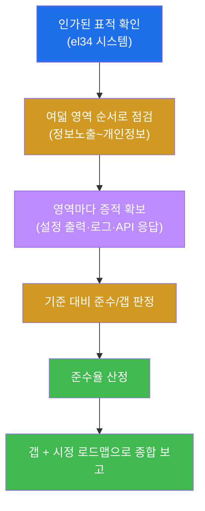

---

## 9. 수료 — 컴플라이언스 감사자가 되었다

15주 동안 학생은 컴플라이언스의 전 영역을 익혔다 — 프레임워크·갭 분석(W01), 정책·거버넌스(W02), 자산
식별·분류(W03), 접근통제(W04), 암호화(W05), 로깅·감사 추적(W06), 취약점 관리(W07), 기준선 감사(W08
중간고사), 구성평가 SCA(W09), 변경관리·FIM(W10), 그리고 데이터 보호·개인정보(W12) 등. 통제의 **존재를
증적으로 증명하고, 갭을 위험 기반으로 시정**하는 것이 컴플라이언스의 본질이다.

기말에서는 그 모든 역량을 **하나의 시스템(el34)** 에 총동원해, 여덟 영역을 한 바퀴 점검하고, 준수율
한 숫자로 요약하며, 갭을 위험순 시정 로드맵으로 묶어 **종합 컴플라이언스 감사 보고서** 한 편으로
종합했다. 보안 점검(공격 관점)과 컴플라이언스(감사 관점)는 같은 사건의 양면이며, 둘을 함께 갖춘 조직이
진짜 안전하다. 이제 학생은 한 시스템을 전 영역으로 점검해 준수율·갭·시정 로드맵으로 끝까지 끌고 가는
**컴플라이언스 감사자** 다.

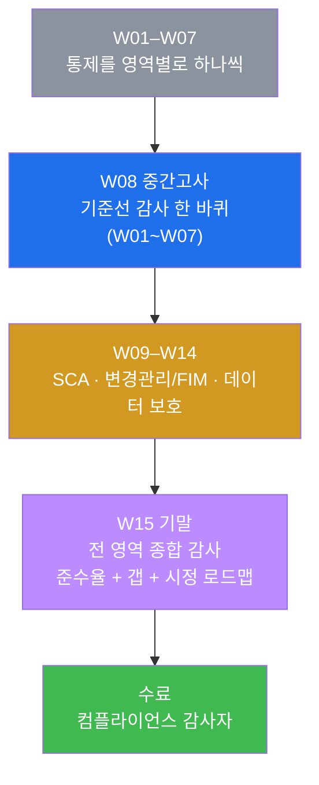

다음 단계는 더 넓은 실전이다 — 실제 ISMS-P/ISO27001 인증 심사 대응, 자동화된 GRC(Governance·Risk·
Compliance) 플랫폼 운영, 연도별 준수율 추세 관리와 지속적 통제 개선. 하지만 그 모든 것의 토대 —
**전 영역을 빠짐없이 점검하고, 증거로 판정하며, 준수율로 요약하고, 위험 기반 시정 로드맵으로 다음
행동을 제시하는** 사고방식 — 을 학생은 이미 갖추었다. 수료를 축하한다. 🎓
