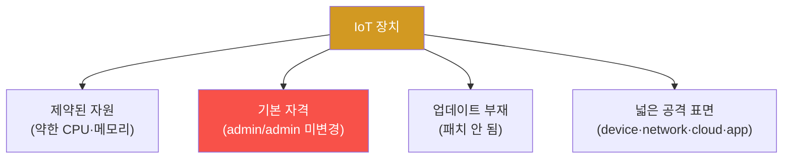

# iot-security W01 — IoT 보안 개론: 공격 표면·IoT가 취약한 이유·위협 분류

> **본 주차의 한 줄 요약**
>
> iot-security는 **사물인터넷(IoT)** 장치의 보안을 다룬다. IP 카메라·스마트홈 허브·센서·산업 제어 장치 등 인터넷에
> 연결된 물리 장치는 폭발적으로 늘었지만, 보안은 뒤처져 **가장 취약한 공격 표면**이 됐다(Mirai 봇넷이 IoT를 장악해
> 대규모 DDoS를 일으킨 게 대표 사례). IoT가 유독 취약한 이유는 넷이다: ① **제약된 장치**(약한 CPU·메모리라 강한
> 보안 넣기 어려움), ② **기본 자격 증명**(admin/admin·공장 초기 비밀번호를 안 바꿈), ③ **업데이트 부재**(패치가 안
> 나오거나 사용자가 안 함 — 오래된 취약점이 영원히 남음), ④ **넓은 공격 표면**(장치 자체·네트워크 프로토콜·클라우드
> 백엔드·모바일 앱까지). 공격자는 이 표면 어디든 노린다. IoT 보안 평가는 이 **4대 공격 표면(device·network·cloud·app)**을
> 체계적으로 점검한다. 실습에서는 4대 표면을 매핑하고(마커 `SURFACE_MAPPED`), 위협을 분류하며(마커 `THREATS_CLASSIFIED`),
> 위험을 평가한다(마커 `RISK_SCORED`). el34에는 물리 IoT 장치가 없지만, IoT의 소프트웨어 측면(웹 인터페이스·네트워크
> 서비스·펌웨어 설정)은 분석·시뮬레이션할 수 있다(하드웨어 측면은 실물 장치·인터페이스 필요).

---

## 학습 목표

본 주차 종료 시 학생은 다음 5가지를 **본인 손으로** 할 수 있어야 한다.

1. IoT 보안의 중요성과 Mirai 같은 생태계 위협을 설명한다.
2. IoT가 유독 취약한 이유(제약·기본자격·업데이트·표면)를 설명한다.
3. **4대 공격 표면**(device·network·cloud·app)을 매핑한다(마커 `SURFACE_MAPPED`).
4. IoT 위협을 분류한다(마커 `THREATS_CLASSIFIED`).
5. 노출×악용성×영향으로 **위험을 평가·우선순위화**한다(마커 `RISK_SCORED`, `Assessment`).

> **이 주차의 시선** — 폭증한 IoT의 넓은 공격 표면을 체계적으로 점검하는 틀을 세운다. "수가 많아 우선순위가 관건"이
> 핵심이다.

---

## 0. 용어 해설 (IoT 보안)

| 용어 | 영문 | 뜻 | 비유 |
|------|------|----|------|
| **IoT** | Internet of Things | 인터넷에 연결된 물리 장치(카메라·센서·허브) | 인터넷 사물 |
| **공격 표면** | Attack Surface | 공격이 가능한 지점의 총합 | 노출된 문들 |
| **4대 표면** | — | device·network·cloud·app | 네 방향 출입구 |
| **기본 자격** | Default Credentials | 공장 초기 비밀번호(admin/admin) | 안 바꾼 초기 비번 |
| **Mirai** | — | 기본 자격 IoT를 장악한 대규모 봇넷 | 좀비 군단 |
| **펌웨어** | Firmware | 장치에 내장된 소프트웨어 | 장치의 OS |
| **자산 인벤토리** | Asset Inventory | 어떤 IoT가 어디 있는지 목록 | 재고 대장 |

> **헷갈리기 쉬운 한 쌍 — 제약된 장치 vs 넓은 공격 표면.** *제약된 장치*는 자원이 적어 강한 보안을 넣기 어렵다는
> 것, *넓은 공격 표면*은 노출 지점(device·network·cloud·app)이 많다는 것이다. 둘 다 IoT를 취약하게 하지만 원인이
> 다르다 — 하나는 "지키기 어려움", 하나는 "지킬 곳이 많음".

---

## 0.5 신입생 친화 핵심 개념

### 0.5.1 왜 IoT가 취약한가

강한 보안을 넣기 어렵고, 기본 자격이 남고, 패치가 안 되고, 노출 지점이 많다. 네 가지가 겹쳐 IoT를 가장 약한 고리로
만든다.

### 0.5.2 Mirai — IoT의 경고

Mirai 봇넷은 기본 자격을 가진 IoT 장치(카메라·라우터) 수십만 대를 자동 장악해 사상 최대 DDoS를 일으켰다. 교훈은,
개별 IoT 장치는 약해 보여도 수백만 대가 봇넷이 되면 인터넷 인프라를 위협한다는 것이다. IoT 보안은 그 장치만이 아니라
**전체 생태계**의 문제다.

### 0.5.3 4대 공격 표면

| 표면 | 예 | 위협 |
|------|----|------|
| **Device(장치)** | 하드웨어·펌웨어·기본 자격 | UART/JTAG 접근·펌웨어 추출·기본 비밀번호 |
| **Network(네트워크)** | WiFi·BLE·Zigbee·MQTT | 트래픽 감청·프로토콜 취약점 |
| **Cloud(클라우드)** | 백엔드 API·저장소 | API 취약점·데이터 유출 |
| **App(앱)** | 모바일 앱 | 하드코딩 비밀·안전하지 않은 통신 |

공격자는 넷 중 가장 약한 곳을 노린다. 평가는 넷을 모두 점검한다.

### 0.5.4 위험 평가 — IoT 맥락

각 장치·표면의 위험을 **노출(인터넷 직접 노출?) × 악용성(기본 자격·알려진 취약점?) × 영향(장악 시 피해?)**으로
평가한다. 인터넷에 직접 노출된, 기본 자격의, 중요 장치(카메라·잠금)가 최우선이다. IoT는 수가 많아 **우선순위**가 특히
중요하다.

### 0.5.5 el34 맥락과 한계

el34엔 물리 IoT 장치가 없다. 이번 주는 **공격 표면 매핑·위협 분류·위험 평가 로직**을 결정론 시뮬로 익힌다. IoT의
소프트웨어 측면(웹 인터페이스·네트워크 서비스·펌웨어 설정)은 이후 주차에서 분석·시뮬하고, 하드웨어 측면(UART/JTAG·
BLE·무선)은 실물 장치·인터페이스가 필요함을 명시한다.

---

## 1. IoT 보안 상세 — 표면·위협·위험

### 1.1 공격 표면 매핑 (SURFACE_MAPPED)

- **한 줄 정의**: 대상 IoT를 device·network·cloud·app 4대 표면으로 분해한다.
- **왜 중요한가**: 공격자는 가장 약한 표면을 노리므로 넷을 모두 봐야 한다.
- **el34 맥락에서 어떻게**: 각 표면의 구성·노출·위협을 정리하면 `SURFACE_MAPPED`.
- **한계/주의**: 한 표면(예: app)만 보면 다른 표면(cloud API)이 진입점이 된다.

### 1.2 위협 분류 (THREATS_CLASSIFIED)

- **한 줄 정의**: 표면별 위협을 유형화한다(기본 자격·펌웨어 추출·프로토콜 감청·API 취약점 등).
- **핵심**: 표준 프레임(OWASP IoT Top 10 등)으로 태깅.
- **판정**: 위협이 표면별로 분류되면 `THREATS_CLASSIFIED`.

### 1.3 위험 평가 (RISK_SCORED)

- **한 줄 정의**: 노출×악용성×영향으로 위험을 점수화·우선순위화한다.
- **핵심**: 인터넷 노출·기본 자격·중요 장치를 최우선.
- **판정**: 위험이 점수화·정렬되면 `RISK_SCORED`.

---

## 2. 실습 안내 (총 5 미션)

실행 위치는 el34 **호스트**(`ssh ccc@{{TARGET_IP}}`, 비밀번호 `1`), 참고 GPU는 Ollama
(`http://211.170.162.139:10934`, gemma3:4b)다. ⚠️ 물리 IoT 장치는 실물이 필요해 공격 표면·위협·위험 평가 로직을
결정론 시뮬로 익힌다. 각 미션의 마지막 줄 마커가 채점 기준이다.

### 미션 1 — GPU 헬스체크 → `GEN_OK`

> **왜 하는가?** 분석·종합에 쓸 LLM 도달·응답 확인.
> **무엇을 아는가?** Ollama 응답 형식·도달성.
> **결과 해석** — 정상 `GEN_OK` / 비정상 `GEN_EMPTY`·연결 오류.
> **실전 활용** — 종합 소견 작성에 사용.

### 미션 2 — 공격 표면 매핑 → `SURFACE_MAPPED`

> **왜 하는가?** 4대 표면을 빠짐없이 점검하는 틀을 만든다.
> **무엇을 아는가?** device·network·cloud·app 구성·노출.
> **결과 해석** — 정상: 매핑 + `SURFACE_MAPPED`.
> **실전 활용** — IoT 위협 모델링의 기초.

### 미션 3 — 위협 분류 → `THREATS_CLASSIFIED`

> **왜 하는가?** 위협을 표준으로 체계화한다.
> **무엇을 아는가?** 표면별 위협 유형·OWASP IoT.
> **결과 해석** — 정상: 분류 + `THREATS_CLASSIFIED`.
> **실전 활용** — 진단 보고서 발견 태깅.

### 미션 4 — 위험 평가 → `RISK_SCORED`

> **왜 하는가?** 수많은 IoT 중 어디를 먼저 볼지 정한다.
> **무엇을 아는가?** 노출×악용성×영향 점수화.
> **결과 해석** — 정상: 점수화 + `RISK_SCORED`.
> **실전 활용** — IoT 우선순위·로드맵.

### 미션 5 — 종합 소견 → `Assessment`

> **왜 하는가?** 표면·위협·위험과 "생태계·우선순위"를 소견으로 묶는다.
> **무엇을 아는가?** GPU에 요약시키되 첫 줄을 `Assessment`로 강제.
> **결과 해석** — 정상: `Assessment` 포함. 없으면 `[형식 미준수 — 재실행]`.
> **실전 활용** — IoT 보안 평가 개요.

---

## 3. 흔한 오해·관제자 노트

- **"작은 IoT는 무해하다."** — Mirai처럼 봇넷이 되면 인프라를 위협한다. 개별이 아니라 생태계다.
- **"기본 비밀번호는 나중에 바꾼다."** — 가장 흔한 침투 경로다. 초기 변경이 필수.
- **"장치만 보면 된다."** — device·network·cloud·app 4대 표면을 모두 본다.
- **"IoT는 수가 많아 다 못 본다."** — 그래서 인벤토리·우선순위가 핵심이다.
- **관제(Blue) 관점** — (1) IoT 자산 인벤토리가 있는가, (2) 기본 자격·미패치가 점검되는가, (3) 4대 표면이 평가되는가,
  (4) 인터넷 노출이 최소화됐는가를 점검한다. IoT는 수가 많아 인벤토리·우선순위가 핵심.

---

## 4. 다음 주차 (W02) 예고 — IoT 네트워크 프로토콜

W01이 "IoT 보안 개론"이었다면, W02는 IoT **네트워크 프로토콜**(MQTT·CoAP·Zigbee 등)의 보안을 다룬다. 경량 프로토콜의
취약점(인증·암호화 부재)과 방어를 익힌다.
