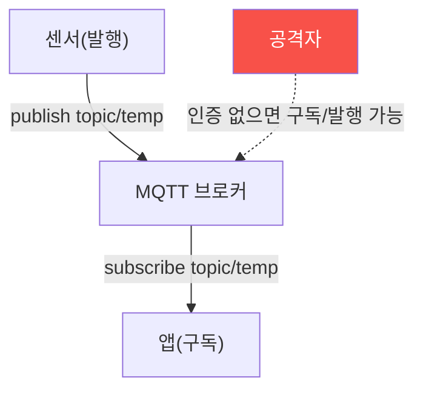

# iot-security W02 — IoT 네트워크 프로토콜: MQTT·CoAP·경량 프로토콜 보안

> **본 주차의 한 줄 요약**
>
> IoT 장치는 제약된 자원 때문에 **경량 프로토콜**을 쓴다 — HTTP 대신 **MQTT**(발행/구독 메시징)·**CoAP**(제약
> 환경용 REST)·Zigbee·Z-Wave 등. 문제는 이 프로토콜들이 **속도·경량을 위해 보안을 기본으로 켜지 않는** 경우가
> 많다는 것: ① **인증 부재**(MQTT 브로커가 익명 접속 허용 → 누구나 토픽 구독/발행), ② **평문 통신**(TLS 없이
> 센서 데이터·명령이 그대로 흘러 감청·변조), ③ **접근 제어 부재**(한 장치가 모든 토픽에 접근 → 한 대 뚫리면
> 전체). 공격: 인증 없는 MQTT 브로커에 붙어 **모든 센서 데이터를 구독**하거나, **가짜 명령을 발행**(문 열기·
> 히터 켜기)하거나, 평문을 **감청·변조**한다. 방어: **TLS 암호화**(감청·변조 차단), **인증**(사용자/장치 인증),
> **ACL(접근 제어 목록)**(장치별 허용 토픽 제한), **최소 권한**. 경량이라도 보안은 켜야 한다 — 편의를 위해 끄면
> 전체 IoT 메시징이 노출된다. el34엔 IoT 브로커가 없지만, 프로토콜 보안 설정·취약성 분석은 시뮬레이션한다.
>
> **한 줄 결론**: MQTT·CoAP 같은 경량 IoT 프로토콜은 인증·암호화·ACL이 기본 꺼진 경우가 많아 감청·가짜 명령에
> 취약하다. 방어 = **TLS + 인증 + ACL(최소 권한)**. 경량이라도 보안은 켠다.

---

## 학습 목표

본 주차 종료 시 학생은 다음 5가지를 **본인 손으로** 할 수 있어야 한다.

1. **경량 IoT 프로토콜**(MQTT·CoAP)의 특성을 설명한다.
2. 프로토콜 **보안 취약성**(인증·암호화·ACL 부재)을 평가한다(PROTOCOL_WEAK).
3. **감청·가짜 명령** 가능성을 판정한다(INTERCEPT_POSSIBLE).
4. **TLS·인증·ACL**로 강화한다(PROTOCOL_SECURED).
5. 경량과 보안의 균형을 설명한다.

> **이 주차의 시선** — 경량을 위해 보안을 끈 IoT 프로토콜의 위험을 평가하고, 켜서 막는다.

---

## 0. 용어 해설 (IoT 프로토콜)

| 용어 | 영문 | 뜻 | 비유 |
|------|------|----|------|
| **MQTT** | — | 발행/구독 메시징 | 방송 채널 |
| **CoAP** | — | 제약용 REST | 경량 웹 |
| **브로커** | Broker | MQTT 중계 서버 | 우체국 |
| **토픽** | Topic | 메시지 채널 | 채널 이름 |
| **ACL** | Access Control List | 접근 제어 목록 | 출입 명단 |

> **헷갈리기 쉬운 한 쌍** — *경량* 은 "자원 절약(좋음)", *보안 기본 꺼짐* 은 "경량을 위해 인증·암호 생략(나쁨)"
> 이다. 경량이 보안 생략의 핑계가 되면 안 된다.

---

## 0.5 신입생 친화 핵심 개념

### 0.5.1 MQTT 발행/구독

센서가 토픽에 데이터를 발행하고, 앱이 구독한다. **인증이 없으면** 공격자도 붙어 구독(데이터 훔치기)·발행(가짜
명령)할 수 있다.

### 0.5.2 3대 취약점 — 인증·암호·ACL

- **인증 부재**: 브로커가 익명 접속 허용 → 누구나 접속. `allow_anonymous true`는 위험.
- **평문 통신**: TLS 없으면 센서 데이터·명령이 그대로 → 감청(도청)·변조(중간자).
- **ACL 부재**: 장치가 모든 토픽에 접근 → 한 장치 탈취 시 전체 메시징 장악.
셋이 겹치면 IoT 메시징 전체가 노출된다.

### 0.5.3 공격 — 감청과 가짜 명령

- **감청**: 인증 없는 브로커에 붙어 `#`(모든 토픽) 구독 → 모든 센서 데이터 수집.
- **가짜 명령**: `home/door/cmd`에 `open` 발행 → 문 열림. 명령 토픽에 인증·ACL 없으면 누구나 명령.
- **변조**: 평문 중간자로 센서 값 조작(온도 정상처럼 위장).

### 0.5.4 방어 — TLS·인증·ACL

- **TLS**: 브로커-클라이언트 통신 암호화 → 감청·변조 차단.
- **인증**: 사용자명/비밀번호 또는 클라이언트 인증서 → 익명 차단.
- **ACL**: 장치별 허용 토픽 제한(센서는 자기 토픽만 발행, 명령 토픽은 인가된 앱만) → 최소 권한.
경량이라도 이 셋을 켜면 안전하다. 성능 영향은 미미하고 보안 이득은 크다.

### 0.5.5 el34 맥락

el34엔 MQTT 브로커가 없다. 이번 주는 **프로토콜 보안 설정 평가·감청/가짜 명령 판정·방어 설계**를 결정론 시뮬로
익힌다. 실제론 Mosquitto ACL·TLS 설정으로 구현한다.

---

## 1. 실습 안내 (5 미션)

실행 위치 el34 **호스트**(`ssh ccc@{{TARGET_IP}}`), GPU `http://211.170.162.139:10934`.
⚠️ 물리 IoT 브로커는 실물 필요 → 본 실습은 프로토콜 보안·공격·방어 로직 결정론 시뮬.

### STEP 1 — GPU 헬스체크 → GEN_OK
### STEP 2 — 프로토콜 취약성 → PROTOCOL_WEAK
### STEP 3 — 감청·가짜 명령 → INTERCEPT_POSSIBLE
### STEP 4 — 프로토콜 강화 → PROTOCOL_SECURED
### STEP 5 — 종합 → Assessment

---

## 2. 흔한 오해·관제자 노트

- **"경량이라 보안 못 켬"** — TLS·인증·ACL의 성능 영향은 미미. 켜야 한다.
- **"내부망이라 안전"** — 한 장치 뚫리면 전체 메시징. ACL 최소 권한.
- **"익명 접속이 편함"** — 누구나 명령 가능. 인증 필수.
- **관제 관점** — MQTT 브로커에 인증·TLS·ACL이 켜졌는지, 익명 접속이 막혔는지, 명령 토픽이 인가된 장치만
  접근하는지 점검한다. 경량 프로토콜의 기본 설정은 대개 안전하지 않다.

---

## 3. 다음 주차 (W03) 예고 — 하드웨어 인터페이스 보안

W02가 "네트워크 프로토콜"이었다면, W03은 **하드웨어 인터페이스**(UART·JTAG·SPI) — 물리 디버그 포트로 장치에
직접 접근해 펌웨어를 추출·조작하는 공격과 방어를 다룬다. (실물 장치·인터페이스 필요.)
