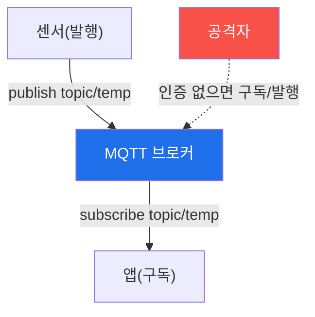

# iot-security W02 — IoT 네트워크 프로토콜: MQTT·CoAP·경량 프로토콜 보안

> **본 주차의 한 줄 요약**
>
> IoT 장치는 제약된 자원 때문에 **경량 프로토콜**을 쓴다 — HTTP 대신 **MQTT**(발행/구독 메시징)·**CoAP**(제약 환경용
> REST)·Zigbee·Z-Wave 등. 문제는 이 프로토콜들이 속도·경량을 위해 **보안을 기본으로 켜지 않는** 경우가 많다는
> 것이다: ① **인증 부재**(MQTT 브로커가 익명 접속 허용 → 누구나 토픽 구독/발행), ② **평문 통신**(TLS 없이 센서
> 데이터·명령이 그대로 흘러 감청·변조), ③ **접근 제어 부재**(한 장치가 모든 토픽에 접근 → 한 대 뚫리면 전체). 공격은
> 인증 없는 MQTT 브로커에 붙어 모든 센서 데이터를 구독하거나, 가짜 명령을 발행(문 열기·히터 켜기)하거나, 평문을
> 감청·변조하는 것이다. 실습에서는 프로토콜 취약성을 평가하고(마커 `PROTOCOL_WEAK`), 감청·가짜 명령 가능성을
> 판정하며(마커 `INTERCEPT_POSSIBLE`), TLS·인증·ACL로 강화한다(마커 `PROTOCOL_SECURED`). 방어는 **TLS 암호화·인증·
> ACL(최소 권한)**이다. 경량이라도 보안은 켜야 한다 — 편의를 위해 끄면 전체 IoT 메시징이 노출된다.

---

## 학습 목표

본 주차 종료 시 학생은 다음 5가지를 **본인 손으로** 할 수 있어야 한다.

1. 경량 IoT 프로토콜(MQTT·CoAP)의 특성과 pub/sub 구조를 설명한다.
2. 프로토콜 **보안 취약성**(인증·암호화·ACL 부재)을 평가한다(마커 `PROTOCOL_WEAK`).
3. **감청·가짜 명령** 가능성을 판정한다(마커 `INTERCEPT_POSSIBLE`).
4. **TLS·인증·ACL**로 강화한다(마커 `PROTOCOL_SECURED`).
5. 경량과 보안의 균형을 종합한다(마커 `Assessment`).

> **이 주차의 시선** — 경량을 위해 보안을 끈 IoT 프로토콜의 위험을 평가하고, 켜서 막는다. "경량이 보안 생략의
> 핑계가 되면 안 된다"가 핵심이다.

---

## 0. 용어 해설 (IoT 프로토콜)

| 용어 | 영문 | 뜻 | 비유 |
|------|------|----|------|
| **MQTT** | Message Queuing Telemetry Transport | 경량 발행/구독 메시징 프로토콜 | 방송 채널 |
| **CoAP** | Constrained Application Protocol | 제약 환경용 경량 REST | 경량 웹 |
| **브로커** | Broker | MQTT 메시지를 중계하는 서버 | 우체국 |
| **토픽** | Topic | 발행/구독하는 메시지 채널(`home/door`) | 채널 이름 |
| **익명 접속** | Anonymous Access | 인증 없이 브로커 접속 허용 | 무단 출입 허용 |
| **ACL** | Access Control List | 장치별 허용 토픽 목록 | 출입 명단 |
| **중간자** | Man-in-the-Middle | 평문 통신을 가로채 변조 | 편지 가로채기 |

> **헷갈리기 쉬운 한 쌍 — 경량 vs 보안 기본 꺼짐.** *경량*은 자원 절약(좋음)이고, *보안 기본 꺼짐*은 경량을 위해
> 인증·암호를 생략한 것(나쁨)이다. 경량 자체는 문제가 아니라 보안을 끈 채 쓰는 것이 문제다 — TLS·인증·ACL의 성능
> 영향은 미미하다.

---

## 0.5 신입생 친화 핵심 개념

### 0.5.1 MQTT 발행/구독

센서가 토픽에 데이터를 발행하고, 앱이 구독한다. **인증이 없으면** 공격자도 붙어 구독(데이터 훔치기)·발행(가짜 명령)할
수 있다.

### 0.5.2 3대 취약점 — 인증·암호·ACL

- **인증 부재**: 브로커가 익명 접속 허용 → 누구나 접속. `allow_anonymous true`는 위험.
- **평문 통신**: TLS 없으면 센서 데이터·명령이 그대로 → 감청(도청)·변조(중간자).
- **ACL 부재**: 장치가 모든 토픽에 접근 → 한 장치 탈취 시 전체 메시징 장악.

셋이 겹치면 IoT 메시징 전체가 노출된다.

### 0.5.3 공격 — 감청과 가짜 명령

- **감청**: 인증 없는 브로커에 붙어 `#`(모든 토픽) 구독 → 모든 센서 데이터 수집.
- **가짜 명령**: `home/door/cmd`에 `open` 발행 → 문 열림. 명령 토픽에 인증·ACL 없으면 누구나 명령.
- **변조**: 평문 중간자로 센서 값 조작(온도 정상처럼 위장).

### 0.5.4 방어 — TLS·인증·ACL

- **TLS**: 브로커-클라이언트 통신 암호화 → 감청·변조 차단.
- **인증**: 사용자명/비밀번호 또는 클라이언트 인증서 → 익명 차단.
- **ACL**: 장치별 허용 토픽 제한(센서는 자기 토픽만 발행, 명령 토픽은 인가된 앱만) → 최소 권한.

경량이라도 이 셋을 켜면 안전하다. 성능 영향은 미미하고 보안 이득은 크다.

### 0.5.5 el34 맥락

el34엔 MQTT 브로커가 없다. 이번 주는 **프로토콜 보안 설정 평가·감청/가짜 명령 판정·방어 설계**를 실제 아티팩트 분석으로
익힌다(실제론 Mosquitto ACL·TLS 설정으로 구현).

---

## 1. IoT 프로토콜 상세 — 취약성·공격·강화

### 1.1 프로토콜 취약성 (PROTOCOL_WEAK)

- **한 줄 정의**: MQTT/CoAP의 인증·암호화·ACL 상태를 평가한다.
- **왜 중요한가**: 익명·평문·무ACL이 감청·가짜 명령의 입구다.
- **el34 맥락에서 어떻게**: 익명 접속·TLS 부재·ACL 부재를 점검해 취약을 판정하면 `PROTOCOL_WEAK`.
- **한계/주의**: "내부망이라 안전"은 오해 — 한 장치만 뚫려도 전체가 노출된다.

### 1.2 감청·가짜 명령 (INTERCEPT_POSSIBLE)

- **한 줄 정의**: 인증 없는 브로커에서 구독(감청)·발행(가짜 명령)이 가능함을 판정한다.
- **핵심**: `#` 구독으로 전체 감청, 명령 토픽 발행으로 물리 제어.
- **판정**: 감청·가짜 명령이 가능하면 `INTERCEPT_POSSIBLE`.

### 1.3 프로토콜 강화 (PROTOCOL_SECURED)

- **한 줄 정의**: TLS·인증·ACL을 적용해 감청·가짜 명령을 막는다.
- **핵심**: TLS(감청 차단) + 인증(익명 차단) + ACL(최소 권한).
- **판정**: 강화가 적용되면 `PROTOCOL_SECURED`.

---

## 2. 실습 안내 (총 5 미션)

실행 위치는 el34 **호스트**(`ssh ccc@{{TARGET_IP}}`, 비밀번호 `1`), 참고 GPU는 Ollama
(`http://211.170.162.139:10934`, gemma3:4b)다. ⚠️ 물리 IoT 브로커는 실물이 필요해 프로토콜 보안·공격·방어 로직을
el34에서 실제 아티팩트(설정·캡처·로그)를 만들어 strings·grep·awk 로 분석한다. 각 미션의 마지막 줄 마커가 채점 기준이다.

### 미션 1 — GPU 헬스체크 → `GEN_OK`

> **왜 하는가?** 분석·종합에 쓸 LLM 도달·응답 확인.
> **무엇을 아는가?** Ollama 응답 형식·도달성.
> **결과 해석** — 정상 `GEN_OK` / 비정상 `GEN_EMPTY`·연결 오류.
> **실전 활용** — 종합 소견 작성에 사용.

### 미션 2 — 프로토콜 취약성 → `PROTOCOL_WEAK`

> **왜 하는가?** 감청·가짜 명령의 입구인 프로토콜 상태를 평가한다.
> **무엇을 아는가?** 익명·평문·무ACL 여부.
> **결과 해석** — 정상: 취약 판정 + `PROTOCOL_WEAK`.
> **실전 활용** — MQTT/CoAP 보안 진단.

### 미션 3 — 감청·가짜 명령 → `INTERCEPT_POSSIBLE`

> **왜 하는가?** 무보안 브로커의 실제 위협을 확인한다.
> **무엇을 아는가?** 전체 구독·명령 발행·변조.
> **결과 해석** — 정상: 가능 판정 + `INTERCEPT_POSSIBLE`.
> **실전 활용** — IoT 메시징 위험 실증.

### 미션 4 — 프로토콜 강화 → `PROTOCOL_SECURED`

> **왜 하는가?** TLS·인증·ACL로 무보안을 닫는다.
> **무엇을 아는가?** TLS·인증·ACL 조합.
> **결과 해석** — 정상: 강화 + `PROTOCOL_SECURED`.
> **실전 활용** — MQTT 보안 설정 권고.

### 미션 5 — 종합 소견 → `Assessment`

> **왜 하는가?** 취약성·공격·강화와 "경량이라도 보안은 켠다"를 소견으로 묶는다.
> **무엇을 아는가?** GPU에 요약시키되 첫 줄을 `Assessment`로 강제.
> **결과 해석** — 정상: `Assessment` 포함. 없으면 `[형식 미준수 — 재실행]`.
> **실전 활용** — IoT 프로토콜 보안 개요.

---

## 2.5 과제 (제출물)

- **A. 프로토콜 취약성 실증 (필수, 40점)** — `PROTOCOL_WEAK` 단계를 직접 수행해 실제 명령·출력(또는 아티팩트 분석 결과)을 캡처하고, 무엇을 근거로 판정했는지 서술한다.
- **B. 감청·가짜 명령 분석 (필수, 30점)** — `INTERCEPT_POSSIBLE` 단계를 직접 수행해 실제 명령·출력(또는 아티팩트 분석 결과)을 캡처하고, 무엇을 근거로 판정했는지 서술한다.
- **C. 프로토콜 강화 방어 설계 (필수, 30점)** — `PROTOCOL_SECURED` 단계를 직접 수행해 실제 명령·출력(또는 아티팩트 분석 결과)을 캡처하고, 무엇을 근거로 판정했는지 서술한다.

## 2.6 평가 기준

| 항목 | 미흡(0) | 보통 | 우수 |
|------|---------|------|------|
| 탐지/실증(PROTOCOL_WEAK) | 미수행 | 마커 도출 | 근거·해석·재현까지 |
| 분석(INTERCEPT_POSSIBLE) | 미수행 | 마커 도출 | 근거·해석·재현까지 |
| 방어(PROTOCOL_SECURED) | 미수행 | 마커 도출 | 근거·해석·재현까지 |

## 2.7 핵심 정리 (1줄씩)

- 이번 주 주제: **IoT 네트워크 프로토콜: MQTT·CoAP·경량 프로토콜 보안**.
- **프로토콜 취약성**(`PROTOCOL_WEAK`): MQTT/CoAP의 인증·암호화·ACL 상태를 평가한다.
- **감청·가짜 명령**(`INTERCEPT_POSSIBLE`): 인증 없는 브로커에서 구독(감청)·발행(가짜 명령)이 가능함을 판정한다.
- **프로토콜 강화**(`PROTOCOL_SECURED`): TLS·인증·ACL을 적용해 감청·가짜 명령을 막는다.
- 공격을 이해한 만큼 **방어의 우선순위**가 분명해진다 — 탐지 근거와 완화를 함께 익힌다.

---

## 3. 흔한 오해·블루팀 노트

- **"경량이라 보안을 못 켠다."** — TLS·인증·ACL의 성능 영향은 미미하다. 켜야 한다.
- **"내부망이라 안전하다."** — 한 장치만 뚫려도 전체 메시징이 노출된다. ACL 최소 권한이 필요.
- **"익명 접속이 편하다."** — 누구나 명령할 수 있다. 인증이 필수.
- **"CoAP는 UDP라 안전하다."** — CoAP도 DTLS를 켜야 한다. 기본은 평문일 수 있다.
- **관제(Blue) 관점** — MQTT/CoAP에 (1) 인증·TLS·ACL이 켜졌는가, (2) 익명 접속이 막혔는가, (3) 명령 토픽이 인가된
  장치만 접근하는가를 점검한다. 경량 프로토콜의 기본 설정은 대개 안전하지 않다.

---

## 4. 다음 주차 (W03) 예고 — 하드웨어 인터페이스 보안

W02가 "네트워크 프로토콜"이었다면, W03은 **하드웨어 인터페이스(UART·JTAG·SPI)**를 다룬다. 물리 디버그 포트로 장치에
직접 접근해 펌웨어를 추출·조작하는 공격과 방어를 익힌다(실물 장치·인터페이스 필요).
