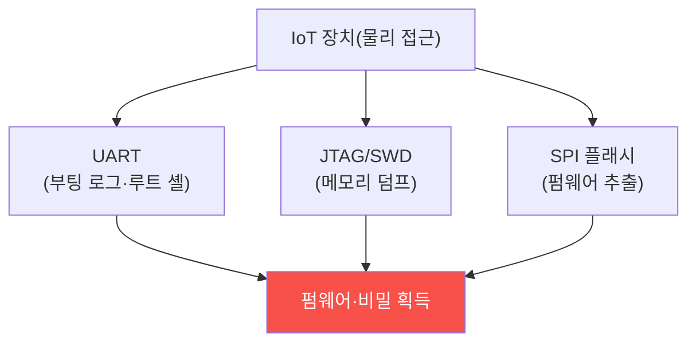

# iot-security W03 — 하드웨어 인터페이스 보안: UART·JTAG·SPI·펌웨어 추출

> **본 주차의 한 줄 요약**
>
> W03은 IoT 장치의 **물리 하드웨어 인터페이스** 공격을 다룬다. 장치를 손에 넣으면(구매·분해), 기판의 **디버그
> 포트**로 내부에 직접 접근할 수 있다: ① **UART**(시리얼 콘솔) — 부팅 로그·셸에 접근(종종 인증 없는 루트 셸!),
> ② **JTAG/SWD**(칩 디버그) — CPU를 멈추고 메모리·레지스터를 읽고 펌웨어를 덤프, ③ **SPI/I2C**(플래시 칩) —
> 펌웨어가 저장된 플래시 칩을 직접 읽어 **펌웨어 추출**. 이렇게 추출한 펌웨어를 분석하면(W04) 하드코딩된 비밀·
> 취약점·백도어를 찾는다. 문제는 제조사가 **개발용 디버그 인터페이스를 양산 제품에 그대로 남긴다**는 것 — 비용·
> 편의 때문에 비활성화·제거를 안 한다. 그래서 물리 접근만 있으면 장치가 열린다. 방어: **양산 시 디버그 비활성**
> (UART 콘솔 잠금·JTAG fuse 끊기), **보안 부팅(secure boot)**(서명된 펌웨어만 실행), **플래시 암호화**(추출해도
> 못 읽게), **탬퍼 감지**(개봉 시 삭제). 물리 접근을 완전히 막을 순 없으니, **접근해도 못 얻게** 설계한다.
>
> ⚠️ **el34 범위**: UART/JTAG/SPI 접근은 **실물 장치·하드웨어 도구**(로직 분석기·플래시 프로그래머·JTAG 어댑터)
> 가 필요하다. 본 실습은 **노출 인터페이스 평가·펌웨어 추출 가능성·방어 설계**를 결정론 시뮬로 익힌다.
>
> **한 줄 결론**: 양산 제품에 남은 UART/JTAG/SPI 디버그 인터페이스는 물리 접근으로 펌웨어를 추출당한다. 방어 =
> **디버그 비활성 + 보안 부팅 + 플래시 암호화 + 탬퍼 감지**. 접근해도 못 얻게.

---

## 학습 목표

본 주차 종료 시 학생은 다음 5가지를 **본인 손으로** 할 수 있어야 한다.

1. **UART·JTAG·SPI** 인터페이스와 그 위협을 설명한다.
2. **노출된 디버그 인터페이스**를 평가한다(DEBUG_EXPOSED).
3. **펌웨어 추출** 가능성을 판정한다(FIRMWARE_EXTRACTABLE).
4. **디버그 비활성·보안 부팅·암호화**로 강화한다(HW_HARDENED).
5. 물리 접근을 전제한 방어의 필요를 설명한다.

> **이 주차의 시선** — 물리 접근으로 열리는 하드웨어 인터페이스를, 디버그 비활성·암호화로 막는다.

---

## 0. 용어 해설 (하드웨어 인터페이스)

| 용어 | 영문 | 뜻 | 비유 |
|------|------|----|------|
| **UART** | — | 시리얼 콘솔 | 관리자 터미널 |
| **JTAG** | — | 칩 디버그 | 내부 진단 포트 |
| **SPI** | — | 플래시 칩 통신 | 저장소 직결 |
| **secure boot** | Secure Boot | 서명된 펌웨어만 | 정품 확인 부팅 |
| **탬퍼 감지** | Tamper Detection | 개봉 감지 | 봉인 |

> **헷갈리기 쉬운 한 쌍** — *UART* 는 "소프트웨어 콘솔(셸)", *JTAG/SPI* 는 "하드웨어 직접(메모리/플래시)"이다.
> 전자는 로그인, 후자는 물리 덤프.

---

## 0.5 신입생 친화 핵심 개념

### 0.5.1 디버그 인터페이스로 열린다

기판의 디버그 포트에 프로브를 연결하면 내부에 직접 접근한다. UART로 셸을 얻거나, JTAG/SPI로 펌웨어를 통째로
덤프한다.

### 0.5.2 왜 남아 있나 — 개발 편의

제조사는 개발·디버깅에 이 인터페이스를 쓴다. **양산 시 비활성화·제거해야** 하지만, 비용·편의·실수로 남긴다.
UART에 로그인 없이 루트 셸이 뜨거나, JTAG가 잠기지 않아 펌웨어를 그대로 덤프할 수 있다.

### 0.5.3 펌웨어 추출 → 분석

추출한 펌웨어(W04에서 분석)에는 **하드코딩된 비밀**(비밀번호·API 키·인증서), **취약점**(오래된 라이브러리),
때로 **백도어**가 있다. 한 대의 펌웨어를 뜯으면 **같은 모델 전체**의 비밀을 안다 — 하드코딩 비밀은 모든 장치가
공유하니까. 물리 접근 한 번이 전 제품 위협.

### 0.5.4 방어 — 접근해도 못 얻게

- **디버그 비활성**: 양산 펌웨어에서 UART 셸 비활성·인증 요구, JTAG fuse를 끊어 잠금.
- **보안 부팅**: 서명된 펌웨어만 실행 → 변조 펌웨어 거부.
- **플래시 암호화**: 플래시 내용을 암호화 → SPI로 덤프해도 못 읽음.
- **탬퍼 감지**: 케이스 개봉 시 키·데이터 삭제.
물리 접근을 완전히 막을 순 없으니, **접근해도 얻는 게 없게** 설계한다.

### 0.5.5 el34 맥락

UART/JTAG/SPI는 실물 장치·하드웨어 도구가 필요하다. 본 실습은 **노출 인터페이스 평가·펌웨어 추출 가능성·방어
설계**를 결정론 시뮬로 익힌다. 물리 하드웨어 공격은 실물 장치·인터페이스가 필요함을 명시한다.

---

## 1. 실습 안내 (5 미션)

실행 위치 el34 **호스트**(`ssh ccc@{{TARGET_IP}}`), GPU `http://211.170.162.139:10934`.
⚠️ 물리 하드웨어 인터페이스는 실물 장치·도구 필요 → 본 실습은 평가·방어 로직 결정론 시뮬.

### STEP 1 — GPU 헬스체크 → GEN_OK
### STEP 2 — 노출 디버그 인터페이스 → DEBUG_EXPOSED
### STEP 3 — 펌웨어 추출 가능성 → FIRMWARE_EXTRACTABLE
### STEP 4 — 하드웨어 강화 → HW_HARDENED
### STEP 5 — 종합 → Assessment

---

## 2. 흔한 오해·관제자 노트

- **"물리 접근은 못 막으니 포기"** — 접근해도 못 얻게(암호화·보안 부팅) 설계.
- **"디버그 포트는 개발용"** — 양산에 남으면 공격 통로. 비활성·제거.
- **"하드코딩 비밀은 하나뿐"** — 같은 모델 전체가 공유. 한 대 뜯으면 전부.
- **관제 관점** — 양산 장치의 디버그 인터페이스가 비활성인지, 보안 부팅·플래시 암호화가 있는지, 하드코딩 비밀이
  없는지 점검한다. IoT 하드웨어 보안은 "접근해도 못 얻게"가 원칙.

---

## 3. 다음 주차 (W04) 예고 — 펌웨어 분석

W03이 "펌웨어 추출"이었다면, W04는 추출한 **펌웨어 분석** — 펌웨어를 언팩해 하드코딩 비밀·취약점·백도어를 찾는
정적 분석과 방어(비밀 제거·서명·최소 구성)를 다룬다.
