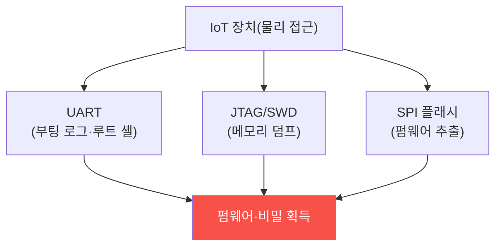

# iot-security W03 — 하드웨어 인터페이스 보안: UART·JTAG·SPI·펌웨어 추출

> **본 주차의 한 줄 요약**
>
> 이번 주 W03은 IoT 장치의 **물리 하드웨어 인터페이스** 공격을 다룬다. 장치를 손에 넣으면(구매·분해), 기판의 **디버그
> 포트**로 내부에 직접 접근할 수 있다: ① **UART**(시리얼 콘솔) — 부팅 로그·셸에 접근(종종 인증 없는 루트 셸!), ②
> **JTAG/SWD**(칩 디버그) — CPU를 멈추고 메모리·레지스터를 읽고 펌웨어를 덤프, ③ **SPI/I2C**(플래시 칩) — 펌웨어가
> 저장된 플래시 칩을 직접 읽어 **펌웨어 추출**. 이렇게 추출한 펌웨어를 분석하면(W04) 하드코딩된 비밀·취약점·백도어를
> 찾는다. 문제는 제조사가 **개발용 디버그 인터페이스를 양산 제품에 그대로 남긴다**는 것이다 — 비용·편의·실수로
> 비활성화·제거를 안 한다. 그래서 물리 접근만 있으면 장치가 열린다. 실습에서는 노출된 디버그 인터페이스를 평가하고
> (마커 `DEBUG_EXPOSED`), 펌웨어 추출 가능성을 판정하며(마커 `FIRMWARE_EXTRACTABLE`), 디버그 비활성·보안 부팅·암호화로
> 강화한다(마커 `HW_HARDENED`). 방어는 **디버그 비활성·보안 부팅·플래시 암호화·탬퍼 감지**다. 물리 접근을 완전히 막을
> 순 없으니 **접근해도 못 얻게** 설계한다. (⚠ UART/JTAG/SPI 접근은 실물 장치·하드웨어 도구가 필요해 평가·방어 설계를
> el34에서 실제 아티팩트(설정·캡처·로그)를 만들어 strings·grep·awk 로 분석한다.)

---

## 학습 목표

본 주차 종료 시 학생은 다음 5가지를 **본인 손으로** 할 수 있어야 한다.

1. UART·JTAG·SPI 인터페이스와 각 위협을 설명한다.
2. **노출된 디버그 인터페이스**를 평가한다(마커 `DEBUG_EXPOSED`).
3. **펌웨어 추출** 가능성을 판정한다(마커 `FIRMWARE_EXTRACTABLE`).
4. **디버그 비활성·보안 부팅·암호화**로 강화한다(마커 `HW_HARDENED`).
5. 물리 접근을 전제한 방어("접근해도 못 얻게")를 종합한다(마커 `Assessment`).

> **이 주차의 시선** — 물리 접근으로 열리는 하드웨어 인터페이스를 디버그 비활성·암호화로 막는다. "물리 접근은 못
> 막으니 얻는 게 없게"가 핵심이다.

---

## 0. 용어 해설 (하드웨어 인터페이스)

| 용어 | 영문 | 뜻 | 비유 |
|------|------|----|------|
| **UART** | Universal Async Receiver/Transmitter | 시리얼 콘솔(부팅 로그·셸) | 관리자 터미널 |
| **JTAG/SWD** | — | 칩 디버그 인터페이스(메모리·레지스터) | 내부 진단 포트 |
| **SPI/I2C** | — | 플래시·주변장치 통신 버스 | 저장소 직결 |
| **펌웨어 덤프** | Firmware Dump | 플래시에서 펌웨어를 통째로 읽음 | 통째 복사 |
| **secure boot** | Secure Boot | 서명된 펌웨어만 실행 | 정품 확인 부팅 |
| **플래시 암호화** | Flash Encryption | 플래시 내용을 암호화 | 금고 안 서류 |
| **탬퍼 감지** | Tamper Detection | 개봉 감지 시 비밀 삭제 | 봉인 스티커 |

> **헷갈리기 쉬운 한 쌍 — UART vs JTAG/SPI.** *UART*는 소프트웨어 콘솔(셸 로그인)에 접근하고, *JTAG/SPI*는 하드웨어
> 수준에서 메모리·플래시를 직접 덤프한다. 전자는 "로그인", 후자는 "물리 복사"다.

---

## 0.5 핵심 개념

### 0.5.1 디버그 인터페이스로 열린다

기판의 디버그 포트에 프로브를 연결하면 내부에 직접 접근한다. UART로 셸을 얻거나, JTAG/SPI로 펌웨어를 통째로 덤프한다.

### 0.5.2 왜 남아 있나 — 개발 편의

제조사는 개발·디버깅에 이 인터페이스를 쓴다. 양산 시 비활성화·제거해야 하지만 비용·편의·실수로 남긴다. UART에
로그인 없이 루트 셸이 뜨거나, JTAG가 잠기지 않아 펌웨어를 그대로 덤프할 수 있다.

### 0.5.3 펌웨어 추출 → 분석

추출한 펌웨어(W04에서 분석)에는 하드코딩된 비밀(비밀번호·API 키·인증서)·취약점(오래된 라이브러리)·때로 백도어가 있다.
한 대의 펌웨어를 뜯으면 **같은 모델 전체**의 비밀을 안다 — 하드코딩 비밀은 모든 장치가 공유하니까. 물리 접근 한 번이
전 제품 위협이다.

### 0.5.4 방어 — 접근해도 못 얻게

- **디버그 비활성**: 양산 펌웨어에서 UART 셸 비활성·인증 요구, JTAG fuse를 끊어 잠금.
- **보안 부팅**: 서명된 펌웨어만 실행 → 변조 펌웨어 거부.
- **플래시 암호화**: 플래시 내용을 암호화 → SPI로 덤프해도 못 읽음.
- **탬퍼 감지**: 케이스 개봉 시 키·데이터 삭제.

물리 접근을 완전히 막을 순 없으니, 접근해도 얻는 게 없게 설계한다.

### 0.5.5 el34 맥락

UART/JTAG/SPI는 실물 장치·하드웨어 도구(로직 분석기·플래시 프로그래머·JTAG 어댑터)가 필요하다. 이번 실습은 **노출
인터페이스 평가·펌웨어 추출 가능성·방어 설계**를 el34에서 실제 아티팩트(설정·캡처·로그)를 만들어 strings·grep·awk 로 분석한다.

---

## 1. 하드웨어 인터페이스 상세 — 노출·추출·강화

### 1.1 노출 디버그 인터페이스 (DEBUG_EXPOSED)

- **한 줄 정의**: 양산 장치에 UART/JTAG/SPI가 활성으로 남았는지 평가한다.
- **왜 중요한가**: 남은 디버그 포트가 물리 침투의 입구다.
- **el34 맥락에서 어떻게**: UART 루트 셸·JTAG 미잠금·SPI 접근 가능성을 점검하면 `DEBUG_EXPOSED`.
- **한계/주의**: 실물 프로빙이 필요하나 여기서는 평가 로직을 익힌다.

### 1.2 펌웨어 추출 가능성 (FIRMWARE_EXTRACTABLE)

- **한 줄 정의**: 플래시 암호화·보안 부팅 부재로 펌웨어 덤프가 가능한지 판정한다.
- **핵심**: 무암호 플래시 → SPI 덤프로 펌웨어·비밀 획득(전 모델 공유).
- **판정**: 추출 가능하면 `FIRMWARE_EXTRACTABLE`.

### 1.3 하드웨어 강화 (HW_HARDENED)

- **한 줄 정의**: 디버그 비활성·보안 부팅·플래시 암호화·탬퍼 감지를 적용한다.
- **핵심**: 접근해도 못 얻게(암호화·서명) + 개봉 시 삭제.
- **판정**: 강화가 적용되면 `HW_HARDENED`.

---

## 2. 실습 안내 (총 5 미션)

실행 위치는 el34 **호스트**(`ssh ccc@{{TARGET_IP}}`, 비밀번호 `1`), 참고 GPU는 Ollama
(`http://211.170.162.139:10934`, gemma3:4b)다. ⚠️ 물리 하드웨어 인터페이스는 실물 장치·도구가 필요해 평가·방어 로직을
el34에서 실제 아티팩트(설정·캡처·로그)를 만들어 strings·grep·awk 로 분석한다. 각 미션의 마지막 줄 마커가 채점 기준이다.

### 미션 1 — GPU 헬스체크 → `GEN_OK`

> **왜 하는가?** 분석·종합에 쓸 LLM 도달·응답 확인.
> **무엇을 아는가?** Ollama 응답 형식·도달성.
> **결과 해석** — 정상 `GEN_OK` / 비정상 `GEN_EMPTY`·연결 오류.
> **실전 활용** — 종합 소견 작성에 사용.

### 미션 2 — 노출 디버그 인터페이스 → `DEBUG_EXPOSED`

> **왜 하는가?** 물리 침투 입구인 디버그 포트를 평가한다.
> **무엇을 아는가?** UART 셸·JTAG 미잠금·SPI 접근.
> **결과 해석** — 정상: 노출 판정 + `DEBUG_EXPOSED`.
> **실전 활용** — 하드웨어 보안 진단.

### 미션 3 — 펌웨어 추출 가능성 → `FIRMWARE_EXTRACTABLE`

> **왜 하는가?** 펌웨어 덤프로 비밀이 전 모델에 노출됨을 확인한다.
> **무엇을 아는가?** 무암호 플래시·보안 부팅 부재.
> **결과 해석** — 정상: 추출 가능 + `FIRMWARE_EXTRACTABLE`.
> **실전 활용** — 펌웨어 유출 위험 평가.

### 미션 4 — 하드웨어 강화 → `HW_HARDENED`

> **왜 하는가?** 접근해도 못 얻게 만든다.
> **무엇을 아는가?** 디버그 비활성·보안 부팅·암호화·탬퍼.
> **결과 해석** — 정상: 강화 + `HW_HARDENED`.
> **실전 활용** — IoT 하드웨어 보안 설계.

### 미션 5 — 종합 소견 → `Assessment`

> **왜 하는가?** 노출·추출·강화와 "접근해도 못 얻게"를 소견으로 묶는다.
> **무엇을 아는가?** GPU에 요약시키되 첫 줄을 `Assessment`로 강제.
> **결과 해석** — 정상: `Assessment` 포함. 없으면 `[형식 미준수 — 재실행]`.
> **실전 활용** — IoT 하드웨어 보안 개요.

---

## 2.5 과제 (제출물)

- **A. 노출 디버그 인터페이스 실증 (필수, 40점)** — `DEBUG_EXPOSED` 단계를 직접 수행해 실제 명령·출력(또는 아티팩트 분석 결과)을 캡처하고, 무엇을 근거로 판정했는지 서술한다.
- **B. 펌웨어 추출 가능성 분석 (필수, 30점)** — `FIRMWARE_EXTRACTABLE` 단계를 직접 수행해 실제 명령·출력(또는 아티팩트 분석 결과)을 캡처하고, 무엇을 근거로 판정했는지 서술한다.
- **C. 하드웨어 강화 방어 설계 (필수, 30점)** — `HW_HARDENED` 단계를 직접 수행해 실제 명령·출력(또는 아티팩트 분석 결과)을 캡처하고, 무엇을 근거로 판정했는지 서술한다.

## 2.6 평가 기준

| 항목 | 미흡(0) | 보통 | 우수 |
|------|---------|------|------|
| 탐지/실증(DEBUG_EXPOSED) | 미수행 | 마커 도출 | 근거·해석·재현까지 |
| 분석(FIRMWARE_EXTRACTABLE) | 미수행 | 마커 도출 | 근거·해석·재현까지 |
| 방어(HW_HARDENED) | 미수행 | 마커 도출 | 근거·해석·재현까지 |

## 2.7 핵심 정리 (1줄씩)

- 이번 주 주제: **하드웨어 인터페이스 보안: UART·JTAG·SPI·펌웨어 추출**.
- **노출 디버그 인터페이스**(`DEBUG_EXPOSED`): 양산 장치에 UART/JTAG/SPI가 활성으로 남았는지 평가한다.
- **펌웨어 추출 가능성**(`FIRMWARE_EXTRACTABLE`): 플래시 암호화·보안 부팅 부재로 펌웨어 덤프가 가능한지 판정한다.
- **하드웨어 강화**(`HW_HARDENED`): 디버그 비활성·보안 부팅·플래시 암호화·탬퍼 감지를 적용한다.
- 공격을 이해한 만큼 **방어의 우선순위**가 분명해진다 — 탐지 근거와 완화를 함께 익힌다.

---

## 3. 흔한 오해·블루팀 노트

- **"물리 접근은 못 막으니 포기한다."** — 접근해도 못 얻게(암호화·보안 부팅) 설계한다.
- **"디버그 포트는 개발용이다."** — 양산에 남으면 공격 통로다. 비활성·제거한다.
- **"하드코딩 비밀은 하나뿐이다."** — 같은 모델 전체가 공유한다. 한 대 뜯으면 전부 노출.
- **"UART는 로그만 나온다."** — 종종 인증 없는 루트 셸이 뜬다.
- **관제(Blue) 관점** — 양산 장치가 (1) 디버그 인터페이스 비활성, (2) 보안 부팅, (3) 플래시 암호화, (4) 하드코딩
  비밀 부재를 갖췄는지 점검한다. IoT 하드웨어 보안은 "접근해도 못 얻게"가 원칙.

---

## 4. 다음 주차 (W04) 예고 — 펌웨어 분석

W03이 "펌웨어 추출"이었다면, W04는 추출한 **펌웨어 분석**을 다룬다. 펌웨어를 언팩해 하드코딩 비밀·취약점·백도어를 찾는
정적 분석과 방어(비밀 제거·서명·최소 구성)를 익힌다.
