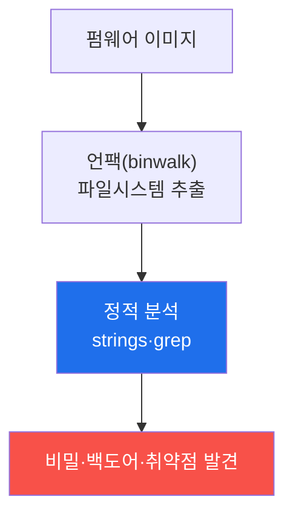

# iot-security W04 — 펌웨어 분석: 언팩·하드코딩 비밀·백도어·정적 분석

> **본 주차의 한 줄 요약**
>
> W03에서 추출한 **펌웨어(firmware)**를 이번 주 W04에서 **분석**한다. 펌웨어는 장치의 OS·앱이 담긴 이미지로, 분석하면
> 장치의 **비밀과 취약점**이 드러난다. 분석 단계는 셋이다: ① **언팩(unpack)** — `binwalk` 등으로 펌웨어 이미지에서
> 파일시스템·바이너리를 추출, ② **정적 분석** — 추출한 파일에서 하드코딩된 비밀(비밀번호·API 키·인증서·암호 키)을
> 찾고(`strings`·`grep`) 오래된 취약 라이브러리·백도어 계정(숨은 관리자)을 탐색, ③ **바이너리 분석** — 위험 함수·인증
> 로직을 역공학. 핵심 위험은 **하드코딩된 비밀은 같은 모델 전체가 공유**한다는 것이다 — 한 대의 펌웨어에서 마스터
> 비밀번호를 찾으면 **모든 장치**를 장악한다(많은 IoT 백도어가 이렇게 발견됐다). 그리고 펌웨어에 심긴 백도어 계정
> (제조사 디버그용·악의적)은 정상 인터페이스 뒤에 숨어 있다. 실습에서는 하드코딩 비밀을 추출하고(마커 `SECRETS_FOUND`),
> 백도어 계정을 탐지하며(마커 `BACKDOOR_FOUND`), 비밀 제거·서명·고유 자격으로 강화한다(마커 `FIRMWARE_HARDENED`).
> 방어는 **비밀 미포함·장치별 고유 자격·펌웨어 서명·최소 구성**이다. el34에서 모의 펌웨어의 문자열 분석은 실제로
> 수행할 수 있다.

---

## 학습 목표

본 주차 종료 시 학생은 다음 5가지를 **본인 손으로** 할 수 있어야 한다.

1. 펌웨어 분석 단계(언팩·정적·바이너리)를 설명한다.
2. **하드코딩된 비밀**을 추출한다(마커 `SECRETS_FOUND`).
3. **백도어 계정**을 탐지한다(마커 `BACKDOOR_FOUND`).
4. **비밀 제거·서명·고유 자격**으로 강화한다(마커 `FIRMWARE_HARDENED`).
5. 왜 하드코딩 비밀이 전 모델을 위협하는지 종합한다(마커 `Assessment`).

> **이 주차의 시선** — 펌웨어에 담긴 비밀과 백도어를 정적 분석으로 찾고, 애초에 안 넣게 한다. "공유 비밀 하나가
> 전부를 연다"가 핵심이다.

---

## 0. 용어 해설 (펌웨어 분석)

| 용어 | 영문 | 뜻 | 비유 |
|------|------|----|------|
| **펌웨어** | Firmware | 장치에 내장된 OS·앱 이미지 | 장치의 OS |
| **언팩** | Unpack | 이미지에서 파일시스템·바이너리 추출 | 압축 풀기 |
| **binwalk** | — | 펌웨어 이미지 분석·추출 도구 | 이미지 해체기 |
| **하드코딩 비밀** | Hardcoded Secret | 코드/펌웨어에 박힌 비밀(전 모델 공유) | 각인된 열쇠 |
| **백도어 계정** | Backdoor Account | 문서화되지 않은 숨은 관리자 계정 | 비밀 통로 |
| **정적 분석** | Static Analysis | 실행 없이 코드·문자열을 분석 | 설계도 검토 |
| **장치별 고유 자격** | Per-device Credentials | 장치마다 다른 비밀 | 개별 열쇠 |

> **헷갈리기 쉬운 한 쌍 — 하드코딩 비밀 vs 장치별 고유 자격.** *하드코딩 비밀*은 펌웨어에 박혀 전 모델이 공유한다
> (한 대 뚫리면 전부). *장치별 고유 자격*은 장치마다 달라 한 대가 뚫려도 나머지가 안전하다. 공유 비밀을 없애고 고유
> 자격으로 가는 것이 핵심 방어다.

---

## 0.5 핵심 개념

### 0.5.1 펌웨어 분석 파이프라인

이미지를 풀어 파일을 얻고, 문자열·설정을 분석해 비밀·백도어를 찾는다. 간단한 `strings`·`grep`만으로도 많은 IoT
비밀이 드러난다.

### 0.5.2 하드코딩 비밀 — 전 모델 공유의 재앙

펌웨어에 박힌 비밀번호·API 키는 그 모델의 모든 장치가 동일하다. 한 대의 펌웨어에서 `admin:SuperSecret123`을 찾으면,
판매된 수십만 대 전부의 마스터 키를 얻는다. 실제 IoT 사고의 흔한 원인 — 공유 비밀은 하나가 뚫리면 전부 뚫린다.

### 0.5.3 백도어 계정 — 숨은 통로

펌웨어에 숨은 관리자 계정(제조사 디버그용 또는 악의적)이 심겨 있는 경우가 있다: 정상 로그인 뒤에 문서화되지 않은
`factory:factory` 같은 계정, 특정 입력에 반응하는 숨은 명령. 정적 분석으로 인증 관련 문자열·로직을 뒤져 백도어를
찾는다(ai-safety-adv의 백도어 개념의 IoT판).

### 0.5.4 방어 — 비밀을 안 넣는다

- **비밀 미포함**: 펌웨어에 비밀을 하드코딩하지 않음. 부팅 시 보안 저장소(TPM/Secure Element)에서 로드하거나 최초
  프로비저닝 시 생성.
- **장치별 고유 자격**: 각 장치가 다른 비밀 → 한 대 뚫려도 나머지 안전.
- **펌웨어 서명**: 서명 검증으로 변조·백도어 삽입 방지(보안 부팅과 연계).
- **최소 구성**: 불필요한 계정·서비스·디버그 문자열 제거.

비밀을 애초에 안 넣으면 추출당해도 얻을 게 없다.

### 0.5.5 el34 맥락

펌웨어 문자열 분석은 el34에서 **실제로 수행 가능**하다(모의 펌웨어 파일에 strings·grep). 이번 주는 모의 펌웨어에 심은
하드코딩 비밀·백도어를 실제 분석 명령으로 찾는다. 실물 펌웨어 추출(binwalk 언팩)은 실제 장치 이미지가 필요하지만,
정적 분석 기법은 동일하다.

---

## 1. 펌웨어 분석 상세 — 비밀·백도어·강화

### 1.1 하드코딩 비밀 추출 (SECRETS_FOUND)

- **한 줄 정의**: 펌웨어 문자열에서 비밀번호·키·인증서를 찾는다.
- **왜 중요한가**: 공유 비밀 하나가 전 모델을 연다.
- **el34 맥락에서 어떻게**: `strings`·`grep`로 자격·키 패턴을 찾으면 `SECRETS_FOUND`.
- **한계/주의**: 난독화·암호화된 비밀은 추가 분석이 필요하다.

### 1.2 백도어 계정 탐지 (BACKDOOR_FOUND)

- **한 줄 정의**: 문서화되지 않은 숨은 계정·명령을 찾는다.
- **핵심**: 인증 관련 문자열·로직에서 factory 계정·숨은 명령 탐색.
- **판정**: 백도어가 탐지되면 `BACKDOOR_FOUND`.

### 1.3 펌웨어 강화 (FIRMWARE_HARDENED)

- **한 줄 정의**: 비밀 제거·서명·고유 자격·최소 구성을 적용한다.
- **핵심**: 비밀 미포함(보안 저장소) + 장치별 고유 자격 + 서명 + 최소화.
- **판정**: 강화가 적용되면 `FIRMWARE_HARDENED`.

---

## 2. 실습 안내 (총 5 미션)

실행 위치는 el34 **호스트**(`ssh ccc@{{TARGET_IP}}`, 비밀번호 `1`), 참고 GPU는 Ollama
(`http://211.170.162.139:10934`, gemma3:4b)다. 펌웨어 문자열 분석은 모의 펌웨어에서 실제로 수행한다. 각 미션의 마지막
줄 마커가 채점 기준이다.

### 미션 1 — GPU 헬스체크 → `GEN_OK`

> **왜 하는가?** 분석·종합에 쓸 LLM 도달·응답 확인.
> **무엇을 아는가?** Ollama 응답 형식·도달성.
> **결과 해석** — 정상 `GEN_OK` / 비정상 `GEN_EMPTY`·연결 오류.
> **실전 활용** — 종합 소견 작성에 사용.

### 미션 2 — 하드코딩 비밀 추출 → `SECRETS_FOUND`

> **왜 하는가?** 펌웨어에 박힌 비밀을 찾아 전 모델 위협을 실증한다.
> **무엇을 아는가?** strings·grep로 자격·키 탐색.
> **결과 해석** — 정상: 비밀 발견 + `SECRETS_FOUND`.
> **실전 활용** — 펌웨어 비밀 감사.

### 미션 3 — 백도어 계정 탐지 → `BACKDOOR_FOUND`

> **왜 하는가?** 숨은 통로를 찾아 무단 접근을 막는다.
> **무엇을 아는가?** 문서화 안 된 계정·명령 탐색.
> **결과 해석** — 정상: 백도어 발견 + `BACKDOOR_FOUND`.
> **실전 활용** — 펌웨어 백도어 감사.

### 미션 4 — 펌웨어 강화 → `FIRMWARE_HARDENED`

> **왜 하는가?** 애초에 얻을 게 없게 만든다.
> **무엇을 아는가?** 비밀 제거·고유 자격·서명·최소 구성.
> **결과 해석** — 정상: 강화 + `FIRMWARE_HARDENED`.
> **실전 활용** — 펌웨어 보안 권고.

### 미션 5 — 종합 소견 → `Assessment`

> **왜 하는가?** 비밀·백도어·강화와 "공유 비밀의 재앙"을 소견으로 묶는다.
> **무엇을 아는가?** GPU에 요약시키되 첫 줄을 `Assessment`로 강제.
> **결과 해석** — 정상: `Assessment` 포함. 없으면 `[형식 미준수 — 재실행]`.
> **실전 활용** — 펌웨어 보안 개요.

---

## 2.5 과제 (제출물)

- **A. 하드코딩 비밀 추출 실증 (필수, 40점)** — `SECRETS_FOUND` 단계를 직접 수행해 실제 명령·출력(또는 아티팩트 분석 결과)을 캡처하고, 무엇을 근거로 판정했는지 서술한다.
- **B. 백도어 계정 탐지 분석 (필수, 30점)** — `BACKDOOR_FOUND` 단계를 직접 수행해 실제 명령·출력(또는 아티팩트 분석 결과)을 캡처하고, 무엇을 근거로 판정했는지 서술한다.
- **C. 펌웨어 강화 방어 설계 (필수, 30점)** — `FIRMWARE_HARDENED` 단계를 직접 수행해 실제 명령·출력(또는 아티팩트 분석 결과)을 캡처하고, 무엇을 근거로 판정했는지 서술한다.

## 2.6 평가 기준

| 항목 | 미흡(0) | 보통 | 우수 |
|------|---------|------|------|
| 탐지/실증(SECRETS_FOUND) | 미수행 | 마커 도출 | 근거·해석·재현까지 |
| 분석(BACKDOOR_FOUND) | 미수행 | 마커 도출 | 근거·해석·재현까지 |
| 방어(FIRMWARE_HARDENED) | 미수행 | 마커 도출 | 근거·해석·재현까지 |

## 2.7 핵심 정리 (1줄씩)

- 이번 주 주제: **펌웨어 분석: 언팩·하드코딩 비밀·백도어·정적 분석**.
- **하드코딩 비밀 추출**(`SECRETS_FOUND`): 펌웨어 문자열에서 비밀번호·키·인증서를 찾는다.
- **백도어 계정 탐지**(`BACKDOOR_FOUND`): 문서화되지 않은 숨은 계정·명령을 찾는다.
- **펌웨어 강화**(`FIRMWARE_HARDENED`): 비밀 제거·서명·고유 자격·최소 구성을 적용한다.
- 공격을 이해한 만큼 **방어의 우선순위**가 분명해진다 — 탐지 근거와 완화를 함께 익힌다.

---

## 3. 흔한 오해·블루팀 노트

- **"펌웨어는 못 읽는다."** — `strings`·`grep`만으로 많은 비밀이 드러난다.
- **"비밀 하나쯤은 괜찮다."** — 하드코딩 비밀은 전 모델 공유다. 하나가 전부.
- **"백도어는 없다."** — 문서화 안 된 계정·명령이 흔하다. 정적 분석으로 확인한다.
- **"암호화하면 못 찾는다."** — 난독화는 지연일 뿐, 궁극적으로 비밀을 안 넣는 것이 답이다.
- **관제(Blue) 관점** — 펌웨어에 (1) 하드코딩 비밀·백도어가 없는가, (2) 장치별 고유 자격인가, (3) 서명·최소 구성인가를
  점검한다. 펌웨어 정적 분석은 IoT 보안 평가의 핵심이다.

---

## 4. 다음 주차 (W05) 예고 — IoT 웹 인터페이스 공격

W04가 "펌웨어 분석"이었다면, W05는 IoT 장치의 **웹 관리 인터페이스** 공격을 다룬다. 명령 주입·인증 우회·CSRF 등 웹
취약점과 방어를 익히며, el34 웹 서비스로 실측한다.
