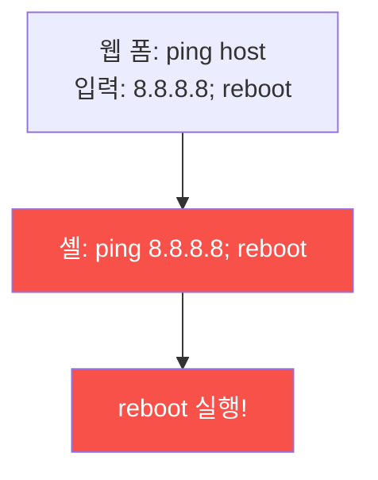

# iot-security W05 — IoT 웹 인터페이스 공격: 명령 주입·인증 우회·CSRF

> **본 주차의 한 줄 요약**
>
> 대부분의 IoT 장치는 **웹 관리 인터페이스**(설정 페이지)를 제공한다. 이 웹 UI는 종종 **가장 약한 공격 표면**이다 —
> 제약된 장치에서 급하게 만든 웹 서버라 웹 보안 기본이 빠진 경우가 많다. 대표 취약점: ① **명령 주입(command
> injection)** — 웹 폼 입력(핑 테스트·호스트명)을 셸 명령에 그대로 넣어 `; reboot`·`; cat /etc/passwd` 같은 명령을
> 실행(IoT의 흔한 치명적 취약점), ② **인증 우회** — 기본 자격(admin/admin)·약한 세션·인증 없는 API 엔드포인트, ③
> **CSRF** — 로그인된 관리자를 속여 악의적 설정 변경 요청 실행, ④ **접근 통제 부재** — URL만 알면 인증 없이 접근.
> 이 취약점들로 공격자는 장치를 **완전 장악**(설정 변경·펌웨어 교체·봇넷 편입)한다. 실습에서는 명령 주입을 탐지하고
> (마커 `CMD_INJECTION`), 인증 우회를 평가하며(마커 `AUTH_BYPASS`), 입력 검증·인증·CSRF로 강화한다(마커
> `WEB_HARDENED`). 방어는 **웹 보안 기본**이다: 입력 검증·이스케이프(명령 주입 차단), 강한 인증·세션(기본 자격 강제
> 변경), CSRF 토큰, 접근 통제. IoT라고 웹 보안을 건너뛰면 안 된다 — el34의 웹 서비스로 명령 주입·인증 취약점을
> 실측할 수 있다.

---

## 학습 목표

본 주차 종료 시 학생은 다음 5가지를 **본인 손으로** 할 수 있어야 한다.

1. IoT 웹 인터페이스가 왜 취약한지(급조·기본 누락) 설명한다.
2. **명령 주입**을 탐지한다(마커 `CMD_INJECTION`).
3. **인증 우회**(기본 자격·약한 세션·무인증 API)를 평가한다(마커 `AUTH_BYPASS`).
4. **입력 검증·인증·CSRF**로 강화한다(마커 `WEB_HARDENED`).
5. IoT에서도 웹 보안 기본이 필요한 이유를 종합한다(마커 `Assessment`).

> **이 주차의 시선** — 급조된 IoT 웹 UI의 웹 취약점을 웹 보안 기본으로 막는다. "IoT라고 예외 없다"가 핵심이다.

---

## 0. 용어 해설 (IoT 웹)

| 용어 | 영문 | 뜻 | 비유 |
|------|------|----|------|
| **명령 주입** | Command Injection | 웹 입력이 셸 명령으로 실행됨 | 주문서에 명령 끼우기 |
| **인증 우회** | Auth Bypass | 인증을 건너뛰고 접근 | 검문 우회 |
| **CSRF** | Cross-Site Request Forgery | 로그인 사용자를 속여 위조 요청 실행 | 속여서 결재시키기 |
| **강제 브라우징** | Forced Browsing | URL만 알면 인증 없이 접근 | 뒷문으로 들어가기 |
| **입력 검증** | Input Validation | 입력을 정제·화이트리스트 검사 | 검문 |
| **CSRF 토큰** | CSRF Token | 정당 요청임을 증명하는 토큰 | 결재 확인 도장 |

> **헷갈리기 쉬운 한 쌍 — 명령 주입 vs 인증 우회.** *명령 주입*은 입력이 셸 명령이 되어 코드가 실행되는 것,
> *인증 우회*는 로그인을 건너뛰고 접근하는 것이다. 둘 다 IoT 웹에 흔하며, 결합되면 무인증 원격 코드 실행이 된다.

---

## 0.5 핵심 개념

### 0.5.1 명령 주입 — IoT의 흔한 치명타

IoT 웹은 "핑 테스트"·"호스트명 설정" 같은 기능에서 입력을 셸 명령에 그대로 넣는다. `; reboot`·`| nc`를 끼우면 임의
명령이 실행된다. 제약된 장치에서 급조돼 검증이 빠진 결과다.

### 0.5.2 인증 우회

- **기본 자격**: admin/admin 미변경(W01) → 그냥 로그인.
- **약한 세션**: 예측 가능한 세션 토큰·만료 없음 → 세션 탈취.
- **인증 없는 API**: `/api/config`가 인증 없이 접근 → 설정 변경.
- **접근 통제 부재**: URL만 알면 관리 페이지 접근(강제 브라우징).

### 0.5.3 CSRF — 관리자를 속인다

로그인된 관리자가 악성 페이지를 열면, 그 페이지가 관리자 권한으로 IoT에 요청을 보낸다(비밀번호 변경·설정 변경). CSRF
토큰이 없으면 요청이 정당한지 구분 못 한다. IoT 웹은 CSRF 방어가 빠진 경우가 많다.

### 0.5.4 방어 — 웹 보안 기본

- **입력 검증·이스케이프**: 셸에 넘기지 말고 안전한 API 사용, 또는 엄격한 화이트리스트 검증(명령 주입 차단).
- **강한 인증·세션**: 기본 자격 강제 변경, 안전한 세션 토큰·만료, API 인증.
- **CSRF 토큰**: 상태 변경 요청에 토큰 검증.
- **접근 통제**: 모든 엔드포인트에 권한 검사.

IoT라고 웹 보안을 건너뛰면 장치가 완전 장악된다. 웹 보안의 기본이 그대로 적용된다.

### 0.5.5 el34 맥락

el34의 웹 서비스로 **명령 주입·인증 취약점을 실측**할 수 있다(bastion apache 관찰, 웹 요청 분석). 이번 주는 명령 주입
탐지·인증 우회 평가·방어를 익힌다. IoT 특유의 급조된 웹 UI 취약성에 초점을 둔다.

---

## 1. IoT 웹 상세 — 명령 주입·인증 우회·강화

### 1.1 명령 주입 탐지 (CMD_INJECTION)

- **한 줄 정의**: 웹 입력이 셸 명령으로 실행되는 취약점을 탐지한다.
- **왜 중요한가**: 무인증 명령 주입은 장치 완전 장악·봇넷 편입으로 직결된다.
- **el34 맥락에서 어떻게**: 핑/호스트명 입력에 `;`·`|` 주입이 실행되는지 확인하면 `CMD_INJECTION`.
- **한계/주의**: 블라인드 주입(출력 없음)은 시간·부채널로 확인한다.

### 1.2 인증 우회 평가 (AUTH_BYPASS)

- **한 줄 정의**: 기본 자격·약한 세션·무인증 API로 접근이 되는지 평가한다.
- **핵심**: admin/admin·세션 예측·무인증 엔드포인트·강제 브라우징.
- **판정**: 인증 우회가 가능하면 `AUTH_BYPASS`.

### 1.3 웹 강화 (WEB_HARDENED)

- **한 줄 정의**: 입력 검증·강한 인증·CSRF 토큰·접근 통제를 적용한다.
- **핵심**: 명령 주입 차단 + 기본 자격 강제 변경 + CSRF + 엔드포인트 권한 검사.
- **판정**: 강화가 적용되면 `WEB_HARDENED`.

---

## 2. 실습 안내 (총 5 미션)

실행 위치는 el34 **호스트**(`ssh ccc@{{TARGET_IP}}`, 비밀번호 `1`), 참고 GPU는 Ollama
(`http://211.170.162.139:10934`, gemma3:4b)다. IoT 웹 취약점은 el34 웹 서비스로 실측·분석한다. 각 미션의 마지막 줄
마커가 채점 기준이다.

### 미션 1 — GPU 헬스체크 → `GEN_OK`

> **왜 하는가?** 분석·종합에 쓸 LLM 도달·응답 확인.
> **무엇을 아는가?** Ollama 응답 형식·도달성.
> **결과 해석** — 정상 `GEN_OK` / 비정상 `GEN_EMPTY`·연결 오류.
> **실전 활용** — 종합 소견 작성에 사용.

### 미션 2 — 명령 주입 탐지 → `CMD_INJECTION`

> **왜 하는가?** IoT 웹의 가장 치명적 취약점을 확인한다.
> **무엇을 아는가?** 입력→셸 실행·주입 문자(`;`·`|`).
> **결과 해석** — 정상: 탐지 + `CMD_INJECTION`.
> **실전 활용** — IoT 웹 명령 주입 진단.

### 미션 3 — 인증 우회 평가 → `AUTH_BYPASS`

> **왜 하는가?** 무단 접근 경로를 평가한다.
> **무엇을 아는가?** 기본 자격·약한 세션·무인증 API.
> **결과 해석** — 정상: 우회 판정 + `AUTH_BYPASS`.
> **실전 활용** — 인증 취약점 진단.

### 미션 4 — 웹 강화 → `WEB_HARDENED`

> **왜 하는가?** 웹 보안 기본으로 장악을 막는다.
> **무엇을 아는가?** 입력 검증·인증·CSRF·접근 통제.
> **결과 해석** — 정상: 강화 + `WEB_HARDENED`.
> **실전 활용** — IoT 웹 보안 권고.

### 미션 5 — 종합 소견 → `Assessment`

> **왜 하는가?** 명령 주입·인증 우회·강화와 "IoT도 웹 보안 기본"을 소견으로 묶는다.
> **무엇을 아는가?** GPU에 요약시키되 첫 줄을 `Assessment`로 강제.
> **결과 해석** — 정상: `Assessment` 포함. 없으면 `[형식 미준수 — 재실행]`.
> **실전 활용** — IoT 웹 보안 개요.

---

## 2.5 과제 (제출물)

- **A. 명령 주입 탐지 실증 (필수, 40점)** — `CMD_INJECTION` 단계를 직접 수행해 실제 명령·출력(또는 아티팩트 분석 결과)을 캡처하고, 무엇을 근거로 판정했는지 서술한다.
- **B. 인증 우회 평가 분석 (필수, 30점)** — `AUTH_BYPASS` 단계를 직접 수행해 실제 명령·출력(또는 아티팩트 분석 결과)을 캡처하고, 무엇을 근거로 판정했는지 서술한다.
- **C. 웹 강화 방어 설계 (필수, 30점)** — `WEB_HARDENED` 단계를 직접 수행해 실제 명령·출력(또는 아티팩트 분석 결과)을 캡처하고, 무엇을 근거로 판정했는지 서술한다.

## 2.6 평가 기준

| 항목 | 미흡(0) | 보통 | 우수 |
|------|---------|------|------|
| 탐지/실증(CMD_INJECTION) | 미수행 | 마커 도출 | 근거·해석·재현까지 |
| 분석(AUTH_BYPASS) | 미수행 | 마커 도출 | 근거·해석·재현까지 |
| 방어(WEB_HARDENED) | 미수행 | 마커 도출 | 근거·해석·재현까지 |

## 2.7 핵심 정리 (1줄씩)

- 이번 주 주제: **IoT 웹 인터페이스 공격: 명령 주입·인증 우회·CSRF**.
- **명령 주입 탐지**(`CMD_INJECTION`): 웹 입력이 셸 명령으로 실행되는 취약점을 탐지한다.
- **인증 우회 평가**(`AUTH_BYPASS`): 기본 자격·약한 세션·무인증 API로 접근이 되는지 평가한다.
- **웹 강화**(`WEB_HARDENED`): 입력 검증·강한 인증·CSRF 토큰·접근 통제를 적용한다.
- 공격을 이해한 만큼 **방어의 우선순위**가 분명해진다 — 탐지 근거와 완화를 함께 익힌다.

---

## 3. 흔한 오해·블루팀 노트

- **"IoT 웹은 단순해서 안전하다."** — 급조돼 웹 보안이 빠진 경우가 많다. 명령 주입이 흔하다.
- **"내부 장치니 인증이 약해도 된다."** — 봇넷·측면이동 표적이다. 강한 인증이 필수.
- **"CSRF는 큰 사이트 얘기다."** — IoT 웹도 CSRF에 취약하다. 토큰이 필요하다.
- **"핑 기능은 무해하다."** — 입력을 셸에 넘기면 명령 주입이 된다. 안전한 API·검증이 필요.
- **관제(Blue) 관점** — IoT 웹에 (1) 명령 주입 차단(입력 검증), (2) 강한 인증·기본 자격 강제 변경, (3) CSRF 토큰,
  (4) 엔드포인트 접근 통제가 있는지 점검한다. IoT 웹은 웹 보안 기본을 그대로 요구한다.

---

## 4. 다음 주차 (W06) 예고 — 무선 프로토콜 해킹

W05가 "웹 인터페이스"였다면, W06은 IoT **무선 프로토콜(Zigbee·Z-Wave·독점 RF)** 해킹을 다룬다. 스마트홈 무선 통신의
취약점과 방어를 익힌다(무선 하드웨어 필요 → 프로토콜 보안 시뮬).
