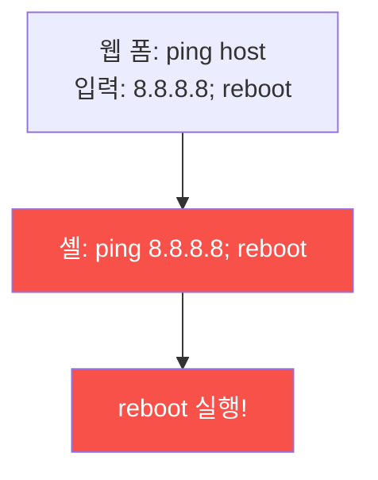

# iot-security W05 — IoT 웹 인터페이스 공격: 명령 주입·인증 우회·CSRF

> **본 주차의 한 줄 요약**
>
> 대부분의 IoT 장치는 **웹 관리 인터페이스**(설정 페이지)를 제공한다. 이 웹 UI는 종종 **가장 약한 공격 표면**
> 이다 — 제약된 장치에서 급하게 만든 웹 서버라 웹 보안 기본이 빠진 경우가 많다. 대표 취약점: ① **명령 주입
> (command injection)** — 웹 폼 입력(핑 테스트·호스트명)을 **셸 명령에 그대로** 넣어, `; reboot`·`; cat /etc/
> passwd` 같은 명령을 실행(IoT의 흔한 치명적 취약점), ② **인증 우회** — 기본 자격(admin/admin)·약한 세션·인증
> 없는 API 엔드포인트, ③ **CSRF** — 로그인된 관리자를 속여 악의적 설정 변경 요청 실행, ④ **접근 통제 부재** —
> URL만 알면 인증 없이 접근. 이 취약점들로 공격자는 장치를 **완전 장악**(설정 변경·펌웨어 교체·봇넷 편입)한다.
> 방어는 **웹 보안 기본**: 입력 검증·이스케이프(명령 주입 차단), 강한 인증·세션(기본 자격 강제 변경), CSRF
> 토큰, 접근 통제. IoT라고 웹 보안을 건너뛰면 안 된다. el34의 웹 서비스로 명령 주입·인증 취약점을 실측할 수 있다.
>
> **한 줄 결론**: IoT 웹 인터페이스는 명령 주입·인증 우회·CSRF에 취약해 장치 완전 장악을 부른다. 방어 = **입력
> 검증(명령 주입 차단) + 강한 인증·세션 + CSRF 토큰 + 접근 통제**. IoT도 웹 보안 기본을 지킨다.

---

## 학습 목표

본 주차 종료 시 학생은 다음 5가지를 **본인 손으로** 할 수 있어야 한다.

1. IoT 웹 인터페이스가 왜 취약한지 설명한다.
2. **명령 주입**을 탐지한다(CMD_INJECTION).
3. **인증 우회**(기본 자격·약한 세션)를 평가한다(AUTH_BYPASS).
4. **입력 검증·인증·CSRF**로 강화한다(WEB_HARDENED).
5. IoT에서도 웹 보안 기본이 필요한 이유를 설명한다.

> **이 주차의 시선** — 급조된 IoT 웹 UI의 웹 취약점을, 웹 보안 기본으로 막는다.

---

## 0. 용어 해설 (IoT 웹)

| 용어 | 영문 | 뜻 | 비유 |
|------|------|----|------|
| **명령 주입** | Command Injection | 입력→셸 명령 실행 | 주문서에 명령 끼우기 |
| **인증 우회** | Auth Bypass | 인증 건너뛰기 | 검문 우회 |
| **CSRF** | Cross-Site Request Forgery | 위조 요청 | 속여서 결재 |
| **접근 통제** | Access Control | 권한 검사 | 출입 확인 |
| **입력 검증** | Input Validation | 입력 정제 | 검문 |

> **헷갈리기 쉬운 한 쌍** — *명령 주입* 은 "입력이 셸 명령이 됨"(코드 실행), *인증 우회* 는 "로그인 건너뜀"(접근)
> 이다. 둘 다 IoT 웹에 흔하다.

---

## 0.5 신입생 친화 핵심 개념

### 0.5.1 명령 주입 — IoT의 흔한 치명타

IoT 웹은 "핑 테스트"·"호스트명 설정" 같은 기능에서 입력을 **셸 명령에 그대로** 넣는다. `; reboot`·`| nc`를
끼우면 임의 명령이 실행된다. 제약된 장치에서 급조돼 검증이 빠진 결과.

### 0.5.2 인증 우회

- **기본 자격**: admin/admin 미변경(W01) → 그냥 로그인.
- **약한 세션**: 예측 가능한 세션 토큰·만료 없음 → 세션 탈취.
- **인증 없는 API**: `/api/config`가 인증 없이 접근 → 설정 변경.
- **접근 통제 부재**: URL만 알면 관리 페이지 접근(강제 브라우징).

### 0.5.3 CSRF — 관리자를 속인다

로그인된 관리자가 악성 페이지를 열면, 그 페이지가 **관리자 권한으로** IoT에 요청을 보낸다(비밀번호 변경·설정
변경). CSRF 토큰이 없으면 요청이 정당한지 구분 못 한다. IoT 웹은 CSRF 방어가 빠진 경우가 많다.

### 0.5.4 방어 — 웹 보안 기본

- **입력 검증·이스케이프**: 셸에 넘기지 말고 안전한 API 사용, 또는 엄격한 화이트리스트 검증(명령 주입 차단).
- **강한 인증·세션**: 기본 자격 강제 변경, 안전한 세션 토큰·만료, API 인증.
- **CSRF 토큰**: 상태 변경 요청에 토큰 검증.
- **접근 통제**: 모든 엔드포인트에 권한 검사.
IoT라고 웹 보안을 건너뛰면 장치가 완전 장악된다. ai-security/web 보안의 기본이 그대로 적용된다.

### 0.5.5 el34 맥락

el34의 웹 서비스로 **명령 주입·인증 취약점을 실측**할 수 있다(bastion apache 관찰, 웹 요청 분석). 이번 주는
명령 주입 탐지·인증 우회 평가·방어를 익힌다. IoT 특유의 급조된 웹 UI 취약성에 초점.

---

## 1. 실습 안내 (5 미션)

실행 위치 el34 **호스트**(`ssh ccc@{{TARGET_IP}}`), GPU `http://211.170.162.139:10934`.

### STEP 1 — GPU 헬스체크 → GEN_OK
### STEP 2 — 명령 주입 탐지 → CMD_INJECTION
### STEP 3 — 인증 우회 평가 → AUTH_BYPASS
### STEP 4 — 웹 강화 → WEB_HARDENED
### STEP 5 — 종합 → Assessment

---

## 2. 흔한 오해·관제자 노트

- **"IoT 웹은 단순해서 안전"** — 급조돼 웹 보안이 빠진 경우 많다. 명령 주입 흔함.
- **"내부 장치니 인증 약해도"** — 봇넷·측면이동 표적. 강한 인증 필수.
- **"CSRF는 큰 사이트 얘기"** — IoT 웹도 CSRF 취약. 토큰 필요.
- **관제 관점** — IoT 웹에 명령 주입·인증 우회·CSRF 방어가 있는지, 기본 자격이 변경 강제되는지 점검한다.
  IoT 웹은 웹 보안 기본을 그대로 요구한다.

---

## 3. 다음 주차 (W06) 예고 — 무선 프로토콜 해킹

W05가 "웹 인터페이스"였다면, W06은 IoT **무선 프로토콜**(Zigbee·Z-Wave·독점 RF) 해킹 — 스마트홈 무선 통신의
취약점과 방어를 다룬다. (무선 하드웨어 필요 → 프로토콜 보안 시뮬.)
