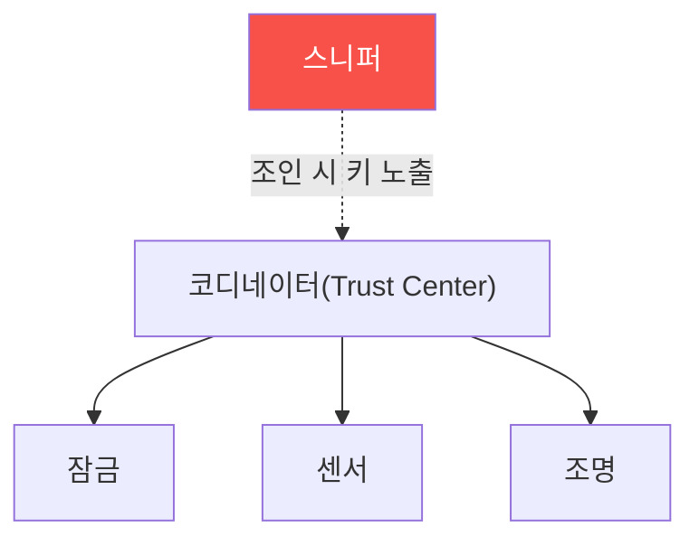

# iot-security W06 — 무선 프로토콜 해킹: Zigbee·Z-Wave·독점 RF

> **본 주차의 한 줄 요약**
>
> 스마트홈 IoT는 WiFi 외에 **저전력 무선 프로토콜**을 쓴다 — **Zigbee**·**Z-Wave**(메시 네트워크)·독점 RF.
> 이들은 배터리 절약을 위해 경량화됐고, 보안 구현이 제각각이라 **취약한 경우가 많다**: ① **약한/기본 키** —
> Zigbee의 일부 프로파일은 **잘 알려진 기본 링크 키(default Trust Center link key)** 를 쓰거나, 장치 조인(join)
> 시 키를 **평문에 가깝게** 교환해 스니핑으로 탈취, ② **암호화 부재/약함** — 일부 독점 RF는 암호화가 없어 명령을
> 그대로 감청·재전송(W09 RF 리플레이와 연결), ③ **조인 과정 공격** — 새 장치가 네트워크에 합류하는 순간 키가
> 노출되거나, 강제 재조인으로 키 교환을 유도. 공격자는 무선 스니퍼로 트래픽을 잡아 **키를 추출**하고 스마트홈
> 장치(잠금·센서·조명)를 **제어·감청**한다. 방어: **강한 암호화(AES-128)와 고유 키**, **기본 키 미사용**,
> **안전한 조인**(설치 시 물리 근접·아웃오브밴드 키), **키 순환**. 무선 메시는 편리하지만, 암호화·키 관리가
> 약하면 스마트홈 전체가 감청·제어당한다. 무선 프로토콜은 실물 라디오 하드웨어가 필요해 시뮬레이션한다.
>
> **한 줄 결론**: Zigbee·Z-Wave 등 스마트홈 무선은 약한/기본 키·암호화 부재로 스니핑·키 추출에 취약하다.
> 방어 = **강한 암호화(AES)+고유 키+안전한 조인+키 순환**.

---

## 학습 목표

본 주차 종료 시 학생은 다음 5가지를 **본인 손으로** 할 수 있어야 한다.

1. 스마트홈 **무선 프로토콜**(Zigbee·Z-Wave)의 특성을 설명한다.
2. **암호화·키 취약성**을 평가한다(CRYPTO_WEAK).
3. **키 추출/재전송** 가능성을 판정한다(KEY_EXTRACTABLE).
4. **강한 암호화·안전한 조인**으로 강화한다(WIRELESS_SECURED).
5. 무선 메시의 키 관리가 왜 중요한지 설명한다.

> **이 주차의 시선** — 경량 무선의 약한 키·암호화를 평가하고, 강한 암호·안전한 조인으로 막는다.

---

## 0. 용어 해설 (무선 프로토콜)

| 용어 | 영문 | 뜻 | 비유 |
|------|------|----|------|
| **Zigbee** | — | 저전력 메시 | 릴레이 네트워크 |
| **링크 키** | Link Key | 장치 간 암호 키 | 통신 열쇠 |
| **조인** | Join | 네트워크 합류 | 입회 |
| **스니핑** | Sniffing | 무선 감청 | 도청 |
| **아웃오브밴드** | Out-of-band | 별도 채널 키 교환 | 대면 전달 |

> **헷갈리기 쉬운 한 쌍** — *기본 키* 는 "제조사 공통(알려짐)", *고유 키* 는 "장치·설치별 다름(안전)"이다. 기본
> 키는 스니핑으로 즉시 해독.

---

## 0.5 신입생 친화 핵심 개념

### 0.5.1 무선 메시와 키

Zigbee 메시는 코디네이터가 키를 관리하고 장치들이 릴레이한다. **조인 시 키가 노출**되거나 **기본 키**를 쓰면,
스니퍼가 키를 얻어 전체를 감청·제어한다.

### 0.5.2 약한/기본 키 — 스니핑으로 해독

Zigbee의 일부 구현은 **잘 알려진 기본 링크 키**로 조인 키를 암호화한다. 공격자가 이 기본 키를 알면(공개돼 있음)
조인 트래픽을 스니핑해 **네트워크 키를 복호**한다. 그러면 모든 장치 트래픽을 읽고 명령을 위조한다. 기본 키는
사실상 무암호.

### 0.5.3 조인 공격·재전송

- **강제 재조인**: 장치를 네트워크에서 튕겨내 **재조인**을 유도, 그 순간 키 교환을 스니핑.
- **재전송**: 암호화 없는 독점 RF는 명령(잠금 해제)을 캡처-재전송(W09 리플레이).
- **키 추출**: 조인 트래픽·펌웨어(W04)에서 네트워크 키 추출.

### 0.5.4 방어 — 강한 암호와 안전한 조인

- **강한 암호화·고유 키**: AES-128 + 설치별 고유 네트워크 키(기본 키 미사용).
- **안전한 조인**: 설치 시 **물리 근접**(install code)·아웃오브밴드로 키 전달 → 스니핑 방지.
- **키 순환**: 주기적 네트워크 키 갱신.
- **재전송 방지**: 프레임 카운터·암호화(W09 롤링 코드·챌린지-리스폰스).
키 관리가 무선 IoT 보안의 핵심 — 키가 새면 전부 샌다.

### 0.5.5 el34 맥락

Zigbee·Z-Wave는 실물 라디오 하드웨어(스니퍼·동글)가 필요하다. 본 실습은 **암호화·키 취약성 평가·키 추출 가능성·
방어 설계**를 결정론 시뮬로 익힌다. 물리 무선 공격은 실물 하드웨어가 필요함을 명시한다.

---

## 1. 실습 안내 (5 미션)

실행 위치 el34 **호스트**(`ssh ccc@{{TARGET_IP}}`), GPU `http://211.170.162.139:10934`.
⚠️ 물리 무선은 라디오 하드웨어 필요 → 본 실습은 암호화·키·방어 로직 결정론 시뮬.

### STEP 1 — GPU 헬스체크 → GEN_OK
### STEP 2 — 암호화·키 취약성 → CRYPTO_WEAK
### STEP 3 — 키 추출/재전송 → KEY_EXTRACTABLE
### STEP 4 — 무선 강화 → WIRELESS_SECURED
### STEP 5 — 종합 → Assessment

---

## 2. 흔한 오해·관제자 노트

- **"무선이라 못 잡는다"** — 스니퍼로 잡힌다. 암호화·고유 키 필수.
- **"기본 키면 편함"** — 공개된 기본 키는 무암호. 고유 키·안전한 조인.
- **"메시는 안전"** — 한 노드·키가 새면 전체. 키 관리가 관건.
- **관제 관점** — 스마트홈 무선이 강한 암호화·고유 키·안전한 조인·키 순환을 쓰는지 점검한다. 무선 IoT 보안은
  키 관리가 핵심.

---

## 3. 다음 주차 (W07) 예고 — BLE 해킹

W06이 "메시 무선"이었다면, W07은 **BLE(Bluetooth Low Energy)** — 웨어러블·비콘·스마트 잠금의 BLE 보안(약한
페어링·스니핑·MITM)과 방어를 다룬다. (BLE 하드웨어 필요 → 시뮬.)
