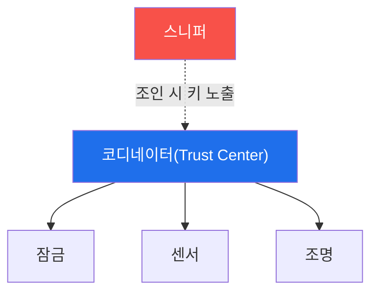

# iot-security W06 — 무선 프로토콜 해킹: Zigbee·Z-Wave·독점 RF

> **본 주차의 한 줄 요약**
>
> 스마트홈 IoT는 WiFi 외에 **저전력 무선 프로토콜**을 쓴다 — **Zigbee**·**Z-Wave**(메시 네트워크)·독점 RF. 이들은
> 배터리 절약을 위해 경량화됐고, 보안 구현이 제각각이라 취약한 경우가 많다: ① **약한/기본 키** — Zigbee의 일부
> 프로파일은 잘 알려진 기본 링크 키(default Trust Center link key)를 쓰거나 장치 조인(join) 시 키를 평문에 가깝게
> 교환해 스니핑으로 탈취, ② **암호화 부재/약함** — 일부 독점 RF는 암호화가 없어 명령을 그대로 감청·재전송(W09 RF
> 리플레이와 연결), ③ **조인 과정 공격** — 새 장치가 네트워크에 합류하는 순간 키가 노출되거나 강제 재조인으로 키
> 교환을 유도. 공격자는 무선 스니퍼로 트래픽을 잡아 **키를 추출**하고 스마트홈 장치(잠금·센서·조명)를 제어·감청한다.
> 실습에서는 암호화·키 취약성을 평가하고(마커 `CRYPTO_WEAK`), 키 추출/재전송 가능성을 판정하며(마커
> `KEY_EXTRACTABLE`), 강한 암호화·안전한 조인으로 강화한다(마커 `WIRELESS_SECURED`). 방어는 **강한 암호화(AES-128)와
> 고유 키·기본 키 미사용·안전한 조인(물리 근접/아웃오브밴드)·키 순환**이다. 무선 메시는 편리하지만 암호화·키 관리가
> 약하면 스마트홈 전체가 감청·제어당한다.

---

## 학습 목표

본 주차 종료 시 학생은 다음 5가지를 **본인 손으로** 할 수 있어야 한다.

1. 스마트홈 무선 프로토콜(Zigbee·Z-Wave)의 특성과 메시 구조를 설명한다.
2. **암호화·키 취약성**을 평가한다(마커 `CRYPTO_WEAK`).
3. **키 추출/재전송** 가능성을 판정한다(마커 `KEY_EXTRACTABLE`).
4. **강한 암호화·안전한 조인**으로 강화한다(마커 `WIRELESS_SECURED`).
5. 무선 메시의 키 관리가 왜 중요한지 종합한다(마커 `Assessment`).

> **이 주차의 시선** — 경량 무선의 약한 키·암호화를 평가하고 강한 암호·안전한 조인으로 막는다. "키가 새면 전부
> 샌다"가 핵심이다.

---

## 0. 용어 해설 (무선 프로토콜)

| 용어 | 영문 | 뜻 | 비유 |
|------|------|----|------|
| **Zigbee/Z-Wave** | — | 저전력 메시 IoT 무선 | 릴레이 네트워크 |
| **Trust Center** | — | Zigbee 키를 관리하는 코디네이터 | 열쇠 관리자 |
| **링크 키** | Link Key | 장치 간 암호 키 | 통신 열쇠 |
| **기본 키** | Default Key | 제조사 공통 알려진 키 | 마스터키 유출 |
| **조인** | Join | 장치가 네트워크에 합류 | 입회 |
| **스니핑** | Sniffing | 무선 트래픽 감청 | 도청 |
| **아웃오브밴드** | Out-of-band | 별도 채널로 키 교환(install code) | 대면 전달 |

> **헷갈리기 쉬운 한 쌍 — 기본 키 vs 고유 키.** *기본 키*는 제조사 공통이라 공개돼 사실상 무암호다. *고유 키*는
> 장치·설치별로 달라 스니핑해도 전체를 못 연다. 기본 키를 없애고 고유 키·안전한 조인으로 가는 것이 핵심이다.

---

## 0.5 신입생 친화 핵심 개념

### 0.5.1 무선 메시와 키

Zigbee 메시는 코디네이터가 키를 관리하고 장치들이 릴레이한다. **조인 시 키가 노출**되거나 **기본 키**를 쓰면, 스니퍼가
키를 얻어 전체를 감청·제어한다.

### 0.5.2 약한/기본 키 — 스니핑으로 해독

Zigbee의 일부 구현은 잘 알려진 기본 링크 키로 조인 키를 암호화한다. 공격자가 이 기본 키를 알면(공개돼 있음) 조인
트래픽을 스니핑해 네트워크 키를 복호한다. 그러면 모든 장치 트래픽을 읽고 명령을 위조한다. 기본 키는 사실상 무암호다.

### 0.5.3 조인 공격·재전송

- **강제 재조인**: 장치를 네트워크에서 튕겨내 재조인을 유도, 그 순간 키 교환을 스니핑.
- **재전송**: 암호화 없는 독점 RF는 명령(잠금 해제)을 캡처-재전송(W09 리플레이).
- **키 추출**: 조인 트래픽·펌웨어(W04)에서 네트워크 키 추출.

### 0.5.4 방어 — 강한 암호와 안전한 조인

- **강한 암호화·고유 키**: AES-128 + 설치별 고유 네트워크 키(기본 키 미사용).
- **안전한 조인**: 설치 시 물리 근접(install code)·아웃오브밴드로 키 전달 → 스니핑 방지.
- **키 순환**: 주기적 네트워크 키 갱신.
- **재전송 방지**: 프레임 카운터·암호화(W09 롤링 코드·챌린지-리스폰스).

키 관리가 무선 IoT 보안의 핵심 — 키가 새면 전부 샌다.

### 0.5.5 el34 맥락

Zigbee·Z-Wave는 실물 라디오 하드웨어(스니퍼·동글)가 필요하다. 이번 실습은 **암호화·키 취약성 평가·키 추출 가능성·
방어 설계**를 el34에서 실제 아티팩트(설정·캡처·로그)를 만들어 strings·grep·awk 로 분석한다(물리 무선 공격은 실물 하드웨어는 라이브 공격에만 필요, 여기선 캡처 아티팩트 분석).

---

## 1. 무선 프로토콜 상세 — 취약성·키 추출·강화

### 1.1 암호화·키 취약성 (CRYPTO_WEAK)

- **한 줄 정의**: 기본 키·약한 암호화·평문 조인 여부를 평가한다.
- **왜 중요한가**: 키가 약하면 스니핑 한 번에 전체가 노출된다.
- **el34 맥락에서 어떻게**: 기본 링크 키·무암호 RF·평문 조인을 점검하면 `CRYPTO_WEAK`.
- **한계/주의**: 실물 스니퍼가 필요하나 여기서는 평가 로직을 익힌다.

### 1.2 키 추출/재전송 (KEY_EXTRACTABLE)

- **한 줄 정의**: 조인 스니핑·재전송으로 키/명령을 얻을 수 있는지 판정한다.
- **핵심**: 기본 키로 조인 키 복호, 무암호 명령 재전송.
- **판정**: 키 추출·재전송이 가능하면 `KEY_EXTRACTABLE`.

### 1.3 무선 강화 (WIRELESS_SECURED)

- **한 줄 정의**: 강한 암호화·고유 키·안전한 조인·키 순환을 적용한다.
- **핵심**: AES-128 + install code + 키 순환 + 재전송 방지.
- **판정**: 강화가 적용되면 `WIRELESS_SECURED`.

---

## 2. 실습 안내 (총 5 미션)

실행 위치는 el34 **호스트**(`ssh ccc@{{TARGET_IP}}`, 비밀번호 `1`), 참고 GPU는 Ollama
(`http://211.170.162.139:10934`, gemma3:4b)다. ⚠️ 물리 무선은 라디오 하드웨어가 필요해 암호화·키·방어 로직을 결정론
실제 아티팩트 분석으로 익힌다. 각 미션의 마지막 줄 마커가 채점 기준이다.

### 미션 1 — GPU 헬스체크 → `GEN_OK`

> **왜 하는가?** 분석·종합에 쓸 LLM 도달·응답 확인.
> **무엇을 아는가?** Ollama 응답 형식·도달성.
> **결과 해석** — 정상 `GEN_OK` / 비정상 `GEN_EMPTY`·연결 오류.
> **실전 활용** — 종합 소견 작성에 사용.

### 미션 2 — 암호화·키 취약성 → `CRYPTO_WEAK`

> **왜 하는가?** 스니핑 위험의 근원인 키 상태를 평가한다.
> **무엇을 아는가?** 기본 키·무암호·평문 조인.
> **결과 해석** — 정상: 취약 판정 + `CRYPTO_WEAK`.
> **실전 활용** — 스마트홈 무선 진단.

### 미션 3 — 키 추출/재전송 → `KEY_EXTRACTABLE`

> **왜 하는가?** 키 유출이 전체 제어로 이어짐을 확인한다.
> **무엇을 아는가?** 조인 스니핑·명령 재전송.
> **결과 해석** — 정상: 추출 가능 + `KEY_EXTRACTABLE`.
> **실전 활용** — 무선 키 유출 위험 평가.

### 미션 4 — 무선 강화 → `WIRELESS_SECURED`

> **왜 하는가?** 강한 암호·안전한 조인으로 막는다.
> **무엇을 아는가?** AES·고유 키·install code·키 순환.
> **결과 해석** — 정상: 강화 + `WIRELESS_SECURED`.
> **실전 활용** — 스마트홈 무선 보안 설계.

### 미션 5 — 종합 소견 → `Assessment`

> **왜 하는가?** 취약성·키 추출·강화와 "키 관리가 핵심"을 소견으로 묶는다.
> **무엇을 아는가?** GPU에 요약시키되 첫 줄을 `Assessment`로 강제.
> **결과 해석** — 정상: `Assessment` 포함. 없으면 `[형식 미준수 — 재실행]`.
> **실전 활용** — 무선 IoT 보안 개요.

---

## 2.5 과제 (제출물)

- **A. 암호화·키 취약성 실증 (필수, 40점)** — `CRYPTO_WEAK` 단계를 직접 수행해 실제 명령·출력(또는 아티팩트 분석 결과)을 캡처하고, 무엇을 근거로 판정했는지 서술한다.
- **B. 키 추출/재전송 분석 (필수, 30점)** — `KEY_EXTRACTABLE` 단계를 직접 수행해 실제 명령·출력(또는 아티팩트 분석 결과)을 캡처하고, 무엇을 근거로 판정했는지 서술한다.
- **C. 무선 강화 방어 설계 (필수, 30점)** — `WIRELESS_SECURED` 단계를 직접 수행해 실제 명령·출력(또는 아티팩트 분석 결과)을 캡처하고, 무엇을 근거로 판정했는지 서술한다.

## 2.6 평가 기준

| 항목 | 미흡(0) | 보통 | 우수 |
|------|---------|------|------|
| 탐지/실증(CRYPTO_WEAK) | 미수행 | 마커 도출 | 근거·해석·재현까지 |
| 분석(KEY_EXTRACTABLE) | 미수행 | 마커 도출 | 근거·해석·재현까지 |
| 방어(WIRELESS_SECURED) | 미수행 | 마커 도출 | 근거·해석·재현까지 |

## 2.7 핵심 정리 (1줄씩)

- 이번 주 주제: **무선 프로토콜 해킹: Zigbee·Z-Wave·독점 RF**.
- **암호화·키 취약성**(`CRYPTO_WEAK`): 기본 키·약한 암호화·평문 조인 여부를 평가한다.
- **키 추출/재전송**(`KEY_EXTRACTABLE`): 조인 스니핑·재전송으로 키/명령을 얻을 수 있는지 판정한다.
- **무선 강화**(`WIRELESS_SECURED`): 강한 암호화·고유 키·안전한 조인·키 순환을 적용한다.
- 공격을 이해한 만큼 **방어의 우선순위**가 분명해진다 — 탐지 근거와 완화를 함께 익힌다.

---

## 3. 흔한 오해·관제자 노트

- **"무선이라 못 잡는다."** — 스니퍼로 잡힌다. 암호화·고유 키가 필수.
- **"기본 키가 편하다."** — 공개된 기본 키는 무암호다. 고유 키·안전한 조인이 필요.
- **"메시는 안전하다."** — 한 노드·키가 새면 전체가 샌다. 키 관리가 관건.
- **"독점 RF는 아무도 모른다."** — 캡처-재전송으로 명령이 재현된다. 롤링 코드·암호화가 필요.
- **관제(Blue) 관점** — 스마트홈 무선이 (1) 강한 암호화·고유 키, (2) 안전한 조인(install code), (3) 키 순환, (4)
  재전송 방지를 쓰는지 점검한다. 무선 IoT 보안은 키 관리가 핵심이다.

---

## 4. 다음 주차 (W07) 예고 — BLE 해킹

W06이 "메시 무선"이었다면, W07은 **BLE(Bluetooth Low Energy)**를 다룬다. 웨어러블·비콘·스마트 잠금의 BLE 보안(약한
페어링·스니핑·MITM)과 방어를 익힌다(BLE 하드웨어는 라이브 공격에만 필요 → 캡처 아티팩트 분석).
