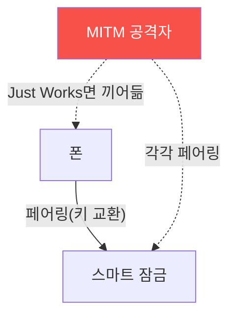

# iot-security W07 — BLE 해킹: 약한 페어링·스니핑·MITM

> **본 주차의 한 줄 요약**
>
> **BLE(Bluetooth Low Energy)**는 웨어러블·비콘·스마트 잠금·의료 기기 등에 널리 쓰인다. BLE 보안의 핵심은
> **페어링(pairing)** — 두 장치가 암호 키를 교환하는 과정이다. 문제는 많은 IoT가 **약한 페어링 방식**을 쓴다는
> 것이다: ① **Just Works** — 사용자 확인 없이 페어링(MITM 방어 없음), 편의 위해 널리 쓰이지만 중간자 공격에 무방비,
> ② **Legacy Pairing**(BLE 4.0/4.1) — 암호화 키 교환이 약해 스니퍼로 키 추출 가능, ③ **정적 패스키/약한 인증**.
> 공격자는 BLE 스니퍼로 페어링을 캡처해 키를 추출하거나, MITM으로 두 장치 사이에 끼어 통신을 감청·변조한다(스마트
> 잠금 열기, 의료 기기 데이터 조작). 실습에서는 약한 페어링을 평가하고(마커 `PAIRING_WEAK`), 스니핑·MITM 가능성을
> 판정하며(마커 `BLE_INTERCEPTABLE`), LE Secure Connections·앱 암호화로 강화한다(마커 `BLE_SECURED`). 방어는 **LE
> Secure Connections(BLE 4.2+, ECDH 키 교환으로 스니핑 방어)·MITM 보호 페어링(Numeric Comparison·Passkey Entry)·
> 앱 계층 암호화·연결 최소화**다. BLE는 편리하지만 약한 페어링은 스마트 잠금 같은 중요 장치를 노출시킨다.

---

## 학습 목표

본 주차 종료 시 학생은 다음 5가지를 **본인 손으로** 할 수 있어야 한다.

1. BLE 페어링 방식과 보안 차이를 설명한다.
2. **약한 페어링**(Just Works·Legacy)을 평가한다(마커 `PAIRING_WEAK`).
3. **스니핑·MITM** 가능성을 판정한다(마커 `BLE_INTERCEPTABLE`).
4. **LE Secure Connections·앱 암호화**로 강화한다(마커 `BLE_SECURED`).
5. Just Works가 왜 MITM에 취약한지 종합한다(마커 `Assessment`).

> **이 주차의 시선** — 편의를 위한 약한 BLE 페어링을 평가하고, 강한 페어링으로 막는다. "확인 유무가 MITM 방어를
> 결정한다"가 핵심이다.

---

## 0. 용어 해설 (BLE)

| 용어 | 영문 | 뜻 | 비유 |
|------|------|----|------|
| **BLE** | Bluetooth Low Energy | 저전력 근거리 무선 | 근거리 무선 |
| **페어링** | Pairing | 두 장치가 암호 키를 교환하는 과정 | 상호 등록 |
| **Just Works** | — | 사용자 확인 없는 자동 페어링(MITM 취약) | 무검증 악수 |
| **LE Secure Connections** | — | ECDH 기반 강한 페어링(BLE 4.2+) | 강한 악수 |
| **Numeric Comparison** | — | 양쪽 숫자를 비교해 MITM 차단 | 대조 확인 |
| **MITM** | Man-in-the-Middle | 두 장치 사이에 끼어 감청·변조 | 가로채기 |
| **본딩** | Bonding | 페어링 키를 저장해 재연결 | 관계 등록 |

> **헷갈리기 쉬운 한 쌍 — Just Works vs Numeric Comparison.** *Just Works*는 사용자 확인이 없어 MITM에 취약하다.
> *Numeric Comparison*은 양쪽이 같은 숫자를 확인해 중간자를 차단한다. 확인 절차의 유무가 MITM 방어를 가른다.

---

## 0.5 신입생 친화 핵심 개념

### 0.5.1 페어링이 BLE 보안의 핵심

두 장치가 안전하게 키를 교환해야 이후 통신이 암호화된다. **페어링이 약하면** 그 키가 노출되거나 MITM이 끼어들어
전체가 무력화된다.

### 0.5.2 Just Works — MITM에 무방비

**Just Works**는 사용자 확인 없이 자동 페어링한다(편리함). 하지만 양쪽이 서로를 인증하지 않아, 공격자가 두 장치 사이에
끼어(MITM) 각각과 페어링하면 통신을 감청·변조한다. 스마트 잠금이 Just Works면 열릴 수 있다.

### 0.5.3 스니핑·키 추출

- **Legacy Pairing(BLE 4.0/4.1)**: 키 교환(TK 기반)이 약해 스니퍼로 키를 크래킹(crackle 같은 도구).
- **MITM**: Just Works·약한 페어링에서 중간자로 세션 장악.
- **재전송·재연결**: 캡처한 명령 재전송, 강제 재페어링 유도.

### 0.5.4 방어 — LE Secure Connections

- **LE Secure Connections(BLE 4.2+)**: ECDH 키 교환으로 스니퍼가 키를 못 얻음(수동 스니핑 방어).
- **MITM 보호 페어링**: Numeric Comparison(양쪽 숫자 비교)·Passkey Entry로 중간자 차단.
- **앱 계층 암호화**: BLE 위에 추가 암호(BLE가 뚫려도 방어).
- **연결 최소화**: 필요할 때만 광고·페어링, 본딩 관리.

중요 장치(잠금·의료)는 반드시 강한 페어링을 쓴다.

### 0.5.5 el34 맥락

BLE는 실물 라디오(스니퍼·동글)가 필요하다. 이번 실습은 **페어링 방식 평가·스니핑/MITM 가능성·방어 설계**를 결정론
실제 아티팩트 분석으로 익힌다(물리 BLE 공격은 실물 하드웨어는 라이브 공격에만 필요, 여기선 캡처 아티팩트 분석).

---

## 1. BLE 상세 — 페어링·감청·강화

### 1.1 페어링 취약성 (PAIRING_WEAK)

- **한 줄 정의**: Just Works·Legacy 등 약한 페어링 사용 여부를 평가한다.
- **왜 중요한가**: 페어링이 약하면 이후 모든 암호화가 무의미하다.
- **el34 맥락에서 어떻게**: 페어링 방식·MITM 보호 유무를 점검하면 `PAIRING_WEAK`.
- **한계/주의**: 편의를 위해 중요 장치도 Just Works를 쓰는 경우가 많다.

### 1.2 스니핑/MITM (BLE_INTERCEPTABLE)

- **한 줄 정의**: 스니핑 키 추출·MITM 세션 장악이 가능한지 판정한다.
- **핵심**: Legacy 키 크래킹·Just Works MITM·명령 재전송.
- **판정**: 감청/MITM이 가능하면 `BLE_INTERCEPTABLE`.

### 1.3 BLE 강화 (BLE_SECURED)

- **한 줄 정의**: LE Secure Connections·MITM 보호·앱 암호화를 적용한다.
- **핵심**: ECDH 페어링 + Numeric Comparison + 앱 계층 암호 + 연결 최소화.
- **판정**: 강화가 적용되면 `BLE_SECURED`.

---

## 2. 실습 안내 (총 5 미션)

실행 위치는 el34 **호스트**(`ssh ccc@{{TARGET_IP}}`, 비밀번호 `1`), 참고 GPU는 Ollama
(`http://211.170.162.139:10934`, gemma3:4b)다. ⚠️ 물리 BLE는 라디오 하드웨어가 필요해 페어링·스니핑·방어 로직을
el34에서 실제 아티팩트(설정·캡처·로그)를 만들어 strings·grep·awk 로 분석한다. 각 미션의 마지막 줄 마커가 채점 기준이다.

### 미션 1 — GPU 헬스체크 → `GEN_OK`

> **왜 하는가?** 분석·종합에 쓸 LLM 도달·응답 확인.
> **무엇을 아는가?** Ollama 응답 형식·도달성.
> **결과 해석** — 정상 `GEN_OK` / 비정상 `GEN_EMPTY`·연결 오류.
> **실전 활용** — 종합 소견 작성에 사용.

### 미션 2 — 페어링 취약성 → `PAIRING_WEAK`

> **왜 하는가?** BLE 보안의 뿌리인 페어링을 평가한다.
> **무엇을 아는가?** Just Works·Legacy·MITM 보호 유무.
> **결과 해석** — 정상: 취약 판정 + `PAIRING_WEAK`.
> **실전 활용** — BLE 장치 보안 진단.

### 미션 3 — 스니핑/MITM → `BLE_INTERCEPTABLE`

> **왜 하는가?** 약한 페어링이 통신 장악으로 이어짐을 확인한다.
> **무엇을 아는가?** 키 크래킹·MITM·재전송.
> **결과 해석** — 정상: 가능 판정 + `BLE_INTERCEPTABLE`.
> **실전 활용** — BLE 감청 위험 평가.

### 미션 4 — BLE 강화 → `BLE_SECURED`

> **왜 하는가?** 강한 페어링·앱 암호로 막는다.
> **무엇을 아는가?** LE Secure·Numeric Comparison·앱 암호.
> **결과 해석** — 정상: 강화 + `BLE_SECURED`.
> **실전 활용** — BLE 보안 설계.

### 미션 5 — 종합 소견 → `Assessment`

> **왜 하는가?** 페어링·감청·강화와 "페어링이 핵심"을 소견으로 묶는다.
> **무엇을 아는가?** GPU에 요약시키되 첫 줄을 `Assessment`로 강제.
> **결과 해석** — 정상: `Assessment` 포함. 없으면 `[형식 미준수 — 재실행]`.
> **실전 활용** — BLE 보안 개요.

---

## 3. 흔한 오해·관제자 노트

- **"BLE는 근거리라 안전하다."** — 스니퍼는 수십 미터에 이른다. 약한 페어링은 뚫린다.
- **"Just Works가 편하다."** — MITM에 무방비다. 중요 장치는 MITM 보호 페어링을 쓴다.
- **"BLE 암호면 충분하다."** — Legacy는 스니핑에 약하다. LE Secure Connections가 필요.
- **"페어링은 한 번뿐이다."** — 강제 재페어링으로 다시 노출될 수 있다. 본딩 관리가 필요.
- **관제(Blue) 관점** — 중요 BLE 장치(잠금·의료)가 (1) LE Secure Connections, (2) MITM 보호 페어링, (3) 앱 계층
  암호, (4) 연결 최소화를 쓰는지 점검한다. BLE 보안은 페어링 방식이 핵심이다.

---

## 4. 다음 주차 (W08) 예고 — 중간 평가: IoT 디바이스 침투 테스트

W01~W07로 IoT의 각 표면(프로토콜·하드웨어·펌웨어·웹·무선·BLE)을 배웠다. W08은 이를 종합한 **IoT 디바이스 침투
테스트**로, 한 장치를 4대 표면에서 평가하고 방어를 제안하는 중간 평가다.
