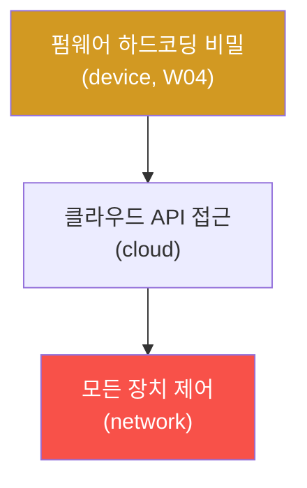

# iot-security W08 — 중간 평가: IoT 디바이스 침투 테스트 (4대 표면 종합)

> **본 주차의 한 줄 요약**
>
> W01~W07로 IoT의 각 공격 표면(프로토콜·하드웨어·펌웨어·웹·무선·BLE)을 배웠다. 이번 주 W08은 이를 **하나의 디바이스
> 평가**로 종합하는 중간 평가다. 실제 IoT 침투 테스트는 한 표면이 아니라 **4대 표면(device·network·cloud·app)을 모두**
> 점검하고, 발견한 취약점을 **연결해 공격 경로(attack path)**를 구성한다. 예: 펌웨어에서 하드코딩 비밀 발견(device) →
> 그 비밀로 클라우드 API 접근(cloud) → 모든 장치 제어(network). 개별 취약점보다 **연결된 경로**가 실제 위협을
> 보여준다. 그리고 각 표면·경로에 방어를 권고한다. 실습에서는 4대 표면을 한 장치에 종합 점검하고(마커
> `MULTISURFACE_ASSESSED`), 취약점을 연결해 공격 경로를 구성하며(마커 `ATTACK_PATH`), 우선순위 방어를 권고한다(마커
> `DEFENSE_RECS`). 이 평가의 핵심은 부분 기법을 **한 장치의 전체 평가**로 종합하는 능력 — 4대 표면을 체계적으로
> 점검하고, 가장 위험한 공격 경로를 찾고, 우선순위 방어를 제안한다. IoT 평가 방법론(OWASP IoT Top 10 등)을 실전
> 디바이스에 적용하는 연습이다.

---

## 학습 목표

본 주차 종료 시 학생은 다음 5가지를 **본인 손으로** 할 수 있어야 한다.

1. **4대 표면**을 한 장치에 종합 점검한다(마커 `MULTISURFACE_ASSESSED`).
2. 취약점을 연결해 **공격 경로**를 구성한다(마커 `ATTACK_PATH`).
3. 우선순위 **방어를 권고**한다(마커 `DEFENSE_RECS`).
4. OWASP IoT Top 10 관점을 적용한다.
5. 부분 기법을 디바이스 전체 평가로 종합하는 능력을 종합한다(마커 `Assessment`).

> **이 주차의 시선** — 배운 기법을 한 장치의 4대 표면 종합 평가로 묶는다. 승부처는 개별 취약점이 아니라 그것을 잇는
> "연결된 공격 경로"다.

---

## 0. 용어 해설 (종합 평가)

| 용어 | 영문 | 뜻 | 비유 |
|------|------|----|------|
| **4대 표면** | Four Surfaces | device·network·cloud·app 전면 점검 | 네 방향 검진 |
| **공격 경로** | Attack Path | 취약점을 연결한 침해 사슬 | 도미노 |
| **OWASP IoT Top 10** | — | IoT 취약점 표준 체크리스트 | 진단 체크리스트 |
| **위험 우선순위** | Risk Prioritization | 노출×악용×영향으로 정렬 | 응급 분류 |
| **경로 차단** | Path Cutting | 여러 경로가 공유하는 급소 방어 | 길목 봉쇄 |

> **헷갈리기 쉬운 한 쌍 — 개별 취약점 vs 공격 경로.** *개별 취약점*은 "하드코딩 비밀 하나"처럼 단독으로는 심각해
> 보이지 않을 수 있다. *공격 경로*는 그것을 잇는다(비밀→클라우드→전 장치) — 연결이 실제 위협을 증명한다. 그래서
> 방어도 개별 패치보다 경로를 끊는 급소(하드코딩 비밀 제거)를 우선한다.

---

## 0.5 종합 — 표면·경로·방어

### 0.5.1 공격 경로 — 취약점 연결

개별 취약점(하드코딩 비밀)은 심각해 보이지 않을 수 있다. 하지만 **연결**하면(비밀→클라우드→전 장치) 치명적 경로가
된다. 평가는 취약점을 잇는다.

### 0.5.2 4대 표면 체크리스트

- **Device**: 하드웨어 인터페이스(W03)·펌웨어 비밀/백도어(W04)·기본 자격(W01).
- **Network**: 프로토콜 암호화(W02·W06)·BLE 페어링(W07)·트래픽 감청.
- **Cloud**: API 인증·데이터 저장·권한.
- **App**: 모바일 앱 하드코딩 비밀·통신 보안.

넷을 모두 점검해야 전체 위험이 보인다.

### 0.5.3 방어 권고 — 우선순위

발견한 취약점·경로에 방어를 권고하되, **위험 우선순위**(노출×악용×영향, W01)로 정렬한다. 가장 위험한 경로를 끊는
방어를 우선한다. 개별 패치보다 경로 차단이 효과적이다(하드코딩 비밀 제거가 전 경로를 끊음).

---

## 1. 통합 평가 상세 — 표면·경로·방어

### 1.1 4대 표면 종합 점검 (MULTISURFACE_ASSESSED)

- **한 줄 정의**: 한 장치를 device·network·cloud·app 4대 표면에서 점검한다.
- **왜 중요한가**: 놓친 표면이 진입점이 된다. 전면 점검이 필요하다.
- **el34 맥락에서 어떻게**: 각 표면의 취약점을 OWASP IoT 관점으로 정리하면 `MULTISURFACE_ASSESSED`.
- **한계/주의**: 하드웨어·무선 표면은 실물이 필요해 로직·설계로 다룬다.

### 1.2 공격 경로 구성 (ATTACK_PATH)

- **한 줄 정의**: 표면별 취약점을 연결해 침해 경로를 구성한다.
- **핵심**: 예 — 하드코딩 비밀(device)→클라우드 API(cloud)→전 장치(network).
- **판정**: 연결된 경로가 성립하면 `ATTACK_PATH`.

### 1.3 방어 권고 (DEFENSE_RECS)

- **한 줄 정의**: 위험 우선순위로 방어를 권고하고 경로 급소를 끊는다.
- **핵심**: 노출×악용×영향 정렬 + 경로 차단 우선.
- **판정**: 우선순위 방어가 권고되면 `DEFENSE_RECS`.

---

## 2. 중간 평가 안내 (총 5 미션)

실행 위치는 el34 **호스트**(`ssh ccc@{{TARGET_IP}}`, 비밀번호 `1`), 참고 GPU는 Ollama
(`http://211.170.162.139:10934`, gemma3:4b)다. ⚠️ 물리 IoT 장치는 실물이 필요해 4대 표면 평가·경로·방어 로직을 결정론
시뮬로 익힌다. 각 미션의 마지막 줄 마커가 채점 기준이다.

### 미션 1 — GPU 헬스체크 → `GEN_OK`

> **왜 하는가?** 분석·종합에 쓸 LLM 도달·응답 확인.
> **무엇을 아는가?** Ollama 응답 형식·도달성.
> **결과 해석** — 정상 `GEN_OK` / 비정상 `GEN_EMPTY`·연결 오류.
> **실전 활용** — 종합 소견 작성에 사용.

### 미션 2 — 4대 표면 종합 점검 → `MULTISURFACE_ASSESSED`

> **왜 하는가?** 놓친 표면이 없도록 전면 점검한다.
> **무엇을 아는가?** device·network·cloud·app 취약점.
> **결과 해석** — 정상: 종합 점검 + `MULTISURFACE_ASSESSED`.
> **실전 활용** — IoT 침투 테스트 스코프.

### 미션 3 — 공격 경로 구성 → `ATTACK_PATH`

> **왜 하는가?** 연결된 경로로 실제 위협을 증명한다.
> **무엇을 아는가?** 취약점 연결·표면 간 이동.
> **결과 해석** — 정상: 경로 구성 + `ATTACK_PATH`.
> **실전 활용** — 침투 보고서의 핵심.

### 미션 4 — 방어 권고 → `DEFENSE_RECS`

> **왜 하는가?** 유한한 자원으로 가장 위험한 경로를 끊는다.
> **무엇을 아는가?** 위험 우선순위·경로 차단.
> **결과 해석** — 정상: 권고 + `DEFENSE_RECS`.
> **실전 활용** — 방어 로드맵.

### 미션 5 — 종합 소견 → `Assessment`

> **왜 하는가?** 표면·경로·방어와 "연결이 위협을 만든다"를 소견으로 묶는다.
> **무엇을 아는가?** GPU에 요약시키되 첫 줄을 `Assessment`로 강제.
> **결과 해석** — 정상: `Assessment` 포함. 없으면 `[형식 미준수 — 재실행]`.
> **실전 활용** — IoT 침투 테스트 개요.

---

## 2.5 과제 (제출물)

- **A. 4대 표면 종합 점검 실증 (필수, 40점)** — `MULTISURFACE_ASSESSED` 단계를 직접 수행해 실제 명령·출력(또는 아티팩트 분석 결과)을 캡처하고, 무엇을 근거로 판정했는지 서술한다.
- **B. 공격 경로 구성 분석 (필수, 30점)** — `ATTACK_PATH` 단계를 직접 수행해 실제 명령·출력(또는 아티팩트 분석 결과)을 캡처하고, 무엇을 근거로 판정했는지 서술한다.
- **C. 방어 권고 방어 설계 (필수, 30점)** — `DEFENSE_RECS` 단계를 직접 수행해 실제 명령·출력(또는 아티팩트 분석 결과)을 캡처하고, 무엇을 근거로 판정했는지 서술한다.

## 2.6 평가 기준

| 항목 | 미흡(0) | 보통 | 우수 |
|------|---------|------|------|
| 탐지/실증(MULTISURFACE_ASSESSED) | 미수행 | 마커 도출 | 근거·해석·재현까지 |
| 분석(ATTACK_PATH) | 미수행 | 마커 도출 | 근거·해석·재현까지 |
| 방어(DEFENSE_RECS) | 미수행 | 마커 도출 | 근거·해석·재현까지 |

## 2.7 핵심 정리 (1줄씩)

- 이번 주 주제: **중간 평가: IoT 디바이스 침투 테스트 (4대 표면 종합)**.
- **4대 표면 종합 점검**(`MULTISURFACE_ASSESSED`): 한 장치를 device·network·cloud·app 4대 표면에서 점검한다.
- **공격 경로 구성**(`ATTACK_PATH`): 표면별 취약점을 연결해 침해 경로를 구성한다.
- **방어 권고**(`DEFENSE_RECS`): 위험 우선순위로 방어를 권고하고 경로 급소를 끊는다.
- 공격을 이해한 만큼 **방어의 우선순위**가 분명해진다 — 탐지 근거와 완화를 함께 익힌다.

---

## 3. 흔한 오해·블루팀 노트

- **"한 표면만 점검하면 된다."** — 4대 표면을 모두 본다. 놓친 표면이 진입점이다.
- **"개별 취약점만 보고한다."** — 연결된 경로가 실제 위협이다. 취약점을 잇는다.
- **"다 패치하면 된다."** — 경로 차단이 우선이다(하드코딩 비밀 제거가 여러 경로를 끊는다).
- **"저위험 취약점은 무시한다."** — 저위험도 경로로 이어지면 치명적이다. 경로로 본다.
- **관제(Blue) 관점** — IoT 평가가 (1) 4대 표면을 덮는가, (2) 공격 경로를 구성하는가, (3) 방어가 위험 우선순위인가,
  (4) 경로 급소를 끊는가를 평가한다. IoT 침투 테스트의 종합 능력이 핵심이다.

---

## 4. 다음 주차 (W09) 예고 — IP Camera 해킹

중간 평가 후 W09는 대표 IoT 장치 **IP 카메라**를 다룬다. RTSP·기본 자격·펌웨어 취약점으로 카메라를 장악하는 공격과
방어를 익히며, el34 네트워크 서비스로 일부 실측한다.
