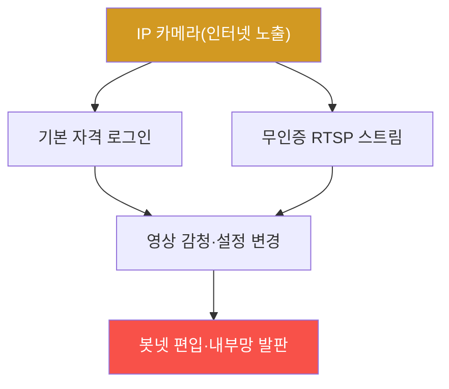

# iot-security W09 — IP Camera 해킹: RTSP·기본 자격·펌웨어 취약점

> **본 주차의 한 줄 요약**
>
> **IP 카메라**는 가장 흔하고 가장 많이 해킹되는 IoT 장치다(Mirai가 대량 장악한 게 카메라·DVR). 사생활·보안을
> 지키려는 카메라가 역설적으로 **감시·침입의 통로**가 된다. 주요 취약점: ① **기본 자격** — admin/admin·
> admin/12345 미변경(W01), Shodan 같은 검색엔진으로 **인터넷에 노출된 카메라**를 찾아 그냥 로그인, ② **RTSP
> 스트림 무인증** — 영상 스트림(RTSP)이 인증 없이 접근 가능해 **누구나 실시간 영상**을 봄(`rtsp://ip:554/`),
> ③ **펌웨어 취약점** — 명령 주입·하드코딩 비밀·백도어(W04·W05), ④ **인터넷 직접 노출** — UPnP·포트포워딩으로
> 카메라가 인터넷에 직접 노출. 공격자는 노출된 카메라를 대량 스캔해 영상 감청·봇넷 편입·내부망 진입 발판으로
> 쓴다. 방어: **기본 자격 즉시 변경·강한 비밀번호**, **RTSP 인증·불필요 시 비활성**, **펌웨어 업데이트**,
> **인터넷 직접 노출 금지**(VPN·네트워크 분리), **UPnP 비활성**. 카메라는 el34의 네트워크 서비스로 일부 개념을
> 실측할 수 있다(RTSP·기본 자격 점검 로직).
>
> **한 줄 결론**: IP 카메라는 기본 자격·무인증 RTSP·인터넷 노출로 대량 해킹된다. 방어 = **기본 자격 변경 + RTSP
> 인증 + 펌웨어 업데이트 + 인터넷 직접 노출 금지(분리·VPN)**.

---

## 학습 목표

본 주차 종료 시 학생은 다음 5가지를 **본인 손으로** 할 수 있어야 한다.

1. IP 카메라가 왜 가장 많이 해킹되는지 설명한다.
2. **기본 자격·인터넷 노출**을 평가한다(CAMERA_EXPOSED).
3. **무인증 RTSP 스트림** 접근을 판정한다(STREAM_ACCESSIBLE).
4. **자격 변경·RTSP 인증·네트워크 분리**로 강화한다(CAMERA_HARDENED).
5. Shodan 노출과 대량 스캔의 위협을 설명한다.

> **이 주차의 시선** — 사생활을 지키려는 카메라가 감시 통로가 되는 역설을, 기본 보안으로 막는다.

---

## 0. 용어 해설 (IP 카메라)

| 용어 | 영문 | 뜻 | 비유 |
|------|------|----|------|
| **RTSP** | Real Time Streaming Protocol | 영상 스트림 | 실시간 방송 |
| **Shodan** | — | 노출 장치 검색엔진 | 노출 지도 |
| **UPnP** | — | 자동 포트 개방 | 자동 문 열기 |
| **기본 자격** | Default Credentials | 공장 비밀번호 | 초기 비번 |
| **네트워크 분리** | Segmentation | 망 격리 | 별도 구역 |

> **헷갈리기 쉬운 한 쌍** — *웹 로그인* 은 "관리 UI 접근(인증 있을 수)", *RTSP 스트림* 은 "영상 직접(종종 무인증)"
> 이다. 웹은 막아도 RTSP가 열려 영상이 샐 수 있다.

---

## 0.5 신입생 친화 핵심 개념

### 0.5.1 카메라가 감시 통로가 된다

인터넷에 노출된 카메라를 Shodan으로 찾아, 기본 자격·무인증 RTSP로 영상을 보고 장치를 장악한다. 그리고 봇넷·
내부망 진입에 쓴다.

### 0.5.2 Shodan — 노출 장치의 지도

Shodan은 인터넷에 노출된 장치(카메라·RTSP 포트·관리 페이지)를 **검색**한다. 공격자는 "특정 카메라 모델 +
기본 자격"으로 **수천 대를 한 번에** 찾는다. 인터넷 직접 노출은 곧 대량 스캔의 표적 — 카메라를 인터넷에 그냥
띄우면 안 된다.

### 0.5.3 RTSP 무인증 — 영상이 샌다

RTSP는 영상 스트림 프로토콜이다. 많은 카메라가 `rtsp://ip:554/stream`을 **인증 없이** 제공해, URL만 알면
누구나 실시간 영상을 본다. 웹 UI에 인증이 있어도 RTSP가 열려 있으면 영상이 샌다. RTSP도 인증·암호화해야 한다.

### 0.5.4 방어 — 기본 보안 + 노출 차단

- **기본 자격 즉시 변경**: 강한 고유 비밀번호. 대량 스캔의 첫 방어.
- **RTSP 인증·비활성**: RTSP에 인증, 불필요하면 끔.
- **펌웨어 업데이트**: 알려진 취약점(명령 주입·백도어) 패치.
- **인터넷 직접 노출 금지**: UPnP 끄기, 포트포워딩 대신 VPN, 카메라를 별도 네트워크로 분리(내부망과 격리).
카메라는 인터넷에 직접 노출하지 않는 게 근본 방어다.

### 0.5.5 el34 맥락

IP 카메라는 실물이지만, **RTSP·기본 자격·노출 점검 로직**은 el34에서 시뮬·개념 학습한다. 이번 주는 기본 자격
점검·RTSP 노출 평가·방어를 익힌다. 실제 카메라 펌웨어 분석은 W04 기법을 적용한다.

---

## 1. 실습 안내 (5 미션)

실행 위치 el34 **호스트**(`ssh ccc@{{TARGET_IP}}`), GPU `http://211.170.162.139:10934`.

### STEP 1 — GPU 헬스체크 → GEN_OK
### STEP 2 — 기본 자격·노출 평가 → CAMERA_EXPOSED
### STEP 3 — 무인증 RTSP → STREAM_ACCESSIBLE
### STEP 4 — 카메라 강화 → CAMERA_HARDENED
### STEP 5 — 종합 → Assessment

---

## 2. 흔한 오해·관제자 노트

- **"내 카메라는 아무도 안 봐"** — Shodan으로 대량 노출. 인터넷 직접 노출 금지.
- **"웹에 로그인 걸면 됨"** — RTSP가 열려 영상이 샐 수 있다. RTSP도 인증.
- **"카메라는 격리 안 해도"** — 내부망 진입 발판. 별도 네트워크 분리.
- **관제 관점** — 카메라 기본 자격이 변경됐는지, RTSP가 인증·비활성인지, 인터넷 직접 노출이 없는지, 별도
  네트워크로 분리됐는지 점검한다. 카메라는 대량 스캔의 최대 표적.

---

## 3. 다음 주차 (W10) 예고 — 스마트홈 보안

W09가 "IP 카메라"였다면, W10은 **스마트홈 생태계** — 허브·다양한 장치·클라우드가 얽힌 스마트홈의 보안(허브
장악·장치 간 신뢰·프라이버시)과 방어를 다룬다.
