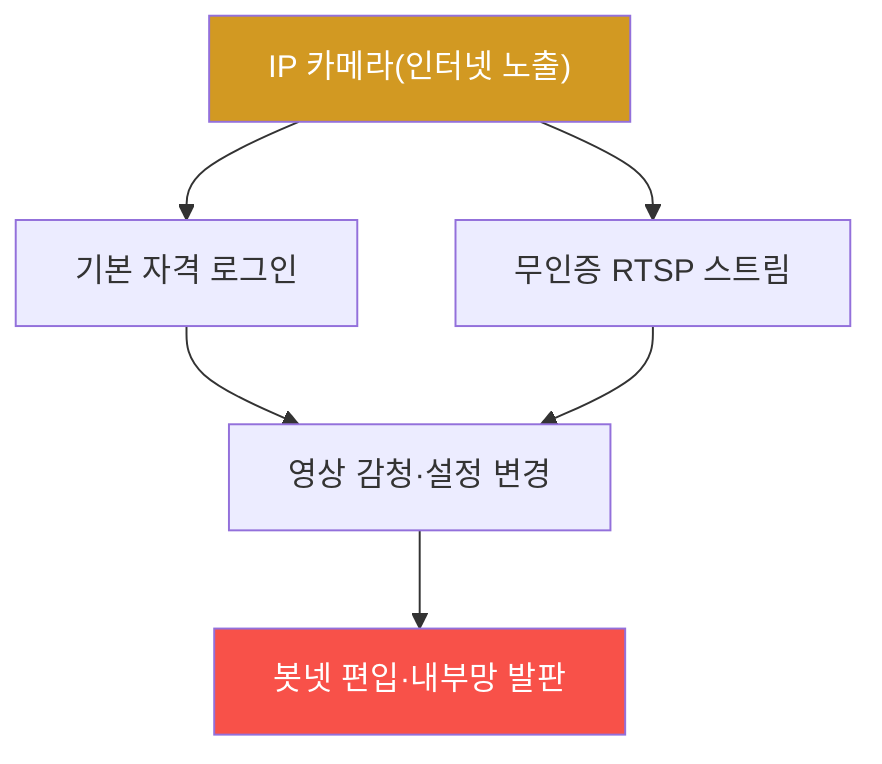

# iot-security W09 — IP Camera 해킹: RTSP·기본 자격·펌웨어 취약점

> **본 주차의 한 줄 요약**
>
> **IP 카메라**는 가장 흔하고 가장 많이 해킹되는 IoT 장치다(Mirai가 대량 장악한 게 카메라·DVR). 사생활·보안을 지키려는
> 카메라가 역설적으로 **감시·침입의 통로**가 된다. 주요 취약점: ① **기본 자격** — admin/admin·admin/12345 미변경(W01),
> Shodan 같은 검색엔진으로 인터넷에 노출된 카메라를 찾아 그냥 로그인, ② **RTSP 스트림 무인증** — 영상 스트림(RTSP)이
> 인증 없이 접근 가능해 누구나 실시간 영상을 봄(`rtsp://ip:554/`), ③ **펌웨어 취약점** — 명령 주입·하드코딩 비밀·백도어
> (W04·W05), ④ **인터넷 직접 노출** — UPnP·포트포워딩으로 카메라가 인터넷에 직접 노출. 공격자는 노출된 카메라를 대량
> 스캔해 영상 감청·봇넷 편입·내부망 진입 발판으로 쓴다. 실습에서는 기본 자격·인터넷 노출을 평가하고(마커
> `CAMERA_EXPOSED`), 무인증 RTSP 접근을 판정하며(마커 `STREAM_ACCESSIBLE`), 자격 변경·RTSP 인증·네트워크 분리로
> 강화한다(마커 `CAMERA_HARDENED`). 방어는 **기본 자격 즉시 변경·강한 비밀번호·RTSP 인증(불필요 시 비활성)·펌웨어
> 업데이트·인터넷 직접 노출 금지(VPN·네트워크 분리)·UPnP 비활성**이다.

---

## 학습 목표

본 주차 종료 시 학생은 다음 5가지를 **본인 손으로** 할 수 있어야 한다.

1. IP 카메라가 왜 가장 많이 해킹되는지 설명한다.
2. **기본 자격·인터넷 노출**을 평가한다(마커 `CAMERA_EXPOSED`).
3. **무인증 RTSP 스트림** 접근을 판정한다(마커 `STREAM_ACCESSIBLE`).
4. **자격 변경·RTSP 인증·네트워크 분리**로 강화한다(마커 `CAMERA_HARDENED`).
5. Shodan 노출과 대량 스캔의 위협을 종합한다(마커 `Assessment`).

> **이 주차의 시선** — 사생활을 지키려는 카메라가 감시 통로가 되는 역설을 기본 보안으로 막는다. "인터넷 직접 노출
> 금지"가 근본 방어다.

---

## 0. 용어 해설 (IP 카메라)

| 용어 | 영문 | 뜻 | 비유 |
|------|------|----|------|
| **RTSP** | Real Time Streaming Protocol | 영상 스트림 프로토콜(554 포트) | 실시간 방송선 |
| **Shodan** | — | 인터넷 노출 장치 검색엔진 | 노출 지도 |
| **UPnP** | Universal Plug and Play | 자동 포트 개방 | 자동 문 열기 |
| **포트포워딩** | Port Forwarding | 외부에서 내부 장치로 직접 연결 | 직통 문 |
| **기본 자격** | Default Credentials | 공장 초기 비밀번호 | 초기 비번 |
| **네트워크 분리** | Segmentation | 카메라를 내부망과 격리 | 별도 구역 |

> **헷갈리기 쉬운 한 쌍 — 웹 로그인 vs RTSP 스트림.** *웹 로그인*은 관리 UI 접근(인증이 있을 수 있음), *RTSP 스트림*은
> 영상 직접 접근(종종 무인증)이다. 웹 UI를 막아도 RTSP가 열려 있으면 영상이 샌다 — 둘 다 인증해야 한다.

---

## 0.5 신입생 친화 핵심 개념

### 0.5.1 카메라가 감시 통로가 된다

인터넷에 노출된 카메라를 Shodan으로 찾아, 기본 자격·무인증 RTSP로 영상을 보고 장치를 장악한다. 그리고 봇넷·내부망
진입에 쓴다.

### 0.5.2 Shodan — 노출 장치의 지도

Shodan은 인터넷에 노출된 장치(카메라·RTSP 포트·관리 페이지)를 검색한다. 공격자는 "특정 카메라 모델 + 기본 자격"으로
수천 대를 한 번에 찾는다. 인터넷 직접 노출은 곧 대량 스캔의 표적 — 카메라를 인터넷에 그냥 띄우면 안 된다.

### 0.5.3 RTSP 무인증 — 영상이 샌다

RTSP는 영상 스트림 프로토콜이다. 많은 카메라가 `rtsp://ip:554/stream`을 인증 없이 제공해, URL만 알면 누구나 실시간
영상을 본다. 웹 UI에 인증이 있어도 RTSP가 열려 있으면 영상이 샌다. RTSP도 인증·암호화해야 한다.

### 0.5.4 방어 — 기본 보안 + 노출 차단

- **기본 자격 즉시 변경**: 강한 고유 비밀번호. 대량 스캔의 첫 방어.
- **RTSP 인증·비활성**: RTSP에 인증, 불필요하면 끔.
- **펌웨어 업데이트**: 알려진 취약점(명령 주입·백도어) 패치.
- **인터넷 직접 노출 금지**: UPnP 끄기, 포트포워딩 대신 VPN, 카메라를 별도 네트워크로 분리(내부망과 격리).

카메라는 인터넷에 직접 노출하지 않는 게 근본 방어다.

### 0.5.5 el34 맥락

IP 카메라는 실물이지만, **RTSP·기본 자격·노출 점검 로직**은 el34에서 실제 아티팩트(설정·응답)로 분석한다. 이번 주는 기본 자격 점검·RTSP
노출 평가·방어를 익힌다(실제 카메라 펌웨어 분석은 W04 기법을 적용).

---

## 1. IP 카메라 상세 — 노출·스트림·강화

### 1.1 기본 자격·노출 평가 (CAMERA_EXPOSED)

- **한 줄 정의**: 기본 자격·인터넷 직접 노출·UPnP 상태를 평가한다.
- **왜 중요한가**: 노출 + 기본 자격이 대량 장악의 조합이다.
- **el34 맥락에서 어떻게**: 기본 자격·노출·UPnP를 점검해 노출 판정하면 `CAMERA_EXPOSED`.
- **한계/주의**: 실제 Shodan 스캔은 인가 범위 내에서만.

### 1.2 무인증 RTSP (STREAM_ACCESSIBLE)

- **한 줄 정의**: RTSP 스트림이 인증 없이 접근되는지 판정한다.
- **핵심**: `rtsp://ip:554/`가 무인증 재생되면 영상 유출.
- **판정**: 무인증 접근이 가능하면 `STREAM_ACCESSIBLE`.

### 1.3 카메라 강화 (CAMERA_HARDENED)

- **한 줄 정의**: 자격 변경·RTSP 인증·업데이트·노출 차단·분리를 적용한다.
- **핵심**: 기본 자격 변경 + RTSP 인증 + VPN/분리 + UPnP 비활성.
- **판정**: 강화가 적용되면 `CAMERA_HARDENED`.

---

## 2. 실습 안내 (총 5 미션)

실행 위치는 el34 **호스트**(`ssh ccc@{{TARGET_IP}}`, 비밀번호 `1`), 참고 GPU는 Ollama
(`http://211.170.162.139:10934`, gemma3:4b)다. 카메라 개념(RTSP·기본 자격·노출)은 el34 네트워크 서비스로 일부 실측·
실제 아티팩트로 분석한다. 각 미션의 마지막 줄 마커가 채점 기준이다.

### 미션 1 — GPU 헬스체크 → `GEN_OK`

> **왜 하는가?** 분석·종합에 쓸 LLM 도달·응답 확인.
> **무엇을 아는가?** Ollama 응답 형식·도달성.
> **결과 해석** — 정상 `GEN_OK` / 비정상 `GEN_EMPTY`·연결 오류.
> **실전 활용** — 종합 소견 작성에 사용.

### 미션 2 — 기본 자격·노출 평가 → `CAMERA_EXPOSED`

> **왜 하는가?** 대량 장악의 조합(노출+기본 자격)을 평가한다.
> **무엇을 아는가?** 기본 자격·인터넷 노출·UPnP.
> **결과 해석** — 정상: 노출 판정 + `CAMERA_EXPOSED`.
> **실전 활용** — 카메라 노출 진단.

### 미션 3 — 무인증 RTSP → `STREAM_ACCESSIBLE`

> **왜 하는가?** 웹을 막아도 영상이 샐 수 있음을 확인한다.
> **무엇을 아는가?** RTSP 무인증 재생.
> **결과 해석** — 정상: 접근 가능 + `STREAM_ACCESSIBLE`.
> **실전 활용** — 영상 유출 위험 평가.

### 미션 4 — 카메라 강화 → `CAMERA_HARDENED`

> **왜 하는가?** 기본 보안 + 노출 차단으로 막는다.
> **무엇을 아는가?** 자격 변경·RTSP 인증·VPN/분리·UPnP off.
> **결과 해석** — 정상: 강화 + `CAMERA_HARDENED`.
> **실전 활용** — 카메라 보안 권고.

### 미션 5 — 종합 소견 → `Assessment`

> **왜 하는가?** 노출·스트림·강화와 "인터넷 직접 노출 금지"를 소견으로 묶는다.
> **무엇을 아는가?** GPU에 요약시키되 첫 줄을 `Assessment`로 강제.
> **결과 해석** — 정상: `Assessment` 포함. 없으면 `[형식 미준수 — 재실행]`.
> **실전 활용** — IP 카메라 보안 개요.

---

## 2.5 과제 (제출물)

- **A. 기본 자격·노출 평가 실증 (필수, 40점)** — `CAMERA_EXPOSED` 단계를 직접 수행해 실제 명령·출력(또는 아티팩트 분석 결과)을 캡처하고, 무엇을 근거로 판정했는지 서술한다.
- **B. 무인증 RTSP 분석 (필수, 30점)** — `STREAM_ACCESSIBLE` 단계를 직접 수행해 실제 명령·출력(또는 아티팩트 분석 결과)을 캡처하고, 무엇을 근거로 판정했는지 서술한다.
- **C. 카메라 강화 방어 설계 (필수, 30점)** — `CAMERA_HARDENED` 단계를 직접 수행해 실제 명령·출력(또는 아티팩트 분석 결과)을 캡처하고, 무엇을 근거로 판정했는지 서술한다.

## 2.6 평가 기준

| 항목 | 미흡(0) | 보통 | 우수 |
|------|---------|------|------|
| 탐지/실증(CAMERA_EXPOSED) | 미수행 | 마커 도출 | 근거·해석·재현까지 |
| 분석(STREAM_ACCESSIBLE) | 미수행 | 마커 도출 | 근거·해석·재현까지 |
| 방어(CAMERA_HARDENED) | 미수행 | 마커 도출 | 근거·해석·재현까지 |

## 2.7 핵심 정리 (1줄씩)

- 이번 주 주제: **IP Camera 해킹: RTSP·기본 자격·펌웨어 취약점**.
- **기본 자격·노출 평가**(`CAMERA_EXPOSED`): 기본 자격·인터넷 직접 노출·UPnP 상태를 평가한다.
- **무인증 RTSP**(`STREAM_ACCESSIBLE`): RTSP 스트림이 인증 없이 접근되는지 판정한다.
- **카메라 강화**(`CAMERA_HARDENED`): 자격 변경·RTSP 인증·업데이트·노출 차단·분리를 적용한다.
- 공격을 이해한 만큼 **방어의 우선순위**가 분명해진다 — 탐지 근거와 완화를 함께 익힌다.

---

## 3. 흔한 오해·블루팀 노트

- **"내 카메라는 아무도 안 본다."** — Shodan으로 대량 노출된다. 인터넷 직접 노출을 금지한다.
- **"웹에 로그인만 걸면 된다."** — RTSP가 열려 영상이 샐 수 있다. RTSP도 인증한다.
- **"카메라는 격리 안 해도 된다."** — 내부망 진입 발판이 된다. 별도 네트워크로 분리한다.
- **"펌웨어는 그대로 써도 된다."** — 알려진 명령 주입·백도어가 있다. 업데이트가 필요.
- **관제(Blue) 관점** — 카메라가 (1) 기본 자격 변경, (2) RTSP 인증·비활성, (3) 인터넷 직접 노출 없음, (4) 별도 네트워크
  분리를 갖췄는지 점검한다. 카메라는 대량 스캔의 최대 표적이다.

---

## 4. 다음 주차 (W10) 예고 — 스마트홈 보안

W09가 "IP 카메라"였다면, W10은 **스마트홈 생태계**를 다룬다. 허브·다양한 장치·클라우드가 얽힌 스마트홈의 보안(허브
장악·장치 간 신뢰·프라이버시)과 방어를 익힌다.
