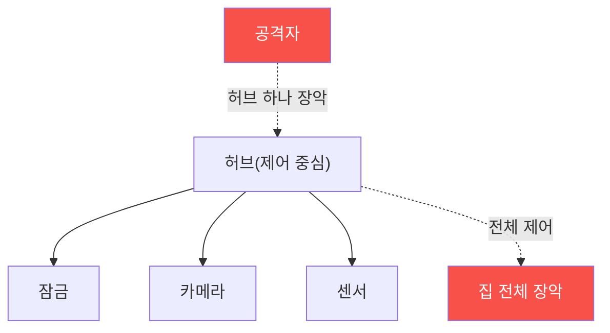

# iot-security W10 — 스마트홈 보안: 허브 장악·장치 간 신뢰·프라이버시

> **본 주차의 한 줄 요약**
>
> **스마트홈**은 여러 IoT 장치(조명·잠금·센서·카메라·스피커)가 **허브(hub)** 와 **클라우드**로 연결된 생태계다.
> 개별 장치 보안(앞 주차들)을 넘어, 스마트홈은 **생태계 차원의 위험**을 갖는다: ① **허브 단일 장애점(SPOF)** —
> 허브가 모든 장치를 제어하므로, **허브 하나 뚫리면 집 전체**(잠금·카메라 포함)를 장악, ② **장치 간 과잉 신뢰** —
> 같은 네트워크의 장치들이 서로를 무조건 신뢰해, 약한 장치(싼 전구) 하나가 강한 장치(스마트 잠금)로 가는
> 발판(측면이동, agent-ir W05), ③ **프라이버시** — 센서·카메라·스피커가 **생활 패턴·음성·영상**을 수집해 클라우드로
> 전송, 유출 시 심각한 사생활 침해(재실 여부로 빈집털이 등), ④ **클라우드 의존** — 클라우드가 뚫리면 원격으로
> 전 가정 장악. 방어: **네트워크 분리**(IoT를 별도 VLAN·게스트망으로, 중요 장치와 격리), **허브 강화**(강한
> 인증·업데이트), **장치 간 최소 신뢰**(마이크로세분화), **최소 데이터 수집·로컬 처리·암호화**. 스마트홈은
> 편리한 만큼 넓은 공격 표면과 프라이버시 위험을 안는다.
>
> **한 줄 결론**: 스마트홈은 허브 SPOF·장치 간 과잉 신뢰·프라이버시·클라우드 의존의 생태계 위험을 갖는다.
> 방어 = **네트워크 분리 + 허브 강화 + 장치 간 최소 신뢰 + 최소 데이터/암호화**.

---

## 학습 목표

본 주차 종료 시 학생은 다음 5가지를 **본인 손으로** 할 수 있어야 한다.

1. 스마트홈의 **생태계 위험**을 설명한다.
2. **허브 단일 장애점**의 영향을 평가한다(HUB_RISK).
3. **장치 간 측면이동·프라이버시** 위험을 평가한다(PRIVACY_LEAK).
4. **네트워크 분리·최소 신뢰**로 강화한다(SMARTHOME_HARDENED).
5. 약한 장치가 강한 장치로 가는 발판이 되는 이유를 설명한다.

> **이 주차의 시선** — 개별 장치를 넘어 생태계 차원의 위험(허브·신뢰·프라이버시)을 본다.

---

## 0. 용어 해설 (스마트홈)

| 용어 | 영문 | 뜻 | 비유 |
|------|------|----|------|
| **허브** | Hub | 장치 제어 중심 | 관제실 |
| **SPOF** | Single Point of Failure | 단일 장애점 | 하나 뚫리면 전체 |
| **마이크로세분화** | Micro-segmentation | 장치별 격리 | 방마다 문 |
| **측면이동** | Lateral Movement | 장치 간 확산 | 옆 장치로 |
| **재실 감지** | Occupancy | 재실 여부 | 집에 있나 |

> **헷갈리기 쉬운 한 쌍** — *개별 장치 보안* 은 "장치 하나", *생태계 보안* 은 "허브·연결·프라이버시 전체"다.
> 스마트홈은 후자가 핵심.

---

## 0.5 신입생 친화 핵심 개념

### 0.5.1 허브 단일 장애점

허브가 모든 장치를 제어하니, **허브 하나 뚫리면 잠금·카메라 포함 집 전체**를 장악한다. 허브는 최우선 보호 대상.

### 0.5.2 장치 간 과잉 신뢰 — 약한 고리

같은 네트워크의 장치들이 서로 무조건 신뢰하면, **약한 장치**(싼 스마트 전구·플러그) 하나 뚫려서 그걸 발판으로
**강한 장치**(스마트 잠금)에 측면이동한다(agent-ir W05). 전구가 잠금을 여는 통로가 되는 것. 마이크로세분화로
장치 간 신뢰를 최소화해야 한다.

### 0.5.3 프라이버시 — 생활이 새어 나간다

스마트홈 센서·카메라·스피커는 **생활 패턴·음성·영상**을 수집한다: 언제 집에 있나(재실), 무슨 말을 하나, 무슨
영상. 이 데이터가 클라우드로 가고 유출되면 심각하다 — **재실 패턴으로 빈집털이**, 음성으로 사생활 침해. 최소
데이터 수집·로컬 처리·암호화가 프라이버시 방어.

### 0.5.4 방어 — 분리와 최소 신뢰

- **네트워크 분리**: IoT를 별도 VLAN·게스트망으로. 중요 기기(PC·NAS)와 격리. 카메라(W09)도 분리.
- **허브 강화**: 강한 인증·업데이트·최소 노출. SPOF이니 특히.
- **장치 간 최소 신뢰**: 마이크로세분화로 장치가 서로 필요한 것만 통신.
- **최소 데이터·암호화**: 필요한 데이터만, 로컬 처리 우선, 전송·저장 암호화.
생태계 차원의 방어가 개별 장치 보안을 완성한다.

### 0.5.5 el34 맥락

스마트홈은 실물 장치 생태계지만, **허브 SPOF·측면이동·네트워크 분리 로직**은 시뮬·개념으로 익힌다. 이번 주는
생태계 위험 평가·분리 방어를 다룬다.

---

## 1. 실습 안내 (5 미션)

실행 위치 el34 **호스트**(`ssh ccc@{{TARGET_IP}}`), GPU `http://211.170.162.139:10934`.

### STEP 1 — GPU 헬스체크 → GEN_OK
### STEP 2 — 허브 단일 장애점 → HUB_RISK
### STEP 3 — 측면이동·프라이버시 → PRIVACY_LEAK
### STEP 4 — 스마트홈 강화 → SMARTHOME_HARDENED
### STEP 5 — 종합 → Assessment

---

## 2. 흔한 오해·관제자 노트

- **"장치별로 보안하면 됨"** — 허브·신뢰·프라이버시 생태계 위험. 전체를 봐야.
- **"싼 전구는 무해"** — 측면이동 발판. 약한 장치도 격리.
- **"데이터는 클라우드가 지킴"** — 유출 시 사생활 침해. 최소 수집·암호화.
- **관제 관점** — IoT가 네트워크 분리됐는지, 허브가 강화됐는지, 장치 간 신뢰가 최소인지, 데이터 수집이
  최소·암호화인지 점검한다. 스마트홈은 생태계 방어.

---

## 3. 다음 주차 (W11) 예고 — IoT 허니팟

W10이 "스마트홈 생태계"였다면, W11은 **IoT 허니팟** — 가짜 IoT 장치로 공격자를 유인·관찰해 위협을 탐지·연구하는
능동 방어(agent-ir W10의 IoT판)를 다룬다.
