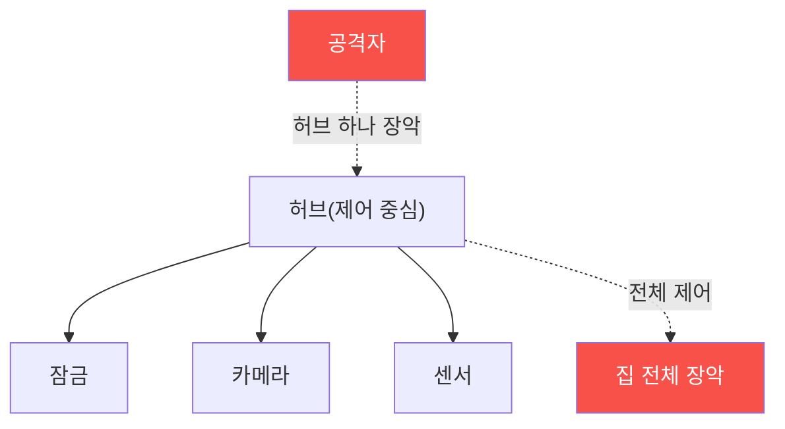

# iot-security W10 — 스마트홈 보안: 허브 장악·장치 간 신뢰·프라이버시

> **본 주차의 한 줄 요약**
>
> **스마트홈**은 여러 IoT 장치(조명·잠금·센서·카메라·스피커)가 **허브(hub)**와 **클라우드**로 연결된 생태계다. 개별
> 장치 보안(앞 주차들)을 넘어, 스마트홈은 **생태계 차원의 위험**을 갖는다: ① **허브 단일 장애점(SPOF)** — 허브가
> 모든 장치를 제어하므로 허브 하나 뚫리면 집 전체(잠금·카메라 포함)를 장악, ② **장치 간 과잉 신뢰** — 같은 네트워크의
> 장치들이 서로를 무조건 신뢰해, 약한 장치(싼 전구) 하나가 강한 장치(스마트 잠금)로 가는 발판(측면이동), ③
> **프라이버시** — 센서·카메라·스피커가 생활 패턴·음성·영상을 수집해 클라우드로 전송, 유출 시 심각한 사생활 침해
> (재실 여부로 빈집털이 등), ④ **클라우드 의존** — 클라우드가 뚫리면 원격으로 전 가정 장악. 실습에서는 허브 단일
> 장애점의 영향을 평가하고(마커 `HUB_RISK`), 장치 간 측면이동·프라이버시 위험을 평가하며(마커 `PRIVACY_LEAK`),
> 네트워크 분리·최소 신뢰로 강화한다(마커 `SMARTHOME_HARDENED`). 방어는 **네트워크 분리(별도 VLAN·게스트망)·허브
> 강화·장치 간 최소 신뢰(마이크로세분화)·최소 데이터 수집·로컬 처리·암호화**다. 스마트홈은 편리한 만큼 넓은 공격
> 표면과 프라이버시 위험을 안는다.

---

## 학습 목표

본 주차 종료 시 학생은 다음 5가지를 **본인 손으로** 할 수 있어야 한다.

1. 스마트홈의 생태계 위험(허브·신뢰·프라이버시·클라우드)을 설명한다.
2. **허브 단일 장애점**의 영향을 평가한다(마커 `HUB_RISK`).
3. **장치 간 측면이동·프라이버시** 위험을 평가한다(마커 `PRIVACY_LEAK`).
4. **네트워크 분리·최소 신뢰**로 강화한다(마커 `SMARTHOME_HARDENED`).
5. 약한 장치가 강한 장치로 가는 발판이 되는 이유를 종합한다(마커 `Assessment`).

> **이 주차의 시선** — 개별 장치를 넘어 생태계 차원의 위험(허브·신뢰·프라이버시)을 본다. "가장 약한 장치가 전체를
> 연다"가 핵심이다.

---

## 0. 용어 해설 (스마트홈)

| 용어 | 영문 | 뜻 | 비유 |
|------|------|----|------|
| **허브** | Hub | 스마트홈 장치를 제어하는 중심 | 관제실 |
| **SPOF** | Single Point of Failure | 하나가 뚫리면 전체가 무너지는 지점 | 급소 |
| **측면이동** | Lateral Movement | 약한 장치를 발판으로 강한 장치로 확산 | 옆방으로 번짐 |
| **마이크로세분화** | Micro-segmentation | 장치별로 통신을 격리 | 방마다 잠긴 문 |
| **재실 감지** | Occupancy Detection | 집에 사람이 있는지 파악 | 인기척 감지 |
| **로컬 처리** | Local Processing | 클라우드 대신 집 안에서 처리 | 자체 처리 |

> **헷갈리기 쉬운 한 쌍 — 개별 장치 보안 vs 생태계 보안.** *개별 장치 보안*은 장치 하나를 지키는 것, *생태계 보안*은
> 허브·장치 간 신뢰·프라이버시·클라우드 전체를 보는 것이다. 스마트홈은 후자가 핵심 — 장치를 다 잠가도 허브 하나나
> 약한 전구 하나가 전체를 연다.

---

## 0.5 신입생 친화 핵심 개념

### 0.5.1 허브 단일 장애점

허브가 모든 장치를 제어하니, 허브 하나 뚫리면 잠금·카메라 포함 집 전체를 장악한다. 허브는 최우선 보호 대상이다.

### 0.5.2 장치 간 과잉 신뢰 — 약한 고리

같은 네트워크의 장치들이 서로 무조건 신뢰하면, 약한 장치(싼 스마트 전구·플러그) 하나가 뚫려서 그걸 발판으로 강한
장치(스마트 잠금)에 측면이동한다. 전구가 잠금을 여는 통로가 되는 것이다. 마이크로세분화로 장치 간 신뢰를 최소화해야
한다.

### 0.5.3 프라이버시 — 생활이 새어 나간다

스마트홈 센서·카메라·스피커는 생활 패턴·음성·영상을 수집한다: 언제 집에 있나(재실), 무슨 말을 하나, 무슨 영상. 이
데이터가 클라우드로 가고 유출되면 심각하다 — 재실 패턴으로 빈집털이, 음성으로 사생활 침해. 최소 데이터 수집·로컬
처리·암호화가 프라이버시 방어다.

### 0.5.4 방어 — 분리와 최소 신뢰

- **네트워크 분리**: IoT를 별도 VLAN·게스트망으로. 중요 기기(PC·NAS)와 격리. 카메라(W09)도 분리.
- **허브 강화**: 강한 인증·업데이트·최소 노출. SPOF이니 특히.
- **장치 간 최소 신뢰**: 마이크로세분화로 장치가 서로 필요한 것만 통신.
- **최소 데이터·암호화**: 필요한 데이터만, 로컬 처리 우선, 전송·저장 암호화.

생태계 차원의 방어가 개별 장치 보안을 완성한다.

### 0.5.5 el34 맥락

스마트홈은 실물 장치 생태계지만, **허브 SPOF·측면이동·네트워크 분리 로직**은 시뮬·개념으로 익힌다. 이번 주는 생태계
위험 평가·분리 방어를 다룬다.

---

## 1. 스마트홈 상세 — 허브·프라이버시·강화

### 1.1 허브 단일 장애점 (HUB_RISK)

- **한 줄 정의**: 허브 장악이 집 전체 장악으로 이어지는 위험을 평가한다.
- **왜 중요한가**: 허브가 모든 제어의 급소다.
- **el34 맥락에서 어떻게**: 허브의 인증·노출·업데이트 상태와 장악 영향을 평가하면 `HUB_RISK`.
- **한계/주의**: 허브가 클라우드에 의존하면 클라우드 침해도 같은 결과다.

### 1.2 측면이동·프라이버시 (PRIVACY_LEAK)

- **한 줄 정의**: 약한 장치 발판·데이터 수집·유출 위험을 평가한다.
- **핵심**: 전구→잠금 측면이동, 재실·음성·영상 데이터 노출.
- **판정**: 측면이동/프라이버시 위험이 확인되면 `PRIVACY_LEAK`.

### 1.3 스마트홈 강화 (SMARTHOME_HARDENED)

- **한 줄 정의**: 네트워크 분리·허브 강화·최소 신뢰·최소 데이터를 적용한다.
- **핵심**: VLAN 분리 + 허브 강화 + 마이크로세분화 + 로컬 처리·암호화.
- **판정**: 강화가 적용되면 `SMARTHOME_HARDENED`.

---

## 2. 실습 안내 (총 5 미션)

실행 위치는 el34 **호스트**(`ssh ccc@{{TARGET_IP}}`, 비밀번호 `1`), 참고 GPU는 Ollama
(`http://211.170.162.139:10934`, gemma3:4b)다. 스마트홈 생태계 위험은 시뮬·개념으로 익힌다. 각 미션의 마지막 줄 마커가
채점 기준이다.

### 미션 1 — GPU 헬스체크 → `GEN_OK`

> **왜 하는가?** 분석·종합에 쓸 LLM 도달·응답 확인.
> **무엇을 아는가?** Ollama 응답 형식·도달성.
> **결과 해석** — 정상 `GEN_OK` / 비정상 `GEN_EMPTY`·연결 오류.
> **실전 활용** — 종합 소견 작성에 사용.

### 미션 2 — 허브 단일 장애점 → `HUB_RISK`

> **왜 하는가?** 급소인 허브의 위험을 평가한다.
> **무엇을 아는가?** 허브 장악 영향·인증·노출.
> **결과 해석** — 정상: 위험 평가 + `HUB_RISK`.
> **실전 활용** — 스마트홈 위협 모델링.

### 미션 3 — 측면이동·프라이버시 → `PRIVACY_LEAK`

> **왜 하는가?** 약한 고리와 데이터 유출을 평가한다.
> **무엇을 아는가?** 전구→잠금 측면이동·데이터 수집.
> **결과 해석** — 정상: 위험 평가 + `PRIVACY_LEAK`.
> **실전 활용** — 프라이버시 영향 평가.

### 미션 4 — 스마트홈 강화 → `SMARTHOME_HARDENED`

> **왜 하는가?** 생태계 방어로 개별 장치 보안을 완성한다.
> **무엇을 아는가?** 분리·허브 강화·최소 신뢰·최소 데이터.
> **결과 해석** — 정상: 강화 + `SMARTHOME_HARDENED`.
> **실전 활용** — 스마트홈 보안 설계.

### 미션 5 — 종합 소견 → `Assessment`

> **왜 하는가?** 허브·프라이버시·강화와 "약한 장치가 전체를 연다"를 소견으로 묶는다.
> **무엇을 아는가?** GPU에 요약시키되 첫 줄을 `Assessment`로 강제.
> **결과 해석** — 정상: `Assessment` 포함. 없으면 `[형식 미준수 — 재실행]`.
> **실전 활용** — 스마트홈 보안 개요.

---

## 2.5 과제 (제출물)

- **A. 허브 단일 장애점 실증 (필수, 40점)** — `HUB_RISK` 단계를 직접 수행해 실제 명령·출력(또는 아티팩트 분석 결과)을 캡처하고, 무엇을 근거로 판정했는지 서술한다.
- **B. 측면이동·프라이버시 분석 (필수, 30점)** — `PRIVACY_LEAK` 단계를 직접 수행해 실제 명령·출력(또는 아티팩트 분석 결과)을 캡처하고, 무엇을 근거로 판정했는지 서술한다.
- **C. 스마트홈 강화 방어 설계 (필수, 30점)** — `SMARTHOME_HARDENED` 단계를 직접 수행해 실제 명령·출력(또는 아티팩트 분석 결과)을 캡처하고, 무엇을 근거로 판정했는지 서술한다.

## 2.6 평가 기준

| 항목 | 미흡(0) | 보통 | 우수 |
|------|---------|------|------|
| 탐지/실증(HUB_RISK) | 미수행 | 마커 도출 | 근거·해석·재현까지 |
| 분석(PRIVACY_LEAK) | 미수행 | 마커 도출 | 근거·해석·재현까지 |
| 방어(SMARTHOME_HARDENED) | 미수행 | 마커 도출 | 근거·해석·재현까지 |

## 2.7 핵심 정리 (1줄씩)

- 이번 주 주제: **스마트홈 보안: 허브 장악·장치 간 신뢰·프라이버시**.
- **허브 단일 장애점**(`HUB_RISK`): 허브 장악이 집 전체 장악으로 이어지는 위험을 평가한다.
- **측면이동·프라이버시**(`PRIVACY_LEAK`): 약한 장치 발판·데이터 수집·유출 위험을 평가한다.
- **스마트홈 강화**(`SMARTHOME_HARDENED`): 네트워크 분리·허브 강화·최소 신뢰·최소 데이터를 적용한다.
- 공격을 이해한 만큼 **방어의 우선순위**가 분명해진다 — 탐지 근거와 완화를 함께 익힌다.

---

## 3. 흔한 오해·관제자 노트

- **"장치별로 보안하면 된다."** — 허브·신뢰·프라이버시의 생태계 위험이 있다. 전체를 봐야 한다.
- **"싼 전구는 무해하다."** — 측면이동 발판이 된다. 약한 장치도 격리한다.
- **"데이터는 클라우드가 지킨다."** — 유출 시 사생활 침해다. 최소 수집·암호화한다.
- **"허브는 편의 장치다."** — 허브는 SPOF다. 최우선 보호 대상이다.
- **관제(Blue) 관점** — IoT가 (1) 네트워크 분리됐는가, (2) 허브가 강화됐는가, (3) 장치 간 신뢰가 최소인가, (4) 데이터
  수집이 최소·암호화인가를 점검한다. 스마트홈은 생태계 방어다.

---

## 4. 다음 주차 (W11) 예고 — IoT 허니팟

W10이 "스마트홈 생태계"였다면, W11은 **IoT 허니팟**을 다룬다. 가짜 IoT 장치로 공격자를 유인·관찰해 위협을 탐지·연구하는
능동 방어를 익힌다.
