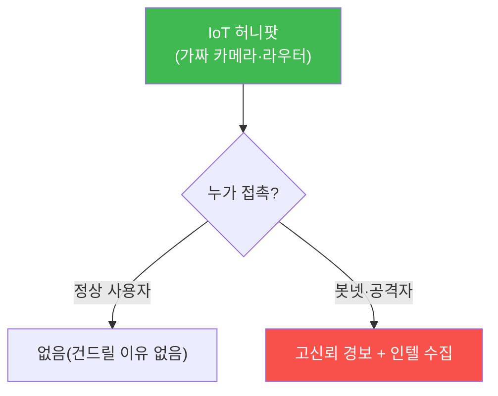

# iot-security W11 — IoT 허니팟: 가짜 장치로 공격자 유인·관찰·위협 인텔

> **본 주차의 한 줄 요약**
>
> W11은 IoT 방어의 능동적 도구 **허니팟(honeypot)** 을 다룬다(agent-ir W10 능동 방어의 IoT판). IoT 허니팟은
> **진짜처럼 보이는 가짜 IoT 장치**(가짜 카메라·라우터·산업 장치)를 인터넷·네트워크에 배치해, 공격자를 유인·
> 관찰한다. 가치: ① **거의 오탐 없는 탐지** — 정상 사용자는 이 가짜 장치를 건드릴 이유가 없으니, **접촉 자체가
> 공격 신호**(Mirai 같은 봇넷 스캔이 즉시 걸림), ② **위협 인텔** — 공격자가 어떤 자격을 시도하고(기본 자격
> 목록), 어떤 익스플로잇·페이로드를 쓰고, 어떤 봇넷에 편입하려는지 **관찰·수집**, ③ **조기 경보** — 우리 IoT를
> 노리는 캠페인을 실제 피해 전에 포착, ④ **연구** — 새 IoT 위협·악성코드 샘플 확보. 실제로 IoT 허니팟(Cowrie·
> Dionaea 등)이 Mirai 변종·신종 봇넷을 조기에 잡아냈다. 방어자는 허니팟에서 얻은 인텔(공격 IP·자격·페이로드)을
> 실제 방어(차단 목록·탐지 룰, agent-ir W09·W11)에 환류한다. 단, 허니팟은 **격리**해야 한다 — 진짜 공격당한
> 허니팟이 다른 시스템 공격에 악용되지 않게. 능동 방어의 IoT 실천이다.
>
> **한 줄 결론**: IoT 허니팟은 가짜 장치로 공격자를 유인해 **거의 오탐 없는 탐지 + 위협 인텔 + 조기 경보**를
> 얻는다. 얻은 인텔을 실제 방어에 환류. 단 허니팟은 격리한다.

---

## 학습 목표

본 주차 종료 시 학생은 다음 5가지를 **본인 손으로** 할 수 있어야 한다.

1. **IoT 허니팟**의 가치(탐지·인텔·조기 경보)를 설명한다.
2. 허니팟 **상호작용**을 고신뢰 신호로 탐지한다(HONEYPOT_TRIGGERED).
3. 공격자 **TTP**(자격·페이로드)를 수집한다(TTP_CAPTURED).
4. 인텔을 실제 방어로 **환류**한다(INTEL_APPLIED).
5. 허니팟 격리의 필요를 설명한다.

> **이 주차의 시선** — 수동 탐지를 넘어 가짜 장치로 공격자를 유인·연구하는 능동 방어를 IoT에 적용한다.

---

## 0. 용어 해설 (IoT 허니팟)

| 용어 | 영문 | 뜻 | 비유 |
|------|------|----|------|
| **허니팟** | Honeypot | 유인용 가짜 장치 | 미끼 |
| **TTP** | Tactics/Techniques/Procedures | 공격 수법 | 수법 |
| **위협 인텔** | Threat Intelligence | 공격 정보 | 첩보 |
| **환류** | Feedback | 방어에 반영 | 되먹임 |
| **격리** | Isolation | 허니팟 분리 | 검역 |

> **헷갈리기 쉬운 한 쌍** — *일반 탐지* 는 "정상/공격 구분(오탐 있음)", *허니팟* 은 "접촉=공격(거의 오탐 0)"이다.
> 정상 사용자는 가짜 장치를 안 건드린다.

---

## 0.5 신입생 친화 핵심 개념

### 0.5.1 허니팟 — 거의 오탐 없는 신호

정상 사용자는 가짜 IoT 장치를 건드릴 이유가 없다. 그래서 **접촉 자체가 공격**(거의 오탐 0). Mirai 같은 봇넷
스캔이 즉시 걸린다.

### 0.5.2 위협 인텔 수집

허니팟에 걸린 공격자를 **관찰**한다: (1) 시도한 **자격**(기본 자격 목록 → 우리 장치 방어에 활용), (2) 쓴
**익스플로잇·페이로드**(→ 탐지 룰), (3) 편입하려는 **봇넷·C2**(→ 차단 목록), (4) **행동 패턴**(→ TTP). 이
인텔은 실제 방어의 재료다.

### 0.5.3 조기 경보와 연구

허니팟은 **우리를 노리는 캠페인**을 실제 피해 전에 잡는다. 특정 IoT 모델을 노린 스캔이 급증하면, 그 모델의
실제 장치를 미리 보호한다. 또 **신종 IoT 악성코드 샘플**을 확보해 연구·백신에 기여한다.

### 0.5.4 환류 — 인텔을 방어로

허니팟 인텔이 캐비닛에 잠들면 무의미하다. **환류**: 공격 IP→차단 목록, 페이로드→탐지 룰(agent-ir W09), TTP→
방어 설계·bastion 코치(agent-ir W11). 허니팟 하나가 여러 방어 개선으로 이어진다.

### 0.5.5 격리 — 안전 원칙

허니팟은 **격리**해야 한다. 진짜 공격당한 허니팟이 다른 시스템을 공격하는 발판이 되면 안 된다. 별도 네트워크·
아웃바운드 제한·모니터링. 능동 방어의 안전 경계(agent-ir W10) — 미끼가 부메랑이 되지 않게.

---

## 1. 실습 안내 (5 미션)

실행 위치 el34 **호스트**(`ssh ccc@{{TARGET_IP}}`), GPU `http://211.170.162.139:10934`.

### STEP 1 — GPU 헬스체크 → GEN_OK
### STEP 2 — 허니팟 상호작용 → HONEYPOT_TRIGGERED
### STEP 3 — TTP 수집 → TTP_CAPTURED
### STEP 4 — 인텔 환류 → INTEL_APPLIED
### STEP 5 — 종합 → Assessment

---

## 2. 흔한 오해·관제자 노트

- **"허니팟은 위험"** — 격리하면 안전. 인텔·조기 경보 가치 큼.
- **"오탐 많을 것"** — 반대로 거의 오탐 0(정상은 안 건드림).
- **"수집만 하면 됨"** — 환류해야 방어 개선. 인텔→차단·룰.
- **관제 관점** — IoT 허니팟이 배치·격리됐는지, 인텔이 차단 목록·탐지 룰로 환류되는지 점검한다. 능동 방어로
  IoT 위협을 조기에 잡는다.

---

## 3. 다음 주차 (W12) 예고 — OT/SCADA 기초

W11이 "IoT 허니팟"이었다면, W12는 **OT/SCADA**(산업 제어 시스템) — 발전·제조·인프라를 제어하는 OT의 보안
(안전 최우선·레거시 프로토콜·에어갭)과 IT와의 차이를 다룬다.
