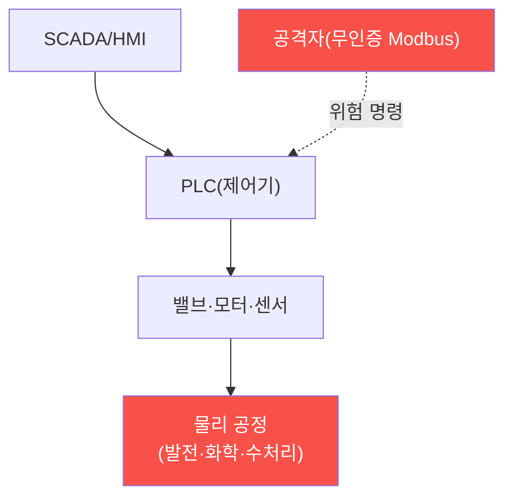

# iot-security W12 — OT/SCADA 기초: 산업 제어 보안·안전 최우선·레거시·에어갭

> **본 주차의 한 줄 요약**
>
> **OT(운영 기술)/SCADA**는 발전소·공장·수처리·인프라를 제어하는 **산업 제어 시스템**이다. IoT의 특수하고 가장
> 위험한 영역 — 여기가 뚫리면 **물리 세계에 재앙**(정전·폭발·오염)이 온다(Stuxnet이 원심분리기를 파괴한 게 대표
> 사례). OT는 IT와 **우선순위가 반대**다: IT는 기밀성(CIA) 우선이지만, OT는 **안전(Safety)과 가용성 우선** —
> 공정이 멈추거나 오작동하면 안 된다. 그래서 보안이 더 까다롭다: ① **레거시 프로토콜**(Modbus·DNP3 등)은 수십
> 년 전 설계라 **인증·암호화가 아예 없다** — 네트워크에 붙으면 누구나 명령(밸브 열기·모터 정지), ② **패치
> 불가**(공정을 멈출 수 없어 취약한 구형 시스템이 그대로), ③ **에어갭 신화**(격리됐다 믿지만 실제론 연결점 존재),
> ④ **안전과 보안의 긴장**(보안 조치가 공정을 방해하면 안 됨). 공격은 OT 프로토콜의 무인증을 악용해 **위험 명령**을
> 보내거나 센서 값을 조작(Stuxnet식)한다. 방어: **네트워크 분리(Purdue 모델)** — IT/OT를 계층 분리, **읽기 전용
> 모니터링**(OT에 쓰기 최소화), **명령 화이트리스트·이상 탐지**, **안전 시스템(SIS) 독립**, **일방향 게이트웨이**.
> OT 보안은 안전을 지키면서 보안을 더하는 특수 분야다.
>
> **한 줄 결론**: OT/SCADA는 안전·가용성 우선이라 레거시 무인증 프로토콜·패치 불가가 위험하다. 방어 = **네트워크
> 분리(Purdue) + 읽기 전용 모니터링 + 명령 화이트리스트·이상 탐지 + 독립 안전 시스템**.

---

## 학습 목표

본 주차 종료 시 학생은 다음 5가지를 **본인 손으로** 할 수 있어야 한다.

1. OT/SCADA가 IT와 **어떻게 다른지**(안전 우선) 설명한다.
2. **레거시 프로토콜**(Modbus 등)의 무인증 취약성을 평가한다(OT_PROTOCOL_WEAK).
3. **위험 명령**(안전 관련 레지스터 쓰기)을 탐지한다(UNSAFE_COMMAND).
4. **네트워크 분리·읽기 전용**으로 강화한다(OT_ISOLATED).
5. Stuxnet식 공격과 안전-보안 긴장을 설명한다.

> **이 주차의 시선** — 물리 세계를 제어하는 OT의 특수 위험을, 분리와 안전 우선으로 막는다.

---

## 0. 용어 해설 (OT/SCADA)

| 용어 | 영문 | 뜻 | 비유 |
|------|------|----|------|
| **OT** | Operational Technology | 산업 제어 기술 | 공장 제어 |
| **SCADA** | — | 감시 제어 시스템 | 관제 시스템 |
| **PLC** | Programmable Logic Controller | 제어기 | 공정 두뇌 |
| **Modbus** | — | 무인증 산업 프로토콜 | 낡은 명령선 |
| **Purdue 모델** | Purdue Model | IT/OT 계층 분리 | 구역 나누기 |

> **헷갈리기 쉬운 한 쌍** — *IT 우선순위* 는 "기밀성(데이터 보호)", *OT 우선순위* 는 "안전·가용성(공정 안전)"
> 이다. OT는 멈추면 안 되고 오작동하면 재앙.

---

## 0.5 신입생 친화 핵심 개념

### 0.5.1 OT는 물리 세계를 제어한다

OT 명령은 **물리 장비**(밸브·모터)를 움직인다. 뚫리면 데이터가 아니라 **물리 세계**가 위험 — 정전·폭발·오염.
그래서 안전이 최우선.

### 0.5.2 왜 특히 취약한가

- **레거시 프로토콜**: Modbus·DNP3는 수십 년 전 설계라 **인증·암호화 없음**. 네트워크에 붙으면 누구나 명령.
- **패치 불가**: 공정을 24/7 돌려야 해 **멈출 수 없어** 취약한 구형 시스템 유지.
- **에어갭 신화**: "격리됐다"믿지만 유지보수 노트북·USB(Stuxnet)·연결점으로 뚫린다.
- **안전-보안 긴장**: 보안 조치가 공정을 방해하면 안 됨(가용성 우선).

### 0.5.3 Stuxnet — OT 공격의 경종

Stuxnet은 에어갭된 원심분리기를 **USB로 침투**해, PLC를 조작해 원심분리기를 **물리적으로 파괴**하면서 HMI에는
정상으로 위장했다. 교훈: (1) 에어갭도 뚫린다, (2) OT 공격은 물리 파괴, (3) 센서 값 조작으로 은폐. OT 방어는
물리 안전을 지켜야 한다.

### 0.5.4 방어 — 분리와 안전 우선

- **네트워크 분리(Purdue 모델)**: IT/OT를 계층(0~5)으로 분리, 사이에 방화벽·DMZ. IT 침해가 OT로 못 가게.
- **읽기 전용 모니터링**: OT에 쓰기를 최소화, 모니터링은 읽기만(일방향 게이트웨이/데이터 다이오드).
- **명령 화이트리스트·이상 탐지**: 허용된 명령만, 비정상 명령(안전 레지스터 쓰기) 탐지.
- **독립 안전 시스템(SIS)**: 제어 시스템과 **분리된 안전 시스템**이 위험 시 물리적으로 차단(보안 뚫려도 안전).
안전을 최우선으로 지키며 보안을 더한다.

### 0.5.5 el34 맥락

OT/SCADA는 실물 산업 장비가 필요하다. 본 실습은 **Modbus 무인증 취약성·위험 명령 탐지·분리 방어 로직**을
결정론 시뮬로 익힌다. 실제 OT 보안은 물리 안전을 절대 우선하며, 테스트도 극도로 신중해야 함을 명시한다.

---

## 1. 실습 안내 (5 미션)

실행 위치 el34 **호스트**(`ssh ccc@{{TARGET_IP}}`), GPU `http://211.170.162.139:10934`.
⚠️ OT는 실물 산업 장비 필요·안전 최우선 → 본 실습은 프로토콜·명령·분리 로직 결정론 시뮬.

### STEP 1 — GPU 헬스체크 → GEN_OK
### STEP 2 — 레거시 프로토콜 취약성 → OT_PROTOCOL_WEAK
### STEP 3 — 위험 명령 탐지 → UNSAFE_COMMAND
### STEP 4 — OT 분리 강화 → OT_ISOLATED
### STEP 5 — 종합 → Assessment

---

## 2. 흔한 오해·관제자 노트

- **"에어갭이니 안전"** — Stuxnet처럼 USB·연결점으로 뚫린다. 분리+모니터링.
- **"IT 보안 그대로 적용"** — OT는 안전 우선. 패치·재부팅이 공정 위험.
- **"Modbus에 인증 추가하면 됨"** — 레거시라 어렵다. 네트워크 분리·게이트웨이로 감싼다.
- **관제 관점** — IT/OT가 Purdue 모델로 분리됐는지, OT 쓰기가 최소·모니터링되는지, 위험 명령 탐지·독립 안전
  시스템이 있는지 점검한다. OT 보안은 물리 안전을 절대 우선.

---

## 3. 다음 주차 (W13) 예고 — 자동차 보안

W12가 "산업 제어(OT)"였다면, W13은 **자동차 보안** — CAN 버스·ECU로 이뤄진 차량 시스템의 보안(무인증 CAN·원격
공격·안전)과 방어를 다룬다. 차량도 물리 안전이 걸린 특수 IoT다.
