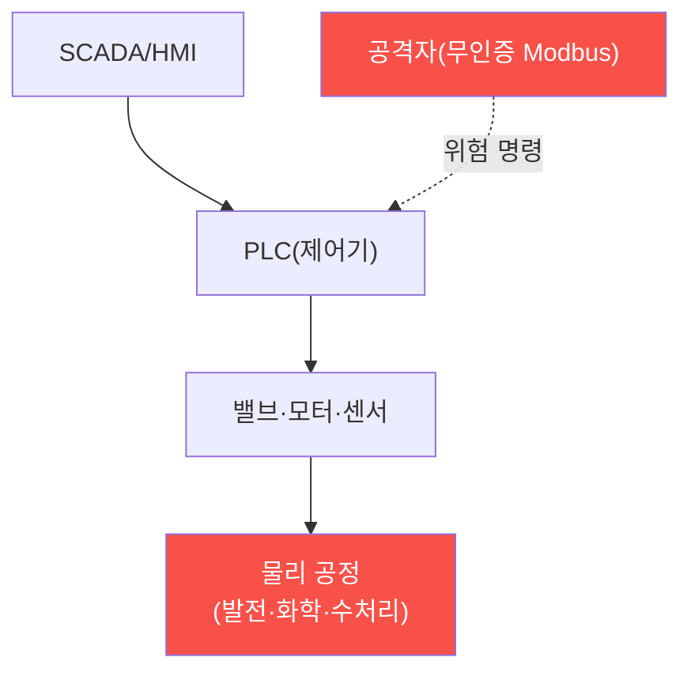

# iot-security W12 — OT/SCADA 기초: 산업 제어 보안·안전 최우선·레거시·에어갭

> **본 주차의 한 줄 요약**
>
> **OT(운영 기술)/SCADA**는 발전소·공장·수처리·인프라를 제어하는 **산업 제어 시스템**이다. IoT의 특수하고 가장 위험한
> 영역 — 여기가 뚫리면 물리 세계에 재앙(정전·폭발·오염)이 온다(Stuxnet이 원심분리기를 파괴한 게 대표 사례). OT는 IT와
> **우선순위가 반대**다: IT는 기밀성(CIA) 우선이지만, OT는 **안전(Safety)과 가용성 우선** — 공정이 멈추거나 오작동하면
> 안 된다. 그래서 보안이 더 까다롭다: ① **레거시 프로토콜**(Modbus·DNP3 등)은 수십 년 전 설계라 인증·암호화가 아예
> 없다 — 네트워크에 붙으면 누구나 명령(밸브 열기·모터 정지), ② **패치 불가**(공정을 멈출 수 없어 취약한 구형 시스템이
> 그대로), ③ **에어갭 신화**(격리됐다 믿지만 실제론 연결점 존재), ④ **안전과 보안의 긴장**(보안 조치가 공정을 방해하면
> 안 됨). 실습에서는 레거시 프로토콜의 무인증 취약성을 평가하고(마커 `OT_PROTOCOL_WEAK`), 위험 명령(안전 관련 레지스터
> 쓰기)을 탐지하며(마커 `UNSAFE_COMMAND`), 네트워크 분리·읽기 전용으로 강화한다(마커 `OT_ISOLATED`). 방어는
> **네트워크 분리(Purdue 모델)·읽기 전용 모니터링·명령 화이트리스트·이상 탐지·독립 안전 시스템(SIS)·일방향 게이트웨이**다.

---

## 학습 목표

본 주차 종료 시 학생은 다음 5가지를 **본인 손으로** 할 수 있어야 한다.

1. OT/SCADA가 IT와 어떻게 다른지(안전·가용성 우선) 설명한다.
2. **레거시 프로토콜**(Modbus 등)의 무인증 취약성을 평가한다(마커 `OT_PROTOCOL_WEAK`).
3. **위험 명령**(안전 관련 레지스터 쓰기)을 탐지한다(마커 `UNSAFE_COMMAND`).
4. **네트워크 분리·읽기 전용**으로 강화한다(마커 `OT_ISOLATED`).
5. Stuxnet식 공격과 안전-보안 긴장을 종합한다(마커 `Assessment`).

> **이 주차의 시선** — 물리 세계를 제어하는 OT의 특수 위험을 분리와 안전 우선으로 막는다. "에어갭도 뚫린다"와 "멈추면
> 안 된다"의 긴장이 핵심이다.

---

## 0. 용어 해설 (OT/SCADA)

| 용어 | 영문 | 뜻 | 비유 |
|------|------|----|------|
| **OT** | Operational Technology | 물리 공정을 제어하는 산업 기술 | 공장 제어 |
| **SCADA** | Supervisory Control And Data Acquisition | 공정 감시·제어 시스템 | 관제 시스템 |
| **PLC** | Programmable Logic Controller | 밸브·모터를 제어하는 제어기 | 공정 두뇌 |
| **Modbus** | — | 인증·암호가 없는 레거시 산업 프로토콜 | 낡은 명령선 |
| **Purdue 모델** | Purdue Model | IT/OT를 계층(0~5)으로 분리 | 구역 나누기 |
| **일방향 게이트웨이** | Data Diode | 한 방향으로만 데이터 흐름 | 역류 방지 밸브 |
| **SIS** | Safety Instrumented System | 제어와 분리된 독립 안전 차단 | 비상 차단 |

> **헷갈리기 쉬운 한 쌍 — IT 우선순위 vs OT 우선순위.** *IT*는 기밀성(데이터 보호)이 우선, *OT*는 안전·가용성(공정
> 안전)이 우선이다. OT는 멈추면 안 되고 오작동하면 재앙이라, IT식 패치·재부팅이 오히려 위험할 수 있다.

---

## 0.5 신입생 친화 핵심 개념

### 0.5.1 OT는 물리 세계를 제어한다

OT 명령은 물리 장비(밸브·모터)를 움직인다. 뚫리면 데이터가 아니라 물리 세계가 위험 — 정전·폭발·오염. 그래서 안전이
최우선이다.

### 0.5.2 왜 특히 취약한가

- **레거시 프로토콜**: Modbus·DNP3는 수십 년 전 설계라 인증·암호화가 없다. 네트워크에 붙으면 누구나 명령.
- **패치 불가**: 공정을 24/7 돌려야 해 멈출 수 없어 취약한 구형 시스템을 유지한다.
- **에어갭 신화**: "격리됐다" 믿지만 유지보수 노트북·USB(Stuxnet)·연결점으로 뚫린다.
- **안전-보안 긴장**: 보안 조치가 공정을 방해하면 안 된다(가용성 우선).

### 0.5.3 Stuxnet — OT 공격의 경종

Stuxnet은 에어갭된 원심분리기를 USB로 침투해, PLC를 조작해 원심분리기를 물리적으로 파괴하면서 HMI에는 정상으로
위장했다. 교훈: (1) 에어갭도 뚫린다, (2) OT 공격은 물리 파괴, (3) 센서 값 조작으로 은폐. OT 방어는 물리 안전을 지켜야
한다.

### 0.5.4 방어 — 분리와 안전 우선

- **네트워크 분리(Purdue 모델)**: IT/OT를 계층(0~5)으로 분리, 사이에 방화벽·DMZ. IT 침해가 OT로 못 가게.
- **읽기 전용 모니터링**: OT에 쓰기를 최소화, 모니터링은 읽기만(일방향 게이트웨이/데이터 다이오드).
- **명령 화이트리스트·이상 탐지**: 허용된 명령만, 비정상 명령(안전 레지스터 쓰기) 탐지.
- **독립 안전 시스템(SIS)**: 제어 시스템과 분리된 안전 시스템이 위험 시 물리적으로 차단(보안 뚫려도 안전).

안전을 최우선으로 지키며 보안을 더한다.

### 0.5.5 el34 맥락

OT/SCADA는 실물 산업 장비가 필요하다. 이번 실습은 **Modbus 무인증 취약성·위험 명령 탐지·분리 방어 로직**을 결정론
실제 아티팩트 분석으로 익힌다. 실제 OT 보안은 물리 안전을 절대 우선하며, 테스트도 극도로 신중해야 함을 명시한다.

---

## 1. OT/SCADA 상세 — 취약성·위험 명령·분리

### 1.1 레거시 프로토콜 취약성 (OT_PROTOCOL_WEAK)

- **한 줄 정의**: Modbus/DNP3의 무인증·무암호 상태를 평가한다.
- **왜 중요한가**: 무인증 프로토콜이 물리 파괴 명령의 입구다.
- **el34 맥락에서 어떻게**: Modbus 무인증·위험 명령 수용을 점검하면 `OT_PROTOCOL_WEAK`.
- **한계/주의**: 레거시라 프로토콜 자체 보안이 어려워 분리로 감싼다.

### 1.2 위험 명령 탐지 (UNSAFE_COMMAND)

- **한 줄 정의**: 안전 관련 레지스터 쓰기·비정상 명령을 탐지한다.
- **핵심**: 밸브 개방·인터록 해제 같은 위험 명령 화이트리스트 위반.
- **판정**: 위험 명령이 탐지되면 `UNSAFE_COMMAND`.

### 1.3 OT 분리 강화 (OT_ISOLATED)

- **한 줄 정의**: Purdue 분리·읽기 전용·SIS를 적용한다.
- **핵심**: IT/OT 계층 분리 + 일방향 모니터링 + 독립 안전 시스템.
- **판정**: 분리·안전 방어가 적용되면 `OT_ISOLATED`.

---

## 2. 실습 안내 (총 5 미션)

실행 위치는 el34 **호스트**(`ssh ccc@{{TARGET_IP}}`, 비밀번호 `1`), 참고 GPU는 Ollama
(`http://211.170.162.139:10934`, gemma3:4b)다. ⚠️ OT는 실물 산업 장비가 필요·안전 최우선이라 프로토콜·명령·분리 로직을
el34에서 실제 아티팩트(설정·캡처·로그)를 만들어 strings·grep·awk 로 분석한다. 각 미션의 마지막 줄 마커가 채점 기준이다.

### 미션 1 — GPU 헬스체크 → `GEN_OK`

> **왜 하는가?** 분석·종합에 쓸 LLM 도달·응답 확인.
> **무엇을 아는가?** Ollama 응답 형식·도달성.
> **결과 해석** — 정상 `GEN_OK` / 비정상 `GEN_EMPTY`·연결 오류.
> **실전 활용** — 종합 소견 작성에 사용.

### 미션 2 — 레거시 프로토콜 취약성 → `OT_PROTOCOL_WEAK`

> **왜 하는가?** 물리 파괴 명령의 입구를 평가한다.
> **무엇을 아는가?** Modbus 무인증·위험 명령 수용.
> **결과 해석** — 정상: 취약 판정 + `OT_PROTOCOL_WEAK`.
> **실전 활용** — OT 프로토콜 진단.

### 미션 3 — 위험 명령 탐지 → `UNSAFE_COMMAND`

> **왜 하는가?** 안전을 위협하는 명령을 걸러낸다.
> **무엇을 아는가?** 안전 레지스터 쓰기·화이트리스트 위반.
> **결과 해석** — 정상: 탐지 + `UNSAFE_COMMAND`.
> **실전 활용** — OT 명령 이상 탐지.

### 미션 4 — OT 분리 강화 → `OT_ISOLATED`

> **왜 하는가?** 분리·읽기 전용·SIS로 물리 안전을 지킨다.
> **무엇을 아는가?** Purdue·일방향·독립 안전 시스템.
> **결과 해석** — 정상: 분리 + `OT_ISOLATED`.
> **실전 활용** — OT 방어 아키텍처.

### 미션 5 — 종합 소견 → `Assessment`

> **왜 하는가?** 취약성·위험 명령·분리와 "안전 최우선·에어갭 신화"를 소견으로 묶는다.
> **무엇을 아는가?** GPU에 요약시키되 첫 줄을 `Assessment`로 강제.
> **결과 해석** — 정상: `Assessment` 포함. 없으면 `[형식 미준수 — 재실행]`.
> **실전 활용** — OT/SCADA 보안 개요.

---

## 3. 흔한 오해·관제자 노트

- **"에어갭이니 안전하다."** — Stuxnet처럼 USB·연결점으로 뚫린다. 분리 + 모니터링이 필요.
- **"IT 보안을 그대로 적용한다."** — OT는 안전 우선이다. 패치·재부팅이 공정을 위험하게 할 수 있다.
- **"Modbus에 인증을 추가하면 된다."** — 레거시라 어렵다. 네트워크 분리·게이트웨이로 감싼다.
- **"HMI가 정상이면 괜찮다."** — Stuxnet은 HMI를 위장했다. 이상 탐지·다중 확인이 필요.
- **관제(Blue) 관점** — (1) IT/OT가 Purdue로 분리됐는가, (2) OT 쓰기가 최소·모니터링되는가, (3) 위험 명령 탐지·독립
  안전 시스템이 있는가를 점검한다. OT 보안은 물리 안전을 절대 우선한다.

---

## 4. 다음 주차 (W13) 예고 — 자동차 보안

W12가 "산업 제어(OT)"였다면, W13은 **자동차 보안**을 다룬다. CAN 버스·ECU로 이뤄진 차량 시스템의 보안(무인증 CAN·원격
공격·안전)과 방어를 익힌다. 차량도 물리 안전이 걸린 특수 IoT다.
