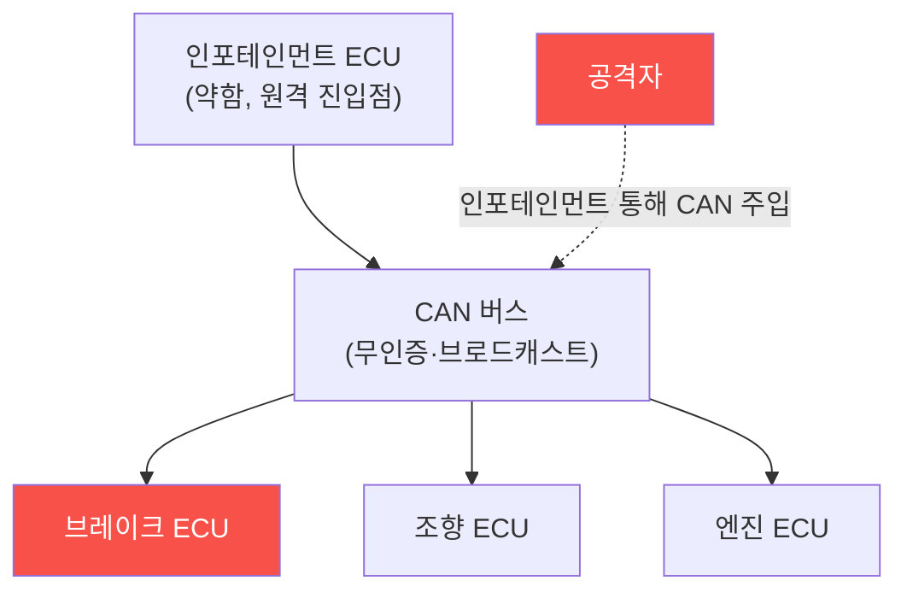

# iot-security W13 — 자동차 보안: CAN 버스·ECU·원격 공격·안전

> **본 주차의 한 줄 요약**
>
> 현대 자동차는 **바퀴 달린 컴퓨터** — 수십~수백 개의 **ECU(전자제어장치)**가 **CAN 버스**로 연결돼 엔진·브레이크·
> 조향·인포테인먼트를 제어한다. OT처럼 **물리 안전**이 걸린 특수 IoT다. 핵심 취약점: ① **CAN 버스 무인증·브로드캐스트** —
> CAN은 1980년대 설계라 인증·암호화가 없고, 모든 ECU가 모든 메시지를 본다. 하나의 ECU(약한 인포테인먼트)에 접근하면
> CAN에 임의 메시지를 주입해 다른 ECU(브레이크·조향)를 속일 수 있다, ② **원격 진입점** — 텔레매틱스·블루투스·WiFi·
> 셀룰러·앱으로 원격에서 차량에 접근(2015년 Jeep 해킹이 셀룰러로 원격 조향·브레이크 장악을 시연), ③ **OBD-II 포트**로
> 물리 접근, ④ **키리스 엔트리 RF 공격**(RF 리플레이·릴레이). 공격자는 원격/물리로 진입해 CAN에 메시지를 주입, 주행
> 중 브레이크·조향을 조작할 수 있다 — 생명이 걸린 위협이다. 실습에서는 CAN 무인증을 평가하고(마커 `CAN_INSECURE`),
> CAN 메시지 주입을 탐지하며(마커 `CAN_INJECTION`), 도메인 분리·메시지 인증으로 강화한다(마커 `VEHICLE_HARDENED`).
> 방어는 **CAN 게이트웨이·도메인 분리·메시지 인증(SecOC)·차량 IDS·원격 진입점 강화·안전 필수 기능의 물리 방어**다.

---

## 학습 목표

본 주차 종료 시 학생은 다음 5가지를 **본인 손으로** 할 수 있어야 한다.

1. 자동차의 CAN 버스·ECU 구조와 위협을 설명한다.
2. **CAN 무인증** 취약성을 평가한다(마커 `CAN_INSECURE`).
3. **CAN 메시지 주입**을 탐지한다(마커 `CAN_INJECTION`).
4. **도메인 분리·메시지 인증**으로 강화한다(마커 `VEHICLE_HARDENED`).
5. 원격 공격(Jeep)과 안전 위협을 종합한다(마커 `Assessment`).

> **이 주차의 시선** — 생명이 걸린 차량 CAN의 무인증 위험을 도메인 분리와 인증으로 막는다. "한 ECU가 전체를 연다"가
> 핵심이다.

---

## 0. 용어 해설 (자동차 보안)

| 용어 | 영문 | 뜻 | 비유 |
|------|------|----|------|
| **ECU** | Electronic Control Unit | 엔진·브레이크 등을 제어하는 유닛 | 부품 두뇌 |
| **CAN** | Controller Area Network | ECU를 잇는 무인증·브로드캐스트 내부망 | 공용 신경망 |
| **OBD-II** | On-Board Diagnostics | 진단 포트(물리 접근구) | 물리 접근구 |
| **텔레매틱스** | Telematics | 셀룰러 등 원격 통신 모듈 | 원격 진입 |
| **게이트웨이** | Gateway | 도메인 간 메시지를 필터링하는 관문 | 방화문 |
| **SecOC** | Secure Onboard Communication | CAN 메시지 인증(MAC) 표준 | 서명된 명령 |
| **차량 IDS** | Vehicle IDS | 비정상 CAN 메시지 탐지 | 차내 경비 |

> **헷갈리기 쉬운 한 쌍 — CAN 무인증 vs 메시지 인증(SecOC).** *CAN 무인증*은 모든 ECU가 모든 메시지를 신뢰하는
> 것(위험), *SecOC*는 인증 코드가 붙은 서명된 메시지만 신뢰하는 것(안전)이다. 무인증이 근본 문제이고 인증이 근본
> 방어다.

---

## 0.5 신입생 친화 핵심 개념

### 0.5.1 CAN 버스 — 공용 신경망

CAN은 모든 ECU가 공유하는 신경망이다. **무인증·브로드캐스트**라, 약한 ECU(인포테인먼트) 하나 뚫으면 CAN에 메시지를
주입해 브레이크·조향까지 속인다.

### 0.5.2 원격 진입점 — Jeep 해킹

2015년 연구자들이 셀룰러(텔레매틱스)로 Jeep에 원격 침투해, CAN을 통해 주행 중 조향·브레이크·엔진을 장악했다(리콜
초래). 교훈: 인포테인먼트·텔레매틱스가 안전 도메인과 연결되면, 원격 공격이 생명을 위협한다. 진입점(셀룰러·BT·WiFi·앱)을
강화하고 안전 도메인과 분리해야 한다.

### 0.5.3 CAN 메시지 주입

CAN은 메시지에 발신자 인증이 없다. 공격자가 CAN에 접근하면(인포테인먼트·OBD-II) 정당한 ECU인 척 메시지를 주입한다:
"브레이크 해제"·"조향 좌회전"·"속도 표시 조작". 수신 ECU는 발신자를 확인 못 해 따른다. 무인증이 근본 문제다.

### 0.5.4 방어 — 분리와 인증

- **도메인 분리·게이트웨이**: 인포테인먼트(외부 연결)와 안전 도메인(브레이크·조향)을 게이트웨이로 분리. 게이트웨이가
  도메인 간 메시지를 필터링 — 인포테인먼트가 브레이크 명령 못 보내게.
- **메시지 인증(SecOC)**: CAN 메시지에 MAC(인증 코드) 추가 → 위조 메시지 거부.
- **차량 IDS**: 비정상 CAN 메시지(비정상 빈도·발신자·값) 탐지.
- **원격 진입점 강화**: 텔레매틱스·앱 인증·암호화, 키리스 RF 방어.

안전 필수 기능은 물리·독립 방어까지 둔다.

### 0.5.5 el34 맥락

자동차 CAN은 실물 차량·CAN 하드웨어가 필요하다. 이번 실습은 **CAN 무인증·메시지 주입·도메인 분리 로직**을 결정론
실제 아티팩트 분석으로 익힌다. 실제 차량 테스트는 안전상 극도로 신중해야 함을 명시한다.

---

## 1. 자동차 보안 상세 — 취약성·주입·강화

### 1.1 CAN 무인증 취약성 (CAN_INSECURE)

- **한 줄 정의**: CAN의 무인증·브로드캐스트로 메시지 위조가 가능한지 평가한다.
- **왜 중요한가**: 한 ECU만 뚫려도 안전 ECU까지 위협받는다.
- **el34 맥락에서 어떻게**: CAN 무인증·도메인 미분리를 점검하면 `CAN_INSECURE`.
- **한계/주의**: CAN은 레거시라 SecOC 도입이 점진적이다.

### 1.2 CAN 메시지 주입 (CAN_INJECTION)

- **한 줄 정의**: 정당 ECU를 사칭한 위조 CAN 메시지를 탐지한다.
- **핵심**: 비정상 빈도·발신자·값, 안전 명령 위조.
- **판정**: 주입이 탐지/재현되면 `CAN_INJECTION`.

### 1.3 차량 강화 (VEHICLE_HARDENED)

- **한 줄 정의**: 도메인 분리·SecOC·IDS·진입점 강화를 적용한다.
- **핵심**: 게이트웨이 분리 + 메시지 인증 + IDS + 원격 진입점 강화.
- **판정**: 강화가 적용되면 `VEHICLE_HARDENED`.

---

## 2. 실습 안내 (총 5 미션)

실행 위치는 el34 **호스트**(`ssh ccc@{{TARGET_IP}}`, 비밀번호 `1`), 참고 GPU는 Ollama
(`http://211.170.162.139:10934`, gemma3:4b)다. ⚠️ 자동차 CAN은 실물 차량·하드웨어가 필요·안전 최우선이라 CAN·주입·분리
로직을 el34에서 실제 아티팩트(설정·캡처·로그)를 만들어 strings·grep·awk 로 분석한다. 각 미션의 마지막 줄 마커가 채점 기준이다.

### 미션 1 — GPU 헬스체크 → `GEN_OK`

> **왜 하는가?** 분석·종합에 쓸 LLM 도달·응답 확인.
> **무엇을 아는가?** Ollama 응답 형식·도달성.
> **결과 해석** — 정상 `GEN_OK` / 비정상 `GEN_EMPTY`·연결 오류.
> **실전 활용** — 종합 소견 작성에 사용.

### 미션 2 — CAN 무인증 취약성 → `CAN_INSECURE`

> **왜 하는가?** 한 ECU가 전체를 여는 근본 취약을 평가한다.
> **무엇을 아는가?** CAN 무인증·도메인 미분리.
> **결과 해석** — 정상: 취약 판정 + `CAN_INSECURE`.
> **실전 활용** — 차량 통신 진단.

### 미션 3 — CAN 메시지 주입 → `CAN_INJECTION`

> **왜 하는가?** 주행 중 안전 명령 위조 위협을 확인한다.
> **무엇을 아는가?** 사칭 메시지·비정상 신호.
> **결과 해석** — 정상: 탐지 + `CAN_INJECTION`.
> **실전 활용** — 차량 IDS 설계.

### 미션 4 — 차량 강화 → `VEHICLE_HARDENED`

> **왜 하는가?** 분리·인증으로 생명 위협을 막는다.
> **무엇을 아는가?** 게이트웨이·SecOC·IDS·진입점 강화.
> **결과 해석** — 정상: 강화 + `VEHICLE_HARDENED`.
> **실전 활용** — 차량 보안 아키텍처.

### 미션 5 — 종합 소견 → `Assessment`

> **왜 하는가?** 취약성·주입·강화와 "원격 공격이 생명 위협"을 소견으로 묶는다.
> **무엇을 아는가?** GPU에 요약시키되 첫 줄을 `Assessment`로 강제.
> **결과 해석** — 정상: `Assessment` 포함. 없으면 `[형식 미준수 — 재실행]`.
> **실전 활용** — 자동차 보안 개요.

---

## 3. 흔한 오해·관제자 노트

- **"차는 인터넷과 무관하다."** — 텔레매틱스·앱으로 원격 연결된다. Jeep 해킹이 증명했다.
- **"인포테인먼트는 안전과 분리돼 있다."** — 게이트웨이가 없으면 CAN으로 이어진다. 도메인 분리가 필수.
- **"CAN은 내부라 안전하다."** — 무인증이라 한 ECU만 뚫려도 전체다. 메시지 인증이 필요하다.
- **"OBD-II는 정비용이다."** — 물리 접근 시 CAN 주입 통로가 된다. 접근 통제가 필요.
- **관제(Blue) 관점** — 차량이 (1) 인포테인먼트/안전 도메인 게이트웨이 분리, (2) CAN 메시지 인증(SecOC), (3) 차량 IDS,
  (4) 원격 진입점 강화를 갖췄는지 점검한다. 자동차 보안은 안전 최우선이다.

---

## 4. 다음 주차 (W14) 예고 — IoT 보안 가이드라인

W13이 "자동차 보안"이었다면, W14는 **IoT 보안 가이드라인**을 다룬다. OWASP IoT Top 10·NIST·ETSI 등 표준과 보안 설계
원칙(Security by Design)을 종합해 IoT 보안 평가·구축의 체계를 익힌다.
