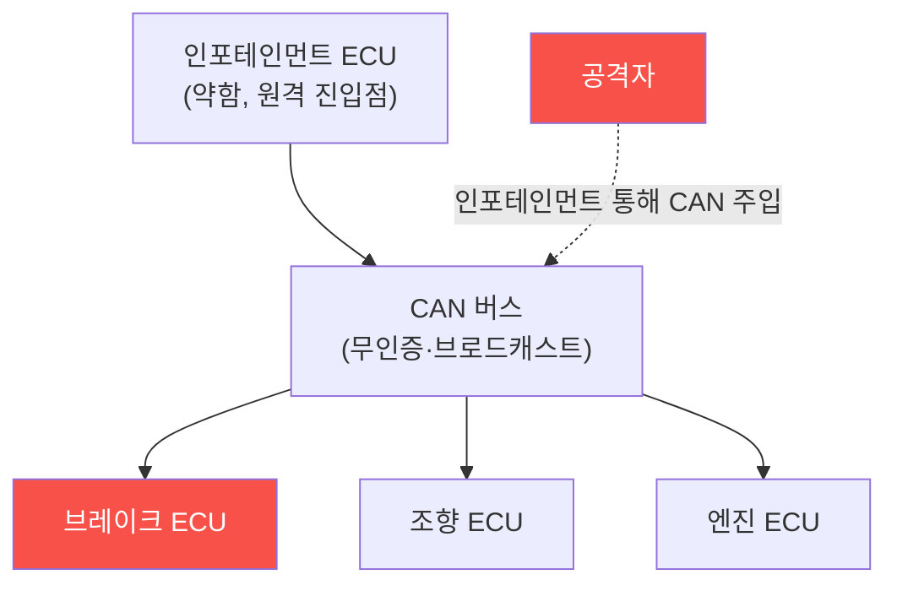

# iot-security W13 — 자동차 보안: CAN 버스·ECU·원격 공격·안전

> **본 주차의 한 줄 요약**
>
> 현대 자동차는 **바퀴 달린 컴퓨터** — 수십~수백 개의 **ECU(전자제어장치)** 가 **CAN 버스**로 연결돼 엔진·
> 브레이크·조향·인포테인먼트를 제어한다. OT처럼 **물리 안전**이 걸린 특수 IoT다. 핵심 취약점: ① **CAN 버스
> 무인증·브로드캐스트** — CAN은 1980년대 설계라 **인증·암호화가 없고**, 모든 ECU가 모든 메시지를 본다. 하나의
> ECU(약한 인포테인먼트)에 접근하면 **CAN에 임의 메시지를 주입**해 다른 ECU(브레이크·조향)를 속일 수 있다,
> ② **원격 진입점** — 텔레매틱스·블루투스·WiFi·셀룰러·앱으로 **원격에서** 차량에 접근(2015년 Jeep 해킹이 셀룰러로
> 원격 조향·브레이크 장악을 시연), ③ **OBD-II 포트**(진단 포트)로 물리 접근, ④ **키리스 엔트리** RF 공격
> (W09 RF 리플레이·릴레이). 공격자는 원격/물리로 진입해 CAN에 메시지를 주입, 주행 중 브레이크·조향을 조작할 수
> 있다 — 생명이 걸린 위협이다. 방어: **CAN 게이트웨이·도메인 분리**(인포테인먼트와 안전 도메인 분리),
> **메시지 인증(CAN-FD·SecOC)**, **차량 IDS**(비정상 CAN 메시지 탐지), **원격 진입점 강화**, **안전 필수 기능은
> 물리적 방어**. 자동차 보안은 안전 최우선의 특수 분야다.
>
> **한 줄 결론**: 자동차 CAN 버스는 무인증·브로드캐스트라 한 ECU 뚫리면 브레이크·조향까지 메시지 주입당한다.
> 방어 = **도메인 분리(게이트웨이) + 메시지 인증 + 차량 IDS + 원격 진입점 강화**. 안전이 최우선.

---

## 학습 목표

본 주차 종료 시 학생은 다음 5가지를 **본인 손으로** 할 수 있어야 한다.

1. 자동차의 **CAN 버스·ECU** 구조와 위협을 설명한다.
2. **CAN 무인증** 취약성을 평가한다(CAN_INSECURE).
3. **CAN 메시지 주입**을 탐지한다(CAN_INJECTION).
4. **도메인 분리·메시지 인증**으로 강화한다(VEHICLE_HARDENED).
5. 원격 공격(Jeep)과 안전 위협을 설명한다.

> **이 주차의 시선** — 생명이 걸린 차량 CAN의 무인증 위험을, 도메인 분리와 인증으로 막는다.

---

## 0. 용어 해설 (자동차 보안)

| 용어 | 영문 | 뜻 | 비유 |
|------|------|----|------|
| **ECU** | Electronic Control Unit | 전자제어장치 | 부품 두뇌 |
| **CAN** | Controller Area Network | 차량 내부 네트워크 | 공용 신경망 |
| **OBD-II** | — | 진단 포트 | 물리 접근구 |
| **텔레매틱스** | Telematics | 원격 통신 | 원격 진입 |
| **SecOC** | Secure Onboard Comm | CAN 메시지 인증 | 서명된 명령 |

> **헷갈리기 쉬운 한 쌍** — *CAN 무인증* 은 "모든 ECU가 모든 메시지 신뢰(위험)", *메시지 인증(SecOC)* 은 "서명된
> 메시지만 신뢰(안전)"다.

---

## 0.5 신입생 친화 핵심 개념

### 0.5.1 CAN 버스 — 공용 신경망

CAN은 모든 ECU가 공유하는 신경망이다. **무인증·브로드캐스트**라, 약한 ECU(인포테인먼트) 하나 뚫으면 CAN에
메시지를 주입해 브레이크·조향까지 속인다.

### 0.5.2 원격 진입점 — Jeep 해킹

2015년 연구자들이 **셀룰러(텔레매틱스)** 로 Jeep에 원격 침투해, CAN을 통해 **주행 중 조향·브레이크·엔진**을
장악했다(리콜 초래). 교훈: 인포테인먼트·텔레매틱스가 안전 도메인과 연결되면, 원격 공격이 생명을 위협한다.
진입점(셀룰러·BT·WiFi·앱)을 강화하고 안전 도메인과 분리해야 한다.

### 0.5.3 CAN 메시지 주입

CAN은 메시지에 발신자 인증이 없다. 공격자가 CAN에 접근하면(인포테인먼트·OBD-II) **정당한 ECU인 척** 메시지를
주입한다: "브레이크 해제"·"조향 좌회전"·"속도 표시 조작". 수신 ECU는 발신자를 확인 못 해 따른다. 무인증이 근본
문제.

### 0.5.4 방어 — 분리와 인증

- **도메인 분리·게이트웨이**: 인포테인먼트(외부 연결)와 **안전 도메인**(브레이크·조향)을 **게이트웨이로 분리**.
  게이트웨이가 도메인 간 메시지를 필터링 — 인포테인먼트가 브레이크 명령 못 보내게.
- **메시지 인증(SecOC)**: CAN 메시지에 MAC(인증 코드) 추가 → 위조 메시지 거부.
- **차량 IDS**: 비정상 CAN 메시지(비정상 빈도·발신자·값) 탐지.
- **원격 진입점 강화**: 텔레매틱스·앱 인증·암호화, 키리스 RF 방어(W09).
안전 필수 기능은 물리·독립 방어까지.

### 0.5.5 el34 맥락

자동차 CAN은 실물 차량·CAN 하드웨어가 필요하다. 본 실습은 **CAN 무인증·메시지 주입·도메인 분리 로직**을
결정론 시뮬로 익힌다. 실제 차량 테스트는 안전상 극도로 신중해야 함을 명시한다.

---

## 1. 실습 안내 (5 미션)

실행 위치 el34 **호스트**(`ssh ccc@{{TARGET_IP}}`), GPU `http://211.170.162.139:10934`.
⚠️ 자동차 CAN은 실물 차량·하드웨어 필요·안전 최우선 → 본 실습은 CAN·주입·분리 로직 결정론 시뮬.

### STEP 1 — GPU 헬스체크 → GEN_OK
### STEP 2 — CAN 무인증 취약성 → CAN_INSECURE
### STEP 3 — CAN 메시지 주입 → CAN_INJECTION
### STEP 4 — 차량 강화 → VEHICLE_HARDENED
### STEP 5 — 종합 → Assessment

---

## 2. 흔한 오해·관제자 노트

- **"차는 인터넷과 무관"** — 텔레매틱스·앱으로 원격 연결. Jeep 해킹.
- **"인포테인먼트는 안전과 분리"** — 게이트웨이 없으면 CAN으로 이어짐. 도메인 분리 필수.
- **"CAN은 내부라 안전"** — 무인증이라 한 ECU 뚫리면 전체. 메시지 인증.
- **관제 관점** — 인포테인먼트/안전 도메인이 게이트웨이로 분리됐는지, CAN 메시지 인증(SecOC)·IDS가 있는지,
  원격 진입점이 강화됐는지 점검한다. 자동차 보안은 안전 최우선.

---

## 3. 다음 주차 (W14) 예고 — IoT 보안 가이드라인

W13이 "자동차 보안"이었다면, W14는 **IoT 보안 가이드라인** — OWASP IoT Top 10·NIST·ETSI 등 표준과 보안 설계
원칙(Security by Design)을 종합해 IoT 보안 평가·구축의 체계를 다룬다.
