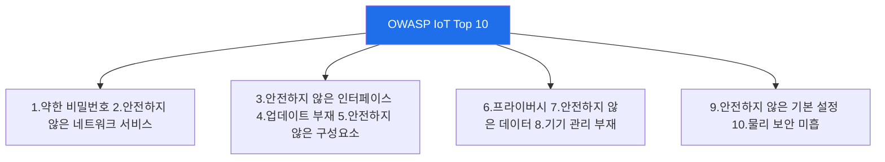

# iot-security W14 — IoT 보안 가이드라인: OWASP IoT Top 10·Security by Design·표준

> **본 주차의 한 줄 요약**
>
> W01~W13의 개별 기법·방어를 **체계적 프레임워크**로 종합한다. IoT 보안은 산발적 점검이 아니라 **표준·가이드라인**
> 에 따라 체계적으로 평가·구축해야 한다. 대표: ① **OWASP IoT Top 10** — IoT의 10대 위험(약한 비밀번호·안전하지
> 않은 네트워크 서비스·안전하지 않은 인터페이스·업데이트 부재·안전하지 않은 구성요소·프라이버시·안전하지 않은
> 데이터 전송/저장·기기 관리 부재·안전하지 않은 기본 설정·물리 보안 미흡)을 체크리스트로, ② **NIST IoT(NISTIR
> 8259)·ETSI EN 303 645** — IoT 기본 보안 요구사항(기본 비밀번호 금지·업데이트 제공·취약점 공개 등), ③ **Security
> by Design** — 보안을 **설계 단계부터** 내장(사후 추가가 아니라). 핵심 원칙: **기본 비밀번호 금지, 안전한
> 업데이트 제공, 최소 공격 표면, 데이터 암호화, 취약점 공개 절차**. 이 프레임워크로 IoT 제품·배치를 평가하면
> **빠진 곳(갭)** 이 체계적으로 드러난다. 규제도 강화되는 추세다(미국·EU·영국의 IoT 보안 법제화). IoT 보안은
> 이제 **선택이 아니라 규정 준수**이며, Security by Design이 근본이다.
>
> **한 줄 결론**: IoT 보안은 OWASP IoT Top 10·NIST·ETSI 같은 표준으로 체계적으로 평가하고, **Security by Design**
> (설계 단계 보안 내장·기본 비밀번호 금지·업데이트·최소 표면·암호화)으로 구축한다. 규정 준수의 시대다.

---

## 학습 목표

본 주차 종료 시 학생은 다음 5가지를 **본인 손으로** 할 수 있어야 한다.

1. **OWASP IoT Top 10**을 설명하고 적용한다(OWASP_ASSESSED).
2. **Security by Design** 원칙을 평가한다(SEC_BY_DESIGN).
3. 표준 대비 **컴플라이언스 갭**을 식별한다(GAPS_IDENTIFIED).
4. NIST·ETSI 등 IoT 표준을 설명한다.
5. 규정 준수와 보안 설계의 필요를 설명한다.

> **이 주차의 시선** — 산발적 점검을 표준 프레임워크로 체계화하고, 설계 단계 보안을 내재화한다.

---

## 0. 용어 해설 (IoT 표준)

| 용어 | 영문 | 뜻 | 비유 |
|------|------|----|------|
| **OWASP IoT Top 10** | — | IoT 10대 위험 | 체크리스트 |
| **Security by Design** | — | 설계 단계 보안 | 설계도 안전 |
| **NIST/ETSI** | — | IoT 보안 표준 | 규격 |
| **기본 보안 요구** | Baseline | 최소 보안 | 최소 기준 |
| **취약점 공개** | Disclosure | 취약점 신고 절차 | 신고 창구 |

> **헷갈리기 쉬운 한 쌍** — *사후 보안* 은 "만든 뒤 추가(비쌈·불완전)", *Security by Design* 은 "설계 단계부터
> 내장(효과적)"이다.

---

## 0.5 신입생 친화 핵심 개념

### 0.5.1 OWASP IoT Top 10 — 체크리스트

10대 위험을 체크리스트로 삼아 IoT 제품·배치를 체계적으로 점검한다. 앞 주차들이 이 항목들을 다뤘다(기본 자격·
프로토콜·인터페이스·펌웨어·물리).

### 0.5.2 Security by Design — 설계부터

보안을 **사후에 붙이면** 비싸고 불완전하다. Security by Design은 **설계 단계부터** 보안을 내장한다: 기본
비밀번호 없이 출고(최초 설정 시 강제 변경), 안전한 업데이트 메커니즘 내장, 최소 기능·포트, 암호화 기본 켜짐.
설계 단계 결정이 전체 수명주기 보안을 좌우한다.

### 0.5.3 IoT 표준·규제

- **NIST IoT(NISTIR 8259)**: 제조사용 IoT 사이버보안 기능 기준.
- **ETSI EN 303 645**: 소비자 IoT 기본 보안(기본 비밀번호 금지·업데이트·취약점 공개 등 13개 요구).
- **규제 강화**: 미국(IoT Cybersecurity Improvement Act)·EU(CRA)·영국 등 IoT 보안 **법제화**. 이제 규정 준수.

### 0.5.4 컴플라이언스 갭 분석

표준 요구사항 대비 제품·배치를 점검해 **빠진 곳(갭)** 을 찾는다: 기본 비밀번호 있음(위반)·업데이트 없음(위반)·
암호화 없음(위반). 갭이 곧 위험이자 규정 위반. 우선순위(위험·규제)로 보강한다. 앞 주차 기법이 각 갭의 평가·
보강 방법이다.

### 0.5.5 el34 맥락

표준 체크는 문서·설정 평가라 el34에서 시뮬·개념 학습한다. 이번 주는 OWASP IoT Top 10 체크·Security by Design
평가·컴플라이언스 갭 분석을 익힌다.

---

## 1. 실습 안내 (5 미션)

실행 위치 el34 **호스트**(`ssh ccc@{{TARGET_IP}}`), GPU `http://211.170.162.139:10934`.

### STEP 1 — GPU 헬스체크 → GEN_OK
### STEP 2 — OWASP IoT Top 10 평가 → OWASP_ASSESSED
### STEP 3 — Security by Design → SEC_BY_DESIGN
### STEP 4 — 컴플라이언스 갭 → GAPS_IDENTIFIED
### STEP 5 — 종합 → Assessment

---

## 2. 흔한 오해·관제자 노트

- **"보안은 나중에 추가"** — 사후 보안은 비싸고 불완전. Security by Design.
- **"체크리스트는 형식"** — OWASP IoT Top 10은 체계적 점검의 기준. 갭이 위험.
- **"규제는 남 일"** — IoT 보안 법제화 진행. 규정 준수 필수.
- **관제 관점** — IoT가 OWASP IoT Top 10·표준을 충족하는지, Security by Design인지, 컴플라이언스 갭이 파악·
  보강됐는지 점검한다. IoT 보안은 체계적 프레임워크로.

---

## 3. 다음 주차 (W15) 예고 — 종합 평가: 전체 IoT 침투 + 보안

W14가 "표준·가이드라인"이었다면, 마지막 W15는 **종합 평가** — 한 IoT 시스템을 전체 침투 테스트하고 표준 기반
방어를 종합하는 캡스톤이다. 과목을 마무리한다.
