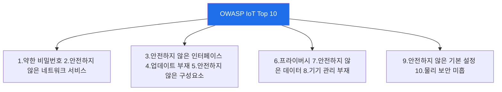

# iot-security W14 — IoT 보안 가이드라인: OWASP IoT Top 10·Security by Design·표준

> **본 주차의 한 줄 요약**
>
> W01~W13의 개별 기법·방어를 **체계적 프레임워크**로 종합한다. IoT 보안은 산발적 점검이 아니라 **표준·가이드라인**에
> 따라 체계적으로 평가·구축해야 한다. 대표: ① **OWASP IoT Top 10** — IoT의 10대 위험(약한 비밀번호·안전하지 않은
> 네트워크 서비스·안전하지 않은 인터페이스·업데이트 부재·안전하지 않은 구성요소·프라이버시·안전하지 않은 데이터
> 전송/저장·기기 관리 부재·안전하지 않은 기본 설정·물리 보안 미흡)을 체크리스트로, ② **NIST IoT(NISTIR 8259)·ETSI
> EN 303 645** — IoT 기본 보안 요구사항(기본 비밀번호 금지·업데이트 제공·취약점 공개 등), ③ **Security by Design** —
> 보안을 **설계 단계부터** 내장(사후 추가가 아니라). 핵심 원칙은 **기본 비밀번호 금지·안전한 업데이트 제공·최소 공격
> 표면·데이터 암호화·취약점 공개 절차**다. 실습에서는 OWASP IoT Top 10을 평가하고(마커 `OWASP_ASSESSED`), Security by
> Design을 평가하며(마커 `SEC_BY_DESIGN`), 표준 대비 컴플라이언스 갭을 식별한다(마커 `GAPS_IDENTIFIED`). 이 프레임워크로
> IoT 제품·배치를 평가하면 빠진 곳(갭)이 체계적으로 드러난다. 규제도 강화되는 추세다 — IoT 보안은 이제 **선택이 아니라
> 규정 준수**이며, Security by Design이 근본이다.

---

## 학습 목표

본 주차 종료 시 학생은 다음 5가지를 **본인 손으로** 할 수 있어야 한다.

1. **OWASP IoT Top 10**을 설명하고 적용한다(마커 `OWASP_ASSESSED`).
2. **Security by Design** 원칙을 평가한다(마커 `SEC_BY_DESIGN`).
3. 표준 대비 **컴플라이언스 갭**을 식별한다(마커 `GAPS_IDENTIFIED`).
4. NIST·ETSI 등 IoT 표준을 설명한다.
5. 규정 준수와 보안 설계의 필요를 종합한다(마커 `Assessment`).

> **이 주차의 시선** — 산발적 점검을 표준 프레임워크로 체계화하고, 설계 단계 보안을 내재화한다. "사후가 아니라 설계
> 부터"가 핵심이다.

---

## 0. 용어 해설 (IoT 표준)

| 용어 | 영문 | 뜻 | 비유 |
|------|------|----|------|
| **OWASP IoT Top 10** | — | IoT 10대 위험 체크리스트 | 진단 체크리스트 |
| **Security by Design** | — | 설계 단계부터 보안을 내장 | 설계도부터 안전 |
| **NISTIR 8259** | — | 제조사용 IoT 사이버보안 기준 | 제조 규격 |
| **ETSI EN 303 645** | — | 소비자 IoT 기본 보안 13개 요구 | 소비자 최소 기준 |
| **베이스라인** | Baseline | 최소 보안 요구사항 | 최소 기준선 |
| **취약점 공개** | Vulnerability Disclosure | 취약점 신고·대응 절차 | 신고 창구 |
| **컴플라이언스 갭** | Compliance Gap | 표준 대비 미충족 항목 | 미달 항목 |

> **헷갈리기 쉬운 한 쌍 — 사후 보안 vs Security by Design.** *사후 보안*은 제품을 만든 뒤 보안을 덧붙이는 것(비싸고
> 불완전), *Security by Design*은 설계 단계부터 보안을 내장하는 것(효과적)이다. 설계 단계 결정이 전체 수명주기 보안을
> 좌우한다.

---

## 0.5 신입생 친화 핵심 개념

### 0.5.1 OWASP IoT Top 10 — 체크리스트

10대 위험을 체크리스트로 삼아 IoT 제품·배치를 체계적으로 점검한다. 앞 주차들이 이 항목들을 다뤘다(기본 자격·프로토콜·
인터페이스·펌웨어·물리).

### 0.5.2 Security by Design — 설계부터

보안을 사후에 붙이면 비싸고 불완전하다. Security by Design은 설계 단계부터 보안을 내장한다: 기본 비밀번호 없이 출고
(최초 설정 시 강제 변경), 안전한 업데이트 메커니즘 내장, 최소 기능·포트, 암호화 기본 켜짐. 설계 단계 결정이 전체
수명주기 보안을 좌우한다.

### 0.5.3 IoT 표준·규제

- **NIST IoT(NISTIR 8259)**: 제조사용 IoT 사이버보안 기능 기준.
- **ETSI EN 303 645**: 소비자 IoT 기본 보안(기본 비밀번호 금지·업데이트·취약점 공개 등 13개 요구).
- **규제 강화**: 미국(IoT Cybersecurity Improvement Act)·EU(CRA)·영국 등 IoT 보안 법제화. 이제 규정 준수다.

### 0.5.4 컴플라이언스 갭 분석

표준 요구사항 대비 제품·배치를 점검해 빠진 곳(갭)을 찾는다: 기본 비밀번호 있음(위반)·업데이트 없음(위반)·암호화
없음(위반). 갭이 곧 위험이자 규정 위반이다. 우선순위(위험·규제)로 보강한다. 앞 주차 기법이 각 갭의 평가·보강 방법이다.

### 0.5.5 el34 맥락

표준 체크는 문서·설정 평가라 el34에서 시뮬·개념 학습한다. 이번 주는 OWASP IoT Top 10 체크·Security by Design 평가·
컴플라이언스 갭 분석을 익힌다.

---

## 1. IoT 가이드라인 상세 — 표준·설계·갭

### 1.1 OWASP IoT Top 10 평가 (OWASP_ASSESSED)

- **한 줄 정의**: 10대 위험 체크리스트로 대상을 점검한다.
- **왜 중요한가**: 산발적 점검의 누락을 체계적으로 막는다.
- **el34 맥락에서 어떻게**: 10개 항목을 대상에 대입해 평가하면 `OWASP_ASSESSED`.
- **한계/주의**: 체크리스트는 최소선 — 맥락별 심층 평가와 병행한다.

### 1.2 Security by Design 평가 (SEC_BY_DESIGN)

- **한 줄 정의**: 설계 단계 보안 내장 여부를 평가한다.
- **핵심**: 기본 비밀번호 금지·업데이트 내장·최소 표면·암호화 기본.
- **판정**: 설계 원칙이 평가되면 `SEC_BY_DESIGN`.

### 1.3 컴플라이언스 갭 (GAPS_IDENTIFIED)

- **한 줄 정의**: 표준 대비 미충족 항목을 식별·우선순위화한다.
- **핵심**: NIST/ETSI 요구 대비 갭, 위험·규제 우선순위.
- **판정**: 갭이 식별·정렬되면 `GAPS_IDENTIFIED`.

---

## 2. 실습 안내 (총 5 미션)

실행 위치는 el34 **호스트**(`ssh ccc@{{TARGET_IP}}`, 비밀번호 `1`), 참고 GPU는 Ollama
(`http://211.170.162.139:10934`, gemma3:4b)다. 표준·설계·갭 분석을 시뮬·개념으로 익힌다. 각 미션의 마지막 줄 마커가
채점 기준이다.

### 미션 1 — GPU 헬스체크 → `GEN_OK`

> **왜 하는가?** 분석·종합에 쓸 LLM 도달·응답 확인.
> **무엇을 아는가?** Ollama 응답 형식·도달성.
> **결과 해석** — 정상 `GEN_OK` / 비정상 `GEN_EMPTY`·연결 오류.
> **실전 활용** — 종합 소견 작성에 사용.

### 미션 2 — OWASP IoT Top 10 평가 → `OWASP_ASSESSED`

> **왜 하는가?** 체계적 체크리스트로 누락을 막는다.
> **무엇을 아는가?** 10대 위험 항목 대입.
> **결과 해석** — 정상: 평가 + `OWASP_ASSESSED`.
> **실전 활용** — IoT 표준 평가.

### 미션 3 — Security by Design → `SEC_BY_DESIGN`

> **왜 하는가?** 설계 단계 보안 내장을 평가한다.
> **무엇을 아는가?** 기본 비밀번호 금지·업데이트·최소 표면·암호화.
> **결과 해석** — 정상: 평가 + `SEC_BY_DESIGN`.
> **실전 활용** — 보안 설계 리뷰.

### 미션 4 — 컴플라이언스 갭 → `GAPS_IDENTIFIED`

> **왜 하는가?** 표준 대비 미달을 찾아 규정 위반·위험을 잡는다.
> **무엇을 아는가?** NIST/ETSI 갭·우선순위.
> **결과 해석** — 정상: 식별 + `GAPS_IDENTIFIED`.
> **실전 활용** — 컴플라이언스 감사.

### 미션 5 — 종합 소견 → `Assessment`

> **왜 하는가?** 표준·설계·갭과 "규정 준수의 시대"를 소견으로 묶는다.
> **무엇을 아는가?** GPU에 요약시키되 첫 줄을 `Assessment`로 강제.
> **결과 해석** — 정상: `Assessment` 포함. 없으면 `[형식 미준수 — 재실행]`.
> **실전 활용** — IoT 보안 프레임워크 개요.

---

## 2.5 과제 (제출물)

- **A. OWASP IoT Top 10 평가 실증 (필수, 40점)** — `OWASP_ASSESSED` 단계를 직접 수행해 실제 명령·출력(또는 아티팩트 분석 결과)을 캡처하고, 무엇을 근거로 판정했는지 서술한다.
- **B. Security by Design 평가 분석 (필수, 30점)** — `SEC_BY_DESIGN` 단계를 직접 수행해 실제 명령·출력(또는 아티팩트 분석 결과)을 캡처하고, 무엇을 근거로 판정했는지 서술한다.
- **C. 컴플라이언스 갭 방어 설계 (필수, 30점)** — `GAPS_IDENTIFIED` 단계를 직접 수행해 실제 명령·출력(또는 아티팩트 분석 결과)을 캡처하고, 무엇을 근거로 판정했는지 서술한다.

## 2.6 평가 기준

| 항목 | 미흡(0) | 보통 | 우수 |
|------|---------|------|------|
| 탐지/실증(OWASP_ASSESSED) | 미수행 | 마커 도출 | 근거·해석·재현까지 |
| 분석(SEC_BY_DESIGN) | 미수행 | 마커 도출 | 근거·해석·재현까지 |
| 방어(GAPS_IDENTIFIED) | 미수행 | 마커 도출 | 근거·해석·재현까지 |

## 2.7 핵심 정리 (1줄씩)

- 이번 주 주제: **IoT 보안 가이드라인: OWASP IoT Top 10·Security by Design·표준**.
- **OWASP IoT Top 10 평가**(`OWASP_ASSESSED`): 10대 위험 체크리스트로 대상을 점검한다.
- **Security by Design 평가**(`SEC_BY_DESIGN`): 설계 단계 보안 내장 여부를 평가한다.
- **컴플라이언스 갭**(`GAPS_IDENTIFIED`): 표준 대비 미충족 항목을 식별·우선순위화한다.
- 공격을 이해한 만큼 **방어의 우선순위**가 분명해진다 — 탐지 근거와 완화를 함께 익힌다.

---

## 3. 흔한 오해·블루팀 노트

- **"보안은 나중에 추가한다."** — 사후 보안은 비싸고 불완전하다. Security by Design이 근본이다.
- **"체크리스트는 형식이다."** — OWASP IoT Top 10은 체계적 점검의 기준이다. 갭이 위험이다.
- **"규제는 남 일이다."** — IoT 보안 법제화가 진행 중이다. 규정 준수가 필수.
- **"표준만 맞추면 안전하다."** — 표준은 최소선이다. 맥락별 심층 평가와 병행한다.
- **관제(Blue) 관점** — IoT가 (1) OWASP IoT Top 10·표준을 충족하는가, (2) Security by Design인가, (3) 컴플라이언스
  갭이 파악·보강됐는가를 점검한다. IoT 보안은 체계적 프레임워크로 한다.

---

## 4. 다음 주차 (W15) 예고 — 종합 평가: 전체 IoT 침투 + 보안

W14가 "표준·가이드라인"이었다면, 마지막 W15는 **종합 평가**다. 한 IoT 시스템을 전체 침투 테스트하고 표준 기반 방어를
종합하는 캡스톤으로 과목을 마무리한다.
