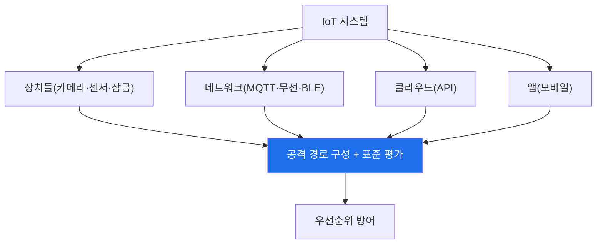

# iot-security W15 — 종합 평가: 전체 IoT 침투 테스트 + 보안 종합

> **본 주차의 한 줄 요약**
>
> 마지막 주는 W01~W14를 하나의 **종합 평가**로 통합한다. 실제 IoT 보안 평가는 한 장치·한 표면이 아니라, **전체
> 시스템**(장치들+네트워크+클라우드+앱+생태계)을 4대 표면과 표준(OWASP IoT Top 10)에 따라 점검하고, 취약점을
> 연결해 **공격 경로**를 구성하며, **표준 기반 방어**를 우선순위로 제안한다. 그리고 이 과목의 결론을 확인하며
> 마친다: **IoT는 가장 넓고 취약한 공격 표면이며(제약된 장치·기본 자격·업데이트 부재), 방어는 4대 표면 종합 +
> Security by Design + 생태계 분리 + 표준 준수다.** 특히 IoT는 **물리 안전이 걸린 영역**(OT·자동차)까지 포함해,
> 데이터가 아니라 **물리 세계**가 위험할 수 있음을 이해해야 한다. 종합 평가의 핵심은 부분 기법을 **전체 시스템
> 평가**로 통합하고, 가장 위험한 경로를 찾아, 표준 기반으로 방어를 설계하는 능력이다. 사이버 방어자도 IoT를
> 이해해야 완전하다 — 이제 IoT는 어디에나 있다.
>
> **한 줄 결론**: IoT 침투 테스트 = **전체 시스템 4대 표면 점검 + 공격 경로 + 표준 기반 우선순위 방어**. 결론 —
> IoT는 가장 넓은 표면이고, 방어는 4대 표면·Security by Design·생태계 분리·표준 준수이며, 물리 안전까지 지킨다.

---

## 학습 목표

본 주차 종료 시 학생은 다음 5가지를 **본인 손으로** 할 수 있어야 한다.

1. 전체 IoT 시스템을 **종합 침투 평가**한다(FULL_IOT_PENTEST).
2. **표준 기반 방어**를 우선순위로 종합한다(DEFENSE_SYNTHESIZED).
3. IoT 보안의 **핵심 원칙**을 종합한다(SYNTHESIS).
4. 물리 안전이 걸린 IoT의 특수성을 설명한다.
5. 사이버 방어자에게 IoT 이해가 왜 필수인지 설명한다.

> **이 주차의 시선** — 배운 모든 것을 전체 시스템 평가·표준 방어로 통합하며 마친다.

---

## 0. 용어 해설 (종합)

| 용어 | 관련 주차 | 평가에서 |
|------|-----------|----------|
| **4대 표면** | W01·W08 | device·network·cloud·app |
| **공격 경로** | W08 | 취약점 연결 |
| **표준** | W14 | OWASP·ETSI |
| **Security by Design** | W14 | 설계 보안 |
| **물리 안전** | W12·W13 | OT·자동차 |

---

## 0.5 종합 — 시스템·경로·표준

### 0.5.1 전체 시스템 평가

한 장치가 아니라 전체 시스템의 4대 표면을 점검하고, 취약점을 연결해 경로를 구성하고, 표준으로 평가한다.

### 0.5.2 IoT 보안의 핵심 원칙

- **넓은 표면**: device·network·cloud·app을 모두(W01·W08).
- **Security by Design**: 설계부터 보안(W14) — 기본 비밀번호 금지·업데이트·최소 표면·암호화.
- **생태계 분리**: 네트워크 분리·최소 신뢰(W10) — 약한 장치 격리.
- **표준 준수**: OWASP IoT Top 10·ETSI(W14) — 체계적·규정 준수.
- **물리 안전**: OT·자동차(W12·W13)는 안전 최우선 — 물리 세계 보호.

### 0.5.3 물리 안전이 걸린 IoT

IoT 보안은 데이터만이 아니다. OT(발전·공장)·자동차는 뚫리면 **물리 재앙**(정전·사고). 이 영역은 **안전을 절대
우선**하며, 보안이 안전을 방해하면 안 된다. 사이버-물리 시스템 보안은 IoT의 가장 위험하고 특수한 부분이다.

### 0.5.4 여러분이 갖춘 것

W01의 IoT 개론부터 W15의 종합까지, 여러분은 IoT의 각 표면(프로토콜·하드웨어·펌웨어·웹·무선·BLE·OT·자동차)과
방어를, **전체 시스템 평가·표준·Security by Design**으로 통합하는 능력을 갖췄다. IoT는 어디에나 있고, 사이버
방어자도 IoT를 알아야 완전하다. 이 과목이 그 역량을 채운다.

---

## 1. 종합 평가 안내 (5 미션)

실행 위치 el34 **호스트**(`ssh ccc@{{TARGET_IP}}`), GPU `http://211.170.162.139:10934`.
⚠️ 물리 IoT는 실물 필요 → 본 실습은 종합 평가·방어·원칙 로직 결정론 시뮬.

### STEP 1 — GPU 헬스체크 → GEN_OK
### STEP 2 — 전체 시스템 종합 평가 → FULL_IOT_PENTEST
### STEP 3 — 표준 기반 방어 종합 → DEFENSE_SYNTHESIZED
### STEP 4 — 핵심 원칙 종합 → SYNTHESIS
### STEP 5 — 최종 종합 → Assessment

---

## 2. 흔한 오해·관제자 노트

- **"한 장치만 평가"** — 전체 시스템 4대 표면. 놓친 곳이 진입점.
- **"IoT는 데이터만 위험"** — OT·자동차는 물리 안전. 사이버-물리.
- **"보안은 사후"** — Security by Design·표준 준수.
- **관제 관점** — IoT 시스템이 4대 표면·표준·Security by Design·생태계 분리·물리 안전을 갖췄는지 종합 평가한다.
  IoT 보안 성숙도의 척도.

---

## 3. 과목을 마치며

IoT는 편리함만큼 **가장 넓고 취약한 공격 표면**이며, 물리 안전까지 걸린 특수 영역이다. 여러분은 이제 IoT의 각
표면과 방어를, 전체 시스템 평가·Security by Design·표준·생태계 분리로 통합해 평가·구축할 수 있다. 어디에나
있는 IoT를 지키는 역량 — 그것이 이 과목이 남기는 것이다. 수고했다.
