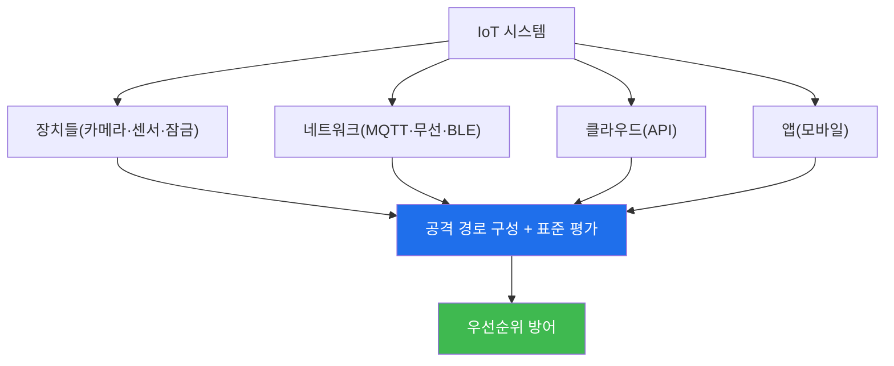

# iot-security W15 — 종합 평가: 전체 IoT 침투 테스트 + 보안 종합

> **본 주차의 한 줄 요약**
>
> 마지막 주는 W01~W14를 하나의 **종합 평가**로 통합한다. 실제 IoT 보안 평가는 한 장치·한 표면이 아니라, **전체 시스템**
> (장치들+네트워크+클라우드+앱+생태계)을 4대 표면과 표준(OWASP IoT Top 10)에 따라 점검하고, 취약점을 연결해 **공격
> 경로**를 구성하며, **표준 기반 방어**를 우선순위로 제안한다. 그리고 이 과목의 결론을 확인하며 마친다: **IoT는 가장
> 넓고 취약한 공격 표면이며(제약된 장치·기본 자격·업데이트 부재), 방어는 4대 표면 종합 + Security by Design + 생태계
> 분리 + 표준 준수다.** 특히 IoT는 **물리 안전이 걸린 영역**(OT·자동차)까지 포함해, 데이터가 아니라 **물리 세계**가
> 위험할 수 있음을 이해해야 한다. 실습에서는 전체 IoT 시스템을 종합 침투 평가하고(마커 `FULL_IOT_PENTEST`), 표준 기반
> 방어를 우선순위로 종합하며(마커 `DEFENSE_SYNTHESIZED`), 핵심 원칙을 종합한다(마커 `SYNTHESIS`). 종합 평가의 핵심은
> 부분 기법을 전체 시스템 평가로 통합하고, 가장 위험한 경로를 찾아, 표준 기반으로 방어를 설계하는 능력이다. 사이버
> 방어자도 IoT를 이해해야 완전하다 — 이제 IoT는 어디에나 있다.

---

## 학습 목표

본 주차 종료 시 학생은 다음 5가지를 **본인 손으로** 할 수 있어야 한다.

1. 전체 IoT 시스템을 4대 표면·표준으로 **종합 침투 평가**한다(마커 `FULL_IOT_PENTEST`).
2. **표준 기반 방어**를 우선순위로 종합한다(마커 `DEFENSE_SYNTHESIZED`).
3. IoT 보안의 **핵심 원칙 5가지**를 종합한다(마커 `SYNTHESIS`).
4. 물리 안전이 걸린 IoT(OT·자동차)의 특수성을 설명한다.
5. 사이버 방어자에게 IoT 이해가 왜 필수인지 최종 소견으로 종합한다(마커 `Assessment`).

> **이 주차의 시선** — 배운 모든 것을 전체 시스템 평가·표준 방어로 통합하며 마친다. "어디에나 있는 IoT, 물리 안전
> 까지"가 이 과목의 결론이다.

---

## 0. 용어 해설 (종합 평가)

| 용어 | 영문 | 뜻 | 비유 |
|------|------|----|------|
| **4대 표면** | Four Surfaces | device·network·cloud·app 전면 점검 | 네 방향 검진 |
| **공격 경로** | Attack Path | 취약점을 연결한 침해 사슬 | 도미노 |
| **표준 준수** | Compliance | OWASP·ETSI·NIST 기준 충족 | 규격 통과 |
| **Security by Design** | — | 설계 단계 보안 내장 | 설계도부터 안전 |
| **생태계 분리** | Segmentation | 네트워크·장치 간 격리 | 구역 분리 |
| **물리 안전** | Safety | OT·자동차의 물리적 무해 | 사고 예방 |

> **헷갈리기 쉬운 한 쌍 — 데이터 위협 vs 물리 위협.** 일반 IoT는 데이터·프라이버시 위협이 크지만, OT·자동차 IoT는
> 물리 재앙(정전·사고)이 걸린다. 종합 평가는 대상이 물리 안전 영역인지 구별해 안전 최우선을 적용한다.

---

## 0.5 종합 — 시스템·경로·표준

### 0.5.1 전체 시스템 평가

한 장치가 아니라 전체 시스템의 4대 표면을 점검하고, 취약점을 연결해 경로를 구성하고, 표준으로 평가한다.

### 0.5.2 IoT 보안의 핵심 원칙

- **넓은 표면**: device·network·cloud·app을 모두(W01·W08).
- **Security by Design**: 설계부터 보안(W14) — 기본 비밀번호 금지·업데이트·최소 표면·암호화.
- **생태계 분리**: 네트워크 분리·최소 신뢰(W10) — 약한 장치 격리.
- **표준 준수**: OWASP IoT Top 10·ETSI(W14) — 체계적·규정 준수.
- **물리 안전**: OT·자동차(W12·W13)는 안전 최우선 — 물리 세계 보호.

### 0.5.3 물리 안전이 걸린 IoT

IoT 보안은 데이터만이 아니다. OT(발전·공장)·자동차는 뚫리면 물리 재앙(정전·사고)이다. 이 영역은 안전을 절대 우선하며,
보안이 안전을 방해하면 안 된다. 사이버-물리 시스템 보안은 IoT의 가장 위험하고 특수한 부분이다.

### 0.5.4 여러분이 갖춘 것

W01의 IoT 개론부터 W15의 종합까지, 여러분은 IoT의 각 표면(프로토콜·하드웨어·펌웨어·웹·무선·BLE·OT·자동차)과 방어를,
전체 시스템 평가·표준·Security by Design으로 통합하는 능력을 갖췄다. IoT는 어디에나 있고, 사이버 방어자도 IoT를 알아야
완전하다. 이 과목이 그 역량을 채운다.

---

## 1. 종합 평가 상세 — 침투·방어·원칙

### 1.1 전체 시스템 종합 평가 (FULL_IOT_PENTEST)

- **한 줄 정의**: 전체 IoT 시스템을 4대 표면·표준으로 점검하고 공격 경로를 구성한다.
- **왜 중요한가**: 놓친 표면·경로가 실제 침해로 이어진다.
- **el34 맥락에서 어떻게**: 대상 시스템의 4대 표면·경로·OWASP 평가를 종합하면 `FULL_IOT_PENTEST`.
- **한계/주의**: 하드웨어·무선·물리 표면은 실물이 필요해 로직·설계로 다룬다.

### 1.2 표준 기반 방어 종합 (DEFENSE_SYNTHESIZED)

- **한 줄 정의**: 4대 표면·Security by Design·생태계 분리·표준을 우선순위로 종합한다.
- **핵심**: 위험·규제 우선순위 + 경로 급소 차단 + 물리 안전 영역 우선.
- **판정**: 표준 기반 방어가 종합되면 `DEFENSE_SYNTHESIZED`.

### 1.3 핵심 원칙 종합 (SYNTHESIS)

- **한 줄 정의**: IoT 보안 5대 원칙(넓은 표면·SbD·분리·표준·물리 안전)을 정리한다.
- **핵심**: "가장 넓은 표면, 물리 안전까지" 결론 명시.
- **판정**: 5대 원칙이 종합되면 `SYNTHESIS`.

---

## 2. 종합 평가 안내 (총 5 미션)

실행 위치는 el34 **호스트**(`ssh ccc@{{TARGET_IP}}`, 비밀번호 `1`), 참고 GPU는 Ollama
(`http://211.170.162.139:10934`, gemma3:4b)다. ⚠️ 물리 IoT는 실물이 필요해 종합 평가·방어·원칙 로직을 결정론 시뮬로
익힌다. 각 미션의 마지막 줄 마커가 채점 기준이다.

### 미션 1 — GPU 헬스체크 → `GEN_OK`

> **왜 하는가?** 분석·종합에 쓸 LLM 도달·응답 확인.
> **무엇을 아는가?** Ollama 응답 형식·도달성.
> **결과 해석** — 정상 `GEN_OK` / 비정상 `GEN_EMPTY`·연결 오류.
> **실전 활용** — 최종 소견 작성에 사용.

### 미션 2 — 전체 시스템 종합 평가 → `FULL_IOT_PENTEST`

> **왜 하는가?** 전체 시스템을 4대 표면·경로로 평가한다.
> **무엇을 아는가?** 4대 표면·공격 경로·OWASP 평가.
> **결과 해석** — 정상: 종합 평가 + `FULL_IOT_PENTEST`.
> **실전 활용** — IoT 침투 테스트 보고.

### 미션 3 — 표준 기반 방어 종합 → `DEFENSE_SYNTHESIZED`

> **왜 하는가?** 우선순위·표준으로 방어를 설계한다.
> **무엇을 아는가?** SbD·분리·표준·물리 안전 우선.
> **결과 해석** — 정상: 방어 종합 + `DEFENSE_SYNTHESIZED`.
> **실전 활용** — IoT 방어 로드맵.

### 미션 4 — 핵심 원칙 종합 → `SYNTHESIS`

> **왜 하는가?** IoT 보안의 5대 원칙을 정리한다.
> **무엇을 아는가?** 넓은 표면·SbD·분리·표준·물리 안전.
> **결과 해석** — 정상: 원칙 종합 + `SYNTHESIS`.
> **실전 활용** — IoT 보안 성숙도 기준.

### 미션 5 — 최종 종합 소견 → `Assessment`

> **왜 하는가?** 평가·방어·원칙과 "어디에나 있는 IoT, 물리 안전까지"를 최종 소견으로 묶는다.
> **무엇을 아는가?** GPU에 요약시키되 첫 줄을 `Assessment`로 강제.
> **결과 해석** — 정상: `Assessment` 포함. 없으면 `[형식 미준수 — 재실행]`.
> **실전 활용** — IoT 보안 종합 소견.

---

## 2.5 과제 (제출물)

- **A. 전체 시스템 종합 평가 실증 (필수, 40점)** — `FULL_IOT_PENTEST` 단계를 직접 수행해 실제 명령·출력(또는 아티팩트 분석 결과)을 캡처하고, 무엇을 근거로 판정했는지 서술한다.
- **B. 표준 기반 방어 종합 분석 (필수, 30점)** — `DEFENSE_SYNTHESIZED` 단계를 직접 수행해 실제 명령·출력(또는 아티팩트 분석 결과)을 캡처하고, 무엇을 근거로 판정했는지 서술한다.
- **C. 핵심 원칙 종합 방어 설계 (필수, 30점)** — `SYNTHESIS` 단계를 직접 수행해 실제 명령·출력(또는 아티팩트 분석 결과)을 캡처하고, 무엇을 근거로 판정했는지 서술한다.

## 2.6 평가 기준

| 항목 | 미흡(0) | 보통 | 우수 |
|------|---------|------|------|
| 탐지/실증(FULL_IOT_PENTEST) | 미수행 | 마커 도출 | 근거·해석·재현까지 |
| 분석(DEFENSE_SYNTHESIZED) | 미수행 | 마커 도출 | 근거·해석·재현까지 |
| 방어(SYNTHESIS) | 미수행 | 마커 도출 | 근거·해석·재현까지 |

## 2.7 핵심 정리 (1줄씩)

- 이번 주 주제: **종합 평가: 전체 IoT 침투 테스트 + 보안 종합**.
- **전체 시스템 종합 평가**(`FULL_IOT_PENTEST`): 전체 IoT 시스템을 4대 표면·표준으로 점검하고 공격 경로를 구성한다.
- **표준 기반 방어 종합**(`DEFENSE_SYNTHESIZED`): 4대 표면·Security by Design·생태계 분리·표준을 우선순위로 종합한다.
- **핵심 원칙 종합**(`SYNTHESIS`): IoT 보안 5대 원칙(넓은 표면·SbD·분리·표준·물리 안전)을 정리한다.
- 공격을 이해한 만큼 **방어의 우선순위**가 분명해진다 — 탐지 근거와 완화를 함께 익힌다.

---

## 3. 흔한 오해·블루팀 노트

- **"한 장치만 평가하면 된다."** — 전체 시스템 4대 표면을 본다. 놓친 곳이 진입점이다.
- **"IoT는 데이터만 위험하다."** — OT·자동차는 물리 안전이 걸린다. 사이버-물리다.
- **"보안은 사후에 한다."** — Security by Design·표준 준수가 근본이다.
- **"저위험 IoT는 무시한다."** — 약한 장치가 경로 발판이 된다. 생태계로 본다.
- **관제(Blue) 관점** — IoT 시스템이 (1) 4대 표면, (2) 표준·Security by Design, (3) 생태계 분리, (4) 물리 안전(OT·
  자동차)을 갖췄는지 종합 평가한다. IoT 보안 성숙도의 척도다.

---

## 4. 과목을 마치며

IoT는 편리함만큼 **가장 넓고 취약한 공격 표면**이며, 물리 안전까지 걸린 특수 영역이다. 여러분은 이제 IoT의 각 표면과
방어를, 전체 시스템 평가·Security by Design·표준·생태계 분리로 통합해 평가·구축할 수 있다. 어디에나 있는 IoT를 지키는
역량 — 그것이 이 과목이 남기는 것이다. 수고했다.
