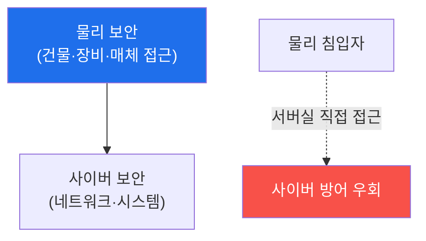

# physical-pentest W01 — 물리 보안 개론: 위협 분류·물리적 CIA·평가 프레임워크

> **본 주차의 한 줄 요약**
>
> physical-pentest는 **물리 보안**(건물·장비·매체에 대한 접근 통제)을 공격자 관점에서 평가하는 과목이다. 아무리
> 완벽한 사이버 방어도 **누군가 서버실에 들어가 디스크를 빼가면** 무의미하다 — 물리 보안은 사이버 보안의 **토대**다.
> 첫 주는 그 개념 틀을 잡는다. **CIA Triad**(기밀성·무결성·가용성)를 물리 맥락으로 옮기면: **기밀성**=문서·화면·
> 매체를 못 보게(잠금·차폐), **무결성**=장비·배선을 못 바꾸게(봉인·감시), **가용성**=시스템을 계속 쓰게(전원·
> 냉각·출입). 물리 위협은 유형별로 분류한다: **인가 우회**(테일게이팅·복제 배지), **매체/장비 탈취**, **파괴/
> 방해**(전원·냉각 차단), **감시/정보수집**(숄더 서핑·도청). 물리 침투 테스트는 이 위협을 **인가받아 안전하게
> 시연**해 약점을 찾는다 — 반드시 **서면 인가·범위 합의·법적 경계** 안에서(무단 침입은 범죄). 이번 주는 물리
> 위협 분류·물리적 CIA 매핑·위험 평가(가능성×영향)를 익힌다.
>
> ⚠️ **el34 범위 주의**: 물리 침투는 실제 하드웨어·건물 접근이 필요하다. el34(사이버 훈련 VM)엔 물리 장비가
> 없으므로, 이 과목의 실습은 **분석·평가 로직의 결정론 시뮬레이션 + GPU 분석**으로 한다. 물리 실행(락픽·RFID
> 복제 등)은 별도 인가된 물리 환경·하드웨어가 필요함을 명시한다.
>
> **한 줄 결론**: 물리 보안은 사이버 보안의 토대다. 물리적 CIA(잠금·봉인·가용성)와 위협 분류로 약점을 평가하되,
> 물리 침투 테스트는 **서면 인가·법적 경계** 안에서만.

---

## 학습 목표

본 주차 종료 시 학생은 다음 5가지를 **본인 손으로** 할 수 있어야 한다.

1. 물리 보안과 사이버 보안의 관계를 설명한다.
2. **물리 위협**을 유형별로 분류한다(THREATS_CLASSIFIED).
3. **CIA Triad**를 물리 통제에 매핑한다(CIA_MAPPED).
4. **위험 평가**(가능성×영향)를 수행한다(RISK_SCORED).
5. 물리 침투 테스트의 **법적·윤리적 경계**를 설명한다.

> **이 주차의 시선** — 사이버 방어의 토대인 물리 보안을 공격자 관점으로 평가하는 틀을 세운다.

---

## 0. 용어 해설 (물리 보안)

| 용어 | 영문 | 뜻 | 비유 |
|------|------|----|------|
| **물리 보안** | Physical Security | 물리적 접근 통제 | 자물쇠·경비 |
| **테일게이팅** | Tailgating | 인가자 뒤 무단 진입 | 뒤따라 들어가기 |
| **물리적 CIA** | Physical CIA | CIA의 물리 적용 | 3대 원칙 |
| **위험 평가** | Risk Assessment | 가능성×영향 | 위험 점수 |
| **서면 인가** | Rules of Engagement | 테스트 범위 합의 | 작전 허가서 |

> **헷갈리기 쉬운 한 쌍** — *사이버 침투* 는 "네트워크로 뚫음", *물리 침투* 는 "직접 들어가 뚫음"이다. 후자는
> 사이버 방어를 **우회**한다 — 서버를 직접 만지니까.

---

## 0.5 신입생 친화 핵심 개념

### 0.5.1 물리 보안은 토대다

방화벽·암호화가 완벽해도, 공격자가 **서버를 직접 만지면**(디스크 탈취·콘솔 접근·전원 차단) 무력화된다. 물리
보안이 뚫리면 사이버 보안도 뚫린다 — 그래서 토대다.

### 0.5.2 물리적 CIA

- **기밀성(Confidentiality)**: 문서·화면·저장매체를 **못 보게**. 통제: 잠금 캐비닛, 화면 차폐, 매체 파쇄, 출입 통제.
- **무결성(Integrity)**: 장비·배선·설정을 **못 바꾸게**. 통제: 봉인(tamper-evident), CCTV, 장비 잠금, 변경 감지.
- **가용성(Availability)**: 시스템을 **계속 쓰게**. 통제: 이중 전원·냉각, 화재 억제, 출입 통제로 파괴 방지.
사이버의 CIA와 같은 목표를 **물리적 수단**으로 달성한다.

### 0.5.3 물리 위협 분류

| 유형 | 예 | 노림 |
|------|----|------|
| **인가 우회** | 테일게이팅·복제 배지·락픽 | 무단 진입 |
| **매체/장비 탈취** | 디스크·노트북·문서 절도 | 기밀성 |
| **파괴/방해** | 전원·냉각 차단·물리 파손 | 가용성 |
| **감시/정보수집** | 숄더 서핑·도청·덤프스터 | 정보 |
| **임플란트** | 악성 USB·네트워크 탭 | 지속 접근 |

위협을 유형화하면 각각에 맞는 통제를 설계할 수 있다.

### 0.5.4 위험 평가 — 가능성 × 영향

모든 위협에 같은 자원을 쓸 순 없다. **위험 = 가능성(발생 확률) × 영향(피해 크기)** 로 우선순위를 매긴다.
"서버실 무단 진입"은 영향 크고 가능성도 있으면 최우선. "외딴 창고 침입"은 영향 작으면 후순위. 위험 점수로
통제 투자를 배분한다.

### 0.5.5 법적·윤리적 경계 — 절대 원칙

물리 침투 테스트는 **범죄와 종이 한 장 차이**다. 무단 침입·절도·기물 파손은 불법이다. **절대 원칙**: (1) **서면
인가**(경영진 승인·범위·기간 명시), (2) **범위 합의(RoE)**(어디까지·무엇을·어떻게), (3) **신분 증명 소지**
(적발 시 인가 증빙 "get-out-of-jail letter"), (4) **비파괴·비절도**(시연만, 실제 피해 금지). 인가 없는 물리
침투는 이 과목의 목적이 아니며 불법이다. 이 경계를 매주 재확인한다.

---

## 1. 실습 안내 (5 미션)

실행 위치 el34 **호스트**(`ssh ccc@{{TARGET_IP}}`), GPU `http://211.170.162.139:10934`.
⚠️ 물리 실행은 하드웨어 필요 → 본 실습은 분석·평가 로직의 결정론 시뮬 + GPU 분석.

### STEP 1 — GPU 헬스체크 → GEN_OK
### STEP 2 — 물리 위협 분류 → THREATS_CLASSIFIED
### STEP 3 — 물리적 CIA 매핑 → CIA_MAPPED
### STEP 4 — 위험 평가 → RISK_SCORED
### STEP 5 — 종합(법적 경계) → Assessment

---

## 1.5 과제 (제출물)

- **A. 물리 위협 분류 실증 (필수, 40점)** — `THREATS_CLASSIFIED` 단계를 직접 수행해 실제 명령·출력(또는 아티팩트 분석 결과)을 캡처하고, 무엇을 근거로 판정했는지 서술한다.
- **B. 물리적 CIA 매핑 분석 (필수, 30점)** — `CIA_MAPPED` 단계를 직접 수행해 실제 명령·출력(또는 아티팩트 분석 결과)을 캡처하고, 무엇을 근거로 판정했는지 서술한다.
- **C. 위험 평가 방어 설계 (필수, 30점)** — `RISK_SCORED` 단계를 직접 수행해 실제 명령·출력(또는 아티팩트 분석 결과)을 캡처하고, 무엇을 근거로 판정했는지 서술한다.

## 1.6 평가 기준

| 항목 | 미흡(0) | 보통 | 우수 |
|------|---------|------|------|
| 탐지/실증(THREATS_CLASSIFIED) | 미수행 | 마커 도출 | 근거·해석·재현까지 |
| 분석(CIA_MAPPED) | 미수행 | 마커 도출 | 근거·해석·재현까지 |
| 방어(RISK_SCORED) | 미수행 | 마커 도출 | 근거·해석·재현까지 |

## 1.7 핵심 정리 (1줄씩)

- 이번 주 주제: **물리 보안 개론: 위협 분류·물리적 CIA·평가 프레임워크**.
- **물리 위협 분류**(`THREATS_CLASSIFIED`)
- **물리적 CIA 매핑**(`CIA_MAPPED`)
- **위험 평가**(`RISK_SCORED`)
- 공격을 이해한 만큼 **방어의 우선순위**가 분명해진다 — 탐지 근거와 완화를 함께 익힌다.

---

## 2. 흔한 오해·블루팀 노트

- **"사이버만 지키면 됨"** — 물리로 우회된다. 물리 보안이 토대.
- **"물리 침투는 영화 얘기"** — 테일게이팅·복제 배지는 현실적. 위험 평가로 대비.
- **"인가는 구두면 됨"** — 반드시 서면. 적발 시 범죄가 된다.
- **관제 관점** — 물리적 CIA 통제(잠금·봉인·이중 전원)가 있는지, 위험 평가로 우선순위가 정해졌는지, 물리 침투
  테스트가 서면 인가·범위 내인지 점검한다. 물리 보안은 사이버 관제의 사각지대가 되기 쉽다.

---

## 3. 다음 주차 (W02) 예고 — 사회공학 기초: 프리텍스팅·테일게이팅·피싱

W01이 "물리 보안 개론"이었다면, W02는 물리 침투의 첫 무기 **사회공학** — 사람을 속여 접근을 얻는 프리텍스팅·
테일게이팅·피싱을 다룬다. 기술보다 사람이 약점인 경우가 많다.
