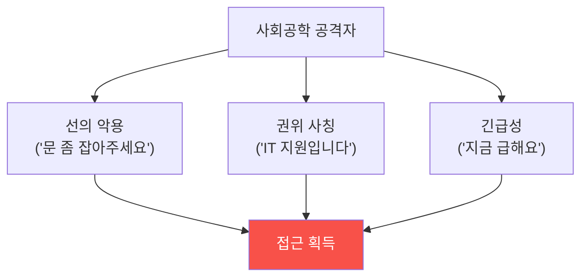

# physical-pentest W02 — 사회공학 기초: 프리텍스팅·테일게이팅·피싱

> **본 주차의 한 줄 요약**
>
> 물리 침투의 첫 무기는 기술이 아니라 **사람**이다. W02는 **사회공학(social engineering)** — 사람을 속여 접근·
> 정보를 얻는 기법을 다룬다. 가장 견고한 물리 통제도 **직원이 문을 열어주면** 무의미하다. 대표 기법: ① **프리
> 텍스팅(pretexting)** — 그럴듯한 **가짜 신분·상황**을 만들어 신뢰를 얻음(택배기사·IT 지원·감사관 사칭),
> ② **테일게이팅(tailgating)** — 인가자 **바로 뒤를 따라** 문을 통과(짐 든 척, 예의상 잡아주는 문), ③ **피싱/
> 비싱** — 이메일·전화로 자격·정보를 유도. 사회공학이 강력한 이유: 인간의 **선의·권위 복종·바쁨**을 악용하고,
> 기술 통제를 **우회**한다(문은 잠겼지만 사람이 열어줌). 방어의 핵심은 **검증 문화와 절차**: 신원 확인(모르는
> 사람은 에스코트), 테일게이팅 방지(맨트랩·한 명씩·배지 in/out), 의심 시 확인(재촉에 굴하지 않기), 그리고
> **보안 인식 교육**(직원이 사회공학을 알아채게). 기술이 아니라 **사람과 절차**가 방어의 최전선이다.
>
> ⚠️ **el34 범위**: 실제 사회공학 시연은 사람·건물이 필요하다. 본 실습은 **프리텍스트 위험 신호·테일게이팅
> 통제·피싱 지표 분석**을 결정론 시뮬 + GPU로 익힌다(실제 물리 시연은 인가된 현장 필요).
>
> **한 줄 결론**: 사회공학은 사람의 선의·권위 복종을 악용해 기술 통제를 우회한다. 방어 = **신원 검증 문화 +
> 테일게이팅 방지 절차 + 보안 인식 교육**. 사람과 절차가 최전선.

---

## 학습 목표

본 주차 종료 시 학생은 다음 5가지를 **본인 손으로** 할 수 있어야 한다.

1. **사회공학**의 심리 원리를 설명한다.
2. **프리텍스트 위험 신호**를 식별한다(PRETEXT_FLAGGED).
3. **테일게이팅 통제**를 평가한다(TAILGATE_CONTROLLED).
4. 사회공학 **방어**(검증·인식)를 적용한다(SE_DEFENDED).
5. 왜 사람이 물리 보안의 약점인지 설명한다.

> **이 주차의 시선** — 기술이 아니라 사람을 노리는 공격을, 검증 문화와 절차로 막는다.

---

## 0. 용어 해설 (사회공학)

| 용어 | 영문 | 뜻 | 비유 |
|------|------|----|------|
| **사회공학** | Social Engineering | 사람을 속임 | 사기술 |
| **프리텍스팅** | Pretexting | 가짜 상황·신분 | 위장 |
| **테일게이팅** | Tailgating | 뒤따라 진입 | 무임승차 |
| **권위 복종** | Authority Compliance | 권위에 따름 | 상사 지시 |
| **맨트랩** | Mantrap | 한 명씩 통과 문 | 이중문 |

> **헷갈리기 쉬운 한 쌍** — *프리텍스팅* 은 "가짜 이유로 신뢰 얻기"(사전 설득), *테일게이팅* 은 "물리적으로 뒤
> 따라가기"(순간 진입)다. 종종 함께 쓰인다.

---

## 0.5 신입생 친화 핵심 개념

### 0.5.1 사람이 약점 — 심리 악용

사람은 친절하고(문 잡아줌), 권위에 따르고(IT라니까), 바쁘다(확인 안 함). 사회공학은 이 **인간 본성**을 악용해
기술 통제를 우회한다.

### 0.5.2 프리텍스팅 — 그럴듯한 가짜 상황

공격자는 **믿을 만한 시나리오**를 만든다: 유니폼·가짜 배지·소품(사다리·박스)·전문 용어. "본사에서 온 감사관",
"에어컨 점검", "택배". 위험 신호: **신원 미확인·예고 없는 방문·비정상 접근 요구·재촉·확인 회피**. 그럴듯할수록
**독립 확인**(내부 담당자에게 직접)이 필요하다(agent-ir-adv W12 대역 외 검증과 같은 원리).

### 0.5.3 테일게이팅 — 예의를 악용

인가자가 배지로 문을 열 때 **바로 뒤를 따라** 들어간다. 짐을 들거나 통화하는 척하면, 사람들이 **예의상 문을
잡아준다**. 방어: **맨트랩**(한 명씩), **배지 in/out**(들어갈 때·나갈 때 태그), **"모르는 사람 에스코트"**
문화, "뒤에 누가 따라오나" 인식. 기술(맨트랩)+문화(의심) 겹층.

### 0.5.4 방어 — 검증 문화와 절차

- **신원 검증**: 모르는 사람은 확인·에스코트. 유니폼·배지도 위조 가능하니 **독립 확인**.
- **테일게이팅 방지**: 맨트랩·배지 in/out·한 명씩. 문 잡아주지 않기(불편해도).
- **재촉 저항**: 긴급성 압박이 사회공학의 신호. 급할수록 절차 확인.
- **보안 인식 교육**: 직원이 사회공학 기법을 알면 속지 않는다. 정기 훈련·모의 시험.
방어의 최전선은 기술이 아니라 **교육받은 사람과 지켜지는 절차**다.

### 0.5.5 el34 맥락

실제 사회공학은 사람·건물이 필요하다. 본 실습은 **프리텍스트 위험 신호 판정·테일게이팅 통제 평가·피싱 지표
분석**을 결정론 시뮬 + GPU로 익힌다. 실제 물리 시연은 인가된 현장·직원 협조가 필요함을 명시한다.

---

## 1. 실습 안내 (5 미션)

실행 위치 el34 **호스트**(`ssh ccc@{{TARGET_IP}}`), GPU `http://211.170.162.139:10934`.
⚠️ 물리 시연은 현장 필요 → 본 실습은 분석·평가 로직 결정론 시뮬 + GPU.

### STEP 1 — GPU 헬스체크 → GEN_OK
### STEP 2 — 프리텍스트 위험 신호 → PRETEXT_FLAGGED
### STEP 3 — 테일게이팅 통제 평가 → TAILGATE_CONTROLLED
### STEP 4 — 사회공학 방어 → SE_DEFENDED
### STEP 5 — 종합 → Assessment

---

## 1.5 과제 (제출물)

- **A. 프리텍스트 위험 신호 실증 (필수, 40점)** — `PRETEXT_FLAGGED` 단계를 직접 수행해 실제 명령·출력(또는 아티팩트 분석 결과)을 캡처하고, 무엇을 근거로 판정했는지 서술한다.
- **B. 테일게이팅 통제 평가 분석 (필수, 30점)** — `TAILGATE_CONTROLLED` 단계를 직접 수행해 실제 명령·출력(또는 아티팩트 분석 결과)을 캡처하고, 무엇을 근거로 판정했는지 서술한다.
- **C. 사회공학 방어 방어 설계 (필수, 30점)** — `SE_DEFENDED` 단계를 직접 수행해 실제 명령·출력(또는 아티팩트 분석 결과)을 캡처하고, 무엇을 근거로 판정했는지 서술한다.

## 1.6 평가 기준

| 항목 | 미흡(0) | 보통 | 우수 |
|------|---------|------|------|
| 탐지/실증(PRETEXT_FLAGGED) | 미수행 | 마커 도출 | 근거·해석·재현까지 |
| 분석(TAILGATE_CONTROLLED) | 미수행 | 마커 도출 | 근거·해석·재현까지 |
| 방어(SE_DEFENDED) | 미수행 | 마커 도출 | 근거·해석·재현까지 |

## 1.7 핵심 정리 (1줄씩)

- 이번 주 주제: **사회공학 기초: 프리텍스팅·테일게이팅·피싱**.
- **프리텍스트 위험 신호**(`PRETEXT_FLAGGED`)
- **테일게이팅 통제 평가**(`TAILGATE_CONTROLLED`)
- **사회공학 방어**(`SE_DEFENDED`)
- 공격을 이해한 만큼 **방어의 우선순위**가 분명해진다 — 탐지 근거와 완화를 함께 익힌다.

---

## 2. 흔한 오해·블루팀 노트

- **"기술만 있으면 안전"** — 사람이 열어주면 무력. 검증 문화 필수.
- **"유니폼·배지면 믿음"** — 위조 가능. 독립 확인.
- **"문 잡아주는 게 예의"** — 테일게이팅의 통로. 배지 in/out·맨트랩.
- **관제 관점** — 신원 검증 절차·테일게이팅 방지(맨트랩·배지 in/out)·보안 인식 교육이 있는지 점검한다.
  사회공학 방어는 사람과 절차 — 기술 통제만으론 부족.

---

## 3. 다음 주차 (W03) 예고 — RFID/NFC 해킹

W02가 "사람을 속이기"였다면, W03은 **RFID/NFC 배지** 해킹 — Proxmark3·Flipper Zero로 배지를 복제하는 기법과
방어(암호화 카드·다중 인증)를 다룬다. (물리 하드웨어 필요 → 카드 보안 로직 시뮬.)
