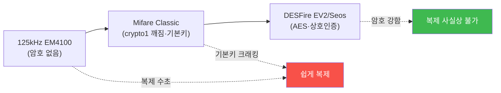

# physical-pentest W03 — RFID/NFC 해킹: 배지 복제·Mifare 크래킹·암호화 카드 방어

> **본 주차의 한 줄 요약**
>
> W03은 **RFID/NFC 배지** 해킹을 다룬다. 대부분의 출입 통제는 **비접촉 카드**(사원증)를 쓴다 — 리더에 대면
> 문이 열린다. 문제는 **오래된·약한 카드**가 여전히 널리 쓰인다는 것: ① **저주파(125kHz) 카드**(EM4100 등)는
> **암호화가 아예 없어** ID만 읽으면 그대로 복제된다(Proxmark3·Flipper Zero로 몇 초). ② **Mifare Classic**
> (13.56MHz)은 암호화가 있지만 **crypto1이 깨졌고 기본 키(default key)** 를 그대로 쓰는 경우가 많아 크래킹된다.
> 반면 **최신 카드**(DESFire EV2·Seos)는 **강한 암호화(AES)·상호 인증**으로 복제가 사실상 불가능하다. 공격자는
> 대상 근처에서 **몰래 카드를 읽어**(스키밍·긴 안테나) 복제본을 만든다. 방어의 핵심은 **카드 기술 업그레이드**:
> 약한 카드(125kHz·Mifare Classic)를 **암호화 카드(DESFire/Seos)** 로 교체, 기본 키 변경, 그리고 **다중 인증**
> (카드+PIN·생체)으로 카드 하나에 의존하지 않기. 카드가 복제돼도 두 번째 요소가 있으면 막힌다.
>
> ⚠️ **el34 범위**: 실제 카드 복제는 Proxmark3·Flipper 같은 하드웨어와 물리 카드가 필요하다. 본 실습은 **카드
> 보안 수준 평가·복제 가능성 판정·방어 설계**를 결정론 시뮬로 익힌다(물리 복제는 인가된 하드웨어 필요).
>
> **한 줄 결론**: 약한 카드(125kHz·Mifare Classic 기본 키)는 몇 초에 복제된다. 방어 = **암호화 카드(DESFire/
> Seos) 업그레이드 + 기본 키 변경 + 다중 인증**. 카드 하나에 의존하지 않는다.

---

## 학습 목표

본 주차 종료 시 학생은 다음 5가지를 **본인 손으로** 할 수 있어야 한다.

1. RFID/NFC 카드의 **보안 수준 차이**를 설명한다.
2. 카드 **취약성**(암호화·기본 키)을 평가한다(CARD_WEAKNESS).
3. **복제 가능성**을 판정한다(CLONE_ASSESSED).
4. **암호화 카드·다중 인증**으로 강화한다(CARD_HARDENED).
5. 카드 복제 스키밍의 위협을 설명한다.

> **이 주차의 시선** — 편리한 비접촉 카드의 보안 격차를 평가하고, 강한 카드·다중 인증으로 막는다.

---

## 0. 용어 해설 (RFID/NFC)

| 용어 | 영문 | 뜻 | 비유 |
|------|------|----|------|
| **RFID** | Radio Frequency ID | 무선 식별 카드 | 비접촉 열쇠 |
| **Mifare Classic** | — | 깨진 암호 카드 | 낡은 자물쇠 |
| **DESFire/Seos** | — | 강한 암호 카드 | 최신 자물쇠 |
| **스키밍** | Skimming | 몰래 카드 읽기 | 지문 훔치기 |
| **기본 키** | Default Key | 미변경 초기 키 | 초기 비밀번호 |

> **헷갈리기 쉬운 한 쌍** — *125kHz(저주파)* 는 "암호 없음(ID만)", *13.56MHz(고주파)* 는 "암호 있음(단 Mifare
> Classic은 깨짐)"이다. 주파수가 아니라 **암호화 강도**가 보안을 결정한다.

---

## 0.5 신입생 친화 핵심 개념

### 0.5.1 카드 보안의 스펙트럼

같은 "비접촉 카드"도 보안이 천차만별이다. 암호 없는 카드는 ID만 읽으면 복제, 깨진 카드는 키 크래킹, 강한
카드는 사실상 안전.

### 0.5.2 왜 약한 카드가 남아 있나

125kHz·Mifare Classic은 **싸고 오래돼** 널리 깔려 있다. 교체 비용 때문에 방치된다. 하지만 Proxmark3·Flipper
Zero 같은 **저렴한 도구**로 몇 초에 복제된다 — 공격 비용이 방어 비용보다 훨씬 낮다. 약한 카드는 **없는 것과
비슷한** 보안이다.

### 0.5.3 스키밍 — 몰래 읽기

공격자는 대상에게 **접근**(엘리베이터·붐비는 곳)해 숨긴 리더·긴 안테나로 카드를 **몰래 읽는다**. 카드가 지갑
안에 있어도 근거리면 읽힌다. 읽은 데이터로 복제본을 만들어 출입. 그래서 카드 자체가 강해야(읽어도 복제 못 하게)
하고, RFID 차폐 지갑도 보조 방어.

### 0.5.4 방어 — 강한 카드와 다중 인증

- **암호화 카드**: 125kHz·Mifare Classic → **DESFire EV2·Seos**(AES·상호 인증)로 교체. 읽어도 복제 불가.
- **기본 키 변경**: Mifare 유지 시 최소한 **기본 키를 랜덤으로** 변경(default key 크래킹 방지).
- **다중 인증**: 카드+PIN 또는 카드+생체. 카드가 복제돼도 두 번째 요소가 막는다.
- **판독 로그·이상 탐지**: 같은 카드가 동시 여러 곳·비정상 시간 사용 → 복제 의심.
카드 하나에 의존하지 않는 **겹층**이 답이다.

### 0.5.5 el34 맥락

실제 복제는 물리 하드웨어(Proxmark3·Flipper)와 카드가 필요하다. 본 실습은 **카드 보안 수준 평가·복제 가능성
판정·방어 설계**를 결정론 시뮬로 익힌다. 물리 복제 시연은 인가된 하드웨어·환경이 필요함을 명시한다.

---

## 1. 실습 안내 (5 미션)

실행 위치 el34 **호스트**(`ssh ccc@{{TARGET_IP}}`), GPU `http://211.170.162.139:10934`.
⚠️ 물리 복제는 하드웨어 필요 → 본 실습은 카드 보안 평가·방어 로직 결정론 시뮬.

### STEP 1 — GPU 헬스체크 → GEN_OK
### STEP 2 — 카드 취약성 평가 → CARD_WEAKNESS
### STEP 3 — 복제 가능성 판정 → CLONE_ASSESSED
### STEP 4 — 카드 강화 → CARD_HARDENED
### STEP 5 — 종합 → Assessment

---

## 2. 흔한 오해·블루팀 노트

- **"비접촉 카드는 안전"** — 암호 없는/깨진 카드는 몇 초에 복제. 암호화 강도가 관건.
- **"주파수가 보안"** — 암호화가 보안. 13.56MHz도 Mifare Classic은 깨짐.
- **"카드만 있으면 됨"** — 복제 위험. 다중 인증(카드+PIN/생체)으로.
- **관제 관점** — 출입 카드가 암호화 카드(DESFire/Seos)인지, 기본 키가 변경됐는지, 다중 인증이 있는지, 판독
  이상(동시 사용)이 탐지되는지 점검한다. 약한 카드는 사실상 무방비.

---

## 3. 다음 주차 (W04) 예고 — USB HID 공격

W03이 "카드 복제"였다면, W04는 **USB HID 공격** — Rubber Ducky·Bash Bunny로 USB를 꽂는 순간 키보드로 위장해
명령을 주입하는 공격과 방어(USB 정책·엔드포인트 통제)를 다룬다.
