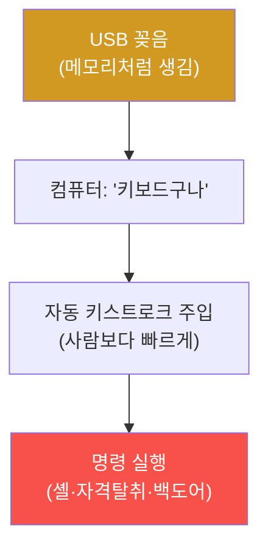

# physical-pentest W04 — USB HID 공격: Rubber Ducky·키스트로크 인젝션·USB 정책 방어

> **본 주차의 한 줄 요약**
>
> W04는 **USB HID(Human Interface Device) 공격**을 다룬다. USB를 꽂으면 컴퓨터는 그것이 무엇인지 **장치가
> 스스로 주장하는 대로** 믿는다. 공격 도구(**Rubber Ducky·Bash Bunny**)는 USB 메모리처럼 생겼지만 **키보드로
> 위장**한다 — 꽂는 순간, 사람보다 훨씬 빠르게 **미리 짜둔 키스트로크를 자동 입력**(keystroke injection)해
> 명령을 실행한다(예: 몇 초 만에 리버스 셸 실행, 자격 탈취, 백도어 설치). "키보드 입력"이라 안티바이러스가
> 정상으로 여기고, 잠긴 화면만 아니면 순식간이다. 이것이 "USB를 함부로 꽂지 마라"의 이유 — **주차장에 떨어진
> USB**(W01의 임플란트)가 이 공격의 미끼다. 방어의 핵심은 **USB 통제**: (1) **USB 포트 정책**(불필요한 포트
> 비활성·물리 차단), (2) **장치 allowlist**(승인된 장치만, 새 HID 차단·경고), (3) **엔드포인트 통제**(비정상
> 빠른 키스트로크·의심 명령 탐지·차단), (4) **화면 잠금·인식 교육**(모르는 USB 안 꽂기). USB는 편리하지만
> 신뢰 경계라, 꽂히는 것을 통제해야 한다.
>
> ⚠️ **el34 범위**: 실제 HID 공격은 물리 USB 장치가 필요하다. 본 실습은 **HID 공격 탐지·페이로드 분석·USB
> 정책 평가**를 결정론 시뮬로 익힌다(물리 시연은 인가된 하드웨어 필요).
>
> **한 줄 결론**: USB HID 공격은 USB를 **키보드로 위장**해 꽂는 순간 명령을 자동 주입한다. 방어 = **USB 포트
> 정책 + 장치 allowlist + 엔드포인트 통제 + 인식 교육**. 꽂히는 것을 신뢰하지 말고 통제한다.

---

## 학습 목표

본 주차 종료 시 학생은 다음 5가지를 **본인 손으로** 할 수 있어야 한다.

1. **USB HID 공격**(키보드 위장 키스트로크 인젝션)의 원리를 설명한다.
2. **HID 공격 정황**(새 HID + 빠른 입력)을 탐지한다(HID_ATTACK_DETECTED).
3. **페이로드**(Ducky Script 패턴)를 분석한다(PAYLOAD_ANALYZED).
4. **USB 정책·엔드포인트 통제**로 방어한다(USB_CONTROLLED).
5. 왜 USB가 신뢰 경계인지 설명한다.

> **이 주차의 시선** — 꽂는 순간 명령이 되는 USB를, 통제와 인식으로 막는다.

---

## 0. 용어 해설 (USB HID)

| 용어 | 영문 | 뜻 | 비유 |
|------|------|----|------|
| **HID** | Human Interface Device | 키보드·마우스 장치 | 입력 장치 |
| **키스트로크 인젝션** | Keystroke Injection | 자동 키 입력 | 자동 타이핑 |
| **Rubber Ducky** | — | 키보드 위장 USB | 위장 열쇠 |
| **Ducky Script** | — | HID 공격 스크립트 | 자동 대본 |
| **장치 allowlist** | Device Allowlist | 승인 장치만 | 허가 명단 |

> **헷갈리기 쉬운 한 쌍** — *USB 저장장치* 는 "파일(스캔 가능)", *USB HID* 는 "키보드(명령 입력)"다. 후자는
> 파일 스캔으로 못 잡는다 — 입력 자체가 공격.

---

## 0.5 신입생 친화 핵심 개념

### 0.5.1 USB HID 공격 원리

컴퓨터는 USB가 "키보드"라 주장하면 믿는다. 그 "키보드"가 몇 초 만에 위험한 명령을 타이핑한다 — 사람이 손댈
새도 없이.

### 0.5.2 왜 무서운가 — 신뢰와 속도

- **신뢰**: HID(키보드)는 기본 신뢰 장치라 별도 승인 없이 작동. 안티바이러스도 "키보드 입력"을 정상으로 봄.
- **속도**: 미리 짠 스크립트를 **초당 수백 키**로 입력 — 사람이 인지·중단 불가.
- **미끼**: 주차장·로비에 떨어진 "잃어버린 USB"를 호기심에 꽂으면 발동(W01 임플란트).

### 0.5.3 탐지 — 새 HID + 비정상 입력

- **새 HID 등록**: 예상 밖 새 키보드 장치가 연결됨 → 경고.
- **비정상 입력 속도**: 사람이 불가능한 **빠른·규칙적 키스트로크** → 인젝션 정황.
- **의심 명령**: 입력이 `powershell`·`cmd`·셸 실행으로 이어짐(파일리스 W09와 연결).
엔드포인트 보안(EDR)이 이 행위를 탐지·차단한다.

### 0.5.4 페이로드 분석 — Ducky Script 패턴

HID 공격 스크립트(Ducky Script)는 전형적 패턴이 있다: `GUI r`(실행 창)→`powershell`·`cmd`→원격 다운로드·실행.
이 시퀀스를 분석하면 공격 의도를 안다. 방어자는 캡처된 입력 시퀀스에서 이런 패턴을 탐지한다.

### 0.5.5 방어 — USB 통제와 인식

- **포트 정책**: 불필요한 USB 포트 비활성·물리 차단(에폭시·포트 락).
- **장치 allowlist**: 승인된 장치(특정 키보드)만 허용, 새 HID는 차단·승인 요구.
- **엔드포인트 통제**: 비정상 키스트로크·의심 명령 탐지·차단.
- **인식 교육**: "모르는 USB 절대 안 꽂기". 미끼 USB 훈련.
USB는 신뢰 경계 — 꽂히는 것을 통제하고 사람을 교육한다.

---

## 1. 실습 안내 (5 미션)

실행 위치 el34 **호스트**(`ssh ccc@{{TARGET_IP}}`), GPU `http://211.170.162.139:10934`.
⚠️ 물리 HID 공격은 하드웨어 필요 → 본 실습은 탐지·분석·정책 로직 결정론 시뮬.

### STEP 1 — GPU 헬스체크 → GEN_OK
### STEP 2 — HID 공격 탐지 → HID_ATTACK_DETECTED
### STEP 3 — 페이로드 분석 → PAYLOAD_ANALYZED
### STEP 4 — USB 통제 → USB_CONTROLLED
### STEP 5 — 종합 → Assessment

---

## 1.5 과제 (제출물)

- **A. HID 공격 탐지 실증 (필수, 40점)** — `HID_ATTACK_DETECTED` 단계를 직접 수행해 실제 명령·출력(또는 아티팩트 분석 결과)을 캡처하고, 무엇을 근거로 판정했는지 서술한다.
- **B. 페이로드 분석 분석 (필수, 30점)** — `PAYLOAD_ANALYZED` 단계를 직접 수행해 실제 명령·출력(또는 아티팩트 분석 결과)을 캡처하고, 무엇을 근거로 판정했는지 서술한다.
- **C. USB 통제 방어 설계 (필수, 30점)** — `USB_CONTROLLED` 단계를 직접 수행해 실제 명령·출력(또는 아티팩트 분석 결과)을 캡처하고, 무엇을 근거로 판정했는지 서술한다.

## 1.6 평가 기준

| 항목 | 미흡(0) | 보통 | 우수 |
|------|---------|------|------|
| 탐지/실증(HID_ATTACK_DETECTED) | 미수행 | 마커 도출 | 근거·해석·재현까지 |
| 분석(PAYLOAD_ANALYZED) | 미수행 | 마커 도출 | 근거·해석·재현까지 |
| 방어(USB_CONTROLLED) | 미수행 | 마커 도출 | 근거·해석·재현까지 |

## 1.7 핵심 정리 (1줄씩)

- 이번 주 주제: **USB HID 공격: Rubber Ducky·키스트로크 인젝션·USB 정책 방어**.
- **HID 공격 탐지**(`HID_ATTACK_DETECTED`)
- **페이로드 분석**(`PAYLOAD_ANALYZED`)
- **USB 통제**(`USB_CONTROLLED`)
- 공격을 이해한 만큼 **방어의 우선순위**가 분명해진다 — 탐지 근거와 완화를 함께 익힌다.

---

## 2. 흔한 오해·블루팀 노트

- **"USB 스캔하면 안전"** — HID는 파일 아닌 입력. 스캔으로 못 잡는다. 행위 탐지·정책.
- **"키보드는 신뢰 장치"** — 위장 가능. 새 HID 차단·allowlist.
- **"떨어진 USB 궁금"** — 미끼일 수 있다. 절대 안 꽂기.
- **관제 관점** — USB 포트 정책·장치 allowlist·엔드포인트 HID 탐지가 있는지, 인식 교육·미끼 USB 훈련이 있는지
  점검한다. USB는 신뢰 경계 — 통제와 교육 겹층.

---

## 3. 다음 주차 (W05) 예고 — 네트워크 임플란트

W04가 "USB 임플란트"였다면, W05는 **네트워크 임플란트** — LAN Turtle·Shark Jack 같은 물리 백도어를 네트워크에
심는 공격과, 그 탐지(비인가 장치·비정상 트래픽)를 다룬다.
