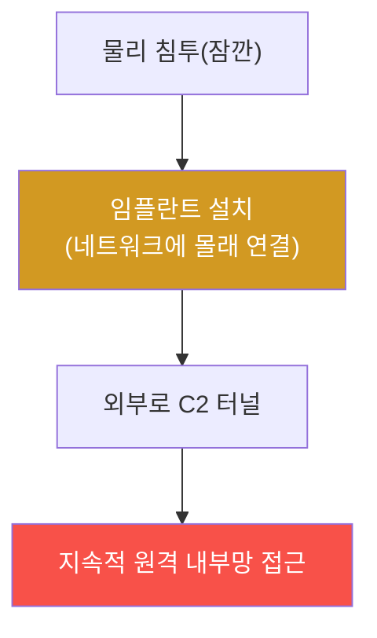

# physical-pentest W05 — 네트워크 임플란트: LAN Turtle·Shark Jack·물리 백도어

> **본 주차의 한 줄 요약**
>
> W05는 **네트워크 임플란트**(물리적으로 심는 네트워크 백도어)를 다룬다. 공격자가 건물에 잠깐 들어가 **작은
> 장치를 네트워크에 몰래 연결**해 두면, 이후 **원격으로 내부망에 접근**할 수 있다. 도구: **LAN Turtle**(USB
> 이더넷 어댑터처럼 생긴 임플란트, PC와 네트워크 사이에 끼움)·**Shark Jack**(빠른 정찰용)·**Packet Squirrel**
> (트래픽 가로채기). 이들은 **정상 장비처럼 위장**하고(작은 크기·평범한 외형), 심어지면 (1) 내부망 정찰, (2)
> 외부로 **역방향 터널(C2)** 을 열어 원격 접근, (3) 트래픽 가로채기를 한다. 물리 침투(W01~04)로 잠깐 접근을
> 얻어 임플란트를 심으면, **지속적 원격 발판**이 된다. 탐지: (1) **미인가 장치**(네트워크에 등록 안 된 새 MAC·
> 벤더), (2) **비정상 트래픽**(장치에서 외부로 나가는 예상 밖 연결·C2), (3) **물리 점검**(케이블·포트에 낯선
> 장치). 방어: (1) **NAC(Network Access Control)·802.1X**(인가된 장치만 네트워크 접속), (2) **포트 보안**(스위치
> 포트당 MAC 제한·미사용 포트 비활성), (3) **정기 물리 점검**(배선·포트 확인), (4) **네트워크 세그먼트·모니터링**.
>
> ⚠️ **el34 범위**: 임플란트는 실물 장치·물리 네트워크 접근이 필요하다. 본 실습은 **미인가 장치·임플란트 트래픽
> 탐지 로직의 결정론 시뮬 + GPU 분석**으로 한다.
>
> **한 줄 결론**: 네트워크 임플란트는 물리 접근으로 심어 **지속적 원격 발판**이 된다. 방어 = **NAC/802.1X(인가
> 장치만) + 포트 보안 + 정기 물리 점검 + 비정상 트래픽 모니터링**.

---

## 학습 목표

본 주차 종료 시 학생은 다음 5가지를 **본인 손으로** 할 수 있어야 한다.

1. **네트워크 임플란트**의 원리(물리로 심는 원격 백도어)를 설명한다.
2. **미인가 장치**를 탐지한다(ROGUE_DEVICE_DETECTED).
3. **임플란트 트래픽**(C2·정찰)을 탐지한다(IMPLANT_BEHAVIOR).
4. **NAC·포트 보안**으로 방어한다(NAC_ENFORCED).
5. 물리 접근이 지속 발판이 되는 이유를 설명한다.

> **이 주차의 시선** — 잠깐의 물리 접근이 지속 원격 발판이 되는 임플란트를, 인가·모니터링으로 막는다.

---

## 0. 용어 해설 (네트워크 임플란트)

| 용어 | 영문 | 뜻 | 비유 |
|------|------|----|------|
| **임플란트** | Implant | 심어둔 백도어 장치 | 도청기 |
| **LAN Turtle** | — | 위장 이더넷 임플란트 | 가짜 어댑터 |
| **NAC** | Network Access Control | 접속 장치 통제 | 출입 통제 |
| **802.1X** | — | 포트 기반 인증 | 포트 검문 |
| **C2** | Command & Control | 원격 조종 채널 | 무전선 |

> **헷갈리기 쉬운 한 쌍** — *멀웨어* 는 "소프트웨어 백도어", *임플란트* 는 "물리 하드웨어 백도어"다. 후자는
> 파일 스캔에 안 잡히고 물리 점검이 필요하다.

---

## 0.5 신입생 친화 핵심 개념

### 0.5.1 임플란트 — 잠깐 접근이 지속 발판으로

물리 침투로 얻은 **잠깐의 접근**을, 임플란트가 **지속적 원격 발판**으로 바꾼다. 한 번 심으면 공격자는 다시
안 와도 원격으로 들어온다.

### 0.5.2 왜 위험한가 — 위장과 지속

임플란트는 **정상 장비로 위장**(작고 평범)해 눈에 안 띄고, **파일이 아니라 하드웨어**라 소프트웨어 스캔에 안
잡힌다. 프린터 뒤·회의실 포트·책상 밑에 심으면 몇 달을 발견 못 할 수 있다. 물리 점검이 필요한 이유.

### 0.5.3 탐지 — 미인가 장치와 트래픽

- **미인가 장치**: 네트워크 자산 목록에 없는 **새 MAC·벤더**가 나타남(임플란트의 MAC). NAC가 인가 목록과 대조.
- **비정상 트래픽**: 임플란트가 **외부로 C2 연결**·내부 정찰(포트 스캔)·트래픽 미러링. 정상 장치는 이런 트래픽
  안 만든다.
- **물리 흔적**: 포트·케이블에 낯선 장치.
네트워크 모니터링 + 물리 점검을 함께.

### 0.5.4 방어 — NAC·포트 보안·물리 점검

- **NAC/802.1X**: 네트워크 접속 시 **장치 인증** → 인가된 장치만 접속. 임플란트는 인증 못 해 차단.
- **포트 보안**: 스위치 포트당 **허용 MAC 제한**, 미사용 포트 **비활성**, 무단 연결 시 포트 셧다운.
- **정기 물리 점검**: 배선·포트·장비를 주기 점검(임플란트 물리 발견).
- **세그먼트·모니터링**: 네트워크 분할로 임플란트 도달 범위 제한, 비정상 트래픽 탐지.
인가+물리+모니터링의 겹층.

### 0.5.5 el34 맥락

임플란트는 실물 하드웨어가 필요하다. 본 실습은 **미인가 장치(미등록 MAC)·임플란트 트래픽(C2·정찰) 탐지·NAC
정책 검증 로직을 결정론 시뮬**로 익힌다. 실제 설치는 인가된 물리 환경이 필요함을 명시한다.

---

## 1. 실습 안내 (5 미션)

실행 위치 el34 **호스트**(`ssh ccc@{{TARGET_IP}}`), GPU `http://211.170.162.139:10934`.
⚠️ 물리 하드웨어 필요 → 본 실습은 미인가 장치·임플란트 트래픽 탐지 로직 결정론 시뮬 + GPU 분석.

### STEP 1 — GPU 헬스체크 → GEN_OK
### STEP 2 — 미인가 장치 탐지 → ROGUE_DEVICE_DETECTED
### STEP 3 — 임플란트 트래픽 → IMPLANT_BEHAVIOR
### STEP 4 — NAC·포트 보안 → NAC_ENFORCED
### STEP 5 — 종합 → Assessment

---

## 1.5 과제 (제출물)

- **A. 미인가 장치 탐지 실증 (필수, 40점)** — `ROGUE_DEVICE_DETECTED` 단계를 직접 수행해 실제 명령·출력(또는 아티팩트 분석 결과)을 캡처하고, 무엇을 근거로 판정했는지 서술한다.
- **B. 임플란트 트래픽 분석 (필수, 30점)** — `IMPLANT_BEHAVIOR` 단계를 직접 수행해 실제 명령·출력(또는 아티팩트 분석 결과)을 캡처하고, 무엇을 근거로 판정했는지 서술한다.
- **C. NAC·포트 보안 방어 설계 (필수, 30점)** — `NAC_ENFORCED` 단계를 직접 수행해 실제 명령·출력(또는 아티팩트 분석 결과)을 캡처하고, 무엇을 근거로 판정했는지 서술한다.

## 1.6 평가 기준

| 항목 | 미흡(0) | 보통 | 우수 |
|------|---------|------|------|
| 탐지/실증(ROGUE_DEVICE_DETECTED) | 미수행 | 마커 도출 | 근거·해석·재현까지 |
| 분석(IMPLANT_BEHAVIOR) | 미수행 | 마커 도출 | 근거·해석·재현까지 |
| 방어(NAC_ENFORCED) | 미수행 | 마커 도출 | 근거·해석·재현까지 |

## 1.7 핵심 정리 (1줄씩)

- 이번 주 주제: **네트워크 임플란트: LAN Turtle·Shark Jack·물리 백도어**.
- **미인가 장치 탐지**(`ROGUE_DEVICE_DETECTED`)
- **임플란트 트래픽**(`IMPLANT_BEHAVIOR`)
- **NAC·포트 보안**(`NAC_ENFORCED`)
- 공격을 이해한 만큼 **방어의 우선순위**가 분명해진다 — 탐지 근거와 완화를 함께 익힌다.

---

## 2. 흔한 오해·블루팀 노트

- **"소프트웨어 스캔하면 됨"** — 임플란트는 하드웨어. 물리 점검·NAC 필요.
- **"내부망은 신뢰"** — 임플란트가 내부에 심긴다. 장치 인증(802.1X)·세그먼트.
- **"포트 다 열어둠"** — 미사용 포트 비활성·MAC 제한.
- **관제 관점** — NAC/802.1X로 인가 장치만 접속하는지, 포트 보안·미사용 포트 비활성인지, 정기 물리 점검·비정상
  트래픽 탐지가 있는지 점검한다. 임플란트는 물리+네트워크 겹층 방어.

---

## 3. 다음 주차 (W06) 예고 — WiFi 해킹 기초

W05가 "유선 임플란트"였다면, W06은 **WiFi 해킹 기초** — 모니터 모드·WPA2 크래킹·Deauth 공격과, 무선 네트워크
방어를 다룬다.
