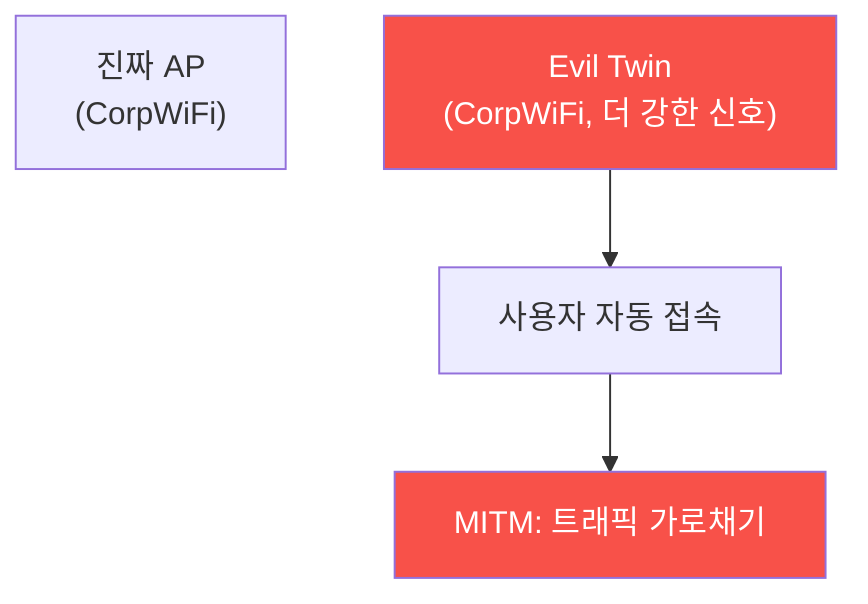

# physical-pentest W07 — WiFi 해킹 심화: Evil Twin·Rogue AP·MITM

> **본 주차의 한 줄 요약**
>
> W06이 "비밀번호 크랙"이었다면, W07은 사용자를 **가짜 AP로 유인**해 트래픽을 가로채는 심화 공격을 다룬다.
> **Rogue AP**(로그 AP)는 공격자가 세운 **미인가 접근점**이고, **Evil Twin**(이블 트윈)은 그중에서도 **정상
> AP를 똑같이 흉내낸** 가짜다 — 같은 SSID(네트워크 이름)·더 강한 신호로 세우면, 사용자·기기가 **진짜인 줄
> 알고 접속**한다. 접속하면 공격자가 중간에서 모든 트래픽을 보는 **MITM(Man-in-the-Middle)** 이 된다: 자격
> 증명 탈취, 세션 하이재킹, 페이지 변조, HTTPS 다운그레이드 시도. 특히 **자동 접속**(기기가 아는 SSID에
> 자동 연결) 습성을 악용한다 — 카페에서 접속했던 "FreeWiFi"를 어디서든 흉내내면 자동 연결. 방어: (1) **802.1X
> + 서버 인증서 검증**(기기가 AP의 진위를 인증서로 확인 → Evil Twin은 유효 인증서 없어 탄로), (2) **WIDS**
> (같은 SSID·다른 BSSID·비정상 신호 탐지), (3) **VPN**(가짜 AP에 붙어도 트래픽 암호화로 MITM 무력), (4) **사용자
> 인식**(공용 WiFi 신뢰 금지·자동 접속 끄기), (5) **HSTS·인증서 고정**(HTTPS 다운그레이드 방어).
>
> ⚠️ **el34 범위**: Evil Twin은 실물 무선 하드웨어가 필요하다. 본 실습은 **로그 AP·Evil Twin·MITM 탐지 로직의
> 결정론 시뮬 + GPU 분석**으로 한다.
>
> **한 줄 결론**: Evil Twin은 정상 AP를 흉내내 사용자를 유인, MITM으로 트래픽을 가로챈다. 방어 = **802.1X 서버
> 인증서 검증 + WIDS + VPN + 사용자 인식**. 가짜 AP에 붙어도 암호화·인증으로 MITM을 무력화한다.

---

## 학습 목표

본 주차 종료 시 학생은 다음 5가지를 **본인 손으로** 할 수 있어야 한다.

1. **Rogue AP·Evil Twin·MITM**의 관계를 설명한다.
2. **Evil Twin**(SSID 중복·BSSID 이상)을 탐지한다(EVIL_TWIN_DETECTED).
3. **MITM 정황**(인증서 불일치·다운그레이드)을 탐지한다(MITM_DETECTED).
4. **802.1X·VPN·WIDS**로 방어한다(PROTECTED).
5. 자동 접속 습성이 위험한 이유를 설명한다.

> **이 주차의 시선** — 진짜인 척하는 가짜 AP를, 인증·암호화·탐지로 무력화한다.

---

## 0. 용어 해설 (Evil Twin)

| 용어 | 영문 | 뜻 | 비유 |
|------|------|----|------|
| **Rogue AP** | Rogue AP | 미인가 접근점 | 무허가 가게 |
| **Evil Twin** | Evil Twin | 정상 흉내 가짜 AP | 쌍둥이 사칭 |
| **MITM** | Man-in-the-Middle | 중간자 가로채기 | 도청 중계 |
| **BSSID** | BSSID | AP의 MAC 주소 | AP 지문 |
| **인증서 고정** | Cert Pinning | 특정 인증서만 신뢰 | 지정 인감 |

> **헷갈리기 쉬운 한 쌍** — *SSID* 는 "네트워크 이름(같을 수 있음)", *BSSID* 는 "AP의 고유 MAC"이다. Evil Twin은
> SSID는 같아도 BSSID가 다르다 — 탐지 단서.

---

## 0.5 신입생 친화 핵심 개념

### 0.5.1 Evil Twin — 진짜인 척

같은 이름(SSID)·더 강한 신호로 가짜 AP를 세우면, 기기가 **진짜인 줄 알고 붙는다**. 붙으면 모든 트래픽이
공격자를 지난다(MITM).

### 0.5.2 MITM — 중간에서 다 본다

Evil Twin에 붙으면 공격자는 **중간자**가 된다: 로그인 자격 탈취, 세션 쿠키 훔치기, 페이지 변조(가짜 로그인),
HTTPS를 HTTP로 **다운그레이드** 시도. HTTPS·인증서가 방어선이지만, 사용자가 경고를 무시하면 뚫린다.

### 0.5.3 자동 접속의 함정

기기는 **한 번 접속한 SSID를 기억**해 어디서든 자동 연결한다. 카페 "FreeWiFi"에 붙었던 폰은, 공격자가 그
이름으로 AP를 세우면 **자동으로 붙는다** — 사용자가 몰라도. 방어: **자동 접속 끄기**, 알려진 네트워크만 수동
연결.

### 0.5.4 탐지 — SSID·BSSID·신호

- **SSID 중복 + BSSID 상이**: 같은 이름인데 **다른 MAC(BSSID)** 의 AP가 나타남 = Evil Twin 의심.
- **비정상 신호**: 갑자기 나타난 강한 신호의 동일 SSID.
- **인증서 불일치**: 802.1X에서 AP가 **유효 서버 인증서 없음** → 가짜 탄로.
WIDS가 이런 이상을 감시.

### 0.5.5 방어 — 인증·암호화·인식

- **802.1X + 서버 인증서 검증**: 기기가 AP의 **진위를 인증서로 확인** → Evil Twin은 유효 인증서가 없어 접속
  실패(가장 강력).
- **VPN**: 가짜 AP에 붙어도 **트래픽 암호화** → MITM이 봐도 못 읽음.
- **HSTS·인증서 고정**: HTTPS 다운그레이드·위조 인증서 방어.
- **사용자 인식**: 공용 WiFi 신뢰 금지, 자동 접속 끄기, 인증서 경고 무시 금지.

---

## 1. 실습 안내 (5 미션)

실행 위치 el34 **호스트**(`ssh ccc@{{TARGET_IP}}`), GPU `http://211.170.162.139:10934`.
⚠️ 물리 무선 하드웨어 필요 → 본 실습은 Evil Twin·MITM 탐지 로직 결정론 시뮬 + GPU 분석.

### STEP 1 — GPU 헬스체크 → GEN_OK
### STEP 2 — Evil Twin 탐지 → EVIL_TWIN_DETECTED
### STEP 3 — MITM 정황 → MITM_DETECTED
### STEP 4 — 802.1X·VPN 방어 → PROTECTED
### STEP 5 — 종합 → Assessment

---

## 2. 흔한 오해·관제자 노트

- **"이름 맞으면 진짜"** — SSID는 위조된다. BSSID·인증서로 확인.
- **"HTTPS면 안전"** — 다운그레이드·경고 무시로 뚫린다. HSTS·VPN.
- **"공용 WiFi 편함"** — Evil Twin 위험. VPN·자동접속 끄기.
- **관제 관점** — 802.1X 서버 인증서 검증인지, WIDS로 SSID 중복·로그 AP를 탐지하는지, VPN 정책·사용자 교육이
  있는지 점검한다. 무선 MITM은 인증+암호화로 무력화.

---

## 3. 다음 주차 (W08) 예고 — 중간 평가: 종합 물리 침투 시나리오

W01~W07(개론·사회공학·RFID·USB·임플란트·WiFi)을 종합한 **중간 평가** — 다단계 물리 침투 시나리오를 분석·
평가하는 종합 실습이다.
