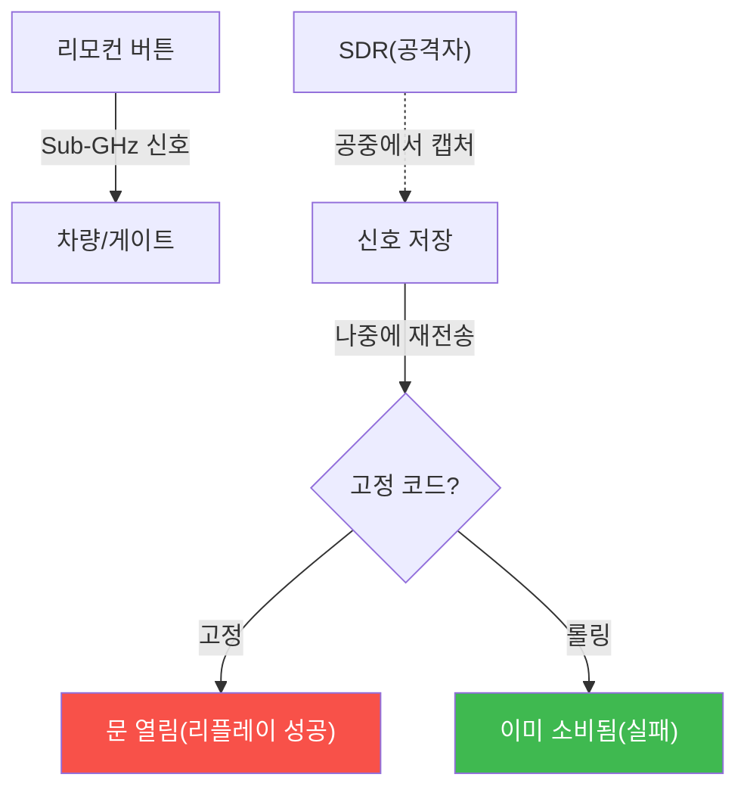

# physical-pentest W09 — RF 해킹: SDR·Sub-GHz·리플레이 공격·롤링 코드 방어

> **본 주차의 한 줄 요약**
>
> W09는 **RF(무선 주파수) 해킹**을 다룬다. 차량 키·차고 문·게이트 리모컨·일부 도어락은 **Sub-GHz(315/433MHz)
> 무선 신호**로 동작한다. 공격자는 **SDR(Software Defined Radio, 소프트웨어 정의 라디오)** — 저렴한 무선
> 수신기로 이 신호를 **캡처하고 재전송(리플레이)** 한다. 결정적 취약점은 **고정 코드(fixed code)**: 리모컨이
> 항상 **같은 신호**를 보내면, 한 번 캡처한 신호를 나중에 재전송해 문을 연다(리플레이 공격). 반면 **롤링 코드
> (rolling code)** 는 매번 **다른 코드**(동기화된 카운터·암호)를 써서, 캡처한 신호가 **이미 소비돼** 재전송이
> 안 통한다. 더 정교한 공격(RollJam 등)도 있지만, 근본 방어는 **롤링 코드+암호화**다. 또 **재밍**(신호 방해)으로
> 리모컨을 무력화하기도 한다. 방어: (1) **롤링 코드**(고정 코드 시스템 교체), (2) **암호화·인증**, (3) **재밍
> 탐지**(신호 이상), (4) 중요 접근은 RF 단독 의존 금지(다중 인증). RF는 공중에 노출되니, **캡처해도 재사용 못
> 하게** 하는 것이 핵심이다.
>
> ⚠️ **el34 범위**: 실제 RF 캡처·리플레이는 SDR 하드웨어와 무선 신호가 필요하다. 본 실습은 **리플레이 취약성
> 판정(고정 vs 롤링)·재밍 탐지·방어 설계**를 결정론 시뮬로 익힌다(물리 RF는 인가된 하드웨어 필요).
>
> **한 줄 결론**: RF 해킹은 Sub-GHz 신호를 SDR로 캡처해 **리플레이**한다. **고정 코드**는 취약, **롤링 코드**는
> 재전송이 안 통한다. 방어 = **롤링 코드+암호화+재밍 탐지+다중 인증**. 캡처해도 재사용 못 하게.

---

## 학습 목표

본 주차 종료 시 학생은 다음 5가지를 **본인 손으로** 할 수 있어야 한다.

1. **RF 리플레이 공격**의 원리를 설명한다.
2. **고정 코드 리플레이 취약성**을 판정한다(REPLAY_DETECTED).
3. **코드 방식**(고정 vs 롤링)을 평가한다(CODE_ASSESSED).
4. **롤링 코드·암호화**로 강화한다(RF_HARDENED).
5. RF가 공중 노출인 위험을 설명한다.

> **이 주차의 시선** — 공중에 퍼지는 RF 신호를, 캡처해도 재사용 못 하게 만들어 막는다.

---

## 0. 용어 해설 (RF 해킹)

| 용어 | 영문 | 뜻 | 비유 |
|------|------|----|------|
| **SDR** | Software Defined Radio | 소프트웨어 무선 수신기 | 만능 라디오 |
| **Sub-GHz** | — | 315/433MHz 대역 | 리모컨 주파수 |
| **리플레이** | Replay | 캡처 신호 재전송 | 녹음 재생 |
| **고정 코드** | Fixed Code | 항상 같은 신호 | 고정 열쇠 |
| **롤링 코드** | Rolling Code | 매번 다른 코드 | 일회용 코드 |

> **헷갈리기 쉬운 한 쌍** — *고정 코드* 는 "같은 신호(리플레이 취약)", *롤링 코드* 는 "매번 다른 코드(리플레이
> 방어)"다. 코드 방식이 보안을 결정한다.

---

## 0.5 신입생 친화 핵심 개념

### 0.5.1 RF 리플레이 원리

신호는 공중에 퍼진다. SDR로 캡처해 재전송 — 고정 코드면 열리고, 롤링 코드면 안 통한다.

### 0.5.2 고정 코드 vs 롤링 코드

- **고정 코드**: 리모컨이 항상 **같은 신호**. 한 번 캡처하면 무한 재사용. 오래된·싼 시스템에 흔함 — 명백히 취약.
- **롤링 코드**: 리모컨과 수신기가 **동기화된 카운터**를 공유해 매번 다른 코드. 캡처한 코드는 **이미 소비**돼
  재전송이 거부됨. 현대 차량 키의 표준.
같은 "무선 리모컨"도 코드 방식이 보안을 가른다(W03 카드 암호화와 같은 구도).

### 0.5.3 정교한 공격과 한계

RollJam 같은 공격은 재밍으로 신호를 가로채 롤링 코드를 **한 번 훔쳐** 재사용하기도 한다. 하지만 이는 정교하고
조건이 까다롭다. 근본 방어(롤링 코드+암호화+재밍 탐지)로 대부분의 리플레이를 막는다. 중요 접근은 RF 단독에
의존하지 않는다(다중 인증).

### 0.5.4 방어 — 롤링 코드·암호화·재밍 탐지

- **롤링 코드**: 고정 코드 시스템을 롤링 코드로 교체. 리플레이 원천 차단.
- **암호화·인증**: 신호를 암호화·인증해 위조·재사용 방지.
- **재밍 탐지**: 비정상 신호 방해(재밍) 탐지 → RollJam류 대응.
- **다중 인증**: 중요 문은 RF+PIN/카드. RF 하나에 의존 금지.
캡처해도 **재사용 못 하게**가 RF 방어의 핵심이다.

### 0.5.5 el34 맥락

실제 RF는 SDR 하드웨어·신호가 필요하다. 본 실습은 **리플레이 취약성 판정(고정 vs 롤링)·재밍 탐지·방어 설계**를
결정론 시뮬로 익힌다. 물리 RF 실습은 인가된 하드웨어·환경이 필요함을 명시한다.

---

## 1. 실습 안내 (5 미션)

실행 위치 el34 **호스트**(`ssh ccc@{{TARGET_IP}}`), GPU `http://211.170.162.139:10934`.
⚠️ 물리 RF는 SDR 하드웨어 필요 → 본 실습은 리플레이 취약성·방어 로직 결정론 시뮬.

### STEP 1 — GPU 헬스체크 → GEN_OK
### STEP 2 — 리플레이 취약성 → REPLAY_DETECTED
### STEP 3 — 코드 방식 평가 → CODE_ASSESSED
### STEP 4 — RF 강화 → RF_HARDENED
### STEP 5 — 종합 → Assessment

---

## 2. 흔한 오해·관제자 노트

- **"무선 리모컨은 안전"** — 고정 코드는 리플레이 취약. 롤링 코드로.
- **"롤링 코드면 완벽"** — RollJam류 정교 공격 있음. 재밍 탐지·다중 인증 보완.
- **"RF는 근거리라 안전"** — SDR+안테나로 원거리 캡처. 코드 방식이 관건.
- **관제 관점** — RF 접근 시스템이 롤링 코드·암호화인지, 재밍 탐지가 있는지, 중요 접근에 다중 인증인지 점검한다.
  RF는 공중 노출 — 캡처 후 재사용 방지가 핵심.

---

## 3. 다음 주차 (W10) 예고 — 잠금장치/물리 접근

W09가 "무선 신호 해킹"이었다면, W10은 **물리 잠금장치** — 락픽·바이패스·CCTV 우회 같은 직접 물리 접근 기법과
방어(고보안 잠금·감시)를 다룬다.
