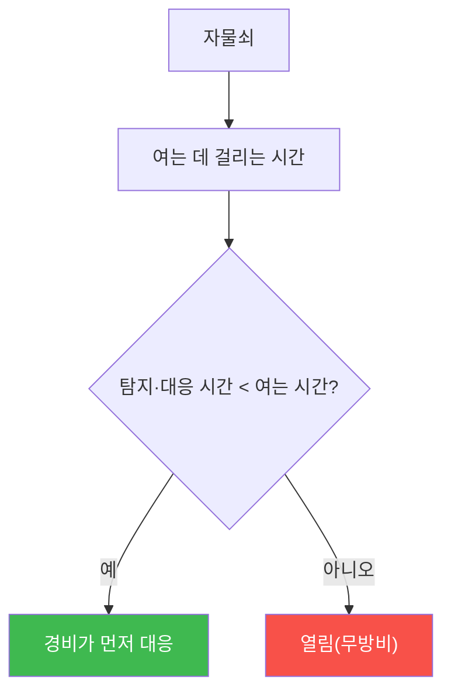

# physical-pentest W10 — 잠금장치/물리 접근: 락픽·바이패스·CCTV 우회·고보안 잠금

> **본 주차의 한 줄 요약**
>
> W10은 **물리 잠금장치**와 직접 접근을 다룬다. 자물쇠는 물리 보안의 상징이지만, **많은 자물쇠가 생각보다 약하다**.
> ① **락픽(lock picking)** — 표준 핀 텀블러 자물쇠는 픽·텐션으로 몇 분(숙련자는 초)에 열린다. ② **바이패스
> (bypass)** — 자물쇠를 안 따고 **우회**한다: 래치를 카드로 밀기(shimming), 문틈으로 손잡이 당기기(under-door
> tool), 경첩 제거, 요청-퇴장 센서 악용. ③ **범핑(bumping)** — 범프 키로 핀을 튕겨 여는 기법. ④ **CCTV 우회**
> — 사각지대·조명·타이밍을 이용. 핵심 통찰: **자물쇠는 시간을 벌 뿐, 무한 방어가 아니다** — 충분한 시간·기술이
> 있으면 대부분 열린다. 그래서 방어는 **단일 자물쇠가 아니라 겹층**: (1) **고보안 잠금**(픽·범핑 저항 등급,
> 예: 등급 인증 자물쇠), (2) **바이패스 방지**(가드 플레이트·경첩 보호·센서 위치), (3) **감시·경보**(CCTV
> 사각지대 제거·문 열림 경보·모션), (4) **탐지+대응 시간**(자물쇠가 버티는 동안 경비가 대응). 자물쇠의 목적은
> "못 열게"가 아니라 "**여는 데 충분한 시간이 걸려 탐지·대응된다**"이다.
>
> ⚠️ **el34 범위**: 실제 락픽·바이패스는 물리 자물쇠·도구가 필요하다. 본 실습은 **잠금 보안 등급 평가·바이패스
> 취약성 판정·겹층 방어 설계**를 결정론 시뮬로 익힌다(물리 실습은 인가된 환경·장비 필요).
>
> **한 줄 결론**: 자물쇠는 무한 방어가 아니라 **시간 벌기**다. 대부분 열리므로, **고보안 잠금+바이패스 방지+
> 감시·경보+대응 시간**의 겹층으로 "여는 동안 탐지·대응"되게 한다.

---

## 학습 목표

본 주차 종료 시 학생은 다음 5가지를 **본인 손으로** 할 수 있어야 한다.

1. 잠금장치가 **시간 벌기**인 이유를 설명한다.
2. **잠금 보안 등급**을 평가한다(LOCK_ASSESSED).
3. **바이패스 취약성**을 판정한다(BYPASS_FOUND).
4. **겹층 물리 방어**로 강화한다(PHYSICAL_HARDENED).
5. CCTV·감시가 자물쇠를 보완하는 이유를 설명한다.

> **이 주차의 시선** — 자물쇠는 뚫린다는 전제 위에, 겹층과 감시로 실질 방어를 만든다.

---

## 0. 용어 해설 (잠금장치)

| 용어 | 영문 | 뜻 | 비유 |
|------|------|----|------|
| **락픽** | Lock Picking | 픽으로 열기 | 핀 맞추기 |
| **바이패스** | Bypass | 안 따고 우회 | 옆으로 돌아가기 |
| **범핑** | Bumping | 범프 키로 튕기기 | 충격으로 열기 |
| **고보안 잠금** | High-Security Lock | 픽·범핑 저항 등급 | 특수 자물쇠 |
| **가드 플레이트** | Guard Plate | 래치 보호판 | 방어판 |

> **헷갈리기 쉬운 한 쌍** — *락픽* 은 "자물쇠를 정상 방식으로 조작해 열기", *바이패스* 는 "자물쇠를 무시하고
> 우회"다. 방어도 각각 다르다(픽 저항 vs 가드 플레이트).

---

## 0.5 핵심 개념

### 0.5.1 자물쇠는 시간을 번다

자물쇠의 가치는 "못 열게"가 아니라 "**여는 데 충분한 시간이 걸려 그 사이 탐지·대응**"이다. 약한 자물쇠는 순식간에
열려 대응할 새가 없다.

### 0.5.2 락픽·범핑 — 자물쇠 조작

표준 핀 텀블러는 픽+텐션으로 핀을 하나씩 세팅해 연다. 범핑은 범프 키로 핀을 **동시에 튕겨** 순간에 연다. 저렴한
자물쇠는 몇 초~몇 분. **고보안 잠금**(보안 핀·스풀 핀·픽 저항 설계)은 훨씬 오래 걸리거나 사실상 불가.

### 0.5.3 바이패스 — 자물쇠 무시

자물쇠 자체가 강해도 **주변이 약하면** 우회된다: (1) **shimming**(래치를 카드로 밀기), (2) **under-door tool**
(문 밑으로 손잡이 조작), (3) **경첩 제거**, (4) **REX 센서 악용**(퇴장 모션 센서를 밖에서 유발). 가드 플레이트·
경첩 보호·센서 위치로 막는다.

### 0.5.4 CCTV·감시 — 자물쇠의 보완

자물쇠가 시간을 버는 동안 **감시가 탐지**해야 대응이 된다: CCTV(사각지대 제거·조명), 문 열림 경보, 모션 감지.
공격자는 CCTV 사각지대·타이밍을 노리므로, **커버리지의 빈틈**을 없애야 한다. 자물쇠(시간)+감시(탐지)+경비
(대응)의 삼박자.

### 0.5.5 겹층 물리 방어

단일 자물쇠에 의존하지 않는다: **고보안 잠금**(픽·범핑·바이패스 저항)+**감시**(CCTV·경보)+**대응**(경비·출동)+
**심층 방어**(외곽→건물→층→방, 각 겹에 통제). 한 겹 뚫려도 다음 겹에서 시간·탐지. 물리 보안도 사이버처럼
겹층(defense in depth)이다.

---

## 1. 실습 안내 (5 미션)

실행 위치 el34 **호스트**(`ssh ccc@{{TARGET_IP}}`), GPU `http://211.170.162.139:10934`.
⚠️ 물리 락픽·바이패스는 장비 필요 → 본 실습은 잠금 등급·바이패스·겹층 방어 로직 결정론 시뮬.

### STEP 1 — GPU 헬스체크 → GEN_OK
### STEP 2 — 잠금 보안 등급 평가 → LOCK_ASSESSED
### STEP 3 — 바이패스 취약성 → BYPASS_FOUND
### STEP 4 — 겹층 물리 방어 → PHYSICAL_HARDENED
### STEP 5 — 종합 → Assessment

---

## 1.5 과제 (제출물)

- **A. 잠금 보안 등급 평가 실증 (필수, 40점)** — `LOCK_ASSESSED` 단계를 직접 수행해 실제 명령·출력(또는 아티팩트 분석 결과)을 캡처하고, 무엇을 근거로 판정했는지 서술한다.
- **B. 바이패스 취약성 분석 (필수, 30점)** — `BYPASS_FOUND` 단계를 직접 수행해 실제 명령·출력(또는 아티팩트 분석 결과)을 캡처하고, 무엇을 근거로 판정했는지 서술한다.
- **C. 겹층 물리 방어 방어 설계 (필수, 30점)** — `PHYSICAL_HARDENED` 단계를 직접 수행해 실제 명령·출력(또는 아티팩트 분석 결과)을 캡처하고, 무엇을 근거로 판정했는지 서술한다.

## 1.6 평가 기준

| 항목 | 미흡(0) | 보통 | 우수 |
|------|---------|------|------|
| 탐지/실증(LOCK_ASSESSED) | 미수행 | 마커 도출 | 근거·해석·재현까지 |
| 분석(BYPASS_FOUND) | 미수행 | 마커 도출 | 근거·해석·재현까지 |
| 방어(PHYSICAL_HARDENED) | 미수행 | 마커 도출 | 근거·해석·재현까지 |

## 1.7 핵심 정리 (1줄씩)

- 이번 주 주제: **잠금장치/물리 접근: 락픽·바이패스·CCTV 우회·고보안 잠금**.
- **잠금 보안 등급 평가**(`LOCK_ASSESSED`)
- **바이패스 취약성**(`BYPASS_FOUND`)
- **겹층 물리 방어**(`PHYSICAL_HARDENED`)
- 공격을 이해한 만큼 **방어의 우선순위**가 분명해진다 — 탐지 근거와 완화를 함께 익힌다.

---

## 2. 흔한 오해·블루팀 노트

- **"자물쇠면 안전"** — 대부분 열린다. 시간 벌기+감시+대응.
- **"강한 자물쇠면 끝"** — 바이패스로 우회. 가드 플레이트·경첩 보호.
- **"CCTV 있으니 됨"** — 사각지대·조명 빈틈. 커버리지 점검.
- **관제 관점** — 잠금이 고보안 등급인지, 바이패스 방지(가드·경첩)가 있는지, CCTV 사각지대·문 경보가 있는지,
  탐지·대응 시간이 여는 시간보다 짧은지 점검한다. 물리 방어는 겹층+감시.

---

## 3. 다음 주차 (W11) 예고 — 감시 시스템 해킹: IP Camera·RTSP·기본 비밀번호

W10이 "물리 잠금"이었다면, W11은 방어자의 눈인 **감시 시스템**을 공격자가 노리는 경우 — IP 카메라 기본 비밀번호·
RTSP 노출 같은 네트워크 취약점과 방어를 다룬다. (네트워크 요소라 개념+시뮬로.)
