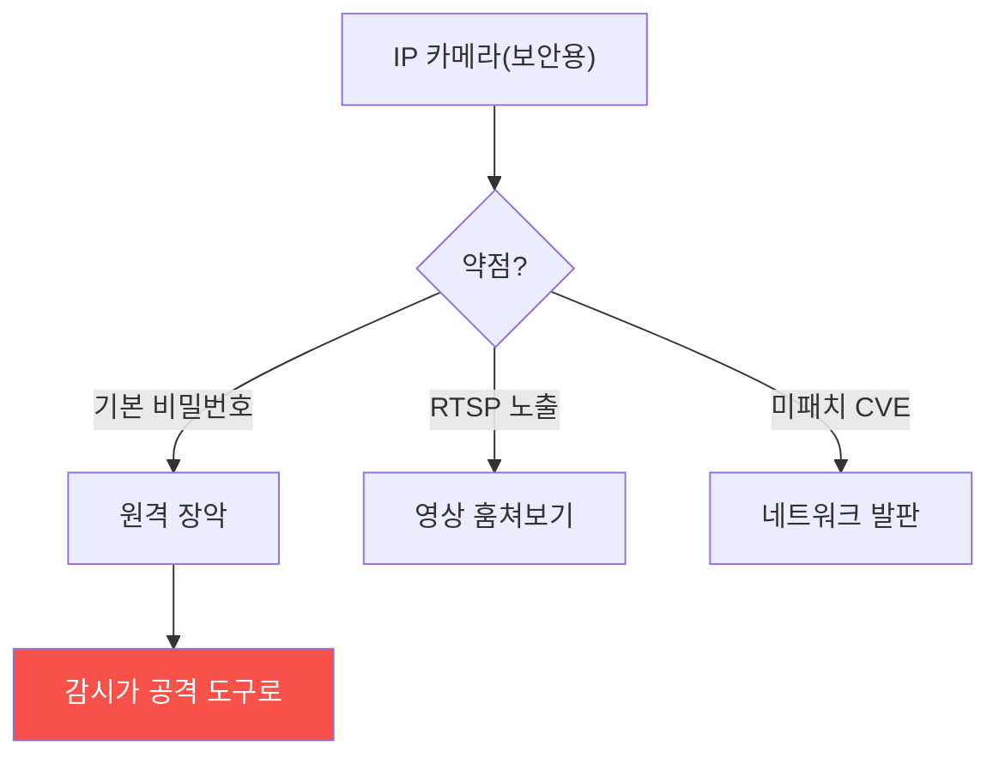

# physical-pentest W11 — 감시 시스템 해킹: IP Camera·RTSP·기본 비밀번호·펌웨어

> **본 주차의 한 줄 요약**
>
> W11은 방어자의 눈인 **감시 시스템(IP 카메라·NVR)** 이 공격자의 표적이 되는 경우를 다룬다. 역설적으로, 보안을
> 위해 설치한 카메라가 **가장 약한 IoT 장치**인 경우가 많다. 문제: ① **기본 비밀번호** — 수많은 IP 카메라가
> `admin/admin`·`admin/12345` 같은 **공장 초기 자격**을 그대로 쓴다(Mirai 봇넷이 이걸로 수십만 대 장악). ②
> **RTSP 노출** — 카메라 영상 스트림 프로토콜(RTSP, 554 포트)이 **인증 없이·인터넷에 노출**되면 누구나 영상을
> 본다(Shodan으로 검색됨). ③ **미패치 펌웨어** — 알려진 CVE가 방치돼 원격 장악. 공격자가 감시 카메라를 장악하면:
> **영상 훔쳐보기**(정찰·프라이버시), **영상 조작·정지**(물리 침투 은폐), **네트워크 발판**(내부망 침투). 감시가
> 방어에서 공격 도구로 뒤집힌다. 방어는 **네트워크 보안의 기본**: (1) **기본 비밀번호 즉시 변경**(강한 자격),
> (2) **RTSP 인증·비노출**(인터넷 노출 금지·인증 필수), (3) **펌웨어 패치**, (4) **네트워크 세그먼트**(카메라를
> 별도 VLAN·인터넷 차단). 이 주는 물리 과목 안의 네트워크 요소로, el34의 네트워크 개념(기본 자격·노출 서비스)과
> 직결된다.
>
> ⚠️ **el34 범위**: 실제 IP 카메라는 el34에 없다. 본 실습은 **기본 자격 탐지·RTSP 노출 판정·카메라 강화**를
> 결정론 시뮬로 익힌다(네트워크 개념은 el34 웹 서비스 보안과 상통).
>
> **한 줄 결론**: 감시 카메라는 흔히 **기본 비밀번호·RTSP 노출·미패치**로 가장 약한 IoT다. 장악되면 감시가
> 공격 도구로 뒤집힌다. 방어 = **자격 변경 + RTSP 인증/비노출 + 패치 + 네트워크 세그먼트**.

---

## 학습 목표

본 주차 종료 시 학생은 다음 5가지를 **본인 손으로** 할 수 있어야 한다.

1. 감시 시스템이 **약한 IoT**인 이유를 설명한다.
2. **기본 비밀번호**를 탐지한다(DEFAULT_CREDS_FOUND).
3. **RTSP 노출**을 판정한다(RTSP_EXPOSED).
4. **자격·RTSP·패치·세그먼트**로 강화한다(CAMERA_HARDENED).
5. 감시가 공격 도구로 뒤집히는 위험을 설명한다.

> **이 주차의 시선** — 방어자의 눈(카메라)이 약점이 되지 않게, 네트워크 기본으로 지킨다.

---

## 0. 용어 해설 (감시 시스템)

| 용어 | 영문 | 뜻 | 비유 |
|------|------|----|------|
| **IP 카메라** | IP Camera | 네트워크 감시 카메라 | 인터넷 눈 |
| **RTSP** | Real-Time Streaming Protocol | 영상 스트림 프로토콜 | 영상 채널 |
| **기본 비밀번호** | Default Password | 공장 초기 자격 | 초기 열쇠 |
| **NVR** | Network Video Recorder | 영상 저장 장치 | 녹화기 |
| **네트워크 세그먼트** | Segmentation | 망 분리 | 격리 구역 |

> **헷갈리기 쉬운 한 쌍** — *물리 CCTV* 는 "폐쇄 회로(격리)", *IP 카메라* 는 "네트워크 연결(원격 접근 가능)"이다.
> 후자는 네트워크 보안이 필요.

---

## 0.5 핵심 개념

### 0.5.1 감시가 약점이 되는 역설

보안을 위한 카메라가 약하면, 공격자가 장악해 **역으로** 정찰·은폐·침투에 쓴다. 방어 장치가 공격 표면이 되는 역설.

### 0.5.2 기본 비밀번호 — 최악의 약점

수많은 IP 카메라가 `admin/admin` 같은 **공장 자격**을 안 바꾸고 쓴다. 공격자는 알려진 기본 자격 목록으로
**자동 로그인**한다(Mirai 봇넷이 이 방식으로 IoT 수십만 대를 장악해 대규모 DDoS). 가장 흔하고 가장 치명적 —
그리고 가장 쉬운 방어(비밀번호 변경).

### 0.5.3 RTSP 노출 — 누구나 보는 영상

카메라 영상은 **RTSP**(554 포트)로 스트리밍된다. 이게 **인증 없이·인터넷에 노출**되면, Shodan 같은 검색엔진에
잡혀 **전 세계 누구나** 영상을 본다. 프라이버시 참사이자 정찰 도구. RTSP는 반드시 **인증**하고 **인터넷에 노출
안 함**.

### 0.5.4 방어 — 네트워크 보안 기본

- **자격 변경**: 기본 비밀번호 **즉시** 강한 것으로. 모든 카메라·NVR.
- **RTSP 인증·비노출**: RTSP에 인증 필수, 인터넷 노출 차단(방화벽·VPN만).
- **펌웨어 패치**: 알려진 CVE 패치. 지원 종료 장치는 교체.
- **네트워크 세그먼트**: 카메라를 **별도 VLAN**에, 인터넷·내부망과 분리. 장악돼도 발판 제한.
사이버 보안의 기본을 물리 감시 장치에도 적용한다.

### 0.5.5 el34 맥락

el34엔 IP 카메라가 없지만, **기본 자격·노출 서비스·미패치**는 el34 웹 서비스 보안과 동일 개념이다. 본 실습은
**기본 자격 탐지·RTSP 노출 판정·강화**를 결정론 시뮬로 익힌다. 네트워크 보안 원리는 카메라·웹·IoT에 공통 적용됨을
이해한다.

---

## 1. 실습 안내 (5 미션)

실행 위치 el34 **호스트**(`ssh ccc@{{TARGET_IP}}`), GPU `http://211.170.162.139:10934`.
⚠️ IP 카메라는 el34에 없음 → 본 실습은 기본 자격·RTSP 노출·강화 로직 결정론 시뮬.

### STEP 1 — GPU 헬스체크 → GEN_OK
### STEP 2 — 기본 비밀번호 탐지 → DEFAULT_CREDS_FOUND
### STEP 3 — RTSP 노출 판정 → RTSP_EXPOSED
### STEP 4 — 카메라 강화 → CAMERA_HARDENED
### STEP 5 — 종합 → Assessment

---

## 1.5 과제 (제출물)

- **A. 기본 비밀번호 탐지 실증 (필수, 40점)** — `DEFAULT_CREDS_FOUND` 단계를 직접 수행해 실제 명령·출력(또는 아티팩트 분석 결과)을 캡처하고, 무엇을 근거로 판정했는지 서술한다.
- **B. RTSP 노출 판정 분석 (필수, 30점)** — `RTSP_EXPOSED` 단계를 직접 수행해 실제 명령·출력(또는 아티팩트 분석 결과)을 캡처하고, 무엇을 근거로 판정했는지 서술한다.
- **C. 카메라 강화 방어 설계 (필수, 30점)** — `CAMERA_HARDENED` 단계를 직접 수행해 실제 명령·출력(또는 아티팩트 분석 결과)을 캡처하고, 무엇을 근거로 판정했는지 서술한다.

## 1.6 평가 기준

| 항목 | 미흡(0) | 보통 | 우수 |
|------|---------|------|------|
| 탐지/실증(DEFAULT_CREDS_FOUND) | 미수행 | 마커 도출 | 근거·해석·재현까지 |
| 분석(RTSP_EXPOSED) | 미수행 | 마커 도출 | 근거·해석·재현까지 |
| 방어(CAMERA_HARDENED) | 미수행 | 마커 도출 | 근거·해석·재현까지 |

## 1.7 핵심 정리 (1줄씩)

- 이번 주 주제: **감시 시스템 해킹: IP Camera·RTSP·기본 비밀번호·펌웨어**.
- **기본 비밀번호 탐지**(`DEFAULT_CREDS_FOUND`)
- **RTSP 노출 판정**(`RTSP_EXPOSED`)
- **카메라 강화**(`CAMERA_HARDENED`)
- 공격을 이해한 만큼 **방어의 우선순위**가 분명해진다 — 탐지 근거와 완화를 함께 익힌다.

---

## 2. 흔한 오해·블루팀 노트

- **"카메라는 보안 장치라 안전"** — 흔히 가장 약한 IoT. 장악되면 공격 도구.
- **"내부망이라 RTSP 열어도 됨"** — 노출·미인증은 위험. 인증+비노출.
- **"설치하면 끝"** — 기본 자격·미패치 방치가 흔함. 자격 변경·패치 필수.
- **관제 관점** — 카메라 기본 자격 변경·RTSP 인증/비노출·펌웨어 패치·네트워크 세그먼트가 됐는지 점검한다.
  감시 장치도 IoT 자산으로 관리 — 방어의 눈이 약점이 안 되게.

---

## 3. 다음 주차 (W12) 예고 — 물리 정보 수집: OSINT·덤프스터 다이빙·숄더 서핑

W11이 "감시 시스템 공격"이었다면, W12는 킬체인의 첫 단계 **정보 수집** — OSINT·덤프스터 다이빙·숄더 서핑으로
대상 정보를 모으는 기법과, 정보 노출 최소화 방어를 다룬다.
