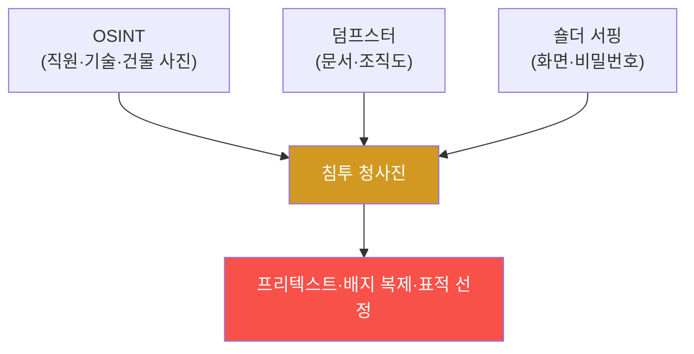

# physical-pentest W12 — 물리 정보 수집: OSINT·덤프스터 다이빙·숄더 서핑

> **본 주차의 한 줄 요약**
>
> W12는 물리 침투 킬체인의 **첫 단계이자 토대인 정보 수집**을 다룬다. 좋은 공격은 **철저한 정찰**에서 시작한다 —
> 대상을 알수록 침투가 쉽다. 물리 정보 수집 기법: ① **OSINT(공개 출처 정보)** — 웹사이트·SNS·구인공고·사진에서
> 조직 정보를 캔다(직원 이름·이메일 형식·기술 스택·건물 사진·심지어 **사진 속 사원증**으로 배지 디자인 파악),
> ② **덤프스터 다이빙(dumpster diving)** — 버린 쓰레기에서 문서·메모·오래된 하드웨어를 뒤진다(파쇄 안 된 문서엔
> 비밀번호·조직도·계약서), ③ **숄더 서핑(shoulder surfing)** — 어깨너머로 화면·비밀번호·배지를 엿본다(카페·
> 로비·엘리베이터). 이 정보들이 모여 **프리텍스트(W02)·배지 복제(W03)·표적 선정**의 재료가 된다. 무서운 점:
> 각 정보 조각은 **무해해 보이지만**, 모으면 침투 청사진이 된다. 방어는 **정보 노출 최소화**: (1) **공개 정보
> 관리**(SNS·구인공고에 과도한 세부 자제, 사진 검열), (2) **문서 파쇄·안전 폐기**(민감 문서·하드웨어), (3)
> **화면·정보 보호**(프라이버시 필터·클린 데스크·엿보기 방지), (4) **직원 인식**(무심코 흘리는 정보 주의).
> 정찰을 어렵게 하면 나머지 킬체인도 어려워진다(W08 조기 차단).
>
> ⚠️ **el34 범위**: 실제 OSINT·덤프스터는 대상·현장이 필요하다. 본 실습은 **OSINT 노출 분석·정보 위험 평가·
> 노출 최소화**를 결정론 시뮬로 익힌다(실제 정보 수집은 인가된 대상 한정).
>
> **한 줄 결론**: 물리 침투는 정보 수집에서 시작한다 — OSINT·덤프스터·숄더 서핑으로 무해해 보이는 조각을 모아
> 침투 청사진을 만든다. 방어 = **정보 노출 최소화**(공개 정보 관리·파쇄·화면 보호·인식).

---

## 학습 목표

본 주차 종료 시 학생은 다음 5가지를 **본인 손으로** 할 수 있어야 한다.

1. **정보 수집**이 침투의 토대인 이유를 설명한다.
2. **OSINT 노출**(공개 정보 조각)을 분석한다(FOOTPRINT_MAPPED).
3. 정보 조각의 **침투 활용 위험**을 평가한다(EXPOSURE_ASSESSED).
4. **정보 노출 최소화**로 방어한다(EXPOSURE_REDUCED).
5. 무해한 조각이 청사진이 되는 위험을 설명한다.

> **이 주차의 시선** — 흩어진 무해한 정보가 침투 청사진이 되기 전에, 노출을 최소화한다.

---

## 0. 용어 해설 (정보 수집)

| 용어 | 영문 | 뜻 | 비유 |
|------|------|----|------|
| **OSINT** | Open Source Intelligence | 공개 출처 정보 | 공개 자료 조사 |
| **덤프스터 다이빙** | Dumpster Diving | 쓰레기 뒤지기 | 버린 것 조사 |
| **숄더 서핑** | Shoulder Surfing | 어깨너머 엿보기 | 훔쳐보기 |
| **디지털 발자국** | Digital Footprint | 온라인 노출 흔적 | 흔적 |
| **정보 위생** | Info Hygiene | 노출 최소화 관리 | 정보 청결 |

> **헷갈리기 쉬운 한 쌍** — *한 조각* 은 "무해해 보임", *모은 것* 은 "침투 청사진"이다. 개별이 아니라 종합이 위험.

---

## 0.5 신입생 친화 핵심 개념

### 0.5.1 정보 조각이 청사진이 된다

각 정보는 무해해 보인다. 하지만 직원 이름+이메일 형식+배지 디자인+건물 배치를 모으면, **정교한 프리텍스트와
침투 계획**이 나온다. 종합이 위험.

### 0.5.2 OSINT — 공개된 것만으로

웹사이트·LinkedIn·구인공고·SNS 사진에서: **직원 이름·직책**(프리텍스트 대상), **이메일 형식**(피싱), **기술
스택**(구인공고에서, 공격 표면), **건물·배지 사진**(배지 복제·출입 파악). 공개된 것만 모아도 놀랍도록 상세한
그림이 나온다 — 해킹 없이.

### 0.5.3 덤프스터·숄더 서핑 — 물리 정보

- **덤프스터 다이빙**: 파쇄 안 된 문서(비밀번호 메모·조직도·계약서), 폐기 하드웨어(데이터 잔존), 배송 라벨.
- **숄더 서핑**: 카페·로비에서 화면·비밀번호·배지를 엿봄. "잠깐 화면 봤을 뿐"이 자격 유출.
물리 공간에서 흘러나오는 정보. 디지털 못지않게 위험.

### 0.5.4 방어 — 정보 노출 최소화

- **공개 정보 관리**: SNS·구인공고에 과도한 세부 자제, 건물·배지 사진 검열. "필요한 만큼만 공개".
- **문서 파쇄·안전 폐기**: 민감 문서 파쇄, 하드웨어 완전 삭제·파기.
- **화면·정보 보호**: 프라이버시 필터, 클린 데스크(자리 비울 때 잠금·문서 치우기).
- **직원 인식**: 무심코 흘리는 정보(통화·화면·잡담) 주의.
정찰을 어렵게 하면 킬체인 전체가 어려워진다.

### 0.5.5 정찰 방어 = 조기 차단

W08에서 "정찰에서 끊으면 최선"이라 했다. 정보 노출을 최소화하는 것이 그 **가장 이른 방어**다. 공격자가 정보를
못 모으면 프리텍스트도 배지 복제도 표적 선정도 어렵다. 정보 위생이 물리 보안의 조용한 최전선이다.

---

## 1. 실습 안내 (5 미션)

실행 위치 el34 **호스트**(`ssh ccc@{{TARGET_IP}}`), GPU `http://211.170.162.139:10934`.
⚠️ 실제 OSINT/덤프스터는 인가 대상 필요 → 본 실습은 노출 분석·위험 평가·최소화 로직 결정론 시뮬.

### STEP 1 — GPU 헬스체크 → GEN_OK
### STEP 2 — OSINT 노출 분석 → FOOTPRINT_MAPPED
### STEP 3 — 정보 위험 평가 → EXPOSURE_ASSESSED
### STEP 4 — 노출 최소화 → EXPOSURE_REDUCED
### STEP 5 — 종합 → Assessment

---

## 1.5 과제 (제출물)

- **A. OSINT 노출 분석 실증 (필수, 40점)** — `FOOTPRINT_MAPPED` 단계를 직접 수행해 실제 명령·출력(또는 아티팩트 분석 결과)을 캡처하고, 무엇을 근거로 판정했는지 서술한다.
- **B. 정보 위험 평가 분석 (필수, 30점)** — `EXPOSURE_ASSESSED` 단계를 직접 수행해 실제 명령·출력(또는 아티팩트 분석 결과)을 캡처하고, 무엇을 근거로 판정했는지 서술한다.
- **C. 노출 최소화 방어 설계 (필수, 30점)** — `EXPOSURE_REDUCED` 단계를 직접 수행해 실제 명령·출력(또는 아티팩트 분석 결과)을 캡처하고, 무엇을 근거로 판정했는지 서술한다.

## 1.6 평가 기준

| 항목 | 미흡(0) | 보통 | 우수 |
|------|---------|------|------|
| 탐지/실증(FOOTPRINT_MAPPED) | 미수행 | 마커 도출 | 근거·해석·재현까지 |
| 분석(EXPOSURE_ASSESSED) | 미수행 | 마커 도출 | 근거·해석·재현까지 |
| 방어(EXPOSURE_REDUCED) | 미수행 | 마커 도출 | 근거·해석·재현까지 |

## 1.7 핵심 정리 (1줄씩)

- 이번 주 주제: **물리 정보 수집: OSINT·덤프스터 다이빙·숄더 서핑**.
- **OSINT 노출 분석**(`FOOTPRINT_MAPPED`)
- **정보 위험 평가**(`EXPOSURE_ASSESSED`)
- **노출 최소화**(`EXPOSURE_REDUCED`)
- 공격을 이해한 만큼 **방어의 우선순위**가 분명해진다 — 탐지 근거와 완화를 함께 익힌다.

---

## 2. 흔한 오해·블루팀 노트

- **"공개 정보는 무해"** — 모으면 침투 청사진. 종합 위험.
- **"쓰레기는 버리면 끝"** — 덤프스터 다이빙. 파쇄·안전 폐기.
- **"잠깐 보는 건 괜찮"** — 숄더 서핑으로 자격 유출. 화면 보호·인식.
- **관제 관점** — 공개 정보 노출이 관리되는지, 문서 파쇄·안전 폐기가 되는지, 클린 데스크·화면 보호·인식 교육이
  있는지 점검한다. 정보 위생이 정찰 방어의 최전선.

---

## 3. 다음 주차 (W13) 예고 — 물리 침투 보고서

W12가 "정보 수집"이었다면, W13은 **물리 침투 보고서** — 발견을 전문 보고서로 정리하는 법(요약·발견·심각도·
권고·증거)을 다룬다. 좋은 보고서가 침투 테스트를 방어 개선으로 바꾼다.
