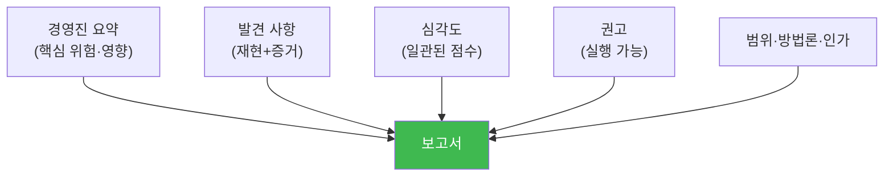

# physical-pentest W13 — 물리 침투 보고서: 전문 보고서 작성법

> **본 주차의 한 줄 요약**
>
> 침투 테스트의 **진짜 산출물은 침투가 아니라 보고서**다. 아무리 멋지게 뚫어도, 그것을 **경영진이 이해하고
> 방어로 이어지는 보고서**로 만들지 못하면 무의미하다. 좋은 물리 침투 보고서의 구성: ① **경영진 요약(Executive
> Summary)** — 비전문가(경영진)가 5분에 이해할 핵심 위험·영향·권고(기술 용어 최소), ② **발견 사항(Findings)** —
> 각 취약점을 **재현 가능하게**(어떻게 뚫었나) + **증거**(사진·로그, 비파괴 범위 내), ③ **심각도(Severity)** —
> 각 발견의 위험을 **일관된 기준**으로 점수화(영향×가능성×악용 용이성), 우선순위, ④ **권고(Recommendations)** —
> 각 발견에 **구체적·실행 가능한** 개선책(무엇을·어떻게), 비용·우선순위, ⑤ **범위·방법론·법적 근거** — 무엇을
> 어떤 인가로 테스트했나. 핵심 원칙: **비난이 아니라 개선**(약점을 지적하되 건설적으로), **재현 가능성**(주장이
> 아니라 증거), **경영진 언어**(위험을 비즈니스 영향으로 번역). 보고서가 침투 테스트를 **방어 투자로** 바꾼다 —
> 이것이 침투 테스터의 최종 가치다. (물리 침투 보고서는 agent-ir W13의 사고 보고서와 같은 원리 — 발견을 개선으로.)
>
> **한 줄 결론**: 침투 테스트의 산출물은 **보고서**다. 경영진 요약+재현 가능한 발견+일관된 심각도+실행 가능한
> 권고로, 침투를 **방어 개선**으로 바꾼다. 비난이 아니라 개선, 주장이 아니라 증거.

---

## 학습 목표

본 주차 종료 시 학생은 다음 5가지를 **본인 손으로** 할 수 있어야 한다.

1. 물리 침투 **보고서의 구성**을 설명한다.
2. 보고서 **구조 완성도**를 확인한다(REPORT_STRUCTURED).
3. 발견의 **심각도를 일관되게 점수화**한다(SEVERITY_SCORED).
4. **권고를 우선순위화**한다(RECS_PRIORITIZED).
5. 보고서가 방어 개선으로 이어지는 이유를 설명한다.

> **이 주차의 시선** — 침투를 방어로 바꾸는 다리, 보고서를 전문적으로 쓴다.

---

## 0. 용어 해설 (보고서)

| 용어 | 영문 | 뜻 | 비유 |
|------|------|----|------|
| **경영진 요약** | Executive Summary | 핵심 5분 요약 | 브리핑 |
| **발견 사항** | Findings | 각 취약점 | 진단 결과 |
| **심각도** | Severity | 위험 점수 | 위험 등급 |
| **권고** | Recommendation | 개선책 | 처방 |
| **재현 가능성** | Reproducibility | 증거·재현 | 증빙 |

> **헷갈리기 쉬운 한 쌍** — *경영진 요약* 은 "비즈니스 언어(왜 중요)", *발견 사항* 은 "기술 상세(어떻게)"다. 독자에
> 맞춰 둘 다 필요.

---

## 0.5 신입생 친화 핵심 개념

### 0.5.1 보고서 구성

각 부분이 다른 독자·목적을 위한다: 경영진(요약)·기술팀(발견·권고)·감사(범위·근거). 완전한 보고서가 각각을 만족.

### 0.5.2 경영진 요약 — 비즈니스 언어

경영진은 기술을 모른다. "테일게이팅으로 서버실 진입"이 아니라 **"인가 없이 핵심 데이터에 물리 접근 가능 —
데이터 유출·서비스 중단 위험"**. 위험을 **비즈니스 영향**(손실·규정·평판)으로 번역한다. 5분에 "무엇이 위험하고
무엇을 해야 하나"를 전달.

### 0.5.3 발견 — 재현 가능성과 증거

각 발견은 **주장이 아니라 증거**여야 한다: 어떻게 뚫었나(재현 절차), 증거(사진·로그, **비파괴·범위 내**),
영향. "취약하다"가 아니라 "이렇게 하면 이렇게 뚫린다(증거 첨부)". 재현 가능해야 방어팀이 확인·수정한다.

### 0.5.4 심각도 — 일관된 점수

각 발견의 위험을 **일관된 기준**으로 점수화한다(영향×가능성×악용 용이성 등). 일관돼야 발견 간 **우선순위**가
공정하다. "서버실 무단 접근"(높음)과 "외딴 창고 자물쇠 약함"(낮음)을 같은 잣대로 비교. 심각도가 개선 순서를
정한다(W01 위험 평가의 연장).

### 0.5.5 권고 — 실행 가능하게

각 발견에 **구체적·실행 가능한** 개선책을 단다: "보안 강화"(모호) 대신 "서버실 문에 맨트랩 설치 + 배지 in/out
+ CCTV 사각지대 제거"(구체). 비용·우선순위·담당을 명시하면 실제로 실행된다. 권고가 없는 보고서는 반쪽 —
발견을 **행동**으로 바꿔야 한다.

---

## 1. 실습 안내 (5 미션)

실행 위치 el34 **호스트**(`ssh ccc@{{TARGET_IP}}`), GPU `http://211.170.162.139:10934`.

### STEP 1 — GPU 헬스체크 → GEN_OK
### STEP 2 — 보고서 구조 완성도 → REPORT_STRUCTURED
### STEP 3 — 심각도 점수화 → SEVERITY_SCORED
### STEP 4 — 권고 우선순위 → RECS_PRIORITIZED
### STEP 5 — 경영진 요약 생성 → Assessment

---

## 2. 흔한 오해·관제자 노트

- **"뚫으면 끝"** — 산출물은 보고서. 방어로 이어져야 가치.
- **"기술 상세만 있으면 됨"** — 경영진 요약(비즈니스 언어)도 필요. 독자별.
- **"약점 지적이 목적"** — 비난 아니라 개선. 실행 가능한 권고.
- **관제 관점** — 침투 보고서가 경영진 요약·재현 가능 발견·일관 심각도·실행 가능 권고를 갖췄는지, 발견이 실제
  개선으로 추적되는지 점검한다. 보고서 품질이 침투 테스트의 ROI를 결정.

---

## 3. 다음 주차 (W14) 예고 — 물리 보안 방어

W13이 "발견을 보고서로"였다면, W14는 **물리 보안 방어** — 보고서의 권고를 실제 대책으로 구현하고, 보안 인식
교육으로 사람 방어선을 세우는 법을 다룬다.
