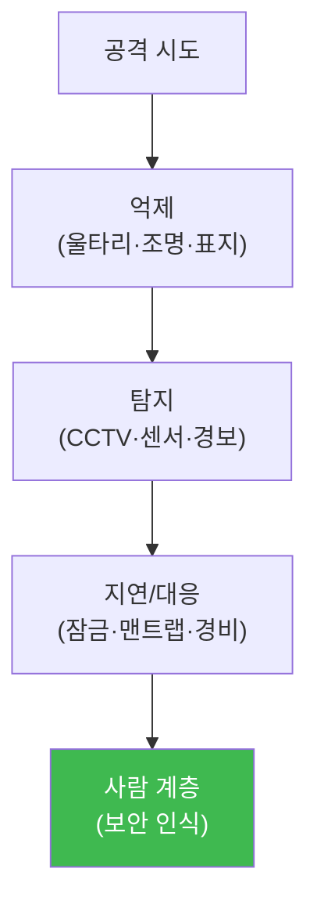

# physical-pentest W14 — 물리 보안 방어: 심층 방어 구현·보안 인식 교육

> **본 주차의 한 줄 요약**
>
> W01~W13이 주로 **공격 기법과 각 대책**이었다면, W14는 그것들을 **하나의 방어 체계**로 통합한다. 물리 보안의
> 방어 철학은 **심층 방어(defense-in-depth)** — 하나의 통제가 아니라 **여러 겹**으로, 공격자가 각 겹을 뚫을
> 때마다 **비용·시간·발각 위험**이 커지게 한다. 방어는 세 유형을 겹친다: ① **억제(deter)** — 울타리·조명·경고
> 표지로 시도 자체를 단념시킴, ② **탐지(detect)** — CCTV·센서·경보로 시도를 포착, ③ **지연/대응(delay/respond)**
> — 잠금·맨트랩으로 늦추고 경비가 대응. 그리고 이 모든 기술 통제 위에 **가장 중요한 계층 — 사람**이 있다.
> 사회공학(W02)·테일게이팅·미끼 USB(W04)는 결국 **사람의 행동**을 노리므로, **보안 인식 교육**이 방어의 핵심이다.
> 교육받은 직원은 프리텍스트를 의심하고, 문을 함부로 안 잡아주고, 모르는 USB를 안 꽂는다. 방어 평가의 핵심은
> **커버리지**(모든 킬체인 단계·위협 유형에 통제가 있나)와 **갭 분석**(빠진 곳 찾기)이다. 강한 곳을 더 강하게가
> 아니라, **약한 고리(W08)를 없애** 전체를 균형 있게 올린다.
>
> **한 줄 결론**: 물리 방어 = **심층 방어(억제·탐지·지연/대응 겹층) + 보안 인식 교육(사람 계층)**. 커버리지·갭
> 분석으로 약한 고리를 없애 균형 있게 강화한다.

---

## 학습 목표

본 주차 종료 시 학생은 다음 5가지를 **본인 손으로** 할 수 있어야 한다.

1. **심층 방어**(억제·탐지·지연/대응)를 설명한다.
2. 킬체인 **방어 커버리지**를 평가한다(DEFENSE_COVERAGE).
3. 통제 **갭**을 분석한다(GAP_FOUND).
4. **보안 인식 교육**의 효과를 평가한다(AWARENESS_EFFECTIVE).
5. 사람이 왜 가장 중요한 방어 계층인지 설명한다.

> **이 주차의 시선** — 배운 대책들을 균형 잡힌 심층 방어 체계로 통합하고, 사람 계층을 강화한다.

---

## 0. 용어 해설 (물리 방어)

| 용어 | 영문 | 뜻 | 비유 |
|------|------|----|------|
| **심층 방어** | Defense-in-Depth | 여러 겹 통제 | 다중 성벽 |
| **억제** | Deter | 시도 단념시킴 | 경고판 |
| **탐지** | Detect | 시도 포착 | 감시 카메라 |
| **지연/대응** | Delay/Respond | 늦추고 대응 | 방벽·경비 |
| **보안 인식** | Security Awareness | 직원 교육 | 훈련된 사람 |

> **헷갈리기 쉬운 한 쌍** — *억제* 는 "시도를 안 하게"(사전), *탐지* 는 "시도를 잡음"(도중)이다. 둘 다 필요 —
> 억제로 대부분 걸러내고, 탐지로 나머지를 잡는다.

---

## 0.5 신입생 친화 핵심 개념

### 0.5.1 심층 방어 — 겹겹이

한 겹이 아니라 여러 겹. 공격자가 억제를 무시해도 탐지가 잡고, 탐지를 피해도 지연이 늦추고, 그 위에 교육받은
사람이 있다. 각 겹이 서로의 빈틈을 메운다.

### 0.5.2 억제·탐지·지연/대응

- **억제**: 대부분의 기회주의적 시도를 **사전에** 단념. 울타리·조명·"CCTV 작동 중" 표지. 싸고 효과적.
- **탐지**: 억제를 무시한 시도를 **포착**. CCTV·동작 센서·출입 로그·경보. 대응의 방아쇠.
- **지연/대응**: 탐지 후 **시간을 벌고** 경비·경찰이 대응. 고보안 잠금·맨트랩·방범 유리. 지연 = 대응 시간.

### 0.5.3 커버리지와 갭 분석

방어 평가의 핵심 질문: **"모든 킬체인 단계·위협 유형에 통제가 있나?"** 각 단계(정찰·접근·발판·확장)와 각
위협(사회공학·RFID·USB·임플란트·WiFi)에 대응 통제를 매핑한다. **빠진 곳(갭)** 이 공격자의 진입점이다. 갭 분석
으로 약한 고리(W08)를 찾아 우선 보강한다.

### 0.5.4 사람 — 가장 중요한 계층

기술 통제(잠금·CCTV)는 **사람을 노리는 공격**을 못 막는다. 프리텍스트에 속아 문을 열어주면 어떤 잠금도 무의미.
그래서 **보안 인식 교육**이 최상위 계층: (1) 사회공학 기법 인지, (2) 검증 절차 습관화(신원 확인·에스코트),
(3) 정기 훈련·모의 시험(피싱·미끼 USB·테일게이팅 테스트). 교육받은 직원 한 명이 값비싼 CCTV보다 나을 수 있다.

### 0.5.5 균형 — 약한 고리를 없앤다

방어 자원은 유한하다. **강한 곳을 더 강하게가 아니라, 약한 곳을 올려** 전체를 균형 있게 한다. 서버실이 완벽해도
로비가 뚫리면 소용없다(W08). 갭 분석으로 가장 약한 고리를 찾아 우선 보강하는 것이 자원 대비 효과가 크다.

---

## 1. 실습 안내 (5 미션)

실행 위치 el34 **호스트**(`ssh ccc@{{TARGET_IP}}`), GPU `http://211.170.162.139:10934`.
⚠️ 물리 통제 구현은 현장 필요 → 본 실습은 커버리지·갭·교육 효과 평가 로직 결정론 시뮬.

### STEP 1 — GPU 헬스체크 → GEN_OK
### STEP 2 — 방어 커버리지 평가 → DEFENSE_COVERAGE
### STEP 3 — 통제 갭 분석 → GAP_FOUND
### STEP 4 — 보안 인식 교육 효과 → AWARENESS_EFFECTIVE
### STEP 5 — 종합 → Assessment

---

## 1.5 과제 (제출물)

- **A. 방어 커버리지 평가 실증 (필수, 40점)** — `DEFENSE_COVERAGE` 단계를 직접 수행해 실제 명령·출력(또는 아티팩트 분석 결과)을 캡처하고, 무엇을 근거로 판정했는지 서술한다.
- **B. 통제 갭 분석 분석 (필수, 30점)** — `GAP_FOUND` 단계를 직접 수행해 실제 명령·출력(또는 아티팩트 분석 결과)을 캡처하고, 무엇을 근거로 판정했는지 서술한다.
- **C. 보안 인식 교육 효과 방어 설계 (필수, 30점)** — `AWARENESS_EFFECTIVE` 단계를 직접 수행해 실제 명령·출력(또는 아티팩트 분석 결과)을 캡처하고, 무엇을 근거로 판정했는지 서술한다.

## 1.6 평가 기준

| 항목 | 미흡(0) | 보통 | 우수 |
|------|---------|------|------|
| 탐지/실증(DEFENSE_COVERAGE) | 미수행 | 마커 도출 | 근거·해석·재현까지 |
| 분석(GAP_FOUND) | 미수행 | 마커 도출 | 근거·해석·재현까지 |
| 방어(AWARENESS_EFFECTIVE) | 미수행 | 마커 도출 | 근거·해석·재현까지 |

## 1.7 핵심 정리 (1줄씩)

- 이번 주 주제: **물리 보안 방어: 심층 방어 구현·보안 인식 교육**.
- **방어 커버리지 평가**(`DEFENSE_COVERAGE`)
- **통제 갭 분석**(`GAP_FOUND`)
- **보안 인식 교육 효과**(`AWARENESS_EFFECTIVE`)
- 공격을 이해한 만큼 **방어의 우선순위**가 분명해진다 — 탐지 근거와 완화를 함께 익힌다.

---

## 2. 흔한 오해·블루팀 노트

- **"CCTV만 있으면 됨"** — 탐지만으론 부족. 억제·지연/대응·사람 계층 겹층.
- **"강한 곳을 더 강하게"** — 약한 고리를 올려야. 갭 분석·균형.
- **"교육은 형식"** — 사람이 최상위 계층. 사회공학은 교육으로만 막힌다.
- **관제 관점** — 킬체인 각 단계에 억제·탐지·지연/대응 통제가 있는지, 갭이 파악·보강됐는지, 보안 인식 교육·
  모의 시험이 정기적인지 점검한다. 물리 방어는 겹층 + 사람.

---

## 3. 다음 주차 (W15) 예고 — 종합 평가: 전체 킬체인 물리 침투

W14가 "방어 통합"이었다면, 마지막 W15는 **종합 평가** — 정찰부터 목표까지 전체 킬체인 물리 침투 시나리오를
구성·평가하고, 심층 방어로 각 단계를 막는 능력을 종합한다. 과목을 마무리한다.
