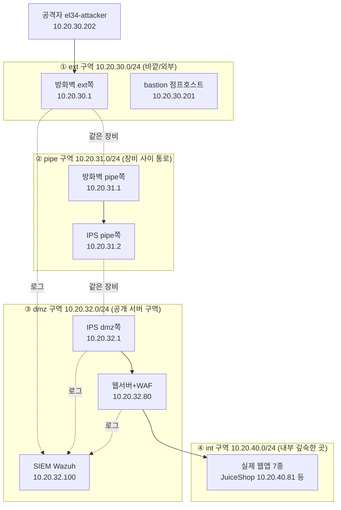
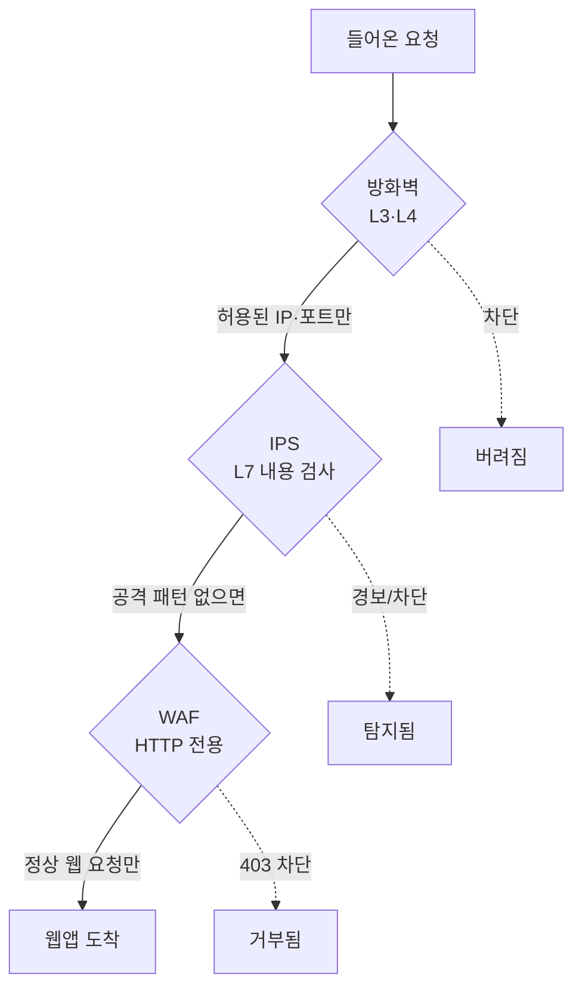
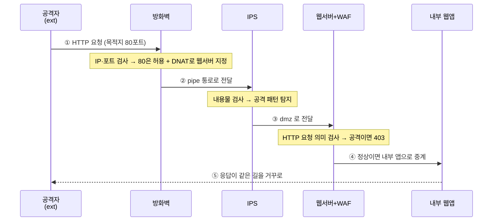
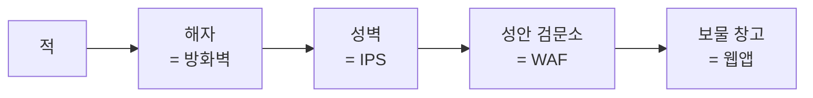

# W01 — 전체 토폴로지: 보안장비는 어디에, 왜 있는가

> **이번 주 한 줄 요약**
>
> 우리가 다룰 el34 실습망이 **어떻게 생겼는지**, 그 안에서 **방화벽 · IPS · WAF** 세 보안장비가
> **어디에 놓여 무슨 일을 하는지**, 그리고 공격 트래픽 한 줄기가 들어올 때 **어떤 길을 따라
> 어떤 장비를 차례로 지나는지**를 그림으로 이해한다. 이번 주는 명령어를 외우는 시간이 아니라
> "**전체 지도**"를 머릿속에 그리는 시간이다.

---

## 이 특강은 무엇인가요?

보안시스템을 처음 다루는 학생을 위한 입문 특강입니다. 우리는 6주 동안 세 가지 대표 보안장비를
**직접 만져 봅니다.**

| 주차 | 장비 | 한 줄 설명 |
|------|------|-----------|
| W1 | (전체 지도) | 세 장비가 어디에 있고 왜 있는지 그림으로 이해 |
| W2 | **방화벽 (nftables)** | IP·포트로 트래픽을 허용/차단하는 가장 바깥 관문 |
| W3~W4 | **IPS (Suricata)** | 통과한 트래픽의 *내용*을 검사해 공격 패턴을 탐지 |
| W5~W6 | **WAF (ModSecurity)** | 웹(HTTP) 요청을 이해하고 웹 공격을 막는 방패 |

**가장 중요한 약속이 하나 있습니다.** 이 특강에서는 모든 장비를 **웹 화면(GUI 콘솔)**으로 다룹니다.
화면에서 버튼을 누르고 값을 입력하면, 그 동작이 만들어내는 **진짜 명령**(예: `nft` 명령,
Suricata 룰, ModSecurity SecRule)을 화면이 그대로 보여 주고, 그다음 실제로 적용합니다.

> 즉 우리는 "버튼을 누르는 법"이 아니라 **"버튼이 만들어내는 명령"**을 배웁니다.
> 그래서 나중에 화면이 없는 환경에서도 같은 일을 할 수 있게 됩니다.

el34에는 세 개의 교육용 콘솔이 준비돼 있습니다(접속은 8장에서).

| 콘솔 | 주소(el34 호스트 브라우저) | 다루는 장비 |
|------|---------------------------|-------------|
| 방화벽 콘솔 | `http://192.168.136.145:8081/` | nftables (el34-fw) |
| IPS 콘솔 | `http://192.168.136.145:8082/` | Suricata (el34-ips) |
| WAF 콘솔 | `http://192.168.136.145:8083/` | ModSecurity (el34-web) |

---

## 학습 목표

이번 주가 끝나면 여러분은 다음을 할 수 있어야 합니다.

1. el34 실습망의 **4개 구역**(ext → pipe → dmz → int)을 그림으로 그릴 수 있다.
2. 방화벽 · IPS · WAF가 **각각 어느 구역에** 있고 **무엇을 검사하는지** 한 문장으로 설명한다.
3. 외부에서 들어온 요청 한 개가 **어떤 순서로 어떤 장비를 거쳐** 웹 서버에 닿는지 따라간다.
4. "왜 보안장비를 한 개가 아니라 세 개나 두는가"(= **심층 방어**)를 비유로 설명한다.
5. 세 개의 교육용 콘솔(방화벽/IPS/WAF)에 접속해 첫 화면을 연다.

---

## 1. 먼저 알아둘 용어 (딱 10개)

처음 보는 용어가 많아도 괜찮습니다. 아래 10개만 알면 이번 주 내용은 충분히 따라옵니다.

| 용어 | 영어 | 쉽게 말하면 | 일상 비유 |
|------|------|------------|-----------|
| 방화벽 | Firewall | "누가, 어디로" 가는지(IP·포트) 보고 통과/차단 | 건물 정문 출입 통제 |
| IPS/IDS | Intrusion Prevention/Detection System | 통과한 트래픽의 *내용물*을 뜯어보고 공격이면 경보/차단 | 가방을 여는 보안 검색대 |
| WAF | Web Application Firewall | *웹(HTTP)* 요청만 전문으로 검사하는 방패 | 웹 사이트 전용 금속탐지기 |
| 패킷 | Packet | 네트워크에서 오가는 데이터 한 조각 | 편지 한 통 |
| IP 주소 | IP address | 네트워크에서 컴퓨터의 "주소" | 건물 호수(101호) |
| 포트 | Port | 한 컴퓨터 안의 "창구 번호"(80=웹, 22=SSH) | 은행 창구 번호 |
| 구역(존) | network zone | 보안 등급이 같은 컴퓨터들을 묶은 망 | 건물의 층/구역 |
| 게이트웨이 | gateway | 두 구역을 잇는 "문" 역할의 장비 | 층과 층 사이 출입문 |
| 심층 방어 | Defense in Depth | 한 겹이 뚫려도 다음 겹이 막도록 여러 겹 쌓기 | 성벽 + 해자 + 검문소 |
| DNAT | Destination NAT | 들어온 패킷의 *목적지 주소*를 내부 서버로 바꿔 전달 | 정문에서 "그 부서는 3층입니다" 하고 길 안내 |

---

## 2. el34 실습망의 전체 그림

먼저 전체 지도를 봅시다. 우리 실습망은 보안 등급과 용도가 다른 **4개의 구역**으로 나뉩니다.
바깥에서 안으로 갈수록 더 중요한 곳입니다.



**이 그림에서 꼭 기억할 점 5가지:**

1. **공격자(el34-attacker, 10.20.30.202)**는 가장 바깥 `ext` 구역에 있습니다. 안으로 들어오려면
   반드시 장비들을 거쳐야 합니다.
2. **방화벽과 IPS는 각각 두 구역에 양다리**를 걸칩니다. 방화벽은 ext(10.20.30.1)와 pipe(10.20.31.1)에,
   IPS는 pipe(10.20.31.2)와 dmz(10.20.32.1)에 한 발씩 걸치고 있어 "문" 역할을 합니다.
   (그림의 점선 `-.같은 장비.-`이 한 장비의 두 다리입니다.)
3. 가장 안쪽 `int`에는 진짜 웹 애플리케이션 7종이 있습니다. 여기까지 도달하려면 **방화벽 → IPS →
   WAF(웹서버)**를 모두 통과해야 합니다.
4. **웹서버(el34-web)는 dmz(10.20.32.80)와 int(10.20.40.80) 양쪽에 다리**를 걸치고, 외부 요청을 받아
   내부 앱으로 중계합니다(= 리버스 프록시).
5. 세 장비의 기록은 모두 **SIEM(Wazuh, 10.20.32.100)**으로 모입니다(점선 "로그"). 운영자는 SIEM 한
   곳에서 무엇이 막혔고 탐지됐는지 시간순으로 봅니다.

> 📌 **6v6과 다른 점(혹시 옛 자료를 봤다면)** — el34는 사용자 PC를 두는 별도 `user` 구역과
> Windows 엔드포인트가 없는 **4구역 서버 인프라**입니다. 또한 옛 자료의 HAProxy 중계기 대신,
> el34의 방화벽은 **nftables의 DNAT**로 직접 길을 잡습니다(4장에서 설명). 이 교재는 el34 기준입니다.

---

## 3. 네 구역을 하나씩 — 무엇이 있고, 왜 나눴나

구역을 나누는 이유는 간단합니다. **보안 등급이 다른 컴퓨터를 섞어 두면 위험하기 때문**입니다.
바깥 손님이 드나드는 로비와, 금고가 있는 방을 같은 공간에 두지 않는 것과 같습니다.

### ① ext (외부 구역) — `10.20.30.0/24`
- 가장 바깥, 신뢰할 수 없는 구역입니다. **공격자(10.20.30.202)**와 점프호스트 bastion(10.20.30.201)이
  여기 있습니다.
- 방화벽의 바깥쪽 다리(10.20.30.1)가 이 구역을 향합니다. 외부에서 오는 모든 트래픽은 먼저 이 다리로
  들어옵니다.
- **보안 관점:** "여기는 위험하다"고 가정합니다. 그래서 바로 뒤에 방화벽이 버티고 있습니다.

### ② pipe (통로 구역) — `10.20.31.0/24`
- 방화벽과 IPS를 잇는 **좁은 통로**입니다. 방화벽 안쪽 다리(10.20.31.1)와 IPS 바깥쪽 다리(10.20.31.2)만
  이 통로에 있습니다.
- **보안 관점:** 방화벽을 통과한 트래픽은 무조건 이 통로를 지나 IPS로 갑니다. 우회로가 없으므로
  IPS는 "지나가는 모든 것"을 볼 수 있습니다.

### ③ dmz (공개 서버 구역) — `10.20.32.0/24`
- 외부에 서비스를 제공해야 하는 **서버들**이 모인 곳입니다.
  - **웹서버 + WAF** (10.20.32.80) — 우리가 보호할 대상이자 WAF가 동작하는 곳
  - **SIEM (Wazuh)** (10.20.32.100) — 모든 장비의 로그를 모아 보는 관제실
  - 운영 포털(portal), Wazuh 인덱서/대시보드도 이 구역에 있습니다.
- IPS의 dmz 쪽 다리(10.20.32.1)가 이 구역을 향합니다.
- **보안 관점:** "DMZ"는 군사용어로 비무장지대입니다. 외부에 노출되지만 내부망과는 분리해서,
  여기가 뚫려도 더 깊은 곳은 지키도록 합니다.

### ④ int (내부 구역) — `10.20.40.0/24`
- 가장 깊은 곳. 실제 웹 애플리케이션 7종이 돌아갑니다.

  | 앱 | IP | 앱 | IP |
  |----|----|----|----|
  | JuiceShop | 10.20.40.81 | mediforum | 10.20.40.85 |
  | DVWA | 10.20.40.82 | adminconsole | 10.20.40.86 |
  | neobank | 10.20.40.83 | aicompanion | 10.20.40.87 |
  | govportal | 10.20.40.84 | | |

- 웹서버는 dmz(10.20.32.80)와 int(10.20.40.80) 양쪽에 다리를 걸치고, 외부 요청을 받아 내부 앱으로
  중계합니다(= 리버스 프록시).
- **보안 관점:** 외부에서 여기로 **직접** 올 수 있는 길은 없습니다. 반드시 앞단 웹서버를 거쳐야 합니다.

> **핵심:** 바깥(ext) → 통로(pipe) → 공개구역(dmz) → 내부(int).
> 안으로 갈수록 신뢰도가 높고, 각 경계마다 보안장비가 문지기로 서 있습니다.

---

## 4. 세 보안장비의 위치와 역할

이제 가장 중요한 부분입니다. 세 장비는 **검사하는 깊이가 다릅니다.**



| 장비 | 보는 것 | 보는 깊이 | 비유 |
|------|---------|-----------|------|
| **방화벽** (nftables) | 출발지/목적지 **IP**, **포트**, 연결 상태 | 봉투의 겉면 (주소·창구번호) | 정문에서 신분증·목적지 확인 |
| **IPS** (Suricata) | 패킷 **내용물** 속의 공격 패턴(문자열·정규식) | 봉투를 열어 편지 내용 검사 | 가방을 열어보는 검색대 |
| **WAF** (ModSecurity) | **HTTP 요청**의 주소·파라미터·헤더·본문 | 웹 언어를 이해하고 의미 검사 | 웹 전용 전문 검색관 |

**자주 하는 질문: "방화벽이 있으면 IPS·WAF는 왜 필요한가요?"**

방화벽은 **봉투 겉면만** 봅니다. 즉 "80번 포트(웹)로 들어오는 정상 손님"은 통과시킵니다.
그런데 그 손님이 **봉투 안에 공격 문서를 숨겨** 왔다면? 방화벽은 내용물을 안 보니 막지 못합니다.
그래서 다음 층의 IPS가 내용물을 검사하고, 그다음 WAF가 웹 요청의 의미까지 검사합니다.
**각 장비는 자기가 잘하는 깊이만 책임집니다.**

### el34 방화벽의 "길 안내" — DNAT (HAProxy 없이)

el34의 방화벽은 외부 포트로 들어온 요청을 **nftables DNAT**로 내부 웹서버에 넘깁니다. 예를 들어
방화벽 룰에는 이런 줄이 있습니다(W2에서 직접 봅니다).

```
tcp dport 80  dnat to 10.20.32.80:80
tcp dport 443 dnat to 10.20.32.80:443
```

"80번 포트로 온 요청의 목적지를 웹서버(10.20.32.80)로 바꿔라"는 뜻입니다. 그렇게 바뀐 패킷은
pipe→IPS→dmz를 거쳐 웹서버에 닿습니다. 그래서 **DNAT로 길을 잡아도 IPS의 검사선은 그대로 지나갑니다.**
웹서버(Apache)는 요청의 `Host:` 헤더(예: `juice.el34.lab`)를 보고 알맞은 내부 앱으로 다시 중계합니다.

---

## 5. 요청 한 개가 지나가는 길 (hop by hop)

공격자가 웹 사이트에 접속하는 정상 요청을 보냈다고 합시다. 이 요청은 다음 순서로 흐릅니다.



이 다섯 단계가 눈 깜짝할 사이에 일어납니다. 하지만 **운영자(여러분)**는 이 길을 정확히 알아야
침해가 일어났을 때 "어디서 막혔고, 어디는 통과했는지" 추적할 수 있습니다. 그래서 이번 주에 길을
머릿속에 새기는 것입니다.

---

## 6. 왜 세 겹인가 — 심층 방어 (Defense in Depth)

옛날 성을 떠올려 봅시다. 성은 한 겹으로 막지 않았습니다.



- **해자(방화벽)** — 아예 다가오지 못하게 거른다.
- **성벽(IPS)** — 해자를 건너온 적의 무기를 탐지한다.
- **검문소(WAF)** — 성안에 들어온 자의 의도를 따진다.

한 겹으로 완벽한 방어는 없습니다. 방화벽도, IPS도, WAF도 각자 약점이 있습니다. 하지만 **세 겹을
모두 뚫기는 훨씬 어렵습니다.** 또한 한 겹이 뚫려도 다음 겹의 **로그**가 침해의 증거를 남깁니다.
이것이 심층 방어의 핵심입니다.

**그리고 한 가지 더:** 세 장비의 기록은 모두 **SIEM(Wazuh, 10.20.32.100)**이라는 관제실로 모입니다.
운영자는 SIEM 한 곳에서 "방화벽이 무엇을 막았고, IPS가 무엇을 탐지했고, WAF가 무엇을 차단했는지"
시간순으로 볼 수 있습니다. el34에서는 방화벽·IPS·웹서버가 각각 Wazuh 에이전트(fw·ips·web)로
SIEM에 연결돼 있습니다.

---

## 7. 같은 공격, 다른 층에서 막히는 모습

같은 공격이라도 어느 층에서 걸리느냐가 다릅니다. 예시 세 가지를 봅시다.

| 공격 | 어느 장비가 막나 | 왜 |
|------|----------------|----|
| "9999번 포트로 접속 시도" | **방화벽** | 포트 자체를 닫아두면 내용 검사도 필요 없음 |
| "정상 80포트로 들어오지만 패킷에 `sqlmap` 흔적" | **IPS** | 포트는 정상이라 방화벽은 통과, 내용에서 도구 흔적 탐지 |
| "정상 웹 요청처럼 보이지만 `?q=<script>` XSS" | **WAF** | HTTP 파라미터의 의미를 이해해야 잡힘 |

이렇게 **공격마다 가장 잘 막는 층이 다르기 때문에** 세 장비가 모두 필요합니다. W2~W6에서 위 세
공격을 각각 직접 막아 봅니다.

---

## 8. 세 개의 교육용 콘솔 접속하기

이번 특강의 주인공인 세 GUI 콘솔은 모두 웹 브라우저로 접속합니다. el34의 **내부 관리망(ens38)**에만
열려 있으므로, **el34 호스트의 브라우저(Firefox)**에서 접속합니다.

| 콘솔 | 주소 | 다루는 장비 | 배우는 주차 |
|------|------|------------|------------|
| 방화벽 콘솔 | `http://192.168.136.145:8081/` | nftables (el34-fw) | W2 |
| IPS 콘솔 | `http://192.168.136.145:8082/` | Suricata (el34-ips) | W3~W4 |
| WAF 콘솔 | `http://192.168.136.145:8083/` | ModSecurity (el34-web) | W5~W6 |

각 콘솔의 첫 화면(**대시보드**)에는 그 장비의 상태가 한눈에 보입니다. 예를 들어 방화벽 콘솔은
인터페이스(두 다리)·룰 개수·테이블을 보여 주고, IPS 콘솔은 로딩된 탐지룰 수와 eve.json 이벤트를,
WAF 콘솔은 ModSecurity 엔진 모드와 CRS 버전을 보여 줍니다.

각 콘솔에는 **상태 API**(`/api/status`)도 있어, 화면 없이 명령으로도 같은 정보를 볼 수 있습니다.
실습에서 이 API로 채점합니다.

각 콘솔의 공통 철학을 다시 기억하세요. **무엇을 하든 화면이 "이런 명령이 만들어졌습니다"를
먼저 보여 주고, 여러분이 "적용"을 눌러야 실제로 반영됩니다.** 그래서 안전하게 연습할 수 있습니다.

---

## 9. 이번 주 정리

- el34 망은 **ext → pipe → dmz → int** 4구역으로 나뉜다.
- **방화벽**(ext↔pipe)은 IP·포트를, **IPS**(pipe↔dmz)는 내용물을, **WAF**(dmz의 웹서버)는 HTTP
  의미를 검사한다.
- el34 방화벽은 HAProxy 없이 **nftables DNAT**로 외부 요청을 웹서버로 넘기고, 웹서버가 `Host:`로
  내부 앱을 가른다.
- 요청은 **방화벽 → IPS → WAF → 내부 앱** 순서로 흐르고, 응답은 거꾸로 돌아간다.
- 세 겹으로 쌓는 이유는 **심층 방어** — 한 겹이 뚫려도 다음 겹과 로그가 막고 기록한다.
- 모든 장비의 기록은 **SIEM(Wazuh)** 한 곳으로 모인다(에이전트 fw·ips·web).
- 우리는 세 장비를 각각 방화벽/IPS/WAF 콘솔(192.168.136.145:8081/8082/8083)로 다룬다.

## 다음 주 예고 (W2 — 방화벽)

다음 주에는 방화벽 콘솔(`192.168.136.145:8081`)을 열어, 실제로 룰을 만들어 봅니다. 악성 IP를 차단하고,
DNAT로 내부 서비스를 공개하고, 연결 추적(stateful)을 눈으로 확인하고, 만든 룰을 SIEM으로 보내는
것까지 — **모두 화면에서, 그리고 그 화면이 만들어내는 진짜 `nft` 명령을 함께** 익힙니다.

---

## 과제 (제출)

1. el34 4구역 토폴로지를 **손으로 그려** 제출하세요. 각 구역의 이름, 대역(IP), 그 구역에 있는
   장비/서버를 표시합니다.
2. 방화벽 · IPS · WAF가 각각 "무엇을(어느 깊이를) 검사하는지"를 **자기 말로 한 문장씩** 쓰세요.
3. 세 콘솔(방화벽/IPS/WAF)에 접속해 **각 대시보드 첫 화면을 캡처**하고, 거기서 본 정보(예: 방화벽 룰
   개수, IPS 로딩 룰 수, WAF 엔진 모드)를 한 줄씩 적으세요.
4. (생각해 보기) "방화벽 하나만 있으면 충분하지 않을까?"라는 질문에, 이번 주에 배운 내용을 근거로
   반박하는 글을 5문장 이내로 쓰세요.
