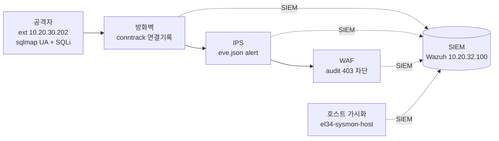

# W06 — WAF 침해대응 30 + 종합: 세 장비가 함께 막는다

> **이번 주 한 줄 요약**
>
> WAF 콘솔의 **침해대응 훈련** 30개 SecRule 작성 시나리오를 푼다. 그리고 6주의 마무리로,
> **같은 공격 하나가 방화벽 · IPS · WAF 세 장비에서 어떻게 다르게 보이고 막히는지**를 직접
> 비교한다. 심층 방어가 그림이 아니라 실제로 작동하는 것을 눈으로 확인하며 특강을 마친다.

---

## 지난주 복습 (30초)

WAF 룰(SecRule) = **변수**(ARGS/REQUEST_URI/REQUEST_HEADERS:…) + **연산자**(@rx/@contains/@pm) +
**액션**(transform/deny|pass/severity). **transform**(t:lowercase, t:urlDecodeUni)으로 우회를 막고,
적용 전 **configtest**가 웹서버를 보호합니다. 이번 주는 이 무기를 30번 휘두르고, 세 장비를 한데 모읍니다.

## 학습 목표

1. 웹 공격마다 **어느 변수에 어떤 연산자·패턴**을 쓸지 판단한다.
2. **transform**으로 인코딩/대소문자 우회를 막는다.
3. `deny`(차단)와 `pass`(탐지)를 상황에 맞게 고른다.
4. WAF 시나리오 30개 중 **최소 20개**를 검증 통과시킨다.
5. **같은 공격을 세 장비(방화벽/IPS/WAF)에서 추적**해 심층 방어를 종합한다.

---

## 1. WAF 침해대응 30 — 그룹별 핵심

### 그룹 1 — 주입 공격 (waf-s01 ~ s10)

| 공격 | 변수 | 패턴/연산자 | transform |
|------|------|------------|-----------|
| SQLi UNION (s01) | ARGS/REQUEST_URI | @rx `union.+select` | lowercase |
| SQLi OR 1=1 (s02) | ARGS | @contains `1=1` | — |
| XSS script (s04) | ARGS | @contains `<script` | **urlDecodeUni** |
| 경로탐색 (s06) | REQUEST_URI | @contains `../` | **urlDecodeUni** |
| LFI (s07) | ARGS | @contains `etc/passwd` | — |
| RCE (s08) | ARGS | @rx `;\s*(id\|whoami)` | — |
| Log4Shell (s10) | REQUEST_HEADERS | @contains `${jndi:` | urlDecodeUni |

**핵심:** 인코딩 우회(`%3Cscript%3E`, `..%2f`)는 **t:urlDecodeUni**로 먼저 디코딩해야 잡힙니다.
대소문자 우회는 **t:lowercase**. WAF의 진짜 힘은 이 변환에 있습니다.

### 그룹 2 — 스캐너·경로·정보노출 (waf-s11 ~ s20)

| 공격 | 변수 | 연산자 |
|------|------|--------|
| sqlmap/Nikto (s11/s12) | REQUEST_HEADERS:User-Agent | @contains |
| 다수 스캐너 한 번에 (s13) | REQUEST_HEADERS:User-Agent | **@pm** sqlmap nikto nmap gobuster |
| 관리자 경로 (s14) | REQUEST_URI | @beginsWith `/admin` |
| .git/.env (s15) | REQUEST_URI | @rx `\.(git\|env)` |
| SSRF (s16) | ARGS | @contains `169.254.169.254` |

**핵심:** `@pm`(phrase match)는 여러 문구를 한 룰로 고속 매칭 — 스캐너 목록 관리에 좋습니다.
`@beginsWith`는 접두어 — 경로 검사에 적합합니다. **연산자를 상황에 맞게 고르는 것**이 이 그룹의 교훈.

### 그룹 3 — 심화·우회·운영 (waf-s21 ~ s30)

| 시나리오 | 배우는 것 |
|----------|-----------|
| 메서드 남용 (s21) | REQUEST_LINE + phase 1(헤더 단계 조기 차단) |
| CRLF (s22) | urlDecodeUni 후 `[\r\n]` |
| 오픈 리다이렉트 (s23) | **action=pass**(오탐 잦아 탐지부터) |
| 탐지 전용 모드 (s27) | **pass**(새 룰은 탐지→관찰→차단 순서) |
| 이중 인코딩 (s28) | **transform 2개**(urlDecodeUni + lowercase) |
| severity 분류 (s29) | CRITICAL 등급 → SOC 우선순위 |
| capstone (s30) | phase 1 조기 차단 + severity |

**핵심:** 새 룰은 바로 `deny`하지 말고 **`pass`(탐지/로그)로 먼저** 넣어 오탐을 관찰한 뒤 차단으로
전환합니다(s23/s27). 안전한 룰 도입 절차입니다.

---

## 2. IPS와 WAF — 같은 공격, 다른 관점

같은 SQLi(UNION) 공격을 두 장비가 어떻게 다르게 보는지 비교해 봅시다.

| | IPS (Suricata) | WAF (ModSecurity) |
|---|---|---|
| 보는 단위 | 패킷/스트림의 **문자열** | **HTTP 요청의 구조** |
| 룰 | `http.uri; content:"UNION"` | `SecRule ARGS "@rx union.+select"` |
| 강점 | 모든 트래픽(웹 외에도) | HTTP 의미 이해, 변환(transform) |
| 차단 | (IDS 모드라 경보 위주) | **deny 로 즉시 403** |

**왜 둘 다 필요한가?** IPS는 웹뿐 아니라 모든 프로토콜(DNS, TCP 스캔 등)을 보지만 HTTP의 깊은
의미는 모릅니다. WAF는 HTTP만 보지만 파라미터·인코딩·본문까지 정밀하게 이해합니다. **겹치는
부분(웹)은 이중으로 막고, 안 겹치는 부분은 서로 보완**합니다. 이것이 심층 방어입니다.

---

## 3. 종합 capstone — 한 공격, 세 장비의 흔적

이제 6주의 핵심을 한자리에 모읍니다. 공격 하나(sqlmap UA + SQLi UNION)를 보내고, **세 장비**에서
각각의 흔적을 찾습니다.

**한 공격의 세 가지 흔적:**

1. **방화벽** — 연결(conntrack)이 생기고, 만약 출발지를 차단했다면 **카운터(packets)**가 올라간다.
   (방화벽은 IP·포트만 보므로 정상 80포트 웹 요청은 통과시킨다.)
2. **IPS** — 통과한 트래픽에서 sqlmap UA·UNION 패턴을 발견해 **eve.json에 alert**를 남긴다.
3. **WAF** — 웹서버에서 SQLi/스캐너 룰에 걸려 **audit 로그에 403 차단**을 기록한다. 외부 공격자
   요청은 `client_ip`로 식별된다.

세 흔적이 모두 **SIEM(Wazuh, 10.20.32.100)**으로 모이므로, 분석가는 한 화면에서 "이 공격이 어디서
통과하고 어디서 막혔는지"를 시간순으로 봅니다. **한 겹이 놓쳐도 다음 겹이 잡고, 모든 겹이 기록을
남긴다** — 이것이 우리가 6주 동안 배운 심층 방어의 완성입니다.

> **호스트 가시화의 보충:** 세 장비는 모두 **네트워크/HTTP**를 봅니다. 서버 안에서 실제로 무슨 일이
> 일어났는지(프로세스 실행 등)는 네트워크에 안 보이므로, el34는 **호스트 가시화(Sysmon,
> el34-sysmon-host)**로 그 사각지대를 보충해 같은 SIEM으로 보냅니다. "네트워크 3겹 + 호스트 1겹"이
> 함께여야 공격의 전모가 보입니다.

---

## 4. 6주 특강 총정리

| 주차 | 배운 것 | 핵심 도구/개념 |
|------|---------|----------------|
| W1 | 전체 토폴로지 | 4구역, 세 장비 위치, 심층 방어 |
| W2 | 방화벽(nftables) | IP·포트, 룰/NAT, conntrack, 카운터 |
| W3 | IPS 기초(Suricata) | 헤더+버퍼+content, eve.json |
| W4 | IPS 침해대응 30 | threshold, pcre, classtype |
| W5 | WAF 기초(ModSecurity) | SecRule(변수+연산자+액션), transform, configtest |
| W6 | WAF 침해대응 30 + 종합 | @pm, deny/pass, 세 장비 통합 |

**여러분이 이제 할 수 있는 것:**
- 세 보안장비를 콘솔로 다루고, 각 동작이 만드는 **실제 명령**(nft / Suricata rule / SecRule)을 읽고 쓴다.
- 공격 상황을 보면 **어느 장비의 어느 기능**으로 막을지 판단한다.
- 룰을 만들고 적용하고 **검증(공격 재현 → 로그 확인)**한다.
- 세 장비를 **SIEM으로 통합**해 한 화면에서 관제한다.

이것은 보안 운영(SecOps) 엔지니어의 가장 기본적이고 핵심적인 역량입니다. 더 깊이 배우고 싶다면
정규 과정의 **보안 솔루션 운영(secuops)**과 **보안 운영 센터(SOC)** 트랙으로 이어집니다.

---

## 과제 (제출 — 최종)

1. WAF 침해대응 30개 중 **최소 20개**를 검증 통과시키고, 통과 목록을 제출하세요.
2. **transform 비교**: 같은 XSS(`%3Cscript%3E`)를 `t:urlDecodeUni` 있는 룰/없는 룰로 막아 보고,
   결과 차이를 캡처해 설명하세요.
3. **deny vs pass**: 한 시나리오를 pass(탐지)로 먼저 넣고 audit 로그를 본 뒤, deny로 바꿔 403을
   확인하는 과정을 기록하세요.
4. **종합 capstone**: sqlmap + SQLi 공격을 한 번 보내고, 방화벽 conntrack / IPS eve.json alert /
   WAF audit 403 **세 곳의 흔적**을 각각 캡처해, 한 공격이 세 장비에 어떻게 다르게 보였는지 한
   페이지로 정리하세요. (이번 특강의 최종 보고서)
5. 모든 실습 룰을 **정리(cleanup)**했는지 세 콘솔에서 확인하고 캡처하세요.
