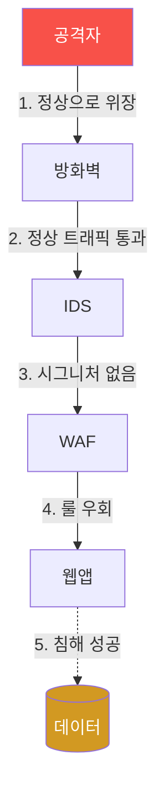
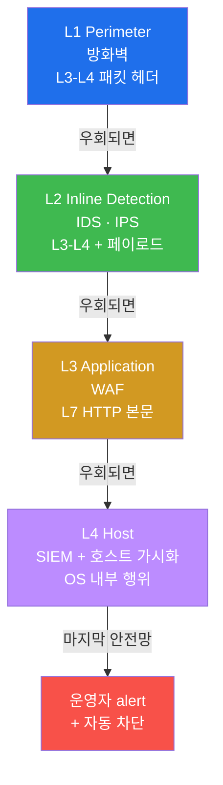
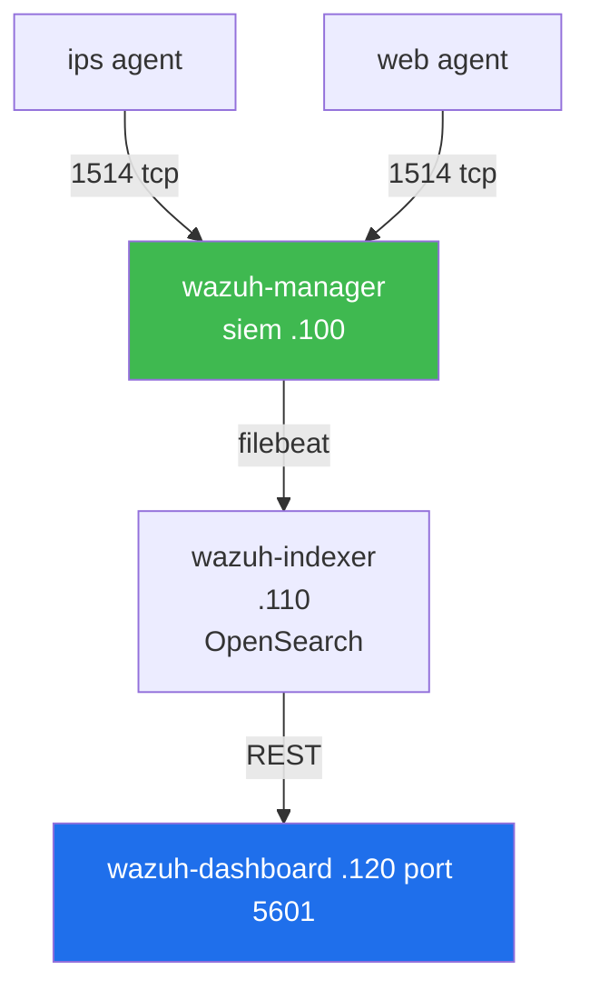
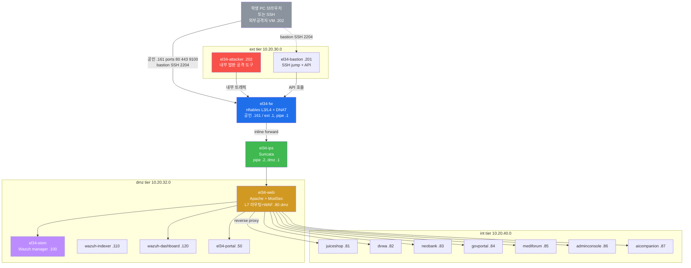
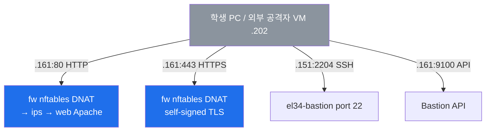
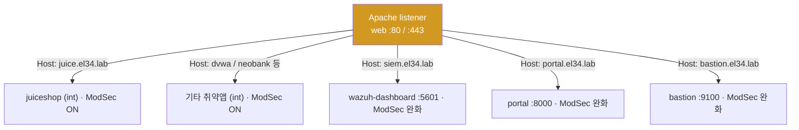
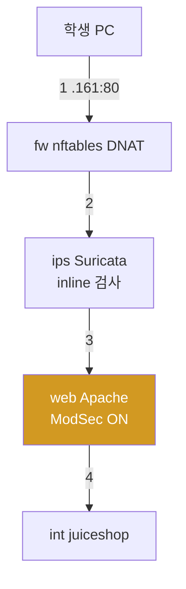
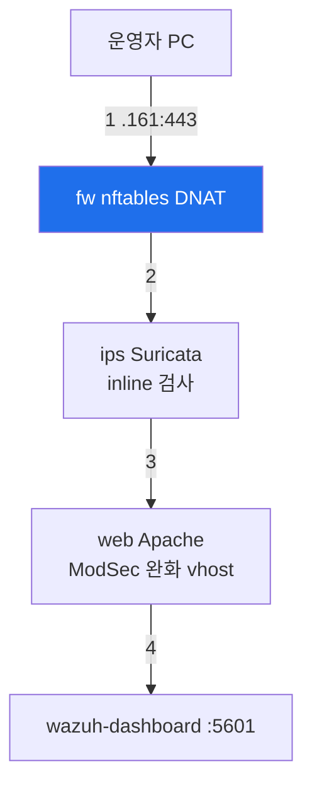
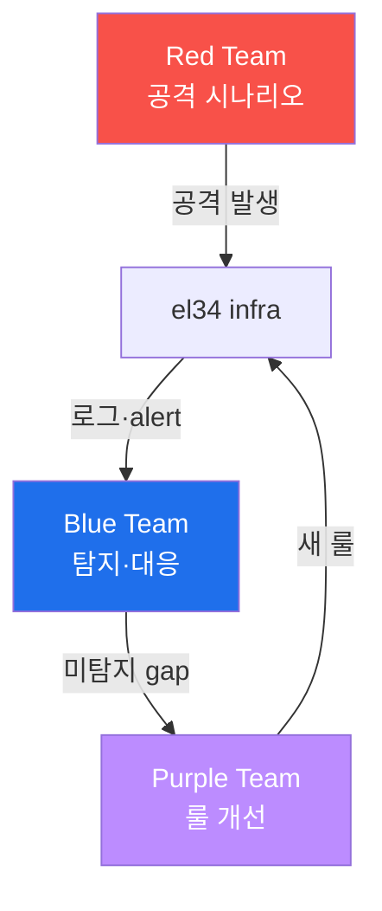
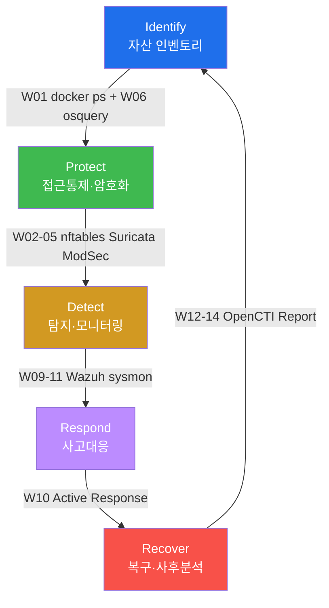

# Week 01 — 보안 솔루션 개론 + el34 4-tier 인프라

> **본 주차의 한 줄 요약**
>
> "왜 한 종류의 보안 솔루션만으로는 안 되는가?" 라는 질문에 답하기 위해, 학생은 **el34
> 4-tier 토폴로지** 위에 배치된 5종 보안 솔루션 (방화벽 / IDS / WAF / SIEM / 호스트
> 가시화) 과 CTI 플랫폼을 직접 만져본다. 마지막엔 가벼운 공격을 흘려 보내 5 솔루션
> 의 각 로그·alert 가 어떻게 연결되는지 추적한다.

---

## 학습 목표

본 주차 종료 시 학생은 다음 6가지를 **본인 손으로** 할 수 있어야 한다.

1. 5종 보안 솔루션 (방화벽 / IPS / WAF / SIEM / 호스트 가시화) 의 역할·계층·차이점을
   비유 없이 1분 안에 설명한다.
2. Defense in Depth 원리에 따라 el34 4-tier (`ext → pipe → dmz → int`) 가 어떻게
   설계되었는지 화이트보드에 재현한다.
3. el34 호스트(`ssh ccc@192.168.0.80`)에서 docker 로 보안 핵심 16 컨테이너 전부에
   진입하고, 각 컨테이너에서 본인 역할의 헬스체크를 1분 안에 수행한다.
4. web 의 Apache vhost 라우팅(11 vhost)을 host header 별로 구분하고, 학생 트래픽
   (취약 웹) vs 운영 트래픽 (siem / portal) 의 경로 차이를 설명한다.
5. attacker 컨테이너에서 가벼운 공격 (curl XSS / sqlmap UA) 을 발생시키고, 같은
   transaction 의 흔적을 **5 곳** (fw nftables/conntrack → ips Suricata eve.json → web
   Apache access.log → web ModSec modsec_audit.log → siem Wazuh alerts.json) 에서 모두
   찾아낸다.
6. 본 주차의 모든 명령·결과·헬스체크 표를 1페이지 보고서로 정리하고, 본인이 발견한
   비정상 / 의문점 1건을 합리적으로 분석한다.

---

## 0. 용어 해설 (보안 솔루션 운영 입문)

| 용어 | 영문 | 뜻 | 비유 |
|------|------|----|------|
| **방화벽** | Firewall | L3/L4 헤더 기반 트래픽 허용·차단 | 건물 외곽 출입 통제 |
| **IDS/IPS** | Intrusion Detection / Prevention System | 페이로드 검사 후 탐지(IDS) / 차단(IPS) | 보안 카메라 + 자동 잠금 |
| **WAF** | Web Application Firewall | HTTP/HTTPS L7 페이로드 전용 방화벽 | 입구 금속탐지기 |
| **SIEM** | Security Information & Event Management | 로그 통합 수집·정규화·상관분석 | CCTV 관제실 |
| **호스트 가시화** | Host visibility | OS 내부 (프로세스/파일/사용자) 가시화 | 건물 안 모든 방의 입실 기록 |
| **CTI** | Cyber Threat Intelligence | 외부 위협 정보 (IOC, TTPs) 수집·공유 | 범죄 정보 공유망 |
| **IOC** | Indicator of Compromise | 침해 지표 (악성 IP, 해시, 도메인) | 수배범 지문, 차량번호 |
| **STIX/TAXII** | Structured Threat Information eXpression / Trusted Automated eXchange | CTI 표준 포맷·교환 프로토콜 | 범죄 보고서 표준 / 경찰서 간 공유 |
| **Defense in Depth** | DiD | 다층 방어 원리 | 외곽 담장 + 출입 통제 + 금고 + CCTV |
| **Bastion** | Bastion host | 내부망 SSH 의 유일한 진입점 | 정문 안내데스크 |
| **ProxyJump** | SSH ProxyJump (-J) | bastion 경유 2-hop SSH | 안내데스크 → 호실 |
| **Reverse Proxy** | — | 외부 요청 → 내부 백엔드 전달 | 호텔 컨시어지 |
| **vhost** | Virtual Host | 같은 IP/포트에서 도메인별 다른 사이트 | 한 건물 안 여러 매장 |
| **conntrack** | connection tracking | 커널 stateful 추적 (orig/reply) | 출입자 기록부 |
| **nftables** | Netfilter Tables | iptables 후속 표준 (커널 3.13+) | 현대화된 출입 통제 매뉴얼 |
| **eve.json** | Suricata Extensible EVent | Suricata 의 JSON 이벤트 로그 | 보안 카메라 영상 인덱스 |
| **CRS** | OWASP Core Rule Set | ModSecurity 의 표준 룰셋 | 표준 검문 매뉴얼 |
| **FIM** | File Integrity Monitoring | 파일 변경 실시간 감시 | 금고 CCTV |
| **SCA** | Security Configuration Assessment | CIS 등 보안 설정 점검 | 건물 안전 점검표 |
| **Red Team** | — | 공격 시뮬레이션 팀 | 공격 측 훈련 인원 |
| **Blue Team** | — | 방어 시뮬레이션 팀 | 방어 측 훈련 인원 |
| **Purple Team** | — | Red + Blue 협업 + detection 개선 | 양 팀 합동 훈련 |

---

## 0.5 핵심 개념

위 용어 해설 표는 한 줄 정의에 그치기 때문에 신입생이 이해하기에는 부족하다. 본 절에서는 W01 본격 학습을 시작하기 전에, 신입생이 헷갈리기 쉬운 핵심 8 용어를 일상 비유와 함께 풀어서 설명한다. 운영 엔지니어링 용어를 처음 만나는 학생의 어려움을 줄이는 것이 목적이다.

### 0.5.1 역프록시(Reverse Proxy) — 호텔 컨시어지 비유

학생이 호텔에 처음 들어선다고 하자. 호텔 입구에서 가장 먼저 만나는 사람이 컨시어지(concierge)다. 컨시어지의 역할은 다음과 같다.

- 방문객을 맞이한다.
- "어느 객실에 가시나요?"라고 의도를 확인한다.
- 객실 번호와 층을 직접 안내한다.
- 의도가 불분명한 방문은 거절한다.

이 컨시어지의 역할을 web 세계에 그대로 옮긴 것이 **역프록시(Reverse Proxy)** 다.

**역프록시** 는 외부 web 요청을 받아 내부 server로 전달하는 컨시어지다. 외부에서 들어오는 모든 요청은 먼저 역프록시에 도착하며, 역프록시는 다음을 판단한다.

- 이 요청은 어느 host에 대한 것인가? → `Host:` 헤더를 확인한다.
- 그 host에 해당하는 내부 server는 어디인가? → 라우팅 대상을 선택한다.
- 결정된 내부 server로 요청을 전달하고, 응답을 외부로 돌려준다.

역프록시는 여러 제품으로 구현된다 — **Apache(mod_proxy)**, nginx, Traefik, Caddy 등. **el34 인프라에서는 web 컨테이너의 Apache 가 이 역프록시 역할을 한다.** 게다가 el34의 Apache는 역프록시인 동시에 **WAF(ModSecurity)** 도 겸한다 — 컨시어지가 곧 입구 금속탐지기까지 같이 보는 셈이다.

> **참고 — el34 의 역할 분담.** el34 에서 L7 host-header 라우팅은 **web 컨테이너의 Apache vhost** 가 전담하고, **fw 는 순수 L3/L4 방화벽(nftables)** 이다. 즉 web 의 Apache 하나가 L7 라우팅 + WAF 를 함께 담당한다.

**비유 매핑.**

| 호텔 컨시어지 | el34 역프록시 (web 의 Apache) |
|----------------|---------|
| 호텔 입구 | Apache listener (web 컨테이너, port 80 / 443) |
| 방문객의 의도 | `Host:` 헤더 (예: `juice.el34.lab`) |
| 객실 안내 | vhost → 내부 app 컨테이너로 전달 |
| 의도 외 방문 거절 | WAF(ModSecurity) 차단 또는 404 |

학생이 web browser에서 `http://juice.el34.lab` 을 입력했을 때 일어나는 흐름은 다음과 같다.

1. 학생 host의 DNS(또는 hosts 파일)가 `juice.el34.lab` 을 **192.168.0.161** 로 해석한다.
2. browser가 `192.168.0.161:80` 으로 HTTP 요청을 보낸다.
3. **fw**(nftables, ext 10.20.30.1 / pipe 10.20.31.1)가 그 packet을 받아 내부로 forward 한다.
4. **ips**(Suricata, pipe↔dmz inline)가 packet을 검사한다.
5. **web 의 Apache**가 요청을 수신하고 `Host:` 헤더에서 `juice.el34.lab` 을 확인한다.
6. Apache vhost 가 내부 app 컨테이너(`el34-juiceshop` 10.20.40.81)로 요청을 전달한다.
7. app의 응답이 Apache → ips → fw 를 거쳐 학생 browser로 돌아온다.

학생 입장에서는 "한 번 클릭"으로 1초도 걸리지 않지만, 내부에서는 이 hop들이 발생한다. 운영자가 침해를 추적하려면 이 hop을 모두 이해해야 한다.

### 0.5.2 Forward Proxy vs Reverse Proxy

역프록시를 이해했다면, 짝이 되는 개념인 Forward Proxy 와의 차이도 짚어두자.

**Reverse Proxy** 는 외부 요청을 받아서 내부 server로 전달하고, 응답을 다시 외부로 돌려주는 중계자다(앞 절의 web Apache 가 그 예다). nginx, Traefik, Caddy 등도 같은 역할을 한다.

**Forward Proxy와의 차이.**

- **Forward Proxy** — 학생이 외부 web에 접근할 때, 학생을 대신해서 외부로 요청을 보내주는 중계자다. 회사 내부에서 외부 인터넷에 나갈 때 거치는 사내 proxy가 여기에 해당한다.
- **Reverse Proxy** — 외부 방문객이 회사 server에 접근할 때, server를 대신해서 외부 요청을 받아주는 중계자다. 호텔 컨시어지가 바로 이 역할이다.

방향이 정반대다. Forward는 "내부 → 외부", Reverse는 "외부 → 내부" 다.

### 0.5.3 vhost — 한 건물에 여러 매장이 있는 비유

학생이 사는 동네에 4층짜리 건물이 있다고 하자. 1층은 카페, 2층은 서점, 3층은 치과, 4층은 학원이다. 네 매장 모두 같은 주소 ("서울시 OO구 OO로 123") 를 쓴다. 그런데 방문객은 간판을 보고 자기가 가려는 매장을 찾는다.

이 구조를 web에 옮긴 것이 **vhost (Virtual Host)** 다.

**vhost** 는 같은 IP/포트에서 도메인 이름에 따라 다른 web 사이트를 응답하는 방식이다. 한 server가 여러 web 사이트를 동시에 운영하며, `Host:` 헤더로 어느 사이트를 응답할지 결정한다.

**비유 매핑.**

| 한 건물의 매장 | vhost |
|----------------|-------|
| 건물 주소 | IP : port |
| 매장 간판 | `Host:` 헤더 (도메인) |
| 매장의 별도 운영 | vhost별 별도의 web 사이트 |

**el34 에서 vhost 예시.**

| Host 헤더 | 응답하는 사이트 | 용도 |
|----------|----------------|------|
| `siem.el34.lab` | Wazuh Dashboard | 운영자/학생의 분석 |
| `portal.el34.lab` | 운영자 portal | 운영자 접근 |
| `web.el34.lab` | Juice Shop | 공격 target |

같은 fw VM, 같은 port 443에서 `Host:` 헤더 하나에 따라 전혀 다른 사이트가 응답된다.

### 0.5.4 nftables — 건물 출입 통제 매뉴얼 비유

학생이 다니는 회사를 떠올려보자. 회사 입구에는 출입 통제 매뉴얼이 있다.

- 매뉴얼은 "이 시간대에는 이 부서 직원만 입장 허용" 같은 규칙을 적어둔다.
- 경비원은 들어오는 사람마다 매뉴얼과 대조해서 허용 또는 거부를 판단한다.
- 신입 직원이 들어오면 매뉴얼에 새 줄을 추가한다.

이 매뉴얼이 네트워크 세계에서는 **nftables** 다.

**nftables** 는 Linux 커널의 표준 packet filter다. iptables의 후속 (Linux kernel 3.13+) 이며, 모든 inbound/outbound packet을 nftables의 ruleset과 비교해서 허용하거나 거부한다.

**iptables와의 차이.**

- iptables — 2000년대 표준. 현재는 점차 deprecated 단계.
- nftables — 2014년 이후 표준. 문법이 통일되고 성능도 향상되었다.

학습 환경에서는 fw VM이 nftables로 가동되며, 모든 inbound packet이 ruleset을 거친다.

**ruleset 예시.**

```
table inet filter {
    chain input {
        type filter hook input priority 0;

        # 1. localhost는 모두 허용
        iif lo accept

        # 2. 이미 진행 중인 connection의 응답 packet은 허용
        ct state established,related accept

        # 3. SSH (port 22) 는 허용
        tcp dport 22 accept

        # 4. 그 외 모든 packet은 거부
        drop
    }
}
```

각 줄의 의미는 다음과 같다.

- `table` — ruleset 전체를 담는 컨테이너.
- `chain` — 어느 hook에서 동작할지 (input / output / forward).
- 각 rule — 조건 + action (accept / drop / reject).

### 0.5.5 conntrack — 출입자 기록부 비유

회사 출입 시스템을 다시 떠올려보자.

- 학생이 회사에 입장하는 순간 출입 기록이 시작된다.
- 학생이 회사 안에 있는 동안에는 "현재 입장 중" 상태가 유지된다.
- 학생이 퇴장하는 순간 기록이 종료된다.

이 출입자 기록부가 네트워크에서는 **conntrack** (connection tracking) 이다.

**conntrack** 은 Linux 커널이 stateful하게 connection을 추적하는 기능이다. 각 connection의 (orig_ip, orig_port, reply_ip, reply_port, state) 를 자동으로 기록한다.

**state의 4 종.**

- **NEW** — 새 connection의 첫 packet.
- **ESTABLISHED** — 이미 성립된 connection의 정상 packet.
- **RELATED** — 다른 connection과 연관된 packet (예: FTP의 데이터 채널).
- **INVALID** — 비정상 packet.

nftables rule 중 `ct state established,related accept` 가 의미하는 것은 "이미 성립된 connection의 응답 packet은 자동 허용" 이다. 이것이 stateful firewall의 핵심이다.

### 0.5.6 FIM — 금고 CCTV 비유

집에 금고가 있다고 하자. 금고 안에는 중요한 서류가 들어 있고, 학생은 금고 위에 24시간 CCTV를 설치했다.

- 금고에 손이 닿는 모든 변화를 CCTV가 즉시 감지한다.
- CCTV는 변화가 일어난 시점을 정확히 기록한다.
- 변화가 감지되면 학생에게 즉시 alert가 간다.

이 CCTV가 파일 시스템에서는 **FIM (File Integrity Monitoring)** 이다.

**FIM** 은 중요 파일의 모든 변경을 자동으로 감지하고, 변경이 일어나면 즉시 alert를 발생시키는 기능이다.

**FIM 보호 대상 예시.**

- `/etc/passwd`, `/etc/shadow` — 사용자 계정 정보.
- `/etc/ssh/sshd_config` — SSH 설정.
- `/usr/bin/`, `/usr/sbin/` — 시스템 binary.
- `/var/www/`, `/var/log/` — web 콘텐츠와 로그.

학습 환경의 Wazuh agent는 FIM이 기본 활성되어 있다. 위 경로의 파일이 변경되면 즉시 Wazuh manager로 alert가 전송된다.

### 0.5.7 Bastion + ProxyJump — 정문 안내데스크 비유

회사 출입 절차를 자세히 떠올려보자.

- 외부 방문객은 곧장 사무실로 들어가지 못한다. 먼저 정문 안내데스크에 도착한다.
- 안내데스크는 방문객의 신원을 확인한다.
- 신원이 확인되면 안내데스크 직원이 방문 부서까지 직접 안내해준다.

이 절차가 SSH 접근에서는 **Bastion + ProxyJump** 다.

- **Bastion** (Bastion host) = 정문 안내데스크. 외부에서 내부망으로 SSH 접근할 때 반드시 거쳐야 하는 유일한 진입점이다. 외부에서 내부 server로 직접 SSH는 차단된다.
- **ProxyJump** (`ssh -J`) = 안내데스크 직원이 호실까지 직접 안내해주는 절차. SSH 클라이언트가 2-hop을 자동으로 처리한다 — 학생 host → Bastion → 내부 server.

**명령 예시.**

```bash
# (개념) bastion 을 경유한 2-hop SSH — 외부에서 내부 server 로
ssh -J ccc@192.168.0.80:2204 ccc@<내부-server>
```

- el34 에서 이 안내데스크 역할은 **el34-bastion** 컨테이너이며, 외부 노출 SSH 포트는 **2204** 다.
- 다만 이 트레이닝의 실습은 더 단순하고 확실한 경로를 쓴다 — el34 **호스트에 접속한 뒤 docker 로** 각 컨테이너에 진입한다.

```bash
# 트레이닝 실습의 표준 접근 (el34 호스트 → 컨테이너)
ssh ccc@192.168.0.80              # 비밀번호: 1
ssh ccc@10.20.32.80               # 원하는 장비 IP 로 (fw 30.1/ips 31.2/web 32.80/siem 32.100)
```

### 0.5.8 eve.json — 보안 카메라 영상 인덱스 비유

집 CCTV 비유로 이어가보자. CCTV는 24시간 영상을 녹화하면서, 동시에 "몇 시 몇 분에 어떤 일이 있었다" 는 시간별 인덱스를 자동으로 작성한다. 학생이 "어제 오후 3시 영상 보여줘" 라고 하면 인덱스를 따라 즉시 그 시점으로 이동한다.

이 인덱스 파일이 Suricata에서는 **eve.json** 이다.

**eve.json** 은 Suricata의 **E**xtensible **EV**ent JSON 로그다. Suricata가 분석한 모든 packet의 결과가 한 줄에 한 JSON 객체로 기록된다. `event_type` 필드로 어떤 종류의 이벤트인지 구분된다 — `alert`, `http`, `dns`, `tls`, `flow` 등.

**한 줄 예시.**

```json
{"timestamp":"2026-05-12T14:35:10",
 "event_type":"alert",
 "src_ip":"192.168.0.202",
 "dest_ip":"192.168.0.161",
 "alert":{"signature":"ET SCAN ..."}}
```

| JSON 필드 | CCTV 인덱스 |
|-----------|-------------|
| `timestamp` | 영상의 시간 |
| `event_type` | 영상의 종류 (정상/비정상) |
| `src_ip` | 침입자 IP |
| `dest_ip` | target IP |
| `alert.signature` | 비정상의 종류 |

---

이 8 용어가 W01 본격 내용의 기반이 된다. 본문에서 다시 등장할 때 막히면 본 절로 돌아와서 확인하면 흐름이 끊기지 않는다.

---

## 1. 보안 솔루션이 왜 5종이나 필요한가?

### 1.1 한 줄 답: 단일 방어선은 우회 한 번에 무너지기 때문

침해 사고를 단순화하면 거의 항상 다음 패턴을 따른다.



각 계층이 **독립적으로** 동작하지 않으면, 한 번의 우회로 공격자는 마지막 자산까지 도달
한다. 그래서 우리는 한 종류만이 아니라 **5종을 동시에** 운영한다.

### 1.2 실 침해 사례 3건 (이 강의의 동기)

| 사고 | 원인 | 어느 레이어가 실패했나 |
|------|------|---------------------|
| 2017 Equifax (1.45억건 PII) | Apache Struts CVE-2017-5638 RCE 미패치 | WAF 룰 부재 + 호스트 가시화 부재 |
| 2020 SolarWinds Orion | 빌드 파이프라인 침해 → 정상 서명 업데이트 | 방화벽·IPS 무력 → SIEM·EDR 만이 마지막 안전망 |
| 2021 한국 인터파크 (17,011건) | SQLi → 권한상승 → 데이터 유출 | WAF 미튜닝 + SIEM alert fatigue |

위 3건 모두 **단일 솔루션의 실패**이며, **다른 레이어가 보완했다면** 사고 규모가 줄었을
것이라는 게 사고 후 분석의 공통 결론이다.

### 1.3 Defense in Depth — 4 계층 정식 모델

NIST SP 800-160 v2 + 한국 ISMS-P 통제 2.6 / 2.8 의 핵심 원칙은 다음 4 계층의 동시 운영
이다.



각 계층은 다른 도구 + 다른 데이터 + 다른 운영 인력으로 운영된다. 단일 침해로 4 계층
이 동시에 무력화되기는 극히 어렵다.

### 1.4 el34 의 4-tier 가 곧 이 4 계층

el34 는 타깃 VM (192.168.0.80) 1대 안에 docker 컨테이너로 위 4 계층을 모사한다. 이름 매핑:

| Defense in Depth 계층 | el34 컨테이너 | 학습 주차 |
|---------------------|-------------|----------|
| L1 Perimeter | `el34-fw` (nftables, L3/L4 + DNAT) | W02 |
| L2 Inline Detection | `el34-ips` (Suricata) | W03–W04 |
| L3 Application | `el34-web` (Apache + ModSecurity + CRS, L7 라우팅+WAF) | W05 |
| L4 Host — host visibility | osquery on bastion/fw/ips/web | W06 |
| L4 Host — 엔드포인트 IR | victim / analyst Linux PC | W07 |
| L4 Host — SIEM | `el34-siem` (Wazuh manager) + indexer + dashboard | W09–W10 |
| L4 Host — event-driven | sysmon-for-linux (web/fw/ips) | W11 |
| (외부 위협 인지) | OpenCTI | W12–W14 |

---

## 2. 5종 보안 솔루션 상세

### 2.1 방화벽 — `el34-fw`

**한 줄 정의**: 패킷의 IP/port (L3/L4 헤더) 만 보고 허용·차단을 결정하는 가장 단순·빠른
방어 도구.

**el34 구현**:
- 운영체제: Ubuntu 22.04
- 도구: **nftables** (Linux 커널 표준, iptables 후속) — filter 테이블 `six_filter` + NAT 테이블 `six_nat`
  > ※ `six_filter`/`six_nat` 은 nftables **표준 명칭이 아니라** 이 인프라가 임의로 붙인 테이블 이름이다
  > (`six` = 원래 인프라명 6v6 의 흔적). nftables 테이블 이름은 관리자가 자유롭게 정하므로 다른 환경에선
  > 다른 이름일 수 있다 — "원래 있는 표준"으로 오해하지 말 것. (Docker 가 자동 생성하는 `ip nat` 만 표준 위치다.)
- 역할: 공인 IP **192.168.0.161** 의 80 / 443 / 9100 을 내부로 **DNAT**. L7 host-header 라우팅은 web 의 Apache 가 담당한다 (fw 는 L3/L4 전용)
- 인터페이스: `ext` 의 .1 (10.20.30.1) ↔ `pipe` 의 .1 (10.20.31.1) — 라우터 모드
- 외부 노출: TCP 80 / 443 / 9100 (호스트 .161 포트와 매핑)

**기본 ruleset 구조**:
```
table inet six_filter {              # el34 의 정책 본체 (IPv4 + IPv6 통합)
    chain input {                    # fw 자체로 들어오는 트래픽
        type filter hook input priority 0;
        policy accept;
        tcp dport 22 accept
        ip protocol icmp accept
        ct state established,related accept
    }
    chain forward {                  # fw 를 통과하는 트래픽
        type filter hook forward priority 0;
        policy accept;
        ct state established,related accept
        # (학생이 W02-W03 에서 룰 추가하며 학습)
    }
}
```

**한계**:
- L3/L4 헤더만 본다 → SQL Injection, XSS 같은 L7 payload 공격은 통과시킨다 → **WAF
  필요**
- 암호화된 트래픽 (HTTPS) 의 내부 페이로드는 보지 못함 → IDS 필요

### 2.2 IDS / IPS — `el34-ips`

**한 줄 정의**: 트래픽 페이로드를 시그니처·이상행위로 검사하여 알려진 공격을 탐지하는
"보안 카메라". IPS 는 탐지 + 자동 차단.

| 모드 | 동작 | el34 |
|------|------|-----|
| IDS | passive sniff → alert | Suricata 기본 모드 (`-i eth0 -i eth1`) |
| IPS | NFQUEUE 또는 inline → drop | 본 lab 미사용 (Suricata IPS 모드 + nftables 연동) |

**el34 구현**:
- 도구: **Suricata 6.0.4** (Ubuntu 22.04 패키지)
- 인터페이스: `pipe` 의 .2 (10.20.31.2) ↔ `dmz` 의 .1 (10.20.32.1) — 두 NIC 동시 sniff
- 룰셋: ETOpen (Emerging Threats Open) 70,000+ 룰
- 출력: `/var/log/suricata/eve.json` (JSON 라인 형식, Wazuh agent ship)

**eve.json 한 줄 예시**:
```json
{
  "timestamp": "2026-05-11T11:06:44.421882+0000",
  "flow_id": 1284584860047176,
  "in_iface": "eth0",
  "event_type": "http",
  "src_ip": "10.20.30.202",
  "dest_ip": "10.20.32.80",
  "http": {
    "hostname": "juice.el34.lab",
    "url": "/?q=<script>",
    "http_method": "GET",
    "status": 403
  }
}
```

**한계**:
- 시그니처 없는 신종 공격 (0-day) 은 못 잡는다
- HTTPS 내부는 못 본다 (cert 인터셉트 필요)

### 2.3 WAF — `el34-web`

**한 줄 정의**: HTTP/HTTPS 의 L7 페이로드 (요청 body, header, parameter) 를 검사하는
응용 계층 전용 방화벽.

**el34 구현**:
- 도구: **Apache 2.4 + libapache2-mod-security2 (v2.9.x) + modsecurity-crs (CRS 3.x)**
- 위치: `dmz` 의 .80 (10.20.32.80) ↔ `int` 의 .80 (10.20.40.80)
- 역할: 11 vhost reverse proxy + WAF 검사
- 핵심 설정: `SecRuleEngine On`, `SecAuditLogFormat JSON`
- 출력: `/var/log/apache2/modsec_audit.log` (JSON 라인)

**modsec_audit.log 한 줄 예시**:
```json
{
  "transaction": {
    "client_ip": "10.20.30.202",
    "request": { "method": "GET", "uri": "/?q=<script>alert(1)</script>" },
    "response": { "http_code": 403 },
    "messages": [
      { "id": "941100", "msg": "XSS Attack Detected via libinjection",
        "data": "Matched Data: <script>" }
    ]
  }
}
```

**한계**:
- 비즈니스 로직 결함 (BOLA, BFLA) 은 시그니처로 잡기 어려움 → SIEM 행위 분석 보완
- 룰 튜닝 부담 (false-positive)

### 2.4 SIEM — `el34-siem`

**한 줄 정의**: 다 소스의 로그를 통합 수집·정규화·상관분석·알림 하는 "CCTV 관제실".

**el34 구현 — Wazuh 4.10 stack 3 컨테이너**:



- `el34-siem` (wazuh-manager:4.10.0) — analysisd + remoted + modulesd + monitord 등 11
  daemon running (16 daemon 정의 중 default-on 11)
- `el34-wazuh-indexer` (OpenSearch 백엔드 색인)
- `el34-wazuh-dashboard` (Web UI, HTTPS 5601)
- 현재 활성 agent 2개 — **ips**(003), **web**(004). (fw 등 다른 host 에도 agent 를 추가 등록할 수 있다.)

**핵심 명령** (el34 호스트에서):
```
ssh ccc@10.20.32.100 sudo /var/ossec/bin/wazuh-control status    # daemon 상태
ssh ccc@10.20.32.100 sudo /var/ossec/bin/agent_control -l        # 등록 agent 목록
```

**한계**:
- 룰·디코더 미정의 시 raw 로그만 적재 → 사용자 정의 디코더 필요 (W09)
- alert fatigue (분당 수천 alert) → 우선순위 (level) 튜닝 필요

### 2.5 호스트 가시화 — osquery + sysmon (W06 + W11)

**한 줄 정의**: 네트워크 시그니처로 잡히지 않는 호스트 내부 행위 (프로세스, 파일,
사용자, 소켓) 를 가시화하는 마지막 안전망.

- **osquery** (W06) : OS 를 SQL 테이블로 추상화. `SELECT pid, name FROM processes WHERE
  on_disk = 0;` 같은 헌팅 쿼리.
- **sysmon for Linux** (W11) : Windows Sysmon 의 Linux 포팅. eBPF + auditd 기반 process
  create / network connect / file create 이벤트 stream.

두 도구는 **보완 관계**: osquery 는 snapshot, sysmon 은 event stream.

### 2.6 CTI 통합 — OpenCTI (W12–W14)

위 5종이 "본 환경" 의 데이터를 보는 도구라면, OpenCTI 는 "외부 위협" 정보를 가져와
연결하는 플랫폼이다. STIX 2.1 / TAXII 2.1 표준. W12–W14 에서 본 환경의 Wazuh CDB list
로 IOC 통합 → 알람 자동 격상.

---

## 3. el34 4-tier 토폴로지 상세

### 3.1 전체 그림



### 3.2 컨테이너 16개 상세 표

| Tier | 컨테이너 | IP | 핵심 도구 | 학습 주차 |
|------|----------|-----|----------|----------|
| **ext** | `el34-bastion` | 10.20.30.201 | SSH jump + Bastion API + docker-cli | W01–전체 |
| **ext** | `el34-attacker` | 10.20.30.202 | nmap, sqlmap, hydra, msfconsole 등 (내부 발판) | attack |
| **fw (ext↔pipe)** | `el34-fw` | 10.20.30.1 / 10.20.31.1 | nftables (`six_filter` + `six_nat` DNAT) + iptables-translate + conntrack | W02 |
| **ips (pipe↔dmz)** | `el34-ips` | 10.20.31.2 / 10.20.32.1 | Suricata 6.0.4 + nftables masq + Wazuh agent | W03–W04 |
| **dmz** | `el34-web` | 10.20.32.80 / 10.20.40.80 | Apache 2.4 + ModSecurity v2 + CRS + 11 vhost + Wazuh agent + osquery | W05 |
| **dmz** | `el34-siem` | 10.20.32.100 | Wazuh manager (10 daemon) + 1514/1515/55000 listen | W09–W10 |
| **dmz** | `el34-wazuh-indexer` | 10.20.32.110 | OpenSearch (9200) | W09 |
| **dmz** | `el34-wazuh-dashboard` | 10.20.32.120 | Wazuh Web UI (HTTPS 5601) | W09 |
| **dmz** | `el34-portal` | 10.20.32.50 | 운영 포털 (FastAPI + HTMX) | W01 |
| **int** | `el34-juiceshop` | 10.20.40.81 | OWASP Juice Shop (80+ challenge) | attack |
| **int** | `el34-dvwa` | 10.20.40.82 | DVWA (4 수준) | attack |
| **int** | `el34-neobank` | 10.20.40.83 | NeoBank (인증/IDOR) | attack |
| **int** | `el34-govportal` | 10.20.40.84 | GovPortal (auth/LFI) | attack |
| **int** | `el34-mediforum` | 10.20.40.85 | MediForum (XSS) | attack |
| **int** | `el34-adminconsole` | 10.20.40.86 | AdminConsole (RCE/XXE) | attack |
| **int** | `el34-aicompanion` | 10.20.40.87 | AICompanion (LLM injection) | (별 과정) |

> **참고.** 위 16개가 보안 운영의 핵심 대상이다. el34 호스트에서 `docker ps` 를 하면 이 외에도
> OpenCTI / MISP 스택(`el34-opencti-1`, `el34-elasticsearch-1`, `el34-worker-*`, `el34-connector-*`,
> `el34-misp-*` 등 20+ 컨테이너)이 함께 보이는데, 이는 **W12–W14 (CTI)** 에서 다룬다. W01–W11 동안은
> 위 표의 16개에 집중하면 된다.

### 3.3 외부 노출 포트

el34 의 외부 진입점은 **공인 IP 192.168.0.161** (web 트래픽) 과 **192.168.0.80** (관리 SSH) 두 개다.
fw 가 .161 의 포트를 받아 nftables 로 내부에 전달하고, L7 라우팅은 그 뒤 web 의 Apache 가 한다.



> 트레이닝 실습에서는 위 외부 포트 대신, 호스트 SSH(`ssh ccc@192.168.0.80`)로 접속해
> 각 장비에 `ssh ccc@<IP>` 로 접속한다. 외부 포트(80/443/9100/2204)는 학생·운영 web 접근과
> 외부 공격 트래픽용이다.

### 3.4 vhost 매핑 (host header 별 라우팅)

el34 의 web 컨테이너 Apache 가 `Host:` 헤더로 11개 vhost 를 구분해 내부 대상으로 프록시한다.

| vhost | 대상 | 비고 |
|-------|------|------|
| `el34.lab` | 랜딩 페이지 (web Apache) | 정상 baseline |
| `juice.el34.lab` | int juiceshop | ModSec 적용 (WAF) |
| `dvwa.el34.lab` | int dvwa | ModSec 적용 |
| `neobank.el34.lab` | int neobank | ModSec 적용 |
| `govportal.el34.lab` | int govportal | ModSec 적용 |
| `mediforum.el34.lab` | int mediforum | ModSec 적용 |
| `admin.el34.lab` | int adminconsole | ModSec 적용 |
| `ai.el34.lab` | int aicompanion | ModSec 적용 |
| `siem.el34.lab` | dmz wazuh-dashboard:5601 | 운영 트래픽 (ModSec 완화) |
| `portal.el34.lab` | dmz portal:8000 | 운영 트래픽 (ModSec 완화) |
| `bastion.el34.lab` | ext bastion:9100 | 운영 트래픽 (ModSec 완화) |

> 도메인은 구 인프라의 `*.el34.lab` 명명을 el34 에서도 그대로 유지한다. 학생 host 의 hosts 파일
> 또는 DNS 가 이들을 **192.168.0.161** 로 가리키게 설정한다.

### 3.5 web Apache 의 L7 vhost 라우팅

el34 의 L7 라우팅은 web 의 Apache 가 전담한다. fw(nftables)가 .161 의 80/443 을 web 으로 forward 하면, **web 의 Apache 가
`Host:` 헤더로 vhost 를 선택**해 내부 대상으로 reverse-proxy 한다. L3/L4(fw)와 L7(web Apache)이 명확히 분리된 구조다.



핵심 — Apache 는 vhost 별로 ModSecurity 적용 여부를 다르게 둘 수 있다. 취약 web(학생 공격 대상)
vhost 는 `SecRuleEngine On` 으로 WAF 를 적용하고, 운영 vhost(siem/portal/bastion)는 ModSec 을 완화해
운영자 dashboard 가 false-positive 로 막히는 사고를 방지한다. (vhost 별 상세 설정은 W05 에서 다룬다.)

### 3.6 패킷 흐름 — 학생 트래픽 vs 운영 트래픽

el34 에서는 두 트래픽 모두 **fw → ips → web → 대상** 의 같은 경로를 탄다 (항상 web 의 Apache 를 거친다). 차이는 web 에서 **ModSecurity 엔진을 적용하느냐** 다.

**학생 트래픽 (`juice.el34.lab`) — ModSec 적용**:


**운영 트래픽 (`siem.el34.lab`) — ModSec 완화**:


**핵심 차이**: 두 경로 모두 fw·ips·web 을 거치지만, 학생 트래픽 vhost 는 ModSec 을 적용하고
운영 vhost 는 완화한다. 이유 — 운영자가 SIEM dashboard 를 쓸 때 ModSec false-positive 로
차단되는 사고를 방지. el34 는 두 경로가 같고 vhost 별 ModSec 적용 여부로만 구분한다.

### 3.7 el34 접근 모델 — 장비 직접 SSH (+ 공격 VM)

각 보안 장비는 자신의 IP 로 **직접 SSH** 된다(sshd 가동, ccc 계정, sudo 보유). 운영자처럼
해당 장비에 접속해 진짜 CLI 를 친다 — 남의 컨테이너를 `docker exec` 로 조작하는 게 아니다.
공격(Red)은 실제 외부 공격자 VM 에서, 인프라 인벤토리(컨테이너 목록/토폴로지)만 el34 호스트에서
`docker ps` 로 본다(오케스트레이션 시선).

```bash
# 각 보안 장비에 직접 접속 (비밀번호: 1)
ssh ccc@10.20.30.1     # 방화벽(fw)
ssh ccc@10.20.31.2     # IDS(ips)
ssh ccc@10.20.32.80    # WAF(web)
ssh ccc@10.20.32.100   # SIEM(siem/wazuh)

# 공격(Red) — 실제 외부 공격자 VM 에서 자연 URL 로
ssh att@192.168.0.202  # 비밀번호: 1 → echo -en 'GET / HTTP/1.0\r\nHost: juice.el34.lab\r\nConnection: close\r\n\r\n' | nc -w3 192.168.0.161 80 >/dev/null ...

# 인프라 인벤토리(오케스트레이션) — el34 호스트에서만
ssh ccc@192.168.0.80 'docker ps --format "{{.Names}}"'
```

> **bastion 은 어디에?** 외부에서 접근할 때의 "안내데스크"는 `el34-bastion`(외부 SSH 포트 **2204**)
> 이며, 실제 운영에서는 이 bastion 을 ProxyJump 로 경유해 내부 server 에 들어간다(§0.5.7). 다만 이
> 트레이닝은 단일 호스트 위 docker 구조지만, 각 장비가 직접 SSH 되므로 `장비 직접 SSH exec` 경로를 표준으로
> 삼는다. 외부 공격자 역할은 별도 VM **192.168.0.202**(`ssh att@192.168.0.202`, 비밀번호 1)에서
> 공인 IP **.161** 을 공격한다(외부 출처 IP 가 Suricata·ModSec·Wazuh 에 그대로 보존됨).

---

## 4. Red / Blue / Purple Team 운영 관점

본 강의의 모든 실습은 **3 관점** 으로 진행한다.



| 팀 | 책임 | 본 주차 활동 |
|----|------|-------------|
| **Red** | 공격 시뮬레이션 | attacker 에서 curl XSS / sqlmap 시도 |
| **Blue** | detection + 분석 | fw/ips/web/siem 의 5 곳 로그 추적 |
| **Purple** | gap 분석 + 룰 개선 | 미탐지 TTP 식별 + W03+ 에서 룰 추가 |

본 주차 (W01) 는 인프라 가시화가 주제 → Blue 위주. W02~W07 에서 Red 가 가벼워지고
Purple 비중 증가. W15 기말이 3 팀 통합 시나리오.

---

## 5. 실습 안내 (총 6 실습)

각 실습은 **4 축 설명** 포함:

- **이 실습을 왜 하는가?** — 학습의 동기
- **이걸 하면 무엇을 알 수 있는가?** — 기대 산출물
- **결과 해석** — 정상/비정상 구분 기준
- **실전 활용** — 운영 시 사용 시점

### 실습 1 — el34 호스트 접속 + 16 컨테이너 가시화 (25분)

> **이 실습을 왜 하는가?**
> 보안 운영자는 인프라 진입 첫 단계로 자산 인벤토리를 확보한다. el34 는 보안 핵심 16개
> 컨테이너를 타깃 VM(192.168.0.80) 한 대에 모아두었고, 외부 진입점(bastion, :2204)을 두어
> ISMS-P 2.5 (인증·권한관리) 의 single point of access 원칙을 모사한다.
>
> **이걸 하면 무엇을 알 수 있는가?**
> - 4-tier 토폴로지의 실제 컨테이너 IP·이름·역할 매핑
> - 장비 직접 SSH 접근 모델 (§3.7)
> - `docker ps` / `docker inspect` 로 컨테이너 상태·NIC 를 30초에 파악하는 법
>
> **결과 해석**
> 정상: 보안 16개 컨테이너가 `Up` 상태 (OpenCTI/MISP 스택은 별도). 비정상: `Restarting` 또는
> `Exited` 가 1개라도 있으면 즉시 `docker logs` 로 원인 파악.
>
> **실전 활용**
> 운영 인수 시 첫 30초 명령. dashboard 보다 빠르고 정확.

**Step 1.1 — el34 호스트 접속**

```bash
# 학생 PC 터미널
ssh ccc@192.168.0.80
# password: 1
# 첫 접속 시 fingerprint 수락
```

**예상 출력**: 호스트 셸 프롬프트 (예: `ccc@el34:~$`)

**Step 1.2 — 16 컨테이너 가시화 (호스트에서)**

```bash
docker ps --format 'table {{.Names}}\t{{.Status}}' | grep -E 'el34-(bastion|attacker|fw|ips|web|siem|wazuh|portal|juiceshop|dvwa|neobank|govportal|mediforum|adminconsole|aicompanion)'
```

**예상 출력 (보안 핵심 16 컨테이너)**:
```
el34-bastion          Up ...
el34-attacker         Up ...
el34-fw               Up ...
el34-ips              Up ...
el34-web              Up ...
el34-siem             Up ...
el34-wazuh-indexer    Up ...
el34-wazuh-dashboard  Up ...
el34-portal           Up ...
el34-juiceshop        Up ...
el34-dvwa             Up ...
el34-neobank          Up ...
el34-govportal        Up ...
el34-mediforum        Up ...
el34-adminconsole     Up ...
el34-aicompanion      Up ...
```

> `docker ps` 전체를 보면 위 16개 외에 OpenCTI/MISP 스택(`el34-opencti-1`, `el34-worker-*`,
> `el34-connector-*`, `el34-elasticsearch-1`, `el34-misp-*` 등)도 함께 뜬다. 이는 W12~W14 대상이다.

**Step 1.3 — 4 핵심 컨테이너의 NIC 가시화**

호스트에서 docker inspect 로 fw / ips 의 dual-NIC 확인:

```bash
for c in el34-fw el34-ips; do
  echo "=== $c ==="
  docker inspect $c --format '{{range $k,$v := .NetworkSettings.Networks}}{{$k}}={{$v.IPAddress}} {{end}}'
done
```

**예상 출력**:
```
=== el34-fw ===
el34-ext=10.20.30.1 el34-pipe=10.20.31.1
=== el34-ips ===
el34-pipe=10.20.31.2 el34-dmz=10.20.32.1
```

fw 와 ips 가 각자 2개 NIC 를 가져야 라우터로 동작 가능.

**Step 1.4 — 4 핵심 장비 접속 검증 (ssh ccc@IP)**

```bash
# el34 호스트에서
for h in 10.20.30.1 10.20.31.2 10.20.32.80 10.20.32.100; do
  echo "--- $h ---"
  ssh ccc@$h hostname
done
```

**예상 출력**:
```
--- el34-fw ---
fw
--- el34-ips ---
ips
--- el34-web ---
web
--- el34-siem ---
wazuh.manager
```

4 장비 모두 hostname 응답 → 장비 SSH 접근 정상.

> **핵심 포인트**: 외부(학생 PC LAN)에서 `ssh ccc@10.20.30.1` 같은 내부 IP 직접 접근은 불가하다
> (docker bridge 가 외부에 라우팅되지 않음). 외부 진입은 공인 IP(.161 web / .151 호스트 SSH /
> bastion :2204)로만 가능하고, 장비 점검은 각 장비 `ssh ccc@<IP>`, 인벤토리는 호스트 `docker ps` exec` 로 한다.

---

### 실습 2 — fw nftables 헬스체크 (15분)

> **이 실습을 왜 하는가?**
> fw 는 Defense in Depth 의 L1 — 패킷이 가장 먼저 만나는 보안 게이트. fw 의 필터 정책
> (`six_filter`) 과 DNAT (`six_nat`) 이 모두 정상이어야 학생 트래픽이 chain 을 통과한다.
> (L7 host-header 라우팅은 그 뒤 web 의 Apache 가 한다.)
>
> **이걸 하면 무엇을 알 수 있는가?**
> - nftables 의 el34 table 명 (`inet six_filter`, `ip six_nat`) 과 chain 구조
> - `six_nat` 의 DNAT 규칙 (공인 .161 의 80/443/9100 → 내부)
> - fw 가 ip_forward=1 + 2 NIC + 라우팅 테이블 정상
>
> **결과 해석**
> table 출력 3개 (`ip nat` docker daemon + `inet six_filter` el34 정책 + `ip six_nat` el34 NAT).
> attacker 에서 vhost 별 curl 이 `200`/`302` 응답.
>
> **실전 활용**
> production 환경에서 fw 의 첫 헬스체크. 5분 안에 정책·NAT·체인 통과를 확인 가능해야.

**Step 2.1 — nftables 가시화**

```bash
ssh ccc@10.20.30.1 sudo nft list tables
```

**예상 출력**:
```
table ip nat
table inet six_filter
table ip six_nat
```

`ip nat` 은 docker daemon 이 만든 것이고, 우리가 보는 el34 정책은 `inet six_filter`(필터) +
`ip six_nat`(DNAT) 두 개다.

**Step 2.2 — forward chain 의 default policy 확인**

```bash
ssh ccc@10.20.30.1 sudo nft list chain inet six_filter forward
```

**예상 출력**:
```
table inet six_filter {
    chain forward {
        type filter hook forward priority filter; policy accept;
        ct state established,related accept
    }
}
```

`policy accept` 가 default — 학습용 단순 설정. production 은 `policy drop` + 명시적
화이트리스트 (W02 의 과제).

**Step 2.3 — six_nat 의 DNAT 규칙 확인 (공인 IP → 내부)**

el34 fw 는 nftables `six_nat` 으로 공인 .161 의 포트를 내부로 전달한다.

```bash
ssh ccc@10.20.30.1 sudo nft list table ip six_nat
```

**예상 출력 (예시)**: `prerouting` chain 에 80 / 443 / 9100 을 내부 대상으로 보내는 `dnat to`
규칙들이 보인다. (L7 host-header 라우팅은 여기가 아니라 그 뒤 web 의 Apache vhost 가 한다.)

**Step 2.4 — vhost 라우팅 4 방향 실 테스트 (attacker 에서)**

fw → ips → web Apache 의 chain 전체와 vhost 라우팅을 한 번에 검증한다.

```bash
ssh att@192.168.0.202 'for h in juice.el34.lab dvwa.el34.lab neobank.el34.lab govportal.el34.lab; do
  whatweb -a1 http://$h/ >/dev/null; code=$?
  echo "$h: $code"
done'
```

**예상 출력 (예시)**:
```
juice.el34.lab: 200
siem.el34.lab: 302
portal.el34.lab: 200
bastion.el34.lab: 200
```

`200` 또는 `302` (redirect) 가 정상. `503` 이면 backend 다운, `403` 이면 ModSec 차단.

---

### 실습 3 — ips Suricata 헬스체크 (15분)

> **이 실습을 왜 하는가?**
> ips 는 L2 — 학생 트래픽이 web 으로 도달하기 직전 검사. Suricata 가 동작하지 않으면
> 모든 alert 가 사라진다.
>
> **이걸 하면 무엇을 알 수 있는가?**
> - Suricata 가 2 NIC (eth0=pipe + eth1=dmz) 동시 sniff
> - ETOpen 룰셋 30,000+ 활성
> - eve.json 의 7+ event_type (flow/http/dns/tls/alert/stats/fileinfo)
>
> **결과 해석**
> 정상: pgrep 가 Suricata 1 프로세스 + eve.json 의 최근 timestamp (1분 이내).
> 비정상: Suricata 미가동 또는 eve.json 의 timestamp 가 1시간 이상 전.
>
> **실전 활용**
> SOC 분석가가 alert 가 안 보일 때 첫 확인. "Suricata 가 죽었나?" 5분 안에 답.

**Step 3.1 — Suricata 가동 + 두 NIC sniff**

```bash
ssh ccc@10.20.31.2 'pgrep -a Suricata; echo "---"; sudo suricatasc -c version; sudo suricatasc -c uptime'
```

**예상 출력**:
```
29 suricata -i eth1 -i eth0 -c /etc/suricata/suricata.yaml --runmode autofp -l /var/log/suricata
---
{"message": "6.0.4 RELEASE", "return": "OK"}
{"message": 191968, "return": "OK"}
```

`-i eth1 -i eth0` 가 보여야 두 NIC sniff. uptime 정수 (초).

**Step 3.2 — eve.json 최근 event_type 분포**

```bash
ssh ccc@10.20.31.2 'sudo tail -500 /var/log/suricata/eve.json | jq -r .event_type | sort | uniq -c | sort -rn'
```

**예상 출력 (예시)**:
```
    314 flow
    156 tls
      9 stats
      8 alert
      7 fileinfo
      6 http
```

`flow` 가 가장 많고 `http` / `tls` / `dns` / `alert` 가 섞여 있어야 정상. `flow` 만
있으면 protocol decoder 가 동작하지 않음.

**Step 3.3 — 활성 룰 수**

```bash
ssh ccc@10.20.31.2 'sudo head -5 /var/lib/suricata/rules/suricata.rules 2>&1 || sudo ls -la /etc/suricata/rules/*.rules 2>&1 | tail'
```

**예상 출력**: 30,000+ 라인 (ETOpen 통합 룰셋).

**Step 3.4 — Suricata 내부 카운터 (drop 비율 확인)**

```bash
ssh ccc@10.20.31.2 'sudo suricatasc -c dump-counters 2>&1 | jq ".message | {pkts: .[\"capture.kernel_packets\"], drops: .[\"capture.kernel_drops\"], alerts: .[\"detect.alert\"]}"'
```

**예상 출력 (예시)**:
```json
{
  "pkts": 12345,
  "drops": 0,
  "alerts": 234
}
```

`drops / pkts < 0.01` (1%) 가 정상 운영. drops > 1% 이면 NIC ring buffer 부족.

---

### 실습 4 — web Apache + ModSecurity 헬스체크 (15분)

> **이 실습을 왜 하는가?**
> web 은 L3 — HTTP 페이로드 마지막 검사. ModSec 가 동작하지 않으면 OWASP Top 10
> 공격이 모두 통과한다.
>
> **이걸 하면 무엇을 알 수 있는가?**
> - Apache 의 mod_security2 + mod_proxy + mod_ssl 모듈 로드
> - SecRuleEngine On + audit log JSON 형식
> - 11 vhost reverse proxy
> - 가벼운 공격 페이로드 → 403 차단 동작
>
> **결과 해석**
> `security2_module (shared)` 출력 + `SecRuleEngine On` + XSS 페이로드에 `403` 응답.
>
> **실전 활용**
> WAF 운영 1순위. SecRuleEngine 가 Off 면 사실상 무방어.

**Step 4.1 — Apache 모듈 로드**

```bash
ssh ccc@10.20.32.80 'sudo apache2ctl -M 2>&1 | grep -iE "security|proxy|ssl"'
```

**예상 출력**:
```
 security2_module (shared)
 proxy_module (shared)
 proxy_http_module (shared)
 proxy_wstunnel_module (shared)
 ssl_module (shared)
```

3 모듈 (`security2_module`, `proxy_module`, `ssl_module`) 필수.

**Step 4.2 — ModSec engine + audit log 형식**

```bash
ssh ccc@10.20.32.80 'sudo grep -E "^SecRuleEngine|^SecAuditLog|^SecAuditEngine|^SecAuditLogFormat" /etc/modsecurity/modsecurity.conf'
```

**예상 출력**:
```
SecRuleEngine On
SecAuditEngine RelevantOnly
SecAuditLogFormat JSON
SecAuditLog /var/log/apache2/modsec_audit.log
```

`On` + `JSON` 두 가지가 핵심. `DetectionOnly` 면 차단 없이 로그만, `Off` 면 무방어.

**Step 4.3 — CRS 룰셋 파일 수**

```bash
ssh ccc@10.20.32.80 'ls /usr/share/modsecurity-crs/rules/ | head; ls /usr/share/modsecurity-crs/rules/REQUEST-94*.conf'
```

**예상 출력**:
```
31
/usr/share/modsecurity-crs/rules/REQUEST-941-APPLICATION-ATTACK-XSS.conf
/usr/share/modsecurity-crs/rules/REQUEST-942-APPLICATION-ATTACK-SQLI.conf
```

`REQUEST-941` (XSS) + `REQUEST-942` (SQLi) 가 핵심 룰 파일.

**Step 4.4 — XSS 공격 → 403 차단**

```bash
echo "XSS attempt: $(ssh att@192.168.0.202 "echo -en 'GET /?q=<script>alert(1)</script> HTTP/1.0\r\nHost: dvwa.el34.lab\r\nConnection: close\r\n\r\n' | nc -w3 192.168.0.161 80 | head -1 | grep -oE '[0-9]{3}'")"
# 고정 sleep 대신 로그에 공격 흔적이 나타날 때까지 조건 대기(zero-sleep)
ssh ccc@10.20.32.80 "timeout 12 bash -c 'until sudo grep -qa 192.168.0.202 /var/log/apache2/modsec_audit.log; do :; done'" || true
ssh ccc@10.20.32.80 'sudo tail -3 /var/log/apache2/modsec_audit.log | head -1 | jq -r ".transaction.messages[]? | select(.id | startswith(\"941\")) | .id" | head -3'
```

**예상 출력**:
```
XSS attempt: 403
941100
941160
```

`403` + `941xxx` 룰 ID 매치 → ModSec 정상 차단.

---

### 실습 5 — siem Wazuh manager + agent 헬스체크 (20분)

> **이 실습을 왜 하는가?**
> siem 은 L4 — 모든 source 의 로그가 모이는 관제실. manager 가 죽으면 alert 가
> 생성되지 않고, agent 가 disconnect 면 source 가 사라진다.
>
> **이걸 하면 무엇을 알 수 있는가?**
> - Wazuh manager 의 10 daemon (default-on) 가동
> - agent (ips / web) Active — el34 는 현재 2개 agent 활성
> - 1514/1515/55000 3 listening port
> - cluster status green
>
> **결과 해석**
> 정상: 10 daemon running + agent(ips, web) Active. 비정상: analysisd / remoted stopped 또는
> agent Never connected.
>
> **실전 활용**
> SIEM 운영자가 매일 아침 1순위로 확인.

**Step 5.1 — manager 10 daemon**

```bash
ssh ccc@10.20.32.100 'sudo /var/ossec/bin/wazuh-control status'
```

**예상 출력 (요약)**:
```
wazuh-clusterd not running...    # default-off (단일 노드)
wazuh-modulesd is running...
wazuh-monitord is running...
wazuh-logcollector is running...
wazuh-remoted is running...
wazuh-syscheckd is running...
wazuh-analysisd is running...
wazuh-maild not running...        # default-off (smtp 미설정)
wazuh-execd is running...
wazuh-db is running...
wazuh-authd is running...
wazuh-agentlessd not running...   # default-off
wazuh-integratord not running...  # default-off
wazuh-dbd not running...           # default-off
wazuh-csyslogd not running...      # default-off
wazuh-apid is running...
```

`running` 이 11개 (modulesd / monitord / logcollector / remoted / syscheckd /
analysisd / execd / db / authd / apid + control 자체).

**Step 5.2 — 등록 agent 목록**

```bash
ssh ccc@10.20.32.100 'sudo /var/ossec/bin/agent_control -l'
```

**예상 출력**:
```
Wazuh agent_control. List of available agents:
   ID: 000, Name: wazuh.manager (server), IP: 127.0.0.1, Active/Local
   ID: 003, Name: ips, IP: any, Active
   ID: 004, Name: web, IP: any, Active
```

agent (ips, web) 모두 `Active`. `Never connected` 또는 `Disconnected` 면 해당 agent 컨테이너의
`wazuh-agentd` 점검. (fw 등 다른 host 에도 agent 를 추가 등록할 수 있다.)

**Step 5.3 — 3 listening port (1514/1515/55000)**

```bash
ssh ccc@10.20.32.100 'sudo ss -tlnp | grep -E ":(1514|1515|55000)"'
```

**예상 출력**:
```
LISTEN 0  128  *:1514       *:*  users:(("wazuh-remoted",pid=...))
LISTEN 0  128  *:1515       *:*  users:(("wazuh-authd",pid=...))
LISTEN 0  128  *:55000      *:*  users:(("python3",pid=...))
```

`1514` (event ingestion) + `1515` (enrollment) + `55000` (REST API).

**Step 5.4 — wazuh-indexer cluster health**

```bash
ssh ccc@10.20.32.100 'curl -sk -u admin:SecretPassword https://10.20.32.110:9200/_cluster/health | jq  # curl-ok: SIEM REST API 조회(ES/Wazuh 표준 클라이언트, 방어자 텔레메트리)
```

**예상 출력**:
```json
{
  "cluster_name": "wazuh-cluster",
  "status": "green",
  "number_of_nodes": 1,
  "active_shards": 16
}
```

`green` (단일 노드 + replica 0) 또는 `yellow` (replica 1 미할당) 정상. `red` 면 shard
손실.

**Step 5.5 — 최근 alert event 1건 분석**

```bash
ssh ccc@10.20.32.100 'sudo tail -3 /var/ossec/logs/alerts/alerts.json | tail -1 | jq "{ts: .timestamp, agent: .agent.name, rule_id: .rule.id, level: .rule.level, desc: .rule.description}"'
```

**예상 출력 (예시)**:
```json
{
  "ts": "2026-05-11T11:30:00.000+0000",
  "agent": "web",
  "rule_id": "31151",
  "level": 5,
  "desc": "Apache: 4xx response"
}
```

`level >= 7` 이면 운영자 주목 대상.

---

### 실습 6 — **Red/Blue/Purple 통합 시나리오** — 공격 1건의 5 흔적 추적 (25분)

> **이 실습을 왜 하는가?**
> 1~5 실습이 각 솔루션의 단독 가시화였다면, 본 실습은 **한 공격의 전 사이클** 을
> 5 곳에서 동시에 추적하는 통합 실험. SOC 분석가가 실제 침해 분석할 때 하는 작업
> 이다.
>
> **이걸 하면 무엇을 알 수 있는가?**
> - 한 transaction 이 fw → ips → web → siem 을 어떻게 통과하는지
> - 같은 공격이 4 도구에서 어떻게 다른 정보로 기록되는지
> - 미탐지 gap (어느 도구가 못 잡는가) 의 식별 방법
>
> **결과 해석**
> 정상: 4 도구 모두에 같은 transaction 흔적 + ModSec 차단. 비정상: 흔적 누락 = chain
> 끊김 또는 도구 오작동.
>
> **실전 활용**
> Purple Team 의 표준 절차. Red 가 공격 → Blue 가 추적 → gap 식별 → 룰 추가.

#### 시나리오: "Red 가 attacker 컨테이너에서 sqlmap UA + XSS payload 로 dvwa.el34.lab 공격"

**Red — 공격 발생 (1초)**:

```bash
echo "$(ssh att@192.168.0.202 "echo -en 'GET /?q=<script>alert(1)</script>&id=1+UNION+SELECT HTTP/1.0\r\nHost: dvwa.el34.lab\r\nUser-Agent: sqlmap/1.5\r\nConnection: close\r\n\r\n' | nc -w3 192.168.0.161 80 >/dev/null")"
```

이 한 줄의 curl(sqlmap UA + XSS/SQLi payload)이 다음 4 도구에 흔적을 남긴다. `403` 이 떨어지면
ModSec 이 차단한 것이다. (대상은 **차단형 vhost `dvwa`**. `juice` 는 per-vhost DetectionOnly 라 200 통과
— W02/W03 학습용이고, W01 의 차단 검증은 dvwa/neobank 등을 쓴다.)

**Blue — 5 곳 추적 (수동, 4분)**:

다음 5 명령을 순차 실행 (또는 5 터미널 동시).

**(1) fw — conntrack 에서 흐름 확인 (L3/L4)**:
```bash
ssh ccc@10.20.30.1 'sudo conntrack -L 2>/dev/null | grep -E "dport=80|10.20.32.80" | tail -3'
```

**예상**: attacker → 내부(web 10.20.32.80)로 향하는 연결 추적 항목. fw 는 L3/L4 만 보므로
payload(`<script>`)는 보이지 않고 IP/port/state 만 기록된다 — 이것이 방화벽 계층의 한계이자
역할이다(payload 검사는 다음 hop 인 ips/web 의 몫).

**(2) ips Suricata eve.json — 두 NIC 양쪽 캡처**:
```bash
ssh ccc@10.20.31.2 'sudo tail -5000 /var/log/suricata/eve.json | jq -c "select(.event_type==\"http\" and .http.hostname==\"dvwa.el34.lab\") | {ts: .timestamp, src: .src_ip, url: .http.url, status: .http.status}" | tail -2'
```

**실측 결과** (el34, 2026-06):
```json
{"ts":"2026-06-20T13:01:16.591749+0000","src":"10.20.30.202","url":"/?q=<script>alert(1)</script>&id=1+UNION+SELECT","status":403}
```

`src` 가 **실제 공격자 10.20.30.202** 로 기록된다 — el34 는 fw 가 SNAT 하지 않아 출처 IP 가 보존된다.
Suricata 가 ips 의 두 NIC(eth0/eth1) 양쪽에서 sniff 하므로 같은 transaction 이 **2 라인** 으로
보일 수 있는데, 이때도 src 는 동일한 실제 공격자 IP 다. (http event 는 flow 에 비해 드물어
`tail -5000` 처럼 깊게 봐야 잡힌다.)

**(3) web Apache vhost log — `dvwa_access.log` (vhost 별 별도)**:
```bash
ssh ccc@10.20.32.80 'grep " 403 " /var/log/apache2/dvwa_access.log | tail -5'
```

**실측 결과** (el34, 2026-06):
```
10.20.30.202 - - [20/Jun/2026:12:53:10 +0000] "GET /?q=<script>alert(1)</script>&id=1+UNION+SELECT HTTP/1.1" 403 438 "-" "sqlmap/1.5"
```

> el34 의 Apache 는 11 vhost 별 별도 access/error log (예: `dvwa_access.log`, `dvwa_error.log`,
> `juice_access.log` 등). 단일 `access.log` 가 아니라 vhost 별 분리되어 있어 분석이 정밀하다.
> client IP 가 **실제 공격자 10.20.30.202** 인 점에 주목 — el34 는 fw 가 SNAT 하지 않아 출처 IP 가
> web 까지 보존된다(구 6v6 는 여기서 client 가 hop IP 로 보이던 gateway-src 문제가 있었다).

**(4) web ModSec — audit log (JSON) + 매치 룰 (error.log)**:

> el34 의 ModSec audit log 는 `SecAuditLogFormat JSON` 으로 한 transaction = 1 JSON 라인이며,
> 구조는 `{ "transaction": {...}, "request": {...}, "response": {...} }` 다. **매치된 룰 ID 는 이
> audit JSON 이 아니라 vhost 별 `*_error.log`** 에 ModSec Warning 으로 기록된다(`id "942100"` 형식).

```bash
# audit log: 차단된 transaction 의 client / status / UA
ssh ccc@10.20.32.80 'sudo tail -500 /var/log/apache2/modsec_audit.log | jq -c "select(.response.status==403 and .request.headers.Host==\"dvwa.el34.lab\") | {client:.transaction.remote_address, status:.response.status, ua:.request.headers.\"User-Agent\"}" | tail -1'
# 매치 룰 ID (error.log)
ssh ccc@10.20.32.80 'grep -oE "id \"[0-9]{6}\"" /var/log/apache2/dvwa_error.log | tail -6'
```

**실측 결과** (el34, 2026-06):
```json
{"client":"10.20.30.202","status":403,"ua":"sqlmap/1.5"}
```
```
id "941160"   id "942100"   id "942190"   id "942360"   id "949110"   id "980130"
```

매치된 룰의 의미:

| 룰 ID | 카테고리 | 의미 |
|-------|---------|------|
| 941160 | XSS NoScript | `<script>` NoScript filter 매치 |
| 942100 | SQLi via libinjection | SQL injection libinjection 매치 |
| 942190 | SQLi | MSSQL/SQLi 키워드 매치 |
| 942360 | SQLi | 결합 SQL 구문 매치 |
| 949110 | Anomaly Threshold | inbound anomaly score 도달 → 차단 |
| 980130 | Correlation | 룰 매치 종합 보고 |

`client` 가 **실제 공격자 10.20.30.202** 인 점에 주목 — el34 는 fw 가 SNAT 하지 않아 출처 IP 가
ips·web·siem 전 계층에 보존된다. 외부 공격자 VM(192.168.0.202)이 공인 .161 을 공격해도 마찬가지로
`192.168.0.202` 가 그대로 보존된다. 이것이 el34 가 구 인프라(6v6)의 gateway-src(client 가 hop IP 로
보이던) 문제를 개선한 핵심이다.

**(5) siem Wazuh alerts.json — 통합 검증**:

> 주의: `siem` 컨테이너에 `jq` 미설치 (공식 Wazuh 이미지 minimal). 호스트에서 python3 으로 파싱한다.

```bash
ssh ccc@10.20.32.100 'tail -500 /var/ossec/logs/alerts/alerts.json | grep -E "web|192.168.0.202" | tail -2 | head -1' \
  | jq -c '{agent:.agent.name, rule_id:.rule.id, level:.rule.level, desc:.rule.description}'
```

**실측 결과** (2026-05-11) — 본 lab 의 기본 Wazuh decoder 는 ModSec audit log 의
JSON 형식을 `913100` / `941100` 등 specific 룰 ID 로 격상시키지 않는다. 일반 Apache
4xx 룰 (`31100`) 또는 agent 통신 이벤트 (`504`) 가 가장 자주 잡힌다.

```json
{"agent": "web", "rule_id": "19008", "level": 3, "desc": "CIS Ubuntu Linux 22.04 LTS Benchmark v1.0.0.: Ensure CUPS is not installed."}
```

(예시 출력은 SCA 룰 — agent 의 정기 점검 결과)

> **Purple Team 의 핵심 인사이트**: ModSec 의 941/942 룰 매치를 SIEM alert level
> 12 (critical) 로 자동 격상하려면 W09 의 **사용자 정의 decoder + local_rules.xml
> 추가** 가 필요하다. 본 step 에서 specific 룰 ID 가 안 보이는 게 정상이며, 이를
> 발견하는 것이 본 시나리오의 **Gap 식별** 산출물.

**Purple — gap 분석**:

위 5 흔적의 **일관성** 검토:
1. fw 가 봤다 → ips 가 봤다 → web 이 봤다 → siem 이 받았다? (chain 통과 검증)
2. 각 도구가 같은 transaction 을 다른 ID 로 기록 — 어떻게 correlate 할까?
   - 공통 키: timestamp (ms 단위) + client IP + URI
   - 외부 공격자 출처 IP (.202 — el34 가 ips·web·siem 전 계층에 보존)
   - Suricata 의 flow_id (한 conn 의 모든 event 가 공유)
3. 미탐지 발견 시 (예: Wazuh 의 ModSec decoder 가 941 매치를 못 잡으면 W09 의 디코더
   추가).

> **Purple Team 정리**: 본 실습에서 4 도구 모두 흔적 있으면 정상. 한 곳이라도 누락
> 이면 해당 도구의 룰/디코더 점검 (W03+ 에서 학습).

---

## 5.7 R/B/P 공격 분석 케이스 확장 (본 주차 추가)

### 5.7.0 R/B/P 일상 비유 — 도둑/경찰/보안 컨설턴트

본 절은 R/B/P 공격 분석 케이스를 신입생 친화 일상 비유로 시작한다.

학생이 사는 동네에 한 가게가 있다고 하자. 가게 주인이 보안을 강화하기 위해 다음 세 사람이 협업한다.

- **Red (도둑).** 가게의 약점을 찾기 위해 다양한 침입 시도를 한다. 자물쇠 picking, 창문 깨기, 종업원 사칭 같은 시도가 모두 여기에 해당한다. 도둑의 시도는 가게의 약점을 드러내는 출발점이다.
- **Blue (경찰).** 도둑의 시도를 CCTV, 경보기, 출입 기록 같은 도구로 분석하고 즉시 대응한다. 분석이 잘되면 도둑을 현장에서 체포할 수 있다.
- **Purple (보안 컨설턴트).** 도둑과 경찰의 협업이 끝난 뒤 가게의 보안 자체를 개선한다. 새 자물쇠 설치, CCTV 추가, 직원 교육 등이 여기에 속한다.

세 사람의 역할을 보안 R/B/P에 그대로 옮긴다.

| 일상 비유 | 보안 R/B/P |
|-----------|------------|
| 도둑의 침입 시도 | Red의 실 공격 (SSH brute, port scan, SQLi 등) |
| 도둑이 남긴 흔적 (발자국, 깨진 창문) | 로그/아티팩트 (auth.log, eve.json, modsec_audit) |
| 경찰의 CCTV 확인 | Blue의 도구 UI 분석 (Wazuh Dashboard) |
| 경찰의 즉시 차단 | Blue의 대응 (active-response) |
| 컨설턴트의 자물쇠 강화 | Purple의 rule/config 보완 |

본 강의의 방향성은 자물쇠를 새로 설치하는 엔지니어링이 아니라, **도둑의 시도를 분석하면서 가게를 강화하는** 흐름이다. 학생은 다음 세 단계 cycle을 직접 경험한다.

1. **Red** — attacker VM (192.168.0.202) 에서 재현 가능한 실 공격을 발생시킨다.
2. **Blue** — 공격의 결과로 생긴 로그/아티팩트를 도구 UI로 직접 분석하고 대응한다.
3. **Purple** — 분석 결과를 바탕으로 rule/signature/아키텍처를 보완한다.

본 절의 핵심 원칙은 네 가지다.

- **재현 가능성.** 학생이 학습 환경의 attacker VM에서 직접 공격을 재현할 수 있어야 한다.
- **도구 UI 위주.** curl이나 script로 우회하지 않는다. Wazuh Dashboard, Kibana, OpenCTI UI, Suricata Hunter 등을 직접 클릭한다.
- **신입생 친화.** 도구 UI의 첫 화면, 메뉴 위치, 버튼 클릭 흐름을 자세히 설명한다.
- **윤리 강제.** 학습 환경 안에서만 시도한다. attacker VM (192.168.0.202) 외부 시스템을 대상으로 한 시도는 절대 금지다.

본 주차는 다음 세 케이스를 다룬다.

- 케이스 1: SSH brute force를 Wazuh Dashboard로 분석한다.
- 케이스 2: 외부 port scan을 Suricata alert로 분석한다.
- 케이스 3: 단순 SQLi 시도를 ModSecurity audit log로 분석한다.

이 세 케이스는 W01에서 학습한 5종 솔루션을 처음 실전으로 적용해보는 단계다.

### 5.7.1 케이스 1 — SSH brute force 의 분석 + 대응

**0. 일상 비유 — 도둑이 자물쇠에 100번 시도.**

학생이 사는 아파트를 떠올려보자. 도둑이 학생 집 자물쇠에 첫 비밀번호를 시도했으나 실패한다. 도둑은 포기하지 않고 다른 비밀번호로 100번을 반복한다. 학생이 설치한 CCTV는 그 시도를 전부 영상으로 녹화한다. 다음 날 경찰이 CCTV를 확인해 도둑을 식별하고, 학생은 자물쇠를 더 강한 것으로 교체한다.

이 비유를 SSH brute force에 그대로 옮긴다.

| 일상 비유 | SSH brute force |
|-----------|-----------------|
| 도둑이 자물쇠에 100번 시도 | 공격자가 SSH에 100번 password 시도 |
| 자물쇠 실패 기록 | `/var/log/auth.log`의 100줄 Failed password |
| CCTV 자동 녹화 | Wazuh agent의 자동 모니터링 |
| 경찰의 CCTV 확인 | Wazuh Dashboard UI 분석 |
| 경찰의 현장 체포 | active-response의 iptables drop |

본 케이스의 학습 목표는 Wazuh agent의 sshd alert 발생 → Wazuh Dashboard UI에서 직접 분석 → active-response 적용까지의 흐름을 한 번 완주하는 것이다.

**0a. 사용 도구 사전 안내.**

본 케이스에서 학생이 처음 만나는 도구 세 가지를 짧게 안내한다.

- **Wazuh** — open-source SIEM이다. el34 에서는 manager (`el34-siem` 컨테이너, 호스트 192.168.0.80) 와 각 컨테이너에 설치된 agent로 구성된다.
- **Wazuh Dashboard** — Wazuh의 web UI이다. Kibana 기반이며 학생이 web browser로 접근한다.
- **active-response** — Wazuh의 자동 차단 기능이다. 특정 rule이 trigger되면 iptables drop 같은 동작을 자동으로 실행한다.

**1. Red — 공격 재현.**

학생이 외부 공격자 VM (192.168.0.202) 에 들어가서 el34 의 SSH 진입점에 brute force를 시도한다.

먼저 외부 공격자 VM에 SSH로 들어간다.

```bash
ssh att@192.168.0.202
# password: 1
```

외부 공격자 VM 내부에서 el34 호스트(192.168.0.80)의 SSH에 10번 시도한다. 학습 환경 안에서만 실행해야 한다.

```bash
# 외부 공격자 VM 내부 (학습 환경 한정)
for i in $(seq 1 10); do
    sshpass -p "wrong${i}" ssh -o ConnectTimeout=3 \
        -o StrictHostKeyChecking=no \
        admin@192.168.0.80 'whoami'
done
```

예상 결과는 10번 모두 실패다. `admin` 은 없는 계정이고 비밀번호도 틀리기 때문이다.

**2. 발생하는 로그/아티팩트.**

먼저 el34 호스트의 `/var/log/auth.log`에 다음과 같은 줄이 쌓인다 (출처 IP 가 외부 공격자 .202 그대로 기록되는 점에 주목 — el34 의 출처 보존).

```
... sshd[12345]: Failed password for invalid user admin from 192.168.0.202 port 54321 ssh2
... (10번 반복)
```

> **el34 참고.** el34 의 Wazuh agent 는 현재 ips / web 컨테이너에 있고 호스트(.151)에는 없다. 따라서
> 호스트 SSH 인증 로그를 Wazuh alert 로 올리려면 호스트에 agent 를 추가해야 하며, 이 구성은 **W09(Wazuh)**
> 에서 다룬다. 본 케이스는 R/B/P 흐름의 개념 예습이다. agent 가 있는 host 라면 같은 사건이 Wazuh manager 의
> `/var/ossec/logs/alerts/alerts.json` 에 아래 형식으로 기록된다.

```json
{"rule": {"id": "5710", "level": 5,
  "description": "Attempt to login using a non-existent user"},
 "agent": {"name": "web", "ip": "any"},
 "data": {"srcip": "192.168.0.202", "srcuser": "admin"},
 "timestamp": "2026-05-12T14:30:15"}
```

5번 이상 같은 srcip에서 누적되면 Wazuh의 chain rule (5712, level 10) 이 추가로 발생한다.

**3. Blue — Wazuh Dashboard UI 직접 분석.**

학생이 자기 host의 web browser (Chrome 또는 Firefox) 를 열어서 다음 URL로 접근한다.

- URL: `https://siem.el34.lab` (공인 .161 경유; 직접 접근은 내부 `el34-wazuh-dashboard:5601`).
- 인증서 경고가 뜨면 학습 환경은 self-signed 인증서이므로 `Advanced` → `Proceed to ...` 를 클릭해서 통과한다.
- 로그인 페이지가 나오면 username은 `admin`, password는 학습 환경 기본값을 입력한다.
- 로그인하면 Wazuh 첫 화면이 뜬다.

**Wazuh 첫 화면에서 학생이 눈으로 확인하는 요소.**

- 좌상단 — Wazuh 로고와 햄버거 메뉴 (가로 줄 3개) 가 있다.
- 중앙 — Agents, Alerts, Rules, Active Response 등 통계 카드 6개가 보인다.
- 하단 — 최근 alert가 시간별로 그려진 timeline 그래프가 있다.

이 첫 화면만으로도 "현재 agent들이 살아 있는지", "최근에 alert가 얼마나 발생했는지" 를 한눈에 확인할 수 있다.

이제 본 케이스의 alert를 찾아가는 클릭 흐름은 다음 6단계다.

1. 좌측 햄버거 메뉴 (가로 줄 3개) 를 클릭한다. 좌측에 sidebar가 펼쳐지며 메뉴 목록이 나온다.
2. sidebar에서 `Wazuh` 항목을 선택한다. Wazuh 모듈 목록이 펼쳐진다.
3. `Modules` 를 클릭하면 모듈 카드들이 grid로 나타난다. 그중 `Security events` 카드를 클릭한다.
4. 우상단의 Time picker를 클릭한다. 기본값이 `Last 24 hours` 인데, 본 케이스는 방금 일어났으므로 `Last 15 minutes` 로 바꾼다. 화면이 자동으로 새로고침된다.
5. 화면 상단의 `Top tactics` 카드를 본다. 이는 MITRE ATT&CK의 tactic 분류이다. `Credential Access` 카드를 클릭한다 (SSH brute force는 T1110 Credential Access에 속한다).
6. 하단의 Alerts table에서 rule.id 5710이 10건 발생한 것을 확인한다. 그중 한 alert를 클릭하면 우측에 Detail panel이 펼쳐진다.

Detail panel에서 학생이 확인해야 할 항목 다섯 가지다.

- `rule.id` — 5710.
- `rule.level` — 5 (medium).
- `agent.name` — web.
- `data.srcip` — 192.168.0.202 (학습 환경의 attacker VM).
- `full_log` — sshd의 원본 로그.

**4. Blue — 대응 의사결정.**

학생이 분석을 마친 뒤 다음 세 가지를 판단한다.

- **차단 수준 결정.** srcip가 학습 환경 IP인지 확인한다. 학생 본인이 일부러 돌린 시뮬레이션일 가능성이 있는지 점검한다.
- **rule level 적정성 확인.** rule 5710은 단순 시도 한 건이므로 level 5다. 5번 이상 누적되면 chain rule 5712가 level 10으로 올라간다. 본 케이스의 level 분류는 적정하다.
- **active-response 적용 여부.** 차단을 적용할지 정한다.

차단을 적용하기로 했다면 Wazuh Dashboard에서 다음을 클릭한다.

1. 좌측 메뉴 → `Wazuh` → `Active Response` 를 선택한다.
2. `Add new action` 을 클릭한다.
3. Command 항목에서 `firewall-drop` 을 선택한다.
4. Agent 항목에서 `web` 을 선택한다.
5. Source IP 항목에 `192.168.0.202` 를 입력한다.
6. Timeout 항목에 `600` 초를 입력한다.
7. Submit을 클릭한다.

결과로 web VM에서 `iptables -A INPUT -s 192.168.0.202 -j DROP` 이 자동으로 적용된다. 600초가 지나면 자동으로 rollback된다.

**5. Purple — 보완.**

분석 결과를 바탕으로 rule과 설정을 다음 세 가지 방향으로 보완한다.

- **chain rule threshold 조정.** Wazuh `local_rules.xml`의 rule 5712 frequency를 5에서 3으로 강화한다. Dashboard에서 `Management` → `Rules` → `Custom rules`로 이동해서 편집한다.
- **agent에 fail2ban 추가.** Dashboard에서 `Wazuh` → `Modules` → `Configuration` → `agent.conf`에 fail2ban 활성 항목을 추가한다.
- **OpenCTI에 IoC 등록.** attacker VM IP를 OpenCTI indicator로 등록해두면 다른 el34 자산에서도 같은 IP가 감지될 때 자동으로 알람이 뜬다.

이렇게 한 케이스가 끝난다. SSH brute force R/B/P cycle 한 바퀴는 약 25분 정도가 적정 분량이다.

### 5.7.2 케이스 2 — 외부 port scan을 Suricata로 분석/대응

**0. 일상 비유 — 도둑이 건물의 모든 방문을 두드리기.**

학생이 사는 아파트를 상상해보자. 도둑이 학생 동에 들어와서 100개 호실의 문을 한 번씩 두드린다. 어떤 호실은 사람이 "누구세요?" 하고 응답하고, 어떤 호실은 응답이 없다. 도둑은 응답 없는 호실을 따로 적어둔다. 이 빈 방 목록은 나중에 몰래 들어갈 때 우선순위가 된다. 경비실 CCTV는 도둑이 문을 두드리는 장면을 모두 녹화한다.

이 비유를 port scan에 그대로 옮긴다.

| 일상 비유 | port scan |
|-----------|-----------|
| 100개 호실 문 두드리기 | 1000개 port에 SYN packet 발송 |
| 사람의 응답 / 무응답 | SYN-ACK 응답 / RST 응답 |
| 빈 방 목록 | open port 목록 |
| 침입 우선순위 작성 | 다음 exploitation의 기반 |
| 경비실 CCTV 녹화 | Suricata의 자동 packet 분석 |

본 케이스의 학습 목표는 attacker VM의 nmap port scan → Suricata alert 발생 → Kibana UI에서 직접 분석 → 필요시 custom Suricata rule 작성 까지의 흐름이다.

**0a. 사용 도구 사전 안내.**

- **nmap** — Network Mapper. open-source port scan의 표준 도구이며 학습 환경의 attacker VM에 미리 설치되어 있다.
- **Suricata** — open-source IDS/IPS. 학습 환경의 ips VM에서 가동되며 통과하는 모든 packet을 분석한다.
- **eve.json** — Suricata의 Extensible EVent JSON 로그다. alert를 포함한 모든 이벤트가 한 줄당 한 JSON으로 기록된다.
- **Kibana** — Elasticsearch의 web UI다. Wazuh Dashboard도 Kibana 기반이라서 같은 instance에서 두 가지 모두 사용 가능하다.

**1. Red — 공격 재현.**

학생이 attacker VM에서 nmap으로 el34 의 web (공인 192.168.0.161) 을 port scan한다.

```bash
# attacker VM 내부 (학습 환경 한정)
nmap -sS -p 1-1000 -T4 192.168.0.161
```

각 옵션의 의미는 다음과 같다.

- `nmap` — 실행할 명령 이름.
- `-sS` — SYN scan 방식. TCP SYN packet만 보내고 완전한 connection은 맺지 않아서 상대적으로 조용한 scan이다.
- `-p 1-1000` — scan 대상 port 범위. 1번부터 1000번까지.
- `-T4` — timing template 4 (aggressive). 빠른 scan이다. nmap은 T0 (paranoid, 매우 느림) 부터 T5 (insane, 매우 빠름) 까지 5단계 timing을 제공한다.
- `192.168.0.161` — target IP.

예상 결과는 열려 있는 port 목록이다. 22(SSH), 80(HTTP), 443(HTTPS) 등이 표시된다.

**2. 발생하는 로그/아티팩트.**

Suricata가 `/var/log/suricata/eve.json` 에 다음과 비슷한 줄을 다수 기록한다.

```json
{"timestamp":"2026-05-12T14:35:10",
 "event_type":"alert",
 "src_ip":"192.168.0.202",
 "dest_ip":"192.168.0.161",
 "alert":{"signature_id":2010935,
          "signature":"ET SCAN Suspicious inbound to PostgreSQL port 5432",
          "category":"Attempted Information Leak",
          "severity":2}}
```

1000개 port에 SYN을 보냈으므로 비슷한 alert가 여러 줄 쌓인다. Suricata decoder가 동작하기 때문에 같은 사건이 Wazuh manager에서도 통합 alert로 다시 나타난다.

**3. Blue — Kibana Discover UI에서 직접 분석.**

학생이 자기 host의 web browser에서 다음 URL로 접근한다.

- URL: `https://siem.el34.lab` (Wazuh Dashboard와 같은 instance다).

UI 클릭 흐름은 다음과 같다.

1. 좌측 햄버거 메뉴 → `Discover` 를 선택한다.
2. 상단 Index pattern을 `suricata-*` 로 바꾼다.
3. 우상단 Time picker를 `Last 30 minutes` 로 바꾼다.
4. Search bar에 `event_type:alert AND src_ip:192.168.0.202` 를 입력하고 Enter를 누른다.
5. 결과 목록 위에서 filter 추가 버튼을 눌러 `signature: *SCAN*` 조건을 추가한다.
6. 우측 상단 `Visualize` 버튼을 클릭하면 Vertical bar chart를 자동 생성하는 화면으로 이동한다.
7. X-axis 필드를 `signature.keyword` 로 설정한다.
8. Y-axis는 자동으로 `Count` 가 적용된다.

결과로 어떤 signature가 몇 번 trigger 됐는지 막대그래프로 한눈에 보인다.

**Detail 분석.**

- src_ip는 192.168.0.202 하나로 일관된다. 학습 환경 attacker VM이다.
- dest_port는 1번부터 1000번까지 다양하게 분산되어 있다. 이는 port scan의 전형적 특징이다.
- signature는 `ET SCAN` 카테고리이며, 이는 Emerging Threats가 배포하는 표준 signature다.

**4. Blue — 대응 의사결정.**

학생이 분석을 마친 뒤 다음 세 가지를 판단한다.

- **즉시 차단의 적정성 평가.** port scan을 곧장 차단하면 정상 운영에 어떤 영향을 주는지 점검한다.
- **rate limiting 적용.** 분당 connection 수에 제한을 걸어 점진적으로 둔화시키는 방법도 고려한다.
- **fw에 nftables rule 직접 추가.** curl이 아니라 ssh로 fw에 들어가서 nftables 명령을 직접 입력한다.

학습 환경에서 학생이 따라가는 흐름은 다음과 같다.

```
el34 호스트
  → ssh ccc@10.20.30.1                (fw 장비 접속)
       → nft list ruleset               (현재 룰 확인)
       → nft add rule inet six_filter input ip saddr 192.168.0.202 drop
       → nft list ruleset               (적용 확인)
```

또는 케이스 1과 동일하게 Wazuh Dashboard의 Active Response UI를 사용해 firewall-drop을 적용해도 된다.

**5. Purple — 보완.**

- **Suricata custom rule 작성.** port scan을 정확히 매칭하는 새 rule을 작성한다. 학습 환경에 다음 rule을 추가한다.

  ```
  alert tcp $EXTERNAL_NET any -> $HOME_NET any
      (msg:"CCC Custom Port Scan from attacker VM";
       threshold:type both, track by_src, count 50, seconds 60;
       sid:9000001; rev:1;)
  ```

  저장 위치는 `/etc/suricata/rules/ccc-custom.rules` 다. 이 rule은 UI에서 편집하는 메뉴가 따로 없으므로 ssh로 직접 파일을 편집한다. 편집 후에는 `kill -USR2 $(pidof suricata)` 로 Suricata에 reload 시그널을 보낸다.
- **el34 토폴로지 검토.** fw 단계에서 port scan을 미리 차단할 수 있는지 검토한다. nftables의 rate limit 옵션 추가도 고려한다.

이렇게 port scan R/B/P cycle 한 바퀴는 약 30분 정도다.

### 5.7.3 케이스 3 — 단순 SQLi 시도를 ModSecurity로 분석/대응

**0. 일상 비유 — 가짜 신분증으로 출입 시도.**

학생이 다니는 회사를 떠올려보자. 도둑이 회사 출입구에서 가짜 신분증을 내민다. 출입 직원은 신분증의 각 항목 (이름, 사번, 부서, 사진) 을 데이터베이스와 대조해서 진위를 판단한다.

- 정상 신분증은 username `kim`, password가 정확한 hash다.
- 가짜 신분증은 username 칸에 `admin' OR '1'='1` 같은 SQL 조각이 들어 있다.

만약 출입 직원이 신분증의 username을 그대로 SQL query에 넣어 검증한다면 `SELECT * FROM users WHERE username='admin' OR '1'='1'` 이 된다. 이 query는 `'1'='1'` 부분이 항상 참이라서 모든 사용자 행을 반환한다. 결과는 login 우회다.

그래서 회사는 출입 직원 앞에 별도의 검증 단계 — "이 신분증의 username에 SQL 같은 의심스러운 글자가 있으면 미리 차단" — 를 둔다. 이 사전 검증자가 web에서는 **WAF (Web Application Firewall)** 이고, 본 케이스에서는 ModSecurity다.

이 비유를 SQL injection에 그대로 옮긴다.

| 일상 비유 | SQLi |
|-----------|------|
| 출입구의 신분증 검증 | login form의 username/password 검증 |
| 가짜 신분증의 SQL 조각 | SQL injection payload |
| `' OR '1'='1` | SQL Tautology — 항상 참인 조건 |
| WAF의 사전 검증 | ModSecurity의 audit + 차단 |
| 가짜 신분증 거부 | HTTP 403 응답 |

본 케이스의 학습 목표는 attacker VM에서 curl로 SQLi payload를 보내고, ModSecurity가 그 시도를 차단하면서 audit log를 남기고, 학생이 Wazuh Dashboard UI에서 그 audit log를 분석하는 것이다.

**0a. 사용 도구 사전 안내.**

- **ModSecurity** — open-source Web Application Firewall. 학습 환경의 web VM에서 Apache 또는 nginx의 module 형태로 동작한다.
- **OWASP CRS** — OWASP Core Rule Set. ModSecurity의 표준 룰셋이며 rule ID는 4xxxxx 대역을 사용한다.
- **modsec_audit.log** — ModSecurity가 차단한 모든 요청의 audit log다. `/var/log/apache2/` 또는 `/var/log/modsec/` 에 저장된다.
- **rule 942100** — CRS의 SQL Injection 942 카테고리 중 100번 rule이다. "SQL Tautology Detected" 메시지를 출력한다.

**1. Red — 공격 재현.**

학생이 attacker VM에서 el34 의 web (공인 192.168.0.161) 로 단순 SQLi 시도를 한다.

```bash
# attacker VM 내부 (학습 환경 한정)
echo -en 'GET /login?username=admin%27%20OR%20%271%27=%271&password=anything HTTP/1.0\r\nHost: dvwa.el34.lab\r\nConnection: close\r\n\r\n' | nc -w3 192.168.0.161 80 | head -1 | grep -oE '[0-9]{3}'
```

이 명령이 반환하는 HTTP status code를 확인한다.

- ModSec이 차단하지 않으면 200 (정상 login 페이지 응답).
- ModSec이 차단하면 403.

학습 환경의 ModSec은 CRS rule 942100을 활성화하고 있으므로 예상 결과는 403이다.

**2. 발생하는 로그/아티팩트.**

web VM의 `/var/log/apache2/modsec_audit.log` (또는 nginx 환경에서는 동일한 경로) 에 다음과 같은 audit log가 기록된다.

```
--B-- Section B (Request headers + body)
POST /login HTTP/1.1
...
username=admin%27%20OR%20%271%27%3D%271

--H-- Section H (Audit log trailer)
Stopwatch2: ...
[id "942100"] [msg "SQL Injection Attack: SQL Tautology Detected."]
[data "..."] [severity "CRITICAL"]
```

Wazuh agent는 이 audit log 파일을 모니터링하기 때문에 같은 사건이 Wazuh manager에도 통합 alert로 다시 나타난다.

**3. Blue — Wazuh Dashboard UI에서 audit log 분석.**

ModSec audit log를 ssh로 들어가서 grep으로 읽는 방법도 있지만, 본 케이스는 도구 UI 우선 원칙에 따라 Wazuh Dashboard를 사용한다.

UI 클릭 흐름은 다음과 같다.

1. Wazuh Dashboard에서 좌측 메뉴 → `Discover` 를 선택한다.
2. Index pattern을 `wazuh-alerts-*` 로 설정한다.
3. Search bar에 `rule.id:931* OR rule.id:932* OR rule.id:933* OR rule.id:941* OR rule.id:942*` 를 입력한다 (CRS의 web 공격 rule ID 대역이다).
4. Filter로 `agent.name:web` 을 추가한다.
5. Time picker를 `Last 15 minutes` 로 설정한다.
6. 결과 목록에서 한 alert를 클릭하면 Expanded view가 펼쳐진다.

Expanded view에서 학생이 확인하는 항목은 다음과 같다.

- `rule.id` — 942100 (SQL Tautology).
- `rule.level` — 10 (high).
- `data.url` — /login.
- `full_log` — payload 원문이 포함되어 있다.

Wazuh Dashboard에는 web 공격을 한눈에 보여주는 전용 모듈도 있다. 다음 경로로 이동한다.

1. 좌측 메뉴 → `Wazuh` → `Modules` → `Web attacks` 를 선택한다.
2. Top web attacks 카드에서 `SQL Injection` 카드를 클릭한다.
3. Time series 차트로 시간대별 추세를 확인한다.

**4. Blue — 대응 의사결정.**

다음 세 가지를 판단한다.

- **차단 확인.** 403 응답이 떴다는 것은 ModSec이 이미 차단했다는 뜻이다. 별도의 추가 mitigation이 필요한지 평가한다.
- **반복 시도 모니터링.** 같은 srcip에서 5번 이상 시도하면 추가 차단을 고려한다.
- **chain rule 적용.** Wazuh의 chain rule로 "ModSec 942100이 5번 이상 trigger되면 level 12 alert" 를 만든다.

Wazuh Dashboard에서 chain rule을 추가하는 흐름은 다음과 같다.

1. Management → `Rules` → `Custom rules` 를 선택한다.
2. `Add new rule` 을 클릭한다.
3. 다음 XML을 입력한다.

  ```xml
  <rule id="100400" level="12" frequency="5" timeframe="60">
    <if_matched_sid>942100</if_matched_sid>
    <same_source_ip />
    <description>ModSec 942100이 60초 안에 같은 srcip에서 5회 발생</description>
  </rule>
  ```

4. `Save` 를 클릭한다.

**5. Purple — 보완.**

- **OWASP CRS paranoia level 검토.** 현재 paranoia level이 1이라면 2로 올려서 더 공격적인 매칭을 적용한다. Dashboard의 `Wazuh` → `Modules` → `Configuration` → `CRS` 에서 편집한다.
- **web app의 prepared statement 검토.** Juice Shop 같은 web app 코드 단에서 prepared statement를 사용하면 SQLi 자체가 성립하지 않는다. 근본 차단이다.
- **OpenCTI에 IoC 등록.** attacker VM IP를 OpenCTI indicator로 등록해서 다른 자산에서도 같은 IP가 감지될 때 자동 알람을 받는다.

이렇게 SQLi R/B/P cycle 한 바퀴는 약 30분 정도가 적정 분량이다.

### 5.7.4 본 절 정리

본 절에서 학생이 챙겨가야 할 학습 정리는 네 가지다.

- **5종 솔루션의 직접 활용.** Wazuh Dashboard, Suricata, ModSec audit, nftables, OpenCTI를 한 사고 안에서 통합적으로 사용했다.
- **도구 UI 위주.** curl이나 script로 우회하지 않고, Wazuh Dashboard와 Kibana Discover UI를 직접 클릭했다.
- **재현 가능한 공격.** 학생이 attacker VM에서 실제로 명령을 실행했다. 시뮬레이션이 아니다.
- **R/B/P cycle 완성.** 공격 발생 → 로그 발생 → UI 분석 → 대응 → 보완까지 한 바퀴를 돌았다.

본 주차의 세 케이스는 secuops W02 이후의 본격 학습을 위한 기반이다.

---

## 6. 사례 분석 — KISA + ISMS-P + NIST

### 6.1 KISA 보호나라 2024 침해사고 분석 (요약)

KISA "2024 Q3 침해사고 분석 보고서" 의 사고 5건 중 4건의 공통점:

| 사고 카테고리 | 비율 | 본 인프라의 어떤 도구가 막을 수 있나? |
|--------------|------|--------------------------------------|
| 인터넷 노출 DB / 관리 콘솔 | 35% | fw (nftables) + Bastion 단일 진입 |
| 웹 SQLi → 데이터 유출 | 28% | ModSec CRS 942 + Wazuh CDB list |
| 피싱 → 자격증명 → 측면이동 | 20% | osquery last + sysmon ProcessCreate + Wazuh FIM |
| APT 장기 잠복 | 17% | OpenCTI Sighting + Suricata ET TROJAN |

본 강의 15주가 위 4 카테고리 모두에 대응.

### 6.2 ISMS-P 통제 매핑

| 통제 | 본 과목 주차 |
|------|-------------|
| 2.5 인증·권한관리 | W01 (bastion) |
| 2.6 네트워크 접근통제 | W02 (nftables) |
| 2.6.4 네트워크 침입탐지 | W03–W04 (Suricata) |
| 2.10.7 보안위협 대응 | W05 (ModSec) |
| 2.9.2 로그관리 | W09–W10 (Wazuh) |
| 2.5.4 사용자 인증 | W06 (osquery sudo / last) |
| 2.12 사고대응 | W12–W14 (OpenCTI Sighting + Report) |
| 종합 | W15 (기말, APT 5 단계) |

### 6.3 NIST CSF 5 function 매핑



---

## 7. 과제

### A. 토폴로지 재현 (필수, 30점)

A4 한 장에 el34 의 16 컨테이너 + 4-tier (ext/pipe/dmz/int) + 패킷 흐름 (학생 트래픽 +
운영 트래픽 각 1개) 을 손으로 그려 제출. 다음 정보 모두 포함:

- 컨테이너 이름·IP·역할
- 4 bridge (ext / pipe / dmz / int) 의 subnet
- web Apache 의 vhost 라우팅 화살표
- 호스트 노출 포트 (`.161:80/443/9100`, `.151:2204`) 의 매핑

### B. 헬스체크 보고서 (필수, 50점)

실습 1~6 의 출력을 1페이지 보고서 (Markdown PDF) 로:

- 6 step 종합 표 (pass / partial / fail + 근거)
- 본인 발견 비정상 / 의문점 1건 (없으면 "정상" + 근거)
- Red/Blue/Purple 실습 6 의 4 도구 흔적 첨부 (jq 출력)

### C. KISA 사례 매핑 (심화, 20점)

KISA 보호나라에서 2025년 침해사고 1건 선택 후:

- 어느 ISMS-P 통제가 무력화됐나?
- 본 인프라의 어떤 솔루션이 사전 차단할 수 있었나?
- 학생 본인이 운영자라면 어떤 룰을 추가하겠는가? (W02–W14 학습 후 재검토)

---

## 8. 평가 기준

| 항목 | 비중 | 평가 방법 |
|------|------|----------|
| 토폴로지 재현 (A) | 30% | IP/라우팅 정확도 + 4-tier 분리 명확성 |
| 헬스체크 보고서 (B) | 50% | 6 실습 모두 출력 + 의문점 분석 + R/B/P 통합 |
| KISA 사례 (C) | 20% | 매핑 논리성 + 룰 권장 |

총점 100점. 60점 미만은 재실습 + 재제출.

---

## 9. 핵심 정리 (1줄씩)

1. **Defense in Depth** — 4 독립 레이어 (Perimeter / Inline / Application / Host) 의
   동시 운영. 단일 우회로 전 자산 노출 방지.
2. **el34 4-tier** — `ext → pipe → dmz → int`. fw / ips 가 라우터로 chain 강제.
3. **5종 보안 솔루션** — 방화벽 (fw) / IPS (ips) / WAF (web) / SIEM (siem) / 호스트 가시화
   (osquery + sysmon). 한 종류로 충분치 않다.
4. **운영 vs 학생 트래픽 분리** — web Apache 의 vhost 별 ModSec 적용/완화 로 siem/portal/bastion 은
   WAF 완화, 취약 웹 8종은 WAF 적용.
5. **el34 접근** — 각 장비에 `ssh ccc@<IP>` 직접 접속(인벤토리는 호스트 docker ps). 외부에서 내부 IP 직접 접속 불가.
6. **Red/Blue/Purple** — 모든 실습에 3 관점 적용. 본 주차 실습 6 이 첫 통합 시나리오.

---

## 10. 다음 주차 (W02) 예고

- **주제**: nftables 방화벽 (1) — table / chain / rule / set 4 핵심 개념
- **실습 환경**: `el34-fw` 단독
- **핵심 도구**: `nft`, `iptables-translate`, `tcpdump`, `conntrack`
- **선수 학습**: nftables wiki "Quick reference" 통독
- **R/B/P 시나리오**: Red 가 attacker → fw:80 으로 brute scan → Blue 가 fw 의 input
  chain 에 drop 룰 추가 → Purple 가 효과 측정 후 ruleset 영구화.
