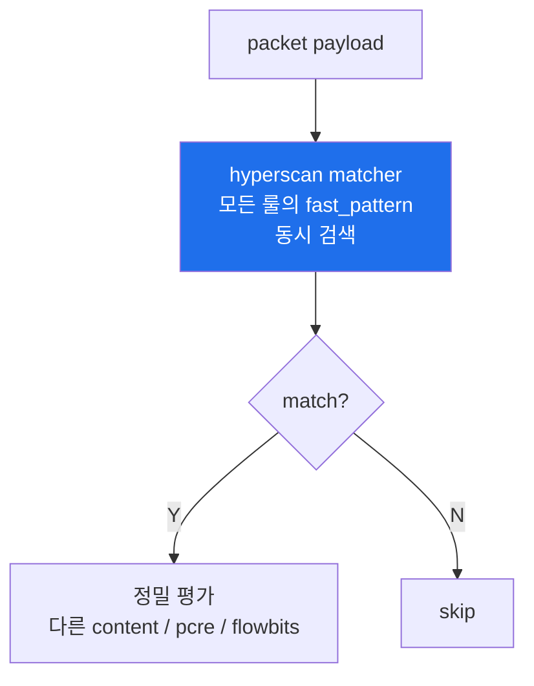
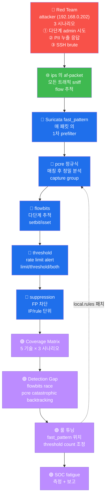

# Week 04 — Suricata IDS (2) — 룰 작성 심화 (pcre / fast_pattern / flowbits / threshold / suppression)

> **본 주차의 한 줄 요약**
>
> W03 의 단순 content 매칭에서 한 단계 위로 — **표현력** (pcre 정규식, content modifier
> 5종, HTTP buffer 9종) + **성능** (fast_pattern, prefilter) + **상태** (flowbits 다단계
> 추적) + **운영** (threshold rate-limit, suppression false-positive 차단). 학습 마지막
> 에 5 기술을 결합한 production-grade 룰 1개를 작성하고 R/B/P 로 검증한다.
>
> **운영자 한 줄 결론**: 룰의 표현력은 pcre, 성능은 fast_pattern, 상태는 flowbits,
> 운영은 threshold + suppression. 5 기술이 production Suricata 룰의 표준 조합.

---

## 학습 목표

본 주차 종료 시 학생은 다음 9가지를 **본인 손으로** 할 수 있어야 한다.

1. content modifier 5종 (`nocase` / `depth` / `offset` / `distance` / `within`) 의 의미
   와 결합 패턴을 화이트보드에 그린다.
2. HTTP buffer keyword 9종 (`http.uri` / `http.method` / `http.user_agent` /
   `http.host` / `http.cookie` / `http.request_body` / `http.response_body` /
   `http.stat_code` / `http.header`) 의 매칭 위치를 구분한다.
3. pcre 정규식 (PCRE2 호환) 의 6 modifier (`i` / `s` / `R` / `U` / `H` / `M`) + content
   prefilter 결합 패턴으로 한국 주민번호 / 신용카드 / SQL UNION 3 룰을 작성한다.
4. `fast_pattern` 의 multi-pattern matcher prefilter 효과를 hyperscan SIMD 와 연결해
   설명하고, 모든 사용자 룰에 명시한다.
5. `flowbits:set / isset / noalert / unset` 4 동작으로 다단계 공격 (401 실패 → /admin
   접근) 시나리오를 룰셋으로 구현한다.
6. `threshold:type both/limit/threshold, track by_src/by_dst/by_rule, count N, seconds M`
   3 mode + 3 track 의 효과 차이를 표로 정리한다.
7. `threshold.config` 의 `suppress` 와 `event_filter` 두 directive 의 운영 위치 (룰
   외부 통제) 와 룰 내부 `threshold` modifier 의 차이를 설명한다.
8. 5 기술 결합 1 룰 (sid 9005099 — sqlmap UNION SELECT rate-limited) 을 작성·검증·
   트리거·eve.json 분석 한 cycle.
9. **R/B/P 시나리오** — Red 가 다단계 공격 (login 실패 → admin 접근) → Blue 가 flowbits
   룰 매칭 → Purple 이 false-positive 분석 + suppression 권장.

---

## 0. 용어 해설

| 용어 | 영문 | 뜻 |
|------|------|----|
| **content** | — | 페이로드 byte 매칭 패턴 (literal string 또는 `\|XX\|` hex) |
| **modifier** | — | content 의 부가 조건 (nocase / depth / offset / distance / within) |
| **sticky buffer** | — | 뒤에 오는 content/pcre 가 적용될 영역 (http.uri 등) |
| **pcre** | Perl Compatible Regex | PCRE2 호환 정규식 |
| **fast_pattern** | — | multi-pattern matcher 의 prefilter content |
| **hyperscan** | — | Intel SIMD multi-pattern matcher (Suricata default) |
| **aho-corasick** | AC | 고전 fallback algorithm |
| **flowbits** | — | flow 단위 boolean flag (다단계 상태 추적) |
| **flowbits:set** | — | flag 켜기 |
| **flowbits:isset** | — | flag 검사 (true 일 때만 매치) |
| **flowbits:isnotset** | — | flag 검사 (false 일 때만 매치) |
| **flowbits:unset** | — | flag 끄기 |
| **flowbits:toggle** | — | flag 반전 |
| **flowbits:noalert** | — | 이 룰 자체는 alert 안 함 (state 만 set) |
| **flow** | — | 양방향 5-tuple conn |
| **flow:to_server** | — | client → server 방향 |
| **flow:to_client** | — | server → client 방향 |
| **flow:established** | — | TCP handshake 완료 후 |
| **threshold** | — | 룰 내부 rate-limit modifier |
| **threshold type limit** | — | N 도달 후 추가 alert 무시 (truncate) |
| **threshold type threshold** | — | N 마다 1 alert (sparse) |
| **threshold type both** | — | limit + threshold 결합 |
| **track by_src** | — | source IP 기준 |
| **track by_dst** | — | destination IP 기준 |
| **track by_rule** | — | 룰 전체 기준 (src 무관) |
| **suppress** | — | threshold.config 의 directive — alert 차단 |
| **event_filter** | — | threshold.config 의 directive — rate-limit |
| **rate_filter** | — | event_filter 의 한 type |
| **classtype** | — | 룰의 카테고리 (classification.config) |
| **metadata** | — | 룰의 부가 정보 (created_at, mitre_tactic) |

---

## 1. 룰 구조 심층 분석

### 1.1 production-grade 룰 한 줄 — 14 키 분석

```
alert tcp $EXTERNAL_NET any -> $HOME_NET 22 (
    msg:"el34 SSH brute force pattern";
    content:"SSH-"; depth:5; nocase;
    flow:to_server,established;
    threshold:type both, track by_src, count 5, seconds 60;
    classtype:attempted-recon;
    priority:2;
    sid:9000010;
    rev:2;
    metadata:created_at 2026_05_11, mitre_tactic_id TA0001;
    reference:url,attack.mitre.org/techniques/T1110;
)
```

14 키:

| 키 | 의미 |
|----|------|
| `alert` | action (alert / drop / reject / pass) |
| `tcp` | protocol (tcp/udp/icmp/http/dns/tls/ssh/smb/…) |
| `$EXTERNAL_NET any -> $HOME_NET 22` | 5-tuple (src_ip / src_port / -> / dst_ip / dst_port) |
| `msg` | 사람이 읽는 이름 |
| `content + depth + nocase` | 페이로드 byte 매칭 (처음 5 byte, 대소문자 무관) |
| `flow:to_server,established` | 방향 + state |
| `threshold` | rate-limit (60초에 5회 — 6번째부터 1 alert) |
| `classtype` | 카테고리 (classification.config) |
| `priority` | 1 (critical) ~ 4 (low) — alert sort 기준 |
| `sid` | 룰 고유 ID (custom 9000000+) |
| `rev` | revision |
| `metadata` | created_at + mitre tactic |
| `reference` | URL / CVE |

### 1.2 content modifier 5종 — 정확한 매칭 위치

| modifier | 의미 | 예 |
|----------|------|-----|
| `nocase` | 대소문자 무관 | `content:"select"; nocase;` |
| `depth:N` | 페이로드 첫 N byte 안에서만 검사 | `content:"GET "; depth:4;` |
| `offset:N` | 시작 N byte skip 후 검사 | `content:"HTTP/1.1"; offset:2;` |
| `distance:N` | 이전 content 매치 후 N byte 떨어진 곳 | `content:"user="; content:"pass="; distance:0;` |
| `within:N` | 이전 content 매치 후 N byte 이내 | `content:"GET "; content:"/admin"; within:50;` |

`distance + within` 으로 chained content: "X 다음에 Y 가 0~50 byte 안에 있는 경우" 매칭.

### 1.3 HTTP sticky buffer 9종 — 매칭 영역

```
http.uri              # URL path (예: /admin)
http.method           # GET / POST / PUT / DELETE / …
http.user_agent       # User-Agent header
http.host             # Host header (= hostname)
http.cookie           # Cookie header
http.request_body     # POST/PUT body
http.response_body    # response HTML/JSON
http.stat_code        # 응답 코드 (200 / 403 / 500 …)
http.header           # 모든 request header (raw)
```

> ⚠️ **Suricata 5.x 와 6.x 의 sticky buffer 문법 차이**:
> - 5.x: `content:"sqlmap"; http_user_agent;` (content 뒤 modifier)
> - 6.x: `http.user_agent; content:"sqlmap";` (전위 — sticky buffer 가 뒤에 오는
>   content 에 적용)
>
> el34 는 6.0.4 이므로 **전위 문법** 사용. 5.x 룰을 가져오면 silent fail.

### 1.4 sticky buffer 와 modifier 결합

```
alert http any any -> any any (
    msg:"admin path access (case insensitive, first 6 bytes)";
    http.uri;
    content:"/admin"; depth:6; nocase;
    sid:9000041;
)
```

`http.uri` sticky → 뒤에 `content:"/admin"` 이 URI 안에서만 매칭 + `depth:6` 으로 URI 의
첫 6 byte 안에서만 + `nocase` 로 대소문자 무관.

---

## 2. pcre — 정규식 의 깊이

### 2.1 syntax + 6 modifier

```
pcre:"/<regex>/<modifier>"
```

| modifier | 의미 |
|----------|------|
| `i` | nocase (대소문자 무관) |
| `s` | dot matches newline (`. ` 가 `\n` 도 매치) |
| `R` | relative — 이전 content 매치 후 |
| `U` | URI buffer (http.uri 대용) |
| `H` | HTTP request header buffer |
| `M` | HTTP method buffer |

### 2.2 자주 쓰는 pcre 패턴 5

```
# 1. 한국 주민번호 (NNNNNN-N NNNNNN)
pcre:"/\d{6}-[1-4]\d{6}/"

# 2. 16자 신용카드번호 (4-4-4-4)
pcre:"/[0-9]{4}-[0-9]{4}-[0-9]{4}-[0-9]{4}/"

# 3. email 주소
pcre:"/[a-zA-Z0-9._%+-]+@[a-zA-Z0-9.-]+\.[a-zA-Z]{2,}/"

# 4. SQL UNION 패턴
pcre:"/\bunion\b\s+\bselect\b/i"

# 5. base64 인코딩 (40+ 자)
pcre:"/[A-Za-z0-9+\/=]{40,}/"
```

### 2.3 pcre 만 vs content + pcre — 성능 비교

| 패턴 | 비용 | 운영 권장 |
|------|------|----------|
| `pcre:"/...something.../i"` (단독) | 모든 packet 의 페이로드에 정규식 평가 | 부적합 |
| `content:"something"; pcre:"/...something.../i"` | content 가 prefilter (fast_pattern auto) | **표준** |

production 룰의 **모든 pcre 는 content prefilter 동반**. content 매치된 packet 만 pcre
평가 → CPU 절약 + drop rate 0% 달성.

### 2.4 content + pcre 결합 예

```
alert http any any -> any any (
    msg:"SQL UNION SELECT injection";
    http.uri;
    content:"union"; fast_pattern; nocase;   ← prefilter (multi-pattern matcher)
    pcre:"/\bunion\b\s+\bselect\b/i";        ← 정밀 매치 (word boundary + whitespace)
    classtype:web-application-attack;
    priority:1;
    sid:9000012;
)
```

`content:"union"` 가 hyperscan 의 multi-pattern matcher 가 빠르게 prefilter → 매치된
packet 만 pcre 의 정밀 평가. union 이 단순 word 안에 들어 있는 false-positive 도 pcre
의 `\b` (word boundary) 가 차단.

---

## 3. fast_pattern — multi-pattern matcher 의 prefilter

### 3.1 동작 원리

Suricata 가 수만 룰을 매 packet 마다 순회 평가하면 throughput 0. 대신 **각 룰의 1개
content 를 fast_pattern 으로 등록** → hyperscan 의 multi-pattern matcher 가 모든 룰의
fast_pattern 을 동시 검색 → 매치된 룰만 정밀 평가.



### 3.2 자동 vs 명시

자동 (default):
- 각 룰의 가장 긴 content 를 자동 선택
- 가장 selective (희소한 byte sequence) 가 좋음
- 운영자 의도와 불일치 가능

명시 (권장):
```
alert http any any -> any any (
    msg:"sqlmap UA";
    http.user_agent;
    content:"sqlmap"; fast_pattern; nocase;       ← 명시 (selective)
    content:"/1.0";                               ← prefilter 아님
    sid:9000013;
)
```

### 3.3 fast_pattern 선택 기준

| 기준 | 이유 |
|------|------|
| **selective** (희소한 byte) | 1차 매치 횟수 적음 → CPU 절약 |
| **긴 string** | 짧으면 false-match 많음 |
| **bigram entropy 높음** | 정상 traffic 에 흔하지 않은 byte 조합 |
| **nocase 미사용** | nocase 는 case 별 2배 평가 |

선택 안 좋은 예: `content:"GET "; fast_pattern;` (모든 HTTP request 가 매치)
선택 좋은 예: `content:"sqlmap"; fast_pattern;` (도구 시그니처, 정상에 거의 없음)

### 3.4 운영 검증

```bash
sudo suricatasc -c dump-counters | jq '.message | with_entries(select(.key | contains("fast")))'
# detect.alert.fastpattern 이 룰 매치 성능 지표
```

ETOpen 룰셋의 대부분이 이미 fast_pattern 명시. 사용자 정의 룰 작성 시 항상 명시 권장.

---

## 4. flowbits — 다단계 공격 추적

### 4.1 4 동작 (set / isset / noalert / unset)

flowbits 는 **flow 단위 boolean flag**. 한 conn 의 여러 단계 상태를 추적.

| 동작 | 효과 |
|------|------|
| `flowbits:set,name` | flag 켜기 |
| `flowbits:isset,name` | flag 켜져 있을 때만 매치 |
| `flowbits:isnotset,name` | flag 꺼져 있을 때만 매치 |
| `flowbits:unset,name` | flag 끄기 |
| `flowbits:toggle,name` | flag 반전 |
| `flowbits:noalert` | 이 룰 자체는 alert 안 함 (flag 만 set) |

### 4.2 시나리오 — 401 응답 후 같은 conn 에서 /admin 접근

**룰 1 (state set, alert 없음)**:
```
alert http any any -> any any (
    msg:"step1 — 401 response";
    http.stat_code; content:"401";
    flowbits:set,fb_auth_failed;
    flowbits:noalert;                  ← 이 룰 자체로는 alert 없음, state 만
    sid:9005010; rev:1;
)
```

**룰 2 (state isset, alert 발생)**:
```
alert http any any -> any any (
    msg:"step2 — admin access after auth failure";
    http.uri; content:"/admin";
    flowbits:isset,fb_auth_failed;     ← step1 의 flag 가 켜진 경우만
    classtype:successful-recon;
    priority:1;
    sid:9005011; rev:1;
)
```

### 4.3 실측 검증 (2026-05-12)

```
[Step 1] curl with FlowbitTest UA → 매치 (state set, noalert)
[Step 2] curl /admin → step1 의 flag 가 켜진 conn 이라면 alert
```

eve.json 결과:
```json
{
  "action": "allowed",
  "signature_id": 9005002,
  "signature": "step2 admin after step1",
  "severity": 3
}
```

severity 3 (default) — priority 명시 안 했으므로.

### 4.4 flowbits 의 운영 제약

- **flow 단위** (5-tuple conn). 같은 client 가 새 conn 열면 flag 초기화.
- **flow timeout** (default 60초 ESTABLISHED) 후 flag 만료. long-lived 분석은 flowbits
  대신 SIEM 통합 (W09).
- **flow memcap** 도달 시 일부 flow context drop → flowbits 가 lost. `flow.memcap` 모니터링.
- **분산 환경 무용**: load balancer 가 같은 client 의 packet 을 다른 Suricata instance
  로 보내면 flow context split → flowbits 불완전. anycast 환경은 affinity 필요.

---

## 5. threshold — rate-limit (룰 내부 modifier)

### 5.1 syntax

```
threshold:type <mode>, track <track>, count <N>, seconds <M>;
```

### 5.2 3 mode 비교

| type | 의미 | 예 (count 5, seconds 60) |
|------|------|--------------------------|
| `limit` | N 도달 후 추가 alert **무시** | 60초에 5건만, 6번째부터 0 |
| `threshold` | N 마다 1 alert | 60초에 5건 발생 → 1 alert, 10건 → 2 alert |
| `both` | limit + threshold 결합 | N 채워야 첫 alert, 후속은 N 마다 1 |

`both` 가 가장 흔한 운영 패턴 — 짧은 burst 무시 + 지속 공격 시 sparse alert.

### 5.3 3 track 비교

| track | 의미 | 적용 |
|-------|------|------|
| `by_src` | source IP 기준 | brute force (한 attacker) |
| `by_dst` | destination IP 기준 | DDoS (한 victim) |
| `by_rule` | 룰 전체 (IP 무관) | global rate-limit |

### 5.4 예 — SSH brute force

```
alert tcp any any -> any 22 (
    msg:"SSH brute force pattern";
    flow:to_server,established;
    threshold:type both, track by_src, count 5, seconds 60;
    sid:9000050; rev:1;
)
```

같은 src IP 가 60초에 5회 SSH 시도 → 6번째부터 1 alert (그 후 5건 마다 1 alert).

---

## 6. threshold.config — 운영 통제 (룰 외부)

룰 자체 modifier 와 별개로 **운영자 외부 통제**. 룰 수정 없이 동적 변경 가능.

### 6.1 directive 2종

```
# /etc/suricata/threshold.config

# 1. suppress — alert 차단
suppress gen_id 1, sig_id 2003020                              # 룰 완전 비활성
suppress gen_id 1, sig_id 2003020, track by_src, ip 10.20.32.50  # 특정 src 만

# 2. event_filter — rate-limit
event_filter gen_id 1, sig_id 2010001, type limit, \
    track by_src, count 5, seconds 60                          # rate-limit
event_filter gen_id 1, sig_id 2010001, type threshold, \
    track by_dst, count 10, seconds 60                         # sparse
event_filter gen_id 1, sig_id 2010001, type rate_filter, \
    track by_src, count 5, seconds 60, new_action drop, \
    timeout 300                                                # 5건 도달 시 5분간 drop
```

### 6.2 적용 + 검증

```bash
# threshold.config 활성화 (suricata.yaml 의 threshold-file 라인)
sudo grep "threshold-file" /etc/suricata/suricata.yaml
# threshold-file: /etc/suricata/threshold.config

# 적용
sudo suricatasc -c reload-rules

# 검증
sudo suricatasc -c dump-counters | jq '.message | with_entries(select(.key | contains("filter")))'
```

### 6.3 룰 modifier vs threshold.config — 운영 선택

| 측면 | 룰 modifier | threshold.config |
|------|-------------|-------------------|
| 위치 | 룰 안 | 외부 파일 |
| 변경 | 룰 수정 + reload | config 수정 + reload |
| 표현 | type/track/count/seconds | + suppress + rate_filter (drop) |
| 운영 책임 | 룰 작성자 | 운영자 |
| 사용 시점 | 룰 본질 | false-positive 튜닝 |

**권장**: 룰 modifier 는 본질적 rate-limit (예: brute force 룰의 5/60s). suppression /
사이트별 rate 는 threshold.config 로 분리. **분리가 운영 가시성 + git audit 의 핵심**.

---

## 7. suppression — false-positive 차단

### 7.1 시나리오 — 모니터링 서버의 health check

운영 모니터링 서버 (예: portal 10.20.32.50) 가 매분 health check 로 ET POLICY 룰 매치 →
운영자가 false-positive 판단:

```
# /etc/suricata/threshold.config
suppress gen_id 1, sig_id 2010001, track by_src, ip 10.20.32.50
```

reload 후 portal IP 발생 sid 2010001 alert 만 차단. 다른 src 는 정상 alert.

### 7.2 IP range suppression

```
suppress gen_id 1, sig_id 2010001, track by_src, ip [10.20.30.0/24,10.20.31.0/24]
```

내부 두 subnet 모두 차단. IPv6 도 동일.

### 7.3 운영 audit — git 추적 필수

```
# git 의 /etc/suricata/threshold.config
# commit log 가 곧 audit log
```

매 변경 git commit + ticket # reference + 정당화 근거 작성. 분기 검토.

---

## 8. 5 기술 결합 — production-grade 룰 1개

```
alert http $EXTERNAL_NET any -> $HOME_NET any (
    msg:"el34 sqlmap UNION SELECT attempt (rate-limited)";
    flow:to_server,established;

    # 1. fast_pattern — multi-pattern matcher prefilter
    http.user_agent; content:"sqlmap"; fast_pattern; nocase;

    # 2. pcre + content prefilter — precise SQL injection
    http.request_body;
    content:"union"; nocase;
    pcre:"/\bunion\b\s+\bselect\b/i";

    # 3. threshold — rate-limit (alert flood 차단)
    threshold:type limit, track by_src, count 1, seconds 60;

    # 4. classification + priority + sid
    classtype:web-application-attack;
    priority:1;
    sid:9005099; rev:1;

    # 5. metadata + reference (audit + IR)
    metadata:created_at 2026_05_11, mitre_tactic_id TA0001;
    reference:url,attack.mitre.org/techniques/T1190;
)
```

5 기술 사용:
1. **content + fast_pattern** — UA 의 prefilter
2. **pcre + content prefilter** — request_body 의 정밀 매치
3. **threshold** — rate-limit
4. **classtype + priority + sid** — 분류
5. **metadata + reference** — audit + IR

---

## 9. 트러블슈팅 — 룰 작성 시 4 흔한 실수

### 9.1 실수 1 — sticky buffer 와 modifier 순서

**5.x 문법 (틀림)**:
```
content:"sqlmap"; http_user_agent;     ← Suricata 6.x 에서는 미작동
```

**6.x 문법 (올바름)**:
```
http.user_agent; content:"sqlmap";     ← sticky buffer 전위
```

진단: `suricata.log` 에 `Error parsing signature` + 정확한 줄/열 표시. 5.x 문법 자동
변환 도구 없음 — 수동 수정.

### 9.2 실수 2 — pcre 단독 (성능)

**부적합**:
```
pcre:"/\bunion\b\s+\bselect\b/i";    ← prefilter 없음, 모든 packet 의 body 평가
```

증상: drop_rate 증가, CPU 폭주.

**해결**:
```
content:"union"; nocase;
pcre:"/\bunion\b\s+\bselect\b/i";    ← content 가 prefilter
```

### 9.3 실수 3 — flowbits 의 flow 경계 무시

증상: 다단계 룰이 매치되어야 하는데 안 됨.

원인: client 가 step1 (401) 받은 후 새 TCP conn 으로 step2 (/admin) 요청 → flow_id 다름
→ flowbits 가 다른 flow.

진단:
```bash
sudo grep "9005002" /var/log/suricata/eve.json | jq -r .flow_id | sort -u
# 다양한 flow_id 면 각 conn 마다 새 시작
```

해결: HTTP/1.1 keep-alive 보장 (browser 는 자동, curl 은 `-K` 옵션) 또는 flowbits 대신
xff / IP 기반 SIEM 통합 (W09).

### 9.4 실수 4 — threshold count 0

증상: alert 가 너무 적음.

원인: `threshold:type limit, track by_src, count 1, seconds 60` → 60초에 1번만 (대부분
무시). 운영 의도와 불일치.

해결: count/seconds 비율 검토 + production 의 실 traffic 분포 기준.

---

## 10. el34 의 실 운영 적용 — Wazuh 통합 W09 예고

Suricata 의 eve.json 이 Wazuh agent → manager → dashboard 로 ship.

```
el34-ips:/var/log/suricata/eve.json
  ↓ Wazuh agent
el34-siem (manager) :1514
  ↓ analysisd decoder + 룰
el34-wazuh-indexer (OpenSearch)
  ↓ dashboard
el34-wazuh-dashboard :5601
```

W09 에서 Wazuh agent.conf 의 eve.json polling + decoder 설정 + dashboard 의 Suricata
panel 본격 설정.

---

## 11. 사례 분석

### 11.1 ISMS-P 매핑 (W03 와 동일 — 룰 심화)

본 주차의 5 기술 (pcre / fast_pattern / flowbits / threshold / suppression) 이 ISMS-P
2.6.4 의 "정확도 + 효율 + audit + 운영 튜닝" 의 표준 구현.

### 11.2 NIST CSF DE.AE-1 (Network Event Analysis)

flowbits 의 다단계 추적이 DE.AE-1 의 "이벤트 상관분석" 의 in-line 구현.

### 11.3 KISA 2025 사례 — 다단계 침해 패턴

KISA 2025 Q1 보고서의 금융권 침해 사례 — login brute force → MFA bypass → admin access.
flowbits 3단계 룰로 재현 가능:

```
sid:9005020 — step1: /login 의 401 응답 → set fb_brute
sid:9005021 — step2: fb_brute set + /mfa/verify → set fb_mfa_attempt
sid:9005022 — step3: fb_mfa_attempt set + /admin → alert (high priority)
```

### 11.4 운영 사고 3 사례 (현장 학습)

**사례 1 — pcre 단독으로 CPU 100%**:
```
운영자: SQL injection pcre 룰 작성, content prefilter 누락
결과: drop_rate 가 5% 도달 → SOC 분석가가 missing alert 발견
복구: content prefilter 추가 → 즉시 drop_rate 0%
```

**사례 2 — 5.x 룰 가져오기 silent fail**:
```
운영자: Snort 룰셋을 Suricata 6 에 import → reload OK 지만 alert 없음
원인: sticky buffer 5.x 후위 → 6.x 전위 미변환
복구: suricata-update 의 `--free-form-converter` 또는 수동 변환
```

**사례 3 — threshold 의 count 0 으로 alert 누락**:
```
운영자: alert flood 우려로 threshold:type limit count 1 seconds 60 적용
결과: 분당 1 alert 만 → 진짜 burst 공격 시 5번째 ~ 60번째 alert 누락 (loss)
교훈: limit 보다 both 가 안전 (첫 alert + sparse 후속)
```

---

## 12. 실습 시나리오 (4 축 설명)

각 실습은 룰 작성 → `-T` 검증 → reload → 트리거 → eve.json 확인 사이클.

### 실습 1 — pcre 정규식 룰 (한국 주민번호)

```
alert http any any -> any any (
    msg:"el34 RRN pattern in POST body";
    http.request_body;
    content:"|2d|"; nocase;             ← prefilter ('-' byte)
    pcre:"/\d{6}-[1-4]\d{6}/";
    classtype:policy-violation;
    priority:2;
    sid:9005040; rev:1;
)
```

트리거: `curl -X POST -d "rrn=901231-1234567"` 형식.

### 실습 2 — http.uri + nocase + depth (5 modifier 결합)

```
alert http any any -> any any (
    msg:"admin path access (case insensitive, first 6 bytes)";
    http.uri;
    content:"/admin"; depth:6; nocase; fast_pattern;
    classtype:attempted-recon;
    priority:2;
    sid:9005041; rev:1;
)
```

### 실습 3 — flowbits 다단계 (401 → /admin)

위 §4.2 의 9005010 + 9005011 두 룰.

### 실습 4 — fast_pattern 명시 vs 미명시 (성능 비교 시뮬)

같은 룰 2 버전 (sid 9005042 / 9005043) — 한쪽은 fast_pattern 명시, 다른쪽은 미명시.
1000건 traffic 발생 후 dump-counters 의 detect.alert 시간 비교 (실측은 환경 의존).

### 실습 5 — threshold rate-limit (SSH brute force)

```
alert tcp any any -> any 22 (
    msg:"SSH probe (rate-limited)";
    flow:to_server;
    threshold:type both, track by_src, count 5, seconds 30;
    sid:9005050; rev:1;
)
```

attacker 에서 30초에 6번 SSH 시도 → 첫 alert + 그 후 5건 마다 1 alert.

### 실습 6 — suppression (threshold.config)

```
# /etc/suricata/threshold.config 에 추가
suppress gen_id 1, sig_id 9005041, track by_src, ip 10.20.31.1  # NAT 후 ips pipe NIC
```

attacker (192.168.0.202) 에서는 9005041 alert 없음. 다른 src 는 정상.

### 실습 7 — **R/B/P** + 종합 룰 (5 기술 결합 + 다단계)

§8 의 9005099 종합 룰 + flowbits 다단계 결합.

---

## 12.5 R/B/P 공격 분석 케이스 확장 (본 주차 추가)

### 12.5.0 R/B/P 일상 비유 — 정밀 검사관의 4 도구

본 절은 W04 의 룰 작성 5 기술을 정밀 검사관 비유로 시작한다.

학생이 다니는 도서관에 새 검사관이 왔다고 하자. 이번 검사관은 단순히 가방의 책 제목을 보는 것을 넘어 다음 네 도구를 한꺼번에 쓴다.

- **돋보기 (정규식, pcre).** 글자 패턴을 자세히 본다. 주민번호 형식, 카드번호 형식 같은 미묘한 패턴을 잡아낸다.
- **위치 표시자 (content modifier).** 라벨이 가방의 어느 위치에 붙어 있는지 본다. URL 앞 부분인지, header 인지, body 인지를 구분한다.
- **순서 기록부 (flowbits).** 한 손님이 도서관에서 한 행동의 순서를 기록한다. 먼저 로그인 실패하고, 그 다음 관리자 페이지로 가는 행위를 묶어 본다.
- **빈도 제한판 (threshold + suppression).** 같은 사람이 짧은 시간에 몇 번 시도했는지 센다. 임계치를 넘으면 보고서를 올리고, 정상 직원의 헬스체크는 보고에서 제외한다.

| 일상 비유 | Suricata 룰 작성 |
|-----------|------------------|
| 돋보기로 정밀 검사 | pcre + content modifier |
| 라벨 위치 식별 | http.uri / http.header / http.user_agent |
| 순서 기록부 | flowbits set / isset |
| 빈도 제한판 | threshold (rate-limit) + suppression |
| 검사관 매뉴얼 보강 | local.rules + threshold.config 갱신 |

본 절은 다음 세 케이스를 다룬다.

- 케이스 1 — 다단계 공격 (login 실패 후 admin 접근) 을 flowbits 로 추적한다.
- 케이스 2 — 한국 주민번호 형식 leak 시도를 pcre 로 잡아낸다.
- 케이스 3 — SSH brute force 를 threshold 로 잡고, 정상 health check 는 suppression 으로 제외한다.

원칙은 W01 ~ W03 와 같다. 재현 가능성, 도구 위주 분석, 신입생 친화, 학습 환경 한정.

### 12.5.1 케이스 1 — 다단계 공격 (login fail → admin) 의 flowbits 추적

**0. 일상 비유 — 도둑이 우선 가짜 회원증을 내밀어 보고 거절당하면 직원 출입구로 시도.**

도둑이 도서관 정문에서 가짜 회원증을 내민다. 사서가 회원증 확인에 실패한다. 도둑은 곧장 옆에 있는 직원 전용 출입구로 향한다. 검사관 일지에 두 행위가 따로 기록되면 별개 사건처럼 보이지만, 같은 사람이 한 세션 안에서 두 행위를 한 묶음으로 기록하면 다단계 침투 시도임이 드러난다.

| 일상 비유 | 다단계 공격 |
|-----------|-------------|
| 가짜 회원증 내밀기 | HTTP 401 / 403 응답을 받는 login 시도 |
| 같은 사람이 직원 출입구로 시도 | 같은 TCP flow 안의 `/admin/` 접근 |
| 일지의 묶음 기록 | flowbits 의 set + isset |
| 묶음 보고 | 단일 alert 로 다단계 침투 표시 |

**0a. 사용 도구 사전 안내.**

- **curl** — HTTP 요청을 보내는 표준 도구. 학습 환경 web 의 admin endpoint 가 401 또는 403 으로 응답하는지 확인할 때 쓴다.
- **flowbits** — Suricata 룰의 변수. set 으로 표식을 켜두고 isset 으로 그 표식이 켜진 상태에서만 매칭한다.
- **eve.json 의 flow_id 필드** — 한 TCP connection 의 고유 ID. 두 event 의 flow_id 가 같으면 같은 flow 안의 두 단계다.

**1. Red — 공격 재현.**

attacker VM 에 들어가서 첫 단계로 admin 인증을 시도한 뒤, 같은 connection 의 두 번째 단계로 다른 admin path 에 접근한다. 학습 환경 안에서만 실행해야 한다.

```bash
ssh att@192.168.0.202
# 비밀번호: 1
```

attacker VM 내부에서 다음 두 줄을 짧은 간격으로 실행한다.

```bash
# attacker VM 내부 (학습 환경 한정)
curl -s -o /dev/null -w "%{http_code}\n" \
    -u admin:wrong http://juice.el34.lab/admin/

curl -s -o /dev/null -w "%{http_code}\n" \
    -H "Cookie: session=guess" \
    http://juice.el34.lab/admin/users.json
```

각 옵션의 의미는 다음과 같다.

- `-s` — silent. 진행 출력을 끈다.
- `-o /dev/null` — body 응답은 버린다.
- `-w "%{http_code}\n"` — 응답 코드만 출력한다.
- `-u admin:wrong` — Basic Auth. admin 으로 잘못된 비밀번호를 시도한다.
- 두 번째 줄의 `-H "Cookie: ..."` — 임의의 cookie 로 추가 admin path 에 접근한다.

첫 번째 시도는 401 응답을 받는다. 두 번째 시도는 정상이면 401 또는 403 응답을 받는다. 두 시도가 짧은 시간 안에 같은 src 에서 일어났다.

**2. 발생하는 로그/아티팩트.**

ips 의 Suricata 가 두 HTTP transaction 모두를 eve.json 에 http event 로 기록한다.

```json
{"flow_id":1234567890,"event_type":"http",
 "http":{"hostname":"...","url":"/admin/","http_method":"GET","status":401,...}}

{"flow_id":1234567890,"event_type":"http",
 "http":{"hostname":"...","url":"/admin/users.json","http_method":"GET","status":401,...}}
```

flow_id 가 같으면 같은 connection 이다. HTTP/1.1 keep-alive 가 아니면 두 시도가 다른 flow 가 될 수도 있다. 실제 운영에서는 src_ip + 시간 window 기반으로 묶는 보조 룰을 함께 둔다.

**3. Blue — flowbits 룰 작성 + reload + Kibana 분석.**

ips VM 에 들어가서 local.rules 에 다음 두 줄을 추가한다.

```bash
ssh ccc@10.20.31.2
sudo tee -a /etc/suricata/rules/local.rules > /dev/null <<'EOF'
alert http any any -> $HOME_NET any (msg:"LOCAL Stage1 Admin 401"; \
  flow:to_server,established; http.uri; content:"/admin/"; \
  http.stat_code; content:"401"; flowbits:set,local.admin_401; \
  flowbits:noalert; sid:9005101; rev:1;)

alert http any any -> $HOME_NET any (msg:"LOCAL Stage2 Admin Access After 401"; \
  flow:to_server,established; flowbits:isset,local.admin_401; \
  http.uri; content:"/admin/"; \
  classtype:web-application-attack; sid:9005102; rev:1;)
EOF
```

룰의 역할은 다음과 같다.

- `9005101` — `/admin/` 에서 401 응답을 받으면 flowbits `local.admin_401` 을 켜고 alert 자체는 발생시키지 않는다 (`noalert`).
- `9005102` — `local.admin_401` 표식이 켜진 같은 flow 에서 `/admin/` 에 다시 접근하면 alert 가 발생한다.

룰을 reload 한다.

```bash
sudo suricatasc -c reload-rules
```

attacker VM 에서 위 Red 시나리오를 다시 한 번 실행한 뒤 ips 에서 alert 발생 여부를 확인한다.

```bash
sudo tail -50 /var/log/suricata/eve.json \
  | jq -r 'select(.event_type=="alert" and .alert.signature_id==9005102)
           | "\(.timestamp) \(.src_ip) -> \(.dest_ip) \(.alert.signature)"'
```

다음으로 Kibana Discover 에서도 확인한다.

1. 좌측 햄버거 메뉴 → `Discover` 선택.
2. Index pattern `suricata-*`, Time picker `Last 15 minutes`.
3. Search bar 에 `event_type:alert AND alert.signature_id:9005102` 를 입력하고 Enter.
4. 결과 한 줄을 펼쳐 `flow_id` 와 `src_ip` 를 확인한다.

**4. Blue — 대응 의사결정.**

학생이 다음 세 가지를 판단한다.

- **단일 stage alarm 의 SOC fatigue.** 401 한 건만으로 alert 를 올리면 모든 잘못된 로그인이 알람이 된다. flowbits 결합으로 다단계만 알람화 하는 것이 운영 부담을 줄인다.
- **flow 경계 인식.** keep-alive 가 끊기면 다른 flow 가 된다. 운영 환경에서는 cookie + src_ip 기반으로 묶는 부가 룰도 함께 둔다.
- **대응 강도.** 다단계 alert 만 active-response 와 연계한다. 단발 401 은 모니터링에 머문다.

**5. Purple — 보완.**

다음 세 가지를 적용한다.

- **flowbits timeout 설정.** flowbits 가 너무 오래 살아 있으면 정상 운영 client 까지 영향이 미친다. 적절한 timeout 을 명시한다.
- **9005102 의 threshold 추가.** 같은 src 에서 1분당 1건만 통과시키도록 event_filter 를 둔다.
- **9005101 의 noalert 검토.** noalert 로 두면 단발 401 의 audit trail 이 약해진다. 별도로 stat_code 401 의 광범위 카운트 룰을 두어 보강한다.

본 케이스 cycle 한 바퀴는 약 25분 정도다.

### 12.5.2 케이스 2 — 한국 주민번호 형식 leak 시도의 pcre 탐지

**0. 일상 비유 — 도서관 안의 회원이 회원 명부를 사진으로 찍어서 들고 나가려는 시도.**

도서관 회원 한 명이 회원 명부 사본을 가방에 넣고 나가려고 한다. 검사관이 가방을 열면 회원 정보가 적힌 종이가 보인다. 종이의 형식 (이름, 주민번호, 연락처) 이 사전에 정의된 패턴에 맞으면 검사관이 즉시 회수한다.

이 비유를 한국 주민번호 형식 leak 에 옮긴다.

| 일상 비유 | 한국 주민번호 leak |
|-----------|---------------------|
| 회원 명부 사본 | HTTP 응답 body 안의 PII |
| 가방 열어 종이 확인 | Suricata 의 http.response_body 검사 |
| 사전에 정의된 형식 | pcre 의 주민번호 패턴 |
| 즉시 회수 | alert + IR 절차 시작 |

**0a. 사용 도구 사전 안내.**

- **pcre** — Perl Compatible Regular Expression. 한국 주민번호의 6자리-7자리 형식을 정밀하게 표현한다.
- **http.response_body** — Suricata 의 sticky buffer. HTTP 응답 body 영역만 검사한다.
- **classtype** — alert 의 분류. PII leak 는 `sensitive-data` 가 표준이다.

**1. Red — 공격 재현.**

attacker VM 에서 학습 환경의 web 에 응답 body 안에 주민번호 형식 문자열이 들어가는 시뮬을 만든다. 학습 환경 한정으로 실행한다.

학습 환경의 web 에 데모용 endpoint `/demo/leak.html` 이 있다고 가정한다. 응답 body 에 가짜 주민번호 (`900101-1234567`) 가 포함되어 있다.

```bash
ssh att@192.168.0.202

# attacker VM 내부 (학습 환경 한정)
curl -s http://juice.el34.lab/demo/leak.html | head -10
```

응답 body 에 `900101-1234567` 같은 형식 문자열이 보이면 leak 시뮬이 성공이다.

**2. 발생하는 로그/아티팩트.**

ips 의 Suricata 가 응답 body 를 sniff 한다. 적합한 룰이 있다면 alert 가 발생한다. 룰이 없으면 단지 http event 만 기록된다.

**3. Blue — pcre 룰 작성 + reload + 분석.**

ips VM 에 들어가서 local.rules 에 주민번호 형식 룰을 추가한다.

```bash
ssh ccc@10.20.31.2
sudo tee -a /etc/suricata/rules/local.rules > /dev/null <<'EOF'
alert http any any -> any any (msg:"LOCAL PII Leak - Korean RRN Format"; \
  flow:to_client,established; http.response_body; \
  pcre:"/\b[0-9]{6}-[1-4][0-9]{6}\b/"; \
  classtype:sensitive-data; sid:9005103; rev:1;)
EOF
sudo suricatasc -c reload-rules
```

pcre 패턴의 각 부분 의미는 다음과 같다.

- `\b` — 단어 경계. 다른 숫자가 앞뒤에 붙어 있지 않은 깔끔한 패턴만 매칭한다.
- `[0-9]{6}` — 생년월일 6자리.
- `-` — 하이픈.
- `[1-4]` — 성별/세기 식별 첫 자리. 1~4 가 가장 흔한 학습용 범위다.
- `[0-9]{6}` — 뒷자리 6 숫자.

attacker VM 에서 위 curl 을 다시 보낸 뒤 ips 에서 alert 발생 여부를 확인한다.

```bash
sudo tail -100 /var/log/suricata/eve.json \
  | jq -r 'select(.event_type=="alert" and .alert.signature_id==9005103)
           | "\(.timestamp) \(.src_ip) -> \(.dest_ip) \(.alert.signature)"'
```

Kibana Discover 에서도 같은 방식으로 본다.

1. Search bar 에 `event_type:alert AND alert.signature_id:9005103` 입력.
2. 결과 한 줄을 펼친다. `flow_id`, `src_ip`, `dest_ip`, `http.url` 을 확인한다.

**4. Blue — 대응 의사결정.**

학생이 다음 세 가지를 판단한다.

- **false positive 위험.** 6-7 숫자 형식은 단순 우편번호 결합 같은 정상 콘텐츠와도 부합할 수 있다. `\b` 와 두 번째 자리 `[1-4]` 로 false positive 를 줄였다.
- **대응 강도.** PII leak 의심 alert 는 곧장 차단보다 IR (incident response) 절차 시작이 표준이다. 차단은 affected user 의 정상 운영을 끊을 수 있다.
- **법적 의무.** 한국 개인정보보호법은 PII leak 인지 시 통지와 KISA 신고를 요구한다. 본 alert 가 진짜 leak 이면 그 절차를 즉시 시작한다.

**5. Purple — 보완.**

다음 세 가지를 적용한다.

- **추가 PII 패턴.** 신용카드 (Luhn check 적용 가능), 휴대전화 (010-XXXX-XXXX), 여권번호 (M12345678) 도 별도 룰로 둔다.
- **threshold 적용.** 같은 dest_ip 에 분당 5건 이상이면 한 줄로 묶어 SOC 부담을 줄인다.
- **마스킹 검증.** 응답 body 에 PII 가 보였다면 web 의 출력 마스킹 로직이 깨졌을 가능성이 크다. 즉시 web 코드 검토 의뢰를 동반한다.

### 12.5.3 케이스 3 — SSH brute force 의 threshold 탐지 + 정상 health check 의 suppression

**0. 일상 비유 — 자물쇠를 100번 시도하는 도둑 + 정상 정비 직원은 알람 제외.**

도둑이 도서관 사물함의 자물쇠를 100번 시도한다. 동시에 도서관 정비 직원이 정기적으로 정상 점검을 위해 같은 자물쇠를 짧게 만진다. 검사관 매뉴얼이 단순하면 정비 직원의 정상 점검도 도둑 시도와 같은 알람으로 보고된다. 정비 직원의 점검은 매뉴얼에서 사전에 예외 처리해야 한다.

| 일상 비유 | SSH brute force 운영 |
|-----------|---------------------|
| 자물쇠 100번 시도 | SSH 의 password 시도 burst |
| 정상 정비 직원 | 학습 환경의 health check 서버 IP |
| 매뉴얼의 알람 빈도 제한 | threshold (rate-limit) |
| 매뉴얼의 예외 처리 | threshold.config 의 suppress |

**0a. 사용 도구 사전 안내.**

- **hydra** — 학습용 brute force 도구. attacker VM 에 설치된 버전을 짧은 wordlist 와 함께 쓴다.
- **threshold.config** — 운영자 외부 통제. 룰 자체를 수정하지 않고 alert 의 빈도와 예외를 제어한다.
- **suppress** — 특정 src/dst 의 alert 를 제외한다. 정상 운영의 false positive 를 줄인다.

**1. Red — 공격 재현.**

attacker VM 에서 hydra 로 학습 환경 web 의 SSH 에 password 를 짧게 brute 한다. 학습 환경 한정으로 실행한다.

```bash
ssh att@192.168.0.202

# attacker VM 내부 (학습 환경 한정)
cat > /tmp/words.txt <<'EOF'
password
123456
admin
root
toor
EOF

hydra -l admin -P /tmp/words.txt -t 4 -f ssh://10.20.32.80 2>&1 | tail -10
```

각 옵션의 의미는 다음과 같다.

- `-l admin` — login 이름.
- `-P /tmp/words.txt` — password wordlist.
- `-t 4` — 동시 4 thread.
- `-f` — 한 건 성공하면 즉시 종료.
- `ssh://10.20.32.80` — target SSH 서비스 (el34-web dmz). 학습 환경에서는 fw forward chain 이 ext→dmz:22 를 의도적으로 허용한다.

5 password 시도가 짧은 시간에 SSH 로 들어간다. 모두 실패한다.

**2. 발생하는 로그/아티팩트.**

ips 의 Suricata 는 SSH protocol 의 ssh event 를 eve.json 에 기록한다. password 자체는 암호화되어 보이지 않지만 connection 시도 수와 client/server version 은 보인다. 같은 traffic 이 web VM 의 `/var/log/auth.log` 에도 sshd 실패 라인 5건으로 기록되며, Wazuh agent 가 그것을 manager 로 forward 한다.

**3. Blue — threshold 룰 + suppression 적용.**

ips VM 에 다음 룰을 추가한다.

```bash
ssh ccc@10.20.31.2
sudo tee -a /etc/suricata/rules/local.rules > /dev/null <<'EOF'
alert ssh any any -> $HOME_NET 22 (msg:"LOCAL SSH Burst from Single Source"; \
  flow:to_server,established; \
  threshold:type both, track by_src, count 5, seconds 60; \
  classtype:attempted-admin; sid:9005104; rev:1;)
EOF
```

룰의 threshold modifier 의미는 다음과 같다.

- `type both` — count 와 seconds 모두 만족해야 alert.
- `track by_src` — source IP 기준.
- `count 5, seconds 60` — 60초 안에 5건 이상.

정상 health check 서버가 같은 룰에 false positive 로 잡히지 않도록 suppression 도 함께 둔다. 학습 환경의 bastion 컨테이너 (10.20.30.201) 가 정기적으로 SSH probe 를 보낸다고 가정한다.

```bash
sudo tee -a /etc/suricata/threshold.config > /dev/null <<'EOF'
suppress gen_id 1, sig_id 9005104, track by_src, ip 10.20.30.201
EOF
sudo suricatasc -c reload-rules
```

attacker VM 에서 hydra 를 다시 한 번 실행한 뒤 alert 발생을 확인한다.

```bash
sudo tail -200 /var/log/suricata/eve.json \
  | jq -r 'select(.event_type=="alert" and .alert.signature_id==9005104)
           | "\(.timestamp) \(.src_ip) -> \(.dest_ip) \(.alert.signature)"'
```

Kibana Discover 에서도 본다.

1. Search bar 에 `event_type:alert AND alert.signature_id:9005104` 입력.
2. 결과에서 src_ip 가 attacker VM 의 IP 인지, bastion 의 IP 가 없는지 확인한다.

**4. Blue — 대응 의사결정.**

학생이 다음 세 가지를 판단한다.

- **임계치 적정성.** 60초 안 5건 기준이 학습 환경의 정상 baseline 과 충돌하지 않는지 본다. 정상 운영의 SSH probe 가 분당 몇 건인지 측정한다.
- **suppress 범위.** suppress 가 너무 넓으면 진짜 brute force 가 같은 IP 에서 일어났을 때도 alert 가 안 뜬다. 필요 시 시간대 / port 별 세분 suppress 를 둔다.
- **대응 연계.** 9005104 alert 가 발생하면 fw 에 src_ip 를 dynamic blacklist set 으로 timeout 10분 추가한다.

**5. Purple — 보완.**

다음 세 가지를 적용한다.

- **threshold.config 의 git 추적.** suppress 와 event_filter 변경은 모두 git 으로 audit 한다. 누가, 언제, 어떤 IP 를 예외 처리했는지 추적 가능해야 한다.
- **suppress 의 정기 검토.** 분기마다 suppress 목록을 점검한다. 정상 운영이 종료된 IP 가 남아 있으면 제거한다.
- **Wazuh 의 chain rule 과 결합.** Wazuh sshd rule 5710 과 5712 가 같은 사건을 잡는다. 두 시스템의 alert 를 cross-check 해 false positive 를 더 줄인다.

### 12.5.4 본 절 정리

본 절은 W04 의 룰 작성 5 기술을 실제 공격 분석 cycle 에 연결했다. 학생이 다음 능력을 갖춘다.

- attacker VM 에서 다단계 admin 시도, PII 응답 시뮬, SSH brute force 를 직접 재현한다.
- flowbits + pcre + threshold + suppression 을 자기 손으로 작성하고 reload 한다.
- Kibana Discover 와 jq 로 alert 의 src/dst/flow 를 직접 분석한다.
- false positive 와 SOC fatigue 를 줄이는 운영 통제 (event_filter, suppress, threshold.config) 를 적용한다.

다음 주차 W05 에서는 Apache + ModSecurity 의 같은 R/B/P cycle 을 학습한다.

---

## 12.6 R/B/P 종합 시나리오 — 룰 5 기술 통합 검증

본 주차 의 5 룰 작성 기술 (pcre / fast_pattern / flowbits / threshold / suppression) 을
R/B/P 의 3 관점 에서 통합 검증.

### 통합 도식



### Coverage Matrix — 5 룰 기술 × 3 시나리오

| 시나리오 | Red 명령 | Blue 1차 탐지 | Blue 2차 분석 | Purple Gap | Purple 권장 |
|---------|---------|--------------|--------------|-----------|------------|
| **① 다단계 admin** | `curl /admin/login` → fail → `curl /admin/login -u admin:admin` (15초 내) | flowbits ADM_VISIT setbit → ADM_BRUTE isset → alert | jq 로 src IP / flow id / timestamp 분석 | flowbits race (동시 connection 의 bit 충돌) | flow:to_server,established + flowbits:noalert 의 조합 |
| **② PII 누출** | DB error 응답 의 `'name':'홍길동','rrn':'880101-...'` 누출 | pcre 의 한국 RRN 정규식 `/[0-9]{6}-[0-9]{7}/` 매칭 | event_filter 의 limit 100/min 로 burst 제어 | catastrophic backtracking 위험 패턴 | pcre 의 atomic group `(?>...)` + possessive quantifier |
| **③ SSH brute** | `hydra -l admin -P top1k.txt ssh://el34-fw` | threshold 의 limit 10/60s 로 alert | suppress 의 by_src 의 화이트리스트 IP 제외 | log volume 의 disk I/O 부담 | threshold + filestore 분리 + 압축 |

### 시간선 — 5 룰 기술 의 1 사건 흐름

```
T+0    Red attacker 의 hydra ssh brute (10 connection/sec)
       └→ ips 의 af-packet sniff = 모든 패킷 inspection

T+1s   Suricata 의 fast_pattern matching (1차 prefilter)
       └→ "SSH-2.0" content 매칭 = 10 alert/sec 발생
       └→ alert 의 burst = SOC fatigue 위험

T+5s   threshold 룰 적용
       └→ "threshold: type limit, track by_src, count 1, seconds 60"
       └→ 10 alert/sec → 1 alert/min 으로 축소
       └→ 운영자 의 dashboard = 1 alert 만 표시

T+30s  운영자 의 분석 (Blue 2차)
       └→ jq 로 alert 분석:
          $ ssh ccc@10.20.32.100 "tail -100 /var/ossec/logs/alerts/alerts.json | \
             jq 'select(.rule.id==\"100201\") | .data.srcip'"
       └→ src IP = 192.168.0.202 (attacker)

T+1m   Purple Gap 식별 (Coverage Matrix 의 ③)
       └→ 측정 = Suricata 의 stats.log 의 capture_kernel_drops
       └→ alert 빈도 = 10/sec → 0.0167/sec (60배 절감)
       └→ 그러나 disk I/O = filestore 의 raw payload = 10MB/min 증가

T+5m   Purple 룰 보완
       └→ /etc/suricata/rules/local.rules 의 SSH brute 룰 의 filestore 분리
       └→ suppress.config 의 운영자 화이트리스트 IP (192.168.0.x) 제외
       └→ kill -USR2 $(pidof suricata) — rule reload

T+15m  Purple AAR 보고서
       └→ What: SSH brute alert flood (60배 절감)
       └→ Why: threshold 룰 의 부재
       └→ Next: W05 의 ModSec 룰 의 동일 threshold 적용
```

### R/B/P 의 핵심 인사이트

1. **fast_pattern 의 1차 prefilter** — Suricata 의 매 룰 의 매칭 의 80% 가
   fast_pattern 에서 결정. content 의 가장 unique 한 substring 을 fast_pattern 으로 지정.

2. **flowbits 의 race condition** — 동시 connection 의 다단계 추적 시 flowbits 의 bit
   set/isset 의 순서 가 보장 되지 않음. `flow:to_server,established` 의 명시 가 필수.

3. **threshold 의 SOC fatigue 절감** — alert/sec 가 10 이상 이면 SOC 의 alert
   fatigue 발생. threshold limit 의 적용 으로 60배 절감 가능.

4. **suppression 의 양면성** — false positive 절감 의 효과 + true positive 누락 위험.
   분기 별 suppress 목록 검토 + git audit 의 routine 화 필수.

5. **catastrophic backtracking 의 함정** — pcre 의 nested quantifier (`(a+)+`) 가
   catastrophic backtracking 유발. atomic group `(?>...)` 또는 possessive
   quantifier `(?>...+)` 로 회피.

---

## 13. 과제

### A. 5 룰 작성 (필수, 50점)

다음 5 룰 작성 + 각각 트리거 + eve.json 결과 첨부 (sid 9005001~9005005):

1. **9005001 RRN pcre** — request_body 의 한국 주민번호
2. **9005002 SQL UNION** — request_body 의 UNION SELECT (content + pcre)
3. **9005003 flowbits 다단계** — 401 → /admin (2 룰)
4. **9005004 threshold** — SSH 30초 5회 (rate-limit)
5. **9005005 종합** — 5 기술 결합 (fast_pattern + pcre + flowbits + threshold + classtype)

### B. threshold.config 작성 (심화, 30점)

다음 3 directive 작성 + 정당화 근거:

1. `suppress` — ET POLICY 류 룰 중 el34 환경에서 false-positive 인 1개 (justification 1줄)
2. `event_filter` type limit — sqlmap UA 룰 (9004001) 60초 5건
3. `event_filter` type rate_filter — 같은 룰 5건 도달 시 5분간 drop (시뮬, 실 적용 X)

### C. R/B/P 보고서 (정성, 20점)

실습 7 의 R/B/P 결과 + 다음 4 항목:

1. 다단계 매칭 시간차 (step1 → step2 의 timestamp 간격)
2. flowbits 가 비었을 때 step2 alert 발생 여부
3. threshold 의 count 5 도달 후 sparse alert 패턴
4. production 환경 운영 권장 (suppression / git audit)

---

## 14. 평가 기준

| 항목 | 비중 | 평가 방법 |
|------|------|----------|
| 5 룰 작성 (A) | 50% | 5 sid 정확 + 트리거 + alert event + 5 기술 사용 |
| threshold.config (B) | 30% | 3 directive + 정당화 |
| R/B/P 보고서 (C) | 20% | 4 항목 + 권장 |

---

## 15. 핵심 정리 (8 줄)

1. **content modifier 5종** — nocase / depth / offset / distance / within
2. **HTTP sticky buffer 9종** — uri / method / user_agent / host / cookie / request_body /
   response_body / stat_code / header
3. **pcre + content prefilter** — content (fast_pattern) 로 prefilter + pcre 정밀 매치
4. **fast_pattern** — multi-pattern matcher 의 prefilter (hyperscan SIMD)
5. **flowbits** — flow 단위 boolean flag (다단계 추적). `set/isset/noalert/unset`
6. **threshold modifier** — 룰 내부 rate-limit (type both/limit/threshold, track by_src/dst/rule)
7. **threshold.config** — 운영 외부 통제 (suppress + event_filter). git audit
8. **5 기술 결합** — production-grade 룰 1개 = fast_pattern + pcre + flowbits + threshold + classtype

---

## 15.5 호스트 가시화와의 연결 — 의심 UA / 셸 콜백 / 바이너리 다운로드 (W07/W11 위빙)

Suricata 의 정규식·flowbits·threshold 는 내부 엔드포인트(Linux)의 의심 트래픽 패턴을 잡는 데도
강력하다. 운영자가 자주 보는 3 패턴 (IPS 의 네트워크 시각 + 호스트 가시화의 짝):

| 패턴 | Suricata 룰 단서 | 호스트 짝 (sysmon-for-linux / osquery) |
|------|------------------|----------------------------------------|
| 셸/스크립트의 외부 콜백 (reverse shell) | `http.user_agent;` 비표준 UA, 또는 raw TCP `flow:to_server` | process create + network connect (Image=bash/python/curl) |
| 바이너리/스크립트 다운로드 | `http.url; pcre:"/\.(sh\|elf\|py\|bin)$/i"` | file create + 이어지는 process create |
| 외부 DNS 의 의심 도메인 (DGA/긴 이름) | `dns.query; pcre:"/^[a-z0-9]{16,}\./"` | DNS query 이벤트 + 발생 프로세스 |

운영 패턴 — IPS 룰의 sid 와 호스트 이벤트를 **같은 5-tuple/시간대** 로 묶으면 "어떤 호스트의 어떤
프로세스가 의심 패턴을 만들었나" 의 한 줄 답이 나온다. **flowbits 가 다단계 공격을 연결하듯, IPS +
호스트 가시화의 시각이 합주해야 사건이 완성된다.** (호스트 가시화는 W06 osquery / W11 sysmon-for-linux.)

---

## 16. 다음 주차 (W05) 예고

- **주제**: Apache + ModSecurity v2 + OWASP CRS — L7 HTTP 검사 + WAF 운영
- **실습 환경**: `el34-web` (10.20.32.80, dmz)
- **핵심**: Suricata 의 HTTP event 와 어떻게 보완 (Suricata = passive sniff,
  ModSecurity = inline + 차단 가능)
- **연결**: Suricata 룰 vs CRS 룰 syntax / paranoia level / SecAuditLogFormat JSON
- **R/B/P 시나리오**: Red 가 XSS 페이로드 (`<script>alert(1)</script>`) → Blue 가 ModSec
  의 CRS 941100 룰 매치 → Purple 가 paranoia level + false-positive 분석

---

## 부록 A — pcre modifier reference

```
i    nocase
s    dot matches \n
m    multi-line (^/$ at line boundaries)
x    extended (whitespace ignored)
R    relative (이전 content 매치 후)
U    URI buffer (=http.uri)
H    HTTP request header buffer
M    HTTP method buffer
C    HTTP cookie buffer
P    HTTP body buffer
G    URI + raw
B    raw payload
```

## 부록 B — production-grade 룰 작성 체크리스트 (W03 확장)

```
□ sid 고유 (9000000+)
□ msg 명확 (운영자 1초 이해)
□ classtype + priority (alert sort)
□ proto 정확 (http vs tcp dport 80 차이)
□ sticky buffer (6.x 전위) + content + fast_pattern 명시
□ pcre + content prefilter (성능)
□ flowbits 의 flow 경계 인지
□ threshold modifier (룰 본질) vs threshold.config (운영 통제) 분리
□ metadata (created_at + mitre_tactic_id)
□ reference (URL / CVE)
□ test pcap (정상 + 악성 sample 매치)
□ suricata -T -S file 사전 검증
□ git PR + suricata-update 통합
□ Wazuh agent ship 검증 (W09)
□ 분기 검토 — 1년 alert 통계 + suppression 정당화 재평가
```
