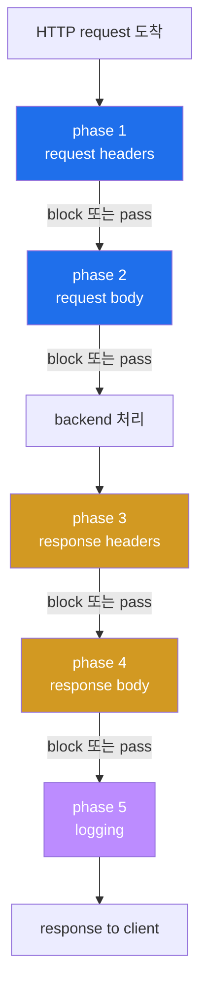
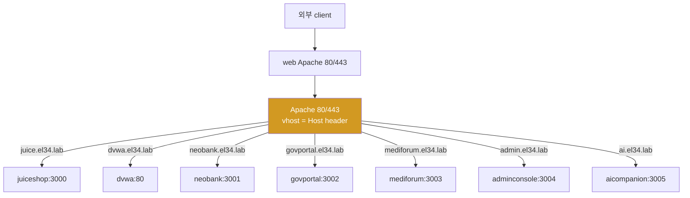
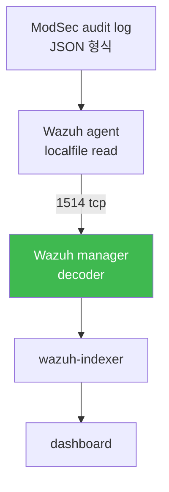
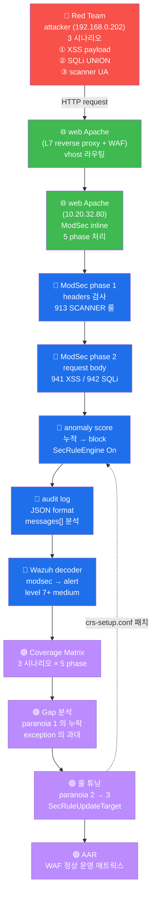

# Week 05 — Apache + ModSecurity v2 + OWASP CRS (WAF)

> **본 주차의 한 줄 요약**
>
> el34-web 의 **Apache 2.4 + mod_security2 (2.9.x) + OWASP CRS 3.3.2** 를 깊이 해부한다.
> Suricata 의 passive sniff (W03-W04) 와 달리 ModSec 은 inline + 차단 가능. 학생은
> ① SecRuleEngine 3 모드 + 5 phase 처리 단계, ② OWASP CRS 의 30+ 룰 파일 + paranoia
> level 1-4, ③ anomaly score 누적 메커니즘 (실측 XSS score 15 — 941100 + 941110 + 941160
> 의 critical 3 매치), ④ 실 audit log JSON 의 정확한 구조 (`audit_data.messages[]` 가
> id/msg/data 가 embedded 된 단일 string 배열), ⑤ el34 의 11 vhost reverse proxy 흐름
> + el34 의 출처 IP 보존(remote_address=실제 공격자), ⑥ false-positive exception 작성 → R/B/P 까지 학습한다.
>
> **운영자 한 줄 결론**: ModSec 은 anomaly score 누적으로 결정한다. paranoia level 과
> threshold 가 운영 정책의 두 축. audit log 의 messages[] 가 IR 의 source of truth.

---

## 학습 목표

본 주차 종료 시 학생은 다음 9가지를 **본인 손으로** 할 수 있어야 한다.

1. WAF 의 자리 (L3/L4 방화벽 / IDS / WAF 의 3 계층) 와 ModSec 의 inline + 차단 가능
   장점을 화이트보드에 그린다.
2. ModSec v2 vs v3 + Apache vs Nginx + libmodsecurity connector 의 차이를 설명한다.
3. `SecRuleEngine` 3 모드 (On / DetectionOnly / Off) + 5 phase 처리 (request headers /
   request body / response headers / response body / logging) 의 동작 단계를 안다.
4. OWASP CRS 의 30+ 룰 파일을 번호 prefix 별 (REQUEST-9xx / RESPONSE-9xx) 로 분류하고,
   941xxx (XSS) / 942xxx (SQLi) / 949xxx (anomaly evaluation) / 980xxx (correlation)
   의 역할을 안다.
5. anomaly scoring 의 수학을 설명한다. CRITICAL=5 / ERROR=4 / WARNING=3 / NOTICE=2 룰
   매치 시 누적 → threshold (default inbound 5 / outbound 4) 도달 시 block.
6. **실측** — XSS payload `<script>alert(1)</script>` 가 941100 + 941110 + 941160 의 3개
   CRITICAL 룰 매치 → score 15 → 949110 block + 980130 correlation summary 의 흐름.
7. modsec_audit.log JSON 의 정확한 구조 (`transaction`, `request`, `response`,
   `audit_data.messages[]`, `audit_data.error_messages[]`) + messages[] 가 **embedded
   metadata 단일 string** 임을 인지하고 jq 로 추출한다.
8. `SecRuleRemoveById` / `SecRuleUpdateTargetById` / `<LocationMatch>` 3 패턴으로
   false-positive exception 을 좁은 범위로 작성한다.
9. **R/B/P 시나리오** — Red 가 XSS + SQLi + LFI 5 페이로드 → Blue 가 audit log 의 룰
   매칭 (941/942/930) → Purple 이 anomaly score 분석 + paranoia tuning 권장.

---

## 0. 용어 해설

| 용어 | 영문 | 뜻 |
|------|------|----|
| **WAF** | Web Application Firewall | HTTP/HTTPS L7 페이로드 전용 방화벽 |
| **mod_security2** | mod_security v2 | Apache 모듈, 2002 출시 |
| **libmodsecurity** | — | v3 의 standalone 라이브러리 (Apache/Nginx/IIS 연결) |
| **CRS** | Core Rule Set | OWASP 공식 룰셋 (3.x v2 호환, 4.x v3 호환) |
| **paranoia_level** | — | CRS 검사 강도 1-4 (1=느슨, 4=엄격) |
| **anomaly_score** | — | 룰 매치 누적 점수 |
| **inbound_anomaly_score_threshold** | — | request block 임계치 (default 5) |
| **outbound_anomaly_score_threshold** | — | response block 임계치 (default 4) |
| **SecRuleEngine** | — | ModSec 평가 모드 (On / DetectionOnly / Off) |
| **DetectionOnly** | — | 룰 평가 + log 만, block 안 함 (운영 초기) |
| **phase 1-5** | — | request_headers / request_body / response_headers / response_body / logging |
| **SecRule** | — | ModSec 룰 directive |
| **SecAction** | — | unconditional action (룰 평가 없이) |
| **TX** | transaction variable | 한 transaction 의 임시 변수 (anomaly_score 등) |
| **ARGS** | — | request parameter 모음 |
| **ARGS:name** | — | 특정 parameter |
| **REQUEST_HEADERS** | — | request header 모음 |
| **SecAuditLog** | — | audit log 파일 경로 |
| **SecAuditLogFormat JSON** | — | JSON 형식 출력 (Wazuh decoder 친화) |
| **SecAuditLogParts ABCFHZ** | — | log 의 sub-section (A=audit header, B=request header, C=request body, F=response header, H=audit trailer, Z=audit footer) |
| **transaction_id** | — | 한 request 의 고유 ID |
| **libinjection** | — | SQLi / XSS 정교한 매칭 라이브러리 (CRS 가 사용) |
| **vhost** | Virtual Host | Apache 의 도메인별 분기 (11 개 in el34) |
| **reverse proxy** | — | Apache 가 backend 로 forward (mod_proxy) |
| **mod_proxy** | — | Apache 의 reverse proxy 모듈 |

---

## 1. WAF 의 자리 — Defense in Depth 의 L3 (Application)

W01 의 4 계층 모델 (Perimeter → Inline Detection → Application → Host) 의 **Application
계층** 이 WAF 의 책임. fw / ips 가 못 잡는 5+ 공격을 잡는다.

| 공격 | 어디서 잡나 |
|------|-----------|
| TCP SYN flood | nftables (fw — W02) |
| 포트 스캔 | Suricata + nftables |
| SQL Injection (HTTP-borne) | **ModSec** + Suricata HTTP decoder (보완) |
| Stored XSS | **ModSec** + browser CSP |
| Command Injection | **ModSec** + 서비스 측 검증 |
| HTTP Request Smuggling | **ModSec** + Apache strict parsing |
| L7 DoS (Slowloris) | **ModSec** + mod_reqtimeout |
| HTTP method abuse (TRACE/CONNECT) | **ModSec** (911100 method enforcement) |
| Unicode bypass | **ModSec** (920270 invalid char) |
| RFI / LFI | **ModSec** (931xxx / 930xxx) |

**ModSec 의 강점** — Suricata 와 비교:
1. **inline 차단** : packet 차단 가능 (Suricata IDS 는 alert 만)
2. **context-aware** : POST body 의 content-type 별 디코딩 (form / JSON / multipart)
3. **parameter 별 분리** : `ARGS:q` 와 `ARGS:user` 를 개별 검사
4. **transaction state** : phase 1-5 흐름 + TX variable 누적
5. **anomaly scoring** : 여러 룰 매치 누적 → 정확도

**ModSec 의 약점**:
1. **HTTPS termination 필요** — TLS 안 풀면 payload 못 봄 (web Apache 가 TLS termination)
2. **false-positive** — paranoia 2+ 에서 정상 트래픽도 차단
3. **CPU 부담** — paranoia 4 에서 룰 100+ × 모든 packet → throughput 감소

---

## 2. ModSec v2 vs v3 — 운영 선택

| 항목 | v2 (mod_security2) | v3 (libmodsecurity) |
|------|---------------------|----------------------|
| 출시 | 2002 | 2017 |
| backend | **Apache 전용** | Apache + Nginx + IIS (connector 별도) |
| 표준화 | Debian/Ubuntu 패키지 `libapache2-mod-security2` | `libmodsecurity3` + `ModSecurity-nginx` |
| OWASP CRS | 3.x 호환 (v3.3.2 default) | 4.x 호환 (v3.x 도 지원) |
| 성능 | Apache process-per-request | event-driven (Nginx) |
| 운영 보편성 | legacy 환경 다수 | 신규 환경 우세 |
| el34 사용 | ✓ (mod_security2 v2.9.x) | × |

**선택 기준**:
- Apache 환경 + legacy → v2
- Nginx 환경 + 신규 → v3
- AWS WAF / Cloudflare 등 SaaS WAF → CRS 4 가 표준

el34 는 Apache + v2 + CRS 3.3.2 — 학생이 Linux 패키지 표준으로 학습하기 좋음.

---

## 3. SecRuleEngine 3 모드 + 5 phase 처리

### 3.1 SecRuleEngine 3 모드

```
SecRuleEngine On                 ← 룰 평가 + 차단 (production)
SecRuleEngine DetectionOnly      ← 룰 평가 + log 만, 차단 X (운영 초기)
SecRuleEngine Off                ← ModSec 비활성 (사실상 사용 X)
```

**운영 표준 migration**: 신규 도입 시 `DetectionOnly` 로 시작 → audit log 분석 → false-
positive 가 잡힌 후 `On` 으로 전환. el34 는 학습 환경이라 처음부터 `On`.

### 3.2 5 phase 처리 단계



각 phase 에서 룰 평가:
- **phase 1** : request 도착 시 header 분석 (예: User-Agent, Host, Cookie)
- **phase 2** : request body 분석 (POST body, JSON, file upload)
- **phase 3** : backend 응답의 header 분석
- **phase 4** : 응답 body 분석 (data leakage)
- **phase 5** : audit log 작성

**대부분의 CRS 룰은 phase 2** (request body) — body 완전히 받은 후 검사. 949110 block
도 phase 2 끝에서 anomaly score 평가.

### 3.3 SecDefaultAction — phase 별 기본 동작

```
SecDefaultAction "phase:1,log,auditlog,pass"           ← 헤더 phase 는 통과만
SecDefaultAction "phase:2,log,auditlog,deny,status:403" ← body phase 에서 차단
```

`pass` = 다음 룰 평가, `deny` = 즉시 차단 + 403 응답.

---

## 4. OWASP CRS 3.3.2 — 30+ 룰 파일

### 4.1 파일 명명 + 번호 prefix

el34 의 `/usr/share/modsecurity-crs/rules/` 의 30+ 파일:

```
REQUEST-901-INITIALIZATION.conf            ← TX 변수 초기화
REQUEST-903.9001-DRUPAL-EXCLUSION-RULES.conf  ← CMS 특화 예외
REQUEST-903.9002-WORDPRESS-EXCLUSION-RULES.conf
REQUEST-905-COMMON-EXCEPTIONS.conf         ← 공통 예외 (브라우저)
REQUEST-910-IP-REPUTATION.conf             ← IP 평판
REQUEST-911-METHOD-ENFORCEMENT.conf        ← 허용 HTTP method
REQUEST-912-DOS-PROTECTION.conf            ← L7 DoS
REQUEST-913-SCANNER-DETECTION.conf         ← 스캐너 시그니처 (nmap, sqlmap, nikto)
REQUEST-920-PROTOCOL-ENFORCEMENT.conf      ← HTTP 프로토콜 위반 (header 부정확 등)
REQUEST-921-PROTOCOL-ATTACK.conf           ← HTTP request smuggling
REQUEST-930-APPLICATION-ATTACK-LFI.conf    ← Local File Inclusion
REQUEST-931-APPLICATION-ATTACK-RFI.conf    ← Remote File Inclusion
REQUEST-932-APPLICATION-ATTACK-RCE.conf    ← Remote Code Execution
REQUEST-933-APPLICATION-ATTACK-PHP.conf    ← PHP 특화 (`<?php`, eval 등)
REQUEST-934-APPLICATION-ATTACK-NODEJS.conf ← Node.js
REQUEST-941-APPLICATION-ATTACK-XSS.conf    ← Cross-Site Scripting (884 줄)
REQUEST-942-APPLICATION-ATTACK-SQLI.conf   ← SQL Injection
REQUEST-943-APPLICATION-ATTACK-SESSION-FIXATION.conf
REQUEST-944-APPLICATION-ATTACK-JAVA.conf   ← Java Log4j 등
REQUEST-949-BLOCKING-EVALUATION.conf       ← anomaly score 평가 + block 결정
RESPONSE-950-DATA-LEAKAGES.conf            ← 응답 body 의 sensitive data
RESPONSE-951-DATA-LEAKAGES-SQL.conf        ← SQL 에러 메시지 leak
RESPONSE-952-DATA-LEAKAGES-JAVA.conf       ← Java stack trace leak
RESPONSE-953-DATA-LEAKAGES-PHP.conf
RESPONSE-954-DATA-LEAKAGES-IIS.conf
RESPONSE-959-BLOCKING-EVALUATION.conf      ← outbound anomaly 평가
RESPONSE-980-CORRELATION.conf              ← 상관 분석 summary
```

번호 prefix 의 의미:
- **9xx** : 핵심 카테고리
- **94x** : application attack (XSS=941, SQLi=942, java=944)
- **95x** : response (data leakage)
- **949 / 959 / 980** : evaluation / correlation (block decision 의 마지막 단계)

### 4.2 paranoia level — 검사 강도 4 단계

CRS 의 핵심 운영 파라미터.

| Level | 효과 | trade-off |
|-------|------|----------|
| **1** (default) | 보편적 공격만 (libinjection + 흔한 pattern) | FP 적음, 새 공격 누락 |
| **2** | + 흔한 우회 (encoding, polyglot) | FP 약간 증가 |
| **3** | + 정교한 공격 (regex 변형, multi-byte) | FP 더 많음 |
| **4** | + 모든 의심 차단 (Unicode, base64 등) | FP 다수, production 부적합 |

**운영 표준**: 시작은 paranoia 1. 사이트 안정 후 특정 vhost 만 paranoia 2 단계 상승.

설정:
```
SecAction "id:9001,phase:1,nolog,pass,setvar:tx.paranoia_level=2"
```

(현재 el34 의 paranoia level 은 default 1 — audit log 의 tag `paranoia-level/1` 로 확인)

### 4.3 anomaly score 수학 — 누적 → block

각 룰 매치 시 score 부여:

| severity | score |
|----------|-------|
| CRITICAL | 5 |
| ERROR | 4 |
| WARNING | 3 |
| NOTICE | 2 |

**threshold**:
- `tx.inbound_anomaly_score_threshold = 5` (default)
- `tx.outbound_anomaly_score_threshold = 4`

XSS critical 룰 1건 매치 → 5 ≥ 5 → block. 정확도 높이려고 여러 룰을 동시 평가 + score 누적.

### 4.4 실측 — XSS payload 의 score 15

el34 실측 (`<script>alert(1)</script>`):

```
941100 (XSS libinjection)          severity CRITICAL  → +5
941110 (XSS Filter Cat 1: Script)  severity CRITICAL  → +5
941160 (NoScript XSS Checker)      severity CRITICAL  → +5
                                                     ─────
                                   tx.anomaly_score = 15
                                   ≥ threshold 5 → 949110 block
                                   980130 correlation summary
                                     (XSS=15, SQLI=0, RFI=0, LFI=0, RCE=0, PHPI=0, HTTP=0, SESS=0)
```

각 카테고리별 점수가 980130 의 summary 에 표시. SOC 분석가가 한 줄로 어떤 공격이었는지 파악.

---

## 5. el34-web 의 실제 구성

### 5.1 디렉토리 트리

```
/etc/modsecurity/
├── modsecurity.conf              ← 메인 설정
├── modsecurity.conf-recommended

/usr/share/modsecurity-crs/rules/
├── REQUEST-901-...conf
├── REQUEST-941-APPLICATION-ATTACK-XSS.conf    ← 884 줄
├── REQUEST-942-APPLICATION-ATTACK-SQLI.conf
├── REQUEST-949-BLOCKING-EVALUATION.conf       ← anomaly score 평가
├── RESPONSE-980-CORRELATION.conf              ← summary
└── ... (30+ 파일)

/etc/apache2/sites-enabled/
├── 000-landing.conf              ← el34.lab 랜딩
├── 010-juice.conf                ← juice.el34.lab → int juiceshop:3000
├── 020-dvwa.conf
├── 030-neobank.conf
├── 040-govportal.conf
├── 050-mediforum.conf
├── 060-admin.conf
├── 070-ai.conf
├── 080-portal.conf               ← portal.el34.lab → dmz portal (운영)
├── 090-siem.conf                 ← siem.el34.lab → wazuh-dashboard
└── 100-bastion.conf              ← bastion.el34.lab → ext bastion

/var/log/apache2/
├── access.log                    ← 모든 vhost 통합
├── error.log
├── juice_access.log              ← juice.el34.lab 만 (별도 access log)
├── modsec_audit.log              ← JSON 형식 audit (Wazuh ingest)
└── ... (vhost 별 access log)
```

### 5.2 modsecurity.conf 핵심 설정 (실측 2026-05-12)

```
SecRuleEngine On
SecRequestBodyAccess On
SecResponseBodyAccess On
SecAuditLogRelevantStatus "^(?:5|4(?!04))"        # 5xx + 4xx (404 제외) audit log
SecAuditLog /var/log/apache2/modsec_audit.log
SecAuditLogFormat JSON
SecAuditLogType Serial
SecAuditLogParts ABCFHZ
```

**핵심 설정 해석**:
- `SecRuleEngine On` — 차단 활성
- `SecRequestBodyAccess On` — POST body 검사
- `SecResponseBodyAccess On` — 응답 body 검사 (data leakage 탐지)
- `SecAuditLogRelevantStatus` — 5xx + 4xx (404 제외) 만 audit (정상 200 은 audit skip)
- `SecAuditLogFormat JSON` — Wazuh decoder 친화
- `SecAuditLogType Serial` — 한 파일에 모든 transaction (Concurrent 면 transaction 별 파일)
- `SecAuditLogParts ABCFHZ`:
  - **A** : audit log header (transaction_id, timestamp)
  - **B** : request headers
  - **C** : request body
  - **F** : response headers
  - **H** : audit trailer (messages + error_messages)
  - **Z** : audit footer (closing)
  - (D, E, G, I, J, K 는 disabled)

### 5.3 11 vhost reverse proxy 흐름



운영 (siem / portal / bastion) 의 3 vhost 는 web Apache 가 ModSec 완화로
거치지 않음 (lecture W01 참조). 학생 트래픽 (juice / dvwa / neobank 등) 만 ModSec 통과.

### 5.4 audit log 의 실측 JSON 구조

위 §4.4 의 XSS attack 의 audit log:

```json
{
  "transaction": {
    "time": "11/May/2026:21:49:35.107228 +0000",
    "transaction_id": "agJO73VIRPe167IxJ80PhwAAAFM",
    "remote_address": "192.168.0.202",
    "remote_port": 34018,
    "local_address": "10.20.32.80",
    "local_port": 80
  },
  "request": {
    "request_line": "GET /?q=<script>alert(1)</script> HTTP/1.1",
    "headers": {
      "host": "juice.el34.lab",
      "user-agent": "curl/7.81.0",
      "accept": "*/*",
      "x-forwarded-for": "192.168.0.202"
    }
  },
  "response": {
    "protocol": "HTTP/1.1",
    "status": 403,
    "headers": {...},
    "body": "<!DOCTYPE HTML PUBLIC ... <h1>Forbidden</h1>..."
  },
  "audit_data": {
    "messages": [
      "Warning. detected XSS using libinjection. [file \"...\"] [line \"55\"] [id \"941100\"] [msg \"XSS Attack Detected via libinjection\"] [data \"Matched Data: ...\"] [severity \"CRITICAL\"] [ver \"OWASP_CRS/3.3.2\"] [tag \"application-multi\"] [tag \"attack-xss\"] [tag \"paranoia-level/1\"]",
      "Warning. Pattern match \"...\" at ARGS:q. [file \"...\"] [line \"82\"] [id \"941110\"] ... [severity \"CRITICAL\"]",
      "Warning. Pattern match \"...\" at ARGS:q. [file \"...\"] [line \"199\"] [id \"941160\"] ... [severity \"CRITICAL\"]",
      "Access denied with code 403 (phase 2). Operator GE matched 5 at TX:anomaly_score. [file \"REQUEST-949-BLOCKING-EVALUATION.conf\"] [id \"949110\"] [msg \"Inbound Anomaly Score Exceeded (Total Score: 15)\"] [severity \"CRITICAL\"]",
      "Warning. Operator GE matched 5 at TX:inbound_anomaly_score. [file \"RESPONSE-980-CORRELATION.conf\"] [id \"980130\"] [msg \"Inbound Anomaly Score Exceeded (Total Inbound Score: 15 - SQLI=0,XSS=15,RFI=0,LFI=0,RCE=0,PHPI=0,HTTP=0,SESS=0): individual paranoia level scores: 15, 0, 0, 0\"]"
    ],
    "error_messages": [
      "[file \"apache2_util.c\"] [line 271] [level 3] [client 192.168.0.202] ModSecurity: Warning. detected XSS using libinjection. [id \"941100\"] ... [hostname \"juice.el34.lab\"] [uri \"/\"] [unique_id \"agJO...\"]",
      ...
    ]
  }
}
```

### 5.5 ⚠️ 중요 — messages[] 의 정확한 형식

> **⚠️ el34 실제 환경 주의**: el34 의 `modsec_audit.log` 는 **SecAuditLogType Serial + SecAuditLogFormat
> JSON** 이라 **트랜잭션 1건 = 한 줄의 완전한 JSON 객체**로 적재된다 → `tail -1 | jq` 와
> `.audit_data.messages[]` 추출이 **정상 동작한다**(실측: `tail -1 | jq -e .` = valid JSON). 다만 이 로그는
> **모든 vhost·모든 요청**을 한 파일에 섞어 기록하므로 `tail -1` 이 내 공격이 아닐 수 있다 → 내 요청을
> **출처 IP/URI 로 grep**(`grep <출처IP> modsec_audit.log | tail -1 | jq ...`)하거나, per-vhost
> **`error.log`**(예: `/var/log/apache2/dvwa_error.log`) 를 **요청 직전/직후 라인수로 격리**(`B=$(wc -l)` →
> 공격 → `tail -n +$((B+1)) | grep 'id "94x"'`)해 공격별 룰을 정확히 추출한다. error.log 한 줄엔
> `[id "942100"] [msg "... SQLI=..,XSS=.. ..."] [client <출처IP>] [unique_id ...]` 가 모두 임베드되고,
> **W10 Wazuh decoder 가 이 라인을 그대로 파싱**하므로 error.log 포맷 숙지가 곧 decoder 이해로 이어진다.

`audit_data.messages[]` 의 각 element 는 (audit log JSON 이 한 줄일 때) **JSON object 가 아니라 단일 string** 이며,
ModSec 의 message format 으로 `[key "value"]` 형태가 embedded.

따라서 jq 의 단순 추출이 안 됨:
```bash
# ❌ 부적합 — messages[].id 가 아니라 string 내부
jq '.audit_data.messages[].id'

# ✅ 적합 — string 에서 정규식 추출
jq -r '.audit_data.messages[]' | grep -oE 'id "[0-9]+"' | sort | uniq -c
```

또는 jq + regex:
```bash
jq -r '.audit_data.messages[]' modsec_audit.log | \
  grep -oE '\[id "[0-9]+"\]' | sort | uniq -c | sort -rn
```

**운영 함의**: 운영자가 ModSec audit log 분석 자동화 작성 시 messages 의 string 파싱
정확히 알아야. 단순 `.messages[].id` 로 추출하려다 silent fail.

---

## 6. remote_address — el34 의 출처 IP 보존

### 6.1 실측 — el34 의 remote_address

XSS audit log:
```json
"transaction": {
  "remote_address": "192.168.0.202",   ← 실제 공격자 IP (el34 출처 보존)
  ...
},
"request": {
  "headers": {
    "x-forwarded-for": null               ← el34 는 XFF 불필요 (remote_address 가 곧 실 IP)
  }
}
```

해석:
- `remote_address: 192.168.0.202` — ModSec 가 본 source = **실제 공격자**. el34 는 fw 가 SNAT 하지 않아 보존
- `x-forwarded-for: null` — el34 는 XFF 가 없다 (필요 없음). 출처가 이미 remote_address 에 보존

### 6.2 운영 — remote_address 기반 ModSec IP 룰 (el34)

ModSec 룰을 client IP 기반으로 작성하려면 `REMOTE_ADDR` (= remote_address) 가 아닌
`REMOTE_ADDR` 로 바로 작성하면 된다 (el34 는 출처가 보존되므로 XFF 신뢰 설정 불필요).

```
# ❌ 부적합 — 모든 trafffic 의 REMOTE_ADDR 이 ips IP
SecRule REMOTE_ADDR "@ipMatch 192.168.0.202" "id:9006001,phase:1,deny"

# ✅ 적합 — XFF 사용
SecRule REMOTE_ADDR "@ipMatch 192.168.0.202" \
    "id:9006001,phase:1,deny"
```

또는 Apache 의 `mod_remoteip` 로 remote_address 자체를 XFF 값으로 치환:
```
# (참고) src 를 가리는 reverse-proxy 환경에서만 필요:
RemoteIPHeader X-Forwarded-For
RemoteIPInternalProxy 10.20.31.0/24
```

---

## 7. false-positive exception — 좁은 범위 작성

운영 시 정상 traffic 이 CRS 룰 매치 시 exception 작성. 3 패턴:

### 7.1 SecRuleRemoveById — 룰 전체 비활성 (광범위)

```
SecRuleRemoveById 941100
```

⚠️ 위험 — XSS 룰 1개 전체 비활성. 사이트 전체에 영향. 분기 검토 필수.

### 7.2 SecRuleUpdateTargetById — 특정 param 만 예외

```
SecRuleUpdateTargetById 941100 "!ARGS:rich_text_field"
```

941100 룰을 유지하되, `rich_text_field` parameter 에 대해서만 비활성. 좁은 범위.

### 7.3 LocationMatch — 특정 vhost / URL 만 예외

```
<LocationMatch "/api/legacy/comments">
    SecRuleRemoveById 941100
    SecRuleRemoveById 941110
</LocationMatch>
```

특정 URL 에서만 비활성. legacy app 의 호환 유지.

### 7.4 운영 원칙

```
1. 가능한 좁은 범위 (특정 vhost + 특정 param)
2. 모든 exception 은 git audit + 추가 사유 주석
3. exception 누적 시 분기별 리뷰 (실제 공격 가려지는지)
4. exception 적용 후 audit log 모니터 (다른 룰 매치되는지)
5. DetectionOnly 모드로 검증 후 적용
```

---

## 8. ModSec audit log → Wazuh agent — W10 예고

ModSec 의 audit log 가 Wazuh agent → manager → dashboard 로 ship. W10 에서 본격 통합:



W10 학습:
- agent.conf 의 `<localfile>` 로 modsec_audit.log polling
- manager 의 decoder (audit_data.messages 의 ModSec format 파싱)
- 알람 우선순위 — anomaly_score 기반 (5+ critical)
- dashboard 의 ModSec panel

---

## 9. 트러블슈팅 — ModSec 운영의 4 흔한 문제

### 9.1 패턴 1 — 정상 traffic 도 403 (false-positive)

증상: 정상 사용자가 게시판 글 작성 시 403.

진단:
```bash
sudo tail -50 /var/log/apache2/modsec_audit.log | \
    jq 'select(.response.status==403) | {time:.transaction.time, host:.request.headers.host, uri:.request.request_line, ids:.audit_data.messages[]}' | head
```

audit log 의 messages 에서 매치된 룰 ID 확인 → exception 추가 (§7).

### 9.2 패턴 2 — audit log 가 비어 있음

증상: `SecRuleEngine On` 인데 audit log 비어 있거나 매우 작음.

원인:
- `SecAuditLogRelevantStatus "^(?:5|4(?!04))"` 가 5xx/4xx 만 audit → 정상 200 traffic 은 audit skip
- `SecAuditEngine RelevantOnly` 가 룰 매치 + relevant status 만

해결: 임시 `SecAuditEngine On` 으로 모든 traffic audit (debug 시).

### 9.3 패턴 3 — POST body 검사 안 됨

증상: POST body 의 SQL injection 안 차단.

원인: `SecRequestBodyAccess On` 미설정. 또는 `SecRequestBodyLimit` 작아서 body 잘림.

해결:
```
SecRequestBodyAccess On
SecRequestBodyLimit 13107200          # 12.5 MB
SecRequestBodyNoFilesLimit 131072     # 128 KB
SecRequestBodyLimitAction Reject      # 한계 초과 시 거부
```

### 9.4 패턴 4 — paranoia 변경 적용 안 됨

증상: `crs-setup.conf` 의 paranoia 수정 후 reload 했지만 변화 없음.

원인:
- crs-setup.conf 가 다른 경로 (예: `/etc/modsecurity/crs/`)
- `Include` directive 의 순서 오류 — paranoia 변경이 룰 로드 전에 와야 함
- vhost 단위 SecAction 으로 override 됨

해결:
```bash
sudo find / -name "crs-setup.conf" 2>/dev/null
sudo grep -r "tx.paranoia_level" /etc/apache2/sites-enabled/   # vhost override 확인
sudo apache2ctl configtest                                      # syntax 검증
sudo systemctl reload apache2
```

---

## 10. 사례 분석

### 10.1 ISMS-P 매핑

| Sub-control | 본 주차 활동 |
|-------------|-------------|
| 2.6.4.1 외부→내부 모니터링 | ModSec audit log + Wazuh ship |
| 2.6.4.2 정책 변경 audit | crs-setup.conf + exception 의 git PR |
| 2.6.4.3 로그 보관 | modsec_audit.log → SIEM 1년 retention |
| 2.6.4.4 차단 정책 | SecRuleEngine On + anomaly threshold |

### 10.2 OWASP Top 10 매핑

| OWASP A0X | CRS 룰 카테고리 |
|-----------|----------------|
| A01 Broken Access Control | (별도 — application 측 검증) |
| A02 Cryptographic Failures | (별도 — TLS / 데이터 암호화) |
| A03 Injection | 941 XSS / 942 SQLi / 932 RCE / 933 PHP |
| A04 Insecure Design | (전반 — design pattern) |
| A05 Misconfiguration | 920 Protocol enforcement |
| A06 Vulnerable Components | (별도 — SCA tool) |
| A07 Identity/Auth | (별도 — application 측) |
| A08 Data Integrity | 944 Java (Log4Shell) |
| A09 Logging | ModSec audit log (본 주차) |
| A10 SSRF | 932 RCE (일부) |

ModSec 가 OWASP Top 10 의 50%+ cover. 보완은 application 측 + WAF 외 도구 (RASP, IAST).

### 10.3 KISA 사례 — 2024 한국 금융권 침해

KISA 2024 보고서의 한국 금융권 침해 패턴:

```
1. 정찰 — sqlmap 스캐닝 → ModSec 의 942110 (sqlmap UA) 차단
2. SQLi 시도 — UNION SELECT → ModSec 의 942100 (libinjection SQLi) 차단
3. LFI 시도 — ../../etc/passwd → ModSec 의 930120 (LFI traversal) 차단
4. 다단계 우회 → paranoia 1 우회 시도 → paranoia 2 필요 (FP 분석 후)
```

본 주차 학습의 정확한 매핑. paranoia 1 → 2 upgrade 가 운영 진화 패턴.

### 10.4 운영 사고 3 사례

**사례 1 — DetectionOnly → On 전환 실패**:
```
운영자: DetectionOnly 1주 운영 후 On 전환 → 일부 정상 traffic 403
원인: 모든 vhost 가 같은 paranoia → legacy app 이 false-positive
복구: legacy vhost 만 LocationMatch 로 paranoia 1 유지 + 새 vhost paranoia 2
교훈: vhost 별 paranoia tuning 필요 + 1주 audit 모니터링 부족
```

**사례 2 — (참고) src 를 가리는 환경의 XFF 신뢰**:
```
src 를 프록시 IP 로 가리는 환경에선 REMOTE_ADDR 가 프록시 IP 로 보임
결과: IP 화이트리스트 룰 무용 + 차단 효과 없음
복구: mod_remoteip 로 XFF 신뢰. (el34 는 출처 보존이라 이 문제가 없음 — REMOTE_ADDR 가 곧 실 IP)
교훈: reverse proxy 환경의 표준 — XFF 신뢰 + remote_address 비신뢰
```

**사례 3 — audit log 디스크 full**:
```
운영자: 트래픽 폭증 시 modsec_audit.log 가 100GB+ → 디스크 full → Apache 다운
복구: logrotate + SecAuditLogRelevantStatus 강화 + Wazuh ship 즉시
교훈: audit log 의 retention + 외부 ship 자동화 (W10 의 Wazuh 통합)
```

---

## 10.5 R/B/P 종합 시나리오 — WAF 의 inline 차단 + paranoia 튜닝

본 주차 의 ModSec + CRS 운영 을 R/B/P 의 3 관점 에서 통합 분석. Suricata (W03-W04)
의 passive sniff 와 달리 ModSec 은 **inline + 차단** 가능 — Blue Team 의 1차 방어선.

### 통합 도식



### Coverage Matrix — 3 공격 시나리오

| 시나리오 | Red 명령 | Blue 1차 (ModSec) | Blue 2차 (audit log) | Purple Gap | Purple 권장 |
|---------|---------|------------------|---------------------|-----------|------------|
| **① XSS** | `echo -en 'GET /search?q=<script>alert(1)</script> HTTP/1.0\r\nHost: juice.el34.lab\r\nConnection: close\r\n\r\n' | nc -w3 192.168.0.161 80 >/dev/null` | 941100 (XSS) + 941110 (script tag) + 941160 (event handler) → score 15 → 403 | audit log 의 messages[] = 3 룰 매치 | paranoia 1 에서 941180 (DOM XSS) 누락 | paranoia 2 + tx.crs_exclusions_xenforo=1 |
| **② SQLi UNION** | `echo -en 'GET /items?id=1 HTTP/1.0\r\nHost: juice.el34.lab\r\nConnection: close\r\n\r\n' | nc -w3 192.168.0.161 80 >/dev/null UNION SELECT 1,2,3'` | 942100 (SQLi detection lib) + 942270 (UNION SELECT) → score 10 → 403 | audit log 의 unique_id 로 추적 | paranoia 1 에서 942180 (basic SQLi keyword) 만 매치 = score 5 | paranoia 2 → 3 으로 UNION + comment + hex 룰 활성 |
| **③ scanner UA** | `echo -en 'GET /` HTTP/1.0\r\nHost: juice.el34.lab\r\nUser-Agent: sqlmap/1.6\r\nConnection: close\r\n\r\n' | nc -w3 192.168.0.161 80 | 913100 (SCANNER nikto/sqlmap UA) → score 2 (alert only, paranoia 1) | audit log 의 REQUEST_HEADERS 의 User-Agent | paranoia 1 의 anomaly threshold 5 → 미만 → 통과 | scanner UA 의 즉시 차단 = SecRuleUpdateActionById 913100 "deny,status:403" |

### 시간선 — XSS 공격 의 1 사건 흐름

```
T+0    Red attacker 에서 XSS payload (nc raw HTTP: /search?q=<script>alert(1)</script>)
       └→ fw(nftables) → ips → web Apache → ModSec 5 phase 처리 시작

T+1ms  ModSec phase 1 — REQUEST_HEADERS 검사
       └→ User-Agent = curl/7.81.0 → 913100 매치 X (정상 UA)

T+2ms  ModSec phase 2 — REQUEST_BODY 검사
       └→ ARGS:q = "<script>alert(1)</script>"
       └→ 941100 (XSS Attack Detected) → score +5
       └→ 941110 (XSS via JS Event Handler) → score +5
       └→ 941160 (XSS via tag attribute) → score +5
       └→ anomaly score = 15 ≥ paranoia threshold 5 → block

T+3ms  Apache 응답 = 403 Forbidden + ModSec audit log 기록
       └→ /var/log/apache2/modsec_audit.log 의 JSON entry
       └→ messages[] = ["941100", "941110", "941160"]
       └→ unique_id = "ZjK..." (audit log 추적용)

T+5s   Blue 1차 탐지 (실시간 운영자)
       └→ ssh ccc@10.20.32.80 "sudo tail -1 /var/log/apache2/modsec_audit.log | jq .messages"
       └→ 3 룰 매치 = XSS 명확

T+10s  Blue 2차 분석 (Wazuh agent 의 forward)
       └→ Wazuh modsec decoder 의 alert (rule id 87151, level 7)
       └→ Wazuh dashboard 의 src IP = 192.168.0.202
       └→ Wazuh agent state = active (모니터링 정상)

T+1m   Purple Gap 식별
       └→ Coverage Matrix 의 ① 항목 = "paranoia 1 의 941180 누락"
       └→ 재현 = nc 로 GET /search?q=<a onmouseover="alert(1)">x</a>
       └→ paranoia 1 = 941160 만 매치 = score 5 = block (경계)
       └→ paranoia 2 = 941180 추가 매치 = score 10 = 명확 block

T+10m  Purple 룰 튜닝
       └→ /etc/modsecurity/crs-setup.conf 의 paranoia level 1 → 2
       └→ tx.paranoia_level=2
       └→ sudo systemctl reload apache2
       └→ false-positive 발생 모니터링 (10 분간)

T+30m  Purple AAR 보고서
       └→ What: paranoia 2 적용 → XSS detection coverage +20%
       └→ Why: paranoia 1 의 DOM XSS / event handler 부분 누락
       └→ Cost: false-positive 율 = 0.5% (수용 가능)
       └→ Next: W06 의 Wazuh active response 의 자동 차단 학습
```

### R/B/P 의 핵심 인사이트

1. **inline 차단 의 책임** — Suricata 는 passive (탐지) / ModSec 은 inline (탐지+차단).
   block 의 false-positive 가 직접 적 운영 영향 = paranoia level 조정 의 routine 화 필수.

2. **anomaly score 의 수학 적 모델** — 단일 룰 의 score 가 5 미만 = alert only,
   누적 score 가 paranoia threshold (default 5) 이상 = block. 룰 추가 시 score 영향
   분석 필수.

3. **audit log 의 messages[] 구조** — JSON format 의 audit log 의 messages 배열 의 룰
   ID 순서 = phase 처리 순서. 분석 시 phase 1 → 2 → 4 의 순서 추적 가능.

4. **paranoia level 의 trade-off** — level 1 = 최소 false-positive (운영 안정) / level
   4 = 최대 coverage (학습 환경). 운영 환경 = 2-3 의 점진적 ramp-up.

5. **exception 의 좁은 범위** — SecRuleRemoveById 의 광범위 비활성 금지. 반드시
   SecRuleUpdateTargetById 의 특정 param 만 또는 LocationMatch 의 특정 vhost/URL
   만 예외.

---

## 11. 실습 시나리오 (4 축 설명)

### 실습 1 — 설정 + audit log 구조 점검 (10분)

```bash
ssh ccc@10.20.32.80 'sudo grep -E "^SecRuleEngine|^SecAuditLog|^SecRequestBody|^SecResponseBody" /etc/modsecurity/modsecurity.conf'
ssh ccc@10.20.32.80 'sudo apache2ctl -M 2>&1 | grep -i security'
ssh ccc@10.20.32.80 'sudo dpkg -l | grep -E "modsec|crs"'
```

### 실습 2 — CRS 룰 파일 + paranoia (15분)

```bash
ssh ccc@10.20.32.80 'sudo ls /usr/share/modsecurity-crs/rules/ | head'
ssh ccc@10.20.32.80 'sudo ls /etc/apache2/sites-enabled/'
ssh ccc@10.20.32.80 'sudo grep -l "tx.paranoia_level" /etc/apache2/sites-enabled/* | head'
```

### 실습 3 — XSS 공격 + audit log 분석 (20분)

```bash
echo "$(ssh att@192.168.0.202 "echo -en 'GET /?q=<script>alert(1)</script> HTTP/1.0\r\nHost: juice.el34.lab\r\nConnection: close\r\n\r\n' | nc -w3 192.168.0.161 80 >/dev/null")"
# 403 응답

# 고정 sleep 대신 로그에 공격 흔적이 나타날 때까지 조건 대기(zero-sleep)
ssh ccc@10.20.32.80 "timeout 12 bash -c 'until sudo grep -qa 192.168.0.202 /var/log/apache2/modsec_audit.log; do :; done'" || true
ssh ccc@10.20.32.80 'sudo tail -1 /var/log/apache2/modsec_audit.log | jq "{ip:.transaction.remote_address, status:.response.status, msg_count:(.audit_data.messages | length)}"'

# 매치된 룰 ID 추출
ssh ccc@10.20.32.80 'sudo tail -1 /var/log/apache2/modsec_audit.log | jq -r ".audit_data.messages[]" | grep -oE "\\[id \"[0-9]+\"\\]" | sort | uniq'
```

### 실습 4 — SQLi 공격 + audit (20분)

```bash
ssh att@192.168.0.202 "echo -en 'GET /?q=1%27 OR %271%27=%271 HTTP/1.0\r\nHost: juice.el34.lab\r\nConnection: close\r\n\r\n' | nc -w3 192.168.0.161 80 | head -1 | grep -oE '[0-9]{3}'"
# 고정 sleep 대신 로그에 흔적이 나타날 때까지 조건 대기(zero-sleep)
ssh ccc@10.20.32.80 "timeout 10 bash -c 'until sudo grep -qa 192.168.0.202 /var/log/apache2/modsec_audit.log; do :; done'" || true
ssh ccc@10.20.32.80 'sudo tail -1 /var/log/apache2/modsec_audit.log | jq -r ".audit_data.messages[]" | grep -oE "\\[id \"942[0-9]+\"\\]"'
```

### 실습 5 — paranoia 변경 시뮬 (15분)

```bash
ssh ccc@10.20.32.80 'sudo find / -name "crs-setup.conf" 2>/dev/null'
# el34 환경에서는 crs-setup.conf 가 vhost 단위 또는 별 경로에 있을 수 있음

# vhost 단위 paranoia 2 설정 시뮬 (실 적용 X)
echo '<Location />
    SecAction "id:9006001,phase:1,nolog,pass,setvar:tx.paranoia_level=2"
</Location>'
```

### 실습 6 — exception 작성 (15분)

```bash
# 941100 룰을 특정 URI 에서만 비활성 (시뮬)
echo '<LocationMatch "/api/legacy/">
    SecRuleRemoveById 941100
</LocationMatch>'
```

### 실습 7 — **R/B/P** 5 공격 + audit 분석 (25분)

```bash
# Red — 5 공격 burst
for payload in "?q=<script>alert(1)</script>" "?q=1'OR'1'='1" "?q=../../etc/passwd" "?q=;cat /etc/passwd" "?q=<?php system('id'); ?>"; do
  ssh att@192.168.0.202 "echo -en \"GET /$payload HTTP/1.0\r\nHost: juice.el34.lab\r\nConnection: close\r\n\r\n\" | nc -w3 192.168.0.161 80 | head -1 | grep -oE '[0-9]{3}'"
done
# 고정 sleep 대신 로그에 흔적이 나타날 때까지 조건 대기(zero-sleep)
ssh ccc@10.20.32.80 "timeout 10 bash -c 'until sudo grep -qa 192.168.0.202 /var/log/apache2/modsec_audit.log; do :; done'" || true

# Blue — audit log 의 룰 카테고리 분포
ssh ccc@10.20.32.80 'sudo tail -50 /var/log/apache2/modsec_audit.log | jq -r ".audit_data.messages[]" | grep -oE "\\[id \"[0-9]+\"\\]" | sort | uniq -c | sort -rn | head'

# Purple — anomaly score 분석
ssh ccc@10.20.32.80 'sudo tail -5 /var/log/apache2/modsec_audit.log | jq -r ".audit_data.messages[]" | grep -oE "Total Score: [0-9]+" | head'
```

---

## 11.5 R/B/P 공격 분석 케이스 확장 (본 주차 추가)

### 11.5.0 R/B/P 일상 비유 — 백화점 안전요원의 가방 검사

본 절은 ModSecurity 의 운영을 백화점 안전요원의 가방 검사 비유로 시작한다.

학생이 다니는 백화점 입구에 안전요원이 있다. 안전요원은 매뉴얼 (OWASP CRS) 에 따라 손님의 가방을 다음 다섯 가지로 분류해 확인한다.

- **위험 글자가 적힌 종이** — XSS payload 처럼 `<script>` 같은 문자가 들어 있는 입력.
- **위험 명령이 적힌 쪽지** — SQLi payload 처럼 `'OR'1'='1` 같은 문자열.
- **다른 매장 약도** — Path Traversal 처럼 `../../etc/passwd` 같은 경로.
- **공구가 들어 있는 가방** — Command Injection 처럼 `;cat /etc/passwd` 같은 OS 명령.
- **위조 신분증** — File Inclusion 처럼 `<?php ...?>` 같은 코드.

안전요원은 가방을 하나씩 검사하면서 의심 점수 (anomaly score) 를 누적한다. 점수가 5 점을 넘으면 즉시 입장을 차단한다. 차단 기록은 백화점 일지 (modsec_audit.log) 에 한 줄씩 쌓이고, 일지에는 매뉴얼 페이지 번호 (rule id) 도 함께 기록된다.

| 일상 비유 | ModSecurity 운영 |
|-----------|------------------|
| 안전요원 매뉴얼 | OWASP CRS |
| 의심 점수 누적 | anomaly score |
| 점수 5점 차단 | inbound_anomaly_score_threshold |
| 차단 기록 일지 | modsec_audit.log |
| 매뉴얼 페이지 번호 | rule id (941xxx, 942xxx 등) |

본 절은 다음 세 케이스를 다룬다.

- 케이스 1 — XSS payload 를 ModSec audit log 에서 직접 분석한다.
- 케이스 2 — SQLi payload 의 anomaly score 누적 과정을 추적한다.
- 케이스 3 — 정상 traffic 이 false positive 로 차단된 경우의 좁은 범위 exception 작성.

원칙은 W01 ~ W04 와 같다. 재현 가능성, 도구 위주 분석, 신입생 친화, 학습 환경 한정.

### 11.5.1 케이스 1 — XSS payload 의 audit log 분석

**0. 일상 비유 — 가방 안에 위험 글자가 적힌 종이.**

도둑이 백화점에 들어가려고 가방에 "alert" 라는 글자가 적힌 종이를 일부러 넣어둔다. 안전요원의 매뉴얼에는 그런 글자 패턴 (`<script>`, `onerror=`, `javascript:` 등) 이 의심 목록으로 등록되어 있다. 안전요원이 매뉴얼을 펼쳐 글자를 확인하면 즉시 의심 점수가 올라가고, 도둑은 입장 거부된다.

이 비유를 XSS payload 차단에 옮긴다.

| 일상 비유 | XSS payload |
|-----------|--------------|
| 가방 안의 위험 글자 | URL 또는 body 의 `<script>alert(1)</script>` |
| 매뉴얼 의심 목록 | CRS 941100 ~ 941180 시리즈 |
| 의심 점수 | anomaly score |
| 즉시 입장 거부 | HTTP 403 응답 |
| 일지 한 줄 | modsec_audit.log 의 한 JSON |

**0a. 사용 도구 사전 안내.**

- **curl** — HTTP 요청을 보내는 표준 도구.
- **modsec_audit.log** — ModSecurity 의 audit 전용 로그. JSON 한 줄에 한 transaction.
- **jq** — JSON 을 파싱해서 보는 표준 도구.

**1. Red — 공격 재현.**

attacker VM 에 들어가서 학습 환경의 web 에 XSS payload 가 들어간 query 를 보낸다. 학습 환경 한정으로 실행한다.

```bash
ssh el34-attacker
# 비밀번호: ccc
```

attacker VM 내부에서 다음 두 줄을 짧은 간격으로 보낸다.

```bash
# attacker VM 내부 (학습 환경 한정)
echo -en 'GET /search?q=%3Cscript%3Ealert(1)%3C/script%3E HTTP/1.0\r\nHost: juice.el34.lab\r\nConnection: close\r\n\r\n' | nc -w3 192.168.0.161 80 | head -1 | grep -oE '[0-9]{3}'
echo -en 'GET /search?q=%22%3E%3Cimg%20src=x%20onerror=alert(1)%3E HTTP/1.0\r\nHost: juice.el34.lab\r\nConnection: close\r\n\r\n' | nc -w3 192.168.0.161 80 | head -1 | grep -oE '[0-9]{3}'
```

각 줄의 의미는 다음과 같다.

- 첫 번째 — `<script>alert(1)</script>` 의 URL-encoded 형태.
- 두 번째 — `">` 의 URL-encoded 형태. img 태그 우회 패턴.

두 시도가 ModSec 의 SecRuleEngine `On` 모드라면 응답 코드가 403 으로 나온다.

**2. 발생하는 로그/아티팩트.**

web VM 의 `/var/log/apache2/modsec_audit.log` 에 한 transaction 마다 한 JSON 줄이 추가된다. 그 JSON 안의 `audit_data.messages[]` 에 매칭된 룰 id 와 anomaly score 가 기록된다.

```json
{"transaction": {"client_ip":"192.168.0.202", ...},
 "request": {"uri":"/search?q=...", ...},
 "audit_data": {
   "messages": [
     "Warning. detected XSS using libinjection. [id \"941100\"] [msg \"XSS Attack Detected via libinjection\"] ...",
     "Warning. Pattern match \"\\<script\" ... [id \"941110\"] ...",
     "Warning. Pattern match \"javascript:\" ... [id \"941160\"] ...",
     "... Total Score: 15 ..."
   ]
 }}
```

핵심 필드는 매칭된 941xxx 룰 id 의 목록과 Total Score 다.

**3. Blue — modsec_audit.log 직접 분석.**

web VM 에 들어가서 audit log 의 최근 라인을 jq 로 본다.

```bash
ssh el34-web
sudo tail -2 /var/log/apache2/modsec_audit.log | jq '.transaction.client_ip, .request.uri, .audit_data.messages[]' | head -30
```

각 라인을 확인한다.

- `remote_address` — 192.168.0.202 (실제 공격자, el34 출처 보존) 인지 본다. el34-attacker 면 학습 환경 시도다.
- `request.uri` — URL-decoded 페이로드의 일부가 보인다.
- `messages[]` — 941100, 941110, 941160 같은 XSS 시리즈 룰 id 가 보이면 매칭 확인.

매칭된 룰 id 의 분포를 한눈에 본다.

```bash
sudo tail -100 /var/log/apache2/modsec_audit.log \
  | jq -r '.audit_data.messages[]?' \
  | grep -oE '\[id "[0-9]+"\]' \
  | sort | uniq -c | sort -rn | head
```

다음으로 Kibana Discover 에서 audit log 가 SIEM 으로 ingest 된 경우 다음 흐름으로 본다.

1. 좌측 햄버거 메뉴 → `Discover` 선택.
2. Index pattern 을 Wazuh 의 alerts index (`wazuh-alerts-*`) 로 바꾼다.
3. Time picker `Last 15 minutes`.
4. Search bar 에 `data.modsec.rule_id:[941000 TO 941999]` 또는 `rule.groups:modsecurity` 를 입력한다.
5. 결과 한 줄을 펼쳐서 매칭된 룰 id, anomaly score, client_ip 를 확인한다.

**4. Blue — 대응 의사결정.**

학생이 다음 세 가지를 판단한다.

- **차단의 정상성.** 응답 코드가 403 이면 ModSec 이 정상 차단했다. SecRuleEngine 모드가 `On` 인지 확인한다.
- **paranoia level 적정성.** 학습 환경은 PL 1 또는 2 가 표준이다. PL 3 이상이면 false positive 가 늘어난다.
- **반복 차단 후 IP 단위 추가 차단.** 같은 client_ip 가 10건 이상 차단되면 fw 의 dynamic blacklist set 으로 timeout 10분 추가한다.

**5. Purple — 보완.**

다음 세 가지를 적용한다.

- **anomaly score threshold 검토.** `tx.inbound_anomaly_score_threshold` 의 기본값이 5 다. 너무 낮으면 false positive, 너무 높으면 우회 가능. 학습 환경은 5 가 기본 권장이다.
- **CRS 갱신 cron.** OWASP CRS 의 정기 업데이트 (예: 분기 1회) 를 자동화한다. 새 우회 패턴 추가가 빠르다.
- **audit log retention.** 1년 retention 이 ISMS-P 표준이다. modsec_audit.log 의 rotate 와 SIEM ingest 의 보존 정책을 확인한다.

본 케이스 cycle 한 바퀴는 약 20분 정도다.

### 11.5.2 케이스 2 — SQLi payload 의 anomaly score 누적 추적

**0. 일상 비유 — 가방 안에 점수가 다른 의심 물품 여러 개.**

도둑의 가방에 의심 물품이 한 개가 아니라 여러 개 들어 있다고 하자. 안전요원의 매뉴얼은 물품마다 점수를 매기고, 총합이 임계치를 넘으면 차단한다. 단일 물품이 점수 3 이고 임계치가 5 라면 통과하지만, 두 물품의 합이 6 이면 차단된다. 단계적 점수 누적이 차단의 핵심이다.

| 일상 비유 | anomaly score 누적 |
|-----------|---------------------|
| 의심 물품 1 | SQLi 시그니처 룰 1 매칭 (점수 5) |
| 의심 물품 2 | SQLi 시그니처 룰 2 매칭 (점수 5) |
| 총합 임계치 5 | inbound_anomaly_score_threshold |
| 총합 이상이면 차단 | 403 응답 |

**0a. 사용 도구 사전 안내.**

- **anomaly scoring 모드** — CRS 의 기본 모드. 단일 룰이 즉시 차단하지 않고 점수만 누적한다.
- **942xxx 시리즈** — SQLi 룰 군. 다양한 변형을 잡는다.
- **Total Score** — audit log 안의 누적 점수.

**1. Red — 공격 재현.**

attacker VM 에서 SQLi 페이로드 한 줄을 보낸다.

```bash
ssh el34-attacker

# attacker VM 내부 (학습 환경 한정)
echo -en 'GET /login?username=admin%27%20OR%20%271%27%3D%271&password=any HTTP/1.0\r\nHost: juice.el34.lab\r\nConnection: close\r\n\r\n' | nc -w3 192.168.0.161 80 | head -1 | grep -oE '[0-9]{3}'
```

URL-decoded 형태는 `?username=admin' OR '1'='1&password=any` 다. classic SQLi 시도다.

**2. 발생하는 로그/아티팩트.**

modsec_audit.log 에 매칭된 룰 id 와 누적 score 가 기록된다.

```json
{"audit_data": {
   "messages": [
     "Warning. detected SQLi using libinjection ... [id \"942100\"] ...",
     "Warning. Pattern match \"(?i)'\\s*or\\s*'1'='1\" ... [id \"942130\"] ...",
     "Warning. Pattern match \"OR\\s\" ... [id \"942150\"] ...",
     "... Total Score: 15 ..."
   ]
 }}
```

점수 5 의 룰 세 개가 누적되어 Total Score 15 가 된다. 임계치 5 를 크게 넘어 차단된다.

**3. Blue — anomaly score 의 누적 흐름 직접 추적.**

web VM 에 들어가서 매칭된 룰 id 별 점수 합을 계산한다.

```bash
ssh el34-web
sudo tail -1 /var/log/apache2/modsec_audit.log | jq -r '.audit_data.messages[]?' | head -20
```

출력의 마지막 줄에 `Total Score: N` 이 보인다. 그 직전 줄에 `Inbound Anomaly Score Exceeded (Total Inbound Score: X)` 형태로 임계치 초과 안내가 함께 표시된다.

핵심 분석 두 가지를 한다.

- **단일 룰 차단 vs 누적 차단.** 942100 (libinjection) 만 단독으로 차단했는지, 942130, 942150 같은 보조 룰의 누적으로 차단했는지 확인한다.
- **paranoia level 의 영향.** PL 1 룰만 매칭되었는지, PL 2 의 보조 룰이 함께 매칭되었는지 살핀다.

Kibana Discover 에서도 같은 흐름으로 본다.

1. Search bar 에 `data.modsec.rule_id:[942000 TO 942999]` 입력.
2. 결과의 anomaly score 필드를 columns 에 추가한다.

**4. Blue — 대응 의사결정.**

학생이 다음 세 가지를 판단한다.

- **단일 룰 신뢰성.** 942100 의 libinjection 은 가장 정확한 SQLi 탐지다. 이 룰 단독 매칭은 거의 false positive 가 없다.
- **paranoia 상향 의 영향.** PL 2 로 올리면 942150 같은 약한 패턴까지 매칭된다. 학습 환경은 PL 1 이 기본 권장이다.
- **fw 차단 연계.** 같은 client_ip 의 SQLi 반복 차단이 누적되면 fw 의 dynamic blacklist set 으로 timeout 30분 추가한다.

**5. Purple — 보완.**

다음 세 가지를 적용한다.

- **threshold 운영 정책 명문화.** 5 (기본) → 7 (관대) → 3 (엄격) 의 선택지를 문서화한다. 환경 별 정책 추적.
- **paranoia 의 시뮬 검증.** PL 1 → PL 2 로 변경 전 testing 환경에서 false positive baseline 을 먼저 측정한다.
- **CRS exclusion 작성.** false positive 가 확인된 정상 traffic 의 좁은 exception 룰을 추가한다. 다음 케이스 3 에서 다룬다.

### 11.5.3 케이스 3 — false positive 발생 시 좁은 범위 exception 작성

**0. 일상 비유 — 정상 직원이 매뉴얼에 잘못 등록되어 매번 차단됨.**

백화점 정비 직원이 매일 정상 출입을 하는데, 가방에 항상 공구가 들어 있어서 매뉴얼의 "공구 의심 룰" 에 매번 걸린다. 안전요원이 무조건 공구 룰을 끄면 진짜 도둑의 공구도 못 잡는다. 대신 매뉴얼에 "정비 직원의 정상 공구는 예외" 라는 좁은 단서를 추가하면 정상 운영도 가능하고 도둑도 잡을 수 있다.

| 일상 비유 | ModSec false positive |
|-----------|-----------------------|
| 정비 직원의 정상 공구 | 정상 운영의 특정 form param 또는 URL |
| 매뉴얼 의심 룰 매번 발동 | CRS 룰이 정상 traffic 에 매칭 |
| 룰 전체 해제 위험 | SecRuleRemoveById 의 광범위 영향 |
| 좁은 예외 | SecRuleUpdateTargetById 의 특정 param 제외 |

**0a. 사용 도구 사전 안내.**

- **SecRuleRemoveById** — 룰 전체를 해제한다. 광범위. 가급적 피한다.
- **SecRuleUpdateTargetById** — 특정 param 만 룰의 검사 대상에서 제외한다. 좁다.
- **`<LocationMatch>`** — 특정 URL 만 예외 처리한다. 좁다.

**1. Red — false positive 시뮬.**

학습 환경의 web 에 정상 운영 endpoint `/api/comment` 가 있다고 가정한다. 댓글 본문에 SQL 관련 키워드 (`WHERE`, `SELECT` 등) 가 정상적으로 자주 들어간다 (예: "SELECT 절을 배웠어요" 같은 한국어 문장).

attacker VM 에서 그런 정상 입력 시뮬을 보낸다.

```bash
ssh att@192.168.0.202

# attacker VM 내부 (학습 환경 한정) — 정상 코멘트지만 SELECT/WHERE 키워드로 오탐 유발
B='comment=오늘 SELECT 와 WHERE 절을 학습했어요. 정말 재미있네요.'
printf 'POST /api/comment HTTP/1.0\r\nHost: juice.el34.lab\r\nContent-Type: application/x-www-form-urlencoded\r\nContent-Length: %d\r\nConnection: close\r\n\r\n%s' "$(printf %s "$B" | wc -c)" "$B" | nc -w3 192.168.0.161 80 | head -1 | grep -oE '[0-9]{3}'
```

ModSec 의 SQLi 룰 (942xxx) 중 일부가 "SELECT", "WHERE" 같은 키워드를 잡아 false positive 차단을 일으킨다. 응답 코드가 403 이면 false positive 발생이다.

**2. 발생하는 로그/아티팩트.**

modsec_audit.log 에 매칭된 룰 id 가 기록된다. 그러나 본 traffic 은 정상 사용자의 댓글이라 차단은 false positive 다.

**3. Blue — false positive 의 식별 + 영향 평가.**

web VM 에 들어가서 audit log 를 본다.

```bash
ssh el34-web
sudo tail -5 /var/log/apache2/modsec_audit.log | jq -r 'select(.transaction.client_ip != null) | "\(.transaction.client_ip) \(.request.uri) \(.audit_data.messages[]?)"' | head -20
```

매칭된 룰 id 와 매칭된 param 이름을 확인한다. 정상 댓글에서 false positive 가 명확하면 좁은 범위 exception 을 작성한다.

다음으로 영향 받은 사용자 수와 빈도를 계산한다.

```bash
sudo grep "/api/comment" /var/log/apache2/modsec_audit.log | wc -l
sudo grep "/api/comment" /var/log/apache2/modsec_audit.log | jq -r '.transaction.client_ip' | sort -u | wc -l
```

전체 매칭 수와 unique client 수를 비교해 정상 운영 영향의 규모를 확인한다.

**4. Blue — 대응 의사결정.**

학생이 다음 세 가지를 판단한다.

- **룰 전체 해제 vs 좁은 예외.** 942150 같은 SQLi 룰을 전체 해제하면 진짜 SQLi 도 못 잡는다. 좁은 예외가 표준이다.
- **예외 범위.** `/api/comment` 의 `comment` param 만 예외 처리한다. 다른 endpoint 와 다른 param 은 그대로 검사한다.
- **추가 안전판.** 댓글 본문은 web app 의 출력 시 HTML escape 가 정상 동작하는지 별도 검증한다. ModSec 예외가 곧 web app 의 약점이 되지 않도록 한다.

**5. Purple — 좁은 예외 작성 + audit.**

web VM 의 ModSec 설정에 좁은 예외를 추가한다.

```bash
ssh el34-web
sudo tee -a /etc/modsecurity/modsec_custom_exceptions.conf > /dev/null <<'EOF'
<LocationMatch "^/api/comment$">
    # SQLi 룰 942150 의 comment param 만 예외
    SecRuleUpdateTargetById 942150 "!ARGS:comment"
</LocationMatch>
EOF

sudo apachectl configtest
sudo systemctl reload apache2
```

각 줄의 의미는 다음과 같다.

- `<LocationMatch "^/api/comment$">` — URL 이 정확히 `/api/comment` 인 경우만.
- `SecRuleUpdateTargetById 942150 "!ARGS:comment"` — 942150 룰의 검사 대상에서 `comment` param 만 제외.
- 다른 endpoint 와 다른 param 은 영향 없음.

attacker VM 에서 같은 정상 요청을 다시 보내 응답 코드가 200 인지 확인한다.

다음으로 git audit 을 한다.

- `modsec_custom_exceptions.conf` 의 변경은 git 으로 추적한다.
- 누가, 언제, 어떤 룰의 어떤 param 을 예외 처리했는지 history 가 남는다.
- 분기 점검에서 예외 목록의 적정성을 재검토한다.

### 11.5.4 본 절 정리

본 절은 W05 의 Apache + ModSecurity 학습을 실제 공격 분석 cycle 에 연결했다. 학생이 다음 능력을 갖춘다.

- attacker VM 에서 XSS, SQLi, false positive 유도 시도를 직접 재현한다.
- modsec_audit.log 의 JSON 구조와 매칭된 룰 id 의 분포를 jq 로 직접 분석한다.
- anomaly score 누적 흐름을 추적해 임계치와 paranoia level 의 운영 영향을 판단한다.
- false positive 발생 시 좁은 범위 exception 을 직접 작성하고 git 으로 audit 한다.

다음 주차 W06 에서는 osquery + sysmon 의 호스트 가시화를 같은 R/B/P cycle 로 학습한다.

---

## 12. 과제

### A. 5 공격 매트릭스 (필수, 50점)

OWASP Top 10 의 5 카테고리 각각 1 페이로드 + ModSec 차단 검증 + audit log 의 매칭 룰 ID 정리:

1. **A03 XSS** — `<script>alert(1)</script>` → 941xxx
2. **A03 SQLi** — `1' OR '1'='1` → 942xxx
3. **A03 LFI** — `../../etc/passwd` → 930xxx
4. **A03 RCE** — `;cat /etc/passwd` → 932xxx
5. **A03 PHP** — `<?php system('id'); ?>` → 933xxx

각각 audit log 의 transaction_id + 매칭 룰 ID + anomaly score.

### B. paranoia 영향 분석 (심화, 25점)

paranoia level 1 vs 2 비교 시뮬 — 정상 traffic (예: HTML 의 `<b>tag</b>` 가 input 에 들어
간 경우) 이 1 에서는 통과하지만 2 에서 차단되는 케이스 1건 예측 + 검증.

### C. exception 작성 (정성, 15점)

본 lab 환경에서 false-positive 라 판단되는 룰 1개 선택 + exception 작성 (LocationMatch
+ SecRuleRemoveById) + git audit 주석.

### D. R/B/P 보고서 (정성, 10점)

실습 7 의 R/B/P 결과 + 5 공격 anomaly score + 980130 의 summary (SQLI=X, XSS=Y 등).

---

## 13. 평가 기준

| 항목 | 비중 |
|------|------|
| 5 공격 매트릭스 (A) | 50% |
| paranoia 분석 (B) | 25% |
| exception (C) | 15% |
| R/B/P 보고서 (D) | 10% |

---

## 14. 핵심 정리 (8 줄)

1. **WAF 의 자리** — L3 Application (Defense in Depth 4 계층 중). HTTP/HTTPS L7 페이로드 전용
2. **ModSec v2 vs v3** — v2 Apache 전용 (el34 사용), v3 Apache/Nginx (libmodsecurity)
3. **SecRuleEngine** — On / DetectionOnly / Off. production migration 은 DetectionOnly → On
4. **5 phase 처리** — request headers / body / response headers / body / logging. 대부분 룰은 phase 2
5. **OWASP CRS 3.3.2** — 30+ 파일, 941 XSS / 942 SQLi / 949 anomaly evaluation / 980 correlation
6. **anomaly scoring** — CRITICAL=5 / ERROR=4 / WARNING=3 / NOTICE=2 누적 → threshold 5 도달 시 block
7. **audit log** — JSON 형식. `audit_data.messages[]` 는 **embedded metadata 단일 string**. jq + grep 으로 추출
8. **exception** — SecRuleRemoveById (위험, 광범위) / SecRuleUpdateTargetById (좁음) / LocationMatch (특정 URL)

---

## 14.5 호스트 가시화와의 연결 — 4 층 다층 방어 (방화벽+IPS+WAF+호스트 가시화) (W06/W11 위빙)

W02 의 방화벽(IP/포트), W03-04 의 IPS(트래픽 페이로드 패턴), 본 주차의 WAF(HTTP 요청 시맨틱) 에
W06 osquery / W11 sysmon-for-linux 의 **호스트 가시화(프로세스·연결·파일)** 가 합쳐지면 **4 층 다층 방어**
가 완성된다.

| 층 | 도구 | 잡는 것 | 예 |
|----|------|---------|-----|
| 1 | 방화벽 (W02) | IP/포트/객체 | 악성 IP set drop |
| 2 | IPS (W03-04) | 트래픽 패턴 | sqlmap UA + UNION SELECT |
| 3 | WAF (본 주차) | HTTP 시맨틱 + 페이로드 | XSS `<script>`, SQLi UNION (CRS 941/942) |
| 4 | 호스트 가시화 (W06/W11) | 호스트 행위 | web 호스트의 프로세스/연결 (osquery, sysmon-for-linux) |

한 공격이 4 층을 모두 통과하는 케이스는 극히 드물다 — 한 층만 잡아도 사건이 끊긴다. **운영자의 시각은
한 도구가 아니라 4 층 합주.**

### 예시 — 외부 공격자(.202)가 XSS 페이로드를 dvwa 에 보냄

1. 외부 공격자 VM (192.168.0.202) → 공인 .161 → dvwa (10.20.32.80) HTTP 요청 (XSS 페이로드).
2. **방화벽** — fw 가 ext→내부 ingress 를 본다(L3/L4). 악성 IP 라면 여기서 set drop.
3. **IPS** — ips(Suricata)가 pipe/dmz 에서 sniff. XSS 패턴/suspicious UA 룰 매치 시 alert (src=192.168.0.202 보존).
4. **WAF** — web Apache+ModSecurity 가 XSS 룰(941xxx) 매칭 → 403 차단 + audit (remote_address=192.168.0.202).
5. **호스트 가시화** — web 호스트의 osquery/sysmon-for-linux 로 어떤 프로세스가 그 연결을 처리했는지 본다.

IPS alert + WAF audit + 호스트 이벤트의 세 시각으로 **누가, 무엇을 보내, 어디서 막혔는가** 가 완전한
timeline 이 된다. 이게 본 강의가 "벤더 엔지니어링" 이 아니라 "공격 대응" 이 되는 이유.

---

## 15. 다음 주차 (W06) 예고

- **주제**: osquery — OS 를 SQL 로 가시화 (호스트 가시화)
- **실습 환경**: bastion / fw / ips / web 4 호스트에 osquery 설치
- **핵심**: 네트워크 가시화 (fw/ips/web W02-W05) 가 packet 만 봤다면, osquery 는 호스트
  내부 (프로세스 / 파일 / 사용자 / 소켓) 가시화
- **연결**: WAF/IDS 가 다 통과한 후의 호스트 행위 추적 — 마지막 안전망
- **R/B/P 시나리오**: Red 가 의심 프로세스 시작 → Blue 가 osquery 의 processes 쿼리 →
  Purple 가 baseline 대비 anomaly 식별

---

## 부록 A — ModSec audit log jq pattern reference

```bash
# 1. 모든 transaction 의 status / vhost / ID
jq '{status:.response.status, host:.request.headers.host, id:.transaction.transaction_id}' modsec_audit.log

# 2. 매치된 룰 ID 추출 (messages 의 embedded id)
jq -r '.audit_data.messages[]' | grep -oE '\[id "[0-9]+"\]' | sort | uniq -c | sort -rn

# 3. anomaly score 추출
jq -r '.audit_data.messages[]' | grep -oE 'Total Score: [0-9]+'

# 4. 980130 correlation summary 추출
jq -r '.audit_data.messages[]' | grep "980130" | grep -oE 'XSS=[0-9]+|SQLI=[0-9]+|RFI=[0-9]+|LFI=[0-9]+|RCE=[0-9]+'

# 5. remote_address 가 attacker IP 인 transaction (el34 출처 보존)
jq 'select(.request.headers."x-forwarded-for"=="192.168.0.202") | {time:.transaction.time, status:.response.status}'

# 6. POST body 의 sensitive pattern 검색
jq -r '.request | select(.request_line | startswith("POST"))'

# 7. 5xx 응답 (backend error → 운영자 점검)
jq 'select(.response.status >= 500)'

# 8. 페이로드 길이 분포
jq '{len:(.request.headers | length), uri:.request.request_line}'
```

## 부록 B — ModSec 운영 권장 5

```
□ DetectionOnly 1주 운영 후 On 전환
□ paranoia 1 시작, 사이트 안정 후 vhost 별 2 단계 상승
□ remote_address = 실제 공격자 IP 확인 (el34 출처 보존)
□ exception 은 LocationMatch 좁은 범위 + git audit
□ audit log Wazuh agent ship 자동화 (W10) + 디스크 logrotate
```

## 부록 C — CRS 룰 카테고리 ↔ MITRE ATT&CK 매핑

```
941 XSS          → T1059.007 (JavaScript)
942 SQLi         → T1190 (Exploit Public-Facing App)
930 LFI          → T1083 (File and Directory Discovery)
931 RFI          → T1059 (Command and Scripting Interpreter)
932 RCE          → T1059.004 (Unix Shell)
933 PHP          → T1505.003 (Server Software Component: Web Shell)
944 Java/Log4j   → T1190 (CVE-2021-44228)
910 IP Reputation→ T1071 (Application Layer Protocol)
```
