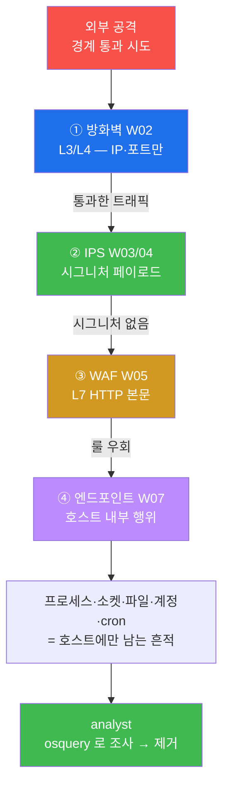
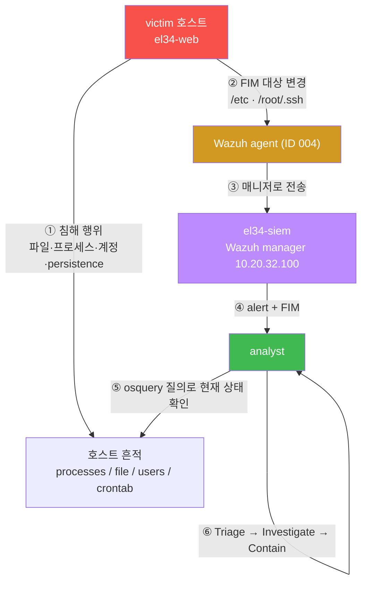
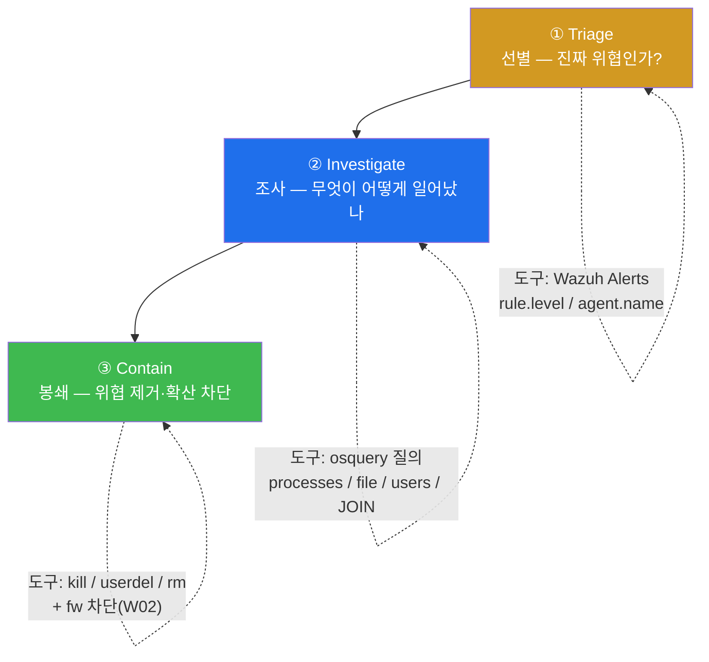
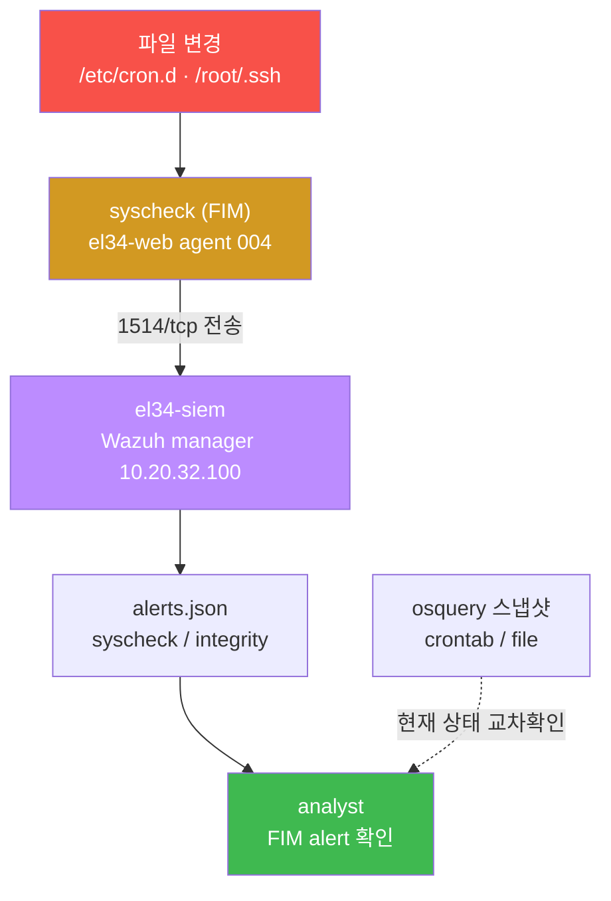
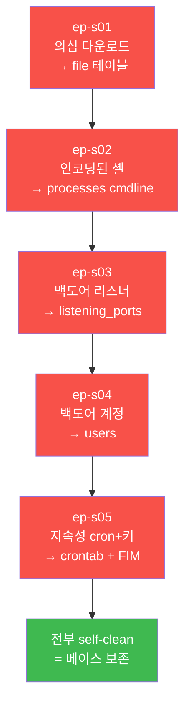
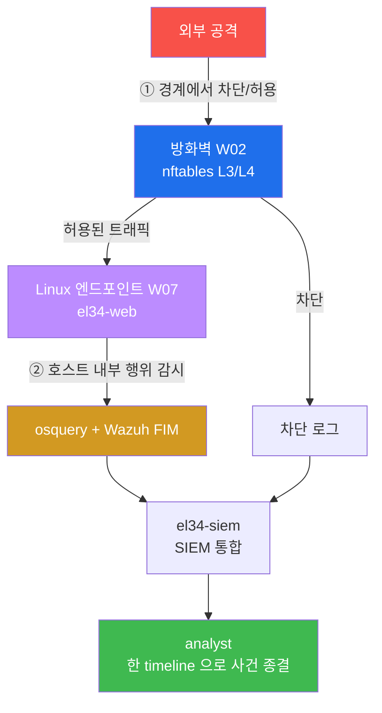

# Week 07 — Linux 엔드포인트 침해대응(IR) — victim 호스트를 osquery 로 조사한다

> **본 주차의 한 줄 요약**
>
> 지금까지 W02 방화벽·W03/04 IPS·W05 WAF 는 모두 **네트워크를 지나가는 트래픽**을 봤고, W06 의
> osquery 는 **호스트 내부 상태**를 SQL 로 들여다보는 법을 배웠다. 본 주차는 이 둘을 하나의
> 사건으로 잇는다 — **이미 호스트 안으로 들어온 공격자**가 남긴 흔적(떨어진 파일·수상한 프로세스·
> 백도어 리스너·몰래 만든 계정·지속성 장치)을 **분석가(analyst) 시점**에서 osquery 로 찾아내고,
> Wazuh FIM 으로 교차 확인한 뒤, **반드시 제거(self-clean)** 한다. 이 과정을 침해대응 5 시나리오
> (R/B/P)로 직접 손에 익힌다. el34 의 victim 호스트는 `el34-web` 한 대이며, 공유 인프라이므로
> 실습 흔적을 끝까지 남기지 않는 것까지가 본 주차의 SOP 다.
>
> **운영자 한 줄 결론**: 방화벽이 "문 앞"을, IPS/WAF 가 "복도"를 본다면, 엔드포인트 IR 은
> **방 안에서 무슨 일이 벌어졌는가**를 본다. 경계를 통과한 공격은 오직 호스트 안에서만 흔적을 남기며,
> 그 흔적을 SQL 한 줄로 끄집어내는 것이 osquery 기반 IR 이다.

---

## 학습 목표

본 주차 종료 시 학생은 다음 6가지를 **본인 손으로** 할 수 있어야 한다.

1. **침해대응(IR)** 의 의미와, 분석가의 표준 절차 **SOP 3단계(Triage → Investigate → Contain)** 가
   무엇이며 각 단계에서 어떤 도구를 쓰는지 비유 없이 1분 안에 설명한다.
2. **victim 호스트**(침해 현장 `el34-web`)와 **analyst 분석가**(조사하는 사람) 두 시점의 차이를
   알고, 각자 무엇을 보고 무엇을 하는지 그림으로 그린다.
3. el34-web 의 IR 텔레메트리(osquery 5.23.0 + Wazuh agent)가 살아있는지 첫 30초 안에 점검한다.
4. **침해대응 5 시나리오** — 의심 다운로드 / 인코딩된 셸 프로세스 / 백도어 리스너 / 백도어 계정 /
   지속성(persistence) — 을 osquery 의 알맞은 테이블(`file` / `processes` / `listening_ports` /
   `users` / `crontab`)로 탐지하고, 각 사건을 **재현 → 탐지 → 제거**의 한 사이클로 돌린다.
5. osquery **JOIN**(`processes ⨝ process_open_sockets`)으로 "이 포트의 주인 프로세스는 누구인가"를
   한 줄에 추적하고, `on_disk=0` 같은 헌팅 쿼리로 은닉 프로세스를 찾는다.
6. 방화벽이 못 본 호스트 내부 행위가 **Wazuh FIM 을 통해 SIEM(el34-siem)으로 적재**됨을 확인하고,
   사건 전체를 IR 보고서 1페이지로 정리한 뒤 공유 호스트의 베이스 상태를 **self-clean** 으로 보존한다.

> **본 주차의 시선** — 우리는 커널 내부 구현이나 메모리 포렌식을 깊이 파는 리버서가 아니다.
> "엔드포인트를 운영하며 위협을 조사하는 사람"의 시선이다. 따라서 본 강의의 축은 **텔레메트리(무엇을
> 보는가) + 조사 흐름(SOP) + R/B/P(직접 재현·탐지·대응)** 세 가지다. 실시간 이벤트 스트림인
> **sysmon-for-linux** 는 W11 에서 더하며, 본 주차는 그 전 단계인 osquery 스냅샷 중심의 IR 을 한다.

---

## 0. 용어 해설 (Linux 엔드포인트 IR 입문)

본 주차에 **처음 등장하는** 핵심 용어다. 본문에서 막히면 이 표로 돌아오면 흐름이 끊기지 않는다.

| 용어 | 영문 | 뜻 | 비유 |
|------|------|----|------|
| **엔드포인트** | Endpoint | 사용자·서비스가 실제로 도는 호스트(서버/PC) | 사람들이 머무는 각 방 |
| **침해대응** | IR (Incident Response) | 침해가 의심·발생했을 때 조사·봉쇄·복구하는 절차 | 사건 발생 후 출동하는 수사·진압 |
| **victim 호스트** | victim | 공격으로 위협에 노출된 호스트(본 강의 `el34-web`) | 사건이 벌어진 현장 |
| **analyst 분석가** | analyst | 텔레메트리로 그 사건을 조사·대응하는 사람 | 현장에 출동한 수사관 |
| **텔레메트리** | telemetry | 호스트가 내보내는 관찰 신호(프로세스/소켓/파일/계정/로그) | 현장에 남은 단서·증거 |
| **osquery** | — | OS 를 SQL 테이블로 질의하는 호스트 가시화 도구(W06) | 현장을 SQL 로 검색하는 감식 도구 |
| **스냅샷** | snapshot | "지금 이 순간"의 상태를 한 장 찍어 보는 것 | 현장의 현재 사진 |
| **persistence** | 지속성 | 재부팅·로그아웃 후에도 공격자가 다시 들어오게 만드는 장치 | 몰래 복제해 둔 현관 열쇠 |
| **FIM** | File Integrity Monitoring | 중요 파일의 변경을 실시간 감시 | 금고에 달아둔 CCTV |
| **Wazuh agent** | — | 호스트의 로그·FIM 결과를 SIEM 매니저로 보내는 끝단 | 현장과 관제실을 잇는 무전기 |
| **SIEM** | Security Information & Event Management | 여러 호스트의 신호를 모아 보는 관제실(el34=Wazuh) | 모든 현장을 한 화면에서 보는 관제실 |
| **IOC** | Indicator of Compromise | 침해 지표(악성 파일명·계정·IP·해시) | 수배 대상의 인상착의 |
| **SOP** | Standard Operating Procedure | 표준 대응 절차(여기선 Triage→Investigate→Contain) | 출동 매뉴얼 |
| **R/B/P** | Red / Blue / Purple | 공격 재현(Red) → 탐지(Blue) → 개선(Purple) 한 사이클 | 공격조·방어조·합동 개선 |
| **self-clean** | — | 공유 호스트에서 실습 흔적을 끝까지 제거해 베이스 보존 | 현장 보존을 위한 원상 복구 |

### 0.5 헷갈리기 쉬운 핵심 개념을 비유로 푼다

용어 표의 한 줄 정의만으로는 신입생이 오해하기 쉬운 세 개념을, 일상 비유로 다시 풀어 둔다.

#### 0.5.1 침해대응(IR) — "이미 들어온 도둑을 잡는 일"

W02~W05 에서 배운 방화벽·IPS·WAF 는 모두 **도둑이 들어오기 전에** 막는 도구다. 정문을 잠그고
(방화벽), 복도에 보안 카메라를 달고(IPS), 입구에 금속탐지기를 두는(WAF) 식이다. 그런데 현실의
침해는 이 모든 관문을 어떻게든 통과한 뒤에 일어난다 — 위장한 트래픽으로 방화벽을 통과하고, 시그니처가
없는 새 수법으로 IPS 를 피하고, 룰의 빈틈으로 WAF 를 우회한다.

**침해대응(IR)** 은 바로 그 다음을 다룬다. "도둑이 이미 집 안에 들어왔다고 가정하고, 어느 방에서
무엇을 건드렸고, 무엇을 두고 갔으며, 다시 들어올 장치를 심어두진 않았는지" 를 조사하고 정리하는 일이다.
그래서 IR 의 무대는 네트워크가 아니라 **호스트 내부**이고, 단서는 트래픽이 아니라 **호스트가 남긴
흔적**(프로세스/파일/계정/소켓)이다.

#### 0.5.2 두 페르소나(victim / analyst) — "현장과 수사관"

같은 사건을 두 자리에서 본다.

- **victim 호스트**는 사건이 **벌어진 현장**이다. 본 강의에서는 `el34-web` 컨테이너가 그 현장이다.
  여기에는 공격자가 떨어뜨린 파일, 띄워놓은 프로세스, 만든 계정, 심어둔 cron 이 그대로 남는다.
- **analyst 분석가**는 그 현장에 출동한 **수사관**이다. 직접 손으로 osquery 를 던져 현장을 검색하고,
  Wazuh SIEM 으로 다른 흔적과 맞춰보고, 무엇을 제거할지 결정한다.

실제 운영에서는 분석가의 PC 와 현장 호스트가 분리되지만, 본 트레이닝에서는 **호스트에 SSH 로 들어가
`docker exec el34-web` 로 victim 에 직접 osquery 를 던지는** 단순·확실한 경로를 쓴다. 즉 한 사람이
두 시점을 오가며 "현장에 단서를 남기고(Red) → 수사관으로 찾아내고(Blue) → 더 잘 잡도록 개선(Purple)"
하는 R/B/P 사이클을 돈다.

#### 0.5.3 스냅샷 vs 이벤트 — "현재 사진 vs 녹화 영상"

osquery 의 결과는 **스냅샷**이다. `SELECT * FROM processes` 는 "바로 지금" 떠 있는 프로세스의
한 장짜리 사진이다. 사진을 찍는 순간 존재하면 보이고, 그 전에 잠깐 떴다 사라진 것은 사진에 안 나온다.

반대로 **이벤트 스트림**은 24시간 돌아가는 녹화 영상이다. "몇 시 몇 분에 어떤 프로세스가 떴다"가
시간순으로 계속 기록된다. Linux 에서 이 역할을 하는 것이 **sysmon-for-linux**(W11)이며, 본 주차는
거기까지 가지 않는다. 본 주차의 핵심은 "사진을 잘 찍어 그 안의 이상을 가려내는" osquery 스냅샷 IR 이다.
다만 한 가지 예외가 있는데, **FIM(파일 변경 감시)** 은 스냅샷이 아니라 "파일이 바뀌는 순간"을 잡는
이벤트성 감시라서, 스냅샷이 놓치는 변경 흔적을 보완해 준다(§5에서 다룬다).

---

## 1. 침해대응(IR)의 자리 — 엔드포인트가 왜 마지막 안전망인가

### 1.1 한 줄 정의

**침해대응(IR)** 은 "공격이 경계를 통과한 뒤, 호스트 내부에 남은 흔적으로 사건을 재구성하고 봉쇄하는
활동" 이다. 본 주차의 IR 은 그 무대를 **Linux 엔드포인트** 한 대(`el34-web`)로 좁혀 다룬다.

### 1.2 왜 중요한가 — 경계 4계층을 통과한 공격은 호스트에만 남는다

W06 에서 봤듯, 네트워크 계층(방화벽·IPS·WAF)이 못 보는 사건이 있다. 다음 표는 "어느 계층이
이 사건을 볼 수 있는가"를 정리한 것이다.

| 사건 | 방화벽(W02) | IPS(W03) | WAF(W05) | **엔드포인트(W07)** |
|------|:----------:|:--------:|:--------:|:------------------:|
| 외부에서 의심 파일 다운로드 | (IP만) | (탐지 가능 시) | | ✓ 파일·프로세스 |
| base64 로 인코딩된 셸 실행 | | | | ✓ cmdline |
| 임의 포트에 백도어 리스너 | (포트만) | | | ✓ listening_ports |
| 백도어 계정 생성 | | | | ✓ users |
| cron / authorized_keys 지속성 | | | | ✓ crontab + FIM |
| 디스크에서 지워진 채 도는 프로세스 | | | | ✓ on_disk=0 |

표의 **마지막 열에만 ✓ 가 채워지는 행들** — 이것이 호스트 가시화/엔드포인트 IR 이 "마지막 안전망"인
이유다. 트래픽으로는 아예 보이지 않거나(파일 생성·계정 추가는 네트워크를 거치지 않는다), 보이더라도
IP/포트 수준의 단편만 남는 사건들이, 호스트 안에서는 프로세스·파일·계정으로 또렷이 드러난다.



### 1.3 el34 에서 어떻게 — victim 은 el34-web, 도구는 osquery

el34 의 본 주차 victim 은 **`el34-web`** 한 대다. 이 호스트에는 W06 에서 확인한 **osquery 5.23.0** 이
설치되어 있고, **Wazuh agent(ID 004)** 가 매니저(`el34-siem`)에 연결되어 호스트 행위를 SIEM 으로
보낸다. 분석가는 `ssh ccc@192.168.0.151` 로 호스트에 들어간 뒤 `docker exec el34-web` 로 victim 에
osquery 를 던지고, `docker exec el34-siem` 으로 Wazuh 쪽 적재를 확인한다.

> **주의 — el34-web 은 auth.log 대신 컨테이너 로깅을 쓴다.** 일반 Linux 서버라면 SSH 로그온·sudo
> 흔적이 `/var/log/auth.log` 에 쌓이지만, el34-web 은 컨테이너이므로 그 파일에 의존하지 않는다.
> 그래서 본 주차의 **주 도구는 osquery** 다 — auth.log 가 없어도 osquery 의 `processes`·`users`·
> `listening_ports`·`crontab`·`file` 테이블만으로 침해 흔적을 충분히 잡을 수 있다.

### 1.4 한계 — 스냅샷의 사각지대

osquery 는 스냅샷이므로(§0.5.3), 질의하는 순간 존재하지 않는 흔적은 잡지 못한다. 예컨대 공격자가
파일을 떨어뜨려 실행한 뒤 즉시 지우고 빠져나가면, 나중에 던진 `SELECT * FROM file` 에는 아무것도
안 나온다. 이 사각지대를 좁히는 두 보완책이 본 주차에 함께 등장한다 — **FIM**(변경이 일어나는
순간을 잡는 이벤트성 감시, §5)과 **on_disk=0 헌팅**(파일은 지웠어도 아직 메모리에서 도는 프로세스를
잡는 쿼리, §6.3). 실시간 이벤트 전면 도입은 W11 의 sysmon-for-linux 다.

---

## 2. 두 페르소나 — victim 호스트와 analyst 분석가

### 2.1 victim 호스트 — 침해의 현장

**한 줄 정의**: 공격으로 위협에 노출된 Linux 호스트. 본 강의에서는 `el34-web`.

**무엇이 남는가**: 공격자가 들어온 뒤 남기는 것은 거의 정해져 있다 — (a) 끌어온 파일, (b) 띄운
프로세스, (c) 연 포트(리스너), (d) 만든 계정, (e) 심어둔 지속성(cron/SSH 키). 본 주차의 5 시나리오가
정확히 이 다섯 가지에 1:1로 대응한다.

### 2.2 analyst 분석가 — 침해의 수습자

**한 줄 정의**: 텔레메트리로 사건을 조사·봉쇄하는 사람(SOC 보안팀).

**무엇을 하는가**: Wazuh 대시보드에서 alert 를 선별(Triage)하고, victim 에 osquery 를 던져 사실을
확인(Investigate)하고, 위협을 제거(Contain)한다. 본 주차에서 분석가의 주 도구는 **osquery + Wazuh** 다.

### 2.3 둘이 만나는 한 흐름



이 그림이 본 주차 전체의 축약이다 — victim 이 흔적을 남기고(①②), Wazuh agent 가 그 중 FIM 대상
변경을 매니저로 보내고(③④), 분석가가 osquery 로 현재 상태를 직접 확인하면서(⑤) SOP 3단계로 사건을
푼다(⑥).

---

## 3. Linux 엔드포인트 핵심 텔레메트리 — osquery 테이블 ↔ 침해 신호

### 3.1 분석가가 매일 보는 5 신호

침해 분석의 70% 는 다섯 가지 신호만 잘 봐도 풀린다. 각각이 어떤 osquery 테이블로 보이는지, 그리고
참고로 Windows 의 무슨 신호에 대응하는지 정리하면 다음과 같다.

| 침해 신호 | osquery 테이블 | 무엇을 보나 | (참고) Windows 대응 |
|-----------|----------------|-------------|---------------------|
| 떨어진 파일 | `file` | path / size / mtime — 의심 경로의 파일 | Sysmon 11 (FileCreate) |
| 수상한 프로세스 | `processes` | pid / name / cmdline / on_disk | Sysmon 1 / 4688 (ProcessCreate) |
| 열린 포트(리스너) | `listening_ports` | port / address / pid | Sysmon 3 (NetworkConnect) |
| 외부 연결 | `process_open_sockets` | remote_address / remote_port | Sysmon 3 |
| 사용자/계정 | `users` | username / uid / shell / directory | 4720 (계정 생성) |
| 지속성 | `crontab` / `authorized_keys` | command / path / key | Run keys / Services |

> **운영자가 외울 한 줄**: Linux 엔드포인트는 **file + processes + listening_ports + users + crontab**
> 다섯 테이블만 손에 익으면 침해 분석의 70% 가 끝난다. 본 주차 5 시나리오가 바로 이 다섯 테이블을
> 하나씩 쓰도록 설계되어 있다.

### 3.2 왜 "테이블"인가 — ps·ss·find 의 출력을 SQL 하나로 통일

W06 에서 배웠듯, 전통 도구는 도구마다 출력 형식이 다르다(`ps -ef`, `ss -tlnp`, `find`, `cat
/etc/passwd`). osquery 는 이 모든 정보를 **SQL 테이블** 하나의 문법으로 통일한다. 그래서 IR 분석가는
새 명령을 외울 필요 없이, `WHERE`·`LIKE`·`JOIN` 같은 SQL 표현력만으로 어떤 침해 신호든 끄집어낸다.
본 주차의 모든 탐지는 이 SQL 한 줄들로 이루어진다.

### 3.3 el34 에서 osquery 를 던지는 형태

el34-web 에서 osquery 를 호출하는 표준 형태는 다음과 같다. `--json` 으로 결과를 JSON 으로 받으면
사람이 읽기에도, 다른 도구로 넘기기에도 좋다.

```bash
docker exec el34-web osqueryi --json 'SELECT count(*) c FROM processes;'
```

`osqueryi` 는 osquery 의 대화형/단발 SQL 실행기다. 위처럼 따옴표 안에 SQL 한 줄을 주면 그 결과만
JSON 으로 출력하고 끝난다. 본 주차의 탐지 쿼리는 전부 이 형태를 쓴다.

---

## 4. 분석가의 SOP — Triage → Investigate → Contain

침해 신호를 마주한 분석가는 즉흥적으로 움직이지 않는다. 표준 절차(SOP) 3단계를 따른다.



### 4.1 Triage (선별)

**한 줄 정의**: 쏟아지는 alert 중 "지금 손댈 것"을 골라내는 단계.

분석가는 Wazuh 대시보드의 Alerts 화면에서 `rule.level`(심각도), `agent.name`(어느 호스트),
`rule.description`(무슨 사건)을 보고, 즉시 대응할지·조사 큐에 넣을지·오탐으로 무시할지 결정한다.
한 알람에 쓰는 시간 예산은 약 30초다. 모든 alert 를 똑같이 깊게 파면 진짜 사건을 놓친다(W05 의
ModSec false-positive, W09 의 alert fatigue 와 같은 맥락).

### 4.2 Investigate (조사)

**한 줄 정의**: victim 에 직접 질의해 "무엇이 어떻게 일어났는지" 사실을 확정하는 단계.

여기가 osquery 의 무대다. 의심 프로세스는 `processes` 의 `cmdline`·`on_disk` 로, 의심 연결은
`process_open_sockets` 의 `remote_port` 로, 지속성은 `crontab`·`authorized_keys` 로 확인한다.
나아가 **JOIN** 으로 "이 포트의 주인 프로세스는 누구인가"까지 한 줄에 잇는다(§6, 실습 7). 이렇게
모은 사실을 시간순으로 늘어놓아 사건 timeline 을 만든다.

### 4.3 Contain (봉쇄)

**한 줄 정의**: 확인된 위협을 제거하고 확산을 막는 단계.

본 주차 범위에서는 프로세스 종료(`pkill`/`kill`), 백도어 계정 제거(`userdel`), 파일·cron 제거(`rm`),
추가된 SSH 키 한 줄 삭제(`sed`)까지를 다룬다. 실제 운영이라면 여기에 더해 방화벽(W02)에 공격자 IP 를
추가하고, 침해 호스트를 네트워크에서 격리하며, 증거(메모리/디스크)를 먼저 보존한다. 자동 대응
(Wazuh active-response)은 W10 에서 다룬다.

> **공유 호스트의 Contain = self-clean.** el34-web 은 모든 학생이 함께 쓰는 호스트다. 따라서 본
> 주차의 Contain 은 단순히 "위협 제거"를 넘어, 실습으로 내가 만든 흔적(계정/cron/키/파일/프로세스)을
> **끝까지 원상 복구**해 다음 사람의 베이스 상태를 보존하는 것까지 포함한다. 이것이 실습 마지막
> 두 step(9·10)의 핵심이다.

---

## 5. Wazuh FIM — 스냅샷이 놓치는 변경을 잡는다

### 5.1 한 줄 정의와 왜 중요한가

**FIM(File Integrity Monitoring)** 은 중요 파일의 변경을 **변경이 일어나는 순간** 감지해 alert 를
올리는 기능이다. osquery 스냅샷은 "지금 그 파일이 있는가"만 보지만, FIM 은 "방금 그 파일이 바뀌었다"를
잡는다. 그래서 지속성 공격(§7.5)처럼 `/etc/cron.d` 나 `/root/.ssh/authorized_keys` 를 건드리는
순간을 FIM 이 또렷이 포착한다 — 스냅샷과 FIM 은 **보완 관계**다.

### 5.2 el34 에서 어떻게 — agent 가 보고, 매니저가 모은다

el34-web 의 **Wazuh agent(ID 004)** 가 호스트의 FIM 결과를 매니저 `el34-siem` 으로 보낸다. 매니저는
받은 FIM/alert 를 `/var/ossec/logs/alerts/alerts.json` 에 적재한다. agent 의 기본 syscheck(FIM)는
`/etc`, `/root/.ssh`, `/usr/bin` 같은 지속성 핵심 경로를 감시한다.



### 5.3 매니저 쪽 가시화 — agent 가 살아있는가

분석가가 가장 먼저 확인하는 것은 "그 호스트의 데이터가 매니저로 들어오고 있는가"다. el34 호스트에서:

```bash
docker exec el34-siem /var/ossec/bin/agent_control -l | grep -E "Name: web,"
```

출력에 `Name: web` 이 `Active` 로 보이면 el34-web 의 호스트 행위(FIM 포함)가 정상적으로 SIEM 에
적재되는 상태다. 이어서 최근 FIM alert 는 다음처럼 본다.

```bash
docker exec el34-siem sh -c 'tail -300 /var/ossec/logs/alerts/alerts.json | grep -iE "syscheck|integrity" | tail -3'
```

> **주의 — FIM 은 실시간이지만 즉시는 아니다.** syscheck 가 변경을 감지해 alert 를 올리기까지 약간의
> 주기 지연이 있을 수 있다. 그래서 실습에서 직후에 alert 가 안 보여도 정상이며, osquery 스냅샷
> (`crontab`/`file`)으로 현재 상태를 교차 확인하는 것이 더 빠르다. 둘을 함께 보는 것이 핵심이다.

### 5.4 한계

FIM 은 **등록된 경로**만 본다. 공격자가 감시 대상이 아닌 경로에 지속성을 심으면 FIM 에 안 잡힌다.
그래서 운영자는 지속성에 흔히 쓰이는 경로(`/etc/cron.*`, `/var/spool/cron`, `/etc/systemd/system`,
`/usr/local/bin`, 각 사용자 `.ssh`)를 빠짐없이 syscheck 에 등록해 둔다. 경로 확장 작업의 본격 운영은
W09(Wazuh manager 주차)에서 다룬다.

---

## 6. Investigate 의 핵심 — JOIN 과 헌팅 쿼리

조사 단계에서 분석가가 반복해 쓰는 두 무기가 있다. JOIN 과 헌팅 쿼리다.

### 6.1 JOIN — "이 포트의 주인 프로세스는 누구인가"

리스너를 하나 발견했다고 하자. 분석가가 진짜 알고 싶은 것은 "어느 프로세스가 그 포트를 듣고 있고,
그 명령행(cmdline)이 무엇인가"다. `processes` 와 `process_open_sockets` 를 `pid` 로 JOIN 하면
이 둘을 한 줄에 잇는다.

```sql
SELECT p.pid, p.name, s.local_port, s.remote_address, s.remote_port
FROM processes p
JOIN process_open_sockets s USING(pid)
WHERE s.local_port IN (80,443)
LIMIT 5;
```

`USING(pid)` 는 두 테이블의 `pid` 컬럼을 키로 결합하라는 뜻이다. 이 한 줄로 "포트 → 그 포트를 가진
pid → 그 pid 의 이름" 이 동시에 나온다. 외부로 나가는 연결(C2 후보)만 보고 싶다면 `remote_port!=0`
으로 거른다.

### 6.2 헌팅 쿼리 — 정상에는 드문 패턴을 노린다

헌팅은 "이 환경에서 정상이라면 거의 없을 패턴"을 SQL 로 찍는 것이다. 본 주차 5 시나리오가 곧 헌팅
패턴의 카탈로그다.

| 헌팅 의도 | 쿼리 골자 |
|-----------|-----------|
| 의심 경로의 파일 | `SELECT path,size,mtime FROM file WHERE path="/tmp/evil.bin"` |
| 인코딩/난독 cmdline | `SELECT pid,name,cmdline FROM processes WHERE cmdline LIKE "%b64decode%"` |
| 비정상 리스너 | `SELECT pid,port,address FROM listening_ports WHERE port=4444` |
| 백도어 계정 | `SELECT username,uid,shell FROM users WHERE username="w07intruder"` |
| 지속성 cron | `SELECT command,path FROM crontab WHERE path LIKE "%w07_backdoor%"` |

### 6.3 on_disk=0 — 지워진 채 도는 은닉 프로세스

§1.4 에서 말한 스냅샷의 사각지대를 좁히는 핵심 헌팅이다. 공격자는 파일을 떨어뜨려 실행한 뒤 디스크에서
그 바이너리를 지운다. 그러면 `file` 테이블에는 안 잡히지만, 프로세스는 여전히 메모리에서 돈다.
`processes` 의 `on_disk` 컬럼이 `0` 이면 "디스크에 더 이상 없는데 도는 프로세스" 즉 은닉/fileless
의심이다.

```sql
SELECT pid, name, path FROM processes WHERE on_disk=0 LIMIT 5;
```

---

## 7. 침해대응 5 시나리오 (R/B/P) — 본 주차의 심장

본 절의 다섯 시나리오는 실습 step 2~6 에 1:1로 대응한다. 각 시나리오는 동일한 R/B/P 구조다 —
**Red**(공격 재현) → **Blue**(osquery 탐지) → **Purple/Contain**(제거 + 베이스 보존). 모든 흔적은
실습 식별용 이름(`evil.bin`, `b64decode`, `4444`, `w07intruder`, `w07_backdoor`, `W07FAKE`)을 쓰며,
실제 악성 행위는 하지 않는다 — 탐지 연습이 목적이다.



### 7.1 ep-s01 — 의심 외부 다운로드 (`file` 테이블)

- **Red**: victim 의 쓰기 가능 경로(`/tmp`)에 외부 바이너리가 떨어진 상황을 모사한다.
- **Blue**: `SELECT path,size,mtime FROM file WHERE path="/tmp/evil.bin"` 로 그 파일을 메타데이터와
  함께 식별한다. `/tmp`·`/dev/shm` 처럼 누구나 쓸 수 있는 경로가 흔한 drop 지점이다.
- **Contain**: `rm -f` 로 제거한다.
- **교훈**: 다운로드된 파일은 네트워크에 안 남아도(혹은 IP 단편만 남아도) 호스트의 `file` 테이블에는
  path/size/mtime 으로 또렷이 남는다.

### 7.2 ep-s02 — 인코딩된 셸 프로세스 (`processes` 의 cmdline)

- **Red**: `base64` 로 인코딩된 페이로드를 디코드해 실행하는, 의심 cmdline 을 가진 프로세스를 띄운다
  (실제 악성 아님, 탐지용 lingering 프로세스).
- **Blue**: `SELECT pid,name,cmdline FROM processes WHERE cmdline LIKE "%b64decode%"` 로 잡는다.
  cmdline 의 base64/exec/`-c` 패턴은 강력한 탐지 단서다 — Windows 의 PowerShell `-EncodedCommand`
  탐지와 같은 발상이다.
- **Contain**: `pkill -f b64decode` 로 종료한다.
- **교훈**: 무엇을 실행했는지는 cmdline 에 드러난다. 난독화는 오히려 "왜 이렇게 꼬아놨지?"라는
  탐지 신호가 된다.

### 7.3 ep-s03 — 백도어 리스너 (`listening_ports`)

- **Red**: 임의 포트(4444)에 리스너가 뜬 상황을 모사한다.
- **Blue**: `SELECT pid,port,address FROM listening_ports WHERE port=4444` 로 어느 프로세스가 어디서
  듣는지 찾는다. 정상 서비스 포트 목록과 대조하면 비정상 리스너가 즉시 드러난다.
- **Contain**: 해당 프로세스를 `pkill` 로 종료한다.
- **교훈**: 호스트가 듣고 있는 포트 목록은 곧 "외부에서 들어올 수 있는 통로 목록"이다. baseline 에
  없는 포트가 곧 의심 대상이다.

### 7.4 ep-s04 — 백도어 계정 (`users`)

- **Red**: 침투 후 재진입용 백도어 계정(`w07intruder`, uid 1099)을 만든 상황을 모사한다.
- **Blue**: `SELECT username,uid,shell,directory FROM users WHERE username="w07intruder"` 로 비정상
  계정을 식별한다. 이상한 uid, 예상치 못한 shell, 최근 생성 등이 단서다.
- **Contain**: `userdel -r` 로 계정과 홈 디렉터리를 제거한다. **정상 베이스 계정은 절대 건드리지
  않는다.**
- **교훈**: 계정 추가는 네트워크에 흔적이 거의 없다. 호스트의 `users` 테이블을 baseline 과 대조하는
  것이 유일한 탐지 길이다.

### 7.5 ep-s05 — 지속성(cron + authorized_keys) + Wazuh FIM

- **Red**: `/etc/cron.d` 에 백도어 cron 을 만들고, `/root/.ssh/authorized_keys` 에 가짜 키 한 줄을
  **추가(append)** 한다.
- **Blue**: `SELECT command,path FROM crontab WHERE path LIKE "%w07_backdoor%"` 로 cron 지속성을
  잡고, 같은 변경이 **Wazuh FIM(syscheck)** alert 로도 올라오는지 매니저에서 확인한다(§5). osquery
  스냅샷(지금 그 cron 이 있는가)과 FIM(방금 그 파일이 바뀌었는가)이 한 사건을 두 각도에서 증명한다.
- **Contain**: cron 파일은 `rm` 으로 통째로 제거하고, authorized_keys 는 **추가한 한 줄만**
  `sed -i "/W07FAKE/d"` 로 삭제한다 — 파일을 통째로 지우면 정상 키까지 날아가므로, 내가 더한 줄만
  지워 베이스를 보존하는 것이 포인트다.
- **교훈**: 지속성은 방화벽이 절대 못 보는 호스트 내부 행위다. **방화벽(W02) + 엔드포인트(W07) =
  다층 방어** — 경계가 못 본 지속성을 엔드포인트가 잡는다.

---

## 8. 다층 방어 한 그림 — 방화벽 + 엔드포인트



- **방화벽**이 ① 경계에서 차단/허용을 결정한다. 통과한 것은 더 이상 못 본다.
- **엔드포인트**가 ② 통과한 트래픽이 호스트 안에서 무슨 행위를 했는지(프로세스/포트/파일/계정/cron)를
  본다 — 방화벽이 못 보는 내부를 채운다.
- **SIEM**이 둘을 한 timeline 으로 묶고, 분석가가 그 timeline 으로 사건을 종결한다.

이것이 본 주차가 W02(방화벽)와 명시적으로 연결되는 지점이며, W08 중간고사에서 "한 사건을 fw → ips →
web → 엔드포인트 → SIEM 전 계층에서 추적"하는 종합 과제의 토대가 된다.

---

## 9. 운영 트러블슈팅 — Linux 엔드포인트 IR 빈출 4가지

| 증상 | 확인 | 처치 |
|------|------|------|
| "agent 가 SIEM 에 안 보인다" | `agent_control -l` 에 `web` 없음/Disconnected | agent 등록·client.keys·매니저 IP(10.20.32.100) 확인 |
| "osquery 결과가 비어 있다" | 테이블/컬럼명 오타, 일부는 root 필요 | `docker exec`(root)로 질의, `.schema <table>` 로 컬럼 확인(W06) |
| "FIM(파일 변경) alert 가 안 뜬다" | syscheck 주기 지연 또는 경로 미등록 | osquery 스냅샷으로 즉시 교차확인, syscheck 경로 등록(W09) |
| "self-clean 후에도 흔적이 남는다" | cron/키/계정/프로세스 잔재 | 실습 식별자(`w07intruder`/`w07_backdoor`/`W07FAKE`/`evil.bin`/`4444`/`b64decode`) 일괄 점검(실습 10) |

---

## 10. 핵심 정리 (8줄)

1. **IR 은 "이미 들어온 공격"을 호스트 내부 흔적으로 재구성·봉쇄하는 일** — 무대는 호스트, 도구는 osquery.
2. **두 페르소나** — victim(현장 `el34-web`) + analyst(수사관). 한 사람이 R/B/P 로 두 시점을 오간다.
3. Linux 엔드포인트는 **file + processes + listening_ports + users + crontab** 다섯 테이블로 침해 분석 70%.
4. osquery = **"지금 상태"(스냅샷)**, FIM = **"변경되는 순간"(이벤트성)** — 둘은 보완 관계.
5. 분석가 **SOP** = Triage(선별) → Investigate(osquery 조사) → Contain(제거).
6. **JOIN**(processes ⨝ sockets)으로 "포트의 주인 프로세스"를, **on_disk=0** 으로 은닉 프로세스를 잡는다.
7. **방화벽(W02) + 엔드포인트(W07) = 다층 방어** — 경계가 못 본 지속성을 엔드포인트가 잡는다.
8. 공유 호스트의 Contain 은 **self-clean** 까지 — 실습 흔적을 끝까지 지워 베이스를 보존한다.

---

## 11. 실습 안내 (총 10 step) — 각 실습 4축

각 실습을 **왜 하는가 / 무엇을 알 수 있는가 / 결과 해석 / 실전 활용** 4축으로 안내한다. 실습 명령의
정확한 형태는 `lab_week07.yaml` 의 각 step 을 따른다(본 강의는 그 의미를 설명한다).

### 실습 1 — victim 텔레메트리 점검 (survey)

> **왜 하는가** — IR 의 0단계는 "조사할 도구가 살아있는가"다. osquery 가 동작하고 Wazuh agent 가
> Active 여야 이후 모든 탐지·적재가 성립한다.
> **무엇을 알 수 있는가** — el34-web 의 osquery 버전(5.23.0), 현재 프로세스 수, web agent 의 Active 여부.
> **결과 해석** — osquery 5.x + 프로세스 count + `Name: web` Active 면 IR 도구 준비 완료. agent 가
> Disconnected 면 SIEM 적재가 끊긴 상태이므로 먼저 이를 해결한다.
> **실전 활용** — 사건 인수 첫 30초. "이 호스트를 조사할 수 있는 상태인가"를 가장 먼저 확정한다.

### 실습 2 — ep-s01 의심 다운로드 (response)

> **왜 하는가** — 가장 흔한 침해 1단계인 "외부 파일 끌어오기"를 `file` 테이블로 잡는 감각을 익힌다.
> **무엇을 알 수 있는가** — drop 된 파일의 path/size/mtime, 그리고 `/tmp`·`/dev/shm` 이 흔한 drop 경로라는 사실.
> **결과 해석** — `file` 결과에 `/tmp/evil.bin` 이 보이면 탐지 성공. 보인 즉시 제거(Contain)한다.
> **실전 활용** — 의심 경로 헌팅의 기본기. 운영에서는 쓰기 가능 경로 전체를 주기적으로 스캔한다.

### 실습 3 — ep-s02 인코딩된 셸 (response)

> **왜 하는가** — 난독화된 실행을 cmdline 패턴으로 잡는 핵심 탐지를 연습한다.
> **무엇을 알 수 있는가** — `processes.cmdline` 에 남는 base64/exec 패턴이 강력한 단서라는 점.
> **결과 해석** — cmdline 에 `python3` + 인코딩 패턴이 보이면 탐지 성공. `pkill` 로 종료한다.
> **실전 활용** — Windows 의 `-EncodedCommand` 탐지와 같은 발상. 정상 운영에 드문 패턴을 룰로 만든다.

### 실습 4 — ep-s03 백도어 리스너 (response)

> **왜 하는가** — 비정상 리스너를 `listening_ports` 로 식별하는 감각을 익힌다.
> **무엇을 알 수 있는가** — 어느 pid 가 어느 포트를 듣는지, 정상 포트 목록과의 대조법.
> **결과 해석** — `listening_ports` 에 `4444` 가 보이면 탐지 성공. 해당 프로세스를 종료한다.
> **실전 활용** — "이 호스트가 듣고 있는 포트"는 곧 공격 표면. baseline 외 포트는 즉시 조사 대상.

### 실습 5 — ep-s04 백도어 계정 (response)

> **왜 하는가** — 네트워크에 흔적이 없는 계정 추가를 `users` 테이블로 잡는다.
> **무엇을 알 수 있는가** — 이상 uid/shell 의 계정을 baseline 과 대조하는 법.
> **결과 해석** — `users` 에 `w07intruder` 가 보이면 탐지 성공. `userdel` 로 제거하되 정상 계정은 보존.
> **실전 활용** — 측면이동·재진입의 단골 수법. 신규 계정 diff 를 주기적으로 본다.

### 실습 6 — ep-s05 persistence + Wazuh FIM (response)

> **왜 하는가** — 지속성을 osquery(`crontab`)와 FIM 두 각도에서 잡고, 다층 방어의 마지막 조각을 본다.
> **무엇을 알 수 있는가** — cron/authorized_keys 지속성, 그리고 같은 변경이 Wazuh FIM alert 로도 오는지.
> **결과 해석** — `crontab` 에 `w07_backdoor` 가 보이면 탐지 성공. cron 은 통째로 제거하고 키는 추가분만 삭제.
> **실전 활용** — 지속성 경로는 운영의 필수 감시 대상. FIM 경로 등록이 곧 방어선이다(W09 확장).

### 실습 7 — JOIN 헌팅 조사 (analysis)

> **왜 하는가** — Investigate 단계의 핵심인 "포트 ↔ 프로세스 소유" 추적을 JOIN 으로 한 줄에 잇는다.
> **무엇을 알 수 있는가** — 어느 프로세스가 어느 포트를 듣는지, 외부 연결(C2 후보), 은닉 프로세스(on_disk=0).
> **결과 해석** — JOIN 결과에 `pid` 와 포트(80/443)가 함께 보이면 조사 쿼리가 정상 동작한 것.
> **실전 활용** — 분석가 timeline 의 중심 질의. "수상한 포트 → 책임 프로세스 → cmdline" 역추적.

### 실습 8 — SIEM 적재 확인 (detect)

> **왜 하는가** — 호스트 행위가 실제로 SIEM 으로 흘러드는지 확인해 다층 방어를 마무리한다.
> **무엇을 알 수 있는가** — web agent 의 Active 상태, FIM/syscheck alert 의 적재 여부.
> **결과 해석** — web agent Active + (활동 시) syscheck/integrity alert 가 보이면 적재 정상. 직후
> alert 가 없어도 주기 지연이므로 정상일 수 있다.
> **실전 활용** — "엔드포인트 → SIEM" 파이프가 살아있어야 관제가 성립한다. 매일 첫 점검 항목.

### 실습 9 — IR 보고서 (report)

> **왜 하는가** — 흩어진 탐지 결과를 SOP(Triage→Investigate→Contain) 틀로 한 페이지에 정리한다.
> **무엇을 알 수 있는가** — 5 시나리오 탐지 결과·조사 timeline·SIEM 적재를 한눈에 잇는 보고 능력.
> **결과 해석** — 보고서에 5 시나리오 표 + SOP 3단계 + SIEM 적재가 포함되면 완성.
> **실전 활용** — 사건 종결의 산출물. 다음 사람이 읽고 재현·후속할 수 있어야 한다.

### 실습 10 — self-clean 확인 (cleanup)

> **왜 하는가** — 공유 호스트의 베이스 상태를 보존하는, IR 의 필수 마무리 SOP 를 검증한다.
> **무엇을 알 수 있는가** — 실습 흔적(`w07intruder`/`w07_backdoor`/`W07FAKE`/`evil.bin`/`4444`/
> `b64decode`)이 0인지.
> **결과 해석** — 모든 잔재가 0이고 `check done` 이 출력되면 베이스 보존 완료.
> **실전 활용** — 공유 인프라에서 정리 의무는 곧 신뢰. 내 실습이 다음 사람의 환경을 오염시키지 않는다.

---

## 12. 과제

1. el34-web 에서 osquery 의 `processes`·`listening_ports`·`users`·`crontab`·`file` 다섯 테이블을 각
   1회씩 질의하고, 각 출력에서 "정상으로 보이는 행 1개"를 골라 왜 정상인지 1줄로 설명하라.
2. ep-s02 를 직접 재현해 `processes.cmdline` 에서 인코딩 패턴을 캡처한 뒤, **반드시 `pkill` 로 종료**하라.
3. ep-s05 를 재현해 osquery `crontab` 에서 `w07_backdoor` 를, Wazuh `alerts.json` 에서 syscheck alert 를
   각각 찾아 캡처하고, cron 제거 + authorized_keys 추가분 1줄만 삭제로 **self-clean** 하라.
4. 실습 7 의 JOIN 쿼리를 본인 손으로 작성해 "80/443 포트의 주인 프로세스"를 한 줄에 출력하라.
5. (생각) **방화벽이 못 보지만 엔드포인트가 보는 호스트 행위 3가지**를 el34 구조에서 구체적으로 들고,
   각각을 어느 osquery 테이블/FIM 으로 잡는지 1문단씩 쓰라.

---

## 13. 다음 주차 (W08) 예고 — 중간고사

W01–W07 의 5종 보안 솔루션(방화벽 / IPS / WAF / SIEM / 호스트 가시화)과 엔드포인트 IR 을 종합 실기로
점검한다. 한 공격 사건을 **fw → ips → web → 엔드포인트 → SIEM** 의 전 계층에서 추적·대응하는 능력을
평가하며, 본 주차에서 익힌 osquery 5 테이블 탐지 + SOP 3단계 + self-clean 이 그 중 호스트 계층의
핵심 평가 항목이 된다.
