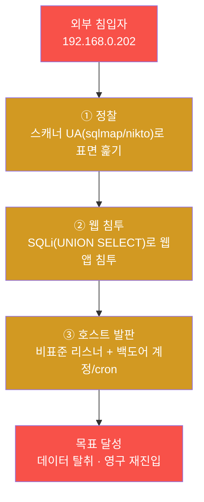
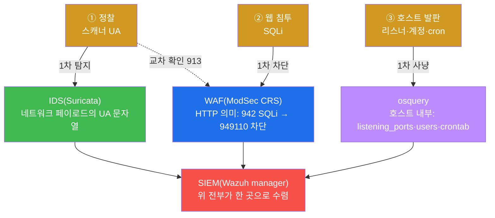
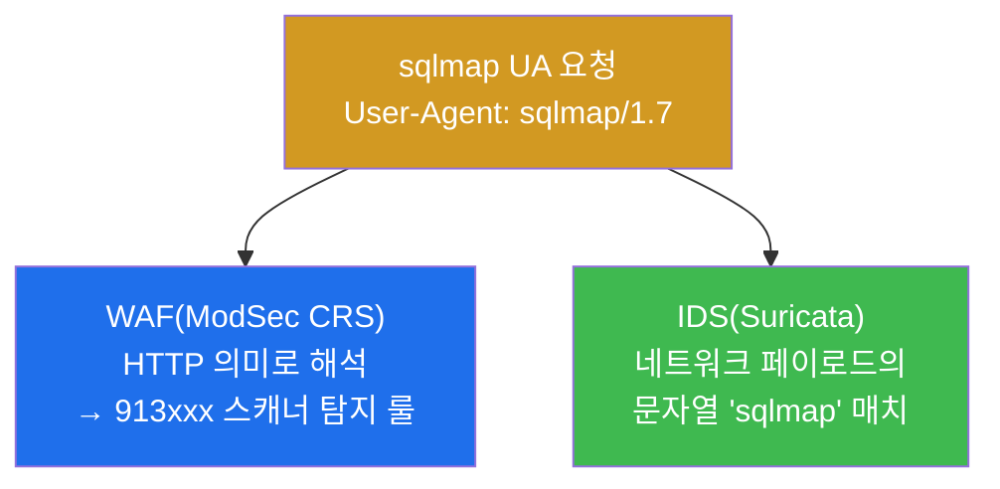
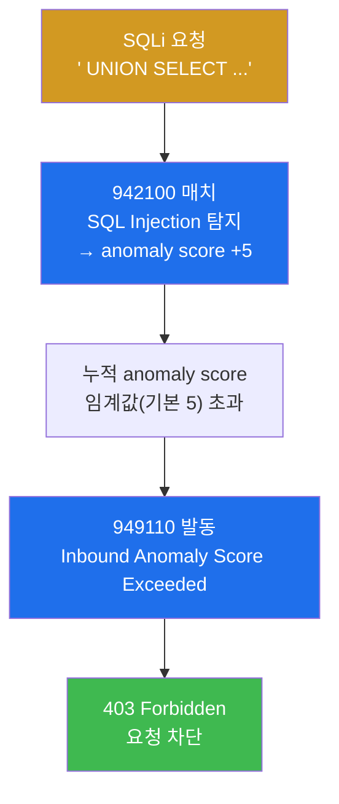
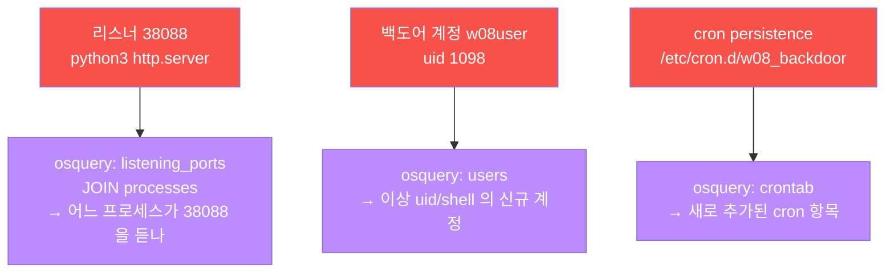
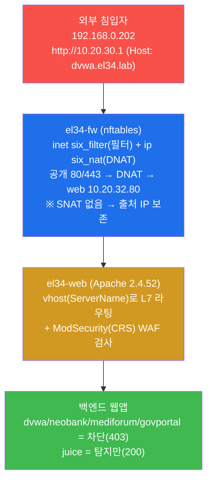
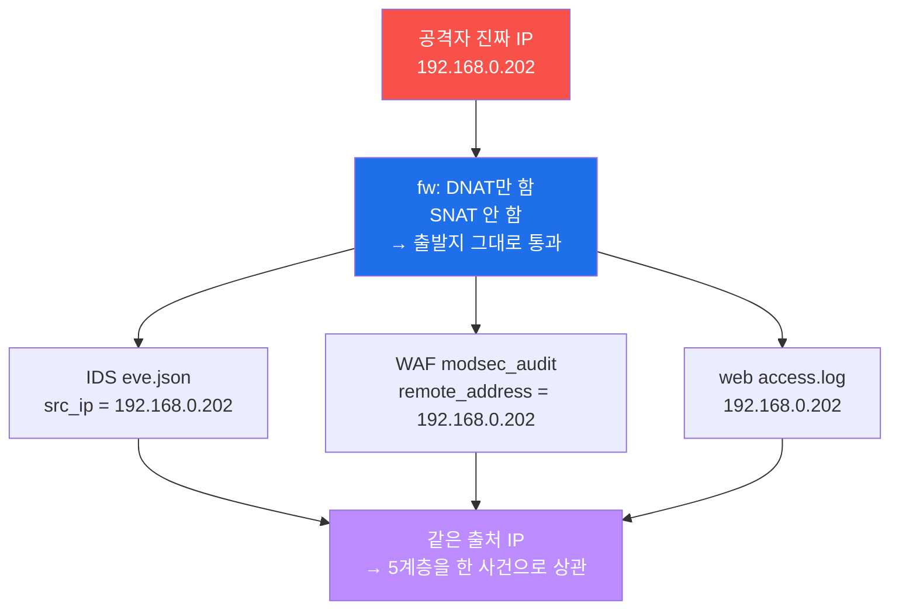
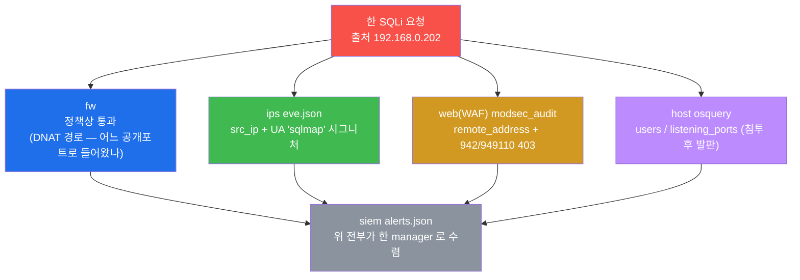
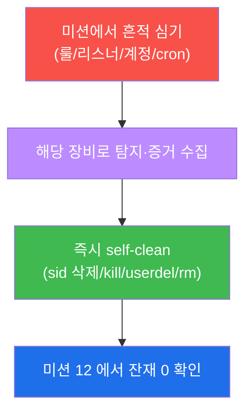
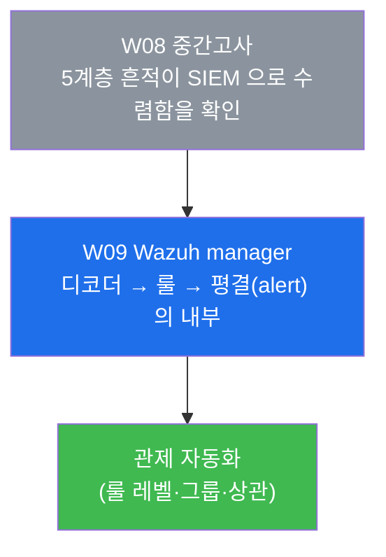

# Week 08 — 중간고사: 한 침입 사슬을 5종 보안 장비로 끝까지 막아내기

> **본 주차의 한 줄 요약**
>
> 지난 7주 동안 학생은 방화벽(W02) · IDS(W03–W04) · WAF(W05) · 호스트 가시화(W06) ·
> 엔드포인트 침해대응(W07) 을 **하나씩** 익혔다. 중간고사는 이 5종을 **따로따로**가 아니라,
> **한 명의 침입자가 시도하는 공격 사슬(kill chain) 전체** 위에 올려놓고 본다. 학생은 한
> 침입자가 시도하는 **정찰 → 웹 침투 → 호스트 발판**의 3 단계를 "어느 단계를 어느 장비로
> 끊을지" 판단하고, 5종을 모두 동원해 추적·차단·정리한 뒤, 마지막에 **출처 IP 하나로 5계층의
> 흔적을 한 타임라인으로 엮어** 종합 보고하는 능력을 평가받는다.
>
> **운영자 한 줄 결론**: 어떤 단일 장비도 사슬 전체를 못 막는다. 방화벽은 호스트 내부를 못
> 보고, osquery 는 네트워크 정찰을 못 본다. **다층 방어(defense in depth)** 와 **통합
> 가시성(SIEM 수렴)** 이 정답이다.

---

## 학습 목표

본 주차(중간 평가) 종료 시 학생은 다음 7가지를 **본인 손으로** 할 수 있어야 한다.

1. W02–W07 에서 배운 5종 보안 장비(방화벽 / IDS / WAF / osquery / SIEM)가 각각 **공격 사슬의
   어느 단계를 보는지·못 보는지**를 한 표로 정리하고, 그 이유(어느 계층의 데이터를 다루는가)를
   설명한다.
2. 한 외부 침입자의 **공격 사슬(정찰 → 웹 침투 → 호스트 발판)** 3 단계를 재현하고, 각 단계를
   알맞은 장비로 끊는다.
3. 같은 `sqlmap` 요청 하나가 **WAF(913 스캐너 룰)** 와 **IDS(네트워크 UA 문자열 룰)** 에
   동시에, 그러나 **서로 다른 층위**로 잡힌다는 것을 증거로 보인다.
4. 정찰을 사슬 초기에 끊기 위해 Suricata `local.rules` 에 커스텀 IDS 룰(sid 9008001)을 직접
   작성·reload·트리거·검증하고, **끝나면 sid 로 삭제해 베이스 룰을 보존**한다.
5. 네트워크 장비가 못 보는 **호스트 내부 발판**(비표준 포트 리스너 38088, 백도어 계정 w08user,
   cron persistence)을 osquery 의 SQL 질의로 사냥하고 즉시 정리(self-clean)한다.
6. el34 가 **SNAT 를 하지 않아 출처 IP(192.168.0.202)가 끝까지 보존된다**는 사실을 이용해, IDS 의
   `src_ip` 와 WAF 의 `remote_address` 가 같은 IP 임을 확인하여 5계층을 **한 사건**으로 상관한다.
7. 위 모든 단계를 **증거(로그/audit/eve.json/osquery 결과)와 함께** 한 침입 사슬의 단계별 표로
   정리한 종합 보고서를 작성한다.

> **중간고사의 시선** — 본 주차는 새 도구를 배우는 주가 아니라, 지금까지 배운 도구를 **한 사건
> 위에서 통합**하는 주다. 채점은 "막았다/잡았다"라는 결과 선언이 아니라, **각 단계를 올바른
> 장비로 끊고 그 증거를 제시했는가**, 그리고 **5계층을 출처 IP 로 한 타임라인에 엮었는가**를 본다.

---

## 0. 용어 해설 (중간고사에서 다시 쓰는 핵심어)

본 주차는 W01–W07 의 용어를 종합한다. 처음 나오거나 시험에서 특히 중요한 용어를 다시 정리한다.
이미 앞 주차에서 정의한 용어라도, 중간고사에서 **이 의미로 쓴다**는 것을 분명히 하기 위해 다시 적는다.

| 용어 | 영문 | 뜻 | 비유 |
|------|------|----|------|
| **공격 사슬** | kill chain | 침입자가 목표 달성까지 거치는 단계들의 연쇄 | 도둑의 침입 순서(담 넘기→문 따기→금고 열기) |
| **정찰** | Recon(naissance) | 공격 전 표면을 훑어 약점을 찾는 단계 | 도둑이 건물 주위를 돌며 약한 문을 찾음 |
| **웹 침투** | Exploit | 발견한 약점으로 실제 침입하는 단계 | 따낸 문으로 안에 들어감 |
| **호스트 발판** | Foothold / Persistence | 침입한 호스트에 재진입 수단을 심는 단계 | 안에서 뒷문을 따로 만들어 둠 |
| **다층 방어** | Defense in Depth | 여러 보안 계층을 동시에 두어 한 번의 우회로 뚫리지 않게 함 | 담장+출입통제+금고+CCTV |
| **SNAT** | Source NAT | 통과하는 패킷의 **출발지 IP**를 다른 IP로 바꾸는 변환 | 편지 봉투의 보내는 사람 주소를 바꿔치기 |
| **DNAT** | Destination NAT | 통과하는 패킷의 **목적지 IP**를 내부 대상으로 바꾸는 변환 | 우체국이 사서함 주소를 실제 집주소로 바꿔 배달 |
| **상관 분석** | correlation | 여러 소스의 흔적을 공통 키(IP·시각)로 묶어 한 사건으로 봄 | 여러 CCTV 영상을 시간·인물로 한 줄로 이음 |
| **anomaly score** | — | ModSecurity CRS 가 룰 위반마다 점수를 누적해 임계 초과 시 차단 | 벌점 누적 — 일정 점수 넘으면 퇴장 |
| **fast_pattern** | — | Suricata 가 룰 매칭 전 빠르게 거르는 핵심 문자열 | 검문소의 1차 키워드 필터 |
| **self-clean** | — | 실습 중 심은 흔적을 그 단계에서 스스로 정리함 | 훈련 후 사격장 탄피 회수 |
| **persistence** | — | 재부팅·로그아웃 후에도 살아남는 재진입 수단(계정/cron/키) | 몰래 복제해 둔 여벌 열쇠 |

> **헷갈리기 쉬운 한 쌍 — SNAT vs DNAT.** 둘 다 NAT(주소 변환)지만 바꾸는 곳이 정반대다. **DNAT**
> 는 **목적지**를 바꾼다 — el34 의 fw 가 공개 주소 `10.20.30.1` 로 온 요청을 내부 web `10.20.32.80`
> 으로 보내는 것이 DNAT 다(우체국이 사서함 → 실제 집주소). **SNAT** 는 **출발지**를 바꾼다 — 만약
> el34 가 SNAT 를 했다면, 안쪽 장비들은 공격자의 진짜 IP 대신 fw 의 IP 만 보게 된다(봉투의 보내는
> 사람을 fw 로 위조). **el34 는 SNAT 를 하지 않는다.** 그래서 IDS·WAF·access.log 가 모두 공격자의
> 진짜 출처 IP(`192.168.0.202`)를 본다 — 이것이 본 중간고사에서 **5계층을 한 사건으로 엮는 키**다.

---

## 1. 왜 단일 장비로는 공격 사슬을 못 막는가

### 1.1 한 줄 답: 각 장비는 서로 다른 "계층의 데이터"만 본다

W01 에서 다층 방어(Defense in Depth)를 배울 때, 우리는 보안 장비를 5종이나 두는 이유가 "단일
방어선은 우회 한 번에 무너지기 때문"이라고 했다. 중간고사는 그 원리를 **공격자 한 명의 행동
순서** 위에서 실증한다.

핵심은 **각 장비가 보는 데이터의 계층이 다르다**는 것이다. 방화벽은 패킷의 IP/포트(L3/L4)만
본다. 그래서 HTTP 안에 들어 있는 `User-Agent: sqlmap` 같은 응용 계층 문자열을 못 본다. 반대로
osquery 는 호스트 내부(프로세스·계정·파일)를 보지만, 네트워크를 흘러가는 정찰 패킷은 못 본다.
한 장비가 못 보는 영역을 다른 장비가 본다 — 이것이 5종을 동시에 두는 이유다.



위 사슬에서 **어느 한 단계라도 끊으면** 공격자는 목표에 도달하지 못한다. 그런데 단계마다 잡는
장비가 다르다. 그래서 5종을 모두 살려두고, 각 단계를 알맞은 장비로 끊어야 한다.

### 1.2 어느 장비가 어느 단계를 보는가 — 사슬 위에 장비를 겹쳐 그리기

같은 사슬에 "어느 장비가 그 단계를 1차로 잡는가"를 겹쳐 보면 다음과 같다.



이 그림이 중간고사 전체의 지도다. 정찰은 IDS 가(WAF 가 보조로), 웹 침투는 WAF 가, 호스트 발판은
osquery 가 1차로 잡고, **모든 흔적은 마지막에 SIEM(Wazuh)으로 수렴**한다. 학생이 시험에서 할 일은
이 지도를 실제 명령과 증거로 채우는 것이다.

### 1.3 "왜 중요한가" — 단일 장비 신뢰가 실패한 사례의 교훈

W01 에서 본 Equifax(2017), SolarWinds(2020), 인터파크(2021) 사고의 공통 결론은 한 가지였다 —
**단일 솔루션의 실패였고, 다른 계층이 보완했다면 사고 규모가 줄었을 것**이다. 중간고사는 그
교훈을 학생이 직접 손으로 재현하게 한다. 예를 들어 방화벽만 믿었다면 정찰 단계의 스캐너 UA 를
영영 못 봤을 것이고(L4 라 UA 를 못 봄), IDS·WAF 만 믿었다면 침투 후 호스트에 심긴 백도어 계정을
못 봤을 것이다(네트워크 장비는 호스트 내부를 못 봄). 그래서 5종을 모두 동원하는 통합 사고가 정답이다.

### 1.4 한계 — 이 시험이 다루지 않는 것

본 중간고사는 W01–W07 의 범위 안에서 통합을 평가한다. 따라서 **W09 이후에 배울 내용**(Wazuh
manager 의 디코더·룰 작성, sysmon-for-linux 의 실시간 이벤트 스트림, OpenCTI 위협 인텔리전스
통합)은 시험 대상이 아니다. 또한 본 시험의 SIEM 단계는 "흔적이 한 곳으로 수렴하는지 확인"까지이며,
manager 내부에서 디코더와 룰이 어떻게 동작하는지는 바로 다음 주차 W09 에서 본격적으로 다룬다.

---

## 2. 공격 사슬(kill chain) 상세 — 침입자의 3 단계

이번 시험의 시나리오는 한 외부 침입자가 다음 사슬을 시도하는 것이다. el34 의 **내부 발판
공격자**(`el34-attacker`, 출처 IP `192.168.0.202`)가 fw 의 게이트웨이(`10.20.30.1`)를 통해
`dvwa.el34.lab` vhost 를 노린다. el34 는 SNAT 를 하지 않으므로 출처 IP `192.168.0.202` 가 모든
계층에 그대로 보존된다.

### 2.1 ① 정찰(Recon) — 스캐너 UA 로 표면 훑기

**한 줄 정의.** 정찰은 공격 전에 표적의 표면을 훑어 어떤 서비스·약점이 있는지 알아내는 단계다.

**무엇을 하나.** 공격자는 `sqlmap`, `nikto` 같은 자동화 스캐너로 요청을 보낸다. 이런 도구는 자기
정체를 드러내는 **User-Agent(UA)** 문자열(예: `sqlmap/1.7`)을 HTTP 헤더에 담는다.

> **용어 — User-Agent(UA).** HTTP 요청 헤더의 한 줄로, 요청을 보낸 클라이언트가 자신이 무엇인지
> 밝히는 문자열이다. 정상 브라우저는 `Mozilla/5.0 ...` 같은 값을, 스캐너는 종종 `sqlmap/1.7` 처럼
> 자기 도구 이름을 그대로 담는다. 공격자가 UA 를 위장할 수도 있지만, 학습/시험에서는 스캐너의
> 기본 UA 를 그대로 사용해 "정찰의 신호"를 명확히 본다.

**el34 에서 어떻게 잡히나.** 같은 sqlmap 요청 하나가 두 장비에 동시에, 그러나 다른 층위로 잡힌다.



- **WAF** 에는 CRS 의 **913 룰군(scanner detection)** 으로 잡힌다 — WAF 는 이 요청을 "알려진 스캐너의
  HTTP 패턴"으로 해석한다.
- **IDS** 에는 네트워크를 흐르는 페이로드 안의 문자열 `sqlmap` 으로 잡힌다 — 단, 이 룰은 학생이 직접
  만들어야 한다(시험 미션 3). IDS 는 이 요청을 "특정 바이트 문자열을 포함한 네트워크 트래픽"으로 본다.

**한계.** 방화벽은 이 단계를 **전혀 못 본다.** 방화벽은 L3/L4(IP·포트)만 보므로, HTTP 헤더 안의 UA
문자열은 방화벽의 가시 범위 밖이다. 그래서 정찰 탐지는 IDS/WAF 의 영역이다.

### 2.2 ② 웹 침투(Exploit) — SQLi 로 웹앱 침투

**한 줄 정의.** 웹 침투는 정찰로 찾은 약점을 실제로 악용해 웹앱 안으로 들어가는 단계다.

**무엇을 하나.** 공격자는 **SQL Injection(SQLi)** 을 시도한다 — 예를 들어 파라미터에
`' UNION SELECT user,password FROM users` 같은 SQL 조각을 끼워 넣어, 웹앱이 의도하지 않은 DB
질의를 실행하게 만든다.

> **용어 — SQL Injection(SQLi).** 웹앱이 사용자 입력을 SQL 질의에 그대로 이어붙일 때, 공격자가 SQL
> 문법을 주입해 DB 를 조작하는 공격이다. `UNION SELECT` 는 원래 질의 결과에 공격자가 고른 다른
> 테이블(예: `users` 의 비밀번호)의 결과를 덧붙여 빼내는 전형적 기법이다.

**el34 에서 어떻게 막히나.** el34 의 `dvwa.el34.lab` vhost 는 **차단 모드**다(W05 에서 본 대로,
dvwa 는 차단·juice 는 탐지만). WAF(ModSecurity + CRS)가 이 요청을 잡아 **403(Forbidden)** 으로
응답한다. 중요한 점은 차단이 **단일 룰**의 결과가 아니라는 것이다.



CRS 는 룰 위반마다 **anomaly score** 를 누적한다. SQLi 를 잡는 942 룰군이 점수를 올리고, 그 누적
점수가 임계값을 넘으면 **949110(Inbound Anomaly Score Exceeded)** 룰이 발동해 403 으로 차단한다.
즉 "942 가 직접 차단"이 아니라 "942 가 점수를 올리고 949110 이 누적 임계 초과로 차단"이라는 2 단계
메커니즘이다(W05 복습 — 이걸 audit 로그에서 확인하는 것이 미션 5).

**한계.** osquery 는 이 네트워크 단계를 **못 본다.** osquery 는 호스트 내부 상태를 보는 도구이므로,
네트워크를 흐르는 SQLi 요청 자체는 가시 범위 밖이다. 웹 침투 차단은 WAF 의 영역이다.

### 2.3 ③ 호스트 발판(Foothold / Persistence) — 리스너 + 백도어 계정/cron

**한 줄 정의.** 호스트 발판은 침입에 성공한 공격자가 그 호스트에 **재진입 수단을 심는** 단계다.

**무엇을 하나.** 공격자는 (1) 비표준 포트(예: 38088)에 리스너를 띄워 외부와 통신할 통로를 만들고,
(2) 백도어 계정(`w08user`)을 만들어 정상 계정처럼 다시 로그인하고, (3) cron 에 항목을 심어
주기적으로 자기 도구를 실행하게 한다. 이런 행위는 MITRE ATT&CK 의 T1571(비표준 포트), T1136(계정
생성), T1053(스케줄 작업)에 해당한다.

> **용어 — MITRE ATT&CK.** 실제 공격에서 관찰된 전술(Tactic)·기법(Technique)을 표준 번호로 정리한
> 지식 베이스다. `T1571` 같은 번호로 "이 행위는 알려진 어떤 기법인가"를 공통 언어로 가리킨다.
> 운영자는 이 번호로 탐지·대응을 체계화한다.

**el34 에서 어떻게 잡히나.** 이 단계는 네트워크 장비(방화벽·IDS·WAF)가 모두 못 보는 **호스트
내부**에서 일어난다. 그래서 osquery 가 OS 를 SQL 테이블로 질의해 사냥한다.



osquery 는 `listening_ports` 와 `processes` 를 `pid` 로 JOIN 해 "어느 프로세스가 비표준 포트를
듣는가"를 식별하고, `users` 와 `crontab` 으로 신규 계정·cron 항목을 찾는다(W06 의 헌팅 쿼리 복습).
Wazuh 의 FIM(File Integrity Monitoring)도 `/etc/cron.d` 변경을 교차로 잡는다(W07 복습).

**한계.** 방화벽·IDS 는 이 단계를 **못 본다.** 호스트 내부의 리스너·계정·cron 은 네트워크
시그니처로 잡히지 않는다. 호스트 발판 사냥은 osquery(+ Wazuh FIM)의 영역이다. 또한 시험에서는 이
발판을 심자마자 **즉시 정리(self-clean)** 한다 — 공유 인프라이기 때문이다(§8).

---

## 3. el34 의 진입 경로 — 방화벽과 L7 라우팅 (HAProxy 없음)

중간고사의 모든 공격은 el34 의 **공개 진입점 → 방화벽 → 웹** 경로를 거쳐 들어온다. 이 경로를
정확히 이해해야 "어느 흔적이 어느 장비에 남는가"를 추적할 수 있다.

> ⚠️ **자주 하는 오해 — "리버스 프록시가 HAProxy 다."** **el34 에는 HAProxy 가 없다.** 공개 진입과
> L7 라우팅이 다음 두 컴포넌트로 나뉜다. 이 점을 시험에서 묻는다(미션 6).

### 3.1 두 계층의 역할 분담



- **방화벽 계층(el34-fw).** nftables 가 무엇이 들어오고(허용 포트) 어디로 가는지(DNAT)를 결정한다.
  이것은 **L4 정책**이다. el34 의 nftables 는 두 테이블을 쓴다 — `inet six_filter`(필터 정책)와
  `ip six_nat`(DNAT). 공개 80/443 으로 온 요청을 DNAT 로 web `10.20.32.80` 에 보낸다.
- **L7 + WAF 계층(el34-web).** Apache 가 HTTP 의 의미를 보고 `ServerName`(vhost)으로 라우팅한 뒤,
  ModSecurity(CRS)로 공격 페이로드를 차단한다. 이것은 **L7 검사**다.

즉 **L3/L4 는 fw 가, L7 은 web 의 Apache 가** 담당하는 명확한 분리 구조다. 그 사이 어디에도 HAProxy
는 없다.

### 3.2 출처 IP 보존이 왜 시험의 핵심인가



fw 가 SNAT 를 하지 않으므로, 안쪽의 모든 장비가 공격자의 **진짜 출처 IP `192.168.0.202`** 를 본다.
ModSec 의 `remote_address`, Suricata 의 `src_ip`, Apache access.log 가 모두 같은 IP 를 가리킨다.
이 한 IP 가 정찰·침투·발판이라는 흩어진 흔적을 **한 공격자의 한 사슬**로 엮는 키다(미션 10 의 상관
분석이 바로 이것을 증명한다). 만약 el34 가 SNAT 를 했다면 안쪽 장비는 fw 의 IP 만 보게 되어 이
상관이 불가능했을 것이다.

el34 의 4-tier 세그먼트는 `ext 10.20.30` / `pipe 10.20.31` / `dmz 10.20.32` / `int 10.20.40` 이며,
공격자(ext .202) → fw(ext .1) → web(dmz .80) 경로로 흐른다.

---

## 4. 장비별 빠른 복습 — "무엇을 어디서 보나"

시험에서 각 장비를 점검·조작하는 핵심 명령을 한 번에 정리한다. 모든 명령은 el34
각 장비에 직접 접속(fw 10.20.30.1/ips 31.2/web 32.80/siem 32.100, 공격 192.168.0.202)해 실행한다.

### 4.1 방화벽 (el34-fw / nftables)

nftables 는 Linux 커널의 표준 패킷 필터다(iptables 후속, W02). el34 는 `inet six_filter`(필터)와
`ip six_nat`(DNAT) 두 테이블을 운영한다.

```bash
ssh ccc@10.20.30.1 nft list ruleset | head -40        # 정책 + NAT 테이블 전체
ssh ccc@10.20.30.1 nft list table ip six_nat          # DNAT 규칙만
```

무엇을 보나 — 공개 포트가 어디로 DNAT 되는지(공개 → web `10.20.32.80`). **주의: baseline 정책을
수정하지 말 것**(공유 인프라). 점검(list)만 한다.

### 4.2 IDS (el34-ips / Suricata 6.0.4)

Suricata 는 네트워크 페이로드를 시그니처로 검사하는 IDS 다(W03–W04). 룰 파일은
`/etc/suricata/rules/` 아래에 있고, **내 룰은 `local.rules` 에만** 추가한다.

```bash
# local.rules 에 커스텀 룰 추가 (예: sqlmap UA 탐지)
ssh ccc@10.20.31.2 'sudo bash -c "cat >> /etc/suricata/rules/local.rules <<EOF
alert http any any -> any any (msg:\"...\"; http.user_agent; content:\"sqlmap\"; nocase; fast_pattern; sid:9008001; rev:1;)
EOF"'
ssh ccc@10.20.31.2 'sudo suricata -T -S /etc/suricata/rules/local.rules'   # 문법 검사(-T 테스트, -S 룰 지정)
ssh ccc@10.20.31.2 'sudo suricatasc -c reload-rules'                        # 무중단 reload
# 트리거 후: /var/log/suricata/eve.json 에서 sid 확인
ssh ccc@10.20.31.2 'sudo sed -i "/sid:9008001/d" /etc/suricata/rules/local.rules'   # 정리(베이스 보존)
```

무엇을 보나 — 내가 만든 룰이 `eve.json` 에 시그니처로 잡히는지. **base 룰(sid 1000001–1000005)은
보존**하고, 내 룰은 `9008xxx` 네임스페이스를 쓰며 끝나면 sid 로 삭제한다.

> **용어 — fast_pattern / suricatasc.** `fast_pattern` 은 Suricata 가 룰 전체를 검사하기 전에
> 빠르게 후보를 거르는 핵심 문자열 지정이다(성능 최적화). `suricatasc` 는 Suricata 에 명령을 보내는
> 소켓 클라이언트로, `reload-rules` 는 데몬을 멈추지 않고 룰만 다시 읽게 한다(무중단 reload).

### 4.3 WAF (el34-web / Apache + ModSecurity CRS)

ModSecurity + OWASP CRS 는 HTTP L7 페이로드를 검사하는 WAF 다(W05). audit 로그는 JSON 라인으로
`/var/log/apache2/modsec_audit.log` 에 남는다.

```bash
ssh ccc@10.20.32.80 'sudo tail -1 /var/log/apache2/modsec_audit.log | jq "{status:.response.status, remote:.transaction.remote_address}"'
```

무엇을 보나 — SQLi 가 **단일 룰(942100)이 아니라 anomaly score 누적 → 949110 으로 차단(403)** 된다는
것, 그리고 `remote_address` 가 공격자 출처 IP 라는 것. dvwa vhost 는 차단 모드다.

### 4.4 호스트 (el34-web / osquery 5.23.0)

osquery 는 OS 를 SQL 테이블로 질의하는 호스트 가시화 도구다(W06). 네트워크 장비가 못 보는 호스트
내부 발판을 SQL 로 사냥한다.

```bash
ssh ccc@10.20.32.80 osqueryi --json 'SELECT pid,port FROM listening_ports WHERE port=38088;'
ssh ccc@10.20.32.80 osqueryi --json 'SELECT username,uid FROM users WHERE username="w08user";'
```

무엇을 보나 — 비표준 포트 리스너, 백도어 계정, cron persistence 같은 호스트 내부 발판.

### 4.5 SIEM (el34-siem / Wazuh 4.10)

Wazuh manager 는 흩어진 로그를 한 곳으로 수집하는 SIEM 의 두뇌다(W09 에서 본격 학습). el34 의 활성
agent 는 **ips(003)** 와 **web(004)** 둘이다.

```bash
ssh ccc@10.20.32.100 /var/ossec/bin/agent_control -l        # 활성 agent: ips(003)+web(004)
ssh ccc@10.20.32.100 'tail -n 200 /var/ossec/logs/alerts/alerts.json | jq -c .rule.description'
```

무엇을 보나 — ips·web agent 의 경보가 한 manager 로 수렴하는지, 그래서 각 단계가 어느 장비에서
잡혔는지를 한 시간선에서 볼 수 있는지.

---

## 5. 판단 프레임워크 — "어느 단계를 어느 장비로 끊나"

중간고사의 가장 중요한 능력은 **"이 단계는 어느 장비로 끊어야 하는가"**를 즉시 판단하는 것이다.
다음 표가 그 판단의 정답지다. 시험에서 학생은 이 표를 머릿속에 두고, 각 단계를 알맞은 장비로 끊은
뒤 그 증거를 제시한다.

| 사슬 단계 | 1차 탐지/차단 | 보조(교차 확인) | 못 잡는 장비 | 핵심 증거 |
|-----------|--------------|----------------|-------------|----------|
| ① 정찰(스캐너 UA) | IDS(Suricata UA 룰) | WAF(913 scanner) | 방화벽(L4 라 UA 못 봄) | eve.json sig / audit 913 |
| ② 웹 침투(SQLi) | WAF(942→949110 403) | IDS(payload 룰) | osquery(네트워크 못 봄) | audit 403 + remote IP |
| ③ 호스트 발판 | osquery(listening_ports/users/crontab) | Wazuh FIM | 방화벽·IDS(호스트 내부 못 봄) | JOIN pid:port / uid / cron.d |
| (전 단계 수렴) | SIEM(Wazuh) | — | — | web/ips agent alerts |

이 표를 읽는 법은 두 방향이다. **"무엇으로 끊나"** — 정찰은 IDS, 침투는 WAF, 발판은 osquery. 그리고
**"무엇이 못 보나"** — 방화벽은 UA·호스트 내부를, osquery 는 네트워크를 못 본다. 두 방향을 모두 말할
수 있으면 다층 방어의 원리를 체득한 것이다.

> **시험의 채점 포인트.** 각 단계를 올바른 장비로 끊고, 그 증거(로그/audit/eve/osquery 결과)를
> 제시하며, 마지막에 5계층이 SIEM 으로 수렴함을 보이는 것. "막았다"는 선언이 아니라 **증거**가 점수다.

---

## 6. 상관(correlation) — 5개의 관점, 하나의 사건

한 SQLi 요청이 남기는 5개의 흔적을 **출처 IP(192.168.0.202) + 시각**으로 엮으면 하나의 타임라인이
된다. 같은 사건이 장비마다 다른 단서로 보인다는 것을 이해하는 것이 종합 사고의 정점이다.



| 장비 | 로그/질의 | 같은 사건의 다른 단서 |
|------|----------|----------------------|
| fw | (정책상 통과) | DNAT 경로 — 어떤 공개포트로 들어왔나 |
| ips | eve.json `src_ip` | UA 문자열 "sqlmap" 시그니처 매치 |
| web(WAF) | modsec_audit `remote_address` | 942100 SQLi + 949110 anomaly 403 |
| host | osquery `users`/`listening_ports` | 침투 후 심은 발판 |
| siem | alerts.json | 위 전부가 한 manager 로 수렴 |

이 표를 손으로 채울 수 있으면 중간고사의 종합 사고를 갖춘 것이다. 핵심은 **IDS 의 `src_ip` 와 WAF
의 `remote_address` 가 같은 `192.168.0.202`** 라는 것 — 이것이 출처 보존(SNAT 없음) 덕에 가능하며,
흩어진 5 흔적을 한 사슬로 묶는 증거다(미션 10).

---

## 7. 실습 안내 — 중간고사 lab 12 미션 (4 축 설명)

중간고사 실습은 12 미션으로 구성된다. 각 미션을 **4 축**으로 설명한다 — 왜 하는가 / 무엇을 알 수
있는가 / 결과 해석(정상 vs 비정상) / 실전 활용. 미션은 한 침입 사슬을 따라 점검 → ① 정찰 → ② 침투 →
방화벽 → ③ 발판 → SIEM 수렴 → 상관 → 보고 → 정리 순서로 흐른다.

> **시험 진행 원칙.** 각 장비에 직접 접속(fw 10.20.30.1/ips 31.2/web 32.80/siem 32.100, 공격 192.168.0.202, root은 sudo)해 실행한다. 각 미션은 **독립적**이며, 각 미션에서 심은 것은 그 미션에서 정리한다(self-clean). 합격
> 임계값은 0.7 이다.

### 미션 1 — 점검: 5종 장비가 모두 살아있나 (8점)

> **왜 하는가?** 종합 대응의 전제는 동원할 5종 장비가 모두 가용해야 한다는 것이다. 운영자는 사건
> 대응 전 항상 도구의 가용성부터 확인한다.
>
> **무엇을 알 수 있는가?** fw(nftables)·ips(Suricata)·web(Apache+ModSec)·host(osquery)·siem(Wazuh
> manager + web/ips agent)가 모두 응답하는지. 5계층이 다층 방어의 전제로 살아 있는지.
>
> **결과 해석.** 정상: osquery 5.x + suricata + modsec + web/ips agent 가 모두 응답. 비정상: 어느
> 하나라도 응답이 없으면 그 계층은 시험에서 동원 불가 — 먼저 원인을 파악해야 한다.
>
> **실전 활용.** 운영 인수 시 첫 점검. dashboard 보다 빠르고 정확한 가용성 확인.

### 미션 2 — ① 정찰 재현: 스캐너 UA (WAF 가 913 으로 본다) (10점)

> **왜 하는가?** 공격 사슬의 첫 단계인 정찰을 직접 재현해, 스캐너 UA 가 WAF audit 에 어떻게 남는지
> 본다.
>
> **무엇을 알 수 있는가?** 외부 공격자(192.168.0.202)의 `sqlmap` UA 요청이 WAF 의 CRS **913 룰군(스캐너
> 탐지)** 에 잡힌다는 것. 같은 UA 는 다음 미션에서 만들 IDS 룰로 IPS 에도 잡힌다(두 장비 관점 교차).
>
> **결과 해석.** 정상(탐지 성공): modsec_audit 에 `913` 이 카운트되고 `sqlmap` 흔적이 보임. 핵심
> 깨달음 — **방화벽은 이 UA 를 못 본다**(L4 라 HTTP 헤더 밖). 정찰은 IDS/WAF 의 영역이다.
>
> **실전 활용.** 자동화 스캐너의 정찰을 사슬 초기에 식별하는 1차 신호가 WAF 의 913 이다.

### 미션 3 — ① IDS 룰: 스캐너 UA 탐지(sid 9008001) 작성→reload→트리거→정리 (15점)

> **왜 하는가?** 정찰을 사슬 초기에 끊으려면 IDS 가 잡아야 한다. WAF 는 HTTP 도착 후에 보지만, IDS 는
> 네트워크에서 본다. 학생이 직접 탐지 룰을 만들어 "탐지를 설계하는" 능력을 평가한다.
>
> **무엇을 알 수 있는가?** Suricata `local.rules` 에 `http.user_agent; content:"sqlmap"; fast_pattern`
> 룰(sid 9008001)을 추가하고, 문법 검사 → 무중단 reload → 트리거 → eve.json 확인 → **sid 로 삭제**까지의
> 룰 수명주기 전체. 같은 sqlmap UA 를 WAF 는 HTTP 의미(913)로, IDS 는 네트워크 UA 문자열로 본다는 교차.
>
> **결과 해석.** 정상: eve.json 에 `el34 W08 sqlmap` 시그니처가 잡히고, 정리 후 local.rules 에서
> 9008001 이 사라짐. 비정상: 트리거 후에도 eve 에 안 잡히면 룰 문법·reload 를 점검.
>
> **실전 활용.** 신종 정찰 도구가 나타나면 운영자가 직접 탐지 룰을 작성·배포·검증한 뒤, 임시 룰은
> 정리해 baseline 을 깨끗이 유지한다.

### 미션 4 — ② 웹 침투 재현: SQLi → 403 (12점)

> **왜 하는가?** 정찰 다음 단계인 실제 침투를 재현해, SQLi 가 WAF 에 차단되는지 본다.
>
> **무엇을 알 수 있는가?** dvwa(차단 모드) vhost 에 `UNION SELECT` 를 보내면 WAF 가 403 으로 막는다는
> 것. 차단 모드(dvwa)와 탐지만 모드(juice)의 차이.
>
> **결과 해석.** 정상: 응답이 `403`(WAF 차단). 핵심 깨달음 — **osquery 는 이 네트워크 단계를 못
> 본다**. 웹 침투 차단은 WAF 의 영역.
>
> **실전 활용.** vhost 별 차단/탐지 모드 정책을 이해하고, 실제 운영에서 어느 자산을 차단 모드로 둘지
> 판단한다.

### 미션 5 — ② WAF 확인: 942(SQLi) + 949110(anomaly 누적 차단) (15점)

> **왜 하는가?** "막았다"를 넘어, **왜·어떻게** 막혔는지를 audit 로그에서 증명한다. CRS 의 anomaly
> 누적 메커니즘(W05)을 시험에서 다시 확인한다.
>
> **무엇을 알 수 있는가?** 차단이 단일 룰이 아니라 **942100(SQLi)이 점수를 올리고 949110(Inbound
> Anomaly Score Exceeded)이 누적 임계 초과로 403** 하는 2 단계라는 것. `remote_address` 가 출처
> IP(192.168.0.202)로 보존됨.
>
> **결과 해석.** 정상: audit 에 `942100` 과 `949110` 이 함께 보이고 `status`=403, `remote_address`
> =192.168.0.202. 비정상: 949110 없이 942 만 보이면 anomaly 임계 설정을 확인.
>
> **실전 활용.** 오탐/정탐 튜닝 시 anomaly score 구조를 이해해야 임계값과 룰 paranoia 수준을 조정할
> 수 있다.

### 미션 6 — 방화벽 점검: 정책·DNAT 경로 (HAProxy 아님) (10점)

> **왜 하는가?** 모든 공격은 fw 를 거쳐 들어온다. 진입 경로(DNAT)와 "el34 에 HAProxy 가 없다"는
> 구조를 점검한다.
>
> **무엇을 알 수 있는가?** nftables `ip six_nat` 의 DNAT 매핑(공개 → web `10.20.32.80`)과, L7
> 라우팅+WAF 가 fw 가 아니라 web 의 Apache 라는 사실. SNAT 없이 출처 IP 가 보존됨.
>
> **결과 해석.** 정상: six_nat 에 `10.20.32.80` 으로 가는 DNAT 규칙이 보임. **정책은 수정 금지(점검만)**
> — 공유 인프라이기 때문.
>
> **실전 활용.** 침해 추적 시 "공격이 어느 공개 포트로 들어와 어디로 갔는가"를 DNAT 테이블로 읽는다.

### 미션 7 — ③ 호스트 발판 1: 비표준 포트 리스너(38088) → osquery 사냥 → 정리 (12점)

> **왜 하는가?** 침투를 발판으로 호스트에 비표준 리스너를 심는 행위(MITRE T1571)를 재현하고, 네트워크
> 장비가 못 보는 호스트 내부를 osquery 로 사냥한다.
>
> **무엇을 알 수 있는가?** `listening_ports` 와 `processes` 를 `pid` 로 JOIN 해 "어느 프로세스가 포트
> 38088 을 듣는가"를 식별하는 법. 식별 후 즉시 종료(pkill)로 contain.
>
> **결과 해석.** 정상: osquery JOIN 결과에 포트 38088 과 그 주인 프로세스가 보이고, 종료 후 잔재 0.
> 핵심 — **방화벽/IDS 는 호스트 내부 리스너를 못 본다**.
>
> **실전 활용.** C2 통신·역방향 셸의 비표준 리스너를 호스트에서 직접 사냥하는 표준 헌팅 패턴.

### 미션 8 — ③ 호스트 발판 2: 백도어 계정(w08user) + cron → osquery 사냥 → 정리 (13점)

> **왜 하는가?** 지속 접근을 위한 백도어 계정(T1136)과 cron persistence(T1053)를 재현하고 osquery 로
> 사냥한다.
>
> **무엇을 알 수 있는가?** `users` 테이블로 이상 uid/shell 의 신규 계정을, `crontab` 테이블로 새 cron
> 항목을 식별하는 법. Wazuh FIM 도 `/etc/cron.d` 변경을 교차로 잡음.
>
> **결과 해석.** 정상: users 에 `w08user`(uid 1098), crontab 에 `w08_backdoor` 가 보이고, userdel+rm
> 후 잔재 0(베이스 계정/cron 보존). 비정상: 정리 후에도 남으면 정리 명령을 재확인.
>
> **실전 활용.** APT 의 측면이동 후 persistence(계정·cron·키)를 baseline 과 대조해 찾는 헌팅.

### 미션 9 — SIEM 수렴: 5계층 흔적이 Wazuh 로 모이나 (8점)

> **왜 하는가?** 종합의 핵심 — 개별 장비가 아니라 5계층 흔적이 **SIEM 한 곳으로 수렴**하는지 확인한다.
>
> **무엇을 알 수 있는가?** ips(003)·web(004) agent 가 Active 이고, 최근 다계층 경보(suricata/modsec/
> syscheck 등)가 한 manager 의 `alerts.json` 에 수집되는지.
>
> **결과 해석.** 정상: web/ips agent Active + 최근 경보 수집. 비정상: agent 가 Disconnected 면 SIEM
> 수렴이 깨진 것 — 통합 가시성이 성립하지 않는다.
>
> **실전 활용.** 통합 관제의 전제는 모든 소스가 SIEM 으로 모이는 것. agent 연결 상태가 그 건강도다.

### 미션 10 — 상관 분석: 출처 IP 로 5계층을 한 타임라인으로 (12점)

> **왜 하는가?** 종합 사고의 정점 — 흩어진 흔적을 출처 IP 하나로 한 사건에 엮는다.
>
> **무엇을 알 수 있는가?** el34 가 SNAT 를 안 하므로 IDS 의 `src_ip` 와 WAF 의 `remote_address` 가
> 같은 `192.168.0.202` 임을 확인. 이것이 정찰·침투·발판이 한 공격자의 한 사슬임을 입증하는 키.
>
> **결과 해석.** 정상: eve.json `src_ip` = modsec `remote_address` = 192.168.0.202. 비정상: 두 IP 가
> 다르면(예: 한쪽이 fw IP) SNAT 가 끼었거나 다른 사건을 본 것 — 상관 전제를 재점검.
>
> **실전 활용.** 실제 사고 조사에서 출처 IP + 시각으로 다중 소스 로그를 한 타임라인으로 재구성하는
> 핵심 기법.

### 미션 11 — 종합 보고서: 사슬 단계별 끊은 장비 + 증거 (5점)

> **왜 하는가?** 미션 1–10 을 한 침입 사슬의 단계별로 정리해, 종합 판단을 문서로 입증한다.
>
> **무엇을 알 수 있는가?** 각 단계를 어느 장비로 끊었는지 + 증거 + 출처 IP 상관을 한 표로 종합하는 법.
>
> **결과 해석.** 정상: 보고서에 5계층 단계별 표 + 출처 상관 + 다층 방어 결론이 포함됨.
>
> **실전 활용.** 사고 대응 후 경영진·감사에 제출하는 사고 보고서의 표준 구조(개요→단계별 대응→상관
> 타임라인→결론).

### 미션 12 — 정리 확인: 공유 인프라 베이스 보존 (5점)

> **왜 하는가?** 공유 인프라에서는 실습 흔적을 끝까지 남기지 않아야 한다. 다음 학생·운영에 영향을 주면
> 안 된다.
>
> **무엇을 알 수 있는가?** 각 미션 self-clean 결과 — w08user / w08_backdoor / 38088 리스너 / sid
> 9008001 이 모두 사라졌는지.
>
> **결과 해석.** 정상: 모든 흔적 0 이고 `check done` 출력, local.rules 의 9008001 카운트 = 0. 비정상:
> 잔재가 있으면 해당 미션의 정리 명령을 다시 실행.
>
> **실전 활용.** 운영·훈련 환경에서 변경분을 추적·원복하는 변경 관리 규율.

---

## 8. 시험 수칙 — 공유 인프라 보존

el34 는 여러 학생이 함께 쓰는 공유 인프라다. 따라서 다음 수칙을 반드시 지킨다.

- **baseline 을 수정/삭제하지 말 것.** fw 정책, suricata base 룰(sid 1000001–1000005), apache vhost,
  정상 계정은 점검만 하고 절대 바꾸지 않는다.
- **내 흔적은 내가 정리(self-clean).** IDS 룰은 sid 로 삭제, 리스너는 kill, 계정은 userdel, 파일은
  rm. 각 미션 안에서 즉시 정리한다.
- **네임스페이스를 지킨다.** IDS sid 는 `9008xxx`, 리스너 포트는 `38088`, 계정은 `w08user` 로 고정해
  다른 학생과 겹치지 않게 한다.
- **증거 우선.** "막았다"가 아니라 **로그/audit/eve/osquery 결과를 제시**해야 점수다. 결과 선언만으로는
  채점되지 않는다.



---

## 9. 다음 주차 (W09) 예고 — SIEM 의 두뇌(Wazuh manager)

중간고사에서 학생은 "5계층이 SIEM 으로 수렴한다"를 확인했다. 하지만 수렴한 로그가 **manager 내부에서
어떻게 한 평결(alert)이 되는지**는 아직 열어보지 않았다.

W09 부터는 그 SIEM 의 **내부**로 들어간다. Wazuh manager 가 흩어진 raw 로그를 어떻게
**디코더(decoder) → 룰(rule) → 한 평결(alert)** 로 모으는지, 룰의 레벨·그룹·상관(correlation)이
어떻게 동작하는지를 배운다. 중간고사가 "흔적이 한 곳으로 모인다"를 보였다면, W09 는 "모인 흔적을
어떻게 의미 있는 경보로 만드는가"를 연다 — 관제의 자동화가 본격적으로 시작된다.


