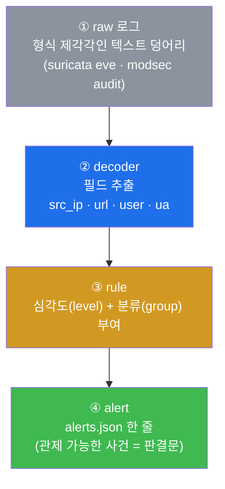
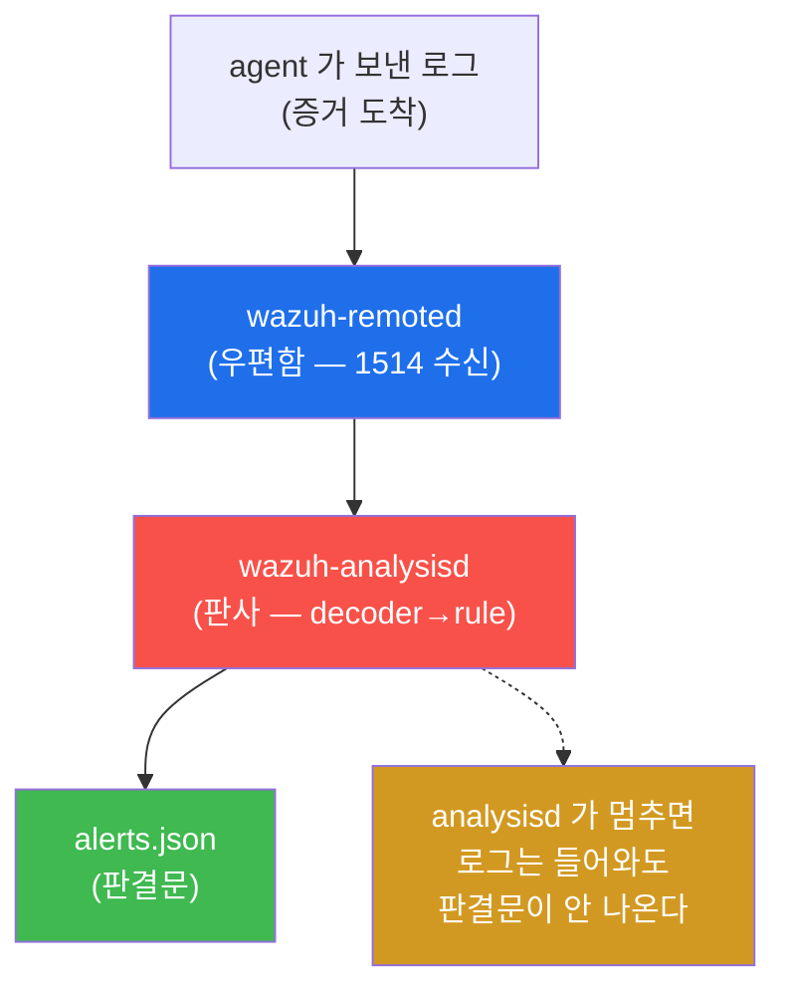
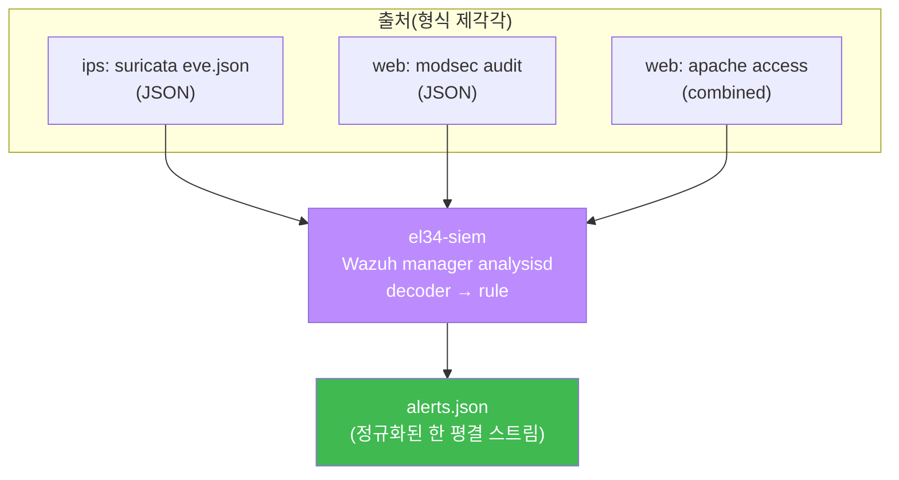
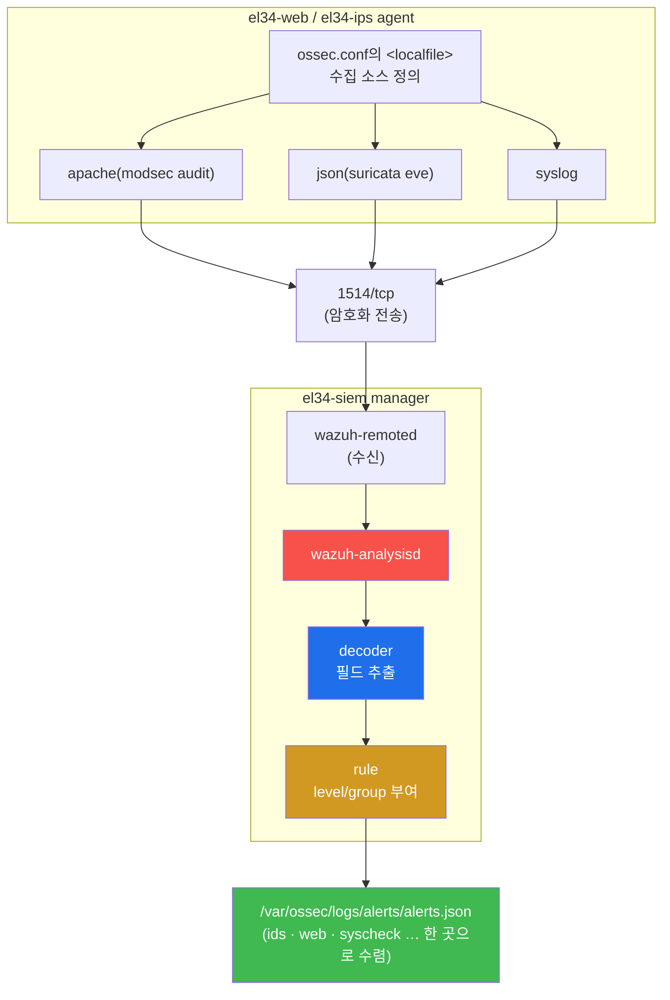

# Week 09 — SIEM의 두뇌: Wazuh manager 가 흩어진 로그를 한 평결로 모으는 법

> **본 주차의 한 줄 요약**
>
> W08 중간고사에서 "공격 한 건의 5계층 흔적이 SIEM 한 곳으로 수렴한다"를 확인했다. 이번
> 주는 그 SIEM 의 **내부 — Wazuh manager** 로 들어간다. 핵심 질문은 하나다. "ips 의
> Suricata 로그와 web 의 ModSecurity 로그처럼 **형식이 제각각인 raw 텍스트** 가, 어떻게
> `alerts.json` 이라는 **정규화된 한 평결** 로 바뀌는가?" 답은 두 개의 부품 — **decoder**(필드
> 추출) 와 **rule**(심각도 부여) — 이며, 이 둘을 돌리는 daemon 이 **analysisd**(manager 의
> 심장) 다. 학생은 `wazuh-logtest` 로 이 변환을 한 줄씩 분해하고, `local_rules.xml` 에 직접
> 커스텀 룰을 써서 특정 위협을 상위 레벨로 격상해 본다.
>
> **운영자 한 줄 결론**: SIEM 은 로그를 "모으는 창고" 가 아니라 "판결하는 법원" 이다. raw
> 로그는 증거이고, decoder 는 증거 정리, rule 은 양형 기준, alert 는 판결문이다. 판결이
> 나와야 비로소 "관제" 가 된다.

---

## 학습 목표

본 주차 종료 시 학생은 다음 6가지를 **본인 손으로** 할 수 있어야 한다.

1. raw 로그 → decoder → rule → alert 의 **평결 파이프라인** 4단계를 도식 없이 1분 안에
   설명하고, 각 단계가 어느 파일·어느 daemon 에서 일어나는지 짚는다.
2. el34-siem 의 Wazuh manager daemon 들 중 **analysisd 가 심장(평결 엔진)** 인 이유를
   설명하고, `wazuh-control status` / `agent_control -l` 로 가용성을 30초에 점검한다.
3. **`wazuh-logtest`** 에 로그 한 줄을 넣어 **Phase 1(pre-decode) → Phase 2(decode) →
   Phase 3(rule)** 3단계를 읽고, 어떤 decoder 가 어떤 필드를 뽑아 어떤 rule id·level 로
   판결되는지 추적한다(sshd 인증실패 → rule **5760**).
4. **`local_rules.xml`** 에 커스텀 룰(id **100909**, level 11)을 직접 작성해 특정 JSON
   필드를 상위 레벨로 **격상(escalation)** 하고, **라이브 manager 를 재시작하지 않고**
   `wazuh-logtest` 만으로 발화를 검증한다(공유 인프라 무중단).
5. 외부 공격자의 SQLi 를 재현해 ips(Suricata) → manager → `alerts.json` 의 **ids 그룹** 으로
   ingest 되는 전 과정을 추적하고, 출처 IP(10.20.30.202)가 그대로 **보존** 됨을 확인한다.
6. agent 의 `ossec.conf` `<localfile>` 이 manager 의 가시성의 출발점임을 이해하고, 두
   소스(ids + syscheck 등)가 한 `alerts.json` 으로 수렴함을 데이터로 증명한 뒤, 커스텀 룰
   잔재를 정리해 **베이스를 보존** 한다.

---

## 0. 용어 해설 (Wazuh manager 운영 입문)

이번 주에 처음 등장하거나 의미를 정확히 해야 하는 용어를 먼저 모아 둔다. 본문에서 다시
나올 때 막히면 이 표로 돌아오면 된다.

| 용어 | 영문 | 뜻 | 비유 |
|------|------|----|------|
| **SIEM** | Security Information & Event Management | 다소스 로그 통합 수집·정규화·상관·알림 | 관제실(여러 CCTV 를 한 화면으로) |
| **Wazuh manager** | — | el34 의 SIEM 서버 본체(`el34-siem`) — 로그를 받아 평결한다 | 법원 |
| **agent** | Wazuh agent | 각 컨테이너에 설치돼 로그를 manager 로 보내는 수집기 | 증거를 보내는 현장 수사관 |
| **daemon** | — | 백그라운드에서 도는 상주 프로세스 | 부서별 상근 직원 |
| **analysisd** | wazuh-analysisd | decoder→rule 을 돌려 평결을 만드는 핵심 daemon | 판사 |
| **remoted** | wazuh-remoted | agent 통신(1514/1515)을 수신하는 daemon | 우편함 |
| **logcollector** | wazuh-logcollector | 로컬 로그를 읽어 들이는 daemon | 수집원 |
| **decoder** | — | raw 텍스트에서 필드(src_ip, url, user…)를 뽑는 규칙 | 증거 정리원 |
| **rule** | — | 추출된 필드를 조건으로 심각도(level)와 분류(group)를 매기는 규칙 | 양형 기준 |
| **alert** | — | decoder+rule 을 거쳐 나온 정규화된 한 평결(`alerts.json` 한 줄) | 판결문 |
| **alerts.json** | — | manager 의 최종 출력 파일(JSON 라인) | 판결문 보관소 |
| **level** | — | rule 이 부여하는 0(무시)~16(치명) 의 심각도 | 형량 |
| **group** | — | rule 의 분류 태그(`web`/`ids`/`syscheck` 등) | 사건 종류 |
| **escalation** | 격상 | 평범한 레벨의 로그를 더 높은 레벨로 끌어올리는 것 | 경범죄→중범죄 재분류 |
| **체이닝** | rule chaining | 기존 rule/group 뒤에 맥락을 더해 격상하는 rule 연결 | 누범 가중 |
| **wazuh-logtest** | — | 로그 한 줄을 넣어 decoder/rule 매치를 안전하게 디버그하는 도구 | 모의재판 |
| **local_rules.xml** | — | 운영자가 직접 쓰는 커스텀 rule 파일 | 법원의 자체 판례집 |
| **ossec.conf** | — | agent/manager 의 설정 파일(수집 소스 정의 포함) | 수사관 업무 지침서 |
| **localfile** | `<localfile>` | agent 가 어떤 로그를 수집할지 정의하는 ossec.conf 항목 | 수집 대상 목록 |
| **log_format** | — | localfile 의 로그 형식(apache/json/syslog) — decoder 선택의 1차 힌트 | 증거의 종류 |
| **ingest** | — | 로그가 agent→manager→alerts.json 까지 흘러 들어가는 것 | 증거 접수 |
| **decoded_as** | — | "이 decoder 가 잡은 로그만" 을 뜻하는 rule 조건 | 특정 증거 정리원 담당분만 |
| **MITRE ATT&CK** | — | 공격 전술·기법 분류 체계(예: T1110=Brute Force) | 범죄 유형 표준 코드 |

---

## 0.5 핵심 개념 — "SIEM 은 창고가 아니라 법원이다"

위 용어 표는 한 줄 정의라서 신입생이 그림을 그리기엔 부족하다. 본 절에서는 W09 의 가장
중요한 직관 세 가지를 일상 비유로 풀어 둔다. 이 세 비유가 W09 전체를 관통한다.

### 0.5.1 평결 파이프라인 — 법원의 4단계 비유

학생이 어떤 사건의 재판을 방청한다고 하자. 법원에서 판결이 나오기까지는 네 단계를 거친다.

1. **증거 더미 도착.** 현장에서 압수한 서류 뭉치, CCTV 영상, 진술서가 정리되지 않은 채
   법원에 도착한다. 그 자체로는 "누가 무엇을 했다" 가 한눈에 안 보인다.
2. **증거 정리원이 항목을 뽑는다.** 정리원이 서류에서 "가해자 = 누구", "시각 = 몇 시",
   "장소 = 어디" 같은 **핵심 항목** 을 표로 정리한다.
3. **판사가 양형 기준을 적용한다.** 정리된 항목을 보고 "이건 경범죄(낮은 형량)", "이건
   중범죄(높은 형량)" 라고 **심각도** 를 매기고, 사건 종류(폭행/절도/사기)로 분류한다.
4. **판결문이 나온다.** "피고는 절도죄, 형량 3년" 처럼 **정규화된 한 문장** 으로 결론이
   기록되고 보관소에 들어간다.

이 네 단계가 Wazuh manager 안에서 그대로 일어난다.

| 법원 비유 | Wazuh manager |
|-----------|----------------|
| ① 정리 안 된 증거 더미 | **raw 로그** (Suricata eve.json, ModSec audit log 등 형식 제각각) |
| ② 증거 정리원의 항목 추출 | **decoder** (src_ip, url, user 같은 필드 추출) |
| ③ 판사의 양형·분류 | **rule** (level 0~16 + group 부여) |
| ④ 정규화된 판결문 | **alert** (`alerts.json` 한 줄) |

핵심 통찰은 이것이다. raw 로그는 "증거" 일 뿐 "판결" 이 아니다. **decoder 가 필드를 뽑고
rule 이 심각도를 매겨야 비로소 관제 가능한 사건(alert)** 이 된다. 같은 "sqlmap" 이라는
글자가 텍스트 덩어리로 있을 때는 쓸모가 적지만, decoder 가 `http.user_agent: sqlmap` 으로
뽑고 rule 이 "level 11, group=ids" 로 판결하면 대시보드에서 즉시 검색·집계·알림이 된다.



### 0.5.2 analysisd — 판사 한 명이 멈추면 법원 전체가 멈춘다

법원에는 우편물 담당, 서류 보관 담당, 경비 등 여러 직원이 있다. 하지만 **판결을 내리는
사람은 판사** 다. 우편물이 아무리 잘 와도, 보관소가 아무리 깨끗해도, 판사가 자리를 비우면
판결문은 한 장도 나오지 않는다.

Wazuh manager 도 여러 daemon(상근 직원)으로 돌지만, **decoder→rule 을 돌려 평결을 만드는
판사는 `analysisd` 단 하나** 다. 그래서 운영자가 "alert 가 갑자기 안 보인다" 고 할 때
가장 먼저 확인하는 것이 `analysisd is running` 이다. 로그(증거)는 계속 들어오는데
(remoted=우편함이 살아 있으면) 판결문(alert)만 안 나온다면 십중팔구 analysisd 가 죽은
것이다.



### 0.5.3 wazuh-logtest — 라이브 법정을 건드리지 않는 모의재판

운영자가 새 양형 기준(커스텀 rule)을 만들었다고 하자. 그 기준이 제대로 작동하는지
확인하려고 **진행 중인 진짜 재판에 끼워 넣어 보는 것은 위험** 하다. 잘못 만든 기준이
법원 전체(라이브 analysisd)를 마비시킬 수 있기 때문이다.

그래서 Wazuh 는 **`wazuh-logtest`** 라는 모의재판 도구를 둔다. 이 도구는 **현재 룰셋을
새로 읽어 별도의 테스트 인스턴스에서** 로그 한 줄을 판결해 본다. 라이브 analysisd 는 전혀
건드리지 않는다. 그래서 여러 학생이 공유하는 el34-siem 에서도 **안전하게** decoder/rule 을
검증할 수 있다. 본 주차에서 커스텀 룰을 만들 때 `wazuh-control restart`(법원 재가동) 대신
`wazuh-logtest`(모의재판) 만 쓰는 이유가 이것이다.

> **el34 공유 인프라 수칙(반드시 지킬 것).** el34-siem 은 모든 학생이 함께 쓰는 단일
> manager 다. 커스텀 룰은 **logtest 로만 검증** 하고, 끝나면 **그룹째 삭제** 해 베이스
> `local_rules.xml` 을 원상복구한다. 라이브 manager 를 재시작하면 다른 학생의 ingest 가
> 끊긴다.

---

## 1. 왜 raw 로그는 그대로는 쓸모가 적은가

### 1.1 한 줄 답: 형식이 제각각이라 "검색·집계·알림" 이 안 되기 때문

W01~W08 에서 학생은 네 종류의 로그를 직접 봤다. 그런데 이들은 **형식이 전부 다르다.**

| 출처 | 로그 파일 | 형식 | 한 줄 모양(요약) |
|------|-----------|------|------------------|
| fw | conntrack | 텍스트 | `tcp 6 ... src=10.20.30.202 dst=...` |
| ips | `/var/log/suricata/eve.json` | JSON | `{"event_type":"alert","src_ip":"...","alert":{...}}` |
| web (access) | `/var/log/apache2/dvwa_access.log` | combined | `10.20.30.202 - - [..] "GET /?id=..." 403` |
| web (WAF) | `/var/log/apache2/modsec_audit.log` | JSON | `{"transaction":{...},"response":{...}}` |

이 상태로는 "어제 10.20.30.202 가 일으킨 모든 사건을 심각도순으로 보여줘" 같은 질의가
불가능하다. 출처마다 IP 가 적힌 위치도, 필드 이름도 다르기 때문이다. **SIEM 의 존재
이유** 가 바로 이 이질성을 없애는 것 — 어떤 출처의 로그든 같은 스키마(`alerts.json`)로
정규화해 검색·집계·상관·알림을 가능케 한다.

### 1.2 왜 중요한가 — 관제는 "판결" 위에서만 돈다

대시보드 그래프, 알림, 상관 분석, MITRE ATT&CK 매핑 — 관제의 모든 기능은 **정규화된
alert** 위에서 동작한다. raw 로그 위에서는 돌지 않는다. 그래서 SIEM 운영의 80% 는 "어떻게
하면 raw 로그가 정확한 필드로 추출되고(decoder) 적절한 심각도로 판결되게(rule) 하는가" 다.
이것이 바로 이번 주의 주제다.

### 1.3 el34 에서 어떻게 — manager 가 변환을 전담

el34 에서 이 변환을 하는 단 한 곳이 **`el34-siem` 컨테이너의 Wazuh manager 4.10** 이다.
ips·web agent 가 raw 로그를 1514 포트로 올려 보내면, manager 의 analysisd 가 decoder→rule
을 돌려 `/var/ossec/logs/alerts/alerts.json` 한 곳으로 판결을 모은다.



### 1.4 한계 — decoder/rule 이 없으면 raw 만 쌓인다

SIEM 을 설치만 한다고 관제가 되는 게 아니다. 어떤 로그에 대해 decoder 가 없으면 필드가
안 뽑히고, rule 이 없으면 평결이 안 난다. el34 의 Wazuh 는 sshd·Suricata·Apache 등 흔한
소스의 decoder/rule 을 기본 내장하지만, **특정 위협을 상위 레벨로 격상** 하려면 운영자가
직접 `local_rules.xml` 을 써야 한다(§6). "기본값으로 다 잡힐 것" 이라는 가정이 alert
fatigue(과다 경보) 와 미탐지의 출발점이다.

---

## 2. Wazuh manager 4.10 의 구조 — 여러 daemon, 그중 심장은 analysisd

### 2.1 한 줄 정의 — manager 는 여러 상주 daemon 의 협업체

Wazuh manager 는 단일 프로그램이 아니라 역할이 다른 여러 **daemon**(백그라운드 상주
프로세스)의 묶음이다. 운영자가 외울 것은 전체가 아니라 "어느 daemon 이 무슨 역할인가" 다.

| daemon | 역할 | 비유 | 멈추면? |
|--------|------|------|---------|
| **wazuh-analysisd** | decoder→rule 엔진 (평결 생성) | **판사** | alert 가 안 나온다 |
| **wazuh-remoted** | agent 통신(1514 수신/1515 등록) | 우편함 | agent 로그가 안 들어온다 |
| **wazuh-logcollector** | 로컬 로그 수집 | 수집원 | manager 자체 로그가 누락 |
| **wazuh-db** | agent 상태/FIM DB | 장부 | 상태 조회가 깨진다 |
| **wazuh-syscheckd** | FIM(파일 무결성) | 금고 CCTV | 파일 변조 탐지 누락 |
| **wazuh-monitord / execd** | 모니터 / active-response 실행 | 보조 | 자동 대응 불가 |
| **wazuh-apid** | REST API(55000) | 민원 창구 | API 조회 불가 |

> **el34 사실.** el34-siem 의 manager 는 4.10.0 이며, 16개 daemon 정의 중 단일 노드
> 구성에 필요한 약 11개가 default-on 으로 돈다(clusterd/maild/csyslogd 등은 default-off).
> 활성 agent 는 **`000`(manager 자신) / `003`(ips) / `004`(web)** 세 개이고, 이 중
> ips·web 두 agent 가 두 ingest 소스다.

### 2.2 왜 analysisd 가 심장인가

§0.5.2 의 판사 비유 그대로다. remoted(우편함)가 살아 있어 로그가 계속 들어와도, analysisd
가 멈추면 decoder/rule 이 돌지 않아 **`alerts.json` 에 새 줄이 한 줄도 안 생긴다.** 그래서
SIEM 가용성 점검의 1순위가 `analysisd is running` 이다. 반대로 alert 는 나오는데 특정
agent 만 안 보이면 그건 analysisd(공통)가 아니라 remoted 와 해당 agent 통신의 문제다.

### 2.3 el34 에서 어떻게 — 두 명령으로 30초 점검

```bash
# el34 호스트(ssh ccc@192.168.0.80)에서
docker exec el34-siem /var/ossec/bin/wazuh-control status    # daemon 상태
docker exec el34-siem /var/ossec/bin/agent_control -l        # 등록 agent 목록
```

`wazuh-control status` 출력에서 `wazuh-analysisd is running` 과 `wazuh-remoted is running`
두 줄이 핵심이다. `agent_control -l` 출력에서 `ips` 와 `web` 이 모두 `Active` 면 두 소스가
살아 있는 것이고, `Disconnected`/`Never connected` 면 해당 agent 컨테이너의 `wazuh-agentd`
를 점검해야 한다.

### 2.4 한계 — daemon 은 살아도 룰이 비면 평결은 빈약하다

daemon 이 전부 running 이어도, 해당 로그를 잡는 decoder/rule 이 없으면 평결은 빈약하다.
즉 "프로세스 가용성" 과 "탐지 품질" 은 별개다. §4~§6 에서 그 품질을 다룬다.

---

## 3. 데이터 흐름 — agent 의 한 줄이 alerts.json 이 되기까지

### 3.1 전체 경로

agent 가 보낸 raw 로그 한 줄이 manager 안에서 어떤 부품을 거쳐 판결문이 되는지 따라가 보자.



### 3.2 두 ingest 소스가 한 곳으로 수렴한다

el34 의 두 활성 agent 가 서로 다른 소스를 올린다.

- **web agent** — `apache`(ModSec audit log) + `json` + `syslog` 를 수집한다. 웹 공격
  흔적이 여기서 온다.
- **ips agent** — `json`(Suricata eve.json) + `syslog` 를 수집한다. 네트워크 탐지가 여기서
  온다.

이 둘이 같은 manager 로 올라가 **같은 `alerts.json`** 으로 합쳐진다. 이것이 "SIEM = 통합
가시성" 의 실체다. el34 의 `alerts.json` 실제 그룹 분포는 보통 `ids/suricata`(네트워크)가
다수이고, 여기에 `syscheck`(FIM, 파일 변조) + `pam`/`sudo`(인증) + `sca`(보안 설정 점검)가
섞여 들어온다.

### 3.3 한계 — 수집(localfile)에서 빠진 계층은 SIEM 에서 사라진다

manager 가 받는 로그는 전적으로 agent 의 `<localfile>` 에 달려 있다(§8). 어떤 소스를
localfile 에서 빼면, 그 계층은 아무리 manager 가 멀쩡해도 **SIEM 화면에서 통째로
사라진다.** 그래서 가시성 점검은 "manager 가 사는가" 가 아니라 "agent 가 무엇을
수집하는가" 에서 출발한다.

---

## 4. decoder — raw 를 필드로 바꾸는 첫 단계

### 4.1 한 줄 정의 — decoder 는 텍스트에서 항목을 뽑는 규칙

**decoder** 는 raw 로그 한 줄에서 의미 있는 필드(`src_ip`, `url`, `user`, `program` 등)를
뽑아내는 파싱 규칙이다. §0.5.1 의 "증거 정리원" 이다. 필드가 뽑혀야 그 다음 rule 이 그
필드를 조건으로 판결할 수 있다.

### 4.2 왜 중요한가 — 필드가 없으면 rule 이 판단할 근거가 없다

rule 은 "src_ip 가 외부이고 user_agent 가 sqlmap 이면 level 11" 처럼 **필드를 조건으로**
동작한다. decoder 가 그 필드를 안 뽑으면 rule 은 비교할 대상이 없어 발화하지 못한다. 즉
탐지 실패의 절반은 rule 이 아니라 decoder 단계에서 일어난다.

### 4.3 el34 에서 어떻게 — wazuh-logtest 3 phase 로 분해

decoder 가 무엇을 뽑는지 눈으로 보려면 **`wazuh-logtest`** 에 로그 한 줄을 표준입력으로
넣는다. 출력은 정확히 세 단계(phase)로 나뉜다.

```bash
echo 'Jan  1 00:00:00 web sshd[1]: Failed password for root from 9.9.9.9 port 22 ssh2' \
  | docker exec -i el34-siem /var/ossec/bin/wazuh-logtest
```

| Phase | 이름 | 하는 일 | 이 예에서 보이는 것 |
|-------|------|---------|---------------------|
| **Phase 1** | pre-decoding | 공통 헤더 분해(시각/호스트/프로그램) | `program_name: sshd` |
| **Phase 2** | decoding | decoder 매치 + 필드 추출 | `decoder: 'sshd'`, `srcip: 9.9.9.9`, `dstuser: root` |
| **Phase 3** | filtering (rules) | 매치된 rule id + level | `id: 5760`, sshd 인증실패, MITRE **T1110(Brute Force)** |

핵심은 Phase 2 와 Phase 3 의 구분이다. **Phase 2 = "무엇을 뽑았나"(decoder), Phase 3 =
"어떻게 판결했나"(rule).** 이 예에서 sshd decoder 가 출처 IP 와 사용자를 뽑고(Phase 2),
rule **5760**(SSHD 인증 실패)이 매치돼 level 이 부여된다(Phase 3). raw→필드→평결의 앞
두 단계가 한 명령에 다 보인다.

> **JSON 로그는 어떻게?** Suricata eve.json·ModSec audit 처럼 이미 JSON 인 로그는 별도
> 전용 decoder 대신 **`json` decoder** 가 잡아서 JSON 의 키를 그대로 필드로 만든다. 그래서
> `{"src_ip":"...","http":{...}}` 같은 줄을 넣으면 키 이름이 곧 필드 이름이 된다(§6 의
> 커스텀 룰이 이 점을 이용한다).

### 4.4 한계 — logtest 는 한 줄 단위, 빈도 기반 룰은 별도

`wazuh-logtest` 는 한 줄을 넣어 그 줄이 어떻게 판결되는지 본다. 따라서 "60초에 5회
이상이면 격상" 같은 **빈도/누적 기반(frequency) 룰** 은 한 줄로는 완전히 재현되지 않는다.
그런 룰의 검증은 실제 ingest(§5)로 확인한다.

---

## 5. rule — 심각도와 맥락을 부여하는 둘째 단계

### 5.1 한 줄 정의 — rule 은 필드를 조건으로 level 과 group 을 매긴다

**rule** 은 decoder 가 뽑은 필드를 조건으로 **level(0~16)** 과 **group**(분류 태그)을
부여하는 규칙이다. §0.5.1 의 "판사의 양형·분류" 다. rule 은 XML 로 기술된다.

```xml
<rule id="100909" level="11">
  <decoded_as>json</decoded_as>        <!-- ① json decoder가 잡은 로그만 대상 -->
  <field name="eduw09">FIREME</field>  <!-- ② eduw09 필드 값이 FIREME 인 경우 -->
  <description>EDU W09 - JSON marker escalated</description>
</rule>
```

각 줄의 의미:

- `id="100909" level="11"` — 이 rule 의 고유 번호와 형량. level 11 은 고위험에 해당한다.
- `<decoded_as>json</decoded_as>` — "json decoder 가 파싱한 로그만" 으로 대상을 좁힌다.
- `<field name="eduw09">FIREME</field>` — 그 로그의 `eduw09` 필드 값이 `FIREME` 일 때만
  매치한다.
- `<description>` — 판결문에 적히는 사람이 읽는 설명.

### 5.2 level 과 group 의 뜻

- **level(0~16)** — 사건의 심각도. **0 은 무시(로깅 억제)**, 보통 **7 이상이
  `alerts.json` 에 기록** 되며, **12 이상은 고위험** 으로 본다. level 이 곧 운영자가
  우선순위를 정하는 기준이다.
- **group** — `web` / `ids` / `syscheck` / `authentication` 같은 분류 태그. 대시보드에서
  필터·집계의 단위이고, 다른 rule 이 "이 group 뒤에" 라고 맥락을 거는 기준이 된다.

### 5.3 체이닝 — 기존 탐지에 맥락을 더해 격상한다

rule 의 강력한 기능이 **체이닝(chaining)** 이다. 이미 발화한 rule/group 뒤에 조건을 더
걸어 더 높은 level 로 끌어올린다.

- `<if_sid>5710</if_sid>` — 특정 rule(5710) 이 먼저 매치된 뒤에만 발화. (예: "존재하지 않는
  사용자 로그인" 뒤에)
- `<if_group>web|ids</if_group>` — 특정 group 의 탐지 뒤에 발화. (예: web/ids 탐지 뒤에
  맥락을 더해)
- `frequency="5" timeframe="60"` + `<same_source_ip/>` — "같은 출처에서 60초에 5회 이상"
  이면 누범 가중처럼 격상.

체이닝의 목적은 단순 탐지(낮은 level)를 **맥락이 있는 고위험 사건(높은 level)** 으로
승격해 운영자의 주목을 끄는 것이다.

### 5.4 한계 — 잘못된 격상은 alert fatigue 를 부른다

모든 것을 높은 level 로 격상하면 고위험 알림이 분당 수천 건 쏟아져 정작 중요한 것을 놓친다
(alert fatigue). 격상은 "정말 중요한 소수" 에만 적용하는 게 운영 기술이다.

---

## 6. 커스텀 룰 — local_rules.xml 로 직접 격상하기

### 6.1 한 줄 정의 — 운영자의 자체 판례집

기본 룰(Wazuh 내장 + Suricata/CRS 디코딩)은 흔한 위협을 평범한 level 로 잡는다. 운영자가
**자기 환경에서만 중요한 위협** 을 상위 level 로 격상하려면 **`local_rules.xml`** 에
커스텀 rule 을 쓴다. 위치는 `/var/ossec/etc/rules/local_rules.xml` 이다.

### 6.2 왜 중요한가 — 기본값은 "내 환경의 우선순위" 를 모른다

예컨대 어떤 조직에선 govportal 의 특정 페이로드가 결정적 위협이지만, Wazuh 기본 룰은 그걸
평범한 web 4xx 로만 본다. 운영자가 local_rules.xml 로 그 패턴을 level 12 로 격상해야
대시보드 최상단에 뜬다. **탐지를 "내 환경의 우선순위" 에 맞추는 것이 커스텀 룰의 본질** 이다.

### 6.3 el34 에서 어떻게 — id 100909 격상 + logtest 검증 + self-clean

본 트랙의 표준 절차는 (1) 백업 → (2) 커스텀 룰 추가 → (3) **라이브 재시작 없이
wazuh-logtest 로 발화 검증** → (4) 원복(self-clean) 이다.

```bash
# (1) 백업
sudo cp /var/ossec/etc/rules/local_rules.xml /tmp/w09_lr.bak

# (2) 커스텀 룰 추가 — id 네임스페이스: 본 트랙 training = 1009xx
sudo bash -c 'cat >> /var/ossec/etc/rules/local_rules.xml <<EOF
<group name="edu_w09,">
  <rule id="100909" level="11">
    <decoded_as>json</decoded_as>
    <field name="eduw09">FIREME</field>
    <description>EDU W09 - JSON marker escalated</description>
  </rule>
</group>
EOF'

# (3) 발화 검증 — 라이브 manager 무중단(모의재판)
echo '{"eduw09":"FIREME","src_ip":"9.9.9.9"}' | sudo /var/ossec/bin/wazuh-logtest
#   → Phase 3: id 100909, level 11, "Alert to be generated."

# (4) self-clean — 베이스 원상복구
sudo cp /tmp/w09_lr.bak /var/ossec/etc/rules/local_rules.xml; sudo rm -f /tmp/w09_lr.bak
```

이 룰이 하는 일: json decoder 가 잡은 로그 중 `eduw09` 필드 값이 `FIREME` 인 것을 level
11 로 격상한다. `wazuh-logtest` 가 룰셋을 새로 읽어 테스트 인스턴스에서 돌리므로 라이브
analysisd 는 건드리지 않는다(§0.5.3).

### 6.4 한계와 안전 수칙 — id 충돌 금지 · XML 문법 · 공유 보존

- **id 네임스페이스.** **100000 미만은 Wazuh 예약** 이라 사용 금지다. 본 트랙은
  `1009xx`(예: 100909)로 격리하고 끝나면 그룹째 삭제한다.
- **라이브 반영의 조건.** 실제 운영 적용은 `wazuh-control restart` 가 필요하지만, 공유
  el34 에서는 **logtest 검증만** 하고 끝나면 룰을 지운다.
- **XML 문법 주의.** local_rules.xml 에 문법 오류가 있으면 analysisd 가 룰셋 로딩에
  실패한다. `wazuh-logtest` 는 시작 시 룰셋 로드 에러를 보여주므로, 검증 단계에서 문법
  오류를 먼저 잡을 수 있다.
- **공유 인프라 보존.** 끝나면 반드시 cp 복원으로 베이스 `local_rules.xml` 을 원래대로
  되돌린다. 잔재가 남으면 다른 학생의 평결에 영향을 준다.

---

## 7. 두 소스가 한 평결로 — ingest 추적과 출처 보존

### 7.1 한 줄 정의 — ingest 는 로그가 alerts.json 까지 흘러드는 것

**ingest** 는 공격 → agent 수집 → 1514 전송 → analysisd 판결 → `alerts.json` 기록까지의
전 과정이다. 운영자는 공격을 재현한 뒤 이 파이프라인이 실제로 도는지, 그리고 **출처 IP 가
보존되는지** 를 추적한다.

### 7.2 왜 중요한가 — 출처 보존이 상관 분석의 전제

여러 계층의 흔적을 한 사건으로 묶으려면 공통 키가 필요한데, 그 핵심이 **출처 IP** 다. 만약
fw 가 SNAT(출처 IP 를 게이트웨이 IP 로 바꿈)를 하면 web·siem 에서 공격자 IP 가 사라져
상관이 깨진다. **el34 는 fw 가 SNAT 하지 않아 출처 IP(내부 공격자 10.20.30.202, 외부 공격자
192.168.0.202)가 ips·web·siem 전 계층에 그대로 보존** 된다. 이것이 W08 의 5계층 상관과
이번 주 SIEM 이 자연스럽게 이어지는 이유다.

### 7.3 el34 에서 어떻게 — SQLi 재현 → alerts.json ids 그룹

```bash
# 웹공격 재현(외부 공격자 SQLi) → suricata eve + modsec 두 소스 발생
docker exec el34-attacker sh -c 'curl -s -A sqlmap/1.7 -H "Host: dvwa.el34.lab" \
  "http://10.20.30.1/?id=1%27%20UNION%20SELECT%201,2--%20-"'
sleep 8
# alerts.json 에 ids 그룹 경보(출처 보존) 적재 확인
docker exec el34-siem sh -c 'tail -300 /var/ossec/logs/alerts/alerts.json \
  | jq -c "select(.rule.groups|index(\"ids\"))|{r:.rule.id,d:.rule.description,s:.data.src_ip}" | tail -2'
#   → {"r":"86601","d":"Suricata: ... UNION SELECT","s":"10.20.30.202"}
```

흐름: 공격 → Suricata 가 eve.json 에 기록 → ips agent 가 `json` 으로 수집 → 1514 →
remoted → analysisd 의 decoder/rule → `alerts.json` 의 **ids 그룹**(여기선 Suricata 디코딩
rule 86601). 출력의 `s:"10.20.30.202"` 가 **출처가 보존됐다는 증거** 다. `sleep 8` 은
공격이 eve.json 을 거쳐 alerts.json 에 반영되기까지의 파이프라인 지연을 기다리는 것이다.

### 7.4 한계 — 기본 ModSec 디코딩은 941/942 를 고레벨로 격상하지 않는다

el34 의 기본 Wazuh decoder 는 ModSec audit log 를 일반 Apache 4xx 정도로만 보는 경우가
많아, 941(XSS)/942(SQLi) 같은 CRS 룰 매치를 곧장 level 12 로 격상하지는 않는다. 이 gap 을
메우는 것이 바로 §6 의 커스텀 룰이며, 이는 Purple Team 의 표준 산출물(미탐지 발견 → 룰
추가)이다.

---

## 8. agent 는 무엇을 수집하나 — ossec.conf 의 localfile

### 8.1 한 줄 정의 — localfile 이 manager 가 받을 로그를 결정한다

manager 가 판결하는 모든 로그는 agent 가 보낸 것이다. agent 의
`/var/ossec/etc/ossec.conf`(또는 중앙배포용 `agent.conf`)의 **`<localfile>`** 항목이 "어떤
파일을, 어떤 형식으로 수집할지" 를 정의한다. **여기가 SIEM 가시성의 출발점** 이다.

### 8.2 왜 중요한가 — 빠진 소스는 통째로 사라진다

§3.3 에서 말했듯, localfile 에서 어떤 소스를 빼면 그 계층은 manager 가 멀쩡해도 SIEM 에서
사라진다. 그래서 "왜 web 공격이 대시보드에 안 보이지?" 의 첫 점검은 manager 가 아니라
**web agent 의 localfile 에 modsec audit 가 들어 있는가** 다.

### 8.3 el34 에서 어떻게 — log_format 으로 수집 소스 확인

```bash
docker exec el34-web sh -c 'grep -A1 localfile /var/ossec/etc/ossec.conf | grep log_format'
#  web agent: apache(modsec audit) · json · syslog · full_command
docker exec el34-ips sh -c 'grep -A1 localfile /var/ossec/etc/ossec.conf | grep log_format'
#  ips agent: json(suricata eve) · syslog · command
```

`<log_format>` 값(apache / json / syslog)이 **decoder 선택의 1차 힌트** 다. `apache` 면
Apache/ModSec 계열 decoder 가, `json` 이면 json decoder 가 잡는다. web 이 `apache`(ModSec
audit)를, ips 가 `json`(Suricata eve)을 수집하는 것이 el34 의 두 ingest 소스의 실체다.

### 8.4 한계 — 수집만으로는 끝이 아니다

localfile 에 소스가 있어도, 그 소스를 잡는 decoder/rule 이 없으면 raw 만 쌓일 뿐 평결은
안 난다. 수집(§8) → 디코딩(§4) → 판결(§5) 세 단계가 모두 맞아야 비로소 한 평결이 완성된다.

---

## 9. 실습 안내 (총 9 미션)

각 실습은 **4축 설명** 을 포함한다. 모든 명령은 el34 호스트(`ssh ccc@192.168.0.80`)에서
`docker exec el34-<comp>` 로 실행한다.

### 실습 1 — manager 의 심장(analysisd)이 뛰는가 (점검)

> **이 실습을 왜 하는가?**
> 평결 파이프라인의 전제는 판사(analysisd)가 살아 있는 것이다. analysisd 가 멈추면 로그가
> 들어와도 alert 가 안 난다(§2.2). 운영 인수 첫 30초의 점검이다.
>
> **이걸 하면 무엇을 알 수 있는가?**
> - `wazuh-control status` 로 analysisd/remoted/logcollector 의 running 여부
> - `agent_control -l` 로 활성 agent(000/003/004) 와 두 ingest 소스(ips/web)의 가용성
>
> **결과 해석**
> 정상: `wazuh-analysisd is running` + ips/web agent `Active`. 비정상: analysisd 가
> stopped 면 평결 자체가 멈춘 것 → 최우선 복구 대상. 특정 agent 만 Disconnected 면 그
> agent 컨테이너의 wazuh-agentd 점검.
>
> **실전 활용**
> SIEM 운영자가 매일 아침 1순위로 확인하는 헬스체크. dashboard 보다 빠르고 정확하다.

### 실습 2 — 여러 소스가 한 alerts.json 으로 (데이터 흐름)

> **이 실습을 왜 하는가?**
> "통합 가시성" 이 추상적 구호가 아니라 데이터로 존재함을 확인한다. manager 의 출력은
> `/var/ossec/logs/alerts/alerts.json` 한 곳이며(§3.2), 거기에 서로 다른 소스의 그룹이
> 섞여 있어야 정상이다.
>
> **이걸 하면 무엇을 알 수 있는가?**
> - `.rule.groups` 분포로 어떤 소스(ids/syscheck/pam 등)의 경보가 모였는지
> - 개별 로그가 아니라 정규화된 "한 평결 스트림" 의 의미
>
> **결과 해석**
> 정상: 그룹 분포에 `suricata`(ids) 등 복수 소스가 보인다. 한 그룹만 보이면 다른 계층의
> 수집/디코딩이 끊겼을 수 있다.
>
> **실전 활용**
> "우리 SIEM 이 정말 다계층을 보고 있나?" 를 1분에 답하는 점검. 한 소스만 있으면 가시성에
> 구멍이 있다는 신호다.

### 실습 3 — wazuh-logtest 3 phase 로 파싱 디버그 (decoder)

> **이 실습을 왜 하는가?**
> raw 가 평결이 되는 첫 단계(decoder)를 눈으로 본다. logtest 는 라이브를 안 건드리는
> 안전한 디버그 도구다(§0.5.3, §4.3).
>
> **이걸 하면 무엇을 알 수 있는가?**
> - Phase 1(pre-decode) / Phase 2(decoder·필드) / Phase 3(rule id·level)의 구분
> - sshd 한 줄이 sshd decoder 로 src/user 가 뽑히고 rule **5760**(T1110)으로 판결되는 과정
>
> **결과 해석**
> 정상: Phase 3 에 rule id `5760` 이 매치된다. Phase 2 에서 decoder 가 비면 필드 추출 실패
> → 그 로그는 rule 까지 못 간다.
>
> **실전 활용**
> 새 로그 소스를 붙일 때 "이게 제대로 파싱되나?" 를 라이브 영향 없이 확인하는 표준 방법.

### 실습 4 — local_rules.xml 커스텀 룰 격상 → logtest → self-clean (manipulation)

> **이 실습을 왜 하는가?**
> 탐지를 "내 환경의 우선순위" 에 맞추는 핵심 기술 — 특정 위협을 상위 level 로 격상하는
> 것을 직접 해본다(§6).
>
> **이걸 하면 무엇을 알 수 있는가?**
> - local_rules.xml 에 `decoded_as`/`field` 매치 룰(id 100909, level 11)을 쓰는 법
> - 라이브 재시작 없이 wazuh-logtest 로 발화를 검증하는 무중단 절차
> - 끝나면 cp 복원으로 베이스를 보존하는 self-clean
>
> **결과 해석**
> 정상: logtest Phase 3 에 rule `100909` level 11 이 "Alert to be generated" 로 발화하고,
> 정리 후 잔재가 0 이다.
>
> **실전 활용**
> Purple Team 의 표준 산출물. 미탐지를 발견하면 그 자리에서 격상 룰을 써서 가시성을
> 메운다. 단, 공유 인프라에선 logtest 검증 후 반드시 정리한다.

### 실습 5 — 웹공격이 alerts.json 까지 (ingest 추적, 출처 보존)

> **이 실습을 왜 하는가?**
> 파이프라인이 책상 위 이론이 아니라 실제로 도는지 공격 재현으로 증명한다(§7).
>
> **이걸 하면 무엇을 알 수 있는가?**
> - 외부 SQLi → Suricata eve → ips agent → manager → `alerts.json` ids 그룹의 전 경로
> - 출처 IP(10.20.30.202)가 전 계층에 보존됨 → W08 상관과 연결
>
> **결과 해석**
> 정상: alerts.json ids 그룹에 출처 `10.20.30.202` 의 최근 경보(rule 86601 등)가 적재된다.
> `sleep 8` 후에도 안 보이면 ips agent 수집 또는 analysisd 를 점검.
>
> **실전 활용**
> "탐지 파이프라인이 살아 있나?" 를 합성 공격으로 확인하는 detection validation 의 기본형.

### 실습 6 — agent 의 localfile 수집 소스 점검 (가시성의 출발점)

> **이 실습을 왜 하는가?**
> manager 가 받는 로그는 전적으로 agent 의 localfile 에 달려 있다(§8). 가시성의 출발점을
> 직접 확인한다.
>
> **이걸 하면 무엇을 알 수 있는가?**
> - web agent 가 `apache`(ModSec audit) 등을, ips agent 가 `json`(eve)을 수집함
> - `log_format` 이 decoder 선택의 1차 힌트라는 점
>
> **결과 해석**
> 정상: web agent localfile 에 `apache` 가 보인다. 빠져 있으면 그 계층(웹 WAF)이 SIEM 에서
> 사라진 것 → 가시성 구멍.
>
> **실전 활용**
> "왜 이 계층이 대시보드에 안 보이지?" 의 첫 점검은 manager 가 아니라 agent 의 localfile.

### 실습 7 — 두 소스 이상이 한 평결로 (수렴 확인)

> **이 실습을 왜 하는가?**
> 통합 관제의 핵심은 단일 도구가 아니라 다소스 수렴이다(§3.2). 이를 데이터로 확정한다.
>
> **이걸 하면 무엇을 알 수 있는가?**
> - alerts.json 에 네트워크(ids)와 호스트(syscheck/FIM 등)가 함께 들어 있음
> - W08 의 "5계층 수렴" 이 SIEM 데이터로 재확인됨
>
> **결과 해석**
> 정상: ids 외에 `syscheck`(FIM) 등 다른 소스도 함께 집계된다. ids 만 있으면 호스트 계층
> 수집이 끊긴 것일 수 있다.
>
> **실전 활용**
> 통합 가시성 점검 — 네트워크와 호스트가 한 스트림에 있어야 측면이동 같은 복합 공격을
> 잇는다.

### 실습 8 — raw → decoder → rule → alert 종합 보고서 (report)

> **이 실습을 왜 하는가?**
> 실습 1~7 을 평결 파이프라인 관점으로 묶어 운영 보고서 형태로 정리한다. "막았다" 가
> 아니라 "어느 단계에서 무엇을 봤다" 를 증거로 쓰는 훈련이다.
>
> **이걸 하면 무엇을 알 수 있는가?**
> - manager 심장(analysisd)+agent / 평결 파이프라인 / logtest+커스텀 룰 / ingest+수렴을
>   한 장으로 종합하는 법
>
> **결과 해석**
> 정상: 보고서에 raw→decoder→rule→alert 흐름과 커스텀 룰 격상(100909)이 포함된다.
>
> **실전 활용**
> 운영 인수인계·사고 보고의 기본 양식. 파이프라인 단계별로 증거를 배치하는 습관이 핵심.

### 실습 9 — 공유 manager 베이스 보존 (정리 확인)

> **이 실습을 왜 하는가?**
> el34-siem 은 공유 자원이다(§0.5.3, §6.4). 커스텀 룰 잔재가 남으면 다른 학생의 평결에
> 영향을 준다.
>
> **이걸 하면 무엇을 알 수 있는가?**
> - local_rules.xml 에 id 100909 / edu_w09 잔재가 0 인지
> - 백업 파일(/tmp/w09_lr.bak)이 정리됐고 라이브 manager 가 무중단인지
>
> **결과 해석**
> 정상: 100909/edu_w09 잔재 0 + `check done`. 잔재가 있으면 즉시 cp 복원으로 제거.
>
> **실전 활용**
> 공유 SIEM 운영의 기본 의무 — "내가 심은 것은 내가 정리한다". 라이브 룰셋과 베이스 파일을
> 항상 원래 상태로 되돌린다.

---

## 10. 핵심 정리 (1줄씩)

1. **SIEM 은 창고가 아니라 법원** — raw 로그(증거) → decoder(정리) → rule(양형) →
   alert(판결문). 판결이 나와야 관제가 된다.
2. **analysisd 가 심장** — 이 daemon 이 멈추면 로그는 들어와도 alert 가 안 난다. 가용성
   점검 1순위.
3. **wazuh-logtest = 3 phase 디버그** — Phase 2(decoder/필드) / Phase 3(rule id/level)을
   라이브 무중단으로 확인(sshd→5760).
4. **local_rules.xml = 격상의 실제** — id 1009xx 로 특정 위협을 상위 level 로. logtest 로만
   검증, 끝나면 그룹째 삭제.
5. **출처 보존** — el34 는 SNAT 하지 않아 공격자 IP 가 ips·web·siem 전 계층에 보존(ingest
   추적이 W08 상관과 직결).
6. **수집이 가시성의 출발점** — agent 의 `<localfile>` 에서 빠진 소스는 SIEM 에서 통째로
   사라진다.

---

## 11. 다음 주차 (W10) 예고 — 분석가의 조종석: Wazuh dashboard + active response

W09 에서 manager 가 평결(alert)을 **만드는** 법을 배웠다. W10 은 그 평결을 **한
화면(Wazuh dashboard)** 에서 보고, **FIM(파일 변조)** 을 잡아내며, **active response** 로
탐지에 자동으로 되받아치는 — 분석가의 조종석을 다룬다. 즉 W09 의 "판결 생성" 에서 W10 의
"판결을 보고 자동 대응" 으로 한 걸음 더 나아간다.

- **주제**: Wazuh dashboard 분석 + FIM(syscheckd) + active-response 자동 차단
- **실습 환경**: `el34-siem` + `el34-wazuh-dashboard` + agent(web)
- **핵심 도구**: Wazuh Web UI(`siem.el34.lab`), `syscheck`, `active-response`(firewall-drop)
- **선수 학습**: 본 주차 §2(daemon)·§5(rule level/group)·§7(ingest) 복습
