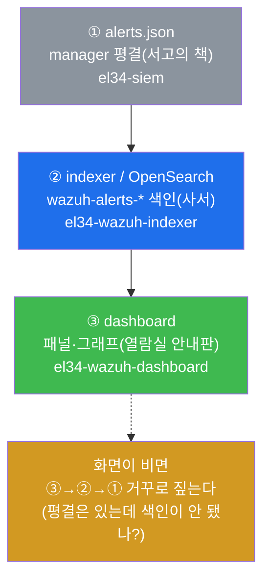
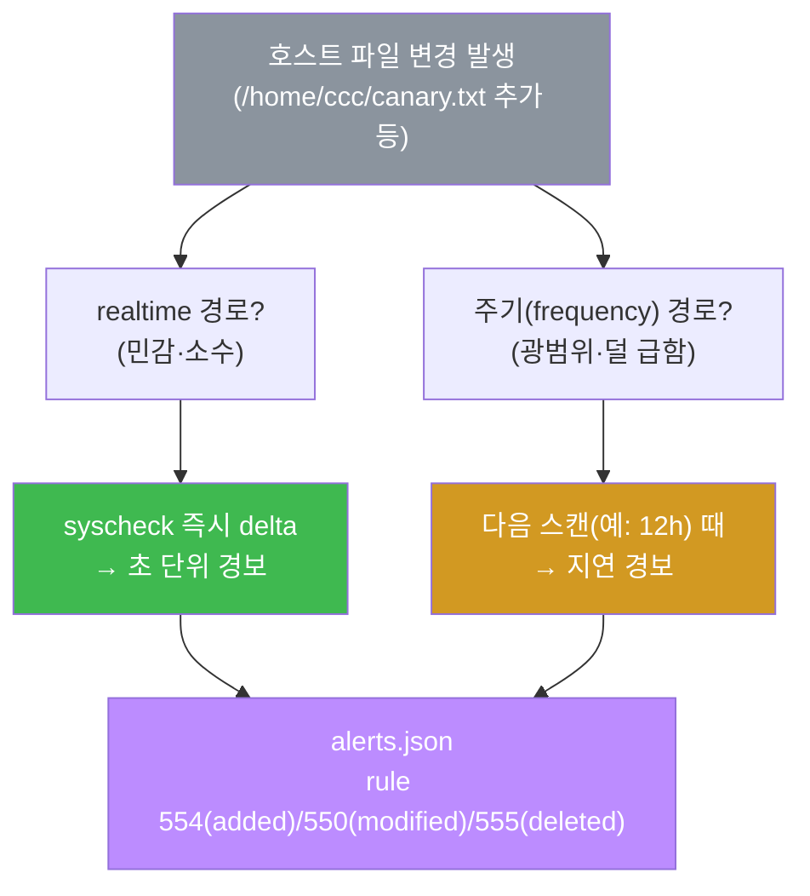
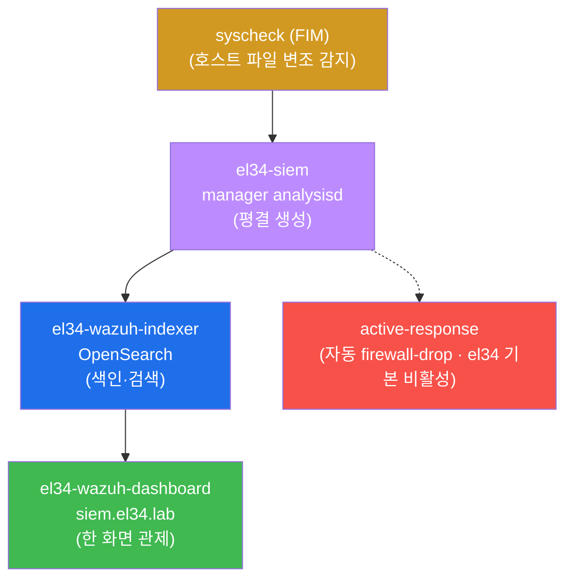
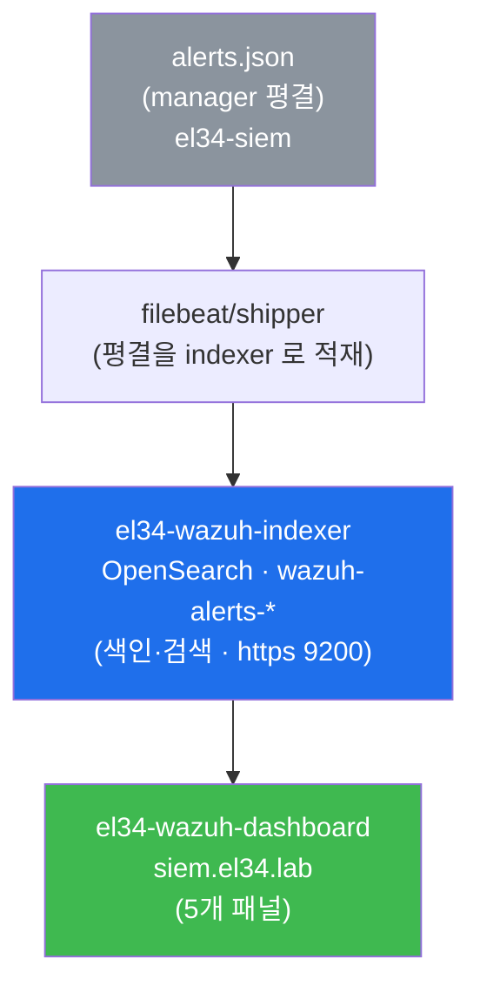

# Week 10 — 분석가의 조종석: Wazuh dashboard + FIM(파일 변조) + Active Response

> **본 주차의 한 줄 요약**
>
> W09 에서 manager 가 평결(`alerts.json`)을 **만드는** 법을 배웠다. 그런데 평결문이
> 보관소에 쌓이기만 해서는 관제가 아니다. 분석가는 그 평결을 **한 화면에서 읽고
> (dashboard), 네트워크가 못 보는 호스트의 파일 변조를 잡고(FIM), 고위험 사건엔 사람을
> 기다리지 않고 자동으로 되받아쳐야(Active Response)** 한다. 이번 주는 이 세 가지 —
> 분석가의 **조종석(cockpit)** 을 다룬다. 평결을 색인·검색 가능하게 만드는 부품이
> **indexer(OpenSearch)** 이고, 그 색인을 그림으로 그리는 부품이 **dashboard** 다.
> 변조 감시는 manager 의 한 daemon 인 **syscheck** 가, 자동 차단은 **active-response** 가
> 맡는다.
>
> **운영자 한 줄 결론**: 탐지(W01–W09)는 "무슨 일이 났는가" 까지다. 조종석은 거기에
> **"한눈에 보고(visualize) · 호스트 변조까지 잡고(FIM) · 손 안 대고 막는다(AR)"** 를
> 더해 탐지를 비로소 **운영**으로 바꾼다.

---

## 학습 목표

본 주차 종료 시 학생은 다음 6가지를 **본인 손으로** 할 수 있어야 한다.

1. `alerts.json`(평결) → indexer(색인) → dashboard(표시) 의 **가시화 파이프라인** 3단계를
   도식 없이 1분 안에 설명하고, 각 단계가 어느 컨테이너(`el34-siem` / `el34-wazuh-indexer`
   / `el34-wazuh-dashboard`)에서 일어나는지 짚는다.
2. dashboard 의 **5개 패널**(Overview / Agents / Modules / Discovery / Rules)이 각각 무엇을
   보여주는지 설명하고, 패널이 비었을 때 데이터 경로를 거꾸로 짚어 원인이 manager 인지
   indexer 인지 가려낸다.
3. **FIM(File Integrity Monitoring, `syscheck`)** 의 **realtime 감시 vs 주기(frequency)
   스캔** 차이를 el34-web 의 `ossec.conf` 에서 확인하고, realtime 경로(`/home/ccc`)에 파일을
   만들어 **변경 즉시 `alerts.json` 에 rule 554(File added)** 가 올라오는지 추적한 뒤
   self-clean 한다.
4. 모든 변조가 같은 위험이 아님을 이해하고, `/etc/passwd` 변조(백도어 계정)를 상위 level 로
   **격상하는 커스텀 룰(id 101010)** 을 `local_rules.xml` 에 직접 써서, **라이브 manager 를
   재시작하지 않고** `wazuh-logtest` 로 룰셋이 에러 없이 로드되는지만 검증한 뒤 self-clean
   한다(공유 인프라 무중단).
5. **Active Response(firewall-drop)** 의 설계를 manager `ossec.conf` 에서 **읽기 전용으로**
   점검하고, `timeout` 과 화이트리스트가 없으면 오탐 한 번에 **자가 DoS** 가 일어나는 이유를
   설명한다(공유 인프라에서 실제 활성·트리거 금지).
6. 네트워크(ids) 와 호스트(syscheck) 두 소스가 **한 `alerts.json`·한 조종석** 으로 수렴함을
   데이터로 증명하고, 그 전제인 web agent 의 ship(`wazuh-agentd`)을 확인한 뒤, 커스텀 룰·canary
   잔재를 정리해 **베이스를 보존** 한다.

---

## 0. 용어 해설 (분석가의 조종석 입문)

이번 주에 처음 등장하거나 의미를 정확히 해야 하는 용어를 먼저 모아 둔다. 본문에서 다시
나올 때 막히면 이 표로 돌아오면 된다.

| 용어 | 영문 | 뜻 | 비유 |
|------|------|----|------|
| **조종석** | cockpit | 한 화면에서 관제·변조감지·자동대응을 모두 하는 운영자 자리 | 비행기 조종석(계기판+조종간) |
| **dashboard** | Wazuh dashboard | 평결을 패널·그래프로 그려 주는 Web UI(`el34-wazuh-dashboard`) | 관제실의 대형 모니터 |
| **indexer** | Wazuh indexer (OpenSearch) | 평결을 인덱스로 색인해 빠른 검색·집계를 가능케 하는 저장·검색 엔진(`el34-wazuh-indexer`) | 도서관의 색인 카드 + 사서 |
| **OpenSearch** | — | indexer 의 실체가 되는 오픈소스 검색·분석 엔진(Elasticsearch 계열) | 색인 엔진의 종류 |
| **인덱스(색인)** | index | 검색이 빠르도록 데이터를 미리 정리해 둔 자료 구조(`wazuh-alerts-*`) | 책 뒤의 찾아보기 |
| **패널** | panel | dashboard 의 한 화면 단위(Overview/Agents/Modules/Discovery/Rules) | 계기판의 개별 계기 |
| **FIM** | File Integrity Monitoring | 중요 파일의 변경을 감지해 경보로 올리는 기능 | 금고에 달아 둔 CCTV |
| **syscheck** | wazuh-syscheckd | FIM 을 수행하는 Wazuh daemon | 금고 CCTV 를 돌리는 경비원 |
| **realtime 감시** | realtime monitoring | 파일이 바뀌는 **그 순간** 경보를 올리는 방식 | 실시간 생중계 CCTV |
| **주기 스캔** | periodic scan | 정해진 간격(`frequency`)마다 한 번씩 훑는 방식 | 하루 한 번 순찰 |
| **delta** | — | 파일의 이전 상태 대비 변경분(추가/수정/삭제) | "어디가 달라졌나" |
| **report_changes** | `report_changes="yes"` | 변경 시 **무엇이 바뀌었는지**(diff)까지 기록 | CCTV 의 before/after 비교 |
| **whodata** | `whodata="yes"` | 변경 시 **누가 바꿨는지**(사용자·프로세스)까지 추적 | CCTV 에 찍힌 사람 얼굴 |
| **격상** | escalation | 평범한 경보를 더 높은 level 로 끌어올리는 것 | 경범죄→중범죄 재분류 |
| **Active Response** | AR | 특정 룰/레벨 경보 시 자동으로 대응 명령을 실행하는 기능 | 침입 감지 시 자동으로 닫히는 셔터 |
| **firewall-drop** | — | Active Response 의 기본 명령 — 출처 IP 를 일정 시간 방화벽에서 차단 | 자동 셔터가 그 사람만 막음 |
| **timeout** | — | 자동 차단을 몇 초 뒤 자동 해제할지 정하는 값 | 셔터가 일정 시간 뒤 다시 열림 |
| **자가 DoS** | self-DoS | 오탐으로 정상 IP 를 차단해 스스로 서비스를 막는 사고 | 손님을 도둑으로 오인해 셔터로 가둠 |
| **active-responses.log** | — | AR 이 실제로 실행된 기록 파일(`/var/ossec/logs/...`) | 셔터 작동 일지 |
| **agent ship** | — | agent 가 수집한 로그를 manager 로 전송하는 것 | 현장 수사관이 본부로 증거를 보냄 |
| **wazuh-agentd** | — | agent 측에서 manager 로 ship 을 담당하는 daemon | 증거를 부치는 우체부 |
| **다소스 수렴** | source convergence | 형식·계층이 다른 여러 소스가 한 `alerts.json`·한 화면으로 모이는 것 | 여러 CCTV 를 한 모니터에 |

---

## 0.5 핵심 개념 — "조종석은 보고·잡고·되받아치는 자리다"

위 용어 표는 한 줄 정의라서 신입생이 그림을 그리기엔 부족하다. 본 절에서는 W10 의 가장
중요한 직관 세 가지를 일상 비유로 풀어 둔다. 이 세 비유가 W10 전체를 관통한다.

### 0.5.1 dashboard 와 indexer — 도서관의 사서와 색인 카드 비유

학생이 도서관에서 책 한 권을 찾는다고 하자. 서고에 책은 분명히 **있다.** 그런데 색인
카드(찾아보기)가 없으면, 학생은 수만 권을 한 권씩 넘겨 봐야 한다. 사실상 못 찾는 것과
같다. 도서관이 쓸모 있는 이유는 책이 있어서가 아니라 **색인이 있어서** 다.

- **서고에 쌓인 책** = manager 가 만든 평결(`alerts.json`) 자체. 분명히 존재하지만, 그
  자체로는 "어제 192.168.0.202 가 일으킨 고위험 사건만 보여줘" 같은 질문에 즉답할 수 없다.
- **색인 카드를 만들고 관리하는 사서** = **indexer(OpenSearch)**. 평결을 `wazuh-alerts-*`
  라는 인덱스로 색인해, 어떤 조건으로든 **빠르게 검색·집계** 할 수 있게 만든다.
- **열람실의 큰 화면에 검색 결과를 그려 주는 안내판** = **dashboard**. indexer 에게 질의해
  받은 결과를 사람이 보기 좋은 패널·그래프로 그린다.

여기서 핵심 통찰이 나온다. **dashboard 가 비어 보일 때, 원인은 dashboard 가 아니라 거의
항상 그 앞 단계(indexer 색인 또는 manager 평결)에 있다.** 안내판(dashboard)에 검색 결과가
안 뜨면, 안내판이 고장 난 게 아니라 사서(indexer)가 색인을 못 만들었거나 애초에
서고(평결)가 비어 있는 것이다. 그래서 운영자는 화면이 비면 **데이터 경로를 거꾸로** 짚는다.



### 0.5.2 FIM — 금고 위에 달아 둔 CCTV 비유

집에 금고가 있다고 하자. 금고 안 서류는 평소엔 아무도 건드리지 않는다. 그런데 어느 날
**누군가 금고에 손을 댄다면**, 그건 거의 확실히 사건이다. 그래서 학생은 금고 위에 24시간
CCTV 를 단다. CCTV 는 변화가 **일어나는 그 순간** 기록하고, 더 좋은 CCTV 라면 **무엇이
바뀌었는지(diff)** 와 **누가 손댔는지(얼굴)** 까지 남긴다.

이 CCTV 가 파일 시스템에서는 **FIM(File Integrity Monitoring)** 이고, 그것을 돌리는 경비원이
Wazuh 의 **syscheck** 다. 방화벽·IDS·WAF 는 모두 **네트워크를 지나가는 트래픽** 을 본다.
하지만 공격자가 일단 호스트 안에 들어와 `/etc/passwd` 에 백도어 계정을 끼워 넣으면, 그건
**네트워크를 지나가지 않는 행위** 라 앞의 세 계층이 통째로 못 본다. FIM 은 바로 이 사각지대
— **호스트 안의 파일 변조** — 를 잡는 마지막 안전망이다.

FIM 에는 두 가지 모드가 있고, 이 둘의 트레이드오프가 W10 의 핵심 중 하나다.

- **realtime(실시간 생중계).** 파일이 바뀌는 그 순간(초 단위) 경보를 올린다. 다만 모든
  경로를 실시간으로 보면 비용(CPU·이벤트량)이 크다. 그래서 **정말 민감한 소수 경로**(설정
  디렉터리, 홈 디렉터리 등)에만 건다.
- **주기 스캔(하루 한 번 순찰).** 정해진 간격(`frequency`)마다 한 번씩 전체를 해싱해
  비교한다. 비용은 싸지만 **탐지가 다음 순찰 때까지 지연** 된다. 그래서 **광범위하지만 덜
  급한 경로**(`/usr/bin` 같은 시스템 영역)에 쓴다.



### 0.5.3 Active Response — 손 안 대고 닫히는 자동 셔터, 그리고 자가 DoS

상점에 침입 감지 시 자동으로 내려오는 셔터가 있다고 하자. 도둑이 들면 직원이 달려올
때까지 기다릴 필요 없이 셔터가 즉시 그 통로를 막는다. 이것이 보안에서는 **Active
Response(AR)** 다 — 고위험 경보가 뜨면 사람을 기다리지 않고 **자동으로 출처 IP 를 방화벽에서
차단(firewall-drop)** 한다.

그런데 자동 셔터에는 치명적인 함정이 있다. **만약 셔터가 손님을 도둑으로 오인해 내려오고,
다시 열리지 않는다면?** 그 상점은 스스로 영업을 못 하게 된다. AR 도 똑같다. 오탐(정상
트래픽을 공격으로 판단) 한 번에 정상 사용자 IP 를 **영구 차단** 하면, 공격자가 아니라
**운영자 스스로가 서비스를 마비** 시킨다. 이것을 **자가 DoS** 라 한다.

그래서 AR 에는 두 가지 안전장치가 **반드시** 필요하다.

- **`timeout`(셔터가 일정 시간 뒤 다시 열림).** 차단을 몇 초 뒤 자동 해제할지 정한다.
  timeout 이 없으면 오탐 한 번이 영구 차단이 된다.
- **화이트리스트(셔터가 절대 막으면 안 되는 통로).** 운영자 IP·관제 서버처럼 **절대
  차단하면 안 되는 출처** 를 예외로 둔다.

> **el34 공유 인프라 수칙(반드시 지킬 것).** `el34-siem` 의 manager 는 모든 학생이 함께 쓰는
> 단일 manager 다. el34 기본 `ossec.conf` 에는 active-response 가 **주석 처리된 템플릿** 으로만
> 들어 있어 **비활성** 상태다. W10 에서는 이 템플릿을 **읽기 전용으로 점검** 하고 설계(왜
> timeout·화이트리스트가 필요한가)를 서술하는 데까지만 한다. **실제로 firewall-drop 을
> 활성·트리거하면 다른 학생의 트래픽이 차단될 수 있으므로 절대 금지** 다.

---

## 1. 왜 평결을 "만드는 것" 만으로는 관제가 아닌가

### 1.1 한 줄 답: 평결이 보관소에 쌓이기만 하면 사람이 못 읽기 때문

W09 에서 manager 는 형식이 제각각인 raw 로그를 정규화된 평결(`alerts.json`)로 바꿨다. 하지만
`alerts.json` 은 한 줄에 하나씩 끝없이 쌓이는 거대한 텍스트 파일이다. 운영자가 이걸
`tail`·`grep` 으로 들여다보는 것은 사건 한두 건을 확인할 때나 가능하지, "최근 24시간 동안
어느 출처가 어떤 심각도의 사건을 몇 건 일으켰는지" 를 한눈에 보는 데는 전혀 맞지 않는다.
**평결을 만드는 것(W09)과 그 평결을 운영하는 것(W10)은 다른 일** 이다.

### 1.2 왜 중요한가 — 관제의 세 동작은 "보고·잡고·되받아치기" 다

실제 관제 업무는 다음 세 동작으로 이루어진다.

- **보고(visualize).** 수많은 평결을 추이·분포·상관으로 **한 화면에 압축** 해서 본다. 이걸
  하는 것이 dashboard 다.
- **잡고(detect host change).** 네트워크 계층이 못 보는 **호스트 안의 파일 변조** 까지
  잡는다. 이걸 하는 것이 FIM(syscheck) 다.
- **되받아치기(respond).** 고위험 사건엔 사람을 기다리지 않고 **자동으로 대응** 한다. 이걸
  하는 것이 Active Response 다.

이 셋이 합쳐져야 "탐지" 가 "운영" 이 된다. 그래서 이번 주의 제목이 분석가의 **조종석** 이다.

### 1.3 el34 에서 어떻게 — 세 컴포넌트가 한 조종석을 이룬다

el34 에서 이 조종석은 세 컨테이너와 한 daemon, 한 설정으로 구현된다.

| 조종석 요소 | 무엇이 담당하나 | 위치 |
|-------------|-----------------|------|
| 평결 생성 | Wazuh manager(analysisd) | `el34-siem` |
| 색인·검색 | Wazuh indexer(OpenSearch) | `el34-wazuh-indexer` |
| 화면 표시 | Wazuh dashboard | `el34-wazuh-dashboard`(vhost `siem.el34.lab`) |
| 파일 변조 감지 | syscheck(FIM) | web agent + manager |
| 자동 대응 | active-response(firewall-drop) | manager `ossec.conf`(템플릿, 비활성) |



### 1.4 한계 — 컴포넌트가 살아도 데이터·룰이 비면 조종석은 빈 화면이다

세 컨테이너가 모두 `Up` 이어도, 평결이 색인되지 않으면 화면이 비고(§2.4), 변조 격상 룰이
없으면 백도어 신호가 평범한 경보에 묻히며(§4), AR 이 비활성이면 자동 대응은 설계도일
뿐이다(§5). "프로세스 가용성" 과 "운영 품질" 은 별개다 — 이 점이 W09 에서 배운 교훈의
연장이다.

---

## 2. dashboard 와 indexer — 평결이 화면이 되는 길

### 2.1 한 줄 정의 — indexer 는 색인하는 엔진, dashboard 는 그리는 UI

**indexer** 는 manager 가 만든 평결을 `wazuh-alerts-*` 인덱스로 **색인** 해 빠른 검색·집계를
가능하게 하는 검색 엔진(OpenSearch)이다. **dashboard** 는 그 indexer 에 질의해 받은 결과를
사람이 보는 패널·그래프로 그리는 Web UI 다. §0.5.1 의 "사서 + 안내판" 비유 그대로다. 둘 다
manager(`el34-siem`)와는 **별도 컨테이너** 다.

### 2.2 왜 중요한가 — 검색·집계·알림은 색인 위에서만 돈다

대시보드의 추이 그래프, 심각도 분포, 출처별 집계, 키워드 검색 — 이 모든 기능은 **색인된
데이터** 위에서만 빠르게 동작한다. 색인이 없으면 같은 질의를 거대한 `alerts.json` 전체를
매번 훑어 답해야 해서 사실상 불가능하다. 그래서 manager 가 평결을 잘 만들어도, indexer 가
색인을 못 하면 조종석은 무용지물이다.

### 2.3 el34 에서 어떻게 — 가시화 파이프라인과 5개 패널

평결이 화면이 되는 경로(가시화 파이프라인)는 다음 한 줄로 요약된다.



indexer 가 살아 있는지는 호스트에서 다음으로 확인한다.

```bash
ssh ccc@10.20.32.100 \
  'curl -sk -o /dev/null -w "indexer https=%{http_code}\n" https://10.20.32.110:9200/'  # curl-ok: SIEM REST API 조회(ES/Wazuh 표준 클라이언트, 방어자 텔레메트리)
#   → indexer https=401   (인증 보호된 채 정상 가동 — "살아 있음" 의 증거)
```

여기서 **401(Unauthorized)이 정상** 이라는 점이 처음엔 헷갈린다. indexer 의 9200 포트는
인증으로 보호되어 있어, 자격 증명 없이 두드리면 401 을 돌려준다. **401 이 온다는 것은
"포트가 열려 있고 인증 계층이 응답한다" = 살아 있다** 는 뜻이다. 포트가 죽어 있으면 401 도
아니라 연결 거부(`000`)가 난다.

dashboard 는 **5개 패널** 로 구성된다. 각 패널이 무엇을 보는지가 분석가가 외울 핵심이다.

| 패널 | 무엇을 보여주나 | 언제 쓰나 |
|------|------------------|-----------|
| **Overview** | 전체 경보 추이·심각도 분포·상위 룰 | 하루를 시작할 때 전체 그림 파악 |
| **Agents** | agent별 연결 상태·이벤트 수 | 어느 호스트가 조용한가(소스 누락) 점검 |
| **Modules** | FIM/SCA/Vulnerability 등 모듈별 뷰 | FIM 변조·보안 설정 점검 결과 확인 |
| **Discovery** | raw event 를 쿼리·필터로 자유 탐색 | 특정 출처·기간·키워드로 깊게 파고들 때 |
| **Rules** | 룰 검색·관리 | 어떤 룰이 무슨 level 로 발화하는지 확인 |

### 2.4 한계 — 화면이 비면 dashboard 가 아니라 앞 단계를 의심하라

§0.5.1 의 핵심을 다시 강조한다. 패널이 비었다고 dashboard 를 재설치하는 것은 거의 항상
헛수고다. 평결은 분명히 `alerts.json` 에 있는데(W09 에서 확인했다) 패널이 비면, 십중팔구
**shipper/indexer 가 색인을 못 하는 것** 이다. 그래서 점검은 **dashboard → indexer →
alerts.json** 순서로 **거꾸로** 짚어 내려간다. 이것이 가시화 파이프라인을 이해해야 하는
실전 이유다.

---

## 3. FIM(syscheck) — 무엇이 언제 바뀌었나

### 3.1 한 줄 정의 — FIM 은 파일의 변경(delta)을 잡는 호스트 감시

**FIM(File Integrity Monitoring)** 은 지정한 디렉터리의 파일을 해싱해 두고, 이전 상태 대비
**변경분(delta — 추가/수정/삭제)** 이 생기면 경보로 올리는 기능이다. 이걸 수행하는 Wazuh
daemon 이 **syscheck** 다. §0.5.2 의 "금고 CCTV" 다.

### 3.2 왜 중요한가 — 네트워크 3계층이 못 보는 호스트 변조의 사각지대

방화벽(L3/L4)·IDS(페이로드)·WAF(L7)는 모두 **네트워크를 지나가는 트래픽** 을 본다. 그런데
공격자가 일단 호스트 안에 자리를 잡으면, 그 다음 행위 — 예컨대 `/etc/passwd` 에 백도어
계정을 추가하거나, 웹 디렉터리에 웹셸을 떨어뜨리는 것 — 은 **네트워크를 거치지 않는다.**
앞의 세 계층이 통째로 못 보는 이 사각지대를 메우는 것이 FIM 이다. 그래서 FIM 은 침해
**이후** 단계(지속성 확보, 권한 상승)를 잡는 데 결정적이다.

### 3.3 el34 에서 어떻게 — realtime vs 주기, 그리고 rule 554

el34-web agent 의 `ossec.conf` `<syscheck>` 는 경로마다 다른 방식으로 감시한다.

| 대상 경로 | 방식 | 반응 속도 |
|-----------|------|-----------|
| `/etc`, `/usr/bin`, `/bin`, `/boot` | `frequency 43200`(12시간 주기 스캔) | 다음 스캔 때(지연) |
| `/etc/apache2`, `/etc/modsecurity`, `/home/ccc` | **`realtime="yes"`**(+`whodata`/`report_changes`) | **즉시(초 단위)** |

광범위하지만 덜 급한 시스템 영역은 12시간 주기로, 민감한 설정·홈 디렉터리는 realtime 으로
나눈 것이다 — §0.5.2 의 비용/적시성 트레이드오프가 그대로 구현돼 있다. realtime 경로에
파일을 만들면 syscheck 가 즉시 delta 를 잡아 `alerts.json` 에 올린다.

```bash
# realtime 감시 경로(/home/ccc)에 파일 생성 → 즉시 syscheck 경보
ssh ccc@10.20.32.80 'echo "w10-fim-test" > /home/ccc/w10_canary.txt'
# 고정 sleep 대신 로그에 공격 흔적이 나타날 때까지 조건 대기(zero-sleep)
ssh ccc@10.20.32.100 "timeout 12 bash -c 'until sudo grep -q 192.168.0.202 /var/ossec/logs/alerts/alerts.json; do :; done'" || true
ssh ccc@10.20.32.100 'tail -400 /var/ossec/logs/alerts/alerts.json \
  | jq -c "select(.syscheck.path?|test(\"w10_canary\"))|{path:.syscheck.path,event:.syscheck.event,rule:.rule.id}" | tail -2'
#   → {"path":"/home/ccc/w10_canary.txt","event":"added","rule":"554"}
ssh ccc@10.20.32.80 'rm -f /home/ccc/w10_canary.txt'   # self-clean
```

출력 해석: `event:"added"` 는 파일이 **추가** 됐다는 뜻이고, `rule:"554"` 는 Wazuh 의 내장
룰 **554(File added to the system)** 가 매치됐다는 뜻이다. FIM 의 세 가지 기본 변경 이벤트와
대응 룰은 다음과 같다 — **rule 550(modified, 수정) / 554(added, 추가) / 555(deleted,
삭제)**. 조건 폴링(로그 흔적 대기) 는 변경이 syscheck → analysisd 를 거쳐 `alerts.json` 에 반영되기까지의
지연을 기다리는 것이다. 끝나면 canary 파일을 `rm` 으로 지워 베이스를 보존한다(self-clean).

두 옵션의 의미도 짚어 둔다. **`report_changes="yes"`** 는 변경 시 **무엇이 바뀌었는지(diff)**
까지 기록하고, **`whodata="yes"`** 는 **누가 바꿨는지(사용자·프로세스)** 까지 추적한다. 즉
"파일이 바뀌었다" 를 넘어 "이 줄이 이렇게 바뀌었고, 이 사용자가 바꿨다" 까지 보여 준다 —
침해 분석에서 결정적인 증거다.

### 3.4 한계 — realtime 도 만능은 아니다

realtime 은 비용이 커서 모든 경로에 걸 수 없고, 주기 스캔은 다음 순찰까지 탐지가 지연된다.
또한 FIM 은 "파일이 바뀌었다" 는 사실을 알릴 뿐, **그 변경이 정상(승인된 변경관리)인지
침해인지** 는 스스로 판단하지 못한다. 그 판단을 돕는 것이 다음 절의 격상 룰(위험한 변경만
상위로)과, 변경관리 기록과의 대조다.

---

## 4. FIM 격상 — 변조의 위험도를 구분하기 (커스텀 룰)

### 4.1 한 줄 정의 — 위험한 변조만 상위 level 로 끌어올리는 룰

모든 파일 변경이 같은 위험은 아니다. 로그 파일이 커지는 것은 일상이지만, `/etc/passwd` 에
계정이 끼어드는 것은 백도어 신호다. **격상(escalation)** 은 이런 **결정적 변조만 골라 상위
level 로** 끌어올리는 커스텀 룰이다(W09 §6 의 패턴을 FIM 에 재사용한다).

### 4.2 왜 중요한가 — 기본 FIM 경보는 위험도를 구분하지 않는다

기본 syscheck 룰(550/554/555)은 "추가/수정/삭제" 라는 **사실** 만 알릴 뿐, `/var/log` 변경과
`/etc/passwd` 변경을 **같은 평범한 level** 로 본다. 분석가가 수많은 FIM 경보 속에서 백도어
신호 한 줄을 놓치지 않으려면, **민감 파일 변조만 골라 고위험으로 격상** 해 대시보드 최상단에
띄워야 한다.

### 4.3 el34 에서 어떻게 — id 101010 격상 룰 + logtest 로드 검증 + self-clean

`/etc/passwd` 변조를 level 12 로 격상하는 커스텀 룰을 `local_rules.xml` 에 쓴다. 형식은 W09 의
체이닝 패턴과 같다 — 기존 syscheck 경보(`<if_group>syscheck</if_group>`) 뒤에 특정
파일(`<field name="file">/etc/passwd</field>`) 조건을 더 걸어 격상한다.

```xml
<group name="edu_w10,syscheck,">
  <rule id="101010" level="12">
    <if_group>syscheck</if_group>          <!-- ① FIM 경보 뒤에만 발화(체이닝) -->
    <field name="file">/etc/passwd</field>  <!-- ② 그중 /etc/passwd 변경만 -->
    <description>EDU W10 - /etc/passwd tampered (possible backdoor)</description>
  </rule>
</group>
```

각 줄의 의미는 다음과 같다. `id="101010" level="12"` 는 이 룰의 고유 번호와 형량으로, level
12 는 고위험에 해당한다(W09 에서 보았듯 보통 7 이상이 기록, 12 이상이 고위험). `<if_group>`
은 "syscheck 경보가 먼저 매치된 뒤에만" 발화하도록 맥락을 건다. `<field name="file">` 은 그
중에서도 `/etc/passwd` 의 변경에만 한정한다.

> **id 네임스페이스.** W09 에서 배웠듯 **100000 미만은 Wazuh 예약** 이라 사용 금지다. 본
> 트랙 training 은 `1010xx`(예: 101010)로 격리하고, 끝나면 그룹째 삭제해 베이스를 원복한다.

검증은 **라이브 manager 를 재시작하지 않고** `wazuh-logtest` 로 한다. 다만 W09 의 JSON 필드
격상과 달리, syscheck 이벤트는 **manager 내부에서 발생** 하는 것이라 로그 한 줄을 표준입력으로
넣어 직접 발화시키기는 어렵다. 그래서 W10 에서는 발화가 아니라 **"룰셋이 에러 없이
로드되는지"** 로 검증한다.

```bash
# (1) 백업
sudo cp /var/ossec/etc/rules/local_rules.xml /tmp/w10_lr.bak

# (2) 커스텀 룰 추가 — id 네임스페이스: 본 트랙 training = 1010xx
sudo bash -c 'cat >> /var/ossec/etc/rules/local_rules.xml <<EOF
<group name="edu_w10,syscheck,">
  <rule id="101010" level="12">
    <if_group>syscheck</if_group>
    <field name="file">/etc/passwd</field>
    <description>EDU W10 - /etc/passwd tampered (possible backdoor)</description>
  </rule>
</group>
EOF'

# (3) 룰셋 로드 검증 — 라이브 manager 무중단. 에러 없이 룰셋을 읽으면
#     logtest 가 정상 기동해 "Type one log per line" 프롬프트를 띄운다.
printf "test\n" | sudo /var/ossec/bin/wazuh-logtest 2>&1 | grep -iE "error|Type one log"

# (4) self-clean — 베이스 원상복구
sudo cp /tmp/w10_lr.bak /var/ossec/etc/rules/local_rules.xml; sudo rm -f /tmp/w10_lr.bak
```

핵심은 (3)이다. `wazuh-logtest` 는 시작할 때 **현재 룰셋을 새로 읽는다.** 만약 우리가 추가한
XML 에 문법 오류가 있으면 룰셋 로딩에 실패해 에러를 뱉고, 정상이면 `Type one log per line`
프롬프트를 띄운다. 즉 **프롬프트가 뜨면 룰셋이 에러 없이 로드된 것** = 룰이 문법적으로
유효하다는 검증이다. 이 과정은 라이브 analysisd 를 전혀 건드리지 않으므로(W09 §0.5.3 의
모의재판) 공유 el34-siem 에서도 안전하다.

### 4.4 한계와 안전 수칙 — 라이브 반영엔 restart 필요 → 공유 인프라는 검증까지만

이 격상 룰을 **실제로 발화시키려면** `wazuh-control restart` 로 manager 를 재시작해 룰셋을
라이브에 반영해야 한다. 그러나 공유 el34-siem 을 재시작하면 그 순간 **다른 학생의 ingest 가
끊긴다.** 그래서 W10 에서는 **룰 작성 + logtest 로드 검증까지만** 하고 끝나면 cp 로 베이스를
복원한다. 잔재가 남으면 다른 학생의 평결에 영향을 준다 — 공유 인프라의 기본 의무다.

---

## 5. Active Response — 손 안 대고 되받아치기

### 5.1 한 줄 정의 — 고위험 경보에 자동으로 대응 명령을 실행하는 기능

**Active Response(AR)** 는 특정 룰/레벨의 경보가 발생하면 사람을 기다리지 않고 **자동으로
대응 명령** 을 실행하는 기능이다. 가장 흔한 명령이 출처 IP 를 방화벽에서 차단하는
**firewall-drop** 이다. §0.5.3 의 "자동 셔터" 다.

### 5.2 왜 중요한가 — 대응 속도가 곧 피해 규모다

사람이 경보를 보고 손으로 차단할 때까지는 분 단위가 걸린다. 그 사이 공격자는 추가 요청을
쏟아붓는다. AR 은 고위험 경보 발생과 동시에(초 단위) 출처를 차단해 **대응 속도** 를 사람의
한계 밖으로 끌어올린다. 자동화가 방어의 핵심 무기가 되는 지점이다.

### 5.3 el34 에서 어떻게 — ossec.conf 의 command + active-response (읽기 전용 점검)

AR 은 manager `ossec.conf` 에서 두 블록의 조합으로 설계된다 — 무엇을 실행할지 정의하는
`<command>` 와, 언제 그것을 실행할지 매핑하는 `<active-response>` 다.

```xml
<command>
  <name>firewall-drop</name>          <!-- ① 실행할 대응의 이름 -->
  <executable>firewall-drop</executable>
  <timeout_allowed>yes</timeout_allowed>
</command>
<active-response>
  <command>firewall-drop</command>     <!-- ② 위 command 를 -->
  <location>local</location>
  <level>12</level>                    <!-- ③ level 12 이상 경보에 -->
  <timeout>600</timeout>               <!-- ④ 600초 뒤 자동 해제(무한 차단 방지) -->
</active-response>
```

읽는 법: `<command>` 가 "firewall-drop 이라는 대응이 있다" 를 정의하고, `<active-response>`
가 "level 12 이상 경보가 뜨면 그 출처에 firewall-drop 을 걸되, 600초 뒤 자동 해제하라" 를
매핑한다. ④의 `timeout` 600 이 §0.5.3 의 "셔터가 일정 시간 뒤 다시 열림" 이다 — 이게 없으면
오탐 한 번이 영구 차단(자가 DoS)이 된다.

el34 에서 이 설정과 실행 로그 경로는 다음으로 점검한다(읽기 전용).

```bash
ssh ccc@10.20.32.100 'grep -nE "active-response|firewall-drop|command" /var/ossec/etc/ossec.conf | head'
ssh ccc@10.20.32.100 'ls -la /var/ossec/logs/active-responses.log >/dev/null 2>&1 || echo "(AR 로그 — 트리거 시 기록)"'
```

el34 의 기본 `ossec.conf` 에는 위 active-response 가 **주석 처리된 템플릿** 으로만 들어 있어
**비활성** 상태다. 실제로 AR 이 실행되면 그 기록이 **`/var/ossec/logs/active-responses.log`**
에 남는데, el34 는 AR 을 활성하지 않았으므로 이 로그는 비어 있거나 없는 것이 정상이다.

### 5.4 한계와 안전 수칙 — 공유 인프라에서 실제 활성·트리거 금지

AR 의 위력은 곧 위험이기도 하다. 오탐 시 정상 IP 를 차단해 자가 DoS 를 일으키므로 **반드시
timeout + 화이트리스트** 가 있어야 한다. 그리고 공유 el34 에서 실제로 firewall-drop 을
활성·트리거하면 **다른 학생의 트래픽까지 차단** 될 수 있다. 그래서 W10 에서는 **설정 점검과
설계 서술(왜 timeout·예외가 필요한가)까지만** 하고, **실제 활성·트리거는 절대 금지** 다.

---

## 6. 다소스 수렴 — 네트워크와 호스트가 한 조종석으로

### 6.1 한 줄 정의 — 형식·계층이 다른 소스가 한 화면으로 모이는 것

조종석의 진짜 힘은 단일 도구가 아니라 **여러 소스를 한 화면에 모으는 것** 이다. 네트워크
계층(ids/Suricata)과 호스트 계층(syscheck/FIM)처럼 출처도 형식도 다른 경보가 같은
`alerts.json`·같은 dashboard 로 수렴해야, 분석가가 한 시간선에서 침투와 변조를 **잇는다.**

### 6.2 왜 중요한가 — 복합 공격은 한 계층만 봐선 안 이어진다

실제 침해는 "네트워크로 침투 → 호스트에서 변조/지속성 확보" 처럼 여러 계층을 넘나든다.
네트워크만 보면 침투는 보여도 그 뒤 호스트 변조를 놓치고, 호스트만 보면 그 반대다. 두
소스가 한 화면에 있어야 **측면 이동·지속성 같은 복합 공격을 하나의 사건으로** 묶을 수 있다.
이것이 W08 의 5계층 상관이 SIEM 조종석으로 이어지는 이유다.

### 6.3 el34 에서 어떻게 — ids + syscheck 가 한 alerts.json 으로

웹공격(네트워크)을 재현한 뒤, 그것이 FIM(호스트)과 함께 같은 `alerts.json` 에 집계되는지
본다.

```bash
ssh att@192.168.0.202 "sqlmap -u 'http://dvwa.el34.lab/?id=w10' --batch --level=2 --risk=2 --disable-coloring 2>&1 | grep -iE 'sqlmap|403|WAF/IPS' | head -3"
# 고정 sleep 대신 로그에 흔적이 나타날 때까지 조건 대기(zero-sleep)
ssh ccc@10.20.32.100 "timeout 10 bash -c 'until sudo grep -qa "ids|syscheck" /var/ossec/logs/alerts/alerts.json; do :; done'" || true
ssh ccc@10.20.32.100 'tail -600 /var/ossec/logs/alerts/alerts.json | jq -r "(.rule.groups|join(\",\"))" 2>/dev/null | grep -oE "ids|syscheck" | sort | uniq -c'
#   → (예시)  12 ids   /   3 syscheck
```

출력에 `ids`(Suricata/네트워크)와 `syscheck`(FIM/호스트)가 **함께** 집계되면, 두 계층이 한
조종석으로 수렴한 것이다. 분석가는 dashboard 의 Discovery 패널에서 같은 시간대를 잡아,
네트워크 침투 흔적과 호스트 변조 흔적을 한 화면에서 나란히 본다. 그리고 W08·W09 에서 배운
대로 el34 는 fw 가 SNAT 하지 않아 **출처 IP(내부 공격자 192.168.0.202)가 전 계층에 보존** 되므로,
이 두 소스를 출처 IP 라는 공통 키로 한 사건에 묶을 수 있다.

다소스 수렴의 전제는 각 호스트의 agent 가 manager 로 **ship** 하는 것이다. web 의
ModSec·osquery·FIM 가 조종석에 들어오려면 web agent 의 `wazuh-agentd` 가 살아 있어야 한다.

```bash
ssh ccc@10.20.32.80 'sudo /var/ossec/bin/wazuh-control status | grep -E "agentd|modulesd|syscheckd"'
```

여기서 **wazuh-agentd** 는 manager 로 ship 을, **syscheckd** 는 FIM 을, **modulesd** 는
osquery/SCA 를 담당한다. 이 agent 가 down 이면 그 호스트의 소스가 조종석에서 통째로 사라진다
— 통합 가시성의 전제다.

### 6.4 한계 — 기본 디코딩은 WAF 룰 매치를 고레벨로 격상하지 않는다

W09 §7.4 에서 보았듯, el34 의 기본 Wazuh 디코더는 ModSec audit 의 941(XSS)/942(SQLi) 매치를
곧장 level 12 로 격상하지는 않는다. 조종석에 경보는 수렴하지만 위험도 구분은 별도라는 뜻이다.
이 gap 을 메우는 것이 §4 의 격상 룰이며, 이는 Purple Team 의 표준 산출물(미탐지 발견 → 룰
추가)이다.

---

## 7. 실습 안내 (총 9 미션)

각 실습은 **4축 설명** 을 포함한다. 각 장비에 직접 접속(fw 10.20.30.1/ips 31.2/web 32.80/siem 32.100, 공격 192.168.0.202, root은 sudo)해 실행한다. 커스텀 룰은 **logtest 로드 검증만**, Active Response 는
**점검만**(라이브 restart·실제 차단 금지) — 공유 인프라를 보존한다.

### 실습 1 — 조종석이 살아 있는가 (manager + dashboard + indexer 점검)

> **이 실습을 왜 하는가?**
> 평결이 화면이 되려면 manager(평결)→indexer(색인)→dashboard(표시)가 모두 살아야 한다(§2).
> 운영 인수 첫 30초의 점검이다.
>
> **이걸 하면 무엇을 알 수 있는가?**
> - `wazuh-control status` 로 analysisd 가 running 인지
> - `el34-wazuh-indexer`/`el34-wazuh-dashboard` 컨테이너가 `Up` 인지
> - indexer 의 https 응답으로 색인 엔진이 살아 있는지(§2.3)
>
> **결과 해석**
> 정상: analysisd running + 두 컨테이너 `Up` + indexer 가 **401**(또는 200)을 반환. 401 은
> "인증 보호된 채 살아 있다" 는 뜻이지 오류가 아니다(§2.3). 연결 거부(`000`)면 indexer 가
> 죽은 것.
>
> **실전 활용**
> 분석가가 출근 후 1순위로 확인하는 조종석 헬스체크. dashboard 화면을 열기 전에 백엔드부터
> 본다.

### 실습 2 — 무엇을 실시간으로 감시하나 (syscheck 감시 경로)

> **이 실습을 왜 하는가?**
> FIM 의 reaction 속도는 경로별 감시 방식(realtime vs 주기)에 달렸다(§3.3). 어디가
> realtime 인지 알아야 다음 실습의 canary 를 올바른 경로에 둔다.
>
> **이걸 하면 무엇을 알 수 있는가?**
> - web `ossec.conf` 의 `<directories realtime="yes">` 경로(`/home/ccc` 등)
> - 광범위 경로의 `frequency 43200`(12h 주기)와의 구분
> - 비용/적시성 트레이드오프(§0.5.2)의 실제 구현
>
> **결과 해석**
> 정상: 출력에 `realtime` 경로(`/home/ccc`, `/etc/modsecurity` 등)와 `frequency` 주기 경로가
> 함께 보인다. realtime 이 하나도 없으면 실시간 탐지가 꺼진 것.
>
> **실전 활용**
> "이 호스트가 어떤 변조를 즉시 잡고, 어떤 건 지연되나?" 를 1분에 답하는 FIM 점검.

### 실습 3 — 변경 즉시 잡기 (FIM 실시간 탐지, rule 554)

> **이 실습을 왜 하는가?**
> 네트워크 3계층이 못 보는 호스트 파일 변조를 FIM 이 초 단위로 잡음을 직접 증명한다(§3.2).
>
> **이걸 하면 무엇을 알 수 있는가?**
> - realtime 경로(`/home/ccc`)에 파일 생성 → syscheck 즉시 delta → `alerts.json` 의
>   `event:"added"`, **rule 554**
> - 변경이 반영되기까지의 파이프라인 지연(조건 폴링(로그 흔적 대기))
> - 확인 후 `rm` 으로 베이스를 보존하는 self-clean
>
> **결과 해석**
> 정상: `alerts.json` 에 `w10_canary.txt` 의 syscheck `added`(rule 554)가 보이고, 정리 후
> 잔재가 0. 조건 폴링(로그 흔적 대기) 후에도 안 보이면 web syscheckd 또는 realtime 설정을 점검.
>
> **실전 활용**
> "우리 FIM 이 정말 실시간으로 도나?" 를 합성 변경으로 확인하는 detection validation 의 FIM
> 판.

### 실습 4 — 위험한 변조만 상위로 (FIM 격상 룰, id 101010)

> **이 실습을 왜 하는가?**
> 모든 변경이 같은 위험이 아니다. `/etc/passwd` 변조(백도어)를 골라 고위험으로 격상하는
> 핵심 기술을 직접 해본다(§4).
>
> **이걸 하면 무엇을 알 수 있는가?**
> - `local_rules.xml` 에 `<if_group>syscheck</if_group>` + `<field name="file">` 체이닝 룰(id
>   101010, level 12)을 쓰는 법
> - syscheck 이벤트는 내부 발생이라 발화 대신 **룰셋 로드 검증**(logtest 프롬프트)으로
>   확인한다는 점(§4.3)
> - 끝나면 cp 복원으로 베이스를 보존하는 self-clean
>
> **결과 해석**
> 정상: 룰 id 101010 이 작성되고, `wazuh-logtest` 가 에러 없이 `Type one log per line`
> 프롬프트를 띄운다(= 룰셋이 유효하게 로드됨). 정리 후 잔재 0.
>
> **실전 활용**
> Purple Team 의 표준 산출물. 단, 라이브 반영은 restart 가 필요하므로 공유 인프라에선
> logtest 검증 후 반드시 정리한다(§4.4).

### 실습 5 — 자동 대응 설계 점검 (Active Response, 읽기 전용)

> **이 실습을 왜 하는가?**
> 고위험 경보에 자동 firewall-drop 을 매핑하는 설계를 이해한다(§5). ⚠️ 공유 인프라이므로
> **실제 활성/트리거는 금지** — 점검과 설계 서술까지만.
>
> **이걸 하면 무엇을 알 수 있는가?**
> - `ossec.conf` 의 `<command>`+`<active-response>` 템플릿(el34 는 비활성)
> - `timeout`/화이트리스트가 없으면 자가 DoS 가 나는 이유(§0.5.3)
> - AR 실행 기록 경로 `/var/ossec/logs/active-responses.log`
>
> **결과 해석**
> 정상: `ossec.conf` 에 active-response 설정(주석 템플릿)이 확인된다. AR 로그가 비어 있는
> 것도 정상(el34 는 AR 미활성).
>
> **실전 활용**
> 자동 대응 도입 전 설계 검토 — "어떤 level 에, 어떤 timeout 으로, 어떤 예외를 둘 것인가" 를
> 결정하는 단계.

### 실습 6 — 한 조종석에 ids + syscheck (다소스 수렴)

> **이 실습을 왜 하는가?**
> 통합 관제의 핵심은 단일 도구가 아니라 다소스 수렴이다(§6). 이를 데이터로 확정한다.
>
> **이걸 하면 무엇을 알 수 있는가?**
> - 웹공격(네트워크) 재현 후 `alerts.json` 에 `ids`와 `syscheck`(호스트)가 함께 집계됨
> - 출처 IP(192.168.0.202) 보존으로 두 소스를 한 사건에 묶는 공통 키
> - dashboard Discovery 에서 같은 시간선으로 보는 의미
>
> **결과 해석**
> 정상: 집계에 `ids`와 `syscheck`가 함께 보인다. ids 만 보이면 호스트 계층 수집이 끊긴
> 것일 수 있다.
>
> **실전 활용**
> "우리 조종석이 네트워크와 호스트를 한 화면에 보고 있나?" 를 1분에 답하는 통합 가시성 점검.

### 실습 7 — 호스트 소스를 보내는 web agent (agent ship)

> **이 실습을 왜 하는가?**
> ModSec/osquery/FIM 가 조종석에 들어오려면 web agent 가 manager 로 ship 해야 한다(§6.3).
> 수렴의 전제를 직접 확인한다.
>
> **이걸 하면 무엇을 알 수 있는가?**
> - web 의 `wazuh-agentd`(ship) / `syscheckd`(FIM) / `modulesd`(osquery·SCA)가 running 인지
> - agent 가 down 이면 그 호스트 소스가 조종석에서 사라진다는 점
>
> **결과 해석**
> 정상: `wazuh-agentd`(또는 modulesd/syscheckd)가 running. 모두 stopped 면 web 계층이 조종석에서
> 사라진 것 → 가시성 구멍.
>
> **실전 활용**
> "왜 이 호스트가 대시보드에서 조용하지?" 의 첫 점검은 manager 가 아니라 그 호스트의 agentd.

### 실습 8 — 조종석 3요소 종합 보고서 (report)

> **이 실습을 왜 하는가?**
> 실습 1~7 을 분석가 조종석(관제/FIM/AR) 관점으로 묶어 운영 보고서로 정리한다. "막았다" 가
> 아니라 "어느 요소에서 무엇을 봤다" 를 증거로 쓰는 훈련이다.
>
> **이걸 하면 무엇을 알 수 있는가?**
> - dashboard/indexer(5패널+색인) / FIM(554+격상 101010) / Active Response(설계) / 다소스
>   수렴+agent ship 을 한 장으로 종합하는 법
>
> **결과 해석**
> 정상: 보고서에 dashboard·FIM·Active Response 세 요소가 모두 포함되고, 탐지→가시화→변조감지
> →자동대응의 흐름이 드러난다.
>
> **실전 활용**
> 운영 인수인계·사고 보고의 기본 양식. 조종석 요소별로 증거를 배치하는 습관이 핵심.

### 실습 9 — 공유 조종석 베이스 보존 (정리 확인)

> **이 실습을 왜 하는가?**
> el34-siem 은 공유 자원이다(§4.4, §5.4). 커스텀 룰(101010)·canary 잔재가 남으면 다른
> 학생의 평결·환경에 영향을 준다.
>
> **이걸 하면 무엇을 알 수 있는가?**
> - `local_rules.xml` 에 id 101010 잔재가 0 이고 백업(`/tmp/w10_lr.bak`)이 정리됐는지
> - `/home/ccc/w10_canary.txt` 잔재가 0 인지
> - 라이브 manager 를 무재시작하고 AR 을 무활성으로 두었는지
>
> **결과 해석**
> 정상: 101010/canary 잔재 0 + `check done`. 잔재가 있으면 즉시 cp 복원·`rm` 으로 제거.
>
> **실전 활용**
> 공유 SIEM 운영의 기본 의무 — "내가 심은 것은 내가 정리한다". 라이브 룰셋과 베이스 파일을
> 항상 원래 상태로 되돌린다.

---

## 8. 핵심 정리 (1줄씩)

1. **조종석 = 보고·잡고·되받아치기** — dashboard(관제) + FIM(호스트 변조) + Active
   Response(자동 대응)가 합쳐져야 탐지가 운영이 된다.
2. **dashboard 가 비면 앞을 의심하라** — 평결(alerts.json)→indexer 색인→dashboard 표시.
   화면이 비면 거꾸로 짚어 indexer/평결을 확인(indexer 401=살아 있음).
3. **FIM 은 호스트 사각지대의 안전망** — 네트워크 3계층이 못 보는 파일 변조를 realtime(즉시,
   rule 554)·주기 스캔으로 잡는다.
4. **격상은 위험한 변조만** — `/etc/passwd` 변조(id 101010, level 12)를 골라 상위로.
   logtest 로 로드만 검증, 끝나면 그룹째 삭제.
5. **Active Response 엔 timeout + 화이트리스트** — 없으면 오탐 한 번에 자가 DoS. 공유
   인프라에선 점검·설계까지만(활성·트리거 금지).
6. **다소스 수렴이 통합 관제** — ids(네트워크)+syscheck(호스트)가 한 alerts.json·한 조종석으로.
   그 전제는 web agent 의 ship(wazuh-agentd).

---

## 9. 다음 주차 (W11) 예고 — 호스트의 비행기록장치: sysmon for Linux

W10 까지 우리는 네트워크(fw/ips/WAF)·SIEM 평결(W09)·조종석(dashboard/FIM/AR)을 다뤘다. FIM 은
**파일이 바뀐 결과** 를 잡았지만, "그 변조를 **어떤 프로세스가, 어떤 명령으로** 만들었는가"
까지는 보지 못한다. W11 은 그 빈자리를 메운다 — **sysmon for Linux** 로 프로세스 생성·네트워크
연결·인코딩된 명령(리버스셸)을 **이벤트 단위** 로 기록하는 호스트의 "비행기록장치(블랙박스)"를
배운다. 즉 W10 의 "무엇이 바뀌었나(FIM)" 에서 W11 의 "그 순간 호스트에서 무슨 일이
일어났나(event)" 로 한 걸음 더 들어간다.

- **주제**: sysmon for Linux(eBPF/auditd 기반) 프로세스·네트워크·파일 이벤트 stream
- **실습 환경**: web/fw/ips 호스트 + `el34-siem`
- **핵심 도구**: sysmon-for-linux, `journalctl`/이벤트 로그, Wazuh 연계
- **선수 학습**: 본 주차 §3(FIM)·§6(다소스 수렴) + W06(osquery, snapshot vs event) 복습
